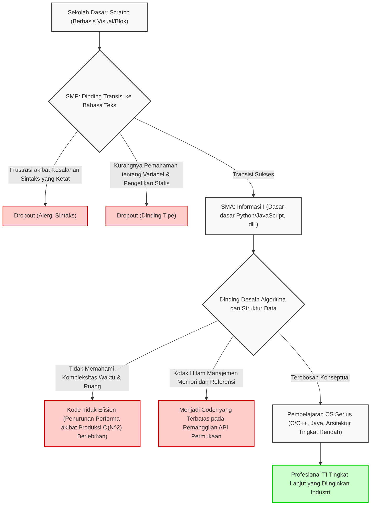
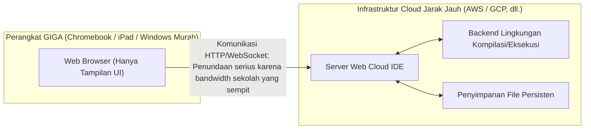
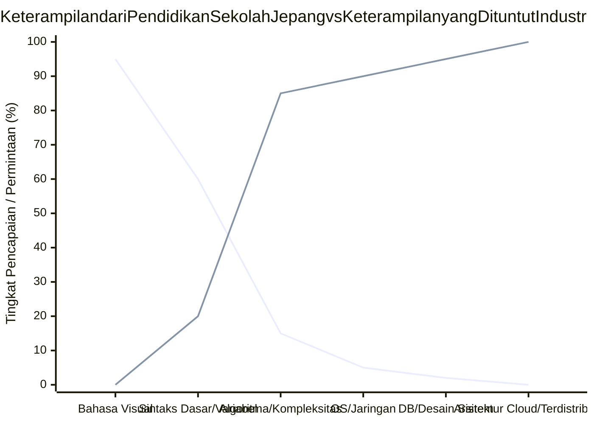

## 1. Pendahuluan: Sisi Terang dan Gelap dari Wajib Belajar Pemrograman

Sejak diwajibkannya pendidikan pemrograman di sekolah dasar pada tahun ajaran 2020, perluasannya dalam mata pelajaran teknologi dan ekonomi rumah tangga di sekolah menengah pertama pada tahun ajaran 2021, hingga diwajibkannya mata pelajaran baru "Informasi I" di sekolah menengah atas pada tahun ajaran 2022, pendidikan TI dan pendidikan informasi di Jepang telah mengalami pergeseran paradigma berskala besar yang belum pernah terjadi sebelumnya dalam beberapa tahun terakhir. Di balik serangkaian kebijakan ini, terdapat tuntutan nasional yang sangat mendesak untuk mengembangkan pemikiran logis (pemikiran komputasional) guna bertahan di era Society 5.0 (masyarakat super pintar) dan untuk mengatasi kekurangan kronis sumber daya manusia TI tingkat lanjut di industri.

Namun, jika kita melihat lebih dekat ke garis depan dunia pendidikan, akan terlihat adanya kesenjangan yang besar antara idealisme yang digambarkan oleh pemerintah dengan kenyataan yang ada. Masalah paling serius adalah bahwa ada kerancuan antara "belajar pemrograman sebagai alat" dan "mempelajari ilmu komputer (computer science) sebagai disiplin akademis". Selanjutnya, ada tantangan struktural yang menumpuk yang harus diselesaikan, seperti keterbatasan teknis karena kendala spesifikasi infrastruktur TI yang dikembangkan secara serentak di seluruh negeri, serta kurangnya keahlian khusus dari para guru yang mengajar.

Artikel ini merangkum "dampak" dari pendidikan pemrograman wajib di Jepang, dan akan menjelaskan secara detail dan teknis mengenai tantangan struktural dan mendasar dari pendidikan TI saat ini dari sudut pandang teori ilmu komputer, keterbatasan arsitektur perangkat keras, dan daya saing industri global. Ini adalah lebih dari sekadar teori pendidikan, melainkan sebuah analisis sepanjang 10.000 karakter yang membahas masa depan Jepang dari perspektif rekayasa perangkat lunak (software engineering).

## 2. Jebakan Pemrograman Visual: Jurang Pemisah yang Dalam dari Scratch ke Pemrograman Teks

Bahasa pemrograman visual (block programming), yang direpresentasikan oleh "Scratch" yang dikembangkan oleh MIT Media Lab, merupakan standar de facto (de facto standard) dalam pendidikan pemrograman di sekolah dasar. Bahasa ini layak diapresiasi tinggi sebagai pengantar pendidikan karena memungkinkan siswa untuk secara visual dan intuitif mempelajari tiga struktur kontrol dasar algoritma: "urutan" (sequence), "percabangan" (selection), dan "pengulangan" (iteration), dengan menggabungkan blok-blok seperti puzzle menggunakan antarmuka grafis yang intuitif.

Namun, ada jebakan besar di sini, yang bisa disebut "jebakan abstraksi" (trap of abstraction). Ada sebuah fakta pahit bahwa "transisi dari pemrograman visual ke bahasa pemrograman berbasis teks (seperti Python, JavaScript, C++, Rust, dll.) sangatlah sulit, dan banyak pelajar yang menyerah (dropout) pada tahap ini."

### Dinding Abstraksi dan Ilmu Komputer sebagai Kotak Hitam (Black Box)

Lingkungan pemrograman visual seperti Scratch sangat mengabstraksi dan dengan sengaja menyembunyikan (mengenkapsulasi) elemen-elemen penting yang membentuk dasar ilmu komputer, seperti sintaks (syntax) pemrograman yang kompleks, sistem tipe yang ketat (type system), dan manajemen siklus memori (memory lifecycle management). Meskipun ini sangat baik untuk mengurangi beban kognitif pada pemula, hal ini menjadi hambatan besar saat beralih ke tahap selanjutnya, yaitu rekayasa perangkat lunak sesungguhnya. Pasalnya, dalam lingkungan pengembangan perangkat lunak yang sebenarnya, pemahaman tentang ruang lingkup variabel (variabel lokal dan global), struktur data kompleks (array, linked list, hash table, binary search tree, graph), operasi pointer, serta pemahaman akan memori heap dan stack sangatlah krusial.

Diagram Mermaid di bawah ini memvisualisasikan rintangan pembelajaran dan titik kegagalan (dropout point) yang dihadapi pemula dalam proses transisi dari pemrograman visual ke ilmu komputer yang sesungguhnya.



Sebagaimana terlihat jelas dari flowchart ini, hanya dengan mengumpulkan pengalaman "menulis kode yang menggerakkan karakter di layar", tidak akan dapat mencetak seorang perekayasa perangkat lunak sejati yang mampu mendesain arsitektur sistem terdistribusi yang terukur (scalable) dan mengoptimalkan performa dalam hitungan milidetik. Ada keterputusan pemahaman konseptual yang mutlak antara menyusun blok-blok Scratch yang berwarna-warni dengan mouse dan memahami kode sumber bahasa C pada kernel Linux serta melacak perilaku tumpukan (stack) TCP/IP. Hal ini tidak bisa disederhanakan sebagai "perbedaan bahasa pemrograman yang digunakan".

## 3. Batas Coding Tanpa "Matematika" dan "Logika Diskrit": Pendekatan dari Teori Kompleksitas

Kelemahan terbesar sekaligus cacat fatal dalam kurikulum pendidikan pemrograman Jepang adalah sangat kurangnya hubungan antara "keterampilan coding" dan "matematika / matematika diskrit (Discrete Mathematics)". Dalam pendidikan ilmu komputer papan atas seperti di Amerika Serikat dan India, lebih banyak penekanan diberikan pada efisiensi algoritma, logika matematika, dan pembuktian matematis, dibandingkan sekadar tata bahasa pemrograman itu sendiri. Pasalnya, kode hanyalah terjemahan dari formula matematika.

### Dominasi Mutlak dari Kompleksitas Waktu dan Ruang (Big O Notation)

Dalam mengevaluasi dan merancang performa perangkat lunak, konsep Kompleksitas Waktu (Time Complexity) dan Kompleksitas Ruang (Space Complexity) tidak dapat dihindari. Notasi asimtotik Landau (Big O Notation) menunjukkan bagaimana waktu eksekusi dan konsumsi memori akan meningkat ketika ukuran data input pada suatu algoritma adalah $N$.

Secara definisi matematis, $f(x) = O(g(x))$ didefinisikan secara ketat sebagai berikut:

$$
\exists C > 0, \exists x_0 > 0, \forall x > x_0, |f(x)| \le C \cdot |g(x)|
$$

Dalam pendidikan informasi di Jepang, misalnya saat mempelajari pengurutan data (sorting), kerap ditemui kasus di mana materi selesai hanya dengan memanggil metode bawaan (built-in) `array.sort()` menggunakan Python. Namun, yang sesungguhnya dituntut dalam teknik informatika adalah memahami dan membuktikan secara matematis mengapa Bubble Sort sederhana hampir tidak pernah digunakan di lingkungan nyata, sedangkan Quick Sort, Merge Sort, atau [Timsort](https://kenji.blog/id/p/sorting-algorithms/) diadopsi sebagai library standar.

Berikut adalah rata-rata kompleksitas waktu dari algoritma pengurutan yang umum digunakan:

- Bubble Sort: $O(N^2)$
- Selection Sort: $O(N^2)$
- Insertion Sort: $O(N^2)$
- Merge Sort: $O(N \log N)$
- Quick Sort: $O(N \log N)$
- Heap Sort: $O(N \log N)$

Sebagai contoh, kompleksitas waktu dari Merge Sort $T(N)$, berdasarkan paradigma bagi dan taklukkan (Divide and Conquer), direpresentasikan oleh relasi rekurensi berikut:

$$
T(N) = 2T\left(\frac{N}{2}\right) + O(N)
$$

Dengan mengekspansi dan menyelesaikan relasi rekurensi ini menggunakan Master Theorem, kita akan mendapatkan kompleksitas ideal $T(N) = O(N \log N)$.

$$
T(N) = \Theta(N \log_2 N)
$$

Dalam analisis big data modern dan pemrosesan lalu lintas skala web (web-scale), nilai $N$ bisa mencapai ukuran masif, yakni ratusan juta atau miliaran. Jika seorang programmer yang tidak paham mengimplementasikan algoritma tidak efisien $O(N^2)$, maka operasi perbandingan akan berulang sebanyak $10^{12}$ (1 triliun) kali untuk data berukuran $N = 10^6$, yang pada akhirnya akan membuat sistem terhenti dan crash. Di sisi lain, jika ia menggunakan $O(N \log N)$, perbandingan hanya akan dilakukan sekitar $2 \times 10^7$ (20 juta) kali. Mengaku "bisa memprogram" tanpa memahami landasan matematika ini layaknya membangun gedung pencakar langit tanpa mengetahui mekanika struktural, yang tentunya sangat berbahaya.

## 4. Manajemen Memori dan Kotak Hitam Arsitektur Sistem

Permasalahan pada tingkat yang lebih dalam adalah kurangnya pemahaman seutuhnya mengenai manajemen memori (Memory Management) dan arsitektur CPU. Pelajar yang hanya mempelajari bahasa pemrograman tingkat tinggi dengan fitur Garbage Collection (GC) seperti Python atau JavaScript—yang kini diajarkan di sekolah—tidak akan pernah menyadari di mana variabel dan objek dialokasikan di dalam memori fisik (RAM), apakah itu di bagian heap atau stack, bagaimana memori itu dialokasikan, serta kapan dan bagaimana memori itu dilepaskan.

```c
// Contoh alokasi memori secara eksplisit dan langsung serta operasi pointer dalam bahasa C
#include <stdio.h>
#include <stdlib.h>

int main() {
    int n = 1000000;
    // Mengalokasikan memori secara berurutan dan dinamis di area heap (Sistem call ke OS)
    int *array = (int*)malloc(n * sizeof(int));
    
    if (array == NULL) {
        fprintf(stderr, "Alokasi memori gagal! Kehabisan memori.\n");
        return 1;
    }
    
    // Inisialisasi array melalui operasi pointer
    for(int i = 0; i < n; i++) {
        *(array + i) = i * 2; // Setara dengan array[i] = i * 2
    }
    
    // Melepas resource secara eksplisit untuk mencegah kebocoran memori (Memory Leak)
    free(array);
    array = NULL; // Mencegah dangling pointer
    
    return 0;
}
```

Konsep pointer (referensi langsung ke alamat memori), penempatan data (Data Locality) untuk memaksimalkan tingkat ketersediaan dari hierarki memori cache CPU (L1/L2/L3 cache), serta pengetahuan terkait kondisi persaingan (Race Condition) dan kontrol eksklusi (Mutex/Semaphore) dalam lingkungan multi-thread adalah suatu keharusan mutlak dalam pengembangan sistem backend berkinerja tinggi, mesin game (game engine) 3D, atau sistem embedded untuk IoT. Sangat disayangkan bahwa kurikulum Kementerian Pendidikan, Budaya, Olahraga, Sains, dan Teknologi (MEXT) saat ini masih terbatas pada "menjalankan aplikasi di permukaan", dan telah sangat menyimpang dari tujuan akademis yang sesungguhnya yaitu "memahami kedalaman ilmu komputer".

## 5. Dinding Basis Data dan Persistensi: Tidak Adanya Aljabar Relasional

Dalam aplikasi modern, penyimpanan dan pencarian (persistensi) data adalah tema yang tidak bisa dihindari. Namun, sebagian besar pendidikan di sekolah masih sebatas "pemrosesan data dalam memori" yang menghilang begitu eksekusi program selesai. Teori matematis di balik Relational Database (RDBMS) dan SQL, yaitu "Aljabar Relasional (Relational Algebra)" yang diusulkan oleh Dr. Edgar F. Codd, jarang diajarkan.

Operasi basis data didefinisikan oleh operasi dasar berikut berdasarkan teori himpunan:

- Seleksi (Selection, $\sigma$): Ekstraksi tupel (baris) yang memenuhi kondisi tertentu.
- Proyeksi (Projection, $\pi$): Ekstraksi atribut (kolom) tertentu.
- Gabungan (Join, $\bowtie$): Perpotongan bersyarat dari beberapa relasi.

Selanjutnya, memahami struktur dari indeks "[B-Tree](https://kenji.blog/id/p/b-tree-database-index-theory/) (Pohon B)" untuk mencari data yang diinginkan dalam sekejap dari sekumpulan catatan yang sangat banyak adalah praktik penerapan struktur data yang sangat baik. B-Tree meminimalkan jumlah I/O pada disk sambil menjamin kecepatan pencarian sebesar $O(\log N)$. Anda tidak dapat membuat sistem yang kuat tanpa mengetahui sifat ACID (Atomicity, Consistency, Isolation, Durability) dari sebuah transaksi.

## 6. Keamanan dan Teori Kriptografi: Infrastruktur Sosial yang Didukung oleh Sulitnya Faktorisasi Prima

Dalam pendidikan literasi informasi, pendidikan keamanan siber masih berada pada tingkat permukaan, seperti "Ayo gunakan kata sandi yang rumit" dan "Jangan klik tautan yang mencurigakan". Sementara itu, matematika dari "Teori Kriptografi", yang menjadi pilar masyarakat internet modern, hampir tidak pernah diajarkan.

Komunikasi HTTPS dan tanda tangan digital yang kita gunakan setiap hari dilindungi oleh kriptografi kunci publik seperti enkripsi RSA. Keamanan enkripsi RSA bergantung pada kesulitan matematika (dianggap sebagai masalah NP-intermediat) bahwa "faktorisasi prima dari bilangan bulat yang sangat besar tidak dapat diselesaikan dalam waktu yang realistis menggunakan komputer klasik saat ini".

Rumus matematika yang menjadi dasar enkripsi RSA adalah penerapan dari fungsi totient Euler dan [Teorema Kecil Fermat](https://kenji.blog/id/p/fermats-little-theorem/) yang indah.

1. Pilih dua bilangan prima besar $p$ dan $q$
2. Hitung $n = p \times q$ (Ini menjadi bagian dari kunci publik)
3. Hitung $\phi(n) = (p-1)(q-1)$
4. Pilih $e$ dan $d$ sedemikian rupa sehingga $e \times d \equiv 1 \pmod{\phi(n)}$
5. Enkripsi: $C \equiv M^e \pmod{n}$
6. Dekripsi: $M \equiv C^d \pmod{n}$

Dengan demikian, pendidikan pemrograman baru akan menunjukkan potensi sebenarnya jika dikaitkan secara erat dengan pendidikan matematika. Proses menerjemahkan persamaan matematika ke dalam kode dan menerapkannya dalam masyarakat adalah inti daya tarik dari sains.

## 7. Batas Keputusasaan dari Infrastruktur dan Visi GIGA School: Chromebook dan Cloud IDE

Saat berbicara tentang pendidikan TI di Jepang, sangat penting untuk menyinggung inisiatif "GIGA School Concept" (Konsep Sekolah GIGA), sebuah proyek nasional yang didorong dengan dana sangat besar oleh Kementerian Pendidikan, Budaya, Olahraga, Sains, dan Teknologi. Inisiatif untuk menyediakan "satu perangkat per siswa" dan lingkungan jaringan berkecepatan tinggi bagi siswa SD dan SMP secara nasional ini diharapkan dapat menjadi katalisator untuk mengejar ketertinggalan di bidang digitalisasi. Namun, spesifikasi perangkat keras dan arsitektur dari perangkat yang sebenarnya didistribusikan telah menjadi penghalang yang serius bagi pendidikan pemrograman skala penuh.

### Perangkat Spesifikasi Rendah dan Kehilangan Lingkungan Pengembangan Lokal

Sebagian besar perangkat yang digunakan sebagai spesifikasi standar Konsep GIGA School adalah perangkat Chromebook, iPad, atau Windows versi lebih murah (entry-level). Spesifikasi standarnya adalah sebagai berikut:

- CPU: Intel Celeron atau prosesor ARM versi murah
- Memori (RAM): 4GB (Kapasitas ini hampir tidak cukup untuk menjalankan OS modern)
- Penyimpanan (eMMC): 32GB ~ 64GB (Kecepatan I/O yang sangat lambat)

Akibat kendala perangkat keras yang sangat minim ini, pada praktiknya mustahil untuk membangun "lingkungan pengembangan lokal" yang biasa digunakan sehari-hari oleh perekayasa (engineer) profesional. Menggunakan Docker untuk menjalankan container Linux, menjalankan IDE yang berat seperti Visual Studio Code dengan fitur penuh, atau memulai server lokal seperti Node.js atau Python dan menginstal library yang berat, akan langsung menyebabkan memori habis dan sistem berhenti (freeze).

Sebagai akibatnya, sekolah-sekolah terpaksa harus bergantung sepenuhnya pada Cloud IDE yang berjalan pada browser (seperti Google Colaboratory, Replit, atau alat web ringan yang disediakan oleh penerbit buku pelajaran).



Ketergantungan penuh pada Cloud IDE menyebabkan hilangnya hal-hal kritis berikut dalam pendidikan:

1. **Ketidakpahaman tentang sistem file dan arsitektur OS**: Karena tidak memiliki lingkungan lokal, peserta didik tidak dapat memahami konsep struktur direktori, path absolut dan relatif, pengaturan variabel lingkungan (environment variables), izin file (file permissions), dan operasi OS lewat antarmuka baris perintah (CLI), yang mana hal tersebut merupakan pemahaman wajib (literasi UNIX) layaknya bernapas bagi perekayasa TI.
2. **Keterlambatan jaringan dan kerentanan infrastruktur**: Mengingat premis utamanya adalah harus selalu terhubung ke jaringan (always-on connection), sering terjadi insiden di berbagai sekolah se-Jepang di mana ketika semua siswa mengakses pada saat yang sama, bandwidth jaringan sekolah akan penuh sesak, dan browser menjadi diam sehingga kegiatan pembelajaran berhenti total.
3. **Hilangnya pengalaman manajemen versi (Git)**: Siswa kehilangan kesempatan untuk menggunakan layar terminal berwarna hitam guna memahami konsep Git atau GitHub, yang diperlukan dalam manajemen riwayat perubahan kode sumber serta pengembangan bersama tim (collaborative development) di seluruh dunia.

Bagi perekayasa perangkat lunak profesional, mengoperasikan terminal (shell) merupakan fondasi yang absolut. Mustahil untuk mengembangkan sumber daya manusia TI yang sesungguhnya tanpa adanya pengalaman langsung menggunakan perintah seperti `ls`, `cd`, `grep`, `chmod`, `git rebase` untuk berinteraksi langsung dengan kernel OS lokal. Hanya dengan bermain di dalam sandbox Chromebook, para pelajar ini takkan pernah berkembang menjadi seorang full-stack engineer yang dapat melihat sistem secara utuh.

## 8. Kesenjangan Mutlak dengan Dunia: Jurang antara Tingkat Tuntutan Industri dan Pendidikan Sekolah

Tantangan terakhir sekaligus yang bisa disebut krisis nasional bagi pendidikan TI di Jepang adalah menurunnya daya saing yang luar biasa tajam dalam konteks global.

### Pendidikan Ilmu Komputer yang Sangat Kompetitif di Negara Lain

Di Inggris (UK), mata pelajaran "Komputasi (Computing)" telah diwajibkan sejak usia 5 tahun (Key Stage 1) sejak tahun 2014. Kurikulum mereka bukan sekadar "pengalaman pemrograman", melainkan mencakup ilmu komputer akademis dan sistematis seutuhnya, termasuk desain algoritma yang logis, pemahaman tentang sirkuit logika dengan aljabar Boolean, topologi jaringan, hingga arsitektur perangkat keras.

Di Amerika Serikat, terdapat standar kurikulum K-12 yang ketat (dari taman kanak-kanak hingga lulus SMA) yang ditetapkan oleh CSTA (Computer Science Teachers Association). Pada kelas Computer Science A AP (Advanced Placement) yang diambil oleh siswa sekolah menengah, mereka dituntut memahami secara mendalam pemrograman berorientasi objek yang otentik menggunakan Java, polimorfisme, pemrosesan rekursif, implementasi struktur data, dan evaluasi kompleksitas algoritma dengan standar tinggi yang setara dengan mahasiswa tingkat pertama di universitas. Kita tak perlu menyebutkan lagi intensitas pendidikan STEM di India maupun Cina, serta banyaknya jumlah elit yang dihasilkan oleh mereka.

### Jurang Kesempatan antara Keterampilan yang Dituntut dan yang Diajarkan

Persyaratan yang dibutuhkan oleh industri modern, khususnya dari mega-venture dan perusahaan teknologi raksasa (seperti GAFAM) untuk lulusan perekayasa perangkat lunak yang baru lulus, semakin meningkat dengan sangat pesat setiap tahunnya. Mereka menuntut keahlian profesional yang mendalam dan luas, seperti pengembangan infrastruktur cloud-native (AWS, GCP, Kubernetes), arsitektur sistem terdistribusi menggunakan layanan mikro (microservices), implementasi alur (pipeline) pembelajaran mesin (machine learning), dan pengetahuan keamanan siber tingkat tinggi.

Grafik berikut ini menggambarkan secara konseptual betapa jauhnya kesenjangan antara tingkat keterampilan yang disediakan dalam pendidikan sekolah di Jepang dengan apa yang dibutuhkan di garis depan dunia industri saat ini.



Untuk menjembatani kesenjangan besar ini (Death Valley), diperlukan sebuah perubahan paradigma fundamental dalam sistem pendidikan sekolah, ditambah dengan investasi yang sangat besar. Mengingat kurangnya jumlah tenaga pengajar khusus jurusan "Informasi" secara nasional, di mana banyak tenaga pengajar dari bidang matematika, sains, atau ekonomi rumah tangga yang hanya mengajar pemrograman sebagai kerja sampingan dan belum mendapatkan pelatihan yang cukup, maka sistem saat ini jelas tak akan mampu menghasilkan perekayasa papan atas kelas dunia.

## 9. Penurunan Nilai "Coding" di Era AI (LLM)

Situasi ini menjadi semakin kompleks dengan menjamurnya asisten pemrograman AI seperti Large Language Model (LLM) semisal ChatGPT dan GitHub Copilot. Di masa kini, AI dapat langsung membuat kode secara sempurna berdasarkan instruksi menggunakan bahasa alami, dan bahkan sekaligus menuliskan kode tes. Nilai jual seorang "Coder", yaitu mereka yang hanya "paham tata bahasa Python" atau "paham cara menjalankan API", telah jatuh drastis.

Yang dibutuhkan dari seorang perekayasa manusia di era AI ini bukanlah kemampuannya untuk menghafal sintaks bahasa pemrograman, melainkan keterampilan berikut:

1. **Definisi Persyaratan dan Pemodelan Domain (Domain Modeling)**: Kemampuan untuk mengekstraksi permasalahan kompleks di dunia nyata dan memodelkannya sebagai sistem.
2. **Desain Arsitektur**: Kemampuan membuat cetak biru seluruh sistem (system blueprint) guna memastikan skalabilitas, ketersediaan, dan pemeliharaannya.
3. **Verifikasi Matematis/Logis**: Kemampuan untuk memverifikasi dan membuktikan secara teoritis bahwa kode yang dihasilkan oleh AI bebas dari celah keamanan atau permasalahan hambatan (bottleneck) yang mengganggu kalkulasi.

Ironisnya, semuanya bukanlah tentang "pemrograman di tingkat permukaan", melainkan ranah yang mendalam dan abstrak pada bidang "ilmu komputer dan matematika". Jika pendidikan Jepang hanya mengajarkan keterampilan "di tahap rendah yang mudah digantikan oleh AI", maka ini akan menjadi sebuah kerugian nasional bagi Jepang.

## 10. Menuju Integrasi Ilmu Matematika dan Pemrograman: Saran bagi Pendidikan Generasi Selanjutnya

Tugas yang mendesak bagi masa depan pendidikan TI di Jepang saat ini adalah menggeser paradigma dari sekadar "menggunakan pemrograman sebagai alat dan tujuan" dan kembali pada "eksplorasi ilmu komputer sebagai ilmu matematika". Bahasa pemrograman hanyalah sekadar sarana untuk mengekspresikan pikiran. Struktur matematis dan logis yang ada di dasarnyalah yang memiliki nilai universal yang takkan pernah pudar meski seiring bergantinya waktu.

Sebagai contoh, landasan inti Artificial Intelligence (AI) dan pembelajaran mesin (machine learning) sangat terkait erat dengan aljabar linier (operasi matriks dan tensor), kalkulus multivariabel (algoritma gradient descent), serta statistik probabilitas (estimasi probabilitas dan teori informasi Bayes). Pengoptimalan beban atau bobot (weight) pada jaringan saraf (neural networks) di ranah deep learning dirumuskan dengan memanfaatkan rantai aturan (Chain Rule) beserta backpropagation dari turunan parsial (partial differentiation).

$$
\frac{\partial L}{\partial w_{ij}^{(l)}} = \frac{\partial L}{\partial z_i^{(l+1)}} \cdot \frac{\partial z_i^{(l+1)}}{\partial w_{ij}^{(l)}} = \delta_i^{(l+1)} \cdot a_j^{(l)}
$$

Sumber daya manusia yang mampu menerjemahkan berbagai perhitungan matematis canggih semacam itu ke dalam bentuk kode seraya mempertimbangkan pengoptimalan perhitungan paralel (Parallel Computing) pada arsitektur perangkat keras seperti GPU (CUDA) maupun TPU, adalah mereka-mereka yang akan memimpin industri TI masa depan. Itulah sebabnya kita harus segera beralih dari pendidikan dangkal yang hanya memaksakan hafalan sintaks belaka, menuju pada sistem pendidikan yang mendalam untuk mempertanyakan prinsip-prinsip dasar (First Principles) perhitungan dari sebuah komputasi.

## 11. Kesimpulan: Jalan Terjal Menuju Negara TI Sejati dan Resolusi Kita

Kewajiban pendidikan pemrograman yang diterapkan di tahun 2020-an merupakan suatu langkah maju yang positif, di mana seluruh lapisan masyarakat Jepang kian sadar akan "pentingnya teknologi informasi". Akan tetapi, itu hanya sebuah langkah "pemanasan" di perjalanan yang masih sangat panjang.

Berangkat dari kesenangan menggerakkan karakter kucing menggunakan Scratch, langkah selanjutnya adalah tentang kekaguman akan keindahan matematis dalam algoritma $O(N \log N)$ serta sensasi berinteraksi dengan peladen (server) yang ada di seluruh dunia via paket komunikasi TCP lewat jendela terminal berwarna hitam. Penting bagi kita untuk mulai membangun kembali infrastruktur pendidikan dan mengatasi keterbatasan perangkat keras dari Konsep GIGA School; melatih sekaligus mendatangkan staf pengajar yang kompeten di bidang CS (Ilmu Komputer), hingga berani merangkul tenaga engineer profesional dari pihak luar (eksternal) untuk bergabung memajukan ekosistem pendidikan sekolah kita.

Permasalahan yang dihadapi pendidikan TI Jepang saat ini amatlah mendalam, mengakar, dan kompleks. Namun, bila pemerintah, akademisi, dan pihak industri tak menutup mata atas isu-isu tersebut dan mulai bekerja sama untuk mengatasinya secara komprehensif, dengan tujuan membangun ekosistem yang dapat terus mencetak "perekayasa (engineer) sejati yang mampu mendesain sistem dari nol" daripada "pekerja yang sekadar bisa menulis kode sesuai buku panduan/spesifikasi", maka di saat itulah Jepang akan kembali mendominasi tingkat global sebagai "Negara TI yang Sejati".

Bagaimana cara kita dalam memperjuangkan fase paling krusial dan sulit, yaitu fase "setelah" diwajibkannya pemrograman? Kini, tekad dan keseriusan kita sebagai orang dewasa tengah diuji.

---

*Dalam artikel ini, kami telah menyoroti batasan infrastruktur pada Konsep GIGA School dan teori-teori mengenai kompleksitas komputasional. Pada artikel-artikel selanjutnya, kami berencana membahas topik yang lebih terperinci mengenai ilmu komputer secara spesifik (seperti algoritma untuk sistem terdistribusi, hingga berbagai macam teknik manajemen memori tingkat rendah).*


