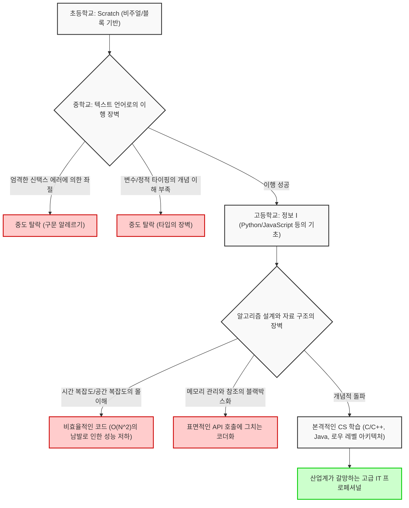
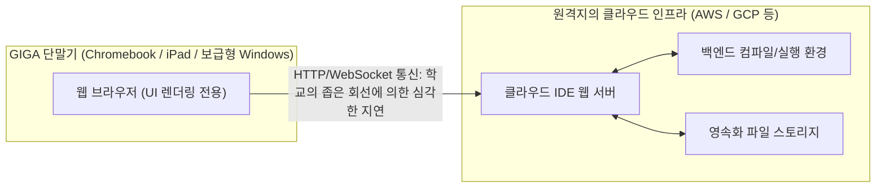

## 1. 서론: 프로그래밍 필수화가 가져온 빛과 그림자

2020년도 초등학교 프로그래밍 교육 필수화, 2021년도 중학교 기술·가정 교과의 확충, 그리고 2022년도 고등학교 새 과목 '정보 Ⅰ'의 필수화 등, 일본의 IT 교육 및 정보 교육은 최근 몇 년간 전례 없는 규모의 패러다임 전환을 경험했습니다. 이러한 일련의 정책 기저에는 Society 5.0(초스마트 사회) 시대를 살아남기 위한 논리적 사고력(프로그래밍적 사고)의 육성과 산업계에서 만성화된 고급 IT 인재 부족 해소라는 극히 절실하고 국가적인 요구가 존재합니다.

그러나 교육 현장의 최전선으로 눈을 돌려보면, 국가가 그린 이상과 현실 사이에 거대한 괴리가 발생하고 있음이 드러나고 있습니다. 가장 심각한 문제는 '프로그래밍이라는 수단을 배우는 것'과 '컴퓨터 사이언스(계산기 과학)라는 학문을 수양하는 것'이 완전히 혼동되고 있다는 점입니다. 게다가 전국적으로 일제히 정비된 IT 인프라의 스펙적 제약에 의한 기술적인 한계, 그리고 지도하는 입장인 교원의 전문적인 스킬셋 부족 등 해결해야 할 구조적인 과제가 산적해 있습니다.

본 기사에서는 일본의 프로그래밍 교육 필수화의 '그 후'를 총괄하고, 현재 진행형으로 직면하고 있는 IT 교육의 본질적이고 구조적인 문제를 컴퓨터 사이언스 이론, 하드웨어 아키텍처의 제약, 그리고 글로벌 산업 경쟁력의 관점에서 극히 상세하고 기술적으로 풀어보고자 합니다. 단순한 교육론에 그치지 않고, 소프트웨어 엔지니어링의 시각에서 일본의 미래를 고찰하는 1만 자에 달하는 논고입니다.

## 2. 비주얼 프로그래밍의 함정: Scratch에서 텍스트 코딩으로 가는 깊고 험난한 골짜기

초등학교 프로그래밍 교육에서 사실상의 표준(디팩토 스탠더드)으로 군림하고 있는 것이 MIT 미디어랩이 개발한 'Scratch'로 대표되는 비주얼 프로그래밍 언어(블록 프로그래밍)입니다. 직관적인 그래픽 인터페이스를 사용하여 퍼즐처럼 블록을 조합함으로써 '순차(시퀀스)', '분기(셀렉션)', '반복(이터레이션)'이라는 알고리즘의 세 가지 기본 제어 구조를 시각적이고 직관적으로 배울 수 있다는 점은 도입 교육으로서 높이 평가받아야 할 위대한 발명입니다.

그러나 여기에는 중대한 함정, 이른바 '추상화의 함정'이 존재합니다. 그것은 '비주얼 프로그래밍에서 텍스트 기반의 본격적인 프로그래밍 언어(Python, JavaScript, C++, Rust 등)로의 이행이 극히 어려워, 많은 학습자가 이 단계에서 좌절하고 만다'는 잔혹한 사실입니다.

### 추상화의 장벽과 컴퓨터 사이언스의 블랙박스화

Scratch를 비롯한 비주얼 프로그래밍 환경은 프로그래밍의 복잡한 구문(신택스), 엄격한 타입 시스템, 메모리의 수명 주기(라이프사이클) 관리 등 컴퓨터 사이언스의 근간을 이루는 중요 요소를 고도로 추상화하여 의도적으로 은닉(캡슐화)하고 있습니다. 이는 초학자의 인지 부하를 낮추는 데에는 뛰어나지만, 다음 단계인 진짜 엔지니어링으로 나아갈 때 거대한 장벽이 됩니다. 실제 소프트웨어 개발 현장에서는 변수의 스코프(로컬 변수와 글로벌 변수), 복잡한 자료 구조(배열, 연결 리스트, 해시 테이블, 이진 탐색 트리, 그래프), 포인터 조작, 그리고 메모리의 힙(Heap) 영역과 스택(Stack) 영역에 대한 이해가 절대적으로 불가결하기 때문입니다.

아래의 Mermaid 다이어그램은 초학자가 비주얼 프로그래밍에서 본격적인 컴퓨터 사이언스로 이행하는 과정에서 직면하는 학습의 장애물과 드롭오프(탈락) 포인트를 시각화한 것입니다.



이 플로우차트에서 명백히 알 수 있듯이, 단순히 '화면 상의 캐릭터를 움직이는 코드를 작성하는 경험'을 쌓는 것만으로는 확장 가능한 분산 시스템 아키텍처를 설계하고 밀리초 단위로 성능을 최적화할 수 있는 진정한 소프트웨어 엔지니어가 육성되지 않습니다. Scratch의 다채로운 블록을 마우스로 조합하는 작업과 Linux 커널의 C언어 소스 코드를 해독하고 TCP/IP 스택의 동작을 추적하는 작업 사이에는 단순한 '사용하는 언어의 차이'라는 말로는 정리할 수 없는, 개념적 이해의 절대적인 단절이 존재하고 있는 것입니다.

## 3. '수학'과 '이산 논리'가 없는 코딩의 한계: 계산 복잡도 이론으로부터의 접근

일본의 프로그래밍 교육 커리큘럼에 있어 최대의 약점이자 치명적인 결함이라고도 할 수 있는 것은 '코딩 기술'과 '수학·이산수학(Discrete Mathematics)' 연계의 압도적인 부족입니다. 미국이나 인도를 비롯한 톱 티어의 컴퓨터 사이언스 교육에서는 프로그래밍 언어의 문법 그 자체보다도 알고리즘의 효율성, 수리논리학, 그리고 수학적 증명에 비중을 둡니다. 코드는 수식의 번역에 불과하기 때문입니다.

### 시간 복잡도와 공간 복잡도(Big O Notation)의 절대적 지배

소프트웨어의 성능을 평가하고 설계하는 데 있어 시간 복잡도(Time Complexity)와 공간 복잡도(Space Complexity)의 개념은 피할 수 없습니다. 어떤 알고리즘에 입력되는 데이터의 크기를 $N$이라 했을 때, 실행 시간이나 소비 메모리가 어떻게 증대되어 가는지를 나타내는 것이 란다우의 점근 표기법(Big O Notation)입니다.

수학적인 정의로서 $f(x) = O(g(x))$는 다음과 같이 엄밀하게 정의됩니다:

$$
\exists C > 0, \exists x_0 > 0, \forall x > x_0, |f(x)| \le C \cdot |g(x)|
$$

일본의 정보 교육에서 예를 들어 데이터의 정렬(소트 처리)을 배울 때, 단순히 Python에서 `array.sort()`라는 빌트인 메서드를 호출하고 끝내버리는 사례가 산견됩니다. 그러나 정보 공학으로서 진정으로 요구되는 것은, 왜 단순한 버블 정렬이 실용 영역에서 결코 사용되지 않으며, 퀵 정렬, 병합 정렬, 혹은 팀 정렬(Timsort)이 표준 라이브러리로 채택되어 있는지를 수학적으로 이해하고 증명하는 것입니다.

아래에 대표적인 정렬 알고리즘의 평균 시간 복잡도를 나타냅니다.

- 버블 정렬 (Bubble Sort): $O(N^2)$
- 선택 정렬 (Selection Sort): $O(N^2)$
- 삽입 정렬 (Insertion Sort): $O(N^2)$
- 병합 정렬 (Merge Sort): $O(N \log N)$
- 퀵 정렬 (Quick Sort): $O(N \log N)$
- 힙 정렬 (Heap Sort): $O(N \log N)$

예를 들어 병합 정렬의 시간 복잡도 $T(N)$은 분할 정복법(Divide and Conquer)의 패러다임에 의해 다음의 점화식으로 표현됩니다.

$$
T(N) = 2T\left(\frac{N}{2}\right) + O(N)
$$

이 재귀적인 점화식을 마스터 정리(Master Theorem)를 사용하여 전개하고 풂으로써 이상적인 계산량인 $T(N) = O(N \log N)$이 도출됩니다.

$$
T(N) = \Theta(N \log_2 N)
$$

현대의 빅데이터 분석이나 웹 스케일의 트래픽 처리에서는 $N$이 수억, 수십억이라는 거대한 오더가 됩니다. 만약 무지한 프로그래머가 $O(N^2)$의 비효율적인 알고리즘을 구현했을 경우, $N = 10^6$의 데이터에 대해 $10^{12}$번(1조 번)이라는 헛된 비교 연산이 필요해져 시스템은 사실상 정지(프리즈)하고 크래시됩니다. 반면 $O(N \log N)$이라면 약 $2 \times 10^7$번(2000만 번)의 연산으로 완료됩니다. 이 잔혹할 정도의 수리적인 뒷받침 없이 '자신은 프로그래밍을 할 수 있다'고 칭하는 것은 구조 역학을 모르고 고층 빌딩을 세우는 것과 같으며, 극히 위험합니다.

## 4. 메모리 관리와 시스템 아키텍처의 블랙박스화

더 깊은 계층의 문제로서, 메모리 관리(Memory Management)와 CPU 아키텍처에 대한 이해가 완전히 빠져 있다는 점을 들 수 있습니다. 현재 학교에서 가르치는 Python이나 JavaScript와 같은 가비지 컬렉션(GC)을 갖춘 고급 언어만을 배운 학습자는 변수나 객체가 물리 메모리(RAM) 상의 어디에 배치되고(힙 영역인지, 스택 영역인지), 어떻게 할당되며, 언제 어떻게 해제되는지를 의식할 일이 평생 없습니다.

```c
// C언어에 있어서 명시적이고 직접적인 메모리 할당과 포인터 조작의 예
#include <stdio.h>
#include <stdlib.h>

int main() {
    int n = 1000000;
    // 힙 영역에 동적으로 메모리를 연속하여 할당 (OS에 대한 시스템 콜)
    int *array = (int*)malloc(n * sizeof(int));
    
    if (array == NULL) {
        fprintf(stderr, "Memory allocation failed! Out of memory.\n");
        return 1;
    }
    
    // 포인터 연산을 통한 배열의 초기화
    for(int i = 0; i < n; i++) {
        *(array + i) = i * 2; // array[i] = i * 2 와 동일
    }
    
    // 메모리 누수(Memory Leak)를 방지하기 위한 명시적인 리소스 해제
    free(array);
    array = NULL; // 댕글링 포인터를 방지
    
    return 0;
}
```

포인터(메모리 주소에 대한 직접 참조)의 개념, CPU의 캐시 메모리 계층(L1/L2/L3 캐시)의 적중률(Hit Rate)을 극한까지 높이기 위한 데이터 배치(Data Locality), 그리고 멀티 스레드 환경에서의 경쟁 상태(Race Condition)와 배타 제어(Mutex/Semaphore)에 대한 지식은 고성능의 백엔드 시스템, 3D 게임 엔진, 혹은 IoT용 임베디드 시스템을 개발하는 데 있어 절대적으로 필요 불가결합니다. 현재 문부과학성의 커리큘럼은 '표면적인 애플리케이션을 구동하는 것'에 그치고 있어, '컴퓨터 사이언스의 심연을 이해한다'는 본래의 학문적 목표에서 크게 벗어나 있다고 하지 않을 수 없습니다.

## 5. 데이터베이스와 영속화의 장벽: 관계 대수의 부재

현대의 애플리케이션에 있어 데이터의 저장과 검색(영속화)은 불가피한 테마입니다. 그러나 학교 교육의 대부분은 프로그램의 실행이 종료되면 사라져버리는 '메모리 상에서의 데이터 처리'에 머물러 있습니다. 관계형 데이터베이스(RDBMS)와 SQL의 배후에 있는 수학적 이론, 즉 에드거 F. 코드 박사가 제창한 '관계 대수(Relational Algebra)'를 가르치는 일은 드뭅니다.

데이터베이스의 연산은 집합론에 기초한 이하의 기본 연산으로 정의됩니다.

- 선택 (Selection, $\sigma$): 조건을 만족하는 튜플(행)의 추출
- 추출 (Projection, $\pi$): 특정 속성(열)의 추출
- 조인 (Join, $\bowtie$): 복수 릴레이션의 조건부 교차

더욱이 방대한 레코드에서 순식간에 목적하는 데이터를 검색하기 위한 'B-Tree(B트리) 인덱스'의 구조를 배우는 것은 자료 구조 응용의 최고의 실천입니다. B-Tree는 디스크 I/O 횟수를 최소화하면서 $O(\log N)$의 검색 속도를 보장합니다. 트랜잭션의 ACID 특성(Atomicity, Consistency, Isolation, Durability)을 알지 못하고서는 견고한 시스템을 만들 수 없습니다.

## 6. 보안과 암호 이론: 소인수분해의 곤란성이 지탱하는 사회 인프라

정보 리터러시 교육에서 '비밀번호를 복잡하게 하자', '수상한 링크를 클릭하지 말자'와 같은 표면적인 보안 교육은 이루어지고 있지만, 인터넷 사회를 근저에서 지탱하고 있는 '암호 이론'의 수리를 가르치는 일은 거의 없습니다.

우리가 매일 이용하고 있는 HTTPS 통신이나 전자 서명은 RSA 암호 등의 공개키 암호 방식에 의해 보호받고 있습니다. RSA 암호의 안전성은 '거대한 정수의 소인수분해는 현재의 고전 컴퓨터로는 현실적인 시간 내에 풀 수 없다'는 수학적 곤란성(NP-중간 문제로 여겨짐)에 의존하고 있습니다.

RSA 암호의 기초가 되는 수식은 오일러의 피 함수(Totient function)와 [페르마의 소정리](https://kenji.blog/ko/p/fermats-little-theorem/)를 응용한 아름다운 것입니다.

1. 2개의 거대한 소수 $p$와 $q$를 고른다
2. $n = p \times q$를 계산한다 (이것이 공개키의 일부가 된다)
3. $\phi(n) = (p-1)(q-1)$을 계산한다
4. $e \times d \equiv 1 \pmod{\phi(n)}$이 되는 $e$와 $d$를 고른다
5. 암호화: $C \equiv M^e \pmod{n}$
6. 복호화: $M \equiv C^d \pmod{n}$

이처럼 프로그래밍 교육은 수학 교육과 밀접하게 결합될 때 비로소 진정한 위력을 발휘합니다. 수식을 코드에 떨어뜨리고 사회에 구현하는 과정이야말로 사이언스의 묘미인 것입니다.

## 7. GIGA 스쿨 구상과 인프라의 절망적인 한계: Chromebook과 클라우드 IDE

일본의 IT 교육을 이야기하는 데 있어 빼놓을 수 없는 것이 문부과학성이 거액의 예산을 투입해 추진한 'GIGA 스쿨 구상'입니다. 전국의 초중학생에게 '1인 1대 단말기'와 고속 네트워크 환경을 정비하는 이 국가 프로젝트는 디지털화의 지연을 만회할 기폭제로서 기대받았습니다. 그러나 실제로 배포된 단말기의 하드웨어 스펙과 아키텍처가 본격적인 프로그래밍 교육의 심각한 족쇄가 되고 있습니다.

### 저사양 단말기와 로컬 개발 환경의 상실

GIGA 스쿨 구상의 표준 사양으로 도입된 단말기의 대부분은 극히 저렴한 Chromebook, iPad, 혹은 보급형 Windows 디바이스입니다. 그 표준적인 스펙은 다음과 같습니다.

- CPU: Intel Celeron 또는 보급형 ARM 프로세서
- 메모리 (RAM): 4GB (현대의 OS를 구동하는 것만으로도 빠듯한 용량)
- 스토리지 (eMMC): 32GB ~ 64GB (극단적으로 느린 I/O 속도)

이 빈약한 하드웨어 제약으로 인해, 프로 엔지니어가 일상적으로 수행하는 '로컬 개발 환경'을 구축하는 것은 사실상 불가능합니다. Docker를 사용해 Linux 컨테이너를 띄우거나, Visual Studio Code 등의 무거운 IDE를 전체 기능으로 작동시키거나, Node.js나 Python 로컬 서버를 기동해 무거운 라이브러리를 설치하는 것은 메모리의 고갈과 시스템 프리즈를 즉시 초래합니다.

결과적으로 교육 현장에서는 브라우저 상에서 동작하는 클라우드 IDE(Google Colaboratory, Replit, 혹은 교과서 회사 독자적인 경량 웹 툴 등)에 전면적으로 의존할 수밖에 없는 상황에 몰리고 있습니다.



클라우드 IDE에 대한 완전한 의존은 교육상 다음과 같은 극히 중대한 결손을 야기합니다.

1. **파일 시스템과 OS 아키텍처의 몰이해**: 로컬 환경을 갖지 않기 때문에, 디렉터리 구조, 절대 경로와 상대 경로의 개념, 환경 변수의 설정, 파일 권한(퍼미션), 그리고 CLI(명령줄 인터페이스)에서의 OS 조작 등, IT 엔지니어로서 숨 쉬듯 다루어야 할 필수 지식(UNIX 리터러시)이 전혀 몸에 배지 않습니다.
2. **네트워크 지연과 인프라의 취약성**: 상시 접속을 전제로 하기 때문에 전교생이 일제히 접속한 순간 학교의 네트워크 대역폭이 핍박해져, 브라우저가 멈추고 학습이 완전히 정지되는 인시던트가 전국에서 다발하고 있습니다.
3. **버전 관리(Git) 경험의 박탈**: 소스 코드의 변경 이력을 관리하고, 전 세계의 팀과 협조 개발을 수행하기 위한 Git이나 GitHub의 개념을 검은 터미널 화면을 통해 주입할 기회를 빼앗깁니다.

프로 소프트웨어 엔지니어가 개발을 수행할 때 터미널(셸)에서의 조작은 절대적인 기반입니다. `ls`, `cd`, `grep`, `chmod`, `git rebase` 등의 명령어를 치고, 로컬의 OS 커널과 직접 대화하는 진흙투성이의 경험 없이, 진정한 IT 인재 육성은 절대로 이루어낼 수 없습니다. Chromebook의 모래밭(샌드박스) 안에서만 놀고 있어서는 시스템 전체를 바라보는 풀스택 엔지니어가 태어나지 않는 것입니다.

## 8. 세계와의 절망적인 갭: 산업계의 요구 수준과 학교 교육의 괴리

일본의 IT 교육이 직면한 마지막, 그리고 국가적인 위기라고 할 수 있는 과제는 글로벌 콘텍스트에 있어서의 압도적인 경쟁력 저하입니다.

### 여러 국가에 있어서의 치열한 컴퓨터 사이언스 교육

영국(UK)에서는 일찍이 2014년부터 'Computing'이라는 교과가 5세(Key Stage 1)부터 필수화되었습니다. 그들의 커리큘럼은 단순한 '프로그래밍 경험'에 그치지 않고, 알고리즘의 논리적 설계, 불 대수(Boolean algebra)에 의한 논리 회로의 이해, 네트워크 토폴로지, 하드웨어 아키텍처에 이르기까지 지극히 아카데믹하고 체계적인 본격적 컴퓨터 사이언스를 다룹니다.

미국의 경우, CSTA(Computer Science Teachers Association)가 정하는 K-12(유치원부터 고등학교 졸업까지)의 엄밀한 표준 커리큘럼이 존재하며, 고등학생이 이수하는 AP(Advanced Placement) Computer Science A에서는 Java를 사용한 본격적인 객체 지향 프로그래밍, 다형성(Polymorphism), 재귀 처리, 자료 구조의 구현, 그리고 알고리즘의 복잡성 평가가 대학교 1학년 수준의 높은 수준으로 요구됩니다. 인도나 중국에 있어서의 STEM 교육의 가혹함과 그곳에서 배출되는 엘리트층의 두터움은 새삼 언급할 필요도 없습니다.

### 요구되는 스킬과 가르치는 스킬의 절망적인 괴리

현대의 산업계, 특히 글로벌하게 전개하는 메가 벤처나 테크 자이언트(GAFAM 등)가 신입 소프트웨어 엔지니어에게 요구하는 요건은 매년 무서운 속도로 고도화되고 있습니다. 클라우드 네이티브 인프라(AWS, GCP, Kubernetes)의 구축, 마이크로서비스 아키텍처의 분산 시스템 설계, 머신러닝 파이프라인의 구현, 그리고 고도의 보안 지식 등 광범위하고 깊은 전문성이 요구됩니다.

아래의 그래프는 현재 일본의 학교 교육에서 제공되고 있는 스킬의 달성도와 최전선의 산업계가 요구하는 스킬 수준과의 절망적인 괴리를 개념적으로 나타내고 있습니다.

```mermaid
xychart-beta
    title 일본의 학교 교육에서 제공되는 스킬 vs 산업계의 요구 스킬 수준
    x-axis ["비주얼 언어", "기본 구문/변수", "알고리즘/복잡도", "OS/네트워크", "DB/시스템 설계", "클라우드/분산 아키텍처"]
    y-axis "달성도 / 요구도 (%)" 0 --> 100
    line "현재 학교 교육에서의 도달 수준" [95, 60, 15, 5, 2, 0]
    line "산업계/테크 기업이 요구하는 수준" [0, 20, 85, 90, 95, 100]
```

이 거대한 갭(Death Valley)을 메우기 위해서는 학교 교육에 대한 발본적인 패러다임 전환과 막대한 투자가 필요합니다. '정보과' 전문 교원이 전국적으로 압도적으로 부족한 가운데, 수학과나 이과 혹은 기술·가정 교원이 본래 업무의 짬을 내어 연수도 불충분한 채 프로그래밍을 가르치고 있는 현재의 체제로는 세계에서 싸울 수 있는 톱 티어의 엔지니어를 절대로 배출할 수 없습니다.

## 9. AI 시대(LLM)에 있어서 '코딩' 가치의 폭락

상황을 더욱 복잡하게 만들고 있는 것이 ChatGPT로 대표되는 대규모 언어 모델(LLM)이나 GitHub Copilot과 같은 AI 코딩 어시스턴트의 폭발적인 보급입니다. AI가 자연어 지시로부터 순식간에 완벽한 코드를 생성하고 테스트 코드까지 작성해 내는 현대에 있어, 단순히 'Python의 문법을 안다', 'API를 호출하는 방법을 안다'뿐인 이른바 '코더(Coder)'의 시장 가치는 급속히 폭락하고 있습니다.

AI 시대에 인간 엔지니어에게 요구되는 것은 프로그래밍 언어의 구문 기억력이 아닙니다. 그것은 다음과 같은 능력입니다.

1. **요구사항 정의와 도메인 모델링**: 해결해야 할 복잡한 현실의 과제를 추출하고 시스템으로 모델화하는 능력.
2. **아키텍처 설계**: 확장성(Scalability), 가용성(Availability), 유지보수성(Maintainability)을 담보하는 시스템 전체의 설계도를 그리는 능력.
3. **수리적·논리적 검증**: AI가 생성한 코드에 보안 홀이나 계산량의 병목 현상이 없는지 이론적으로 검증하고 증명하는 능력.

아이러니하게도 이들은 모두 '표면적인 프로그래밍'이 아니라, 깊고 추상적인 '컴퓨터 사이언스와 수학'의 영역입니다. 일본의 교육이 'AI로 대체되기 쉬운 하류 공정의 스킬'만을 가르치고 있다고 한다면, 그것은 국가적인 손실이라고 하지 않을 수 없습니다.

## 10. 수리 과학과 프로그래밍의 융합을 향하여: 차세대 교육에 대한 제언

앞으로의 일본 IT 교육에 있어 급선무가 되는 것은 '프로그래밍의 목적화·수단화'에서 탈피하여 '수리 과학으로서의 컴퓨터 사이언스의 탐구'로 회귀를 도모하는 것입니다. 프로그래밍 언어는 단순한 사고를 표현하기 위한 도구에 지나지 않으며, 그 근저에 있는 수학적·논리적 구조야말로 시대가 변해도 퇴색되지 않는 보편적인 가치를 지닙니다.

예를 들어 인공지능(AI)이나 머신러닝의 근간에는 선형대수(행렬 연산이나 텐서), 다변수 미적분(경사하강법), 확률통계(베이즈 추정이나 정보량)가 밀접하게 얽혀 있습니다. 딥러닝의 신경망에 있어서 가중치의 최적화는 편미분을 이용한 연쇄 법칙(Chain Rule)과 오차역전파법(Backpropagation)에 의해 정식화됩니다.

$$
\frac{\partial L}{\partial w_{ij}^{(l)}} = \frac{\partial L}{\partial z_i^{(l+1)}} \cdot \frac{\partial z_i^{(l+1)}}{\partial w_{ij}^{(l)}} = \delta_i^{(l+1)} \cdot a_j^{(l)}
$$

이러한 고도의 수식을 코드에 떨어뜨리고, GPU(CUDA)나 TPU의 하드웨어 아키텍처를 의식하여 병렬 컴퓨팅(Parallel Computing)을 극한까지 최적화해 구현할 수 있는 인재야말로 차세대 IT 산업을 견인하는 것입니다. 그렇기 때문에 표면적인 구문을 통째로 암기시킬 뿐인 천박한 교육에서 탈피하여, 계산의 원리원칙(First Principles)을 묻는 깊이 있는 교육으로 즉시 키를 돌려야만 합니다.

## 11. 결론: 진정한 IT 국가로의 험난한 여정과 우리의 각오

2020년대의 프로그래밍 교육 필수화는 일본 사회 전체에 'IT와 정보의 중요성'을 널리 인지시켰다는 점에 있어서 확실한 첫걸음이었음은 틀림없습니다. 그러나 그것은 긴 여정에 있어서 단순한 '준비 체조'에 불과합니다.

Scratch로 고양이 캐릭터를 움직이는 즐거움에서 한 걸음 내디뎌, $O(N \log N)$ 알고리즘의 수학적인 아름다움에 감동하고, 터미널의 검은 화면에서 TCP 패킷을 통해 전 세계의 서버와 대화하는 흥분을 가르치는 것. GIGA 스쿨 구상의 하드웨어 제약을 뛰어넘기 위한 새로운 교육 인프라스트럭처를 재구축하고, 고도의 CS 전문성을 갖춘 지도자를 육성·배치하며, 때로는 외부의 프로페셔널 엔지니어를 학교 교육에 대담하게 끌어들이는 것.

일본의 IT 교육이 직면하고 있는 과제는 지극히 깊고 뿌리 깊으며 복잡합니다. 그러나 이러한 과제를 외면하지 않고 산학관이 진심으로 연계하여 해결에 임해, '사양서대로 코드를 작성할 줄만 아는 노동자'가 아니라 '제로에서 시스템을 설계하고 창조할 수 있는 진짜 엔지니어'를 지속적으로 배출할 수 있는 생태계(에코시스템)를 구축할 수 있었을 때, 일본은 진정한 의미의 IT 입국으로서 다시 세계를 리드할 수 있을 것입니다.

프로그래밍 필수화의 '그 후'라는 가장 곤란하고 중요한 페이즈를 어떻게 싸워 나갈 것인가. 지금 바로 우리 어른들의 진정성과 각오를 시험받고 있는 것입니다.

---

*본 기사에서는 계산 복잡도 이론이나 GIGA 스쿨 구상의 인프라적 한계에 대해 개설했습니다. 나아가 전문적인 컴퓨터 사이언스의 토픽(분산 시스템의 알고리즘이나 로우 레벨의 메모리 관리 기법의 상세 등)에 대해서는 향후의 연재에서 순차적으로 다루어 갈 예정입니다.*


