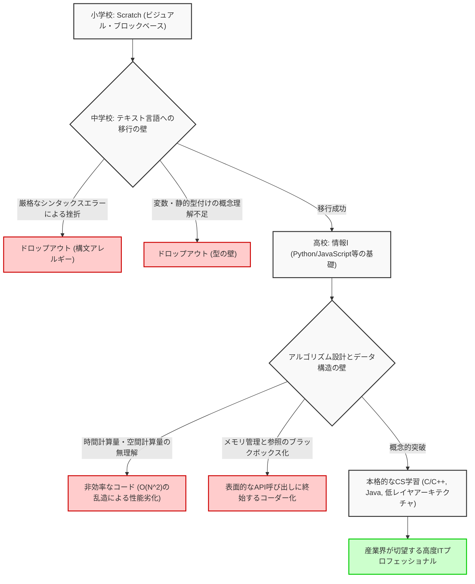
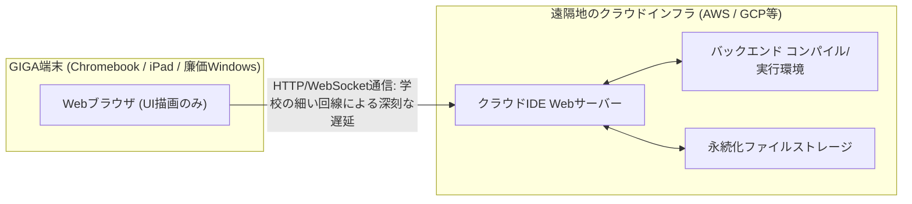

## 1. はじめに：プログラミング必修化がもたらした光と影

2020年度の小学校におけるプログラミング教育の必修化、2021年度の中学校での技術・家庭科における拡充、そして2022年度の高等学校における新科目「情報Ⅰ」の必修化と、日本のIT教育および情報教育はここ数年でかつてない規模のパラダイムシフトを経験しました。この一連の政策の根底には、Society 5.0（超スマート社会）時代を生き抜くための論理的思考力（プログラミング的思考）の育成と、産業界で慢性化している高度IT人材不足の解消という、極めて切実かつ国家的な要請が存在しています。

しかしながら、教育現場の最前線に目を向けると、国が描いた理想と現実の間に巨大な乖離が生じていることが浮き彫りになってきています。最も深刻な問題は、「プログラミングという手段を学ぶ」ことと「コンピュータサイエンス（計算機科学）という学問を修める」ことが完全に混同されている点です。さらに、全国一斉に整備されたITインフラのスペック的な制約による技術的な限界、そして指導する側である教員の専門的スキルセットの不足など、解決すべき構造的な課題は山積しています。

本記事では、日本のプログラミング教育必修化の「その後」を総括し、現在進行形で直面しているIT教育の本質的かつ構造的な問題を、コンピュータサイエンスの理論、ハードウェアアーキテクチャの制約、そしてグローバルな産業競争力の観点から、極めて詳細かつ技術的に解き明かしていきます。単なる教育論にとどまらず、ソフトウェアエンジニアリングの視点から日本の未来を考察する1万文字に及ぶ論考です。

## 2. ビジュアルプログラミングの罠：Scratchからテキストコーディングへの深く険しい溝

小学校のプログラミング教育においてデファクトスタンダードとして君臨しているのが、MITメディアラボが開発した「Scratch」に代表されるビジュアルプログラミング言語（ブロックプログラミング）です。直感的なグラフィカルインターフェースを用いて、パズルのようにブロックを組み合わせることで、「順次（シーケンス）」「分岐（セレクション）」「反復（イテレーション）」というアルゴリズムの3つの基本制御構造を視覚的かつ直感的に学べる点は、導入教育として高く評価されるべき偉大な発明です。

しかし、ここには重大な落とし穴、いわば「抽象化の罠」が存在します。それは、「ビジュアルプログラミングからテキストベースの本格的なプログラミング言語（Python, JavaScript, C++, Rustなど）への移行が極めて困難であり、多くの学習者がこの段階で挫折してしまう」という残酷な事実です。

### 抽象化の壁とコンピュータサイエンスのブラックボックス化

Scratchをはじめとするビジュアルプログラミング環境は、プログラミングの複雑な構文（シンタックス）、厳密な型システム（タイプシステム）、メモリのライフサイクル管理といった、コンピュータサイエンスの根幹を成す重要要素を高度に抽象化し、意図的に隠蔽（カプセル化）しています。これは初学者の認知負荷を下げるためには優れていますが、次のステップである本物のエンジニアリングへ進む際の巨大な障壁となります。実際のソフトウェア開発現場では、変数のスコープ（ローカル変数とグローバル変数）、複雑なデータ構造（配列、連結リスト、ハッシュテーブル、二分探索木、グラフ）、ポインタ操作、そしてメモリのヒープ領域・スタック領域の理解が絶対に不可欠だからです。

以下のMermaid図は、初学者がビジュアルプログラミングから本格的なコンピュータサイエンスへと移行する過程で直面する、学習のハードルとドロップオフ（脱落）ポイントを視覚化したものです。



このフローチャートから明白なように、単に「画面上のキャラクターを動かすコードを書く体験」を積むだけでは、スケーラブルな[分散システム](https://kenji.blog/p/cap-theorem-distributed-systems/)アーキテクチャを設計し、パフォーマンスをミリ秒単位で最適化できる真のソフトウェアエンジニアは育ちません。Scratchのカラフルなブロックをマウスで組み合わせる作業と、LinuxカーネルのC言語ソースコードを読み解き、TCP/IPスタックの挙動を追跡する作業の間には、単なる「使用する言語の違い」という言葉では片付けられない、概念的理解の絶対的な断絶が存在しているのです。

## 3. 「数学」と「離散論理」なきコーディングの限界：計算量理論からのアプローチ

日本のプログラミング教育カリキュラムにおける最大の弱点であり、致命的な欠陥とも言えるのが、「コーディング技術」と「数学・離散数学（Discrete Mathematics）」の連携の圧倒的な不足です。米国やインドをはじめとするトップティアのコンピュータサイエンス教育では、プログラミング言語の文法そのものよりも、アルゴリズムの効率性、数理論理学、そして数学的証明に重きが置かれます。コードは数式の翻訳に過ぎないからです。

### 時間計算量と空間計算量（Big O Notation）の絶対的支配

ソフトウェアの性能を評価・設計する上で、時間計算量（Time Complexity）と空間計算量（Space Complexity）の概念は避けて通れません。あるアルゴリズムに入力されるデータサイズを $N$ としたとき、実行時間や消費メモリがどのように増大していくかを示すのが、ランダウの漸近記法（Big O Notation）です。

数学的な定義として、$f(x) = O(g(x))$ は次のように厳密に定義されます：

$$
\exists C > 0, \exists x_0 > 0, \forall x > x_0, |f(x)| \le C \cdot |g(x)|
$$

日本の情報教育において、例えばデータの並び替え（[ソート](https://kenji.blog/p/sorting-algorithms/)処理）を学ぶ際、単にPythonで `array.sort()` というビルトインメソッドを呼んで終わりにしてしまうケースが散見されます。しかし、情報工学として真に求められるのは、なぜ単純な[バブル[ソート](https://kenji.blog/p/sorting-algorithms/)](https://kenji.blog/p/sorting-algorithms/)が実用領域で決して使われず、[クイック[ソート](https://kenji.blog/p/sorting-algorithms/)](https://kenji.blog/p/sorting-algorithms/)、[マージ[ソート](https://kenji.blog/p/sorting-algorithms/)](https://kenji.blog/p/sorting-algorithms/)、あるいは[ティム[ソート](https://kenji.blog/p/sorting-algorithms/)](https://kenji.blog/p/sorting-algorithms/)（[Timsort](https://kenji.blog/p/sorting-algorithms/)）が標準ライブラリとして採用されているのかを、数学的に理解し証明することです。

以下に代表的な[[ソート](https://kenji.blog/p/sorting-algorithms/)アルゴリズム](https://kenji.blog/p/sorting-algorithms/)の平均時間計算量を示します。

- [バブル[ソート](https://kenji.blog/p/sorting-algorithms/)](https://kenji.blog/p/sorting-algorithms/) (Bubble Sort): $O(N^2)$
- 選択[ソート](https://kenji.blog/p/sorting-algorithms/) (Selection Sort): $O(N^2)$
- [挿入[ソート](https://kenji.blog/p/sorting-algorithms/)](https://kenji.blog/p/sorting-algorithms/) (Insertion Sort): $O(N^2)$
- [マージ[ソート](https://kenji.blog/p/sorting-algorithms/)](https://kenji.blog/p/sorting-algorithms/) (Merge Sort): $O(N \log N)$
- [クイック[ソート](https://kenji.blog/p/sorting-algorithms/)](https://kenji.blog/p/sorting-algorithms/) (Quick Sort): $O(N \log N)$
- [ヒープ[ソート](https://kenji.blog/p/sorting-algorithms/)](https://kenji.blog/p/sorting-algorithms/) (Heap Sort): $O(N \log N)$

例えば、[マージ[ソート](https://kenji.blog/p/sorting-algorithms/)](https://kenji.blog/p/sorting-algorithms/)の時間計算量 $T(N)$ は、分割統治法（Divide and Conquer）のパラダイムにより、以下の漸化式で表現されます。

$$
T(N) = 2T\left(\frac{N}{2}\right) + O(N)
$$

この再帰的な漸化式をマスター定理（Master Theorem）を用いて展開し解くことで、理想的な計算量である $T(N) = O(N \log N)$ が導出されます。

$$
T(N) = \Theta(N \log_2 N)
$$

現代のビッグデータ解析やWebスケールのトラフィック処理においては、$N$ が数億、数十億という巨大なオーダーになります。もし無知なプログラマが $O(N^2)$ の非効率なアルゴリズムを実装した場合、$N = 10^6$ のデータに対して $10^{12}$ 回（1兆回）もの無駄な比較演算が必要となり、システムは事実上フリーズし、クラッシュします。一方、$O(N \log N)$ であれば約 $2 \times 10^7$ 回（2000万回）の演算で完了します。この残酷なまでの数理的な裏付けなしに「自分はプログラミングができる」と称するのは、構造力学を知らずに高層ビルを建てるようなものであり、極めて危険です。

## 4. メモリ管理とシステムアーキテクチャのブラックボックス化

さらに深いレイヤの問題として、メモリ管理（Memory Management）とCPUアーキテクチャの理解が完全に抜け落ちている点が挙げられます。現在学校で教えられているPythonやJavaScriptといったガベージコレクション（GC）を備えた高水準言語だけを学んだ学習者は、変数やオブジェクトが物理メモリ（RAM）上のどこに配置され（ヒープ領域か、スタック領域か）、どのように割り当てられ、いつどのように解放されるのかを意識することが一生ありません。

```c
// C言語における明示的かつ直接的なメモリ割り当てとポインタ操作の例
#include <stdio.h>
#include <stdlib.h>

int main() {
    int n = 1000000;
    // ヒープ領域に動的にメモリを連続して割り当て (OSへのシステムコール)
    int *array = (int*)malloc(n * sizeof(int));
    
    if (array == NULL) {
        fprintf(stderr, "Memory allocation failed! Out of memory.\n");
        return 1;
    }
    
    // ポインタ演算による配列の初期化
    for(int i = 0; i < n; i++) {
        *(array + i) = i * 2; // array[i] = i * 2 と等価
    }
    
    // メモリリーク（Memory Leak）を防止するための明示的なリソース解放
    free(array);
    array = NULL; // ダングリングポインタを防ぐ
    
    return 0;
}
```

ポインタ（メモリアドレスへの直接参照）の概念、CPUのキャッシュメモリ階層（L1/L2/L3キャッシュ）のヒット率を極限まで高めるためのデータ配置（Data Locality）、そしてマルチスレッド環境における競合状態（Race Condition）と排他制御（Mutex/Semaphore）の知識は、高パフォーマンスなバックエンドシステム、3Dゲームエンジン、あるいはIoT向けの組み込みシステムを開発する上で絶対に必要不可欠です。現在の文部科学省のカリキュラムは「表面的なアプリケーションを動かす」ことに終始しており、「コンピュータサイエンスの深淵を理解する」という本来の学問的目標から大きく逸脱していると言わざるを得ません。

## 5. データベースと永続化の壁：リレーショナル代数の不在

現代のアプリケーションにおいて、データの保存と検索（永続化）は不可避のテーマです。しかし、学校教育の多くは、プログラムの実行が終了すると消えてしまう「メモリ上でのデータ処理」に留まっています。リレーショナルデータベース（RDBMS）とSQLの背後にある数学的理論、すなわちエドガー・F・コッド博士によって提唱された「リレーショナル代数（Relational Algebra）」が教えられることは稀です。

データベースの演算は、集合論に基づく以下の基本演算で定義されます。

- 選択（Selection, $\sigma$）: 条件を満たすタプル（行）の抽出
- 射影（Projection, $\pi$）: 特定の属性（列）の抽出
- 結合（Join, $\bowtie$）: 複数のリレーションの条件付き交差

さらに、膨大なレコードから一瞬で目的のデータを検索するための「[B-Tree](https://kenji.blog/p/b-tree-database-index-theory/)（[B木](https://kenji.blog/p/b-tree-database-index-theory/)）インデックス」の構造を学ぶことは、データ構造の応用として最高の実践です。B-Treeは、ディスクI/Oの回数を最小限に抑えつつ、$O(\log N)$ の検索速度を保証します。トランザクションのACID特性（Atomicity, Consistency, Isolation, Durability）を知らずして、堅牢なシステムを作ることはできません。

## 6. セキュリティと暗号理論：素因数分解の困難性が支える社会インフラ

情報リテラシー教育において「パスワードを複雑にしよう」「怪しいリンクを踏まないようにしよう」という表面的なセキュリティ教育は行われていますが、インターネット社会を根底から支えている「暗号理論」の数理が教えられることはほとんどありません。

私たちが毎日利用しているHTTPS通信や電子署名は、RSA暗号などの公開鍵暗号方式によって守られています。RSA暗号の安全性は、「巨大な整数の素因数分解は、現在の古典コンピュータでは現実的な時間内に解くことができない」という数学的困難性（NP中間問題と考えられている）に依存しています。

RSA暗号の基礎となる数式は、[オイラー](https://kenji.blog/p/euler/)のトーティエント関数と[フェルマーの小定理](https://kenji.blog/p/fermats-little-theorem/)を応用した美しいものです。

1. 2つの巨大な素数 $p$ と $q$ を選ぶ
2. $n = p \times q$ を計算する（これが公開鍵の一部となる）
3. $\phi(n) = (p-1)(q-1)$ を計算する
4. $e \times d \equiv 1 \pmod{\phi(n)}$ となるような $e$ と $d$ を選ぶ
5. 暗号化: $C \equiv M^e \pmod{n}$
6. 復号化: $M \equiv C^d \pmod{n}$

このように、プログラミング教育は数学教育と密接に結びついて初めて真の威力を発揮します。数式をコードに落とし込み、社会実装するプロセスこそがサイエンスの醍醐味なのです。

## 7. GIGAスクール構想とインフラの絶望的な限界：ChromebookとクラウドIDE

日本のIT教育を語る上で欠かせないのが、文部科学省が巨額の予算を投じて推進した「GIGAスクール構想」です。全国の小中学生に「1人1台端末」と高速ネットワーク環境を整備するこの国家プロジェクトは、デジタル化の遅れを取り戻す起爆剤として期待されました。しかし、実際に配布された端末のハードウェアスペックとアーキテクチャが、本格的なプログラミング教育の深刻な足枷となっています。

### 低スペック端末とローカル開発環境の喪失

GIGAスクール構想の標準仕様として導入された端末の多くは、極めて安価なChromebook、iPad、あるいは廉価版のWindowsデバイスです。その標準的なスペックは以下の通りです。

- CPU: Intel Celeron または 廉価版ARMプロセッサ
- メモリ (RAM): 4GB （現代のOSを動かすだけでギリギリの容量）
- ストレージ (eMMC): 32GB ～ 64GB （極端に遅いI/O速度）

この貧弱なハードウェア制約により、プロのエンジニアが日常的に行う「ローカル開発環境」を構築することは事実上不可能です。Dockerを用いてLinuxコンテナを立ち上げたり、Visual Studio Code等の重厚なIDEをフル機能で動作させたり、Node.jsやPythonのローカルサーバーを起動して重いライブラリをインストールすることは、メモリの枯渇とシステムフリーズを直ちに招きます。

結果として、教育現場ではブラウザ上で動作するクラウドIDE（Google Colaboratory, Replit, あるいは教科書会社独自の軽量Webツールなど）に全面的に依存せざるを得ない状況に追い込まれています。



クラウドIDEへの完全依存は、教育上、以下の極めて重大な欠落を引き起こします。

1. **ファイルシステムとOSアーキテクチャの無理解**: ローカル環境を持たないため、ディレクトリ構造、絶対パス・相対パスの概念、環境変数の設定、ファイルパーミッション、そしてCLI（コマンドラインインターフェース）でのOS操作といった、ITエンジニアとして息をするように扱うべき必須知識（UNIXリテラシー）が全く身につきません。
2. **ネットワーク遅延とインフラの脆弱性**: 常時接続を前提とするため、全校生徒が一斉にアクセスした瞬間に学校のネットワーク帯域が逼迫し、ブラウザがフリーズして学習が完全にストップするというインシデントが全国で多発しています。
3. **バージョン管理（Git）体験の剥奪**: ソースコードの変更履歴を管理し、世界中のチームで協調開発を行うためのGitやGitHubの概念を、黒いターミナル画面を通じて叩き込む機会が奪われます。

プロのソフトウェアエンジニアが開発を行う際、ターミナル（シェル）での操作は絶対的な基盤です。`ls`, `cd`, `grep`, `chmod`, `git rebase` といったコマンドを叩き、ローカルのOSカーネルと直接対話する泥臭い経験なしに、真のIT人材育成は絶対に成し得ません。Chromebookの砂場（サンドボックス）の中だけで遊んでいては、システム全体を見渡すフルスタックエンジニアは生まれないのです。

## 8. 世界との絶望的なギャップ：産業界の要求水準と学校教育の乖離

日本のIT教育が直面する最後の、そして国家的な危機と言える課題は、グローバルコンテキストにおける圧倒的な競争力の低下です。

### 諸外国における熾烈なコンピュータサイエンス教育

英国（UK）では、早くも2014年から「Computing」という教科が5歳（Key Stage 1）から必修化されています。彼らのカリキュラムは単なる「プログラミング体験」に留まらず、アルゴリズムの論理的設計、ブール代数（Boolean algebra）による論理回路の理解、ネットワークトポロジ、ハードウェアアーキテクチャに至るまで、極めてアカデミックで体系的な本格的コンピュータサイエンスを扱います。

米国においては、CSTA（Computer Science Teachers Association）が定めるK-12（幼稚園から高校卒業まで）の厳密な標準カリキュラムが存在し、高校生が履修するAP（Advanced Placement）Computer Science Aでは、Javaを用いた本格的なオブジェクト指向プログラミング、ポリモーフィズム、再帰処理、データ構造の実装、そしてアルゴリズムの複雑性評価が、大学初年度レベルの高い水準で問われます。インドや中国におけるSTEM教育の苛烈さと、そこから輩出されるエリート層の厚さは今更言及するまでもありません。

### 要求されるスキルと教えられるスキルの絶望的な乖離

現代の産業界、特にグローバルに展開するメガベンチャーやテックジャイアント（GAFAM等）が新卒のソフトウェアエンジニアに求める要件は、年々恐ろしいスピードで高度化しています。クラウドネイティブインフラ（AWS, GCP, Kubernetes）の構築、マイクロサービスアーキテクチャの[分散システム](https://kenji.blog/p/cap-theorem-distributed-systems/)設計、機械学習パイプラインの実装、そして高度なセキュリティ知識など、広範かつ深い専門性が求められます。

以下のグラフは、現在の日本の学校教育で提供されているスキルの到達度と、最前線の産業界が要求するスキルの水準との絶望的な乖離を概念的に示しています。

```mermaid
xychart-beta
    title 日本の学校教育で提供されるスキル vs 産業界の要求スキルレベル
    x-axis ["ビジュアル言語", "基本構文/変数", "アルゴリズム/計算量", "OS/ネットワーク", "DB/システム設計", "クラウド/分散アーキテクチャ"]
    y-axis "達成度 / 要求度 (%)" 0 --> 100
    line "現在の学校教育での到達レベル" [95, 60, 15, 5, 2, 0]
    line "産業界・テック企業が求めるレベル" [0, 20, 85, 90, 95, 100]
```

この巨大なギャップ（Death Valley）を埋めるためには、学校教育に対する抜本的なパラダイムシフトと、莫大な投資が必要です。「情報科」の専門教員が全国的に圧倒的に不足している中、数学科や理科、あるいは技術・家庭科の教員が本来の業務の片手間で、研修も不十分なままプログラミングを教えている現状の体制では、世界で戦えるトップティアのエンジニアは絶対に輩出できません。

## 9. AI時代（LLM）における「コーディング」の価値の暴落

さらに状況を複雑にしているのが、ChatGPTに代表される大規模言語モデル（LLM）や、GitHub CopilotのようなAIコーディングアシスタントの爆発的な普及です。AIが自然言語の指示から瞬時に完璧なコードを生成し、テストコードまで書き上げる現代において、単に「Pythonの文法を知っている」「APIの叩き方を知っている」だけの、いわゆる「コーダー（Coder）」の市場価値は急速に暴落しつつあります。

AI時代に人間エンジニアに求められるのは、プログラミング言語の構文記憶力ではありません。それは以下の能力です。

1. **要件定義とドメインモデリング**: 解決すべき複雑な現実の課題を抽出し、システムとしてモデル化する能力。
2. **アーキテクチャ設計**: スケーラビリティ、可用性、保守性を担保するシステム全体の設計図を描く能力。
3. **数理的・論理的検証**: AIが生成したコードにセキュリティホールや計算量のボトルネックがないか、理論的に検証し証明する能力。

皮肉なことに、これらはすべて「表面的なプログラミング」ではなく、深く抽象的な「コンピュータサイエンスと数学」の領域です。日本の教育が「AIに代替されやすい下流工程のスキル」ばかりを教えているとすれば、それは国家的な損失と言わざるを得ません。

## 10. 数理科学とプログラミングの融合へ向けて：次世代教育への提言

これからの日本のIT教育において急務となるのは、「プログラミングの目的化・手段化」から脱却し、「数理科学としてのコンピュータサイエンスの探求」への回帰を図ることです。プログラミング言語は単なる思考を表現するためのツールに過ぎず、その根底にある数学的・論理的構造こそが、時代が変わっても色褪せない普遍的な価値を持ちます。

例えば、人工知能（AI）や機械学習の根幹には、線形代数（行列演算やテンソル）、多変数微積分（勾配降下法）、確率統計（ベイズ推定や情報量）が密接に絡み合っています。ディープラーニングのニューラルネットワークにおける重みの最適化は、偏微分を用いた連鎖律（Chain Rule）とバックプロパゲーションによって定式化されます。

$$
\frac{\partial L}{\partial w_{ij}^{(l)}} = \frac{\partial L}{\partial z_i^{(l+1)}} \cdot \frac{\partial z_i^{(l+1)}}{\partial w_{ij}^{(l)}} = \delta_i^{(l+1)} \cdot a_j^{(l)}
$$

このような高度な数式をコードに落とし込み、GPU（CUDA）やTPUのハードウェアアーキテクチャを意識して並列計算（Parallel Computing）を極限まで最適化して実装できる人材こそが、次世代のIT産業を牽引するのです。だからこそ、表面的な構文を丸暗記させるだけの浅薄な教育から脱却し、計算の原理原則（First Principles）を問う深い教育へと直ちに舵を切らなければなりません。

## 11. 結論：真のIT国家への険しい道程と我々の覚悟

2020年代のプログラミング教育必修化は、日本社会全体に「ITと情報の重要性」を広く認知させたという点において、確かな一歩であったことは間違いありません。しかし、それは長い旅路における単なる「準備体操」に過ぎません。

Scratchで猫のキャラクターを動かす楽しさから一歩踏み出し、$O(N \log N)$ のアルゴリズムの数学的な美しさに感動し、ターミナルの黒い画面からTCPパケットを通じて世界中のサーバーと対話する興奮を教えること。GIGAスクール構想のハードウェア制約を乗り越えるための新たな教育インフラストラクチャを再構築し、高度なCS専門性を持つ指導者を育成・配置し、時には外部のプロフェッショナルエンジニアを学校教育に大胆に巻き込んでいくこと。

日本のIT教育が直面している課題は極めて深く、根強く、そして複雑です。しかし、これらの課題から目を背けず、産学官が本気で連携して解決に取り組み、「仕様書通りにコードが書けるだけの労働者」ではなく、「ゼロからシステムを設計し、創造できる本物のエンジニア」を継続的に輩出できるエコシステムを構築できたとき、日本は真の意味でのIT立国として再び世界をリードすることができるでしょう。

プログラミング必修化の「その後」という、最も困難で重要なフェーズをどう戦い抜くか。今まさに、我々大人たちの本気度と覚悟が問われているのです。

---

*本記事では、計算量理論やGIGAスクール構想のインフラ的限界について概説しました。さらに専門的なコンピュータサイエンスのトピック（[分散システム](https://kenji.blog/p/cap-theorem-distributed-systems/)のアルゴリズムや、低レイヤのメモリ管理手法の詳細など）については、今後の連載で順次取り上げていく予定です。*


