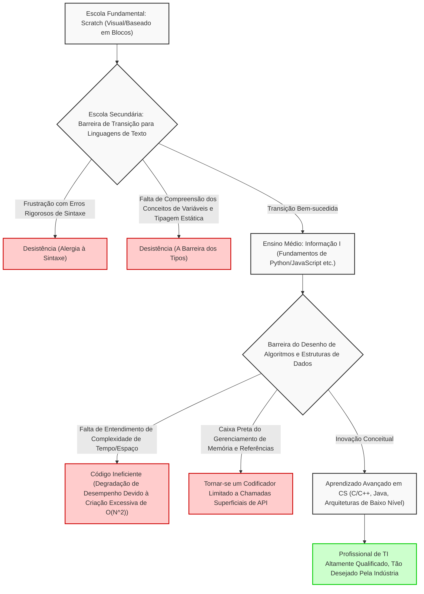
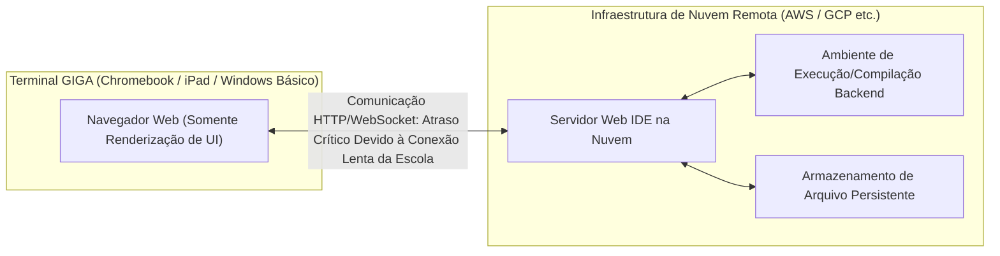
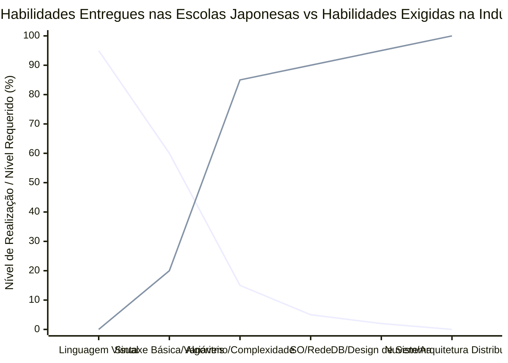

## 1. Introdução: A Luz e a Sombra Trazidas Pela Programação Obrigatória

Com a obrigatoriedade da educação de programação nas escolas de ensino fundamental a partir do ano fiscal de 2020, a expansão no ensino médio em tecnologia e economia doméstica a partir de 2021, e a nova disciplina obrigatória "Informação I" nas escolas de ensino médio a partir de 2022, a educação de TI e educação em informação no Japão experimentou uma mudança de paradigma em uma escala sem precedentes nos últimos anos. Na base dessa série de políticas está uma exigência nacional muito urgente: o cultivo do raciocínio lógico (pensamento de programação) para sobreviver na era da Society 5.0 (sociedade super inteligente) e a resolução da crônica escassez de profissionais de TI altamente qualificados no setor industrial.

No entanto, ao olharmos para a linha de frente da educação, torna-se evidente que existe uma enorme lacuna entre o ideal traçado pelo governo e a realidade. O problema mais sério é que há uma confusão total entre "aprender programação como uma ferramenta" e "dominar a ciência da computação como disciplina acadêmica". Além disso, há montanhas de problemas estruturais a serem resolvidos, como as limitações técnicas devido a restrições de especificações na infraestrutura de TI implantada em todo o país, e a falta de conjunto de habilidades especializadas por parte dos professores que ensinam.

Este artigo resume as "consequências" do ensino obrigatório de programação no Japão e desvenda os problemas essenciais e estruturais da educação de TI que enfrentamos atualmente, detalhada e tecnicamente, sob as perspectivas da teoria da ciência da computação, restrições de arquitetura de hardware e competitividade industrial global. É um artigo abrangente de 10.000 caracteres que não se limita a teorias educacionais, mas considera o futuro do Japão da perspectiva da engenharia de software.

## 2. A Armadilha da Programação Visual: O Fosso Profundo e Íngreme do Scratch para a Codificação em Texto

O padrão de fato (de facto standard) no ensino de programação do ensino fundamental é a linguagem de programação visual (programação em blocos) representada pelo "Scratch", desenvolvido pelo MIT Media Lab. O fato de usar uma interface gráfica intuitiva para combinar blocos como em um quebra-cabeça, permitindo que os alunos aprendam as três estruturas de controle básico de algoritmos de forma visual e intuitiva: "sequência", "seleção" (ramificação) e "iteração" (repetição), é uma grande invenção que merece grande reconhecimento como educação introdutória.

No entanto, há uma armadilha grave aqui, que pode ser chamada de "armadilha da abstração". O fato cruel é que "a transição da programação visual para linguagens de programação reais baseadas em texto (Python, JavaScript, C++, Rust, etc.) é extremamente difícil, e muitos alunos desistem nesta fase".

### A Barreira da Abstração e a Caixa Preta da Ciência da Computação

Ambientes de programação visual como o Scratch abstraem e ocultam intencionalmente (encapsulam) elementos vitais que formam a base da ciência da computação, como a sintaxe complexa da programação, sistemas de tipos rigorosos e o gerenciamento do ciclo de vida da memória. Isso é excelente para reduzir a carga cognitiva dos iniciantes, mas torna-se uma barreira enorme na transição para a engenharia de software real, o próximo passo. Isso porque, no ambiente real de desenvolvimento de software, a compreensão do escopo das variáveis (variáveis locais e globais), estruturas de dados complexas (arrays, listas ligadas, tabelas hash, árvores de busca binária, grafos), manipulação de ponteiros, além do gerenciamento de áreas de heap e stack na memória, são absolutamente indispensáveis.

O diagrama Mermaid a seguir ilustra visualmente os obstáculos e pontos de desistência (drop-off) que os iniciantes enfrentam ao transitar da programação visual para a autêntica ciência da computação.



Como fica claro neste fluxograma, simplesmente ganhar experiência em "escrever código para mover um personagem na tela" não criará engenheiros de software reais capazes de projetar arquiteturas de sistemas distribuídos escaláveis e otimizar o desempenho na escala de milissegundos. Entre a tarefa de juntar os blocos coloridos do Scratch com um mouse e a tarefa de decifrar o código fonte em C do kernel Linux e rastrear o comportamento da pilha TCP/IP, existe uma separação absoluta em compreensão conceitual que não pode ser descartada meramente como "diferença na linguagem usada".

## 3. Os Limites da Codificação Sem "Matemática" e "Lógica Discreta": Uma Abordagem Através da Teoria da Complexidade Computacional

A maior fraqueza e falha fatal no currículo de educação de programação do Japão é a esmagadora falta de integração entre a "técnica de codificação" e a "Matemática e Matemática Discreta (Discrete Mathematics)". Na educação em ciência da computação de alto nível nos Estados Unidos e na Índia, a eficiência algorítmica, a lógica matemática e as provas matemáticas recebem mais ênfase do que a própria sintaxe das linguagens de programação. Pois o código é simplesmente a tradução de fórmulas matemáticas.

### O Domínio Absoluto da Complexidade de Tempo e Complexidade de Espaço (Notação Big O)

Ao avaliar e projetar o desempenho do software, é impossível evitar os conceitos de Complexidade de Tempo (Time Complexity) e Complexidade de Espaço (Space Complexity). A Notação Big O de Landau (Big O Notation) demonstra como o tempo de execução e o consumo de memória aumentam quando o tamanho de dados inserido em um determinado algoritmo é $N$.

Como uma definição matemática, $f(x) = O(g(x))$ é estritamente definida da seguinte forma:

$$
\exists C > 0, \exists x_0 > 0, \forall x > x_0, |f(x)| \le C \cdot |g(x)|
$$

No ensino de informática no Japão, por exemplo, ao aprender sobre a ordenação de dados (classificação), há casos em que os alunos simplesmente chamam um método integrado como `array.sort()` no Python e consideram o assunto encerrado. No entanto, o que a engenharia da computação realmente exige é entender matematicamente e provar por que um simples bubble sort nunca é usado na prática, enquanto quicksort, mergesort ou Timsort são adotados como bibliotecas padrão.

Abaixo está a complexidade de tempo média dos algoritmos de classificação representativos.

- Bubble Sort (Ordenação por Bolha): $O(N^2)$
- Selection Sort (Ordenação por Seleção): $O(N^2)$
- Insertion Sort (Ordenação por Inserção): $O(N^2)$
- Merge Sort (Ordenação por Intercalação): $O(N \log N)$
- Quick Sort (Ordenação Rápida): $O(N \log N)$
- Heap Sort (Ordenação Heap): $O(N \log N)$

Por exemplo, a complexidade de tempo do mergesort, $T(N)$, é expressa pela seguinte relação de recorrência baseada no paradigma Dividir e Conquistar (Divide and Conquer):

$$
T(N) = 2T\left(\frac{N}{2}\right) + O(N)
$$

Ao resolver essa relação recursiva usando o Teorema Mestre (Master Theorem), derivamos a complexidade ideal, $T(N) = O(N \log N)$:

$$
T(N) = \Theta(N \log_2 N)
$$

Em análises de Big Data modernas e processamento de tráfego em escala web, $N$ torna-se uma ordem massiva de centenas de milhões ou bilhões. Se um programador ignorante implementar um algoritmo ineficiente de $O(N^2)$ para $N = 10^6$ dados, serão necessárias operações comparativas inúteis da ordem de $10^{12}$ (1 trilhão) vezes, causando o congelamento e colapso efetivos do sistema. Por outro lado, se for $O(N \log N)$, será concluído em cerca de $2 \times 10^7$ (20 milhões) operações. Afirmar "eu sei programar" sem essa brutal base matemática subjacente é como construir um arranha-céu sem conhecer a mecânica estrutural, o que é extremamente perigoso.

## 4. A Caixa Preta do Gerenciamento de Memória e Arquitetura de Sistemas

Em uma camada ainda mais profunda, existe a falta completa de compreensão em gerenciamento de memória (Memory Management) e arquitetura de CPU. Estudantes que aprenderam apenas linguagens de alto nível com Coletor de Lixo (Garbage Collection - GC), como Python e JavaScript que são ensinadas nas escolas atualmente, nunca estarão cientes de onde variáveis e objetos são alocados fisicamente na memória (RAM) (na área de heap ou na de stack), como são alocados e quando e como são liberados.

```c
// Exemplo de alocação de memória direta explícita e manipulação de ponteiros em C
#include <stdio.h>
#include <stdlib.h>

int main() {
    int n = 1000000;
    // Alocação dinâmica de memória contígua no heap (chamada de sistema ao OS)
    int *array = (int*)malloc(n * sizeof(int));
    
    if (array == NULL) {
        fprintf(stderr, "Falha na alocação de memória! Sem memória.\n");
        return 1;
    }
    
    // Inicialização do array via aritmética de ponteiros
    for(int i = 0; i < n; i++) {
        *(array + i) = i * 2; // Equivalente a array[i] = i * 2
    }
    
    // Liberação de recursos explícita para prevenir Memory Leak
    free(array);
    array = NULL; // Previne dangling pointer (ponteiro solto)
    
    return 0;
}
```

Os conceitos de ponteiros (referências diretas a endereços de memória), layout de dados (Data Locality) para maximizar a taxa de acerto na hierarquia de cache da CPU (L1/L2/L3), e o conhecimento sobre condições de corrida (Race Condition) e exclusão mútua (Mutex/Semaphore) em ambientes multi-thread são absolutamente indispensáveis para o desenvolvimento de sistemas backend de alto desempenho, motores de jogos 3D ou sistemas embarcados para IoT. O atual currículo do Ministério da Educação (MEXT) foca inteiramente em "rodar aplicativos superficiais", e devemos dizer que desvia significativamente do objetivo acadêmico original de "compreender os abismos da ciência da computação".

## 5. A Barreira dos Bancos de Dados e Persistência: A Ausência da Álgebra Relacional

Nos aplicativos modernos, salvar e recuperar dados (persistência) é um tema inescapável. No entanto, muito da educação escolar para em "processamento de dados na memória" que desaparecem assim que o programa termina sua execução. Raramente as teorias matemáticas subjacentes aos Bancos de Dados Relacionais (RDBMS) e SQL, nomeadamente a "Álgebra Relacional" proposta pelo Dr. Edgar F. Codd, são ensinadas.

As operações de banco de dados são definidas através das seguintes operações básicas baseadas na teoria dos conjuntos:

- Seleção (Selection, $\sigma$): Extrair tuplas (linhas) que atendem a condições
- Projeção (Projection, $\pi$): Extrair atributos específicos (colunas)
- Junção (Join, $\bowtie$): Interseção condicional de múltiplas relações

Além disso, aprender a estrutura de índices "B-Tree" (Árvore B) para buscar dados instantaneamente em enormes registros é a melhor aplicação prática das estruturas de dados. B-Trees minimizam as E/S (I/O) de disco enquanto garantem uma velocidade de busca de $O(\log N)$. Sem conhecer as propriedades ACID das transações (Atomicidade, Consistência, Isolamento, Durabilidade), é impossível construir sistemas robustos.

## 6. Segurança e Teoria da Criptografia: A Infraestrutura Social Apoiada na Dificuldade da Fatoração de Primos

Na educação em alfabetização informacional, realiza-se uma educação de segurança superficial como "vamos fazer senhas complexas" ou "não clique em links suspeitos", mas a matemática da "teoria da criptografia" que sustenta a sociedade da Internet raramente é ensinada.

As comunicações HTTPS e as assinaturas eletrônicas que usamos diariamente são protegidas por criptografia de chave pública, como o RSA. A segurança do RSA baseia-se na dificuldade matemática (considerada um problema NP-intermediário) que afirma que "a fatoração de números inteiros gigantes não pode ser resolvida em tempo viável por computadores clássicos atuais".

As equações subjacentes à criptografia RSA são uma bela aplicação da função totiente de Euler e do pequeno teorema de Fermat.

1. Escolha dois primos grandes $p$ e $q$
2. Calcule $n = p \times q$ (isto torna-se parte da chave pública)
3. Calcule $\phi(n) = (p-1)(q-1)$
4. Escolha $e$ e $d$ de forma que $e \times d \equiv 1 \pmod{\phi(n)}$
5. Criptografia: $C \equiv M^e \pmod{n}$
6. Descriptografia: $M \equiv C^d \pmod{n}$

Desse modo, a educação de programação revela seu verdadeiro poder somente quando estreitamente conectada à educação matemática. Traduzir fórmulas em código e implementá-las na sociedade é a verdadeira essência da ciência.

## 7. O Projeto Escola GIGA e os Limites Desesperadores de Infraestrutura: Chromebooks e IDEs em Nuvem

Indispensável ao discutir a educação de TI no Japão é o projeto "GIGA School", impulsionado com pesados financiamentos pelo Ministério da Educação. Este projeto nacional para prover "um dispositivo por aluno" e ambientes de rede de alta velocidade a estudantes do ensino fundamental e médio em todo o país era esperado como catalisador para recuperar os atrasos na digitalização. Porém, as especificações de hardware e a arquitetura dos dispositivos efetivamente distribuídos tornaram-se uma limitação séria para a educação autêntica em programação.

### Dispositivos de Baixa Especificação e a Perda de Ambientes Locais de Desenvolvimento

A maioria dos terminais introduzidos sob a especificação padrão do GIGA School são Chromebooks de baixo custo, iPads, ou dispositivos Windows de entrada. Suas especificações típicas são as seguintes:

- CPU: Intel Celeron ou processadores ARM de baixo custo
- Memória (RAM): 4GB (apenas o suficiente para rodar o sistema operacional moderno)
- Armazenamento (eMMC): 32GB ~ 64GB (Velocidades de I/O extremamente baixas)

Devido a essa fragilidade no hardware, é praticamente impossível construir os "ambientes de desenvolvimento local" usados diariamente por engenheiros profissionais. Lançar containers Linux usando Docker, rodar IDEs pesados como o Visual Studio Code com todas as funcionalidades, inicializar servidores locais em Node.js ou Python e instalar bibliotecas pesadas invariavelmente leva à exaustão de memória e ao congelamento do sistema.

Como resultado, os locais de ensino são forçados a depender exclusivamente de IDEs baseados em nuvem que rodam em navegadores web (como Google Colaboratory, Replit ou ferramentas leves proprietárias dos fabricantes de livros didáticos).



Essa dependência total de IDEs na nuvem causa as seguintes deficiências massivas na educação:

1. **Ignorância de Sistemas de Arquivos e Arquitetura de SO**: Como não possuem ambiente local, não aprendem as estruturas de diretórios, os conceitos de caminhos absolutos e caminhos relativos, a configuração de variáveis de ambiente, as permissões de arquivos ou operações do SO pela CLI (Interface de Linha de Comando). Estes são conhecimentos de TI indispensáveis (alfabetização UNIX) dos quais engenheiros devem depender como se fosse o ar que respiram.
2. **Latência de Rede e Fragilidade de Infraestrutura**: Por dependerem de conexão constante, quando toda a escola acessa a rede simultaneamente a largura de banda congestiona e o navegador trava, interrompendo completamente a aprendizagem, um tipo de incidente que está ocorrendo muito em todo o país.
3. **Perda de Experiência em Controle de Versão (Git)**: Remove as oportunidades dos estudantes usarem telas de terminais pretos para compreender o Git e o GitHub, que gerenciam o histórico de alterações no código fonte, essenciais no desenvolvimento colaborativo entre equipes em todo o mundo.

Quando um engenheiro de software profissional programa, as operações através do terminal (shell) representam uma base vital. A verdadeira formação de recursos humanos de TI nunca poderá ser concretizada sem experiências "sujas" interativas com o kernel local do sistema operacional digitando comandos como `ls`, `cd`, `grep`, `chmod` e `git rebase`. Brincando apenas dentro da caixa de areia (sandbox) do Chromebook, não emergirá nenhum engenheiro full-stack capaz de supervisionar sistemas complexos como um todo.

## 8. A Brecha Desesperadora com o Mundo: Desconexão Entre a Exigência da Indústria e a Educação Escolar

O desafio final e indiscutível a se colocar em termos de crise nacional, enfrentado pela educação em TI japonesa, é um imenso declínio na competitividade dentro do contexto global.

### A Ferocidade da Educação de Ciência da Computação em Países Estrangeiros

No Reino Unido (UK), já desde 2014 a disciplina chamada de "Computing" tornou-se obrigatória desde os 5 anos (Key Stage 1). O currículo deles vai além de uma simples "experiência de programação", abarcando ciência da computação pura sistemática e incrivelmente acadêmica; abrangendo raciocínio algorítmico e design, o estudo dos circuitos lógicos usando álgebra booleana (Boolean algebra), topologias de rede e arquiteturas de hardware.

Nos Estados Unidos, há um padrão curricular rígido K-12 (Jardim de Infância até o final do ensino médio) definido pela CSTA (Associação de Professores de Ciência da Computação), onde o AP (Advanced Placement) Computer Science A, ministrado para alunos do ensino médio, lida extensivamente com programação orientada a objetos usando Java, polimorfismo, processamento recursivo, implementação de estrutura de dados e avaliação da complexidade de algoritmos em um nível comparável ao primeiro ano de universidades. Nem precisamos mencionar a ferocidade da educação STEM na Índia ou na China e as grandes massas de elites ali produzidas.

### Desconexão Abismal Entre as Habilidades Requeridas e as Ensinadas

As exigências para engenheiros de software recém-formados em busca de emprego na indústria atual, especialmente as exigidas globalmente por megaventures e gigantes da tecnologia (como GAFAM), crescem a taxas aterradoramente altas anualmente. Requer-se um profundo grau de especialização com largo espectro: configuração de infraestrutura cloud-native (AWS, GCP, Kubernetes), design de sistemas distribuídos baseados em arquitetura de microsserviços, implementação de dutos de Machine Learning, além de amplos conhecimentos sobre segurança.

O gráfico a seguir descreve conceitualmente as enormes discrepâncias entre o nível de aprendizado da formação entregue na escola japonesa atualmente em oposição ao nível imposto pelas exigentes fronteiras industriais.



Preencher esse vazio massivo (Vale da Morte - Death Valley) demanda enormes volumes de investimento aliado a uma mudança paradigmática fundamental em toda a matriz educativa. Dada uma severa escassez nacional de professores especialistas em "Informação", e no presente cenário de educação, os ensinamentos baseados em programação são conduzidos sem nenhum treinamento adequado através de professores de Matemática, Ciências, além de docentes em áreas tecnológicas focados apenas nas horas complementares de suas próprias pautas oficiais, impossibilitando assim, formar engenheiros de topo (top-tier) dispostos a lutar nos palcos globais.

## 9. A Queda Drástica no Valor da "Codificação" na Era da Inteligência Artificial (LLM)

Complicando ainda mais este cenário está a massiva e rápida adesão de LLMs (Grandes Modelos de Linguagem), como o ChatGPT e o GitHub Copilot para programação de assistência virtual artificial. O valor no mercado para o chamado "Codificador (Coder)" – uma pessoa que apenas "sabe usar as sintaxes de programação do Python" ou que "sabe como acessar APIs" - está num drástico mergulho perante aos modelos de Inteligência Artificial atuais, que perfeitamente concebem instantaneamente as linguagens a partir de requisições de prompt sem problemas e completam até o código para testes.

O que é esperado de uma força humana especializada como um engenheiro dentro da era AI não constitui a memorização de códigos e fórmulas gramaticais nativas nas linguagens de programação, e sim as três próximas capacidades vitais:

1. **Definição de Requisitos e Modelagem de Domínio (Domain Modeling)**: A habilidade de extrair problemas da vida real, que são complexos em natureza e devem ser resolvidos, transformando-os numa padronização de modelagem integrada enquanto sistema global.
2. **Design de Arquitetura**: A aptidão para desenhar o esquema por inteiro do sistema resguardando escalabilidade (scalability), disponibilidade (availability) e as vias de manutenção (maintainability).
3. **Validação Lógica e Matemática**: Possuir a competência ao investigar exaustivamente a fundo os códigos e sistemas inteiros formulados na AI, no quesito falhas relacionadas à estrutura ou sobrecargas a tempo de operação gerando vulnerabilidades a invasões, verificando a segurança via teoria de prova.

Ironicamente falando, isto requer todas as "ciências da computação mais abstratas e matemática", divergindo das "programações superficiais". O reflexo é extremamente desanimador pelo sentido em se estar construindo a sociedade num cenário que educa sob "aptidões em projetos ou rotinas em categorias elementares que tendem a ser extirpadas via Inteligência Artificial no mercado" na educação Japonesa, e é inegavelmente tido que tudo isso resultará em declínio de grande importância do Estado e capital nacional num todo futuro.

## 10. Em Direção à Integração da Ciência Matemática e da Programação: Propostas Para a Educação da Próxima Geração

A principal e vital premissa urgente dentro deste desenvolvimento na educação TI, exige-se fugir com desespero dos "preceitos que baseiam a linguagem por se ter meramente na sua objetividade ou finalidade" na programação moderna, no intuito focado com "uma readequada orientação guiada à pesquisa científica fundamentada pelas computações na ótica das ciências analítico-matemáticas". Pois, a finalidade básica ao usar linguagens baseadas no mundo virtual é representar ideais meramente como aparato a auxiliar ferramentas ou pensamentos, ao passo onde apenas as estruturas concebidas pelo intelecto universal das matemáticas perdurarão sem esvaecer pela mudança das épocas.

Como analogia de uso na inteligência artificial e fundações subjacentes à aprendizagem de máquinas profundas, temas sobre ramos do cálculo incluindo multivariáveis com álgebra e vetores, equações lineares de matrizes (álgebra linear de tensores), cálculos estatísticos pautados por probabilidades exatas, derivando em descida gradiente e estimativa Bayesiana. Para a modelização de processos fundamentados da Inteligência com propósitos profundos no meio da otimização das redes neurais sobre pesos é derivado em regra da cadeia (Chain Rule) baseado em derivada parcial do modelo de cálculos sob a regra retropropagação (backpropagation).

$$
\frac{\partial L}{\partial w_{ij}^{(l)}} = \frac{\partial L}{\partial z_i^{(l+1)}} \cdot \frac{\partial z_i^{(l+1)}}{\partial w_{ij}^{(l)}} = \delta_i^{(l+1)} \cdot a_j^{(l)}
$$

Aqueles que impulsionarão as próximas eras no campo na Indústria e Computação Mundial serão o contingente humano dotado na versátil inteligência engenhosa na materialização da criação visual por trás dessas robustas fórmulas sobre aplicações através do domínio total em GPUs (como CUDA) ou matrizes nos TPUs na plena arquitetura e processamentos matemáticos paralelizados aplicados (Parallel Computing). Motivos óbvios nos apontam diretamente na mudança total para com uma pedagogia em ensino raso onde obriga-se os alunos em memorizarem estruturas base sintáticas em seus mínimos fundamentos, alterando o rumo focado e centralizado num profundo e forte ensinamento nas questões fundamentais intrínsecas ao uso das teorias fundamentais e Primeiros Princípios (First Principles).

## 11. Conclusão: O Difícil Caminho Para Uma Verdadeira Nação de TI e a Nossa Resolução

É incontestável e fato afirmativo garantido que toda sociedade Japonesa recebeu imenso apoio positivo sob o reconhecimento perante o tema em toda obrigatoriedade no uso das tecnologias em linguagens para codificação escolar que adentrou na pauta desde os anos 2020. No entanto isto significaria, puramente num prisma real e perante um imenso trajeto, meros preparos rudimentares em "esquentamentos básicos corporais ou exercícios introdutórios (aquecimento)".

Dar passos inovadores extraindo com excitação os prazeres perante o avanço provocado que vão muito além de manobras rudimentares gerando locomoção gráfica perante mascotes (Scratch), descobrindo assim com intensa inspiração a formidabilidade gerada dentro das belezas no mundo das matemáticas em formulações ao padrão $O(N \log N)$ perante os códigos algoritmos criados, trazendo assim o fascínio global através da execução perante interações no globo a computadores inteiros mediante a telinha isolada da área de terminais através dos blocos criptográficos em pacotes TCP ao invés disso. Refazer de modo global todas estas formas criando redes conceituais renováveis nos equipamentos subversivos da esfera local aos dispositivos base GIGA School. Construir e gerar massivos fluxos baseados na contratação externa de educadores ou especialistas aptos com amplos domínios especializados perante temas baseados nas ciências computacionais. E o envolvimento ocasional de engenheiros especialistas, com determinação sem hesitar de sua audácia e engajamento perante na participação local no seio da sociedade base instrucional para os educadores na sala.

Os desafios enfrentados pela TI educacional nacional encontram raízes obscuramente fortes ao adentrar com alto índice de complicações na esfera global. Mas com base em engajamentos que jamais devem abster os focos na essência destas deficiências na frente tecnológica e unida de forma coesa com esferas inteiras nas entidades nacionais aliadas as escolas na formação deste pilar educacional para construção na busca em sanar a dificuldade. De modo não formatando escravos trabalhadores passivos apenas concebidos ao redigir textos informacionais restritos aos papeis requeridos. Formar criadores engajados criativos ao elaborarem desde sistemas originais sem bases iniciais que irão moldar todos os ecos globais do amanhã, aí então sem qualquer ressalvas de equívocos as garantias tornarão efetivos aos novos passos a Japão ao caminho do topo soberano encabeçando novas lideranças aos povos futuros num poder de tecnologia consolidado (IT Nation).

Sob "consequências e futuro" gerada da concepção de pautar a inclusão de forma forçada nas categorias de programação perante as áreas educacionais do país; nesta intensa etapa, onde o estado encontra a real complexidade aos focos definitivos cruciais exigidos pelo amanhã... Estaremos no presente exigindo ativamente e intensamente todos os esforços baseados num verdadeiro teste sobre resoluções firmes sobre a vontade que engajará a liderança sob a responsabilidade dos indivíduos atuais maiores da geração vigente.

---

*Neste artigo expusemos questões abordando o escopo referente as dimensões de Teorias em Complexidades sob aos limites nos fatores infraestruturais oriundos do formato no formato imposto aos programas "GIGA School". Focados, numa ótica continuada nas vindouras compilações programadas que darão enfoques e explicações profundas nos focos a ciência matemática (englobadas as construções em esquemas em linguagens algoritmos ao cenário das distribuições em arquitetura sob detalhamento nas formas e maneiras sobre controles a níveis inferiores ligados ao memórias do núcleo) em novos tópicos a continuarem e sequenciais neste canal.*


