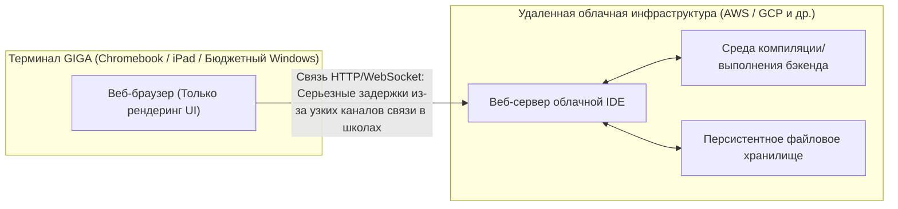

## 1. Введение: Свет и тени обязательного обучения программированию

С обязательным обучением программированию в начальной школе в 2020 финансовом году, его расширением на уроках технологий и домоводства в средней школе в 2021 году и введением нового обязательного предмета «Информация I» в старшей школе в 2022 году, ИТ-образование и информатика в Японии за последние годы пережили смену парадигмы беспрецедентного масштаба. В основе этой серии политических мер лежит чрезвычайно острая и национальная необходимость: развитие логического мышления (программистского мышления) для выживания в эпоху Society 5.0 (супер-умного общества) и решение хронической проблемы нехватки высококвалифицированных ИТ-кадров в промышленности.

Однако, если взглянуть на передовую линию образования, становится очевидным, что между идеалом, нарисованным государством, и реальностью возник огромный разрыв. Самая серьезная проблема заключается в том, что «изучение программирования как инструмента» и «освоение компьютерных наук как академической дисциплины» полностью смешиваются. Кроме того, существует множество структурных проблем, требующих решения, таких как технические ограничения, вызванные характеристиками ИТ-инфраструктуры, развернутой в масштабах всей страны, и нехватка специализированных навыков у преподавателей.

В этой статье подведены итоги того, что произошло «после» введения обязательного программирования в Японии, и дан чрезвычайно подробный технический анализ фундаментальных и структурных проблем, с которыми ИТ-образование сталкивается прямо сейчас, с точки зрения теории компьютерных наук, аппаратных ограничений и глобальной конкурентоспособности промышленности. Это не просто рассуждение об образовании, а эссе на 10 000 символов, в котором будущее Японии рассматривается с точки зрения программной инженерии.

## 2. Ловушка визуального программирования: Глубокая и крутая пропасть между Scratch и текстовым кодированием

Де-факто стандартом в обучении программированию в начальной школе стали языки визуального программирования (блочное программирование), типичным представителем которых является «Scratch», разработанный MIT Media Lab. Тот факт, что три базовые управляющие структуры алгоритмов: «последовательность (sequence)», «ветвление (selection)» и «цикл (iteration)», могут быть изучены визуально и интуитивно путем соединения блоков, как пазлов, с использованием интуитивно понятного графического интерфейса, является великим изобретением, которое следует высоко оценить в качестве вводного образования.

Однако здесь кроется серьезная ловушка, так называемая «ловушка абстракции». Это жестокий факт, что «переход от визуального программирования к полноценным текстовым языкам программирования (Python, JavaScript, C++, [Rust](https://kenji.blog/ru/p/webassembly-wasm-current-future/) и т.д.) чрезвычайно сложен, и многие учащиеся сдаются на этом этапе».

### Барьер абстракции и черный ящик компьютерных наук

Среды визуального программирования, такие как Scratch, в высокой степени абстрагируют и намеренно скрывают (инкапсулируют) ключевые элементы, составляющие основу компьютерных наук, такие как сложный синтаксис программирования, строгие системы типов и управление жизненным циклом памяти. Это отлично подходит для снижения когнитивной нагрузки на новичков, но становится огромным препятствием при переходе к следующему этапу — настоящей инженерии. В реальной разработке программного обеспечения абсолютно необходимо понимание области видимости переменных (локальные и глобальные переменные), сложных структур данных (массивы, связные списки, хеш-таблицы, бинарные деревья поиска, графы), операций с указателями и областей памяти heap (куча) и stack (стек).

Следующая диаграмма Mermaid визуализирует препятствия в обучении и точки отсева (drop-off), с которыми сталкиваются новички в процессе перехода от визуального программирования к полноценной информатике.

```mermaid
flowchart TD
    A["Начальная школа: Scratch (визуальный/на основе блоков)"] --> B{"Средняя школа: Барьер перехода к текстовым языкам"}
    B -->|"Сдаются из-за строгих синтаксических ошибок"| C["Отсев (Аллергия на синтаксис)"]
    B -->|"Недостаток понимания переменных и статической типизации"| D["Отсев (Барьер типов)"]
    B -->|"Успешный переход"| E["Старшая школа: Информация I (Основы Python/JavaScript и др.)"]
    E --> F{"Барьер проектирования алгоритмов и структур данных"}
    F -->|"Непонимание временной и пространственной сложности"| G["Неэффективный код (Снижение производительности из-за злоупотребления O("N^2"))"]
    F -->|"Черный ящик управления памятью и ссылок"| H["Превращение в кодера, ограничивающегося поверхностными вызовами API"]
    F -->|"Концептуальный прорыв"| I["Полноценное изучение CS (C/C++, Java, низкоуровневая архитектура)"]
    I --> J["Высококвалифицированный ИТ-профессионал, которого жаждет индустрия"]
    
    classDef default fill:#f9f9f9,stroke:#333,stroke-width:2px;
    classDef error fill:#ffcccc,stroke:#cc0000,stroke-width:2px;
    classDef success fill:#ccffcc,stroke:#00cc00,stroke-width:2px;
    class C,D,G,H error;
    class J success;
```

Как ясно из этой блок-схемы, простой опыт «написания кода, который перемещает персонажей на экране» не воспитает настоящих инженеров-программистов, способных проектировать масштабируемую распределенную системную архитектуру и оптимизировать производительность до миллисекунд. Между сборкой разноцветных блоков Scratch с помощью мыши и чтением исходного кода ядра Linux на C для отслеживания поведения стека [TCP](https://kenji.blog/ru/p/http3-quic-protocol-tcp-udp/)/IP существует абсолютный концептуальный разрыв, который нельзя объяснить просто словами «разница в используемых языках».

## 3. Ограничения кодирования без «Математики» и «Дискретной логики»: Подход с точки зрения теории сложности

Самой слабой стороной и фатальным недостатком учебной программы по программированию в Японии является острая нехватка связи между «навыками кодирования» и «математикой/дискретной математикой (Discrete Mathematics)». В лучших программах по информатике (computer science) в США, Индии и других странах акцент делается на эффективности алгоритмов, математической логике и математических доказательствах, а не на самой грамматике языков программирования. Ведь код — это не что иное, как перевод математических формул.

### Абсолютное доминирование временной и пространственной сложности ([Big O](https://kenji.blog/ru/p/time-space-complexity-big-o-notation-examples/) Notation)

При оценке и проектировании производительности программного обеспечения нельзя избежать концепций временной сложности (Time Complexity) и пространственной сложности (Space Complexity). Асимптотическая нотация Ландау (Big O Notation) показывает, как увеличивается время выполнения и потребление памяти, когда размер данных, вводимых в алгоритм, равен $N$.

Математически $f(x) = O(g(x))$ строго определяется следующим образом:

$$
\exists C > 0, \exists x_0 > 0, \forall x > x_0, |f(x)| \le C \cdot |g(x)|
$$

В японском ИТ-образовании, например, при изучении сортировки данных, часто встречаются случаи, когда все заканчивается простым вызовом встроенного метода `array.sort()` в Python. Однако то, что действительно требуется в информационной инженерии, — это математическое понимание и доказательство того, почему простая пузырьковая сортировка никогда не используется в практических областях, и почему быстрая сортировка (Quick Sort), сортировка слиянием (Merge Sort) или [Timsort](https://kenji.blog/ru/p/sorting-algorithms/) принимаются в качестве стандартных библиотек.

Ниже приведена средняя временная сложность типичных алгоритмов сортировки:

- Пузырьковая сортировка (Bubble Sort): $O(N^2)$
- [Сортировка](https://kenji.blog/ru/p/sorting-algorithms/) выбором (Selection Sort): $O(N^2)$
- [Сортировка](https://kenji.blog/ru/p/sorting-algorithms/) вставками (Insertion Sort): $O(N^2)$
- [Сортировка](https://kenji.blog/ru/p/sorting-algorithms/) слиянием (Merge Sort): $O(N \log N)$
- Быстрая сортировка (Quick Sort): $O(N \log N)$
- Пирамидальная сортировка ([Heap](https://kenji.blog/ru/p/c-language-pointers-memory-management-stack-heap/) Sort): $O(N \log N)$

Например, временная сложность сортировки слиянием $T(N)$ в рамках парадигмы «разделяй и властвуй» (Divide and Conquer) выражается следующим рекуррентным соотношением:

$$
T(N) = 2T\left(\frac{N}{2}\right) + O(N)
$$

Путем разложения и решения этого рекурсивного уравнения с использованием основной теоремы (Master Theorem) выводится идеальная сложность $T(N) = O(N \log N)$.

$$
T(N) = \Theta(N \log_2 N)
$$

При анализе современных больших данных и обработке трафика в масштабе веб-приложений $N$ достигает огромных порядков — сотен миллионов и миллиардов. Если невежественный программист реализует неэффективный алгоритм $O(N^2)$, для данных размером $N = 10^6$ потребуется $10^{12}$ (1 триллион) ненужных операций сравнения, и система фактически зависнет или рухнет. С другой стороны, с $O(N \log N)$ это будет завершено примерно за $2 \times 10^7$ (20 миллионов) операций. Утверждать «я умею программировать» без этой жестокой математической поддержки — все равно что строить небоскреб, не зная строительной механики, и это крайне опасно.

## 4. Управление памятью и превращение системной архитектуры в черный ящик

Еще более глубокая проблема заключается в том, что понимание управления памятью ([Memory Management](https://kenji.blog/ru/p/memory-management-garbage-collection/)) и архитектуры ЦП полностью отсутствует. Учащиеся, изучающие только языки высокого уровня с автоматической сборкой мусора (GC), такие как Python и JavaScript, которые в настоящее время преподаются в школах, никогда в жизни не будут задумываться о том, где в физической памяти (RAM) размещаются переменные и объекты (в куче или в стеке), как они выделяются и когда/как освобождаются.

```c
// Пример явного и прямого выделения памяти и манипуляций с указателями в C
#include <stdio.h>
#include <stdlib.h>

int main() {
    int n = 1000000;
    // Динамическое непрерывное выделение памяти в куче (системный вызов к ОС)
    int *array = (int*)malloc(n * sizeof(int));
    
    if (array == NULL) {
        fprintf(stderr, "Memory allocation failed! Out of memory.\n");
        return 1;
    }
    
    // Инициализация массива с помощью арифметики указателей
    for(int i = 0; i < n; i++) {
        *(array + i) = i * 2; // Эквивалентно array[i] = i * 2
    }
    
    // Явное освобождение ресурсов для предотвращения утечки памяти (Memory Leak)
    free(array);
    array = NULL; // Предотвращение появления висячих указателей (Dangling pointer)
    
    return 0;
}
```

Концепции указателей (прямые ссылки на адреса памяти), размещение данных для максимизации частоты попадания в иерархию кэш-памяти ЦП (кэш L1/L2/L3) (Data Locality), а также знания о состоянии гонки (Race Condition) и взаимном исключении (Mutex/Semaphore) в многопоточной среде абсолютно необходимы для разработки высокопроизводительных бэкенд-систем, 3D-игровых движков или встроенных систем для IoT. Приходится признать, что нынешняя учебная программа Министерства образования, культуры, спорта, науки и технологий ограничивается «созданием поверхностных приложений» и сильно отклоняется от своей первоначальной академической цели — «понимания глубин компьютерных наук».

## 5. Барьер баз данных и персистентности: Отсутствие реляционной алгебры

В современных приложениях сохранение и поиск данных (персистентность) являются неизбежными темами. Однако большая часть школьного образования ограничивается «обработкой данных в памяти», которые исчезают после завершения программы. Математическая теория, лежащая в основе реляционных баз данных ([RDBMS](https://kenji.blog/ru/p/rdbms-transaction-acid-isolation-level-lock/)) и SQL, а именно «реляционная алгебра (Relational Algebra)», предложенная доктором Эдгаром Ф. Коддом, преподается редко.

Операции с базами данных определяются следующими базовыми операциями, основанными на теории множеств:

- Выборка (Selection, $\sigma$): Извлечение кортежей (строк), удовлетворяющих условию.
- Проекция (Projection, $\pi$): Извлечение определенных атрибутов (столбцов).
- Соединение (Join, $\bowtie$): Условное пересечение нескольких отношений.

Кроме того, изучение структуры индекса «[B-Tree](https://kenji.blog/ru/p/b-tree-database-index-theory/) (B-дерево)» для мгновенного поиска нужных данных среди огромного количества записей является лучшей практикой применения структур данных. B-Tree минимизирует количество операций ввода-вывода (I/O) на диске и гарантирует скорость поиска $O(\log N)$. Невозможно создать надежную систему, не зная свойств ACID (Atomicity, [Consistency](https://kenji.blog/ru/p/cap-theorem-distributed-systems-tradeoff/), Isolation, Durability) транзакций.

## 6. Безопасность и теория криптографии: Сложность разложения на множители как опора социальной инфраструктуры

Хотя обучение информационной грамотности включает поверхностное обучение безопасности, такое как «давайте использовать сложные пароли» и «давайте не будем переходить по подозрительным ссылкам», математика «теории криптографии», которая является основой интернет-общества, почти не преподается.

Связь по протоколу HTTPS и цифровые подписи, которые мы используем каждый день, защищены криптографией с открытым ключом, такой как алгоритм [RSA](https://kenji.blog/ru/p/modern-cryptography-public-key-hash-signature/). Безопасность RSA зависит от математической сложности (которая считается NP-промежуточной задачей): «разложение огромных целых чисел на простые множители невозможно решить за реальное время на современных классических компьютерах».

Математические формулы, лежащие в основе криптографии RSA, красивы и применяют функцию Эйлера (totient) и малую теорему Ферма:

1. Выберите два очень больших простых числа $p$ и $q$.
2. Вычислите $n = p \times q$ (это станет частью открытого ключа).
3. Вычислите $\phi(n) = (p-1)(q-1)$.
4. Выберите $e$ и $d$ такие, что $e \times d \equiv 1 \pmod{\phi(n)}$.
5. Шифрование: $C \equiv M^e \pmod{n}$
6. Расшифровка: $M \equiv C^d \pmod{n}$

Таким образом, обучение программированию демонстрирует свою истинную мощь только тогда, когда оно тесно связано с обучением математике. Процесс перевода математических формул в код и их внедрение в общество — вот в чем заключается истинная прелесть науки.

## 7. Концепция GIGA School и безнадежные ограничения инфраструктуры: Chromebook и облачные IDE

Говоря об ИТ-образовании в Японии, нельзя не упомянуть о «Концепции GIGA School», национальном проекте, на продвижение которого Министерство образования, культуры, спорта, науки и технологий потратило огромный бюджет. Ожидалось, что этот проект, который обеспечит «одно устройство на каждого ученика» и высокоскоростную сетевую среду для учащихся начальных и средних школ по всей стране, станет катализатором для преодоления отставания в цифровизации. Однако аппаратные характеристики и архитектура реально распределенных терминалов стали серьезным препятствием для полноценного обучения программированию.

### Низкопроизводительные терминалы и потеря среды локальной разработки

Многие терминалы, представленные в качестве стандартных спецификаций концепции GIGA School, — это чрезвычайно дешевые Chromebook, iPad или бюджетные устройства Windows. Их стандартные характеристики таковы:

- ЦП: Intel Celeron или дешевый процессор ARM
- Память (RAM): 4 ГБ (Минимально достаточный объем только для запуска современной ОС)
- Хранилище (eMMC): от 32 ГБ до 64 ГБ (Чрезвычайно низкая скорость ввода-вывода)

Из-за этих скудных аппаратных ограничений фактически невозможно создать «среду локальной разработки», которую профессиональные инженеры используют каждый день. Запуск контейнеров Linux с использованием [Docker](https://kenji.blog/ru/p/docker-container-namespace-[cgroups](https://kenji.blog/ru/p/docker-container-namespace-cgroups-layers/)-layers/), запуск тяжелых IDE, таких как Visual Studio Code, с полной функциональностью или запуск локальных серверов Node.js/Python для установки тяжелых библиотек приведет к немедленному истощению памяти и зависанию системы.

В результате сфера образования вынуждена полностью полагаться на облачные IDE (Google Colaboratory, Replit или легкие веб-инструменты от издателей учебников), которые работают в браузере.



Полная зависимость от облачных IDE вызывает следующие чрезвычайно серьезные пробелы в образовании:

1. **Непонимание файловых систем и архитектуры ОС**: Поскольку у них нет локальной среды, они вообще не приобретают необходимые знания, которыми ИТ-инженеры должны владеть, как воздухом для дыхания (грамотность UNIX), такие как структура каталогов, концепции абсолютных/относительных путей, настройка переменных среды, права доступа к файлам и операции с ОС через CLI (интерфейс командной строки).
2. **Задержки в сети и уязвимости инфраструктуры**: Поскольку предполагается постоянное соединение, по всей стране часто происходят инциденты, когда вся школа получает доступ к сети одновременно, пропускная способность школьной сети исчерпывается, браузеры зависают, а обучение полностью останавливается.
3. **Лишение опыта управления версиями (Git)**: Они лишаются возможности изучить концепции Git и GitHub для управления историей изменений исходного кода и совместной разработки с командами по всему миру через черный экран терминала.

Когда профессиональный инженер-программист занимается разработкой, работа в терминале (оболочке) является абсолютной основой. Невозможно воспитать настоящие ИТ-кадры без приземленного опыта прямого взаимодействия с ядром локальной ОС с помощью таких команд, как `ls`, `cd`, `grep`, `chmod`, `git rebase`. Если играть только в песочнице (sandbox) Chromebook, из вас никогда не получится full-stack инженер, который может видеть систему целиком.

## 8. Безнадежный разрыв с миром: Расхождение между требованиями индустрии и школьным образованием

Последней и, пожалуй, национальной кризисной проблемой японского ИТ-образования является колоссальное снижение конкурентоспособности в глобальном контексте.

### Интенсивное образование в области компьютерных наук в других странах

В Великобритании (UK) предмет под названием «Вычисления» (Computing) стал обязательным с 5 лет (Key Stage 1) еще в 2014 году. Их учебная программа не ограничивается простым «опытом программирования», а охватывает в высшей степени академическую и систематическую полноценную информатику, начиная от логического проектирования алгоритмов, понимания логических схем с использованием булевой алгебры (Boolean algebra) до сетевых топологий и аппаратной архитектуры.

В Соединенных Штатах существует строгая стандартная учебная программа K-12 (от детского сада до окончания средней школы), установленная Ассоциацией преподавателей компьютерных наук (CSTA), а в курсе AP (Advanced Placement) Computer Science A, который проходят старшеклассники, полноценное объектно-ориентированное программирование с использованием [Java](https://kenji.blog/ru/p/programming-languages-history-paradigm-evolution/), полиморфизм, рекурсия, реализация структур данных и оценка сложности алгоритмов преподаются на высоком уровне первого курса университета. Жесткость STEM-образования в Индии и Китае, а также глубина выпускаемой оттуда элиты не нуждаются в упоминании.

### Безнадежный разрыв между требуемыми навыками и тем, чему обучают

Требования, предъявляемые современной индустрией, особенно глобальными мега-венчурными компаниями и технологическими гигантами (GAFAM и др.), к новым инженерам-программистам усложняются с пугающей скоростью каждый год. Требуется обширный и глубокий опыт, включая создание облачной инфраструктуры (AWS, GCP, [Kubernetes](https://kenji.blog/ru/p/kubernetes-k8s-architecture-pod-service-ingress/)), проектирование распределенных систем с микросервисной архитектурой, реализацию конвейеров машинного обучения и глубокие знания в области безопасности.

На следующем графике концептуально показан безнадежный разрыв между уровнем достижения навыков, предоставляемым японским школьным образованием в настоящее время, и уровнем навыков, требуемым передовой индустрией.

```mermaid
xychart-beta
    title Навыки в школьном образовании Японии vs Требования индустрии
    x-axis ["Визуальные языки", "Базовый синтаксис/переменные", "Алгоритмы/сложность", "ОС/Сети", "БД/Проектирование систем", "Облачная/Распределенная архитектура"]
    y-axis "Уровень достижения / Требования (%)" 0 --> 100
    line "Уровень достижений в современном школьном образовании" [95, 60, 15, 5, 2, 0]
    line "Уровень, требуемый индустрией/технологическими компаниями" [0, 20, 85, 90, 95, 100]
```

Чтобы преодолеть этот огромный разрыв (Долину Смерти - Death Valley), необходим радикальный сдвиг парадигмы школьного образования и колоссальные инвестиции. В условиях острой нехватки учителей, специализирующихся на «информатике», по всей стране, невозможно воспитать инженеров высшего уровня, способных конкурировать в мире, при нынешней системе, когда учителя математики, естественных наук или технологий и домоводства преподают программирование в свободное от основной работы время без надлежащего обучения.

## 9. Обесценивание «кодирования» в эпоху ИИ ([LLM](https://kenji.blog/ru/p/large-language-models-llm-transformer-prompt-engineering/))

Ситуация еще больше осложняется взрывным распространением больших языковых моделей (LLM), таких как ChatGPT, и помощников по программированию на базе ИИ, таких как GitHub Copilot. В наши дни, когда ИИ может мгновенно сгенерировать идеальный код на основе инструкций на естественном языке и даже написать тестовый код, рыночная стоимость так называемых «кодеров (Coders)», которые знают только «синтаксис Python» или «как вызывать API», стремительно падает.

В эпоху ИИ от инженеров-людей не требуется умение запоминать синтаксис языков программирования. Требуются следующие способности:

1. **Определение требований и предметно-ориентированное моделирование (Domain modeling)**: Способность выделять сложные реальные проблемы, которые необходимо решить, и моделировать их как системы.
2. **Проектирование архитектуры**: Способность составить чертеж всей системы для обеспечения масштабируемости, доступности и ремонтопригодности.
3. **Математическая/логическая верификация**: Способность теоретически проверить и доказать, что сгенерированный ИИ код не содержит дыр в безопасности или узких мест вычислительной сложности.

По иронии судьбы, все это области глубоких абстрактных «компьютерных наук и математики», а не «поверхностного программирования». Если японское образование обучает только «низкоуровневым навыкам, которые легко заменяются ИИ», это можно назвать лишь национальной потерей.

## 10. На пути к интеграции математических наук и программирования: Предложения для образования следующего поколения

Срочной задачей японского ИТ-образования в будущем является отказ от отношения к программированию как к «цели и средству» и возвращение к «исследованию компьютерных наук как математической науки». Язык программирования — это всего лишь инструмент для выражения мыслей, а лежащая в его основе математическая и логическая структура имеет универсальную ценность, которая не меркнет с течением времени.

Например, в основе искусственного интеллекта (ИИ) и машинного обучения тесно переплетаются линейная алгебра (матричные операции и тензоры), многомерный анализ (градиентный спуск) и теория вероятностей/статистика (байесовский вывод и количество информации). Оптимизация весов в нейронных сетях глубокого обучения формулируется через цепное правило (Chain Rule) с использованием частных производных и обратного распространения ошибки (Backpropagation).

$$
\frac{\partial L}{\partial w_{ij}^{(l)}} = \frac{\partial L}{\partial z_i^{(l+1)}} \cdot \frac{\partial z_i^{(l+1)}}{\partial w_{ij}^{(l)}} = \delta_i^{(l+1)} \cdot a_j^{(l)}
$$

Именно кадры, способные перевести такие сложные математические формулы в код и реализовать их, доведя параллельные вычисления (Parallel Computing) до максимума с учетом аппаратной архитектуры GPU (CUDA) или TPU, поведут за собой ИТ-индустрию следующего поколения. Вот почему мы должны немедленно переключиться с поверхностного образования, которое просто заставляет заучивать синтаксис, на глубокое образование, которое задается фундаментальными принципами вычислений (First Principles).

## 11. Заключение: Трудный путь к истинной ИТ-нации и наша решимость

Сделать программирование обязательным в 2020-х годах, несомненно, было уверенным шагом вперед в том смысле, что это заставило японское общество в целом осознать «важность ИТ и информации». Однако это лишь «разминка» на долгом пути.

Сделать шаг вперед от удовольствия перемещать персонажа-кота в Scratch, научить восторгаться математической красотой алгоритма $O(N \log N)$ и показать радость общения с серверами по всему миру через [TCP](https://kenji.blog/ru/p/http3-quic-protocol-tcp-udp/)-пакеты с черного экрана терминала. Восстановить новую образовательную инфраструктуру для преодоления аппаратных ограничений концепции GIGA School, воспитать и расставить преподавателей с высокой специализацией в области CS, а иногда смело привлекать внешних профессиональных инженеров к школьному образованию.

Проблемы, стоящие перед ИТ-образованием в Японии, чрезвычайно глубоки, укоренились и сложны. Однако, когда промышленность, академические круги и правительство серьезно объединятся для решения этих проблем, не отворачиваясь от них, и построят экосистему, способную постоянно выпускать «настоящих инженеров, способных проектировать и создавать системы с нуля», а не «рабочих, умеющих писать код только по спецификациям», Япония снова сможет возглавить мир как истинная ИТ-нация.

Как пережить самый трудный и важный этап «после» введения обязательного обучения программированию? Именно сейчас проверяется серьезность и решимость нас, взрослых.

---

*В этой статье был представлен обзор теории сложности и инфраструктурных ограничений концепции GIGA School. Более специализированные темы по компьютерным наукам (подробности алгоритмов распределенных систем и методы управления памятью на низком уровне) будут последовательно рассматриваться в следующих выпусках этой серии.*


