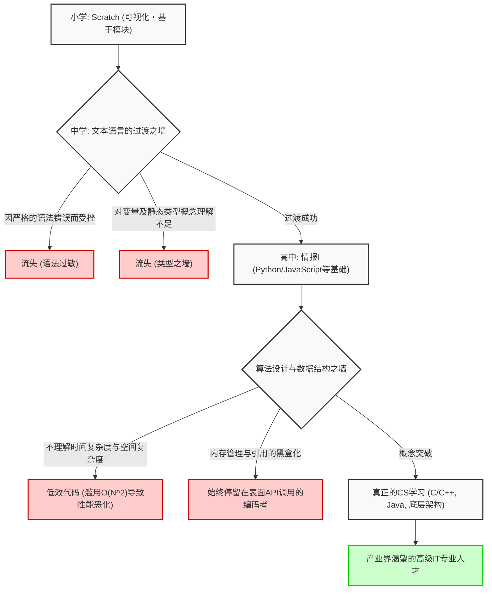
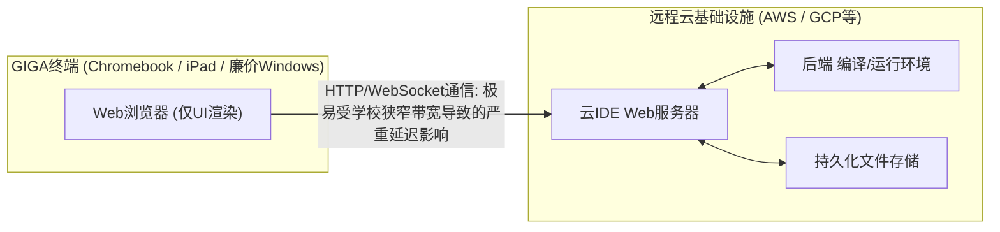

## 1. 引言：编程必修化带来的光与影

自2020年度小学必修编程教育、2021年度中学技术与家庭科扩充、以及2022年度高中新科目“情报Ⅰ”必修化以来，日本的IT教育和信息教育在过去几年经历了前所未有的大规模范式转变。在这一系列政策的底层，是为了在Society 5.0（超智能社会）时代生存而培养逻辑思维能力（编程思维），以及解决产业界长期存在的高级IT人才短缺问题的迫切国家需求。

然而，将目光转向教育前线，国家描绘的理想与现实之间出现了巨大的鸿沟。最严重的问题在于，“学习编程这一手段”与“掌握计算机科学这一学科”被完全混为一谈。此外，全国统一部署的IT基础设施受限于性能瓶颈，且作为指导者的教师缺乏专业技能等结构性问题依然堆积如山。

本文将总结日本编程教育必修化的“之后”，从计算机科学理论、硬件架构限制以及全球产业竞争力的角度，详细且具备技术深度地解开目前正在面临的IT教育本质性及结构性问题。这不仅是一篇教育论，更是一篇从软件工程视角考察日本未来的万字论述。

## 2. 可视化编程的陷阱：从Scratch到文本代码的深深鸿沟

在小学编程教育中占据事实标准的，是以MIT媒体实验室开发的“Scratch”为代表的可视化编程语言（基于模块的编程）。使用直观的图形界面，像拼图一样组合代码块，从而视觉和直观地学习“顺序（Sequence）”、“分支（Selection）”和“循环（Iteration）”这三大基本控制结构。作为入门教育，其伟大发明理应得到高度评价。

但是，这里存在一个重大的陷阱，即所谓的“抽象化陷阱”。残酷的现实是：“从可视化编程向文本基础的真正编程语言（如Python、JavaScript、C++、[Rust](https://kenji.blog/zh-cn/p/webassembly-wasm-current-future/)等）过渡极其困难，许多学习者在这一阶段遭遇挫折。”

### 抽象化之墙与计算机科学的黑盒化

以Scratch为首的可视化编程环境，将编程中复杂的语法（Syntax）、严格的类型系统（Type System）、内存的生命周期管理等构成计算机科学根基的重要要素进行了高度抽象和刻意的隐藏（封装）。这对于降低初学者的认知负荷非常有效，但当迈向下一步的真正工程学时，却成为巨大的障碍。因为在实际的软件开发一线，对变量作用域（局部变量与全局变量）、复杂数据结构（数组、链表、哈希表、二叉搜索树、图）、指针操作，以及内存的堆（Heap）和栈（Stack）区域的理解是绝对不可或缺的。

下面的Mermaid图可视化了初学者在从可视化编程向真正计算机科学过渡的过程中，所面临的学习障碍和流失（退学）节点。



从该流程图中可以明显看出，仅仅积累“编写移动屏幕角色的代码体验”，是无法培养出能够设计可扩展的分布式系统架构、并能在毫秒级别优化性能的真正软件工程师的。用鼠标组合Scratch彩色模块的工作，与阅读Linux内核的C语言源代码并追踪[TCP](https://kenji.blog/zh-cn/p/http3-quic-protocol-tcp-udp/)/IP协议栈行为的工作之间，存在着绝非“使用语言不同”一词所能敷衍的绝对概念理解断层。

## 3. 缺乏“数学”与“离散逻辑”的编码局限性：来自计算复杂性理论的探讨

日本编程教育课程体系中最大的弱点、甚至可以说是致命缺陷的，是“编码技术”与“数学・离散数学（Discrete Mathematics）”结合的极度匮乏。在以美国和印度为首的顶尖计算机科学教育中，相较于编程语言的语法本身，算法的效率、数理逻辑以及数学证明被赋予了更多的重要性。因为代码只不过是数学公式的翻译。

### 时间复杂度与空间复杂度（Big O Notation）的绝对支配

在评估和设计软件性能时，时间复杂度（Time Complexity）和空间复杂度（Space Complexity）的概念是不可回避的。当某个算法输入的数据大小为 $N$ 时，执行时间或内存消耗将如何增长，这可以通过朗道渐近记号（Big O Notation）来表示。

作为数学定义，$f(x) = O(g(x))$ 严格定义如下：

$$
\exists C > 0, \exists x_0 > 0, \forall x > x_0, |f(x)| \le C \cdot |g(x)|
$$

在日本的信息教育中，例如在学习数据排序（Sort）时，有些情况只是简单地在Python中调用 `array.sort()` 这样的内置方法就结束了。然而，作为信息工程真正要求的是，在数学上理解并证明，为什么简单的冒泡排序在实际应用领域从不被使用，而快速排序、归并排序，或者[Timsort](https://kenji.blog/zh-cn/p/sorting-algorithms/)会被作为标准库采用。

以下是代表性[排序算法](https://kenji.blog/zh-cn/p/sorting-algorithms/)的平均时间复杂度。

- 冒泡排序 (Bubble Sort): $O(N^2)$
- 选择排序 (Selection Sort): $O(N^2)$
- 插入排序 (Insertion Sort): $O(N^2)$
- 归并排序 (Merge Sort): $O(N \log N)$
- 快速排序 (Quick Sort): $O(N \log N)$
- 堆排序 (Heap Sort): $O(N \log N)$

例如，根据分治法（Divide and Conquer）范式，归并排序的时间复杂度 $T(N)$ 可以用以下递推公式表示：

$$
T(N) = 2T\left(\frac{N}{2}\right) + O(N)
$$

通过使用主定理（Master Theorem）展开并求解这个递归公式，可以推导出理想的复杂度 $T(N) = O(N \log N)$。

$$
T(N) = \Theta(N \log_2 N)
$$

在现代大数据分析和Web级别的流量处理中，$N$ 达到数亿、数十亿的巨大规模。如果无知的程序员实现了一个 $O(N^2)$ 的低效算法，对于 $N = 10^6$ 的数据，将需要 $10^{12}$ 次（1万亿次）多余的比较运算，系统实质上会冻结并崩溃。另一方面，如果是 $O(N \log N)$，大约 $2 \times 10^7$ 次（2000万次）运算即可完成。在缺乏这种残酷数学支撑的情况下自称“我会编程”，就像是不懂结构力学却去建高层建筑一样，极其危险。

## 4. 内存管理与系统架构的黑盒化

更深层次的问题在于，对内存管理（[Memory Management](https://kenji.blog/zh-cn/p/memory-management-garbage-collection/)）和CPU架构的理解被完全遗漏。现在的学校只教授带有垃圾回收（GC）机制的高级语言（如Python或JavaScript），学习者一生都不会意识到变量或对象被配置在物理内存（RAM）的什么地方（堆区还是栈区），它们是如何被分配以及何时、如何被释放的。

```c
// C语言中显式且直接的内存分配与指针操作示例
#include <stdio.h>
#include <stdlib.h>

int main() {
    int n = 1000000;
    // 在堆区连续动态分配内存 (对OS的系统调用)
    int *array = (int*)malloc(n * sizeof(int));
    
    if (array == NULL) {
        fprintf(stderr, "Memory allocation failed! Out of memory.\n");
        return 1;
    }
    
    // 通过指针运算初始化数组
    for(int i = 0; i < n; i++) {
        *(array + i) = i * 2; // 等价于 array[i] = i * 2
    }
    
    // 显式释放资源以防止内存泄漏（Memory Leak）
    free(array);
    array = NULL; // 防止悬空指针
    
    return 0;
}
```

指针（对内存地址的直接引用）概念、为了将CPU缓存层级（L1/L2/L3 Cache）命中率提升至极限的数据局部性（Data Locality），以及多线程环境下的竞态条件（Race Condition）和互斥控制（Mutex/Semaphore）知识，对于开发高性能后端系统、3D游戏引擎或面向IoT的嵌入式系统而言，绝对是必不可少的。目前的文部科学省课程始终停留在“运行表面应用程序”上，不得不说这已经严重偏离了“理解计算机科学深渊”这一本来的学术目标。

## 5. 数据库与持久化之墙：关系代数的缺失

在现代应用程序中，数据的保存与检索（持久化）是不可避免的主题。然而，学校教育多半停留在程序执行结束后即消失的“内存上的数据处理”。关系型数据库（RDBMS）与SQL背后的数学理论，即由埃德加·F·科德博士提出的“关系代数（Relational Algebra）”，却鲜少被教授。

数据库的运算由基于集合论的以下基本运算定义：

- 选择（Selection, $\sigma$）: 提取满足条件的元组（行）
- 投影（Projection, $\pi$）: 提取特定属性（列）
- 连接（Join, $\bowtie$）: 多个关系的有条件交集

此外，为了从海量记录中瞬间检索目标数据而学习“[B-Tree](https://kenji.blog/zh-cn/p/b-tree-database-index-theory/)（B树）索引”的结构，是数据结构应用的绝佳实践。B-Tree在确保将磁盘I/O次数降至最低的同时，保证了 $O(\log N)$ 的搜索速度。如果不了解事务的ACID特性（原子性、一致性、隔离性、持久性），就无法构建稳健的系统。

## 6. 安全与密码学理论：因式分解的困难性支撑着社会基础设施

在信息素养教育中，虽然会进行“将密码设置得更复杂”、“不要点击可疑链接”等表面的安全教育，但极少教授支撑互联网社会的根本——“密码学”的数学原理。

我们每天使用的HTTPS通信和数字签名，受到RSA等公钥加密体系的保护。RSA加密的安全性依赖于数学上的困难性（被认为是NP中间问题）：“在当前的经典计算机上，无法在现实时间内对巨大的整数进行素因数分解”。

作为RSA加密基础的数学公式，是对欧拉函数和[费马小定理](https://kenji.blog/zh-cn/p/fermats-little-theorem/)的优美应用。

1. 选取两个巨大的素数 $p$ 和 $q$
2. 计算 $n = p \times q$ （这成为公钥的一部分）
3. 计算 $\phi(n) = (p-1)(q-1)$
4. 选取 $e$ 和 $d$，使得 $e \times d \equiv 1 \pmod{\phi(n)}$
5. 加密: $C \equiv M^e \pmod{n}$
6. 解密: $M \equiv C^d \pmod{n}$

只有当编程教育与数学教育紧密结合时，才能发挥出真正的威力。将数学公式转化为代码并将其社会化实现的过程，正是科学的精髓所在。

## 7. GIGA学校构想与基础设施的绝望极限：Chromebook与云IDE

谈论日本IT教育时不可或缺的，是文部科学省投入巨资推进的“GIGA学校构想”。这个为全国中小学生提供“一人一机”及高速网络环境的国家项目，被寄予厚望成为弥补数字化落后的催化剂。然而，实际配发的终端硬件配置和架构，却成为了正规编程教育的严重枷锁。

### 低配终端与本地开发环境的丧失

作为GIGA学校构想标准规格引入的终端，大多是极其廉价的Chromebook、iPad或廉价版Windows设备。其标准配置如下：

- CPU: Intel Celeron 或 廉价版ARM处理器
- 内存 (RAM): 4GB （仅仅刚好足够运行现代操作系统）
- 存储 (eMMC): 32GB ～ 64GB （I/O速度极慢）

由于这种贫弱的硬件限制，要构建专业工程师日常使用的“本地开发环境”几乎是不可能的。使用Docker启动Linux容器，或是满血运行Visual Studio Code等重型IDE，又或是启动Node.js或Python的本地服务器并安装庞大的依赖库，会立刻导致内存耗尽和系统死机。

结果，教育现场被逼到了只能全面依赖在浏览器上运行的云端IDE（如Google Colaboratory、Replit，或教科书公司自带的轻量级Web工具等）的境地。



完全依赖云IDE在教育上导致了以下极其严重的缺陷：

1. **对文件系统和操作系统架构的无知**: 由于没有本地环境，根本无法掌握目录结构、绝对路径与相对路径的概念、环境变量的设置、文件权限以及在CLI（命令行界面）中操作操作系统等IT工程师必须像呼吸一样自然掌握的必备知识（UNIX素养）。
2. **网络延迟与基础设施的脆弱性**: 由于前提是实时在线连接，当全校学生同时访问的瞬间，学校的网络带宽就会告急，在全国范围内频发浏览器死机导致学习完全停滞的事故。
3. **剥夺了版本控制（Git）体验**: 失去了通过黑色终端界面，深入理解管理源代码修改历史、并在全球团队间进行协同开发的Git和GitHub概念的机会。

专业软件工程师在开发时，终端（Shell）操作是绝对的基础。如果不敲击 `ls`, `cd`, `grep`, `chmod`, `git rebase` 等命令，没有与本地操作系统内核直接对话的摸爬滚打的经验，绝对无法培养出真正的IT人才。仅仅在Chromebook的沙盒里玩耍，是无法诞生能够纵观整个系统架构的全栈工程师的。

## 8. 与世界的绝望差距：产业界要求水准与学校教育的脱节

日本IT教育面临的最后一个、也是堪称国家危机的课题，是在全球背景下竞争力的断崖式下跌。

### 其他国家激烈的计算机科学教育

在英国（UK），早在2014年起，一门名为“Computing”的科目就从5岁（Key Stage 1）开始成为必修。他们的课程不仅仅停留在简单的“编程体验”，而是涉及到算法的逻辑设计、基于布尔代数（Boolean algebra）的逻辑电路理解、网络拓扑结构，乃至硬件架构，是极其学术化、系统化、纯正的计算机科学。

在美国，由CSTA（Computer Science Teachers Association）制定了严格的K-12（从幼儿园到高中毕业）标准课程体系。高中生选修的AP（Advanced Placement）Computer Science A中，以大学第一年的高水准要求学生掌握使用Java的真正的面向对象编程、多态、递归处理、数据结构实现以及算法复杂度评估。印度和中国在STEM教育上的激烈竞争，以及由此培养出的深厚精英阶层更是无需赘述。

### 要求技能与教授技能的绝望脱节

现代产业界，特别是在全球布局的大型创企和科技巨头（如GAFAM等），对初级软件工程师的要求正以惊人的速度提高。无论是构建云原生基础设施（AWS, GCP, Kubernetes），设计微服务架构的分布式系统，实现机器学习流水线，还是掌握高级安全知识，都需要广泛而深厚的专业能力。

下图概念性地展示了目前日本学校教育提供的技能达成度与最前沿产业界所要求的技能水平之间令人绝望的脱节。

```mermaid
xychart-beta
    title 日本学校教育提供的技能 vs 产业界的需求技能水平
    x-axis ["可视化语言", "基本语法/变量", "算法/复杂度", "OS/网络", "DB/系统设计", "云/分布式架构"]
    y-axis "达成度 / 需求度 (%)" 0 --> 100
    line "当前学校教育的达成水平" [95, 60, 15, 5, 2, 0]
    line "产业界・科技企业的要求水平" [0, 20, 85, 90, 95, 100]
```

为了填补这巨大的鸿沟（死亡之谷），必须对学校教育进行彻底的范式转移，并投入巨额资金。在全国“情报科”专业教师极度短缺的情况下，数学、理科或者技术家庭科的教师在兼顾本职工作的同时，在未接受充分培训的状态下教授编程。在这样的体制下，绝对无法培养出能在世界舞台上竞争的顶尖工程师。

## 9. AI时代（LLM）下“编码”价值的暴跌

使局势变得更加复杂的是，以ChatGPT为代表的大型语言模型（LLM）以及GitHub Copilot等AI编程助手的爆炸性普及。在一个AI能够根据自然语言指令瞬间生成完美代码，甚至连测试代码都能写出的时代，仅仅“懂得Python语法”、“知道如何调用API”的所谓“编码员（Coder）”，其市场价值正在迅速暴跌。

在AI时代，对人类工程师的要求不再是编程语言的语法记忆力，而是以下能力：

1. **需求定义与领域建模**: 提取现实世界中需要解决的复杂问题，并将其建模为系统模型的能力。
2. **架构设计**: 描绘确保可扩展性、可用性和可维护性的整个系统设计蓝图的能力。
3. **数理及逻辑验证**: 从理论上验证并证明AI生成的代码是否存在安全漏洞或复杂度瓶颈的能力。

讽刺的是，这些都不是“表面的编程”，而是深入且抽象的“计算机科学与数学”领域。如果日本的教育只是在教授那些“容易被AI取代的下游工程技能”，那不得不说这是一种国家损失。

## 10. 迈向数理科学与编程的融合：对下一代教育的建言

在未来的日本IT教育中，当务之急是摆脱“编程的目的化与手段化”，回归对“作为数理科学的计算机科学的探索”。编程语言仅仅是表达思想的工具，其底层的数学和逻辑结构，才是时代变迁中永不褪色的普适价值。

例如，人工智能（AI）和机器学习的核心与线性代数（矩阵运算和张量）、多元微积分（梯度下降法）、概率统计（贝叶斯推断和信息量）紧密交织。深度学习神经网络中权重的优化，就是通过使用偏导数的链式法则（Chain Rule）和反向传播来公式化的。

$$
\frac{\partial L}{\partial w_{ij}^{(l)}} = \frac{\partial L}{\partial z_i^{(l+1)}} \cdot \frac{\partial z_i^{(l+1)}}{\partial w_{ij}^{(l)}} = \delta_i^{(l+1)} \cdot a_j^{(l)}
$$

只有能够将这些高深的数学公式转化为代码，并能意识到GPU（CUDA）和TPU等硬件架构，将并行计算（Parallel Computing）优化到极致的人才，才能引领下一代IT产业。正因为如此，我们必须立即改变航向，摆脱死记硬背表面语法的肤浅教育，转向探求计算基本原理（First Principles）的深度教育。

## 11. 结论：通向真正IT大国的险峻道路与我们的觉悟

2020年代编程教育的必修化，让整个日本社会广泛认识到了“IT和信息的极其重要性”，毫无疑问这是坚实的一步。然而，这只是漫长旅途中的一次“热身运动”。

从用Scratch让猫角色移动的乐趣中迈出第一步，让他们体会到 $O(N \log N)$ 算法的数学之美，体会从黑色终端界面通过[TCP](https://kenji.blog/zh-cn/p/http3-quic-protocol-tcp-udp/)数据包与全球服务器对话的兴奋。我们需要重建能够克服GIGA学校构想硬件限制的全新教育基础设施，培养和部署具备高度CS专业技能的指导者，甚至大胆地将外部专业工程师引入到学校教育中。

日本IT教育面临的课题极深、极顽固且极复杂。但是，我们不能逃避这些课题，只有在产学官通力合作，认真解决问题，并且构建出一个能持续输出“不仅能按规格说明书写代码的劳动者”，更能输出“能从零开始设计、创造系统的真正工程师”的生态系统时，日本才能作为真正意义上的IT大国再次引领世界。

如何在这场名为编程必修化“之后”的最困难、最重要的阶段中杀出重围。现在，正考验着我们成年人的决心与觉悟。

---

*本文概述了计算复杂性理论以及GIGA学校构想的基础设施局限性。关于更专业的计算机科学主题（如分布式系统的算法或底层内存管理技术的详细内容），我们计划在今后的连载中陆续探讨。*


