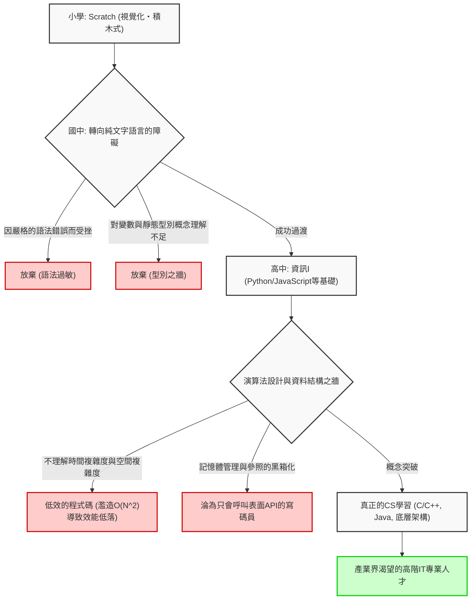
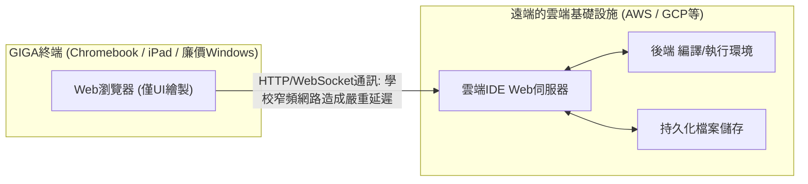

## 1. 前言：程式設計必修化帶來的光與影

2020年度小學的程式設計教育必修化、2021年度國中科技與家政科的內容擴充，以及2022年度高中新科目「資訊Ⅰ」的必修化，日本的IT教育和資訊教育在過去幾年中經歷了前所未有規模的典範轉移。這一系列政策的根本，存在著極其迫切且國家層面的需求，即培養能在 Society 5.0（超智能社會）時代生存的邏輯思考能力（運算思維），以及解決產業界長期存在的高階IT人才短缺問題。

然而，如果我們把目光轉向教育現場的最前線，就會發現國家描繪的理想與現實之間產生了巨大的落差。最嚴重的問題在於，「學習程式設計這個工具」與「鑽研電腦科學（計算機科學）這門學問」被完全混為一談。此外，全國統一建置的IT基礎設施因規格限制而產生的技術瓶頸，以及負責指導的教師在專業技能上的不足等，需要解決的結構性問題堆積如山。

本文將總結日本程式設計教育必修化「之後」的情況，並從電腦科學理論、硬體架構限制以及全球產業競爭力的角度，極其詳細且具技術性地剖析當前正在面臨的IT教育的本質與結構性問題。這不僅僅是一篇教育論述，更是從軟體工程視角考察日本未來、長達一萬字的論述。

## 2. 視覺化程式設計的陷阱：從 Scratch 到純文字寫程式的深淵

在小學程式設計教育中占據事實標準（De facto standard）地位的，是以麻省理工學院媒體實驗室（MIT Media Lab）開發的「Scratch」為代表的視覺化程式設計語言（積木程式設計）。它使用直覺的圖形介面，像拼圖一樣組合積木，讓學生能視覺化且直覺地學習「循序（Sequence）」、「選擇（Selection）」、「重複（Iteration）」這三個演算法的基本控制結構，作為入門教育這是一項值得高度評價的偉大發明。

但是，這裡存在著一個重大的陷阱，可以稱之為「抽象化的陷阱」。那就是「從視覺化程式設計過渡到基於純文字的真正程式設計語言（如 Python, JavaScript, C++, Rust 等）極為困難，許多學習者在這個階段就遭遇挫折」這個殘酷的事實。

### 抽象化之牆與電腦科學的黑箱化

以 Scratch 為首的視覺化程式設計環境，將程式設計中複雜的語法（Syntax）、嚴格的型別系統（Type system）、記憶體生命週期管理等構成電腦科學根基的重要元素進行了高度抽象化，並刻意隱藏（封裝）起來。這在降低初學者認知負荷方面表現優異，但卻成了邁向下一步真正工程學時的巨大障礙。因為在實際的軟體開發領域，對變數作用域（區域變數與全域變數）、複雜的資料結構（陣列、鏈結串列、雜湊表、二元搜尋樹、圖）、指標操作，以及記憶體的堆積（Heap）與堆疊（Stack）空間的理解是絕對不可或缺的。

以下的 Mermaid 圖視覺化了初學者從視覺化程式設計過渡到真正的電腦科學過程中面臨的學習障礙與放棄（Drop-off）的節點。



從這個流程圖可以明顯看出，僅僅累積「寫出讓畫面上角色移動的程式碼」的經驗，是無法培養出能夠設計具備可擴展性（Scalability）的分散式系統架構、並將效能優化至毫秒等級的真正軟體工程師的。用滑鼠組合 Scratch 色彩繽紛的積木，與閱讀 Linux 核心的 C 語言原始碼、追蹤 TCP/IP 堆疊行為之間，存在著無法單純用「使用的語言不同」來解釋的概念理解上的絕對斷層。

## 3. 缺乏「數學」與「離散邏輯」的寫碼極限：從計算複雜度理論探討

日本程式設計教育課程最大的弱點，甚至可以說是致命缺陷的，就是「寫碼技術」與「數學、離散數學（Discrete Mathematics）」之間的結合嚴重不足。在以美國和印度為首的頂級電腦科學教育中，比起程式語言的語法本身，更重視演算法的效率、數理邏輯以及數學證明。因為程式碼不過是數學公式的翻譯罷了。

### 時間複雜度與空間複雜度（Big O Notation）的絕對支配

在評估與設計軟體效能時，時間複雜度（Time Complexity）和空間複雜度（Space Complexity）的概念是無法迴避的。當輸入某個演算法的資料規模為 $N$ 時，表示執行時間或記憶體消耗將如何增長的，就是蘭道漸近符號（Big O Notation，大 O 符號）。

在數學定義上，$f(x) = O(g(x))$ 被嚴格定義如下：

$$
\exists C > 0, \exists x_0 > 0, \forall x > x_0, |f(x)| \le C \cdot |g(x)|
$$

在日本的資訊教育中，例如學習資料排序時，常見的情況是僅僅在 Python 中呼叫 `array.sort()` 這個內建方法就結束了。然而，資訊工程真正要求的是，去理解並在數學上證明，為什麼簡單的氣泡排序法在實用領域絕對不會被使用，而快速排序法、合併排序法，或是 Timsort 會被採用為標準函式庫。

以下列出代表性排序演算法的平均時間複雜度：

- 氣泡排序 (Bubble Sort): $O(N^2)$
- 選擇排序 (Selection Sort): $O(N^2)$
- 插入排序 (Insertion Sort): $O(N^2)$
- 合併排序 (Merge Sort): $O(N \log N)$
- 快速排序 (Quick Sort): $O(N \log N)$
- 堆積排序 (Heap Sort): $O(N \log N)$

例如，合併排序的時間複雜度 $T(N)$，基於分治法（Divide and Conquer）的典範，可用以下遞迴關係式來表示：

$$
T(N) = 2T\left(\frac{N}{2}\right) + O(N)
$$

透過使用主定理（Master Theorem）展開並解開這個遞迴式，可以導出理想的複雜度 $T(N) = O(N \log N)$：

$$
T(N) = \Theta(N \log_2 N)
$$

在現代的大數據分析或 Web 規模的流量處理中，$N$ 是一個高達數億、數十億的巨大數量級。如果無知的程式設計師實作了 $O(N^2)$ 的低效演算法，對於 $N = 10^6$ 的資料就需要 $10^{12}$ 次（一兆次）無謂的比較運算，系統實際上將會凍結並崩潰。另一方面，如果是 $O(N \log N)$，則大約只需 $2 \times 10^7$ 次（兩千萬次）運算即可完成。在缺乏這種殘酷的數理基礎支持下，就自稱「我會寫程式」，就如同不懂結構力學卻去蓋高樓大廈一樣，是非常危險的。

## 4. 記憶體管理與系統架構的黑箱化

更深層的問題在於，對記憶體管理（Memory Management）和 CPU 架構的理解完全缺失。現今學校教的都是具備垃圾回收機制（Garbage Collection, GC）的高階語言，如 Python 或 JavaScript，學習這些語言的學生一輩子都不會去意識到變數或物件被配置在實體記憶體（RAM）的哪裡（是堆積空間還是堆疊空間）、是如何被分配的，以及何時用什麼方式被釋放的。

```c
// C語言中明確且直接的記憶體分配與指標操作範例
#include <stdio.h>
#include <stdlib.h>

int main() {
    int n = 1000000;
    // 在堆積空間中動態分配連續記憶體 (對OS進行系統呼叫)
    int *array = (int*)malloc(n * sizeof(int));
    
    if (array == NULL) {
        fprintf(stderr, "Memory allocation failed! Out of memory.\n");
        return 1;
    }
    
    // 透過指標運算初始化陣列
    for(int i = 0; i < n; i++) {
        *(array + i) = i * 2; // 等同於 array[i] = i * 2
    }
    
    // 為防止記憶體流失（Memory Leak）而明確釋放資源
    free(array);
    array = NULL; // 防止懸空指標（Dangling pointer）
    
    return 0;
}
```

指標（直接參照記憶體位址）的概念、為將 CPU 快取記憶體層級（L1/L2/L3 快取）命中率提升至極限的資料配置（Data Locality），以及多執行緒環境中的競爭危害（Race Condition）與互斥控制（Mutex/Semaphore）等知識，在開發高效能後端系統、3D 遊戲引擎或物聯網（IoT）嵌入式系統時，是絕對不可或缺的。目前的文部科學省課綱始終停留在「讓表面的應用程式動起來」，不得不說這已經大幅偏離了「理解電腦科學深淵」這個原本的學術目標。

## 5. 資料庫與持久化的障礙：關聯代數的缺席

在現代的應用程式中，資料的保存與搜尋（持久化）是不可避免的主題。然而，許多學校教育僅停留在程式執行結束後就會消失的「記憶體上的資料處理」。關係資料庫（RDBMS）與 SQL 背後的數學理論，也就是埃德加·F·科德（Edgar F. Codd）博士所提出的「關聯代數（Relational Algebra）」，卻鮮少被教授。

資料庫的運算是基於集合論的以下基本運算來定義的：

- 選擇（Selection, $\sigma$）: 擷取滿足條件的元組（列）
- 投影（Projection, $\pi$）: 擷取特定的屬性（行）
- 結合（Join, $\bowtie$）: 多個關聯的條件式交集

此外，為了能從龐大的紀錄中瞬間搜尋出目標資料，學習「B-Tree（B樹）索引」的結構，是資料結構應用的最佳實踐。B-Tree 能將磁碟 I/O 的次數降至最低，同時保證 $O(\log N)$ 的搜尋速度。不了解交易（Transaction）的 ACID 特性（原子性、一致性、隔離性、持久性），是無法建立出強健的系統的。

## 6. 安全性與密碼學：質因數分解困難性支撐著社會基礎設施

在資訊素養教育中，雖然有進行「密碼要設得複雜一點」、「不要點擊可疑連結」這種表面上的安全教育，但卻幾乎不教支撐著整個網際網路社會根基的「密碼學」數理。

我們每天使用的 HTTPS 通訊和數位簽章，都是受到 RSA 密碼等公開金鑰密碼系統的保護。RSA 密碼的安全性依賴於「巨大的整數質因數分解，在現今的古典電腦上無法在合理時間內解開」這個數學難題（被認為是 NP 中間問題）。

作為 RSA 密碼基礎的數學公式，是尤拉函數（Euler's totient function）和費馬小定理（Fermat's Little Theorem）應用的優美展現：

1. 選擇兩個巨大的質數 $p$ 和 $q$
2. 計算 $n = p \times q$（這將成為公鑰的一部分）
3. 計算 $\phi(n) = (p-1)(q-1)$
4. 選擇 $e$ 和 $d$，使得 $e \times d \equiv 1 \pmod{\phi(n)}$
5. 加密: $C \equiv M^e \pmod{n}$
6. 解密: $M \equiv C^d \pmod{n}$

像這樣，程式設計教育必須與數學教育緊密結合，才能發揮出真正的威力。將數學公式轉化為程式碼並實作於社會的過程，正是科學的醍醐味所在。

## 7. GIGA School 構想與基礎設施的絕望限制：Chromebook 與雲端 IDE

談到日本的 IT 教育，絕對不能忽略由文部科學省投入鉅額預算推動的「GIGA School 構想」。這項為全國中小學生配備「一人一機」及高速網路環境的國家專案，被寄予厚望成為挽回數位化落後的催化劑。然而，實際配發的終端設備在硬體規格和架構上，卻成了正規程式設計教育的嚴重絆腳石。

### 低規格終端與本機開發環境的喪失

作為 GIGA School 構想標準規格引進的終端設備，大多是極其廉價的 Chromebook、iPad 或是低階的 Windows 裝置。其標準規格如下：

- CPU: Intel Celeron 或廉價版 ARM 處理器
- 記憶體 (RAM): 4GB （僅能勉強運行現代 OS 的容量）
- 儲存空間 (eMMC): 32GB ～ 64GB （極端緩慢的 I/O 速度）

受限於這樣貧乏的硬體限制，要建置專業工程師日常使用的「本機開發環境（Local Development Environment）」實際上是不可能的。使用 Docker 啟動 Linux 容器、以全功能執行 Visual Studio Code 等重量級 IDE，或是啟動 Node.js 及 Python 的本機伺服器並安裝龐大的函式庫，都會立刻導致記憶體枯竭和系統凍結。

結果就是，教育現場被迫陷入只能完全依賴在瀏覽器上運行的雲端 IDE（如 Google Colaboratory, Replit，或是教科書出版商自己開發的輕量 Web 工具等）的狀況。



完全依賴雲端 IDE，在教育上會引發以下極其嚴重的缺失：

1. **對檔案系統與 OS 架構的不了解**: 由於沒有本機環境，對於目錄結構、絕對路徑與相對路徑的概念、環境變數的設定、檔案權限，以及在 CLI（命令列介面）上操作 OS 這些 IT 工程師理所當然該具備的必備知識（UNIX 素養）完全無法建立。
2. **網路延遲與基礎設施的脆弱性**: 由於以持續連線為前提，全校學生同時連線的瞬間，學校的網路頻寬就會陷入擁塞，導致瀏覽器凍結、學習完全停擺的事件在全國各地頻繁發生。
3. **被剝奪版本控制（Git）的體驗**: 透過黑色終端機畫面學習如何管理原始碼的變更歷史、以及在世界各地的團隊中進行協同開發的 Git 與 GitHub 概念的機會被剝奪了。

專業的軟體工程師在進行開發時，在終端機（Shell）上的操作是絕對的基礎。如果不經歷敲擊 `ls`, `cd`, `grep`, `chmod`, `git rebase` 等指令，並直接與本機 OS 核心對話的踏實經驗，絕對無法培育出真正的 IT 人才。只在 Chromebook 的沙盒（Sandbox）裡玩耍，是無法誕生出能俯瞰整個系統的全端工程師的。

## 8. 與世界的絕望差距：產業界的需求水準與學校教育的落差

日本 IT 教育面臨的最後一個，也是堪稱國家危機的課題，就是在全球競爭背景下競爭力的急遽下降。

### 各國激烈的電腦科學教育

在英國（UK），早在 2014 年起就將名為「Computing」的科目列為從 5 歲（Key Stage 1）開始的必修課。他們的課綱不僅停留在單純的「程式設計體驗」，還涵蓋了演算法的邏輯設計、透過布林代數（Boolean algebra）理解邏輯電路、網路拓樸、甚至是硬體架構，是非常學術且具系統性的正規電腦科學。

在美國，存在由 CSTA（美國電腦科學教師協會）制定的 K-12（幼兒園至高中畢業）嚴格標準課綱，高中生修習的 AP（Advanced Placement）Computer Science A 中，會使用 Java 進行正規的物件導向程式設計、多型、遞迴處理、資料結構實作，以及演算法的複雜度評估，要求水準極高，達到大學一年級的程度。印度或中國在 STEM 教育上的激烈程度，以及從中脫穎而出的菁英階層的厚實度，就更不用說了。

### 需求的技能與教授的技能之間的絕望落差

現代產業界，特別是全球化的大型新創企業與科技巨頭（如 GAFAM 等），對剛畢業的軟體工程師所要求的能力，正以驚人的速度逐年提高。建立雲端原生基礎設施（AWS, GCP, Kubernetes）、微服務架構的分散式系統設計、機器學習工作流程的實作，以及進階的安全知識等，都需要廣泛且深厚的專業性。

以下圖表概念性地展示了目前日本學校教育所提供的技能達成度，與最前線產業界要求技能水準之間令人絕望的差距。

```mermaid
xychart-beta
    title 日本學校教育提供的技能 vs 產業界要求技能水準
    x-axis ["視覺化語言", "基本語法/變數", "演算法/複雜度", "OS/網路", "DB/系統設計", "雲端/分散式架構"]
    y-axis "達成度 / 需求度 (%)" 0 --> 100
    line "目前學校教育的達成水準" [95, 60, 15, 5, 2, 0]
    line "產業界・科技公司要求的水準" [0, 20, 85, 90, 95, 100]
```

為了填補這個巨大的落差（死亡之谷，Death Valley），必須對學校教育進行根本性的典範轉移，並投入龐大的資金。在全國各地「資訊科」專業教師壓倒性不足的情況下，由數學科、理科，或是科技與家政科的教師在繁重本業之餘，且在缺乏充分培訓的狀態下兼著教程式設計的現狀體制下，是絕對無法培育出能在世界上競爭的頂尖工程師的。

## 9. AI 時代（LLM）中「寫程式」價值的暴跌

讓情況變得更加複雜的是，以 ChatGPT 為代表的大型語言模型（LLM），以及 GitHub Copilot 等 AI 寫碼助手的爆炸性普及。在 AI 能根據自然語言指令瞬間生成完美程式碼，甚至連測試程式碼都寫好的現代，僅僅「懂 Python 語法」、「知道如何呼叫 API」的所謂「寫碼員（Coder）」，其市場價值正在迅速暴跌。

在 AI 時代，人類工程師被要求的能力，不是對程式語言語法的記憶力，而是以下能力：

1. **需求定義與領域塑模 (Domain Modeling)**: 萃取必須解決的複雜現實問題，並將其模型化為系統的能力。
2. **架構設計**: 描繪能確保可擴展性、可用性與可維護性的系統整體設計圖的能力。
3. **數理與邏輯驗證**: 從理論上驗證並證明 AI 生成的程式碼是否存在安全漏洞或運算瓶頸的能力。

諷刺的是，這些全部都不是「表面的程式設計」，而是深奧且抽象的「電腦科學與數學」領域。如果日本的教育只教那些「容易被 AI 取代的下游工程技能」，那不得不說這將是國家級的損失。

## 10. 邁向數理科學與程式設計的融合：對次世代教育的建言

未來的日本 IT 教育當務之急，是擺脫「將程式設計目的化、手段化」，並回歸到「將電腦科學作為數理科學來探索」。程式語言不過是表達思考的工具，其底層的數學與邏輯結構，才是即使時代變遷也不會褪色的普世價值。

例如，人工智慧（AI）與機器學習的核心，與線性代數（矩陣運算與張量）、多變量微積分（梯度下降法）、機率統計（貝氏推論與資訊量）有著密不可分的關係。深度學習類神經網路中的權重最佳化，是透過使用偏微分的連鎖律（Chain Rule）和反向傳播演算法（Backpropagation）來公式化的。

$$
\frac{\partial L}{\partial w_{ij}^{(l)}} = \frac{\partial L}{\partial z_i^{(l+1)}} \cdot \frac{\partial z_i^{(l+1)}}{\partial w_{ij}^{(l)}} = \delta_i^{(l+1)} \cdot a_j^{(l)}
$$

能將這些高深的數學公式轉化為程式碼，並能意識到 GPU (CUDA) 或 TPU 的硬體架構，將平行運算（Parallel Computing）最佳化至極限並實作出來的人才，才是引領次世代 IT 產業的人。正因為如此，我們必須立即從只是讓人死記硬背表面語法的膚淺教育中脫身，轉向探究運算原理原則（First Principles）的深度教育。

## 11. 結論：通往真正 IT 大國的險峻路程與我們的決心

2020 年代程式設計教育的必修化，在讓日本社會整體廣泛認知到「IT與資訊的重要性」這一點上，毫無疑問是確實的一步。然而，那只不過是漫長旅程中的「暖身運動」而已。

我們必須教導孩子們，從用 Scratch 讓貓咪角色移動的樂趣中向前邁出一步，去感受 $O(N \log N)$ 演算法在數學上的優美，去體會從終端機的黑色畫面透過 TCP 封包與全世界伺服器對話的興奮。我們必須重建能克服 GIGA School 構想硬體限制的新教育基礎設施，培育並配置具備高階 CS 專業知識的指導者，並且有時要大膽地將外部的專業工程師捲入學校教育之中。

日本 IT 教育所面臨的課題極其深遠、根深蒂固且複雜。但是，當我們不再逃避這些課題，產學官真心合作致力於解決問題，並成功建立起一個不再只是量產「只能按規格書寫碼的勞工」，而是能持續培育出「能從零開始設計並創造系統的真正工程師」的生態系統時，日本才能作為真正意義上的 IT 大國，再次領航世界。

如何在程式設計必修化「之後」這個最困難且最重要的階段中戰鬥到底。現在，正是考驗我們這些大人們的認真程度與決心的時候。

---

*本文概述了計算複雜度理論及 GIGA School 構想在基礎設施上的限制。關於更專業的電腦科學主題（如分散式系統的演算法、底層記憶體管理手法的細節等），預計將在未來的連載中陸續探討。*


