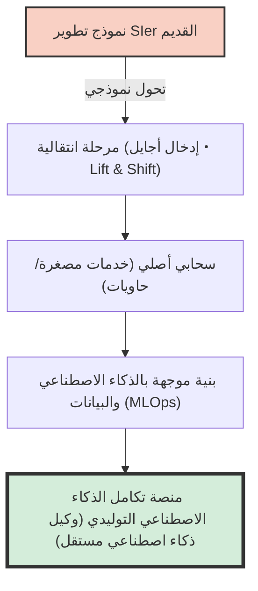
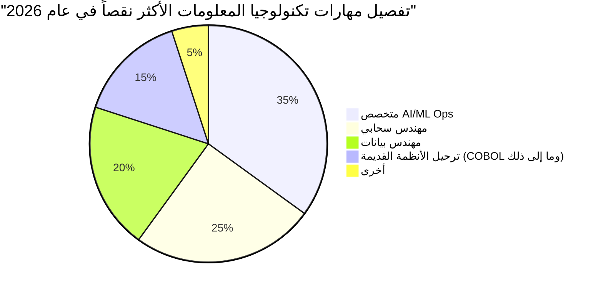
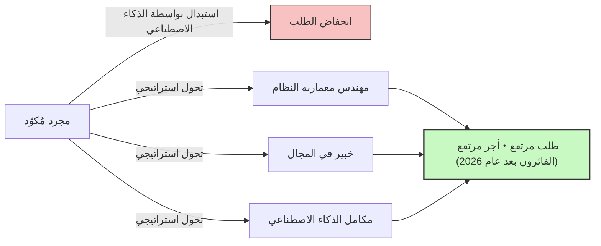

## مقدمة: فخ مصطلح "نقص المواهب في تكنولوجيا المعلومات"

في صناعة تكنولوجيا المعلومات في اليابان، لطالما ترددت في وسائل الإعلام مصطلحات مثيرة مثل "جرف 2025" و "نقص في مواهب تكنولوجيا المعلومات يصل إلى 790,000 بحلول عام 2030"، ولكن ما نواجهه الآن هو مرحلة جديدة تمامًا من الأزمة التي ينبغي أن نطلق عليها **"مشكلة 2026"**.

في تقارير وزارة الاقتصاد والتجارة والصناعة وتغطيات وسائل الإعلام المختلفة، يتم تجميع المشكلة تحت عبارة "هناك نقص هائل في مهندسي تكنولوجيا المعلومات". ومع ذلك، عند الاستماع إلى الأصوات الحقيقية من أرض الواقع، يبدو الوضع أكثر تعقيدًا. في الواقع، ليس "الجميع" ناقصين. هناك **"نقص كارثي في كبار المهندسين ذوي المهارات العالية الذين ترغب الشركات بشدة في توظيفهم"، بينما من ناحية أخرى، هناك فائض في العرض من "المهندسين المبتدئين وعديمي الخبرة"، مما يجعل من الصعب عليهم العثور على عمل** - وهو استقطاب قوي يحدث الآن.

في هذا المقال، سنتعمق في ما يحدث حقًا في صناعة تكنولوجيا المعلومات اليوم، بدءًا من التحول النموذجي من نموذج SIer القديم إلى التطوير السحابي الأصلي والموجه بالذكاء الاصطناعي، إلى جرف الأنظمة القديمة، والتأثير المدمر الذي أحدثه الذكاء الاصطناعي التوليدي مثل GitHub Copilot.

---

## 1. التغيير الهيكلي: الانتقال من نموذج SIer التقليدي إلى التطوير السحابي الأصلي والموجه بالذكاء الاصطناعي

ما دعم صناعة تكنولوجيا المعلومات في اليابان لسنوات عديدة هو نموذج SIer (متكامل الأنظمة) مع هيكل التعاقد من الباطن المتعدد. إنه ما يسمى بنموذج الأعمال "الكثيف العمالة" حيث يتم كتابة التعليمات البرمجية وفقًا للمواصفات وتعبئة مستندات مواصفات الاختبار. هنا، كانت قيمة المهندس تقاس بوحدة "أشهر الأفراد" (Man-months)، وكان الافتراض هو أنه إذا كان هناك عدد كافٍ من الأشخاص، فسيتم تشغيل المشروع.

ومع ذلك، اعتبارًا من عام 2026، وصل هذا النموذج إلى حدوده. مع تحول جوهر التحول الرقمي (DX) من "مجرد رقمنة" إلى "تحويل نماذج الأعمال"، لم يعد تطوير نموذج الشلال (Waterfall) منخفض الرشاقة قادرًا على مواكبة التغيرات في السوق.

من المفترض أن تكون عمليات التطوير الحديثة **سحابية أصلية (Cloud-Native)** و **موجهة بالذكاء الاصطناعي (AI-Driven)**. لم تعد الحاويات (Docker/Kubernetes)، وبنية الخدمات المصغرة (Microservices)، وأتمتة مسارات CI/CD "تقنيات خاصة" بل أصبحت "بنية تحتية قياسية".



ما تبحث عنه الشركات ليس "مُكوّدًا" يقوم فقط بكتابة التعليمات البرمجية بناءً على المواصفات المعطاة. إنها تبحث عن موهبة يمكنها ترجمة متطلبات الأعمال إلى بنية تقنية، بالنظر إلى كل شيء بدءًا من تصميم البنية التحتية السحابية وحتى التنفيذ الخلفي، وصولًا إلى تشغيل نماذج التعلم الآلي (MLOps). في المجالات التي تتطلب مثل هذه المعرفة والخبرة الواسعة، أصبح من الصعب على أولئك الذين "يعرفون فقط بناء جملة لغة برمجة" خلق قيمة.

---

## 2. "جرف" الأنظمة القديمة ونضوب هندسة البيانات

كما تم التحذير في "جرف 2025"، لا تزال العديد من الشركات اليابانية تمتلك أنظمة قديمة في مقرات العمل أو حواسيب مركزية (مبنية بلغات مثل COBOL). أصبحت هذه الأنظمة عبارة عن صناديق سوداء بعد سنوات من التعديلات، ومع تقاعد كبار السن الذين كانوا مسؤولين عن الصيانة، أصبح الحفاظ عليها صعبًا للغاية.

من ناحية أخرى، هناك طلب قوي من جانب الأعمال "لاستغلال البيانات لبناء نماذج الذكاء الاصطناعي وتقديم تجارب مخصصة للعملاء". توجد فجوة قاتلة هنا. **هناك نقص هائل في "مهندسي البيانات" الذين يمكنهم تنظيف البيانات المنعزلة داخل المقرات، ودمجها، وبناء مسارات لجعلها قابلة للاستخدام في أحدث مسارات الذكاء الاصطناعي/التعلم الآلي.**

### النموذج الرياضي لتكلفة صيانة الأنظمة القديمة والتحديث

دعونا نفكر في نموذج رياضي بسيط لمقارنة تكلفة صيانة الأنظمة القديمة ($C_{legacy}$) مع الاستثمار المطلوب للتحديث (Modernization) وتكلفة التشغيل اللاحقة ($C_{modern}$).

تزداد تكلفة صيانة الأنظمة القديمة عامًا بعد عام. العوامل تشمل الاستجابة للأعطال بسبب الديون التقنية وارتفاع تكاليف الموظفين بسبب ندرة الفنيين القدامى.
إذا افترضنا أن عدد السنوات هو $t$، فيمكن التعبير عن ذلك على النحو التالي:

$$
C_{legacy}(t) = M_0 \times (1 + r)^t + L_0 \times (1 + i)^t
$$

حيث:
- $M_0$: تكلفة الصيانة الأولية
- $r$: معدل الزيادة في تكلفة الصيانة بسبب الديون التقنية
- $L_0$: التكلفة الأولية لمواهب الأنظمة القديمة
- $i$: معدل تضخم تكاليف الموظفين بسبب ندرة مواهب الأنظمة القديمة

من ناحية أخرى، إذا تم إجراء التحديث، فإن الاستثمار الأولي $I$ سيكون كبيرًا، ولكن يمكن إبقاء تكلفة التشغيل $O_m$ منخفضة ومستقرة نسبيًا من خلال الانتقال إلى السحابة والأتمتة.

$$
C_{modern}(t) = I + O_m \times t
$$

في معظم الحالات، من البديهي أن يصبح $C_{legacy}(t) > C_{modern}(t)$ في غضون بضع سنوات (نقطة التعادل)، ولكن نظرًا لعدم وجود "مهندسين معماريين" و "مهندسي بيانات" في السوق قادرين على تنفيذ الاستثمار الأولي $I$، فإن الوضع في عام 2026 هو أن العديد من الشركات تغرق في مستنقع $C_{legacy}$.



---

## 3. التأثير المدمر للذكاء الاصطناعي التوليدي: GitHub Copilot واختفاء المهندسين المبتدئين

عند مناقشة نقص المواهب في تكنولوجيا المعلومات، من المستحيل تجاهل **صعود الذكاء الاصطناعي التوليدي (Generative AI)**. لقد أدت أدوات مثل GitHub Copilot و Cursor و ChatGPT (سلسلة GPT-4o و O1) إلى تغيير إنتاجية تطوير البرمجيات بشكل جذري.

حتى الآن، كان هيكل الفريق الشائع هو أن يكرس كبار المهندسين وقتهم للتصميمات المعقدة والمراجعات، بينما يتركون (يفوضون) المهام للمهندسين المبتدئين مثل معالجة عمليات CRUD البسيطة (الإنشاء، القراءة، التحديث، الحذف)، وكتابة الأكواد النمطية (Boilerplate)، وكتابة أكواد الاختبار.

ومع ذلك، أصبح الذكاء الاصطناعي التوليدي الآن قادرًا على توليد 90% من هذه "المهام التي كان يقوم بها المبتدئون" في بضع ثوانٍ إلى دقائق، وبدقة عالية. ما النتيجة؟ **فقدت الشركات السبب لتوظيف المهندسين المبتدئين.**

### التغير في مضاعف الإنتاجية بسبب الذكاء الاصطناعي التوليدي

دعونا نعبر عن الإنتاجية الإجمالية لفريق التطوير قبل وبعد إدخال الذكاء الاصطناعي باستخدام الصيغ.

لنفترض أن الإنتاجية الأساسية هي $P$.
لنفترض أن معدل تحسين الإنتاجية لكبار المهندسين بسبب الذكاء الاصطناعي التوليدي هو $\alpha_{senior}$، ولمهندسين المبتدئين هو $\alpha_{junior}$.

$$
\text{Total Output}_{pre} = N_{senior} \times P_{senior} + N_{junior} \times P_{junior}
$$

$$
\text{Total Output}_{post} = N_{senior} \times P_{senior} \times (1 + \alpha_{senior}) + N_{junior} \times P_{junior} \times (1 + \alpha_{junior})
$$

للوهلة الأولى، يبدو أن إنتاجية المبتدئين تتحسن أيضًا. ولكن في الواقع العملي، فإن القدرة على **"التحقق من صحة الكود الذي يولده الذكاء الاصطناعي، ودمجه في النظام بأكمله، وتحديد ما إذا كانت هناك أي مخاوف أمنية"** أمر بالغ الأهمية. يفتقر المبتدئون إلى هذه القدرة (فهم السياق وقدرات التصميم المعماري).

نتيجة لذلك، يستخدم كبار المهندسين الذكاء الاصطناعي كـ "مساعدين متميزين (مبتدئين يعملون بلا حدود)"، مما يؤدي إلى قفزة في الإنتاجية بمقدار $2 \sim 3$ أضعاف ($\alpha_{senior} \approx 2.0$). بالمقابل، عندما يستخدم المبتدئون الذين يفتقرون إلى المهارات الأساسية الذكاء الاصطناعي، ينتج عن ذلك إنتاج كميات كبيرة من "شيفرة السباغيتي" المحملة بالديون التقنية والتي يبدو أنها تعمل في الظاهر، مما يؤدي إلى زيادة تكاليف المراجعة (هناك حالات يكون فيها المعدل الفعلي $\alpha_{junior} < 0$).

نتيجة لذلك، أدركت الشركات أن توظيف "مهندس أول (مستخدم ذكاء اصطناعي) واحد براتب شهري يبلغ 1.2 مليون ين" هو خيار أقل خطورة وأعلى أداءً بكثير من "توظيف 3 مبتدئين براتب شهري يبلغ 300 ألف ين". هذا هو الجوهر الحقيقي لـ "نقص المواهب". هناك نقص تام في "كبار المهندسين الذين يمكنهم إتقان الذكاء الاصطناعي".

```mermaid
xychart-beta
    title "الاستقطاب في الطلب الوظيفي بين المبتدئين وكبار المهندسين (2021-2026)"
    x-axis ["2021", "2022", "2023", "2024", "2025", "2026"]
    y-axis "معدل طلب الوظائف" 0.0 --> 10.0
    line ["كبار (مهندسو معمارية/MLOps وما إلى ذلك)"] [3.0, 3.5, 4.2, 5.8, 7.5, 9.2]
    line ["مبتدئون (بدون خبرة/خبرة من 1 إلى سنتين)"] [2.5, 2.2, 1.8, 1.2, 0.8, 0.3]
```

---

## 4. ما وراء هندسة الأوامر (Prompt Engineering): ما هي المهارات المطلوبة حقًا؟

إذن، ما هو نوع مواهب تكنولوجيا المعلومات المطلوبة في العصر القادم؟ من السابق لأوانه الاعتقاد بأنه "يكفي إتقان هندسة الأوامر". أصبحت تقنية إعطاء التعليمات باللغة الطبيعية أكثر بساطة وانتشارًا مع تطور نماذج الذكاء الاصطناعي.

على أرض الواقع، ما هو مطلوب حقًا اليوم هو المواهب التي يمكنها تغطية المجالات الثلاثة التالية:

### أ. التصميم الموجه بالمجال (DDD) ونمذجة الأعمال
يمكن للذكاء الاصطناعي كتابة التعليمات البرمجية، لكنه لا يمكنه "فك تشابك مواصفات الأعمال المعقدة، واكتشاف السياقات المحدودة (Bounded Context) للبرمجيات، وتصميم نماذج بيانات مناسبة". مهارة "التصميم الموجه بالمجال (DDD)"، التي تفهم بعمق مجال أعمال العميل وتترجمه إلى لغة تقنية، هي واحدة من أكثر المهارات قيمة في عصر الذكاء الاصطناعي.

### ب. تصميم البنية المعمارية والمتطلبات غير الوظيفية
المتطلبات غير الوظيفية مثل التوافر (Availability)، وقابلية التوسع (Scalability)، والأمان، والأداء للنظام ليست أشياء يقوم الذكاء الاصطناعي بتحسينها تلقائيًا. لا تزال القرارات المعمارية مثل "ما هي الخدمات السحابية التي يجب دمجها"، و "ما هي بروتوكولات الاتصال بين الخدمات المصغرة"، و "أين يجب رسم حدود المعاملات في قاعدة البيانات" تعتمد بشكل كبير على الخبرة والحدس البشري المتقدم.

### ج. MLOps وبناء مسارات البيانات
أصبح مفهوم "MLOps" لمواصلة تشغيل نماذج الذكاء الاصطناعي التوليدي والتعلم الآلي في بيئات الإنتاج ذا أهمية متزايدة. هناك طلب كبير على المواهب التي تمتلك هذه المهارات، والتي تقع عند تقاطع هندسة البرمجيات وعلوم البيانات، مثل مراقبة انحراف النموذج (تدهور الدقة)، وبناء مسارات التدريب المستمر، وتحسين موارد GPU.

---

## 5. استراتيجية البقاء للمهندسين: للبقاء على قيد الحياة بعد عام 2026

في ظل هذه الظروف، كيف يجب علينا نحن المهندسين بناء حياتنا المهنية؟ قد يبدو الوضع يائسًا، خاصة بالنسبة للمهندسين ذوي الخبرة القليلة. ومع ذلك، هناك العديد من الفرص للاختراق إذا كان لديك استراتيجية.

### الاستراتيجية 1: استهدف أن تصبح "منسق ذكاء اصطناعي"
بدلًا من أن تصبح خبيرًا في لغة أو إطار عمل واحد، اصقل قدراتك كـ "منسق" يجمع بين أدوات ووكلاء ذكاء اصطناعي متعددين لبناء النظام بأكمله. تحتاج إلى تقليل الوقت الذي تقضيه في كتابة التعليمات البرمجية بنفسك، وامتلاك "منظور أعلى" يربط المكونات التي كتبها الذكاء الاصطناعي معًا ويشرف على البنية المعمارية بأكملها.

### الاستراتيجية 2: اكتساب المعرفة بالمجال
بالإضافة إلى المهارات التقنية، امتلك معرفة عميقة بالمجال في صناعة معينة (مثل التمويل والطب والخدمات اللوجستية). المهندسون الذين يعرفون نقاط الألم في سير العمل جيدًا لديهم قوة إقناع قوية لا يمكن للذكاء الاصطناعي تقليدها عند اقتراح حلول تقنية. اترك "كيف (HOW)" للذكاء الاصطناعي وركز على "ماذا (WHAT)" و "لماذا (WHY)".

### الاستراتيجية 3: المهارات الشخصية وإدارة أصحاب المصلحة
في تطوير الأنظمة واسعة النطاق، في نهاية المطاف، يحدد "بناء العلاقات الإنسانية" و "إدارة التوقعات" نجاح أو فشل المشروع. "المهارات البشرية" مثل تحديد المتطلبات مع العملاء، والتيسير داخل الفريق، وبناء التوافق في اتخاذ القرارات المعقدة هي المجالات التي يصعب على الذكاء الاصطناعي استبدالها. المواهب التي تتفوق في مهارات الاتصال، معتمدة على التكنولوجيا كقاعدة، ستكون موضع تقدير أكبر في المستقبل.



---

## الخاتمة: لا تخف، بل اركب الموجة

آمل أن تكونوا قد أدركتم أن "مشكلة 2026" ونقص مواهب تكنولوجيا المعلومات المصاحب لها ليس مجرد "نقص في العدد"، بل هو "عدم تطابق ناتج عن تغيير جذري في المهارات المطلوبة".

ثقل الأنظمة القديمة، ونضوب مهندسي البيانات، والتحول النموذجي الذي أحدثه الذكاء الاصطناعي التوليدي. هذه الموجات تشكل تهديدًا للمهندسين التقليديين، لكنها أيضًا فرصة هائلة غير مسبوقة لأولئك الذين يقبلون التغيير ويمكنهم تحديث مجموعة مهاراتهم.

لن يسلبنا الذكاء الاصطناعي وظائفنا، بل هو مجرد أداة تسمح لنا بالتركيز على أعمال أكثر تقدمًا وإبداعًا. التحرر من "مهمة" الترميز والتركيز على "تصميم" الأنظمة و "خلق القيمة" في الأعمال. هذا هو المسار الوحيد للبقاء والازدهار في صناعة تكنولوجيا المعلومات بعد عام 2026.

الآن هو الوقت المناسب لإعادة تقييم مسارك المهني والتوجه نحو النموذج التالي.
هل أنت مستعد لـ "تحديث" نفسك؟
