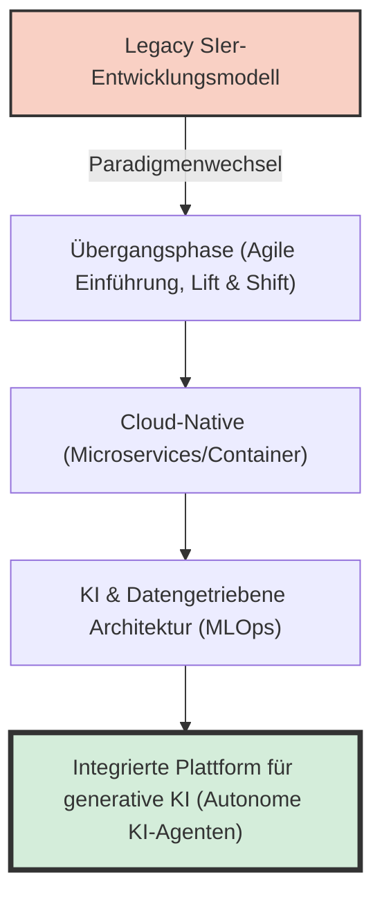
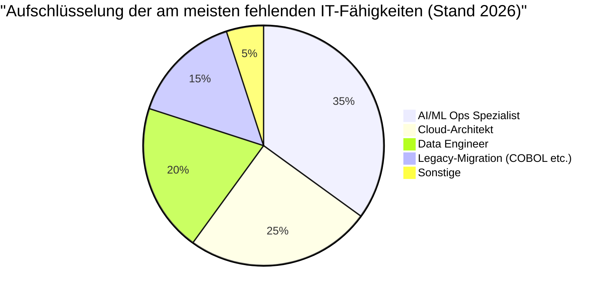
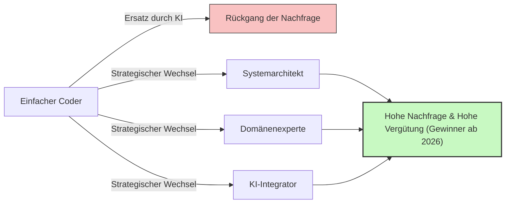

## Einführung: Die Falle des Begriffs "Mangel an IT-Fachkräften"

In der japanischen IT-Branche kursieren seit geraumer Zeit in den Medien reißerische Begriffe wie die "Klippe des Jahres 2025" oder "Ein Mangel von bis zu 790.000 IT-Fachkräften bis 2030". Aktuell stehen wir jedoch vor einer völlig neuen Krisenphase, die wir als **"das 2026-Problem"** bezeichnen sollten.

In den Berichten des Ministeriums für Wirtschaft, Handel und Industrie sowie in diversen Medienberichten wird pauschal behauptet, es fehle "massiv an IT-Entwicklern". Hört man jedoch auf die echten Stimmen aus der Praxis, ist die Situation etwas komplexer. Tatsächlich fehlt es nicht an "jedermann". Es gibt eine starke "Polarisierung": **Während es einen verheerenden Mangel an hochqualifizierten Senior-Entwicklern gibt, nach denen die Unternehmen händeringend suchen, gibt es gleichzeitig ein Überangebot an unerfahrenen oder noch wenig erfahrenen Junior-Entwicklern, die es zunehmend schwer haben, einen Job zu finden.**

Dieser Artikel geht der Frage auf den Grund, was aktuell wirklich in der IT-Branche passiert. Wir beleuchten eingehend den Paradigmenwechsel vom alten SIer-Modell (Systemintegrator) hin zur Cloud-nativen und KI-gesteuerten Entwicklung, die Klippe der Legacy-Systeme sowie die zerstörerischen Auswirkungen der generativen KI, wie etwa GitHub Copilot.

---

## 1. Struktureller Wandel: Der Übergang vom traditionellen SIer zur Cloud-nativen und KI-gesteuerten Entwicklung

Die japanische IT-Industrie stützte sich lange Zeit auf das SIer-Modell, das durch eine mehrschichtige Subunternehmerstruktur geprägt war. Dies ist ein "arbeitsintensives" Geschäftsmodell, bei dem Code nach Spezifikationen geschrieben und Testvorgaben abgearbeitet werden. Dabei wurde der Wert eines Entwicklers in der Einheit "Personenmonat" gemessen, und es galt die Annahme, dass ein Projekt erfolgreich ist, solange genügend Personal vorhanden ist.

Im Jahr 2026 stößt dieses Modell jedoch an seine Grenzen. Da sich das Wesen der digitalen Transformation (DX) von der "bloßen IT-isierung" hin zur "Transformation des Geschäftsmodells" verschoben hat, kann die wenig agile Wasserfall-Entwicklung nicht mehr mit den Marktveränderungen Schritt halten.

Der moderne Entwicklungsprozess setzt **Cloud-Native** und **KI-gesteuerte** Ansätze voraus. Containerisierung (Docker/Kubernetes), Microservices-Architektur und die Automatisierung von CI/CD-Pipelines sind nicht länger "spezielle Technologien", sondern "Standardinfrastruktur".



Unternehmen suchen nicht mehr nach "Codern", die einfach nur vorgegebene Spezifikationen programmieren. Sie brauchen Fachkräfte, die von der Gestaltung der Cloud-Infrastruktur über die Backend-Implementierung bis hin zum operativen Einsatz von Machine-Learning-Modellen (MLOps) vorausschauend agieren und Geschäftsanforderungen in eine technische Architektur übersetzen können. In einem Bereich, der ein so breites Wissen und Erfahrung erfordert, können Personen, die "lediglich die Syntax einer Programmiersprache kennen", kaum noch Mehrwert schaffen.

---

## 2. Die "Klippe" der Legacy-Systeme und der Mangel an Data Engineering

Wie schon bei der "Klippe des Jahres 2025" gewarnt, betreiben viele japanische Unternehmen noch immer Mainframes oder lokale Legacy-Systeme (oft in COBOL geschrieben). Diese Systeme sind durch jahrelange Anpassungen zu einer Blackbox geworden. Mit dem Eintritt der Senior-Mitarbeiter, die diese betreuten, in den Ruhestand wird die Aufrechterhaltung extrem schwierig.

Gleichzeitig gibt es von geschäftlicher Seite den starken Wunsch, "Daten zu nutzen, um KI-Modelle aufzubauen und personalisierte Kundenerlebnisse zu bieten". Hier klafft eine fatale Lücke. **Es gibt einen eklatanten Mangel an "Data Engineers", die isolierte, lokale Daten in eine Form bringen, die sie bereinigt, integriert und für moderne KI/ML-Pipelines nutzbar macht.**

### Mathematisches Modell: Kosten der Legacy-Wartung vs. Modernisierung

Lassen Sie uns ein einfaches mathematisches Modell betrachten, das die Kosten für die Wartung eines Legacy-Systems ($C_{legacy}$) mit den Investitionen für eine Modernisierung und den anschließenden Betriebskosten ($C_{modern}$) vergleicht.

Die Wartungskosten eines Legacy-Systems steigen von Jahr zu Jahr. Die Gründe dafür sind der Aufwand zur Behebung von Fehlern durch technische Schulden und die steigenden Personalkosten aufgrund der zunehmenden Seltenheit von Legacy-Technikern.
Wenn $t$ die Anzahl der Jahre ist, kann dies wie folgt ausgedrückt werden:

$$
C_{legacy}(t) = M_0 \times (1 + r)^t + L_0 \times (1 + i)^t
$$

Wobei:
- $M_0$: Anfängliche Wartungskosten
- $r$: Wachstumsrate der Wartungskosten durch technische Schulden
- $L_0$: Anfängliche Personalkosten für Legacy-Fachkräfte
- $i$: Lohninflation durch die Seltenheit von Legacy-Fachkräften

Wenn man hingegen eine Modernisierung durchführt, ist die Anfangsinvestition $I$ hoch, aber die Betriebskosten $O_m$ können durch Cloud-Nutzung und Automatisierung niedrig gehalten und leichter konstant gehalten werden.

$$
C_{modern}(t) = I + O_m \times t
$$

In vielen Fällen ist offensichtlich, dass innerhalb weniger Jahre (Break-even-Punkt) $C_{legacy}(t) > C_{modern}(t)$ eintreten wird. Da jedoch nicht genug "Architekten" und "Data Engineers" auf dem Markt sind, um die Anfangsinvestition $I$ umzusetzen, versinken viele Unternehmen 2026 zunehmend im Sumpf von $C_{legacy}$.



---

## 3. Die zerstörerischen Auswirkungen generativer KI: GitHub Copilot und das Verschwinden der Junior-Entwickler

Wenn man über den Mangel an IT-Fachkräften spricht, darf man den **Aufstieg der generativen KI (Generative AI)** auf keinen Fall übersehen. Werkzeuge wie GitHub Copilot, Cursor und ChatGPT (GPT-4o und die O1-Serie) haben die Produktivität in der Softwareentwicklung von Grund auf verändert.

Bisher war es in Entwicklungsteams üblich, dass Senior-Entwickler ihre Zeit komplexen Designs und Reviews widmeten, während einfache CRUD-Operationen (Create, Read, Update, Delete), Boilerplate-Code und das Schreiben von Testcode an Junior-Entwickler delegiert wurden.

Heute jedoch kann generative KI 90% dieser "Aufgaben, die von Juniors erledigt wurden", in wenigen Sekunden bis Minuten und mit hoher Präzision generieren. Was ist die Folge? **Unternehmen haben den Grund verloren, Junior-Entwickler einzustellen.**

### Veränderung des Produktivitätsmultiplikators durch generative KI

Wir drücken die Gesamtproduktivität eines Entwicklungsteams vor und nach der Einführung von KI mathematisch aus.

Die Basis-Produktivität sei $P$.
Die Produktivitätssteigerung für Senior-Entwickler durch den Einsatz generativer KI sei $\alpha_{senior}$, und für Junior-Entwickler $\alpha_{junior}$.

$$
\text{Total Output}_{pre} = N_{senior} \times P_{senior} + N_{junior} \times P_{junior}
$$

$$
\text{Total Output}_{post} = N_{senior} \times P_{senior} \times (1 + \alpha_{senior}) + N_{junior} \times P_{junior} \times (1 + \alpha_{junior})
$$

Auf den ersten Blick scheint es, als ob auch die Produktivität der Juniors steigt. In der Praxis ist jedoch die **Fähigkeit, die von der KI generierten Codes auf Gültigkeit zu prüfen, sie in das Gesamtsystem zu integrieren und mögliche Sicherheitsbedenken einzuschätzen**, unverzichtbar. Genau diese Fähigkeit (Kontextverständnis und Architekturdesign) fehlt Junior-Entwicklern.

Infolgedessen nutzen Senior-Entwickler die KI als "super-kompetenten Assistenten (einen Junior, der unbegrenzt arbeitet)" und steigern ihre Produktivität auf das 2- bis 3-fache ($\alpha_{senior} \approx 2.0$). Wenn hingegen Juniors ohne grundlegendes Verständnis KI einsetzen, entsteht oft Spaghetti-Code, der zwar oberflächlich funktioniert, aber massive technische Schulden aufbaut, was paradoxerweise zu höheren Review-Kosten führt (es gibt sogar Fälle, in denen praktisch $\alpha_{junior} < 0$ ist).

Das Resultat: Unternehmen haben erkannt, dass es weitaus risikoärmer und leistungsstärker ist, "einen Senior (KI-Nutzer) für ein Monatsgehalt von 1,2 Millionen Yen einzustellen", als "drei Juniors für jeweils 300.000 Yen". Das ist die wahre Natur des "Fachkräftemangels". Es fehlt schlichtweg an "Senior-Entwicklern, die KI beherrschen".

```mermaid
xychart-beta
    title "Polarisierung der Nachfrage nach Junior- und Senior-Positionen (2021-2026)"
    x-axis ["2021", "2022", "2023", "2024", "2025", "2026"]
    y-axis "Verhältnis von Stellenangeboten zu Bewerbern" 0.0 --> 10.0
    line ["Senior (Architekt/MLOps etc.)"] [3.0, 3.5, 4.2, 5.8, 7.5, 9.2]
    line ["Junior (Unerfahren/1-2 Jahre Erfahrung)"] [2.5, 2.2, 1.8, 1.2, 0.8, 0.3]
```

---

## 4. Jenseits von Prompt Engineering: Welche Fähigkeiten sind wirklich erforderlich?

Was für IT-Fachkräfte werden in Zukunft also gebraucht? Es ist verfrüht zu denken, dass es reicht, "Prompt Engineering zu perfektionieren". Die Technik, Anweisungen in natürlicher Sprache zu geben, wird mit der Weiterentwicklung der KI-Modelle immer einfacher und wird zunehmend zur Massenware.

Die Realität vor Ort zeigt, dass aktuell Personen gefragt sind, die folgende drei Bereiche abdecken können:

### A. Domain-Driven Design (DDD) und Business Modeling
KI kann zwar Code schreiben, aber sie kann nicht "die komplexen Geschäftsspezifikationen entschlüsseln, den Bounded Context der Software definieren und das passende Datenmodell entwerfen". Die Fähigkeit des "Domain-Driven Design (DDD)", das Geschäftsfeld (die Domäne) des Kunden tiefgreifend zu verstehen und in eine technische Sprache zu übersetzen, ist im KI-Zeitalter eine der wertvollsten Fähigkeiten überhaupt.

### B. Architektur und Design von nicht-funktionalen Anforderungen
"Nicht-funktionale Anforderungen" wie Systemverfügbarkeit, Skalierbarkeit, Sicherheit und Performance werden von der KI nicht automatisch optimiert. Architekturentscheidungen wie "Welche Cloud-Dienste sollen kombiniert werden?", "Welches Kommunikationsprotokoll wird zwischen Microservices verwendet?" oder "Wo werden die Transaktionsgrenzen der Datenbank gezogen?" hängen weiterhin stark von der umfassenden Erfahrung und Intuition von Menschen ab.

### C. Aufbau von MLOps und Daten-Pipelines
Das Konzept des "MLOps", um generative KI und maschinelle Lernmodelle in Produktionsumgebungen aufrechtzuerhalten, wird immer wichtiger. Fachkräfte, die sich an der Schnittstelle von Software Engineering und Data Science befinden – etwa in der Überwachung von Modellverschiebungen (Model Drift), der Automatisierung von kontinuierlichem Training und der Optimierung von GPU-Ressourcen –, sind stark gefragt.

---

## 5. Überlebensstrategie für Entwickler: Wie man die Zeit ab 2026 übersteht

Wie sollten wir Entwickler in dieser Situation unsere Karriere planen? Besonders für Entwickler mit wenig Erfahrung mag die Lage hoffnungslos erscheinen. Doch mit der richtigen Strategie gibt es durchaus Auswege.

### Strategie 1: Das Ziel, ein "AI Orchestrator" zu werden
Anstatt zum Experten für eine einzelne Sprache oder ein bestimmtes Framework zu werden, sollte man die Fähigkeit entwickeln, als "Orchestrator" mehrere KI-Tools und Agenten zu kombinieren, um komplette Systeme zu bauen. Es ist notwendig, die Zeit für das eigenhändige Schreiben von Code zu reduzieren und eine "höhere Perspektive" einzunehmen, um von der KI erstellte Komponenten zusammenzufügen und die Gesamtarchitektur im Blick zu behalten.

### Strategie 2: Erwerb von Domänenwissen
Beschränken Sie sich nicht nur auf technische Fähigkeiten, sondern eignen Sie sich tiefgreifendes Domänenwissen in bestimmten Branchen (wie Finanzen, Gesundheitswesen, Logistik etc.) an. Ein Entwickler, der die Schwachstellen in den Arbeitsabläufen genau kennt, besitzt eine enorme Überzeugungskraft bei der Präsentation technischer Lösungen, die KI nicht nachahmen kann. Überlassen Sie das "WIE (wie es gebaut wird)" der KI und konzentrieren Sie sich auf das "WAS (was gebaut wird)" und "WARUM (warum es gebaut wird)".

### Strategie 3: Soft Skills und Stakeholder-Management
Letztendlich sind es bei der Entwicklung großer Systeme "zwischenmenschliche Beziehungen" und das "Erwartungsmanagement", die über Erfolg oder Misserfolg eines Projekts entscheiden. "Human Skills" wie Anforderungsdefinitionen mit dem Kunden, Facilitation im Team und Konsensfindung bei komplexen Entscheidungen sind für eine KI am schwersten zu ersetzen. Personen mit einer starken technischen Basis und hervorragenden kommunikativen Fähigkeiten werden in Zukunft noch gefragter sein.



---

## Fazit: Keine Angst haben, sondern auf der Welle reiten

Sie werden nun verstanden haben, dass das "2026-Problem" und der damit einhergehende Mangel an IT-Fachkräften nicht einfach ein "Mangel an Köpfen" ist, sondern ein "Mismatch durch eine drastische Veränderung der geforderten Fähigkeiten".

Der Druck alter Legacy-Systeme, der Mangel an Data Engineers und der durch generative KI ausgelöste Paradigmenwechsel: All diese Wellen stellen für herkömmliche Entwickler eine Bedrohung dar, aber für diejenigen, die Veränderungen annehmen und ihre Fähigkeiten anpassen, sind sie eine riesige Chance, wie es sie noch nie gab.

KI nimmt uns nicht unsere Jobs weg, sie ist lediglich ein Werkzeug, das es uns ermöglicht, uns auf anspruchsvollere und kreativere Arbeiten zu konzentrieren. Wir müssen uns von der "Arbeit" des Programmierens befreien und uns auf das "Design" von Systemen und die "Wertschöpfung" im Geschäft konzentrieren. Dies ist der einzige Weg, um in der IT-Branche ab 2026 nicht nur zu überleben, sondern auch erfolgreich zu sein.

Jetzt ist es an der Zeit, Ihren Karriereweg zu überdenken und den Kurs in Richtung des nächsten Paradigmas zu ändern.
Sind Sie bereit, sich selbst zu "modernisieren"?
