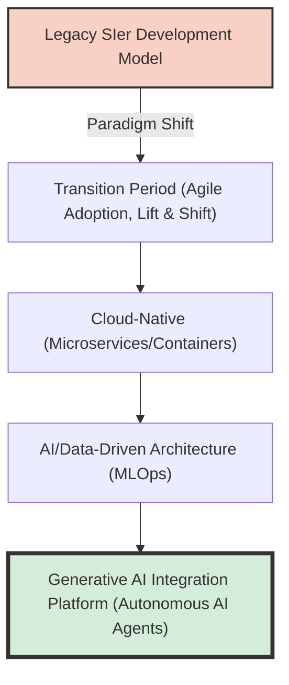
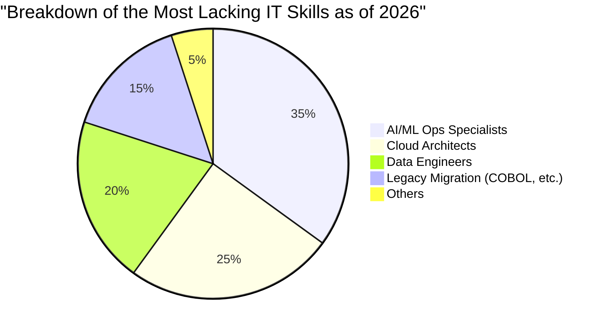
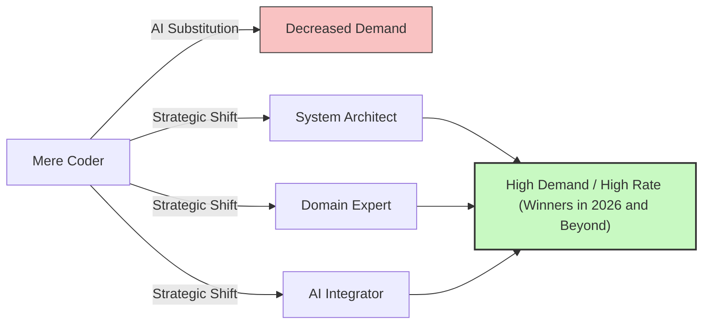

## Introduction: The Trap of the Term "IT Talent Shortage"

For a long time, sensational terms like the "2025 Cliff" and "a maximum shortage of 790,000 IT personnel by 2030" have been flying around the media in the Japanese IT industry. However, what we are currently facing is an entirely new phase of crisis that should be called the **"2026 Problem"**.

Reports from the Ministry of Economy, Trade and Industry and various media coverage lump things together by saying, "there is an overwhelming shortage of IT engineers." However, when you listen to the real voices on the ground, the situation is a bit more complex. In reality, it's not that "everyone is in short supply." **While there is a catastrophic shortage of "highly skilled senior engineers that companies desperately want," there is an oversupply of "inexperienced or junior engineers," making it increasingly difficult for them to find jobs.** This is an intense "polarization" that is taking place.

This article will deeply explore and explain exactly what is happening in the IT industry right now, covering the paradigm shift from the traditional SIer model to cloud-native and AI-driven development, the cliff of legacy systems, and the disruptive impact brought about by generative AI, represented by GitHub Copilot.

---

## 1. Structural Change: The Transition from Traditional SIer to Cloud-Native and AI-Driven Development

For many years, the Japanese IT industry was supported by the SIer (System Integrator) model, accompanied by a multi-tiered subcontracting structure. It was a so-called "labor-intensive" business model, where code was written exactly according to specifications, and test specification sheets were filled out. Here, the value of an engineer was measured in units of "person-months," and there was an underlying assumption that projects would run as long as the headcount was met.

However, as of 2026, this model has reached its limit. Because the essence of DX (Digital Transformation) has shifted from "mere IT implementation" to "business model transformation," low-agility waterfall development can no longer keep up with market changes.

Modern development processes are built on the premise of being **cloud-native** and **AI-driven**. Containerization (Docker/Kubernetes), microservices architecture, and CI/CD pipeline automation are no longer "special technologies" but "standard infrastructure."



What companies demand are not just "coders" who merely write code based on provided specifications. They need talent who can look ahead—from cloud infrastructure design to backend implementation, and even the real-world operationalization of machine learning models (MLOps)—and translate business requirements into technical architectures. In an area that demands such broad knowledge and experience, personnel who "simply know the syntax of a programming language" are finding it difficult to generate value.

---

## 2. The "Cliff" of Legacy Systems and the Depletion of Data Engineering

As warned by the "2025 Cliff," many Japanese companies still cling to mainframes and on-premises legacy systems (built with COBOL, etc.). These systems have become black boxes due to years of modifications, and maintaining them has become extremely difficult as the senior generation in charge of maintenance reaches retirement age.

On the other hand, there is a strong demand from the business side to "utilize data to build AI models and provide personalized customer experiences." A fatal gap exists here. **There is an overwhelming shortage of "data engineers" who can cleanse, integrate, and pipeline siloed on-premises data into formats usable by the latest AI/ML pipelines.**

### A Mathematical Model of Legacy Maintenance Costs and Modernization

Here, let's consider a simple mathematical model that compares the cost of maintaining a legacy system ($C_{legacy}$) with the investment required for modernization (renewal) and the subsequent operational costs ($C_{modern}$).

The maintenance cost of legacy systems increases year by year. This is due to incident response caused by technical debt and the soaring personnel costs resulting from the scarcity of legacy technicians.
Letting $t$ be the number of years, this can be expressed as follows:

$$
C_{legacy}(t) = M_0 \times (1 + r)^t + L_0 \times (1 + i)^t
$$

Where:
- $M_0$: Initial maintenance cost
- $r$: Rate of increase in maintenance costs due to technical debt
- $L_0$: Initial legacy personnel cost
- $i$: Personnel cost inflation rate due to the scarcity of legacy talent

On the other hand, when modernizing, the initial investment $I$ is significant, but the operational cost $O_m$ is kept low through cloud migration and automation, and it tends to remain constant.

$$
C_{modern}(t) = I + O_m \times t
$$

In many cases, it is obvious that $C_{legacy}(t) > C_{modern}(t)$ will occur within a few years (the break-even point). However, the reality of 2026 is that many companies are sinking into the quagmire of $C_{legacy}$ because the "architects" and "data engineers" capable of executing the initial investment $I$ simply do not exist in the market.



---

## 3. The Disruptive Impact of Generative AI: GitHub Copilot and the Disappearance of Junior Engineers

When discussing the IT talent shortage, we absolutely cannot ignore the **rise of Generative AI**. Tools like GitHub Copilot, Cursor, and ChatGPT (GPT-4o and the O1 series) have fundamentally altered the productivity of software development.

Previously, a common team structure involved senior engineers dedicating their time to complex design and reviews, while delegating simple CRUD (Create, Read, Update, Delete) operations, boilerplate (standardized code), and test code writing to junior engineers.

However, today, 90% of these "tasks formerly handled by juniors" can be generated by generative AI in seconds to minutes, and with high accuracy. What was the result? **Companies have lost the reason to hire junior engineers.**

### Changes in the Productivity Multiplier Due to Generative AI

Let's express the total productivity of a development team before and after AI adoption using a formula.

Let the base productivity be $P$.
Let the productivity improvement rate of senior engineers due to generative AI adoption be $\alpha_{senior}$, and the productivity improvement rate of junior engineers be $\alpha_{junior}$.

$$
\text{Total Output}_{pre} = N_{senior} \times P_{senior} + N_{junior} \times P_{junior}
$$

$$
\text{Total Output}_{post} = N_{senior} \times P_{senior} \times (1 + \alpha_{senior}) + N_{junior} \times P_{junior} \times (1 + \alpha_{junior})
$$

At first glance, it appears that junior productivity also improves. However, in the real-world field, the **ability to "verify the validity of AI-output code, integrate it into the entire system, and judge whether there are security concerns"** is indispensable. This ability (contextual understanding and architectural design capability) is lacking in juniors.

As a result, senior engineers master AI as a "superb assistant (an endlessly working junior)," skyrocketing their productivity by $2 \sim 3$ times ($\alpha_{senior} \approx 2.0$). Conversely, when juniors without fundamental skills use AI, they mass-produce spaghetti code riddled with debt, even if it looks like it works at a glance, which instead leads to increased review costs (there are even cases where effectively $\alpha_{junior} < 0$).

Consequently, companies have realized that "hiring one senior (AI user) with a monthly salary of 1.2 million yen" is overwhelmingly lower risk and higher performance than "hiring three juniors with a monthly salary of 300,000 yen." This is the true nature of the "talent shortage." There is an absolute lack of "seniors who can master AI."

```mermaid
xychart-beta
    title "Polarization of Job Demand Between Junior and Senior Levels (2021-2026)"
    x-axis ["2021", "2022", "2023", "2024", "2025", "2026"]
    y-axis "Jobs-to-Applicants Ratio" 0.0 --> 10.0
    line ["Senior (Architect/MLOps, etc.)"] [3.0, 3.5, 4.2, 5.8, 7.5, 9.2]
    line ["Junior (Inexperienced/1-2 Years Exp)"] [2.5, 2.2, 1.8, 1.2, 0.8, 0.3]
```

---

## 4. Beyond Prompt Engineering: What Are the Truly Necessary Skills?

So, what kind of IT talent is required in the coming era? It's premature to think that "mastering prompt engineering is enough." The skill of issuing instructions in natural language is becoming easier and commoditized as AI models evolve.

The reality on the ground is that talent capable of covering the following three areas is what is truly sought after today.

### A. Domain-Driven Design (DDD) and Business Modeling
AI can write code, but it cannot "unravel the complex specifications of a business, discover the Bounded Context of software, and design appropriate data models." The skill of "Domain-Driven Design (DDD)"—deeply understanding a client's domain (business area) and translating it into technical terms—is one of the most valuable skills in the AI era.

### B. Architecture and Non-Functional Requirement Design
"Non-functional requirements" such as system availability, scalability, security, and performance are not automatically optimized by AI. Architectural decisions like "which cloud services should be combined," "what the communication protocol between microservices should be," or "where to draw DB transaction boundaries" still rely heavily on advanced human experience and intuition.

### C. MLOps and Data Pipeline Construction
The concept of "MLOps" for continually operating generative AI and machine learning models in production environments is becoming increasingly important. Talent with skills located at the intersection of software engineering and data science—such as monitoring model drift (accuracy degradation), pipelining continuous training, and optimizing GPU resources—is in high demand.

---

## 5. Survival Strategies for Engineers: Surviving 2026 and Beyond

Under these circumstances, how should we engineers build our careers? The situation might look hopeless, especially for inexperienced engineers. However, depending on your strategy, there are plenty of ways to break through.

### Strategy 1: Aim to be an "AI Orchestrator"
Instead of becoming an expert in a single language or framework, hone your ability as an "orchestrator" who combines multiple AI tools and agents to build entire systems. You need to reduce the time you spend writing code yourself, piece together the components generated by AI, and hold a "higher-level perspective" that oversees the entire architecture.

### Strategy 2: Acquire Domain Knowledge
Beyond technical skills, gain deep domain knowledge in specific industries (finance, healthcare, logistics, etc.). Engineers who thoroughly understand the pain points of business workflows possess a powerful persuasiveness that AI cannot imitate when proposing technical solutions. Leave the "HOW" to AI, and focus on the "WHAT" and "WHY".

### Strategy 3: Soft Skills and Stakeholder Management
In large-scale system development, ultimately, "building human relationships" and "expectation management" determine the success or failure of a project. "Human skills"—such as defining requirements with clients, team facilitation, and building consensus on complex decisions—are the areas most difficult for AI to replace. Talent with excellent communication skills, rooted in technology, will be even more heavily prized in the future.



---

## Conclusion: Ride the Wave Instead of Fearing It

I hope you now understand that the "2026 Problem" and the accompanying reality of the IT talent shortage are not a simple "lack of headcount," but a "mismatch caused by a dramatic shift in required skills."

The weight of legacy systems, the depletion of data engineers, and the paradigm shift driven by generative AI. These waves are a threat to traditional engineers, but for those who can embrace the change and update their skill sets, they represent a massive opportunity like never before.

AI is not going to steal our jobs; it is merely a tool that allows us to focus on more advanced and creative work. To be freed from the "chore" of coding and focus on the "design" of systems and the "creation of value" in business. That is the only path to surviving—and thriving—in the IT industry from 2026 onwards.

Now is the time to review your career path and steer toward the next paradigm.
Are you ready to "modernize" yourself?
