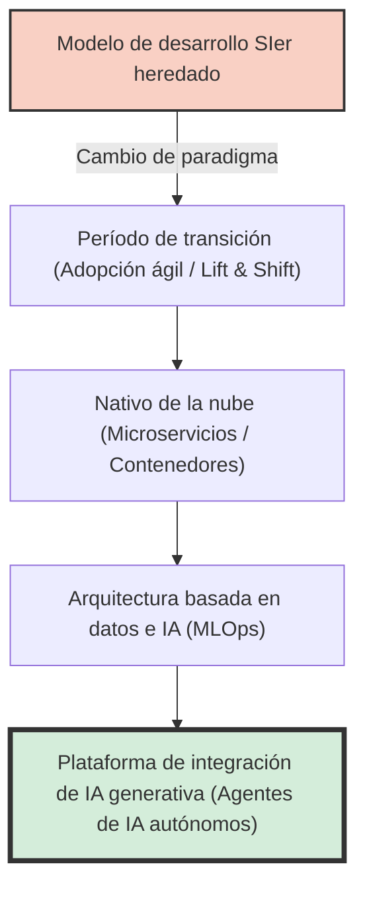
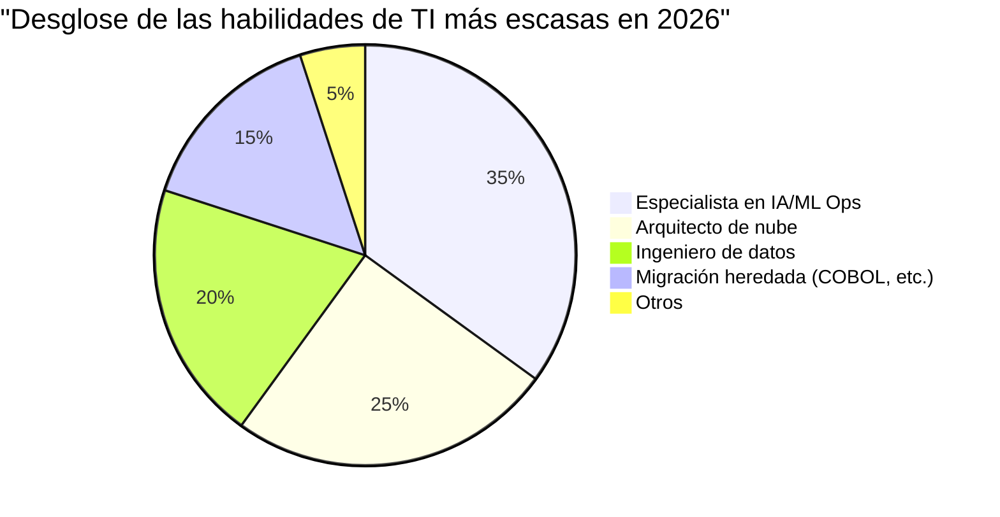
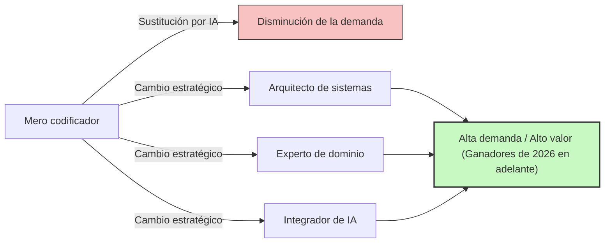

## Introducción: La trampa del término "Escasez de talento de TI"

En la industria de TI de Japón, han pasado mucho tiempo desde que términos sensacionalistas como el "Acantilado de 2025" o "Escasez de hasta 790,000 talentos de TI para 2030" inundaron los medios de comunicación, pero lo que enfrentamos actualmente es una fase de crisis completamente nueva que debería llamarse el **"Problema de 2026"**.

En los informes del Ministerio de Economía, Comercio e Industria y varios informes de los medios, se generaliza que "hay una abrumadora escasez de ingenieros de TI". Sin embargo, al escuchar las voces reales en el campo, la situación es un poco más compleja. En realidad, no es que "falten de todo". Lo que está ocurriendo es una severa **"polarización" donde hay una escasez catastrófica de "ingenieros senior con habilidades avanzadas que las empresas desean desesperadamente", mientras que por otro lado, hay un exceso de oferta de "ingenieros junior sin experiencia o con poca experiencia", quienes están encontrando cada vez más difícil encontrar trabajo**.

En este artículo, profundizaremos y explicaremos qué está sucediendo realmente en la industria de TI actual, el cambio de paradigma del modelo tradicional de SIer hacia el desarrollo nativo de la nube y basado en IA, el acantilado de los sistemas heredados y el impacto disruptivo traído por la IA generativa, representada por GitHub Copilot.

---

## 1. Cambio Estructural: Transición del SIer Tradicional al Desarrollo Nativo de la Nube y Basado en IA

Lo que ha sustentado la industria de TI japonesa durante muchos años fue el modelo SIer (Integrador de Sistemas) con su estructura de subcontratación múltiple. Era el llamado modelo de negocio "intensivo en mano de obra", que consistía en escribir código según las especificaciones y rellenar documentos de prueba. Aquí, el valor de un ingeniero se medía en unidades de "hombre-mes", asumiendo que un proyecto funcionaría mientras hubiera suficientes personas.

Sin embargo, a partir de 2026, este modelo ha llegado a su límite. Debido a que la esencia de la DX (Transformación Digital) pasó de "mera informatización" a "transformación del modelo de negocio", el desarrollo en cascada (waterfall), con su baja agilidad, ya no puede seguir el ritmo de los cambios del mercado.

Los procesos de desarrollo modernos parten de la premisa de ser **nativos de la nube** y **basados en IA**. La contenerización (Docker/Kubernetes), la arquitectura de microservicios y la automatización de los procesos de CI/CD ya no son "tecnologías especiales", sino "infraestructura estándar".



Lo que las empresas buscan no son "codificadores" que solo escriban código a partir de especificaciones dadas. Buscan talento que pueda diseñar infraestructura en la nube, implementar el backend y hasta operativizar modelos de aprendizaje automático (MLOps), traduciendo los requisitos del negocio en arquitectura técnica. En un campo que exige un conocimiento y experiencia tan amplios, el talento que "simplemente conoce la sintaxis de un lenguaje de programación" tiene cada vez más dificultades para generar valor.

---

## 2. El "Acantilado" de los Sistemas Heredados y la Escasez de Ingeniería de Datos

Como se advirtió en el "Acantilado de 2025", muchas empresas japonesas todavía dependen de mainframes y sistemas heredados locales (construidos con COBOL, etc.). Estos sistemas se han convertido en cajas negras debido a años de modificaciones, y con la jubilación de los ingenieros senior responsables de su mantenimiento, se ha vuelto extremadamente difícil mantenerlos.

Por otro lado, hay una fuerte demanda desde el lado empresarial de "utilizar datos para construir modelos de IA y ofrecer experiencias de cliente personalizadas". Aquí existe una brecha fatal. **Hay una escasez abrumadora de "ingenieros de datos" que puedan limpiar, integrar y canalizar los datos aislados en instalaciones locales en un formato utilizable por las últimas canalizaciones de IA/ML.**

### Modelo matemático de los costos de mantenimiento heredado frente a la modernización

Consideremos aquí un modelo matemático simple que compara el costo de mantener un sistema heredado ($C_{legacy}$) y la inversión requerida para la modernización más sus costos operativos posteriores ($C_{modern}$).

Los costos de mantenimiento de los sistemas heredados aumentan año tras año. Esto se debe a la respuesta a fallos causados por la deuda técnica y al aumento de los costos laborales debido a la escasez de ingenieros heredados.
Si tomamos el número de años como $t$, se puede expresar de la siguiente manera:

$$
C_{legacy}(t) = M_0 \times (1 + r)^t + L_0 \times (1 + i)^t
$$

Donde:
- $M_0$: Costo de mantenimiento inicial
- $r$: Tasa de aumento del costo de mantenimiento por deuda técnica
- $L_0$: Costo inicial del talento heredado
- $i$: Tasa de inflación del costo laboral por escasez de talento heredado

Por otro lado, al modernizar, hay una inversión inicial grande $I$, pero el costo operativo $O_m$ se mantiene bajo y más estable gracias a la adopción de la nube y la automatización.

$$
C_{modern}(t) = I + O_m \times t
$$

En la mayoría de los casos, es evidente que $C_{legacy}(t) > C_{modern}(t)$ dentro de unos pocos años (punto de equilibrio), pero debido a que no hay suficientes "arquitectos" e "ingenieros de datos" en el mercado capaces de ejecutar la inversión inicial $I$, la realidad en 2026 es que muchas empresas se están hundiendo en el pantano del $C_{legacy}$.



---

## 3. El Impacto Disruptivo de la IA Generativa: GitHub Copilot y la Desaparición del Ingeniero Junior

Al hablar de la escasez de talento de TI, es imposible ignorar **el auge de la IA Generativa (Generative AI)**. Herramientas como GitHub Copilot, Cursor y ChatGPT (GPT-4o y la serie O1) han cambiado fundamentalmente la productividad del desarrollo de software.

Tradicionalmente, los ingenieros senior dedicaban tiempo a diseños complejos y revisiones, mientras que la estructura común del equipo consistía en delegar a los ingenieros junior tareas como operaciones CRUD simples (Crear, Leer, Actualizar, Eliminar), código repetitivo (boilerplate) y la escritura de código de prueba.

Sin embargo, hoy en día, la IA generativa puede generar el 90% de estas "tareas manejadas por juniors" en cuestión de segundos o minutos, y con un alto grado de precisión. ¿Qué sucedió como resultado? **Las empresas han perdido razones para contratar ingenieros junior.**

### Cambio en el multiplicador de productividad debido a la IA generativa

Expresemos la productividad total del equipo de desarrollo antes y después de la introducción de la IA mediante fórmulas matemáticas.

Sea la productividad base $P$.
Sea la tasa de mejora de productividad de los ingenieros senior debido a la introducción de la IA generativa $\alpha_{senior}$, y la de los ingenieros junior $\alpha_{junior}$.

$$
\text{Total Output}_{pre} = N_{senior} \times P_{senior} + N_{junior} \times P_{junior}
$$

$$
\text{Total Output}_{post} = N_{senior} \times P_{senior} \times (1 + \alpha_{senior}) + N_{junior} \times P_{junior} \times (1 + \alpha_{junior})
$$

A primera vista, parece que la productividad de los juniors también mejora. Sin embargo, en la práctica, es indispensable la **capacidad de validar la idoneidad del código generado por la IA, integrarlo en todo el sistema y determinar si existen problemas de seguridad**. Esta capacidad (comprensión del contexto y habilidades de diseño de arquitectura) es deficiente en los juniors.

Como resultado, los ingenieros senior utilizan la IA como un "asistente ultra competente (un junior que trabaja infinitamente)", multiplicando su productividad por 2 a 3 veces ($\alpha_{senior} \approx 2.0$). En contraste, cuando los juniors sin una base sólida usan la IA, se produce en masa código espagueti que a primera vista funciona, pero acarrea una cantidad masiva de deuda técnica, lo que incluso lleva a un aumento en los costos de revisión (llegando a casos donde $\alpha_{junior} < 0$ en la práctica).

Como resultado de esto, las empresas se han dado cuenta de que es abrumadoramente de menor riesgo y mayor rendimiento "contratar a un senior (usuario de IA) con un salario de 1,200,000 yenes" que "contratar a tres juniors con salarios de 300,000 yenes". Esta es la verdadera naturaleza de la "escasez de talento". Faltan por completo "seniors que puedan dominar la IA".

```mermaid
xychart-beta
    title "Polarización de la demanda laboral entre las capas junior y senior (2021-2026)"
    x-axis ["2021", "2022", "2023", "2024", "2025", "2026"]
    y-axis "Tasa de empleo" 0.0 --> 10.0
    line ["Senior (Arquitecto/MLOps, etc.)"] [3.0, 3.5, 4.2, 5.8, 7.5, 9.2]
    line ["Junior (Sin experiencia/1-2 años)"] [2.5, 2.2, 1.8, 1.2, 0.8, 0.3]
```

---

## 4. Más allá de la ingeniería de prompts: ¿Cuáles son las habilidades realmente necesarias?

Entonces, ¿cómo es el talento de TI que se necesitará en la era venidera? Es prematuro pensar que "basta con dominar la ingeniería de prompts". La técnica de dar instrucciones a través de lenguaje natural se vuelve más sencilla y se está mercantilizando con la evolución de los modelos de IA.

Como realidad en el campo, lo que realmente se necesita hoy en día es talento que pueda cubrir las siguientes tres áreas.

### A. Diseño Basado en el Dominio (DDD) y Modelado de Negocios
La IA puede escribir código, pero no puede "desentrañar las complejas especificaciones comerciales, descubrir el contexto delimitado (Bounded Context) del software y diseñar un modelo de datos adecuado". La habilidad de comprender profundamente el dominio del cliente (área comercial) y traducirlo en términos técnicos, conocida como "Diseño Basado en el Dominio (DDD)", es una de las habilidades más valiosas en la era de la IA.

### B. Arquitectura y Diseño de Requisitos No Funcionales
Los "requisitos no funcionales" como la disponibilidad, escalabilidad, seguridad y rendimiento de los sistemas no son algo que la IA optimice automáticamente. Las decisiones arquitectónicas sobre "qué servicios en la nube combinar", "qué protocolos de comunicación usar entre microservicios" y "dónde establecer los límites de transacción de la base de datos" todavía dependen en gran medida de la experiencia e intuición humanas avanzadas.

### C. MLOps y Construcción de Pipelines de Datos
El concepto de "MLOps" para continuar operando IA generativa y modelos de aprendizaje automático en entornos de producción es cada vez más importante. Los talentos con estas habilidades que se encuentran en la intersección de la ingeniería de software y la ciencia de datos, tales como la supervisión de la deriva del modelo (pérdida de precisión), la canalización de entrenamiento continuo y la optimización de recursos de GPU, tienen una gran demanda.

---

## 5. Estrategia de supervivencia para ingenieros: Para sobrevivir más allá de 2026

Bajo estas circunstancias, ¿cómo deberíamos los ingenieros construir nuestras carreras? Especialmente para ingenieros con poca experiencia, la situación puede parecer desesperada. Sin embargo, dependiendo de la estrategia, hay amplias posibilidades de encontrar un camino.

### Estrategia 1: Apuntar a ser un "Orquestador de IA"
En lugar de convertirse en un experto en un solo lenguaje o framework, refine su capacidad como "orquestador" que combina múltiples herramientas y agentes de IA para construir un sistema completo. Es necesario reducir el tiempo de escritura de código manual, ensamblar componentes escritos por IA y tener una "perspectiva de nivel superior" para supervisar la arquitectura general.

### Estrategia 2: Adquisición de conocimiento del dominio
Además de las habilidades técnicas, adquiera un profundo conocimiento de un dominio de industria específico (finanzas, medicina, logística, etc.). Un ingeniero que conoce bien los puntos de dolor del flujo de trabajo tiene una fuerza persuasiva inigualable para la IA al proponer soluciones técnicas. Delega el "CÓMO" (cómo construirlo) a la IA y concéntrate en el "QUÉ" (qué construir) y el "POR QUÉ" (por qué construirlo).

### Estrategia 3: Habilidades blandas y gestión de partes interesadas
En el desarrollo de sistemas a gran escala, al fin y al cabo, la "construcción de relaciones humanas" y la "gestión de expectativas" deciden el éxito o el fracaso del proyecto. Las "habilidades humanas" como la definición de requerimientos con el cliente, la facilitación dentro del equipo y la construcción de consensos para decisiones complejas son las áreas más difíciles de reemplazar por la IA. El talento basado en la técnica, pero con excelentes habilidades de comunicación, será aún más valorado en el futuro.



---

## Conclusión: No temas, súbete a la ola

Espero que haya comprendido que la realidad del "Problema de 2026" y la consecuente escasez de talento de TI no es una simple "escasez de personas", sino un "desajuste debido a un cambio drástico en las habilidades requeridas".

La presión de los sistemas heredados, el agotamiento de los ingenieros de datos y el cambio de paradigma provocado por la IA generativa. Estas olas son una amenaza para los ingenieros convencionales, pero para aquellos que pueden aceptar el cambio y actualizar sus conjuntos de habilidades, también representan una oportunidad gigante sin precedentes.

La IA no está quitándonos nuestros trabajos; es meramente una herramienta que nos permite concentrarnos en tareas más avanzadas y creativas. Liberarse de la "labor" de codificar y enfocarse en el "diseño" del sistema y la "creación de valor" del negocio. Este es el único camino para sobrevivir y prosperar en la industria de TI a partir de 2026.

Ahora es el momento de revisar tu trayectoria profesional y dirigir el rumbo hacia el próximo paradigma. 
¿Estás listo para "modernizarte" a ti mismo?
