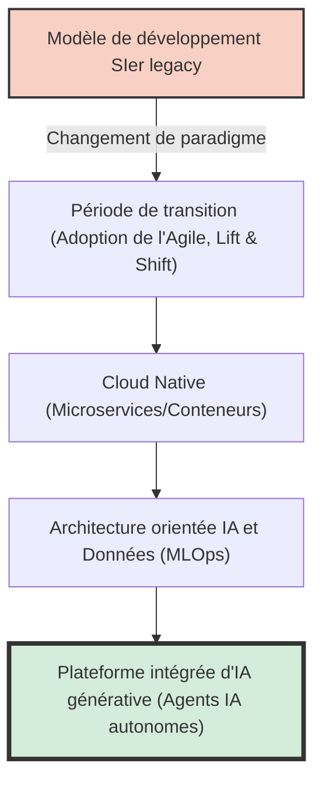
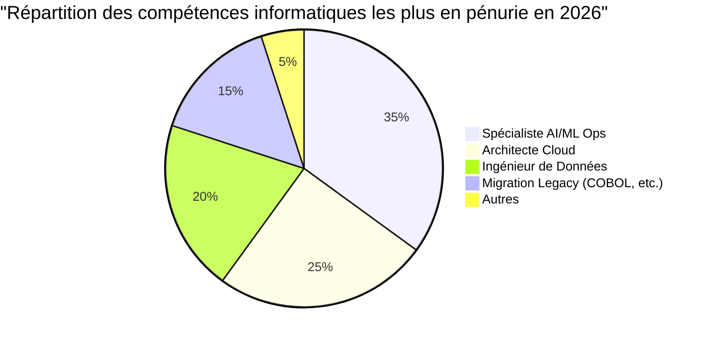
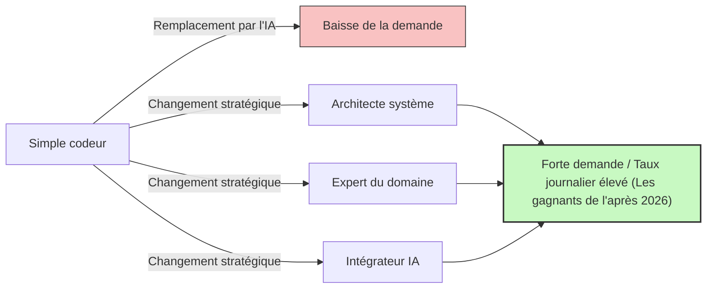

## Introduction : Le piège de l'expression 'pénurie de talents informatiques'

Dans l'industrie informatique japonaise, des expressions sensationnalistes telles que la 'falaise de 2025' ou la 'pénurie de jusqu'à 790 000 talents informatiques d'ici 2030' circulent dans les médias depuis un certain temps, mais ce à quoi nous sommes actuellement confrontés est une toute nouvelle phase de crise qui devrait être appelée le **'problème de 2026'**.

Dans les rapports du Ministère de l'Économie, du Commerce et de l'Industrie et dans divers médias, on regroupe souvent tout en disant que 'les ingénieurs informatiques manquent cruellement'. Cependant, en écoutant les véritables voix du terrain, la situation est un peu plus complexe. En réalité, 'tout le monde' ne manque pas. Il y a une **forte 'polarisation' : d'un côté, une pénurie catastrophique d'ingénieurs seniors possédant des compétences avancées que les entreprises désespèrent d'obtenir, et de l'autre, une offre excédentaire d'ingénieurs juniors inexpérimentés ou peu expérimentés, pour qui il devient de plus en plus difficile de trouver du travail**.

Cet article analyse et explique en profondeur ce qui se passe réellement dans l'industrie informatique aujourd'hui : le changement de paradigme de l'ancien modèle SIer vers le développement Cloud Native et axé sur l'IA, la falaise des systèmes legacy, et l'impact destructeur apporté par l'IA générative représentée par GitHub Copilot.

---

## 1. Changement structurel : Transition des SIers traditionnels vers le développement Cloud Native et axé sur l'IA

Pendant de nombreuses années, l'industrie informatique japonaise a été soutenue par le modèle SIer (intégrateur de systèmes) avec sa structure de sous-traitance à multiples niveaux. C'est ce qu'on appelle un modèle commercial à forte intensité de main-d'œuvre, où l'on écrit du code selon des spécifications et où l'on remplit des documents de tests. Ici, la valeur d'un ingénieur était mesurée en 'homme-mois', avec pour prémisse que le projet avancerait si l'on avait suffisamment de personnel.

Cependant, en cette année 2026, ce modèle a atteint ses limites. L'essence de la transformation numérique (DX) étant passée d'une 'simple informatisation' à une 'transformation du modèle commercial', le développement en cascade (waterfall) avec sa faible agilité n'a pas pu suivre les changements du marché.

Le processus de développement moderne suppose d'être **Cloud Native** et **axé sur l'IA**. La conteneurisation (Docker/Kubernetes), l'architecture de microservices et l'automatisation des pipelines CI/CD ne sont plus des 'technologies spéciales' mais une 'infrastructure standard'.



Ce que les entreprises recherchent, ce n'est pas un simple 'codeur' qui se contente de coder selon des spécifications données. Elles recherchent des talents capables de traduire les exigences commerciales en architectures techniques, allant de la conception de l'infrastructure cloud à l'implémentation back-end, jusqu'à la mise en production de modèles de machine learning (MLOps). Dans ce domaine qui exige des connaissances et une expérience aussi vastes, les personnes qui ne font que 'connaître la syntaxe d'un langage de programmation' ont du mal à créer de la valeur.

---

## 2. La 'falaise' des systèmes legacy et l'épuisement de l'ingénierie des données

Comme averti dans la 'falaise de 2025', de nombreuses entreprises japonaises conservent encore des mainframes ou des systèmes legacy sur site (construits en COBOL, etc.). Ces systèmes sont devenus des boîtes noires au fil des années de modifications, et avec le départ à la retraite des ingénieurs seniors responsables de leur maintenance, leur maintien devient extrêmement difficile.

D'un autre côté, il y a une forte demande du côté commercial pour 'utiliser les données afin de construire des modèles d'IA et offrir des expériences client personnalisées'. Il existe ici un décalage fatal. **Il y a une pénurie écrasante d''ingénieurs de données' capables de nettoyer, d'intégrer et de pipeliner les données silotées sur site dans un format utilisable par les pipelines d'IA/ML modernes.**

### Modèle mathématique du coût de maintenance legacy et de la modernisation

Considérons ici un modèle mathématique simple comparant le coût de maintenance d'un système legacy ($C_{legacy}$) avec l'investissement requis pour la modernisation (renouvellement) et les coûts d'exploitation ultérieurs ($C_{modern}$).

Le coût de maintien d'un système legacy augmente d'année en année. Cela est dû à la gestion des pannes causées par la dette technique et à la hausse des coûts de main-d'œuvre due à la rareté des ingénieurs familiers avec les technologies legacy.
Si nous notons l'année $t$, cela peut s'exprimer comme suit :

$$
C_{legacy}(t) = M_0 \times (1 + r)^t + L_0 \times (1 + i)^t
$$

Où :
- $M_0$ : Frais de maintenance initiaux
- $r$ : Taux d'augmentation des frais de maintenance dus à la dette technique
- $L_0$ : Coût initial du personnel legacy
- $i$ : Taux d'inflation des coûts de main-d'œuvre dû à la rareté du personnel legacy

D'un autre côté, en cas de modernisation, l'investissement initial $I$ est important, mais les coûts d'exploitation $O_m$ sont maintenus à un niveau bas grâce au cloud et à l'automatisation, et ont tendance à rester constants.

$$
C_{modern}(t) = I + O_m \times t
$$

Dans de nombreux cas, il est évident que $C_{legacy}(t) > C_{modern}(t)$ d'ici quelques années (seuil de rentabilité), mais comme le marché manque d''architectes' et d''ingénieurs de données' capables de réaliser l'investissement initial $I$, la réalité en 2026 est que de nombreuses entreprises s'enfoncent dans le bourbier de $C_{legacy}$.



---

## 3. L'impact destructeur de l'IA générative : GitHub Copilot et la disparition des ingénieurs juniors

Lorsque l'on parle de pénurie de talents informatiques, l'élément absolument incontournable est **l'émergence de l'IA générative**. Des outils comme GitHub Copilot, Cursor et ChatGPT (Séries GPT-4o et O1) ont fondamentalement modifié la productivité du développement logiciel.

Jusqu'à présent, la structure typique d'une équipe consistait à ce que les ingénieurs seniors consacrent du temps aux conceptions complexes et aux revues de code, tout en confiant (déléguant) les opérations simples de CRUD (Create, Read, Update, Delete), le code passe-partout et l'écriture de codes de test aux ingénieurs juniors.

Cependant, aujourd'hui, 90 % de ces 'tâches qui étaient assignées aux juniors' peuvent être générées par l'IA en quelques secondes ou minutes, avec une grande précision. Que s'est-il passé en conséquence ? **Les entreprises ont perdu toute raison d'embaucher des ingénieurs juniors.**

### Évolution du multiplicateur de productivité grâce à l'IA générative

Exprimons la productivité totale d'une équipe de développement avant et après l'introduction de l'IA à l'aide d'une formule mathématique.

Soit $P$ la productivité de base.
Soit $\alpha_{senior}$ le taux d'amélioration de la productivité des ingénieurs seniors grâce à l'introduction de l'IA générative, et $\alpha_{junior}$ celui des ingénieurs juniors.

$$
\text{Total Output}_{pre} = N_{senior} \times P_{senior} + N_{junior} \times P_{junior}
$$

$$
\text{Total Output}_{post} = N_{senior} \times P_{senior} \times (1 + \alpha_{senior}) + N_{junior} \times P_{junior} \times (1 + \alpha_{junior})
$$

À première vue, il semble que la productivité des juniors s'améliore également. Cependant, sur le terrain, **la capacité à 'vérifier la validité du code généré par l'IA, l'intégrer dans le système global et juger s'il n'y a pas de problèmes de sécurité'** est indispensable. Cette capacité (compréhension du contexte et compétences en conception d'architecture) fait défaut aux juniors.

En conséquence, les ingénieurs seniors maîtrisent l'IA comme un 'assistant super excellent (un junior qui travaille à l'infini)', ce qui fait bondir leur productivité de $2 \sim 3$ fois ($\alpha_{senior} \approx 2.0$). À l'inverse, si des juniors sans compétences fondamentales utilisent l'IA, ils produisent en masse du code spaghetti rempli de dettes techniques qui semble fonctionner à première vue, ce qui finit par augmenter les coûts de révision (il y a même des cas où $\alpha_{junior} < 0$ en réalité).

En conséquence, les entreprises ont réalisé qu'il est infiniment moins risqué et plus performant d''embaucher un senior (utilisateur d'IA) pour un salaire mensuel de 1,2 million de yens' plutôt que d''embaucher 3 juniors pour un salaire mensuel de 300 000 yens'. C'est la véritable nature de la 'pénurie de talents'. Il manque cruellement de 'seniors capables de maîtriser l'IA'.

```mermaid
xychart-beta
    title "Polarisation de la demande de recrutement entre les juniors et les seniors (2021-2026)"
    x-axis ["2021", "2022", "2023", "2024", "2025", "2026"]
    y-axis "Taux d'offres d'emploi" 0.0 --> 10.0
    line ["Senior (Architecte/MLOps, etc.)"] [3.0, 3.5, 4.2, 5.8, 7.5, 9.2]
    line ["Junior (Inexpérimenté/1 à 2 ans d'expérience)"] [2.5, 2.2, 1.8, 1.2, 0.8, 0.3]
```

---

## 4. Au-delà de l'ingénierie des prompts : Quelles sont les compétences vraiment nécessaires ?

Alors, quel type de talent informatique est recherché pour cette nouvelle ère ? Il serait prématuré de penser qu'il 'suffit de maîtriser l'ingénierie des prompts'. La technique consistant à donner des instructions en langage naturel devient plus simple et se banalise à mesure que les modèles d'IA évoluent.

La réalité du terrain est que les talents capables de couvrir les trois domaines suivants sont ceux qui sont véritablement recherchés aujourd'hui.

### A. Conception Pilotée par le Domaine (DDD) et Modélisation Commerciale
L'IA peut écrire du code, mais elle ne peut pas 'démêler les spécifications complexes d'une entreprise, trouver les contextes délimités d'un logiciel et concevoir un modèle de données approprié'. La compétence en 'Conception Pilotée par le Domaine (DDD)', qui consiste à comprendre profondément le domaine du client (domaine métier) et à le traduire en termes techniques, est l'une des compétences les plus précieuses à l'ère de l'IA.

### B. Architecture et conception des exigences non fonctionnelles
Les 'exigences non fonctionnelles' telles que la disponibilité, l'évolutivité, la sécurité et les performances du système ne sont pas automatiquement optimisées par l'IA. Les décisions architecturales telles que 'Quels services cloud doivent être combinés ?', 'Quel protocole de communication utiliser entre les microservices ?' ou 'Où tracer la limite de transaction de la base de données ?' dépendent encore largement de l'expérience et de l'intuition humaines de haut niveau.

### C. MLOps et construction de pipelines de données
Le concept de 'MLOps', qui vise à maintenir en production les modèles d'IA générative et de machine learning, devient de plus en plus important. Les talents possédant ces compétences situées à l'intersection du génie logiciel et de la science des données, comme la surveillance de la dérive des modèles (model drift), la création de pipelines d'entraînement continu et l'optimisation des ressources GPU, sont très convoités.

---

## 5. Stratégie de survie pour les ingénieurs : Comment survivre après 2026

Dans une telle situation, comment nous, ingénieurs, devrions-nous construire notre carrière ? La situation peut sembler désespérée, en particulier pour les ingénieurs peu expérimentés. Cependant, selon votre stratégie, il existe de nombreuses voies de réussite.

### Stratégie 1 : Viser à devenir un 'Orchestrateur IA'
Plutôt que de devenir un expert d'un seul langage ou framework, il s'agit d'affiner sa capacité en tant qu''orchestrateur' qui construit le système global en combinant plusieurs outils ou agents d'IA. Il est nécessaire de réduire le temps passé à écrire soi-même du code, et d'adopter une 'perspective de niveau supérieur' pour connecter les composants générés par l'IA et superviser l'architecture globale.

### Stratégie 2 : Acquisition de connaissances du domaine
En plus des compétences techniques, acquérez une connaissance approfondie d'un secteur spécifique (finance, santé, logistique, etc.). Un ingénieur qui connaît parfaitement les points critiques des flux de travail métier possède une force de persuasion convaincante que l'IA ne peut imiter lorsqu'il propose des solutions techniques. Il s'agit de confier le 'COMMENT (Comment le construire)' à l'IA, et de se concentrer sur le 'QUOI (Que construire)' et le 'POURQUOI (Pourquoi le construire)'.

### Stratégie 3 : Compétences relationnelles (Soft skills) et gestion des parties prenantes
Dans le développement de systèmes à grande échelle, c'est finalement la 'construction de relations humaines' et la 'gestion des attentes' qui déterminent le succès ou l'échec d'un projet. Les 'compétences humaines' telles que la définition des besoins avec les clients, la facilitation au sein de l'équipe et la recherche d'un consensus pour les décisions complexes, sont les domaines où il est le plus difficile de se faire remplacer par l'IA. Les talents dotés d'excellentes compétences en communication, tout en s'appuyant sur une base technique, seront encore plus précieux à l'avenir.



---

## Conclusion : Ne pas avoir peur, mais surfer sur la vague

Vous avez sans doute compris que la réalité du 'problème de 2026' et de la pénurie de talents informatiques qui l'accompagne n'est pas un simple 'manque d'effectifs', mais une 'inadéquation due à l'évolution dramatique des compétences requises'.

Le fardeau des systèmes legacy, l'épuisement des ingénieurs de données et le changement de paradigme provoqué par l'IA générative. Ces vagues constituent une menace pour les ingénieurs traditionnels, mais pour ceux qui peuvent accepter le changement et mettre à jour leurs propres compétences, c'est aussi une opportunité colossale et sans précédent.

L'IA ne va pas nous voler notre travail, ce n'est qu'un outil qui nous permet de nous concentrer sur un travail plus avancé et créatif. Se libérer de la 'tâche' qu'est le codage pour se concentrer sur la 'conception' de systèmes et la 'création de valeur' commerciale. C'est la seule voie pour survivre et prospérer dans l'industrie informatique au-delà de 2026.

C'est maintenant le moment de revoir votre plan de carrière et de prendre le virage vers le prochain paradigme.
Êtes-vous prêt pour votre propre 'modernisation' ?
