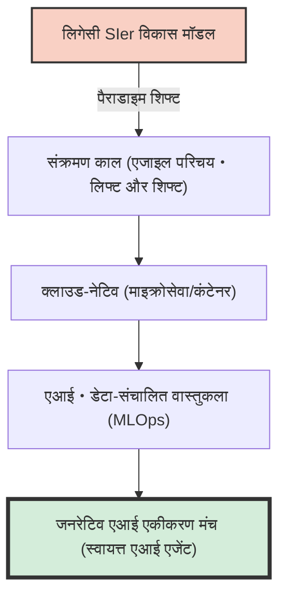
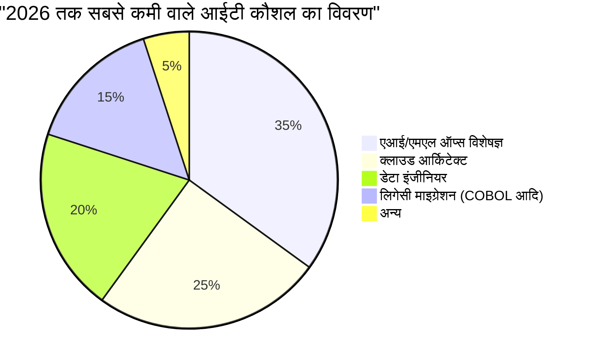
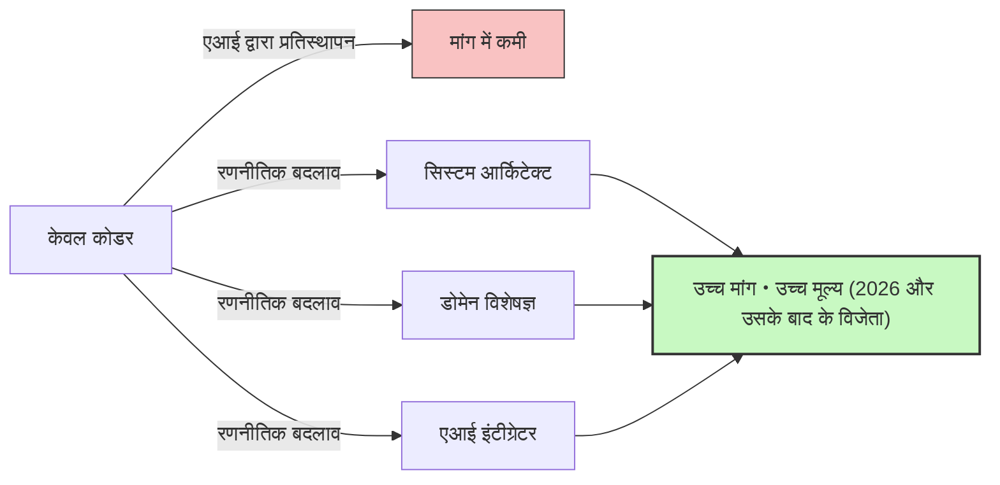

## परिचय: "आईटी प्रतिभा की कमी" शब्द का जाल

जापान के आईटी उद्योग में, "2025 की चट्टान" और "2030 तक आईटी प्रतिभा में अधिकतम 7,90,000 की कमी" जैसे सनसनीखेज शब्द काफी समय से मीडिया में छाए हुए हैं, लेकिन वर्तमान में हम जिस संकट का सामना कर रहे हैं, वह पूरी तरह से एक नया चरण है जिसे **"2026 की समस्या"** कहा जाना चाहिए।

अर्थव्यवस्था, व्यापार और उद्योग मंत्रालय (METI) की रिपोर्टों और विभिन्न मीडिया आउटलेट्स में, यह अक्सर कहा जाता है कि "आईटी इंजीनियरों की भारी कमी है।" हालांकि, जब आप फील्ड की वास्तविक आवाज़ें सुनते हैं, तो स्थिति थोड़ी अधिक जटिल होती है। वास्तव में, "हर किसी की कमी" नहीं है। **"अत्यधिक कुशल सीनियर इंजीनियर जिनकी कंपनियों को सख्त जरूरत है" की विनाशकारी रूप से कमी है, जबकि दूसरी ओर "अनुभवहीन या कम अनुभव वाले जूनियर इंजीनियर" की अधिकता हो गई है, और उनके लिए काम खोजना मुश्किल होता जा रहा है।** इस प्रकार का एक मजबूत "ध्रुवीकरण" हो रहा है।

इस लेख में, हम वर्तमान में आईटी उद्योग में वास्तव में क्या हो रहा है, पारंपरिक SIer मॉडल से क्लाउड-नेटिव और एआई-संचालित विकास में पैराडाइम शिफ्ट, लिगेसी सिस्टम की चट्टान, और GitHub Copilot जैसे जनरेटिव एआई के विनाशकारी प्रभाव के बारे में गहराई से चर्चा करेंगे।

---

## 1. संरचनात्मक परिवर्तन: पारंपरिक SIer से क्लाउड-नेटिव और एआई-संचालित विकास में बदलाव

जापान के आईटी उद्योग को लंबे समय से SIer (सिस्टम इंटीग्रेटर) मॉडल द्वारा समर्थित किया गया है जिसमें एक बहु-स्तरीय उप-ठेका संरचना शामिल है। यह एक "श्रम-गहन" व्यवसाय मॉडल है, जहां विशिष्टताओं के अनुसार कोड लिखा जाता है और परीक्षण विशिष्टताओं को पूरा किया जाता है। यहाँ इंजीनियरों के मूल्य को "मैन-मंथ" की इकाई में मापा जाता था, और यह मान लिया जाता था कि अगर पर्याप्त लोग हों, तो प्रोजेक्ट चल जाएगा।

हालांकि, 2026 में, यह मॉडल अपनी सीमा तक पहुंच गया है। चूंकि DX (डिजिटल ट्रांसफ़ॉर्मेशन) का सार "केवल आईटीकरण" से "व्यापार मॉडल में परिवर्तन" में बदल गया है, इसलिए कम चपलता वाले वॉटरफॉल विकास मॉडल अब बाज़ार के बदलावों के साथ तालमेल नहीं बिठा सकते।

आधुनिक विकास प्रक्रियाएं **क्लाउड-नेटिव** और **एआई-संचालित** होने पर आधारित हैं। कंटेनरीकरण (Docker/Kubernetes), माइक्रोसेवा वास्तुकला, और CI/CD पाइपलाइनों का स्वचालन अब "विशेष तकनीक" नहीं बल्कि "मानक बुनियादी ढांचा" हैं।



कंपनियां अब ऐसे "कोडर" नहीं चाहतीं जो केवल दी गई विशिष्टताओं को कोड करते हों। उन्हें ऐसे पेशेवरों की आवश्यकता है जो क्लाउड इन्फ्रास्ट्रक्चर को डिज़ाइन करने से लेकर बैकएंड लागू करने, और यहां तक ​​कि मशीन लर्निंग मॉडल (MLOps) को उत्पादन में लाने तक, व्यावसायिक आवश्यकताओं को तकनीकी वास्तुकला में बदल सकें। ऐसे क्षेत्रों में जहाँ इतने व्यापक ज्ञान और अनुभव की आवश्यकता होती है, वहां केवल "प्रोग्रामिंग भाषा के सिंटैक्स को जानने" वाले व्यक्ति के लिए मूल्य उत्पन्न करना मुश्किल होता जा रहा है।

---

## 2. लिगेसी सिस्टम की "चट्टान" और डेटा इंजीनियरिंग की कमी

जैसा कि "2025 की चट्टान" में चेतावनी दी गई थी, कई जापानी कंपनियों के पास अभी भी मेनफ्रेम और ऑन-प्रिमाइसेस लिगेसी सिस्टम (COBOL आदि में बने) हैं। ये सिस्टम वर्षों के संशोधनों के कारण ब्लैक बॉक्स बन गए हैं, और रखरखाव के प्रभारी वरिष्ठ कर्मचारियों की सेवानिवृत्ति के साथ, उन्हें बनाए रखना बेहद मुश्किल हो गया है।

दूसरी ओर, व्यवसाय पक्ष से एक मजबूत मांग है: "हम डेटा का उपयोग करके एआई मॉडल बनाना चाहते हैं और व्यक्तिगत ग्राहक अनुभव प्रदान करना चाहते हैं।" यहीं एक घातक अंतर मौजूद है। **ऐसे "डेटा इंजीनियरों" की भारी कमी है जो ऑन-प्रिमाइसेस साइलो किए गए डेटा को नवीनतम एआई/एमएल पाइपलाइनों में उपयोग के योग्य बनाने के लिए साफ़ कर सकें, एकीकृत कर सकें और पाइपलाइन बना सकें।**

### लिगेसी रखरखाव लागत और आधुनिकीकरण का गणितीय मॉडल

आइए एक सरल गणितीय मॉडल पर विचार करें जो लिगेसी सिस्टम को बनाए रखने की लागत ($C_{legacy}$) और आधुनिकीकरण (नवीनीकरण) और उसके बाद की परिचालन लागत ($C_{modern}$) के लिए आवश्यक निवेश की तुलना करता है।

लिगेसी सिस्टम को बनाए रखने की लागत साल दर साल बढ़ती जाती है। यह तकनीकी ऋण के कारण विफलता प्रतिक्रिया और लिगेसी तकनीशियनों की कमी के कारण श्रम लागत बढ़ने के कारण है।
यदि वर्षों की संख्या $t$ है, तो इसे इस प्रकार व्यक्त किया जा सकता है:

$$
C_{legacy}(t) = M_0 \times (1 + r)^t + L_0 \times (1 + i)^t
$$

यहाँ,
- $M_0$: प्रारंभिक रखरखाव लागत
- $r$: तकनीकी ऋण के कारण रखरखाव लागत की वृद्धि दर
- $L_0$: प्रारंभिक लिगेसी कर्मियों की लागत
- $i$: लिगेसी कर्मियों की कमी के कारण श्रम लागत मुद्रास्फीति दर

दूसरी ओर, आधुनिकीकरण के मामले में, यद्यपि प्रारंभिक निवेश $I$ बड़ा है, परिचालन लागत $O_m$ क्लाउडिफिकेशन और स्वचालन द्वारा कम रखी जाती है, और आसानी से स्थिर रहती है।

$$
C_{modern}(t) = I + O_m \times t
$$

कई मामलों में, यह स्पष्ट है कि कुछ ही वर्षों में (ब्रेक-ईवन पॉइंट) $C_{legacy}(t) > C_{modern}(t)$ हो जाएगा। हालांकि, क्योंकि बाज़ार में प्रारंभिक निवेश $I$ को निष्पादित करने के लिए पर्याप्त "आर्किटेक्ट" और "डेटा इंजीनियर" मौजूद नहीं हैं, कई कंपनियां 2026 में $C_{legacy}$ के दलदल में डूब रही हैं।



---

## 3. जनरेटिव एआई का विनाशकारी प्रभाव: GitHub Copilot और जूनियर इंजीनियरों का गायब होना

आईटी प्रतिभा की कमी के बारे में बात करते समय जिसे बिल्कुल नहीं छोड़ा जा सकता, वह है **जनरेटिव एआई (Generative AI) का उदय**। GitHub Copilot, Cursor, और ChatGPT (GPT-4o और O1 सीरीज) जैसे उपकरणों ने सॉफ्टवेयर विकास की उत्पादकता को मौलिक रूप से बदल दिया है।

अब तक, एक विशिष्ट टीम संरचना यह थी कि सीनियर इंजीनियर अपना समय जटिल डिज़ाइन और समीक्षाओं पर बिताते थे, और सरल CRUD (Create, Read, Update, Delete) प्रोसेसिंग, बॉयलरप्लेट (नियमित कोड), और टेस्ट कोड लिखने का काम जूनियर इंजीनियरों पर छोड़ (या सौंप) देते थे।

लेकिन अब, इन "कार्यों, जिन्हें जूनियर संभालते थे" का 90% हिस्सा जनरेटिव एआई द्वारा कुछ ही सेकंड या मिनटों में उच्च सटीकता के साथ उत्पन्न किया जा सकता है। इसका परिणाम क्या हुआ? **कंपनियों ने जूनियर इंजीनियरों को नियुक्त करने का कारण खो दिया है।**

### जनरेटिव एआई के कारण उत्पादकता गुणक में परिवर्तन

आइए एआई की शुरुआत से पहले और बाद में विकास दल की कुल उत्पादकता को एक सूत्र के रूप में व्यक्त करें।

मान लीजिए कि आधार उत्पादकता $P$ है।
जनरेटिव एआई की शुरुआत के कारण सीनियर इंजीनियरों की उत्पादकता वृद्धि दर $\alpha_{senior}$ है, और जूनियर इंजीनियरों की उत्पादकता वृद्धि दर $\alpha_{junior}$ है।

$$
\text{Total Output}_{pre} = N_{senior} \times P_{senior} + N_{junior} \times P_{junior}
$$

$$
\text{Total Output}_{post} = N_{senior} \times P_{senior} \times (1 + \alpha_{senior}) + N_{junior} \times P_{junior} \times (1 + \alpha_{junior})
$$

पहली नज़र में, ऐसा लगता है कि जूनियर की उत्पादकता में भी सुधार होगा। हालांकि, वास्तविक क्षेत्र में, एआई द्वारा आउटपुट किए गए कोड की **"वैधता को सत्यापित करने, इसे पूरे सिस्टम में एकीकृत करने, और सुरक्षा चिंताओं का न्याय करने"** की क्षमता अनिवार्य है। जूनियर्स में इस क्षमता (संदर्भ को समझने और वास्तुकला को डिज़ाइन करने की क्षमता) की कमी होती है।

नतीजतन, सीनियर इंजीनियर एआई का उपयोग एक "सुपर-स्मार्ट असिस्टेंट (अनंत कार्य करने वाले जूनियर)" के रूप में करते हैं, जिससे उनकी उत्पादकता $2 \sim 3$ गुना ($ \alpha_{senior} \approx 2.0 $) बढ़ जाती है। दूसरी ओर, जब बुनियादी कौशल के बिना जूनियर एआई का उपयोग करते हैं, तो वे बड़े पैमाने पर स्पैगेटी कोड का उत्पादन करते हैं जो प्रथम दृष्टया काम करता हुआ लगता है लेकिन तकनीकी ऋण से भरा होता है, जिससे समीक्षा लागत बढ़ जाती है (ऐसे भी मामले हैं जहां प्रभावी रूप से $\alpha_{junior} < 0$ हो जाता है)।

परिणामस्वरूप, कंपनियों को एहसास हो गया है कि "3,00,000 येन के मासिक वेतन वाले 3 जूनियर नियुक्त करने" की तुलना में, "12,00,000 येन के मासिक वेतन वाले 1 सीनियर (एआई उपयोगकर्ता) को नियुक्त करना" अत्यधिक कम जोखिम भरा और उच्च प्रदर्शन वाला है। यही "प्रतिभा की कमी" का असली रूप है। "सीनियर जो एआई का उपयोग कर सकते हैं" की पूरी तरह से कमी है।

```mermaid
xychart-beta
    title "जूनियर और सीनियर स्तरों के लिए नौकरी की मांग का ध्रुवीकरण (2021-2026)"
    x-axis ["2021", "2022", "2023", "2024", "2025", "2026"]
    y-axis "नौकरी रिक्ति अनुपात" 0.0 --> 10.0
    line ["सीनियर (आर्किटेक्ट/MLOps आदि)"] [3.0, 3.5, 4.2, 5.8, 7.5, 9.2]
    line ["जूनियर (अनुभवहीन/1-2 साल का अनुभव)"] [2.5, 2.2, 1.8, 1.2, 0.8, 0.3]
```

---

## 4. प्रॉम्प्ट इंजीनियरिंग से परे: वास्तव में किन कौशलों की आवश्यकता है?

तो, इस नए युग में किस प्रकार की आईटी प्रतिभा की आवश्यकता है? यह सोचना जल्दबाजी होगी कि "बस प्रॉम्प्ट इंजीनियरिंग में महारत हासिल कर लो।" एआई मॉडल के विकास के साथ प्राकृतिक भाषा में निर्देश देने की तकनीक आसान हो रही है, और इसका कमोडिटीकरण हो रहा है।

क्षेत्र की वास्तविकता के रूप में, आज जिन प्रतिभाओं की वास्तव में आवश्यकता है, वे निम्नलिखित तीन क्षेत्रों को कवर कर सकती हैं:

### A. डोमेन-संचालित डिज़ाइन (DDD) और बिज़नेस मॉडलिंग
एआई कोड लिख सकता है, लेकिन यह "व्यवसाय के जटिल विनिर्देशों को खोल नहीं सकता, सॉफ़्टवेयर के बाउंडेड कॉन्टेक्स्ट का पता नहीं लगा सकता, और उचित डेटा मॉडल डिज़ाइन नहीं कर सकता।" ग्राहक के डोमेन (व्यावसायिक क्षेत्र) को गहराई से समझना और उसे तकनीकी शब्दों में अनुवाद करना, यानी "डोमेन-ड्रिवेन डिज़ाइन (DDD)" का कौशल एआई युग में सबसे मूल्यवान कौशलों में से एक है।

### B. वास्तुकला और गैर-कार्यात्मक आवश्यकताओं का डिज़ाइन
सिस्टम उपलब्धता, स्केलेबिलिटी, सुरक्षा और प्रदर्शन जैसी "गैर-कार्यात्मक आवश्यकताओं" को एआई द्वारा स्वचालित रूप से अनुकूलित नहीं किया जाता है। "किन क्लाउड सेवाओं को संयोजित किया जाना चाहिए," "माइक्रोसेवाओं के बीच संचार प्रोटोकॉल क्या होना चाहिए," और "डेटाबेस लेनदेन की सीमाएँ कहाँ खींची जानी चाहिए" जैसे वास्तुशिल्प निर्णय अभी भी उन्नत मानव अनुभव और अंतर्ज्ञान पर निर्भर करते हैं।

### C. MLOps और डेटा पाइपलाइन निर्माण
उत्पादन वातावरण में जनरेटिव एआई और मशीन लर्निंग मॉडल को चालू रखने के लिए "MLOps" की अवधारणा तेजी से महत्वपूर्ण होती जा रही है। मॉडल ड्रिफ्ट (सटीकता में गिरावट) की निगरानी, निरंतर प्रशिक्षण की पाइपलाइन बनाना और GPU संसाधनों का अनुकूलन जैसे कौशल - जो सॉफ्टवेयर इंजीनियरिंग और डेटा विज्ञान के चौराहे पर हैं - वाले व्यक्तियों की अत्यधिक मांग है।

---

## 5. इंजीनियरों के लिए उत्तरजीविता रणनीति: 2026 और उसके बाद कैसे जीवित रहें

ऐसी स्थिति में, हम इंजीनियरों को अपना करियर कैसे बनाना चाहिए? विशेष रूप से कम अनुभव वाले इंजीनियरों के लिए, स्थिति निराशाजनक लग सकती है। हालांकि, सही रणनीति के साथ, सफलता की पर्याप्त गुंजाइश है।

### रणनीति 1: "एआई ऑर्केस्ट्रेटर" बनने का लक्ष्य
एकल भाषा या रूपरेखा में विशेषज्ञ बनने के बजाय, संपूर्ण सिस्टम बनाने के लिए कई एआई टूल और एजेंटों को संयोजित करने वाले "ऑर्केस्ट्रेटर" के रूप में अपनी क्षमता को निखारें। आपको अपना स्वयं का कोड लिखने में लगने वाले समय को कम करना होगा, एआई द्वारा लिखे गए घटकों को जोड़ना होगा, और पूरे आर्किटेक्चर को देखने का "एक स्तर ऊँचा दृष्टिकोण" रखना होगा।

### रणनीति 2: डोमेन ज्ञान प्राप्त करें
तकनीकी कौशल के साथ-साथ किसी विशिष्ट उद्योग (जैसे वित्त, चिकित्सा, रसद, आदि) का गहन डोमेन ज्ञान रखें। जो इंजीनियर व्यावसायिक वर्कफ़्लो के दर्द बिंदुओं को गहराई से जानते हैं, उनमें तकनीकी समाधान प्रस्तावित करते समय एक मजबूत प्रेरक शक्ति होती है, जिसकी एआई नकल नहीं कर सकता। "HOW (कैसे बनाएं)" का काम एआई पर छोड़ दें, और "WHAT (क्या बनाएं)" और "WHY (क्यों बनाएं)" पर ध्यान केंद्रित करें।

### रणनीति 3: सॉफ्ट स्किल्स और स्टेकहोल्डर मैनेजमेंट
बड़े पैमाने पर सिस्टम विकास में, अंततः "मानवीय संबंधों का निर्माण" और "अपेक्षाओं का प्रबंधन" ही प्रोजेक्ट की सफलता या विफलता तय करते हैं। ग्राहकों के साथ आवश्यकताओं को परिभाषित करना, टीम के भीतर सुविधा प्रदान करना, और जटिल निर्णयों पर आम सहमति बनाना जैसे "मानवीय कौशल" ऐसे क्षेत्र हैं जिन्हें एआई के लिए प्रतिस्थापित करना सबसे मुश्किल है। मजबूत संचार कौशल वाले पेशेवर, भले ही उनका आधार तकनीकी हो, भविष्य में और अधिक मूल्यवान होंगे।



---

## निष्कर्ष: डरें नहीं, बल्कि लहर की सवारी करें

मुझे आशा है कि अब आप समझ गए होंगे कि "2026 की समस्या" और उससे जुड़ी आईटी प्रतिभा की कमी की वास्तविकता केवल "लोगों की संख्या की कमी" नहीं है, बल्कि "आवश्यक कौशलों में नाटकीय बदलाव के कारण होने वाला बेमेल" है।

लिगेसी सिस्टम का दबाव, डेटा इंजीनियरों की कमी, और जनरेटिव एआई के कारण पैराडाइम शिफ्ट। ये लहरें पारंपरिक इंजीनियरों के लिए एक खतरा हैं, लेकिन उन लोगों के लिए एक अभूतपूर्व बड़ा अवसर भी हैं जो बदलाव को स्वीकार कर सकते हैं और अपने कौशल सेट को अपडेट कर सकते हैं।

एआई हमारी नौकरियाँ नहीं छीन रहा है; यह केवल एक उपकरण है जो हमें अधिक उन्नत और रचनात्मक कार्यों पर ध्यान केंद्रित करने की अनुमति देता है। कोडिंग के "कार्य" से मुक्त होकर सिस्टम के "डिज़ाइन" और व्यवसाय के "मूल्य निर्माण" पर ध्यान केंद्रित करना। 2026 और उसके बाद आईटी उद्योग में जीवित रहने और पनपने का यही एकमात्र मार्ग है।

अब अपने करियर पथ पर पुनर्विचार करने और अगले पैराडाइम की ओर रुख करने का समय है।
क्या आप खुद को "आधुनिक" करने के लिए तैयार हैं?
