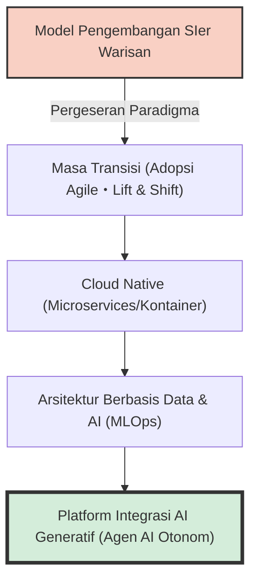
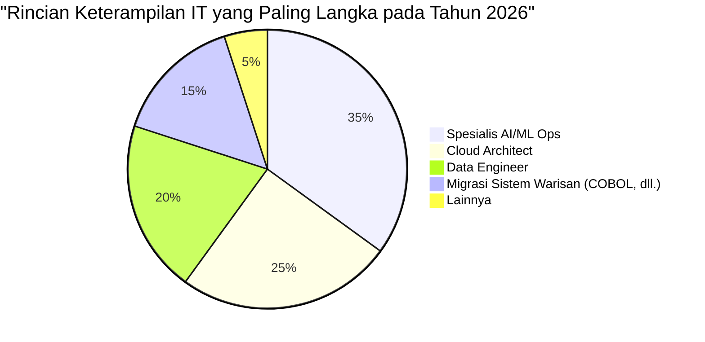
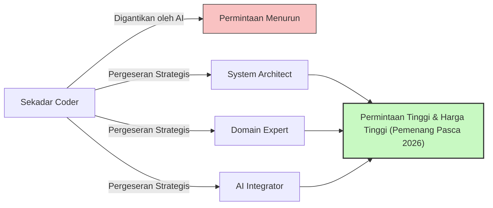

## Pendahuluan: Jebakan Kata "Kekurangan Bakat IT"

Di industri IT Jepang, kata-kata sensasional seperti "Jurang Tahun 2025" atau "Kekurangan Bakat IT hingga 790.000 Orang pada Tahun 2030" telah lama beredar di media. Namun, apa yang sedang kita hadapi saat ini adalah fase krisis baru yang seharusnya disebut sebagai **"Masalah Tahun 2026"**.

Dalam laporan Kementerian Ekonomi, Perdagangan, dan Industri (METI) dan berbagai liputan media, hal ini sering kali disederhanakan dengan "engineer IT sangat kurang". Namun, jika kita mendengarkan suara nyata dari lapangan, situasinya sedikit lebih rumit. Kenyataannya bukan "semua orang kurang". Terjadi "polarisasi" ekstrem di mana **"engineer senior dengan keterampilan tingkat tinggi yang sangat didambakan oleh perusahaan" mengalami kekurangan yang mematikan, sementara "engineer junior yang tidak berpengalaman atau minim pengalaman" mengalami kelebihan pasokan, sehingga semakin sulit bagi mereka untuk mencari pekerjaan**.

Dalam artikel ini, kita akan menggali lebih dalam dan menjelaskan apa yang sebenarnya terjadi di industri IT saat ini, pergeseran paradigma dari model SIer tradisional ke pengembangan *cloud-native* dan *AI-driven*, jurang sistem warisan (*legacy system*), serta dampak destruktif yang dibawa oleh AI generatif seperti GitHub Copilot.

---

## 1. Perubahan Struktural: Transisi dari SIer Tradisional ke Pengembangan *Cloud-Native* dan *AI-Driven*

Yang menopang industri IT Jepang selama bertahun-tahun adalah model SIer (*System Integrator*) yang melibatkan struktur subkontrak berlapis. Ini adalah model bisnis "padat karya" di mana kita menulis kode sesuai dengan spesifikasi dan mengisi dokumen spesifikasi pengujian. Di sini, nilai seorang engineer diukur dalam unit "orang-bulan" (*man-month*), dengan asumsi bahwa proyek akan berjalan selama jumlah orangnya terpenuhi.

Namun, pada tahun 2026 saat ini, model tersebut telah mencapai batasnya. Esensi dari DX (*Digital Transformation*) telah bergeser dari sekadar "penerapan IT" menjadi "transformasi model bisnis", sehingga pengembangan *waterfall* yang memiliki ketangkasan (*agility*) rendah tidak lagi dapat mengikuti perubahan pasar.

Proses pengembangan modern berasumsi bahwa sistem harus bersifat **cloud-native** dan **AI-driven**. Kontainerisasi (Docker/Kubernetes), arsitektur layanan mikro (*microservices*), dan otomatisasi *pipeline* CI/CD bukan lagi "teknologi khusus", melainkan "infrastruktur standar".



Perusahaan tidak lagi mencari sekadar "coder" yang hanya membuat kode dari spesifikasi yang diberikan. Mereka membutuhkan talenta yang mampu merancang arsitektur teknis dari kebutuhan bisnis, mulai dari desain infrastruktur *cloud*, implementasi *backend*, hingga pengoperasian model *machine learning* di lingkungan nyata (MLOps). Dalam bidang yang menuntut pengetahuan dan pengalaman luas ini, seseorang yang "sekadar mengetahui sintaks bahasa pemrograman" sulit untuk menciptakan nilai.

---

## 2. "Jurang" Sistem Warisan dan Kekeringan *Data Engineering*

Seperti yang telah diperingatkan dalam "Jurang Tahun 2025", banyak perusahaan Jepang masih mempertahankan sistem warisan (dibangun dengan COBOL, dll.) di *mainframe* atau *on-premise*. Sistem-sistem ini telah menjadi *black box* akibat modifikasi selama bertahun-tahun, dan seiring dengan pensiunnya para pekerja senior yang bertanggung jawab atas pemeliharaannya, sistem tersebut menjadi sangat sulit untuk dipertahankan.

Di sisi lain, terdapat permintaan kuat dari sisi bisnis yang ingin "memanfaatkan data untuk membangun model AI dan memberikan pengalaman pelanggan yang dipersonalisasi". Di sinilah terdapat kesenjangan yang fatal. **Terdapat kekurangan besar-besaran akan "data engineer" yang mampu membersihkan, mengintegrasikan, dan mem-pipeline-kan data *on-premise* yang terisolasi menjadi format yang dapat digunakan pada jalur (*pipeline*) AI/ML terbaru**.

### Model Matematis Biaya Pemeliharaan Sistem Warisan dan Modernisasi

Mari kita pertimbangkan model matematis sederhana yang membandingkan biaya pemeliharaan sistem warisan ($C_{legacy}$) dengan investasi yang dibutuhkan untuk modernisasi (pembaruan) serta biaya operasional setelahnya ($C_{modern}$).

Biaya pemeliharaan sistem warisan meningkat dari tahun ke tahun. Hal ini disebabkan oleh penanganan gangguan akibat utang teknis (*technical debt*) dan lonjakan biaya tenaga kerja karena kelangkaan teknisi sistem warisan.
Jika $t$ adalah jumlah tahun, maka dapat dirumuskan sebagai berikut:

$$
C_{legacy}(t) = M_0 \times (1 + r)^t + L_0 \times (1 + i)^t
$$

Di mana,
- $M_0$: Biaya pemeliharaan awal
- $r$: Tingkat peningkatan biaya pemeliharaan akibat utang teknis
- $L_0$: Biaya awal untuk tenaga kerja sistem warisan
- $i$: Tingkat inflasi biaya tenaga kerja akibat kelangkaan tenaga kerja sistem warisan

Di sisi lain, saat melakukan modernisasi, terdapat investasi awal $I$ yang besar, tetapi biaya operasional $O_m$ dapat ditekan menjadi rendah berkat peralihan ke *cloud* dan otomatisasi, serta cenderung tetap stabil.

$$
C_{modern}(t) = I + O_m \times t
$$

Dalam banyak kasus, sudah jelas bahwa dalam beberapa tahun (titik impas), $C_{legacy}(t) > C_{modern}(t)$. Namun, karena "arsitek" dan "data engineer" yang mampu mengeksekusi investasi awal $I$ tidak tersedia di pasar, banyak perusahaan saat ini tenggelam dalam lumpur $C_{legacy}$ pada tahun 2026.



---

## 3. Dampak Destruktif AI Generatif: GitHub Copilot dan Hilangnya Engineer Junior

Satu hal yang sama sekali tidak bisa diabaikan ketika membahas kekurangan tenaga IT adalah **kebangkitan AI Generatif (*Generative AI*)**. Alat-alat seperti GitHub Copilot, Cursor, dan ChatGPT (seri GPT-4o atau O1) telah mengubah produktivitas pengembangan perangkat lunak dari akarnya.

Sebelumnya, komposisi tim yang umum adalah engineer senior menghabiskan waktu untuk perancangan yang kompleks dan *review*, sementara tugas-tugas seperti proses CRUD (*Create, Read, Update, Delete*) sederhana, kode *boilerplate* (kode standar), dan penulisan kode pengujian diserahkan (didelegasikan) kepada engineer junior.

Namun sekarang, 90% dari "tugas-tugas yang biasa ditangani oleh junior" ini dapat dihasilkan oleh AI generatif dalam hitungan detik hingga menit, dengan tingkat akurasi yang tinggi. Apa akibatnya? **Perusahaan kehilangan alasan untuk mempekerjakan engineer junior.**

### Perubahan Pengganda Produktivitas Akibat AI Generatif

Mari kita ekspresikan total produktivitas tim pengembang sebelum dan sesudah pengenalan AI dalam rumus matematika.

Misalkan produktivitas dasar adalah $P$.
Tingkat peningkatan produktivitas engineer senior akibat pengenalan AI generatif adalah $\alpha_{senior}$, dan untuk engineer junior adalah $\alpha_{junior}$.

$$
\text{Total Output}_{pre} = N_{senior} \times P_{senior} + N_{junior} \times P_{junior}
$$

$$
\text{Total Output}_{post} = N_{senior} \times P_{senior} \times (1 + \alpha_{senior}) + N_{junior} \times P_{junior} \times (1 + \alpha_{junior})
$$

Sekilas, tampaknya produktivitas junior juga meningkat. Namun, dalam kenyataan di lapangan, kemampuan untuk **"memvalidasi kebenaran kode yang dihasilkan AI, mengintegrasikannya ke dalam keseluruhan sistem, dan menilai apakah ada masalah keamanan"** sangatlah mutlak diperlukan. Kemampuan ini (kemampuan memahami konteks dan kemampuan merancang arsitektur) belum dimiliki oleh engineer junior.

Alhasil, engineer senior memanfaatkan AI sebagai "asisten super kompeten (junior yang bekerja tanpa batas)", melambungkan produktivitas mereka hingga $2 \sim 3$ kali lipat ($\alpha_{senior} \approx 2.0$). Sebaliknya, ketika junior yang kurang memiliki kemampuan dasar menggunakan AI, meskipun sekilas kodenya berjalan, hal itu menghasilkan banyak "kode spageti" yang membawa utang teknis besar, dan malah meningkatkan beban biaya *review* (bahkan ada kasus di mana secara praktis $\alpha_{junior} < 0$).

Sebagai dampaknya, perusahaan menyadari bahwa "mempekerjakan 1 senior (pengguna AI) dengan gaji 1,2 juta yen per bulan" memiliki risiko yang jauh lebih rendah dan performa yang lebih tinggi dibandingkan "mempekerjakan 3 junior dengan gaji 300 ribu yen per bulan". Inilah wujud asli dari "kekurangan bakat" tersebut. Kita benar-benar kekurangan "senior yang bisa memaksimalkan penggunaan AI".

```mermaid
xychart-beta
    title "Polarisasi Permintaan Lowongan antara Tingkat Junior dan Senior (2021-2026)"
    x-axis ["2021", "2022", "2023", "2024", "2025", "2026"]
    y-axis "Rasio Lowongan" 0.0 --> 10.0
    line ["Senior (Arsitek/MLOps, dll.)"] [3.0, 3.5, 4.2, 5.8, 7.5, 9.2]
    line ["Junior (Tanpa Pengalaman/Pengalaman 1-2 Tahun)"] [2.5, 2.2, 1.8, 1.2, 0.8, 0.3]
```

---

## 4. Melampaui *Prompt Engineering*: Apa Keterampilan yang Benar-benar Dibutuhkan?

Lalu, seperti apa sosok bakat IT yang dibutuhkan di era mendatang? Berpikir bahwa "cukup dengan menguasai *prompt engineering* saja" adalah kesimpulan yang terlalu dini. Teknik memberikan instruksi menggunakan bahasa alami semakin lama semakin mudah dan menjadi komoditas seiring dengan evolusi model AI.

Kenyataan di lapangan, sosok yang benar-benar dicari saat ini adalah talenta yang dapat mencakup tiga bidang berikut:

### A. Desain Berbasis Domain (DDD) dan Pemodelan Bisnis
AI memang bisa menulis kode, tetapi AI tidak bisa "mengurai spesifikasi bisnis yang kompleks, menemukan batas konteks perangkat lunak (*Bounded Context*), dan merancang model data yang tepat". Keterampilan "Desain Berbasis Domain (DDD)", yaitu memahami secara mendalam domain pelanggan (area bisnis) dan menerjemahkannya ke dalam bahasa teknis, adalah salah satu keterampilan paling bernilai di era AI.

### B. Perancangan Arsitektur dan Persyaratan Non-Fungsional
"Persyaratan non-fungsional" seperti ketersediaan, skalabilitas, keamanan, dan kinerja sistem bukanlah hal-hal yang dapat dioptimalkan oleh AI secara otomatis. Keputusan arsitektural seperti "layanan cloud apa yang harus digabungkan", "protokol komunikasi antar *microservices* apa yang akan digunakan", dan "di mana batas transaksi DB harus ditarik" masih sangat bergantung pada pengalaman dan intuisi tingkat tinggi dari manusia.

### C. MLOps dan Pembangunan *Data Pipeline*
Konsep "MLOps" untuk terus mengoperasikan AI generatif dan model *machine learning* di lingkungan produksi (*production*) menjadi semakin penting. Talenta yang memiliki keterampilan di persimpangan antara rekayasa perangkat lunak dan ilmu data (*data science*), seperti pemantauan pergeseran model (*model drift*), pembuatan *pipeline* untuk pelatihan berkelanjutan (*continuous training*), dan optimalisasi sumber daya GPU, sedang berada dalam status yang sangat dicari.

---

## 5. Strategi Bertahan Hidup bagi Engineer: Menghadapi Tahun 2026 dan Seterusnya

Dalam situasi ini, bagaimana seharusnya kita, para engineer, membangun karier kita? Khususnya bagi engineer yang masih minim pengalaman, situasinya mungkin terlihat sangat putus asa. Namun, dengan strategi yang tepat, ada cukup banyak celah untuk menerobos.

### Strategi 1: Menjadi "Orkestrator AI"
Alih-alih menjadi spesialis dalam satu bahasa atau *framework* tunggal, asahlah kemampuan sebagai "orkestrator" yang dapat menggabungkan berbagai alat atau agen AI untuk membangun sistem secara keseluruhan. Anda perlu mengurangi waktu menulis kode dengan tangan sendiri, menyatukan komponen yang telah ditulis oleh AI, dan memiliki "perspektif tingkat lanjut" untuk mengamati arsitektur secara keseluruhan dari atas.

### Strategi 2: Penguasaan Pengetahuan Domain
Selain keterampilan teknis, kuasailah pengetahuan domain yang mendalam di industri tertentu (seperti keuangan, medis, logistik, dll.). Seorang engineer yang mengetahui luar-dalam masalah kritis (*pain points*) dari alur kerja bisnis akan memiliki daya persuasi kuat yang tidak bisa ditiru oleh AI saat mengusulkan solusi teknis. Serahkan "BAGAIMANA (*HOW*)" pada AI, lalu fokuslah pada "APA (*WHAT*)" dan "MENGAPA (*WHY*)".

### Strategi 3: Keterampilan Non-Teknis (*Soft Skills*) dan Manajemen Pemangku Kepentingan
Dalam pengembangan sistem skala besar, pada akhirnya "membangun hubungan antar manusia" dan "mengendalikan ekspektasi" lah yang akan menentukan keberhasilan atau kegagalan sebuah proyek. "Keterampilan manusia" (*human skills*) seperti pendefinisian persyaratan bersama klien, fasilitasi di dalam tim, dan pencapaian konsensus untuk keputusan yang kompleks adalah area yang paling sulit digantikan oleh AI. Talenta yang memiliki kemampuan komunikasi tingkat tinggi, dengan tetap menjadikan teknologi sebagai fondasinya, akan menjadi semakin berharga di masa depan.



---

## Kesimpulan: Jangan Takut, Tunggangilah Gelombangnya

Saya harap Anda sekarang memahami bahwa "Masalah Tahun 2026" dan realitas kekurangan bakat IT yang menyertainya bukanlah sekadar "kekurangan jumlah orang", melainkan "ketidakcocokan (*mismatch*) yang disebabkan oleh perubahan dramatis pada keterampilan yang dibutuhkan".

Tekanan dari sistem warisan, kekeringan data engineer, serta pergeseran paradigma akibat AI generatif. Gelombang ini memang merupakan ancaman bagi tipe engineer tradisional. Namun, bagi mereka yang bersedia menerima perubahan dan memperbarui (*update*) kumpulan keterampilannya sendiri, ini juga merupakan peluang raksasa yang belum pernah ada sebelumnya.

AI tidak akan merebut pekerjaan kita, ia hanyalah alat agar kita bisa fokus pada pekerjaan yang lebih tinggi dan lebih kreatif. Terbebas dari "tugas" sekadar pengodean, lalu berfokus pada "desain" sistem dan "penciptaan nilai" bisnis. Itulah satu-satunya jalan untuk bertahan hidup, dan berkembang pesat di industri IT pada tahun 2026 dan seterusnya.

Inilah saatnya untuk mengevaluasi kembali jalur karier Anda dan banting setir menuju paradigma berikutnya.
Apakah Anda sudah siap untuk me-"modernisasi" diri Anda sendiri?
