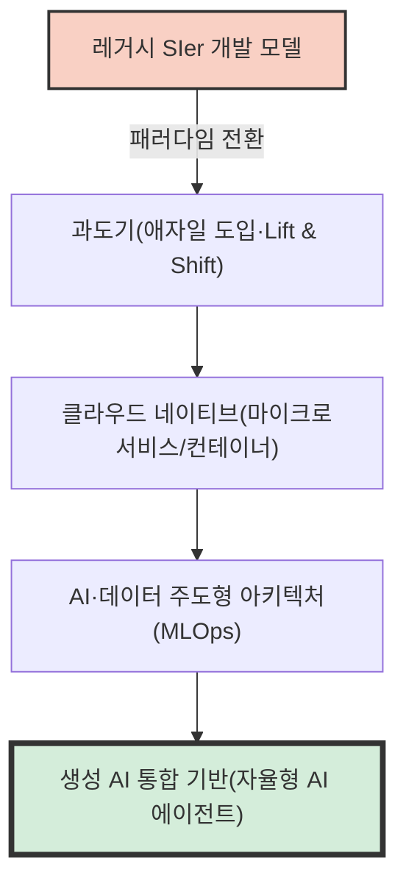
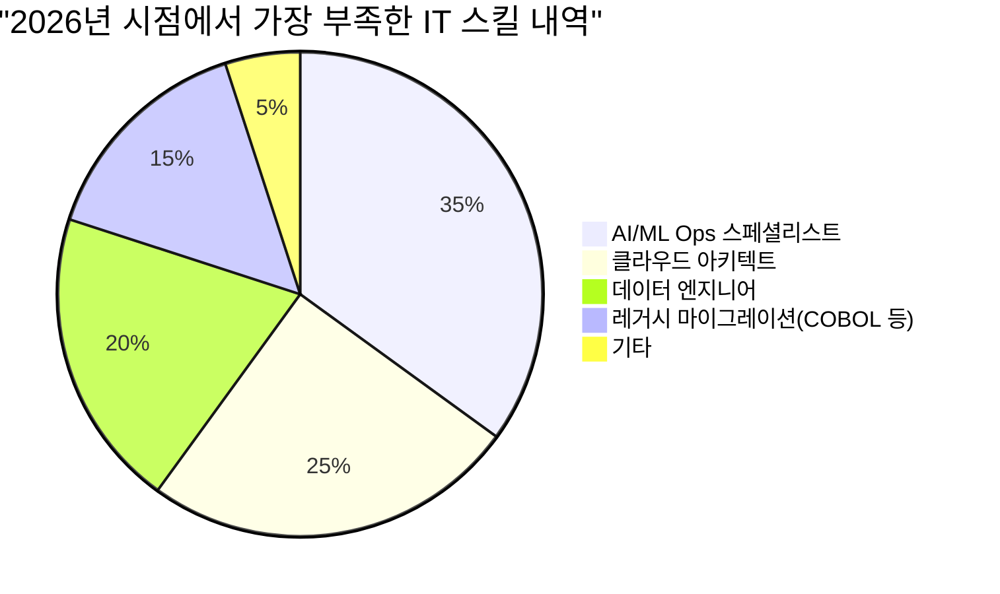
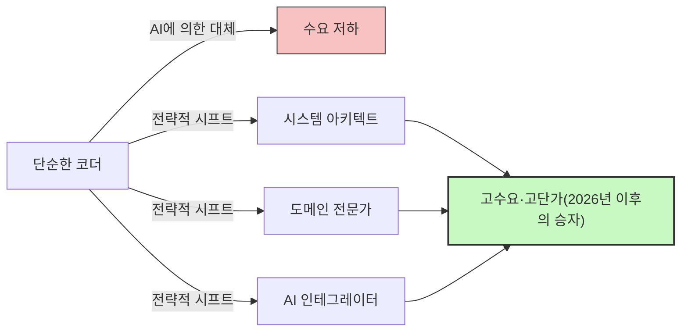

## 들어가며: 'IT 인재 부족'이라는 말의 함정

일본의 IT 업계에서 '2025년의 절벽'이나 '2030년 IT 인재 부족 최대 79만 명'과 같은 선정적인 말들이 미디어에 오르내린 지 오래되었지만, 현재 우리가 직면하고 있는 것은 **'2026년 문제'**라고 불러야 할 전혀 새로운 단계의 위기입니다.

경제산업성의 보고서나 각종 미디어 보도에서는 'IT 엔지니어가 압도적으로 부족하다'고 하나로 묶어 말하고 있습니다. 하지만 현장의 생생한 목소리를 들어보면 사태는 조금 더 복잡합니다. 실제로는 '누구나 부족한' 것이 아닙니다. **'기업이 간절히 원하는 고도의 스킬을 가진 시니어 엔지니어'는 궤멸적으로 부족한 반면, '미경험자나 경험이 얕은 주니어 엔지니어'는 공급 과잉 상태에 빠져 일자리를 찾기 어려워지고 있다**는 강렬한 '양극화'가 일어나고 있습니다.

이 글에서는 현재 IT 업계에서 실제로 무슨 일이 일어나고 있는지, 기존의 SIer 모델에서 클라우드 네이티브·AI 주도 개발로의 패러다임 전환, 레거시 시스템의 절벽, 그리고 GitHub Copilot으로 대표되는 생성 AI가 가져온 파괴적인 영향에 대해 철저히 깊이 파고들어 해설합니다.

---

## 1. 구조적 변화: 전통적 SIer에서 클라우드 네이티브·AI 주도 개발로의 전환

일본의 IT 산업을 오랫동안 지탱해 온 것은 다중 하청 구조를 동반한 SIer(시스템 인테그레이터) 모델이었습니다. 사양서대로 코드를 작성하고 테스트 사양서를 채우는, 이른바 '노동 집약형' 비즈니스 모델입니다. 여기서는 '인월(Man-month)'이라는 단위로 엔지니어의 가치가 측정되었고, 인원수만 맞춰지면 프로젝트가 돌아간다는 전제가 있었습니다.

하지만 2026년 현재 이 모델은 한계에 다다랐습니다. DX(디지털 트랜스포메이션)의 본질이 '단순한 IT화'에서 '비즈니스 모델의 변혁'으로 이동하면서, 민첩성(Agility)이 낮은 워터폴 개발로는 시장의 변화를 따라잡을 수 없게 되었습니다.

현대의 개발 프로세스는 **클라우드 네이티브**이며, **AI 주도**인 것을 전제로 합니다. 컨테이너화(Docker/Kubernetes), 마이크로서비스 아키텍처, CI/CD 파이프라인의 자동화는 더 이상 '특별한 기술'이 아니라 '표준적인 인프라'입니다.



기업이 요구하는 것은 주어진 사양서를 코딩하기만 하는 '코더'가 아닙니다. 클라우드 인프라 설계부터 백엔드 구현, 나아가 머신러닝 모델의 실제 운용화(MLOps)까지 내다보고, 비즈니스 요건을 기술적인 아키텍처로 구현할 수 있는 인재입니다. 이처럼 광범위한 지식과 경험이 요구되는 영역에서 '단순히 프로그래밍 언어의 구문을 아는' 것만으로는 가치를 창출하기 어려워지고 있습니다.

---

## 2. 레거시 시스템의 '절벽'과 데이터 엔지니어링의 고갈

'2025년의 절벽'에서 경고했던 대로, 많은 일본 기업은 여전히 메인프레임이나 온프레미스 레거시 시스템(COBOL 등으로 구축된 것)을 안고 있습니다. 이러한 시스템은 오랜 기간의 수정으로 인해 블랙박스화되었으며, 유지보수를 담당하던 시니어 층의 정년퇴직에 따라 유지가 극히 어려워지고 있습니다.

한편, 비즈니스 측에서는 '데이터를 활용해 AI 모델을 구축하고 개인화된 고객 경험을 제공하고 싶다'는 강한 요망이 제기됩니다. 여기에 치명적인 격차가 존재합니다. **온프레미스의 사일로화된 데이터를 최신 AI/ML 파이프라인에서 이용 가능한 형태로 정제·통합·파이프라인화하는 '데이터 엔지니어'가 압도적으로 부족한** 것입니다.

### 레거시 유지 비용과 모더나이제이션의 수리 모델

여기서 레거시 시스템을 유지할 경우의 비용($C_{legacy}$)과 모더나이제이션(현대화)에 드는 투자 및 그 후의 운용 비용($C_{modern}$)을 비교하는 간단한 수리 모델을 생각해 보겠습니다.

레거시 시스템의 유지 비용은 해마다 증가합니다. 기술적 부채로 인한 장애 대응이나, 레거시 기술자의 희소화로 인한 인건비 상승이 요인입니다.
연수를 $t$라고 하면 다음과 같이 나타낼 수 있습니다.

$$
C_{legacy}(t) = M_0 \times (1 + r)^t + L_0 \times (1 + i)^t
$$

여기서,
- $M_0$: 초기 유지보수 비용
- $r$: 기술적 부채로 인한 유지보수 비용 증가율
- $L_0$: 초기 레거시 인재 비용
- $i$: 레거시 인재 희소화로 인한 인건비 인플레이션율

반면, 모더나이제이션을 진행할 경우 초기 투자 $I$가 크게 발생하지만, 운용 비용 $O_m$은 클라우드화나 자동화를 통해 낮게 억제되며 일정하게 유지되기 쉽습니다.

$$
C_{modern}(t) = I + O_m \times t
$$

대부분의 경우 몇 년 이내(손익분기점)에 $C_{legacy}(t) > C_{modern}(t)$가 되는 것은 자명하지만, 초기 투자 $I$를 실행할 수 있는 '아키텍트'와 '데이터 엔지니어'가 시장에 존재하지 않기 때문에 많은 기업이 $C_{legacy}$의 늪에 빠져들고 있는 것이 2026년의 현실입니다.



---

## 3. 생성 AI의 파괴적 영향: GitHub Copilot과 주니어 엔지니어의 소멸

IT 인재 부족을 논할 때 절대 빼놓을 수 없는 것이 **생성 AI(Generative AI)의 대두**입니다. GitHub Copilot, Cursor, ChatGPT(GPT-4o나 o1 시리즈 등)와 같은 툴은 소프트웨어 개발의 생산성을 근본적으로 바꾸어 놓았습니다.

지금까지 시니어 엔지니어는 복잡한 설계나 리뷰에 시간을 할애하고, 단순한 CRUD(Create, Read, Update, Delete) 처리나 보일러플레이트(상용구 코드), 테스트 코드 작성 등은 주니어 엔지니어에게 맡기는(위임하는) 것이 일반적인 팀 구성이었습니다.

하지만 현재 이러한 '주니어가 담당하던 태스크'의 9할은 생성 AI가 수초에서 수분 만에, 그것도 높은 정확도로 생성할 수 있게 되었습니다. 결과적으로 무슨 일이 일어났을까요? **기업은 주니어 엔지니어를 고용할 이유를 잃었습니다.**

### 생성 AI로 인한 생산성 승수의 변화

AI 도입 전후 개발 팀의 총생산성을 수식으로 나타내 보겠습니다.

기본 생산성을 $P$라고 합니다.
생성 AI 도입으로 인한 시니어 엔지니어의 생산성 향상률을 $\alpha_{senior}$, 주니어 엔지니어의 생산성 향상률을 $\alpha_{junior}$라고 합니다.

$$
\text{Total Output}_{pre} = N_{senior} \times P_{senior} + N_{junior} \times P_{junior}
$$

$$
\text{Total Output}_{post} = N_{senior} \times P_{senior} \times (1 + \alpha_{senior}) + N_{junior} \times P_{junior} \times (1 + \alpha_{junior})
$$

얼핏 보면 주니어의 생산성도 향상되는 것처럼 보입니다. 하지만 실제 현장에서는 AI가 출력한 코드의 **'타당성을 검증하고, 시스템 전체에 통합하며, 보안상 우려가 없는지 판단하는' 능력**이 필수적입니다. 이 능력(컨텍스트 이해력이나 아키텍처 설계력)은 주니어에게 부족합니다.

결과적으로 시니어 엔지니어는 AI를 '초우수 어시스턴트(무한히 일하는 주니어)'로 활용하여 생산성을 $2 \sim 3$배로 끌어올리고 있습니다($\alpha_{senior} \approx 2.0$). 반면, 기초 역량이 없는 주니어가 AI를 사용하면 겉보기에는 작동하지만 부채를 대량으로 안고 있는 스파게티 코드가 양산되어, 오히려 리뷰 비용이 증대되는 사태를 초래합니다(실질적인 $\alpha_{junior} < 0$이 되는 경우조차 있습니다).

이 결과, 기업은 '월급 30만 엔의 주니어를 3명 고용하는' 것보다 '월급 120만 엔의 시니어(AI 사용자)를 1명 고용하는' 쪽이 압도적으로 리스크가 적고 퍼포먼스가 높다는 사실을 깨닫고 말았습니다. 이것이 '인재 부족'의 정체입니다. 'AI를 능숙하게 다루는 시니어'가 턱없이 부족한 것입니다.

```mermaid
xychart-beta
    title "주니어 층과 시니어 층의 구인 수요 양극화(2021-2026)"
    x-axis ["2021", "2022", "2023", "2024", "2025", "2026"]
    y-axis "구인 배율" 0.0 --> 10.0
    line ["시니어(아키텍트/MLOps 등)"] [3.0, 3.5, 4.2, 5.8, 7.5, 9.2]
    line ["주니어(미경험/경력 1~2년)"] [2.5, 2.2, 1.8, 1.2, 0.8, 0.3]
```

---

## 4. 프롬프트 엔지니어링을 넘어: 정말로 필요한 스킬이란?

그렇다면 앞으로의 시대에 요구되는 IT 인재란 어떤 존재일까요? '프롬프트 엔지니어링을 마스터하면 된다'고 생각하는 것은 성급합니다. 자연어를 통한 지시 기술은 AI 모델의 진화와 함께 쉬워지고 있으며, 범용화(Commoditization)가 진행되고 있습니다.

현장의 리얼리티로서 지금 진정으로 요구되는 것은 다음 3가지 영역을 커버할 수 있는 인재입니다.

### A. 도메인 주도 설계(DDD)와 비즈니스 모델링
AI는 코드를 작성할 수는 있지만, '비즈니스의 복잡한 사양을 풀고, 소프트웨어의 제한된 컨텍스트(Bounded Context)를 찾아내어, 적절한 데이터 모델을 설계하는' 것은 불가능합니다. 고객의 도메인(업무 영역)을 깊이 이해하고, 이를 기술적인 언어로 번역하는 '도메인 주도 설계(DDD)' 스킬은 AI 시대에 가장 가치 있는 스킬 중 하나입니다.

### B. 아키텍처와 비기능 요건의 설계
시스템의 가용성, 확장성, 보안, 퍼포먼스 같은 '비기능 요건'은 AI가 자동으로 최적화해 주는 것이 아닙니다. '어떤 클라우드 서비스를 조합할 것인가', '마이크로서비스 간의 통신 프로토콜은 어떻게 할 것인가', 'DB의 트랜잭션 경계를 어디에 그을 것인가'와 같은 아키텍처의 의사결정은 여전히 고도화된 인간의 경험과 직관에 의존하고 있습니다.

### C. MLOps와 데이터 파이프라인 구축
생성 AI나 머신러닝 모델을 프로덕션 환경에서 계속 운용하기 위한 'MLOps'의 개념은 갈수록 중요해지고 있습니다. 모델의 드리프트(정확도 저하) 모니터링, 지속적 학습의 파이프라인화, GPU 리소스 최적화 등 소프트웨어 엔지니어링과 데이터 사이언스의 교차점에 위치한 이러한 스킬을 가진 인재는 수요가 넘치는 상태입니다.

---

## 5. 엔지니어를 위한 생존 전략: 2026년 이후를 살아남기 위해

이러한 상황 속에서 우리 엔지니어는 어떻게 커리어를 구축해 나가야 할까요? 특히 경험이 얕은 엔지니어에게 상황은 절망적으로 보일지도 모릅니다. 하지만 전략에 따라 돌파구는 충분히 있습니다.

### 전략 1: 'AI 오케스트레이터'를 목표로 하기
단일 언어나 프레임워크의 전문가가 되는 것이 아니라, 여러 AI 툴이나 에이전트를 조합하여 시스템 전체를 구축하는 '오케스트레이터'로서의 능력을 기르는 것입니다. 스스로 손을 움직여 코드를 작성하는 시간을 줄이고, AI가 작성하게 한 컴포넌트를 연결하여 아키텍처 전체를 조감하는 '한 차원 높은 시야'를 가질 필요가 있습니다.

### 전략 2: 도메인 지식의 획득
기술적인 스킬뿐만 아니라 특정 업계(금융, 의료, 물류 등)의 깊은 도메인 지식을 갖춥시다. 업무 흐름의 페인 포인트(Pain point)를 꿰뚫고 있는 엔지니어는 기술적인 해결책을 제안할 때 AI는 모방할 수 없는 강력한 설득력을 갖게 됩니다. 'HOW(어떻게 만들 것인가)'는 AI에 맡기고, 'WHAT(무엇을 만들 것인가)'과 'WHY(왜 만드는가)'에 초점을 맞추는 것입니다.

### 전략 3: 소프트 스킬과 이해관계자 매니지먼트
대규모 시스템 개발에서는 결국 '인간관계의 구축'과 '기대치 컨트롤'이 프로젝트의 성패를 가릅니다. 고객과의 요건 정의, 팀 내 퍼실리테이션, 복잡한 의사결정의 합의 형성 같은 '휴먼 스킬'은 AI가 대체하기 가장 어려운 영역입니다. 기술을 기반으로 하면서도 커뮤니케이션 능력이 뛰어난 인재는 앞으로 더욱 중용될 것입니다.



---

## 결론: 두려워하지 말고 파도에 올라타라

'2026년 문제'와 그에 따른 IT 인재 부족의 실태는 단순한 '머릿수 부족'이 아니라, '요구되는 스킬의 극적인 변화로 인한 미스매치'라는 것을 이해하셨을 것입니다.

레거시 시스템의 중압, 데이터 엔지니어의 고갈, 그리고 생성 AI로 인한 패러다임 전환. 이러한 파도는 기존형 엔지니어에게는 위협이지만, 변화를 받아들이고 자신의 스킬셋을 업데이트할 수 있는 사람에게는 그 어느 때보다 큰 기회이기도 합니다.

AI는 우리의 일자리를 빼앗는 것이 아니라, 우리가 보다 고도화되고 창조적인 일에 전념하기 위한 툴에 불과합니다. 코딩이라는 '작업'에서 해방되어 시스템 '설계'와 비즈니스 '가치 창출'에 포커스를 맞추는 것. 그것이 2026년 이후의 IT 업계에서 살아남고, 번영하기 위한 유일한 길입니다.

지금이야말로 자신의 커리어 패스를 재검토하고, 다음 패러다임을 향해 방향을 틀어야 할 때입니다.
당신 스스로를 '모더나이제이션'할 준비가 되셨습니까?
