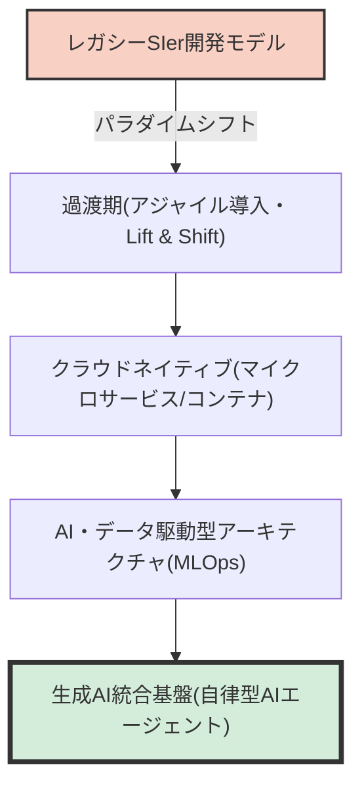
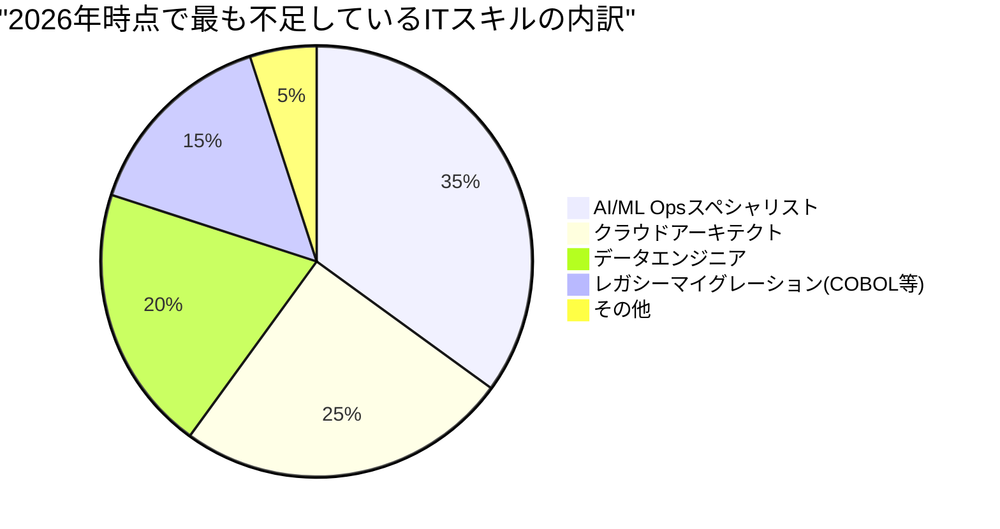
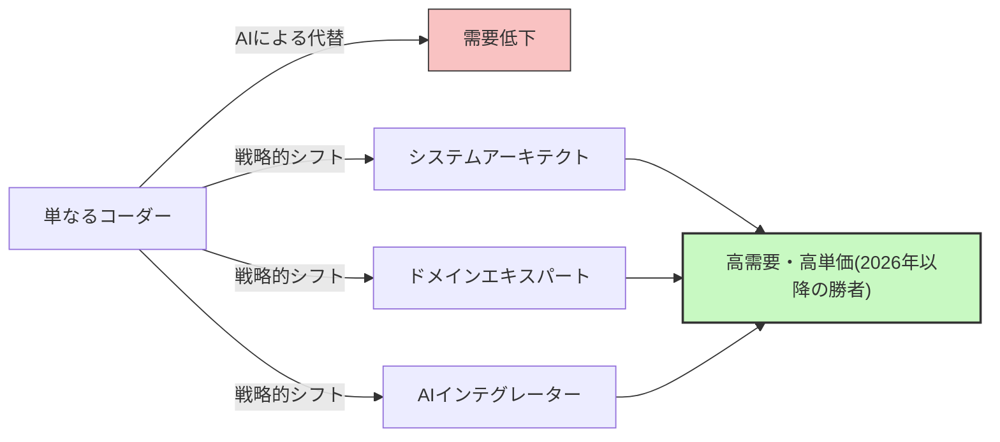

## はじめに：「IT人材不足」という言葉の罠

日本のIT業界において、「2025年の崖」や「2030年のIT人材不足最大79万人」といったセンセーショナルな言葉がメディアを飛び交って久しいですが、現在我々が直面しているのは**「2026年問題」**と呼ぶべき全く新しいフェーズの危機です。

経済産業省のレポートや各種メディアの報道では「ITエンジニアが圧倒的に足りない」と一括りにされています。しかし、現場のリアルな声を聞くと、事態はもう少し複雑です。実際には「誰もが不足している」わけではありません。**「企業が喉から手が出るほど欲しい高度なスキルを持ったシニアエンジニア」が壊滅的に不足している一方で、「未経験や経験の浅いジュニアエンジニア」は供給過多に陥り、仕事を見つけるのが困難になりつつある**という、強烈な「二極化」が起きています。

この記事では、現在IT業界で実際に何が起きているのか、旧来のSIerモデルからクラウドネイティブ・AI駆動開発へのパラダイムシフト、レガシーシステムの崖、そしてGitHub Copilotに代表される生成AIがもたらした破壊的な影響について、徹底的に深掘りして解説します。

---

## 1. 構造的変化：伝統的SIerからクラウドネイティブ・AI駆動開発への移行

日本のIT産業を長年支えてきたのは、多重下請け構造を伴うSIer（システムインテグレーター）モデルでした。仕様書通りにコードを書き、テスト仕様書を埋めるという、いわゆる「労働集約型」のビジネスモデルです。ここでは、「人月」という単位でエンジニアの価値が計られ、頭数が揃えばプロジェクトが回るという前提がありました。

しかし、2026年現在、このモデルは限界を迎えています。DX（デジタルトランスフォーメーション）の本質が「単なるIT化」から「ビジネスモデルの変革」へとシフトしたことで、アジリティ（俊敏性）の低いウォーターフォール開発では市場の変化に追いつけなくなりました。

現代の開発プロセスは、**クラウドネイティブ**であり、**AI駆動**であることが前提となっています。コンテナ化（Docker/Kubernetes）、マイクロサービスアーキテクチャ、CI/CDパイプラインの自動化はもはや「特別な技術」ではなく「標準的なインフラ」です。



企業が求めているのは、与えられた仕様書をコーディングするだけの「コーダー」ではありません。クラウドインフラの設計からバックエンドの実装、さらには機械学習モデルの実運用化（MLOps）までを見据え、ビジネス要件を技術的なアーキテクチャに落とし込める人材です。このような広範な知識と経験を要求される領域において、「単にプログラミング言語の構文を知っている」だけの人材は価値を生み出しにくくなっています。

---

## 2. レガシーシステムの「崖」とデータエンジニアリングの枯渇

「2025年の崖」で警告されていた通り、多くの日本企業は依然としてメインフレームやオンプレミスのレガシーシステム（COBOLなどで構築されたもの）を抱えています。これらのシステムは長年の改修によってブラックボックス化しており、保守を担当していたシニア層の定年退職に伴い、維持が極めて困難になっています。

一方で、ビジネス側からは「データを活用してAIモデルを構築し、パーソナライズされた顧客体験を提供したい」という強い要望が寄せられます。ここに致命的なギャップが存在します。**オンプレミスのサイロ化されたデータを、最新のAI/MLパイプラインで利用可能な形にクレンジング・統合・パイプライン化する「データエンジニア」が圧倒的に不足している**のです。

### レガシー維持コストとモダナイゼーションの数理モデル

ここで、レガシーシステムを維持する場合のコスト（$C_{legacy}$）と、モダナイゼーション（刷新）にかかる投資とその後の運用コスト（$C_{modern}$）を比較する簡単な数理モデルを考えてみましょう。

レガシーシステムの維持コストは年々増加します。技術的負債による障害対応や、レガシー技術者の希少化による人件費高騰が要因です。
年数を $t$ とすると、次のように表せます。

$$
C_{legacy}(t) = M_0 \times (1 + r)^t + L_0 \times (1 + i)^t
$$

ここで、
- $M_0$: 初期の保守費用
- $r$: 技術的負債による保守費用の増加率
- $L_0$: 初期のレガシー人材コスト
- $i$: レガシー人材の希少化による人件費インフレ率

一方、モダナイゼーションを行う場合、初期投資 $I$ が大きくかかりますが、運用コスト $O_m$ はクラウド化や自動化によって低く抑えられ、かつ一定に保たれやすくなります。

$$
C_{modern}(t) = I + O_m \times t
$$

多くの場合、数年以内（損益分岐点）に $C_{legacy}(t) > C_{modern}(t)$ となることが自明ですが、初期投資 $I$ を実行できるだけの「アーキテクト」と「データエンジニア」が市場に存在しないため、多くの企業が $C_{legacy}$ の泥沼に沈んでいっているのが2026年の現状です。



---

## 3. 生成AIの破壊的影響：GitHub Copilotとジュニアエンジニアの消失

IT人材不足を語る上で絶対に外せないのが、**生成AI（Generative AI）の台頭**です。GitHub Copilot、Cursor、ChatGPT（GPT-4oやO1シリーズ）といったツールは、ソフトウェア開発の生産性を根本から変えました。

これまで、シニアエンジニアは複雑な設計やレビューに時間を割き、単純なCRUD（Create, Read, Update, Delete）処理やボイラープレート（定型的なコード）、テストコードの記述などはジュニアエンジニアに任せる（委譲する）のが一般的なチーム構成でした。

しかし現在、これらの「ジュニアが担当していたタスク」の9割は、生成AIが数秒から数分で、しかも高い精度で生成できるようになりました。結果として何が起きたか？ **企業はジュニアエンジニアを雇う理由を失いました。**

### 生成AIによる生産性乗数の変化

AI導入前後の開発チームの総生産性を数式で表してみます。

ベースの生産性を $P$ とします。
生成AI導入によるシニアエンジニアの生産性向上率を $\alpha_{senior}$、ジュニアエンジニアの生産性向上率を $\alpha_{junior}$ とします。

$$
\text{Total Output}_{pre} = N_{senior} \times P_{senior} + N_{junior} \times P_{junior}
$$

$$
\text{Total Output}_{post} = N_{senior} \times P_{senior} \times (1 + \alpha_{senior}) + N_{junior} \times P_{junior} \times (1 + \alpha_{junior})
$$

一見するとジュニアの生産性も向上するように見えます。しかし実際の現場では、AIが出力したコードの**「妥当性を検証し、システム全体に統合し、セキュリティ上の懸念がないか判断する」能力**が不可欠です。この能力（コンテキスト理解力やアーキテクチャ設計力）はジュニアには不足しています。

結果として、シニアエンジニアはAIを「超優秀なアシスタント（無限に働くジュニア）」として使いこなし、生産性を $2 \sim 3$ 倍に跳ね上げています（$\alpha_{senior} \approx 2.0$）。対して、基礎力のないジュニアがAIを使うと、一見動くものの負債を大量に抱えたスパゲッティコードが量産され、かえってレビューコストが増大する事態を招きます（実質的な $\alpha_{junior} < 0$ となるケースすらあります）。

この結果、企業は「月給30万円のジュニアを3人雇う」よりも、「月給120万円のシニア（AI使い）を1人雇う」方が、圧倒的に低リスクかつ高パフォーマンスであることに気づいてしまいました。これが「人材不足」の正体です。「AIを使いこなせるシニア」が全く足りていないのです。

```mermaid
xychart-beta
    title "ジュニア層とシニア層の求人需要の二極化(2021-2026)"
    x-axis ["2021", "2022", "2023", "2024", "2025", "2026"]
    y-axis "求人倍率" 0.0 --> 10.0
    line ["シニア(アーキテクト/MLOps等)"] [3.0, 3.5, 4.2, 5.8, 7.5, 9.2]
    line ["ジュニア(未経験/経験1〜2年)"] [2.5, 2.2, 1.8, 1.2, 0.8, 0.3]
```

---

## 4. プロンプトエンジニアリングを超えて：本当に必要なスキルとは？

では、これからの時代に求められるIT人材とはどのような存在でしょうか？「プロンプトエンジニアリングを極めれば良い」と考えるのは早計です。自然言語による指示出しの技術は、AIモデルの進化とともに平易になり、コモディティ化が進んでいます。

現場のリアルとして、今本当に求められているのは以下の3つの領域をカバーできる人材です。

### A. ドメイン駆動設計（DDD）とビジネスモデリング
AIはコードを書くことはできますが、「ビジネスの複雑な仕様を紐解き、ソフトウェアの境界づけられたコンテキスト（Bounded Context）を見出し、適切なデータモデルを設計する」ことはできません。顧客のドメイン（業務領域）を深く理解し、それを技術的な言葉に翻訳する「ドメイン駆動設計（DDD）」のスキルは、AI時代において最も価値が高いスキルの1つです。

### B. アーキテクチャと非機能要件の設計
システムの可用性、スケーラビリティ、セキュリティ、パフォーマンスといった「非機能要件」は、AIが自動的に最適化してくれるものではありません。「どのクラウドサービスを組み合わせるべきか」「マイクロサービス間の通信プロトコルはどうするか」「DBのトランザクション境界をどこに引くか」といったアーキテクチャの意思決定は、依然として高度な人間の経験と直感に依存しています。

### C. MLOpsとデータパイプライン構築
生成AIや機械学習モデルを本番環境で運用し続けるための「MLOps」の概念はますます重要になっています。モデルのドリフト（精度低下）の監視、継続的トレーニングのパイプライン化、GPUリソースの最適化など、ソフトウェアエンジニアリングとデータサイエンスの交差点に位置するこれらのスキルを持つ人材は、引く手あまたの状態です。

---

## 5. エンジニアのための生存戦略：2026年以降を生き抜くために

このような状況下で、我々エンジニアはどのようにキャリアを構築していけば良いのでしょうか。特に経験が浅いエンジニアにとって、状況は絶望的に見えるかもしれません。しかし、戦略次第で突破口は十分にあります。

### 戦略1: 「AIオーケストレーター」を目指す
単一の言語やフレームワークの専門家になるのではなく、複数のAIツールやエージェントを組み合わせてシステム全体を構築する「オーケストレーター」としての能力を磨くことです。自らが手を動かしてコードを書く時間を減らし、AIに書かせたコンポーネントを繋ぎ合わせ、アーキテクチャ全体を俯瞰する「一段上の視点」を持つ必要があります。

### 戦略2: ドメイン知識の獲得
技術的なスキルだけでなく、特定の業界（金融、医療、物流など）の深いドメイン知識を持ちましょう。業務フローの痛点を知り尽くしているエンジニアは、技術的な解決策を提案する際にAIには模倣できない強力な説得力を持ちます。「HOW（どう作るか）」はAIに任せ、「WHAT（何を作るか）」と「WHY（なぜ作るか）」に焦点を当てるのです。

### 戦略3: ソフトスキルとステークホルダーマネジメント
大規模なシステム開発においては、結局のところ「人間関係の構築」と「期待値コントロール」がプロジェクトの成否を分けます。顧客との要件定義、チーム内のファシリテーション、複雑な意思決定の合意形成といった「ヒューマンスキル」は、AIが代替することが最も困難な領域です。技術をベースにしながらも、コミュニケーション能力に長けた人材は、今後さらに重宝されるでしょう。



---

## 結論：恐れるのではなく、波に乗る

「2026年問題」とそれに伴うIT人材不足の実態は、単純な「頭数不足」ではなく、「求められるスキルの劇的な変化によるミスマッチ」であることがお分かりいただけたかと思います。

レガシーシステムの重圧、データエンジニアの枯渇、そして生成AIによるパラダイムシフト。これらの波は、従来型のエンジニアにとっては脅威ですが、変化を受け入れ、自らのスキルセットをアップデートできる者にとっては、かつてないほどの巨大なチャンスでもあります。

AIは私たちの仕事を奪うのではなく、我々がより高度で創造的な仕事に専念するためのツールに過ぎません。コーディングという「作業」から解放され、システムの「設計」とビジネスの「価値創造」にフォーカスすること。それが、2026年以降のIT業界で生き残り、そして繁栄するための唯一の道筋なのです。

今こそ、自分のキャリアパスを見直し、次なるパラダイムに向けて舵を切る時です。
あなた自身を「モダナイゼーション」する準備はできていますか？
