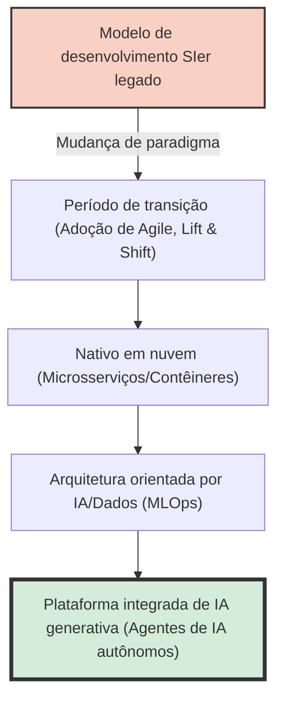
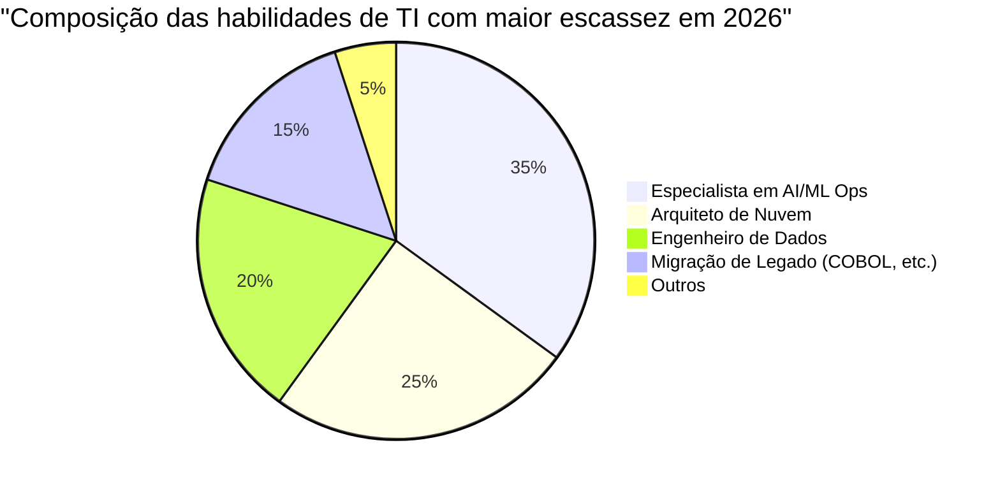
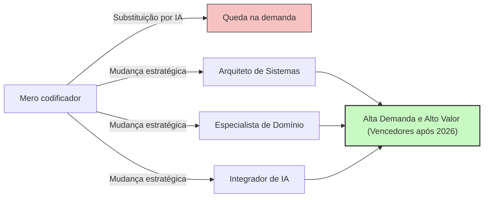

## Introdução: A armadilha da expressão "Escassez de talentos de TI"

Na indústria de TI japonesa, termos sensacionalistas como o "Abismo de 2025" e a "escassez máxima de 790.000 talentos de TI até 2030" têm circulado na mídia há muito tempo. No entanto, o que enfrentamos atualmente é uma crise em uma fase completamente nova, que deve ser chamada de **"Problema de 2026"**.

Nos relatórios do Ministério da Economia, Comércio e Indústria e nas reportagens de vários meios de comunicação, tudo é generalizado com a afirmação de que "os engenheiros de TI são esmagadoramente insuficientes". No entanto, ouvindo as vozes reais do mercado, a situação é um pouco mais complexa. Na verdade, não é que "esteja faltando todo mundo". Está ocorrendo uma intensa "polarização": enquanto há uma **escassez devastadora de engenheiros seniores com habilidades avançadas que as empresas desejam desesperadamente**, há um **excesso de oferta de engenheiros juniores inexperientes ou com pouca experiência, para os quais está se tornando cada vez mais difícil encontrar trabalho**.

Neste artigo, aprofundaremos e explicaremos detalhadamente o que realmente está acontecendo na indústria de TI hoje: a mudança de paradigma do modelo tradicional de SIer para o desenvolvimento nativo em nuvem e orientado por IA, o abismo dos sistemas legados e o impacto destrutivo trazido pela IA generativa, representada pelo GitHub Copilot.

---

## 1. Mudança Estrutural: A transição do SIer tradicional para o desenvolvimento nativo em nuvem e orientado por IA

O que sustentou a indústria de TI japonesa por muitos anos foi o modelo SIer (System Integrator), acompanhado por uma estrutura de subcontratação em múltiplas camadas. É o chamado modelo de negócios "intensivo em mão de obra", no qual se escreve o código conforme as especificações e se preenchem os documentos de teste. Aqui, o valor de um engenheiro era medido em "homem-mês", com a premissa de que os projetos andariam se houvesse gente suficiente.

No entanto, em 2026, esse modelo atingiu seu limite. Como a essência da DX (Transformação Digital) mudou de "simples informatização" para "transformação do modelo de negócios", o desenvolvimento em cascata (waterfall), com sua baixa agilidade, não consegue mais acompanhar as mudanças do mercado.

O processo de desenvolvimento moderno pressupõe ser **nativo em nuvem** e **orientado por IA**. A conteinerização (Docker/Kubernetes), a arquitetura de microsserviços e a automação de pipelines de CI/CD não são mais "tecnologias especiais", mas sim "infraestrutura padrão".



O que as empresas procuram não é um mero "codificador" que apenas programa as especificações fornecidas. Elas buscam talentos capazes de traduzir os requisitos de negócios em uma arquitetura técnica, vislumbrando desde o design da infraestrutura em nuvem e a implementação do back-end até a operacionalização de modelos de machine learning (MLOps). Em uma área que exige conhecimentos e experiências tão abrangentes, talentos que "apenas conhecem a sintaxe de uma linguagem de programação" têm dificuldade em gerar valor.

---

## 2. O "Abismo" dos Sistemas Legados e a Escassez de Engenharia de Dados

Como advertido no "Abismo de 2025", muitas empresas japonesas ainda mantêm mainframes e sistemas legados locais (on-premise, como aqueles construídos em COBOL). Esses sistemas se tornaram caixas pretas devido a anos de modificações, e sua manutenção tornou-se extremamente difícil com a aposentadoria dos seniores que cuidavam deles.

Por outro lado, há uma forte demanda do lado dos negócios para "utilizar dados na construção de modelos de IA e fornecer experiências personalizadas aos clientes". Existe uma lacuna fatal aqui. Há uma **escassez esmagadora de "engenheiros de dados" que possam limpar, integrar e criar pipelines de dados isolados no local (on-premise) para um formato que possa ser usado pelos mais recentes pipelines de IA/ML**.

### Modelo Matemático de Custos de Manutenção de Sistemas Legados e Modernização

Aqui, vamos considerar um modelo matemático simples que compara o custo de manutenção de um sistema legado ($C_{legacy}$) com o investimento necessário para a modernização (renovação) e os custos operacionais subsequentes ($C_{modern}$).

Os custos de manutenção dos sistemas legados aumentam a cada ano. Os fatores incluem a resposta a falhas devido à dívida técnica e o aumento dos custos trabalhistas devido à escassez de técnicos especializados em sistemas legados.
Seja o número de anos $t$, podemos expressar da seguinte forma:

$$
C_{legacy}(t) = M_0 \times (1 + r)^t + L_0 \times (1 + i)^t
$$

Onde,
- $M_0$: Custo de manutenção inicial
- $r$: Taxa de aumento dos custos de manutenção devido à dívida técnica
- $L_0$: Custo inicial de pessoal de TI em sistemas legados
- $i$: Taxa de inflação dos custos de pessoal devido à escassez de talentos legados

Por outro lado, quando se realiza a modernização, há um grande investimento inicial $I$, mas os custos operacionais $O_m$ podem ser mantidos baixos e consistentes através da adoção da nuvem e da automação.

$$
C_{modern}(t) = I + O_m \times t
$$

Na maioria dos casos, é evidente que $C_{legacy}(t) > C_{modern}(t)$ dentro de alguns anos (ponto de equilíbrio). No entanto, devido à ausência no mercado de "arquitetos" e "engenheiros de dados" capazes de executar o investimento inicial $I$, muitas empresas estão afundando no pântano do $C_{legacy}$, o que é a realidade de 2026.



---

## 3. O Impacto Destrutivo da IA Generativa: GitHub Copilot e o Desaparecimento dos Engenheiros Juniores

Ao falar sobre a escassez de talentos em TI, não podemos ignorar a **ascensão da IA generativa**. Ferramentas como o GitHub Copilot, Cursor e ChatGPT (séries GPT-4o e O1) mudaram fundamentalmente a produtividade do desenvolvimento de software.

Até agora, as equipes geralmente eram estruturadas de forma que os engenheiros seniores dedicassem seu tempo a designs e revisões complexas, e delegassem processos simples de CRUD (Create, Read, Update, Delete), código boilerplate (código repetitivo) e a escrita de códigos de teste para os engenheiros juniores.

No entanto, atualmente, 90% dessas "tarefas que costumavam ser feitas por juniores" podem ser geradas pela IA generativa em segundos a minutos, e com alta precisão. Qual foi o resultado disso? **As empresas perderam o motivo para contratar engenheiros juniores.**

### Mudança no Multiplicador de Produtividade pela IA Generativa

Vamos expressar a produtividade total da equipe de desenvolvimento antes e depois da introdução da IA usando fórmulas matemáticas.

Seja a produtividade base $P$.
A taxa de melhoria na produtividade do engenheiro sênior devido à introdução da IA generativa é $\alpha_{senior}$, e a do engenheiro júnior é $\alpha_{junior}$.

$$
\text{Total Output}_{pre} = N_{senior} \times P_{senior} + N_{junior} \times P_{junior}
$$

$$
\text{Total Output}_{post} = N_{senior} \times P_{senior} \times (1 + \alpha_{senior}) + N_{junior} \times P_{junior} \times (1 + \alpha_{junior})
$$

À primeira vista, parece que a produtividade dos juniores também melhora. No entanto, em projetos reais, a capacidade de **"verificar a validade do código gerado pela IA, integrá-lo a todo o sistema e julgar se há preocupações de segurança"** é indispensável. Os juniores carecem dessa habilidade (capacidade de compreensão do contexto e de design de arquitetura).

Como resultado, os engenheiros seniores utilizam a IA como uma "assistente supereficiente (um júnior que trabalha infinitamente)", aumentando a produtividade de $2 \sim 3$ vezes ($\alpha_{senior} \approx 2.0$). Por outro lado, se um júnior sem conhecimentos básicos usar IA, código espaguete com uma grande quantidade de dívida técnica será produzido em massa, embora pareça funcionar no início, o que leva a um aumento nos custos de revisão (existem até casos onde $\alpha_{junior} < 0$ na prática).

Como resultado disso, as empresas perceberam que é esmagadoramente menos arriscado e tem um desempenho muito maior "contratar 1 sênior (usuário de IA) com um salário mensal de 1,2 milhão de ienes" do que "contratar 3 juniores com um salário mensal de 300 mil ienes". Essa é a verdadeira natureza da "escassez de talentos". Faltam "seniores capazes de dominar a IA".

```mermaid
xychart-beta
    title "Polarização da demanda de vagas entre níveis júnior e sênior (2021-2026)"
    x-axis ["2021", "2022", "2023", "2024", "2025", "2026"]
    y-axis "Taxa de oferta de empregos" 0.0 --> 10.0
    line ["Sênior (Arquiteto/MLOps, etc.)"] [3.0, 3.5, 4.2, 5.8, 7.5, 9.2]
    line ["Júnior (Inexperiente/1 a 2 anos de experiência)"] [2.5, 2.2, 1.8, 1.2, 0.8, 0.3]
```

---

## 4. Além da Engenharia de Prompts: Quais são as Habilidades Realmente Necessárias?

Então, qual é o tipo de talento de TI necessário na era vindoura? Pensar que "basta dominar a engenharia de prompts" é precipitado. A técnica de dar instruções usando linguagem natural está se tornando mais fácil e comoditizada à medida que os modelos de IA evoluem.

A realidade do mercado é que há uma necessidade urgente de talentos que possam cobrir as três áreas a seguir:

### A. Design Orientado a Domínio (DDD) e Modelagem de Negócios
A IA pode escrever códigos, mas não pode "desvendar as especificações complexas de negócios, encontrar os contextos delimitados (Bounded Context) do software e projetar o modelo de dados apropriado". A habilidade de "Design Orientado a Domínio (DDD)", de entender profundamente o domínio (área de negócios) do cliente e traduzi-lo em linguagem técnica, é uma das habilidades mais valiosas na era da IA.

### B. Arquitetura e Design de Requisitos Não Funcionais
Requisitos não funcionais como disponibilidade do sistema, escalabilidade, segurança e desempenho não são otimizados automaticamente pela IA. As decisões arquiteturais, como "quais serviços de nuvem combinar", "qual protocolo de comunicação entre microsserviços usar" e "onde traçar os limites das transações do banco de dados", ainda dependem da experiência intuitiva e altamente desenvolvida do ser humano.

### C. MLOps e Construção de Pipelines de Dados
O conceito de "MLOps", que consiste em manter continuamente a operação de IA generativa e modelos de machine learning em ambientes de produção, está se tornando cada vez mais importante. Talentos com habilidades na interseção da engenharia de software com a ciência de dados, como monitorar o desvio do modelo (queda de precisão), criar pipelines de treinamento contínuo e otimizar recursos de GPU, são muito procurados.

---

## 5. Estratégia de Sobrevivência para Engenheiros: Como Sobreviver a partir de 2026

Nesse cenário, como nós, engenheiros, devemos construir nossa carreira? Especialmente para engenheiros inexperientes, a situação pode parecer desesperadora. No entanto, dependendo da estratégia, há grandes possibilidades de avançar.

### Estratégia 1: Visar ser um "Orquestrador de IA"
Em vez de se tornar um especialista em uma única linguagem ou framework, aprimore sua capacidade de atuar como um "orquestrador" que constrói todo o sistema combinando múltiplas ferramentas e agentes de IA. É necessário reduzir o tempo que você mesmo passa escrevendo o código à mão, conectar os componentes escritos pela IA e ter uma "perspectiva superior" que supervisione toda a arquitetura.

### Estratégia 2: Aquisição de Conhecimento de Domínio
Não tenha apenas habilidades técnicas; adquira profundo conhecimento do domínio em uma indústria específica (finanças, medicina, logística, etc.). Engenheiros que conhecem intimamente os pontos críticos de um fluxo de negócios possuem um poder de persuasão extremamente forte - que não pode ser imitado pela IA - ao propor soluções técnicas. Deixe o "COMO (como fazer)" para a IA e concentre-se no "O QUE (o que fazer)" e "POR QUE (por que fazer)".

### Estratégia 3: Soft Skills e Gestão de Stakeholders
No desenvolvimento de sistemas em larga escala, em última análise, a "construção de relacionamentos humanos" e o "controle de expectativas" dividem o sucesso ou o fracasso de um projeto. As "habilidades humanas" (soft skills), como a definição de requisitos com os clientes, a facilitação dentro da equipe e a construção de consenso em decisões complexas, são as áreas mais difíceis de serem substituídas pela IA. Profissionais que possuam habilidades excepcionais de comunicação e tenham a tecnologia como base serão ainda mais valorizados no futuro.



---

## Conclusão: Não tema, mas sim surfe a onda

Acho que ficou claro que a verdadeira natureza do "Problema de 2026" e da consequente escassez de talentos de TI não é apenas uma simples "falta de pessoas", mas sim uma "incompatibilidade devido a uma mudança drástica nas habilidades necessárias".

A pressão dos sistemas legados, a escassez de engenheiros de dados e a mudança de paradigma pela IA generativa. Essas ondas são uma ameaça para o engenheiro tradicional, mas também são uma enorme oportunidade sem precedentes para aqueles que podem aceitar a mudança e atualizar seu conjunto de habilidades.

A IA não vai roubar nossos empregos, ela é apenas uma ferramenta para nos dedicarmos a trabalhos mais criativos e de alto nível. É sobre se libertar do "trabalho manual" da codificação e se concentrar no "design" de sistemas e na "criação de valor" nos negócios. Esse é o único caminho para sobreviver e prosperar na indústria de TI a partir de 2026.

Agora é a hora de repensar seu plano de carreira e mudar o rumo em direção ao próximo paradigma.
Você está pronto para "modernizar" a si mesmo?
