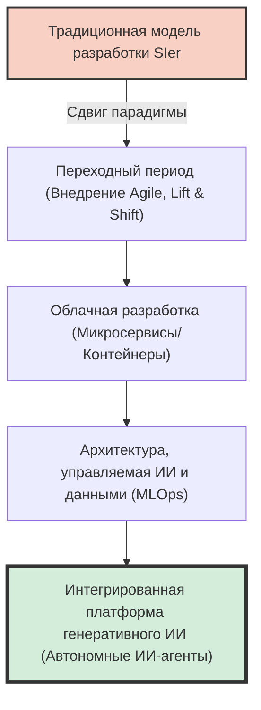
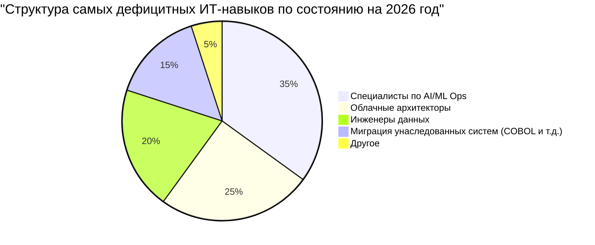
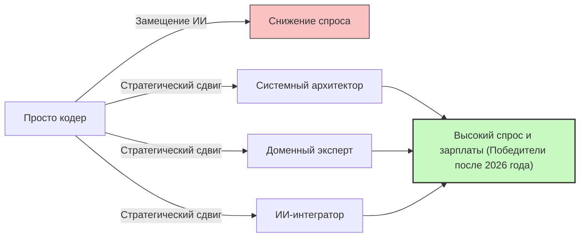

## Введение: Ловушка фразы «Нехватка ИТ-кадров»

В японской ИТ-индустрии уже давно циркулируют в СМИ сенсационные фразы вроде «Обрыв 2025 года» и «Нехватка до 790 000 ИТ-специалистов к 2030 году», но то, с чем мы сталкиваемся сейчас, — это кризис совершенно новой фазы, который следует назвать **«Проблемой 2026 года»**.

В отчетах Министерства экономики, торговли и промышленности и различных сообщениях СМИ всех обобщают под утверждением «ИТ-инженеров катастрофически не хватает». Однако, если прислушаться к реальным голосам с мест, ситуация оказывается немного сложнее. На самом деле «не хватает не всех». Происходит сильная «поляризация»: **катастрофически не хватает старших инженеров (senior) с продвинутыми навыками, которых компании отчаянно хотят заполучить, в то время как неопытные или малоопытные младшие инженеры (junior) сталкиваются с переизбытком предложения, и им становится все труднее найти работу**.

В этой статье мы глубоко разберем и объясним, что на самом деле происходит сейчас в ИТ-индустрии, сдвиг парадигмы от традиционной модели системных интеграторов (SIer) к облачной (cloud-native) и управляемой ИИ разработке, обрыв унаследованных систем, а также разрушительное влияние генеративного ИИ, ярким представителем которого является GitHub Copilot.

---

## 1. Структурные изменения: Переход от традиционных SIer к облачной и управляемой ИИ разработке

Долгие годы японскую ИТ-индустрию поддерживала модель системных интеграторов (SIer) с многоуровневой структурой субподряда. Это так называемая «трудоемкая» бизнес-модель, где код пишется строго по спецификациям, а тестовая документация заполняется. Здесь ценность инженера измерялась в «человеко-месяцах», и предполагалось, что если собрать нужное количество людей, проект будет идти своим чередом.

Однако к 2026 году эта модель достигла своих пределов. Суть DX (цифровой трансформации) сместилась от «простой информатизации» к «трансформации бизнес-моделей», и каскадная (waterfall) разработка с ее низкой гибкостью (agility) больше не может поспевать за изменениями рынка.

Современный процесс разработки предполагает, что он является **облачным (cloud-native)** и **управляемым ИИ**. Контейнеризация (Docker/Kubernetes), микросервисная архитектура и автоматизация CI/CD конвейеров больше не являются «особенными технологиями», а стали «стандартной инфраструктурой».



Компании больше не ищут «кодеров», которые просто пишут код по заданной спецификации. Им нужны специалисты, способные проектировать облачную инфраструктуру, реализовывать бэкенд и даже внедрять модели машинного обучения в промышленную эксплуатацию (MLOps), превращая бизнес-требования в техническую архитектуру. В областях, требующих столь обширных знаний и опыта, людям, которые «просто знают синтаксис языка программирования», становится все труднее создавать ценность.

---

## 2. «Обрыв» унаследованных систем и истощение данных-инженерии

Как и предупреждали в связи с «Обрывом 2025 года», многие японские компании все еще полагаются на мейнфреймы и локальные (on-premise) унаследованные системы (созданные на COBOL и т. д.). Из-за многолетних модификаций эти системы превратились в «черные ящики», а в связи с выходом на пенсию старшего поколения специалистов, отвечавших за их обслуживание, поддерживать их становится крайне сложно.

С другой стороны, со стороны бизнеса поступают сильные запросы: «Мы хотим использовать данные для создания ИИ-моделей и предоставления персонализированного клиентского опыта». Здесь возникает критический разрыв. **Катастрофически не хватает «инженеров данных» (data engineers), которые могли бы очистить, интегрировать и преобразовать разрозненные локальные данные в конвейеры, пригодные для использования в современных конвейерах ИИ/МО (AI/ML)**.

### Математическая модель затрат на поддержку унаследованных систем и модернизации

Давайте рассмотрим простую математическую модель, сравнивающую затраты на поддержание унаследованной системы ($C_{legacy}$) с инвестициями в модернизацию (обновление) и последующими эксплуатационными расходами ($C_{modern}$).

Затраты на поддержку унаследованной системы растут с каждым годом. Это связано с устранением сбоев из-за технического долга и ростом затрат на персонал из-за нехватки специалистов по старым технологиям. 
Если $t$ — количество лет, это можно выразить следующим образом:

$$
C_{legacy}(t) = M_0 \times (1 + r)^t + L_0 \times (1 + i)^t
$$

Где:
- $M_0$: Первоначальные затраты на обслуживание
- $r$: Темп роста затрат на обслуживание из-за технического долга
- $L_0$: Первоначальные затраты на персонал для работы с унаследованными системами
- $i$: Уровень инфляции затрат на персонал из-за нехватки специалистов по старым технологиям

С другой стороны, модернизация требует значительных первоначальных инвестиций $I$, но благодаря облачным технологиям и автоматизации эксплуатационные расходы $O_m$ остаются низкими и легко поддерживаются на стабильном уровне.

$$
C_{modern}(t) = I + O_m \times t
$$

Во многих случаях очевидно, что в течение нескольких лет (точка безубыточности) $C_{legacy}(t) > C_{modern}(t)$, однако на рынке просто нет достаточного числа «архитекторов» и «инженеров данных», способных реализовать первоначальные инвестиции $I$. Из-за этого многие компании в 2026 году тонут в болоте $C_{legacy}$.



---

## 3. Разрушительное влияние генеративного ИИ: GitHub Copilot и исчезновение младших инженеров

Говоря о нехватке ИТ-кадров, нельзя не упомянуть **появление генеративного ИИ (Generative AI)**. Такие инструменты, как GitHub Copilot, Cursor и ChatGPT (серии GPT-4o и O1), коренным образом изменили производительность разработки программного обеспечения.

В прошлом типичная структура команды предполагала, что старшие инженеры тратили время на сложное проектирование и проверку кода (ревью), в то время как простые операции CRUD (создание, чтение, обновление, удаление), написание шаблонного кода (boilerplate) и тестов поручались (делегировались) младшим инженерам.

Однако сегодня генеративный ИИ может генерировать 90% этих «задач младших специалистов» за считанные секунды или минуты с высокой точностью. Что произошло в результате? **Компании потеряли смысл нанимать младших инженеров.**

### Изменение мультипликатора производительности за счет генеративного ИИ

Давайте выразим общую производительность команды разработчиков до и после внедрения ИИ с помощью математических формул.

Пусть базовая производительность равна $P$.
Пусть прирост производительности старшего инженера благодаря внедрению генеративного ИИ равен $\alpha_{senior}$, а прирост производительности младшего инженера — $\alpha_{junior}$.

$$
\text{Total Output}_{pre} = N_{senior} \times P_{senior} + N_{junior} \times P_{junior}
$$

$$
\text{Total Output}_{post} = N_{senior} \times P_{senior} \times (1 + \alpha_{senior}) + N_{junior} \times P_{junior} \times (1 + \alpha_{junior})
$$

На первый взгляд кажется, что производительность младших инженеров также возрастает. Однако в реальности критически важна способность **«проверять правильность сгенерированного ИИ кода, интегрировать его в общую систему и оценивать отсутствие угроз безопасности»**. Этой способности (понимание контекста и навыки проектирования архитектуры) младшим специалистам не хватает.

В результате старшие инженеры используют ИИ как «суперталантливого ассистента (младшего разработчика, работающего бесконечно)» и повышают свою производительность в 2-3 раза ($\alpha_{senior} \approx 2.0$). Напротив, когда младшие инженеры без базовых знаний используют ИИ, они генерируют «спагетти-код», который вроде бы работает, но содержит огромное количество технического долга, что приводит к увеличению затрат на ревью (бывают даже случаи, когда фактически $\alpha_{junior} < 0$).

В итоге компании осознали, что нанять одного старшего инженера (умеющего работать с ИИ) с зарплатой в 1,2 миллиона иен в месяц — это гораздо менее рискованно и более эффективно, чем нанимать трех младших специалистов с зарплатой по 300 тысяч иен. В этом и заключается истинная суть «нехватки кадров». «Старших специалистов, способных эффективно использовать ИИ», совершенно не хватает.

```mermaid
xychart-beta
    title "Поляризация спроса на вакансии для младших и старших специалистов (2021-2026)"
    x-axis ["2021", "2022", "2023", "2024", "2025", "2026"]
    y-axis "Коэффициент вакансий" 0.0 --> 10.0
    line ["Старшие (Архитекторы/MLOps и др.)"] [3.0, 3.5, 4.2, 5.8, 7.5, 9.2]
    line ["Младшие (Без опыта/Опыт 1-2 года)"] [2.5, 2.2, 1.8, 1.2, 0.8, 0.3]
```

---

## 4. За пределами промпт-инжиниринга: Какие навыки действительно нужны?

Так каким же должен быть ИТ-специалист в грядущую эпоху? Слишком поспешно думать, что «достаточно просто овладеть промпт-инжинирингом (prompt engineering)». Искусство давать инструкции на естественном языке становится все проще по мере развития ИИ-моделей и превращается в обыденность (коммодитизацию).

В реальных условиях сейчас действительно требуются специалисты, способные охватить следующие три области:

### A. Предметно-ориентированное проектирование (DDD) и бизнес-моделирование
ИИ может писать код, но он не может «распутать сложные бизнес-спецификации, найти ограниченные контексты (Bounded Contexts) программного обеспечения и спроектировать подходящую модель данных». Навык «предметно-ориентированного проектирования» (Domain-Driven Design, DDD), который позволяет глубоко понять предметную область клиента и перевести ее на технический язык, является одним из самых ценных навыков в эпоху ИИ.

### B. Проектирование архитектуры и нефункциональных требований
Такие «нефункциональные требования», как доступность системы, масштабируемость, безопасность и производительность, не оптимизируются ИИ автоматически. Архитектурные решения вроде «какие облачные сервисы комбинировать», «какой протокол связи между микросервисами использовать» или «где проводить границы транзакций БД», по-прежнему зависят от глубокого человеческого опыта и интуиции.

### C. MLOps и построение конвейеров данных
Концепция «MLOps» для непрерывной эксплуатации генеративного ИИ и моделей машинного обучения в производственной среде становится все более важной. Специалисты с такими навыками, находящимися на стыке программной инженерии и науки о данных — мониторинг дрейфа моделей (снижения точности), создание конвейеров для непрерывного обучения, оптимизация ресурсов GPU — сейчас на вес золота.

---

## 5. Стратегии выживания для инженеров: Как преуспеть после 2026 года

В таких условиях как нам, инженерам, строить свою карьеру? Особенно для молодых инженеров ситуация может показаться безнадежной. Однако при правильной стратегии есть масса возможностей для прорыва.

### Стратегия 1: Стремиться стать «ИИ-оркестратором»
Вместо того чтобы становиться экспертом в одном языке или фреймворке, вам следует развивать свои способности как «оркестратора», который строит всю систему, комбинируя различные ИИ-инструменты и агенты. Необходимо сократить время, затрачиваемое на самостоятельное написание кода, связывать компоненты, написанные ИИ, и иметь «вид сверху», позволяющий окинуть взглядом всю архитектуру.

### Стратегия 2: Приобретение знаний о предметной области
Помимо технических навыков, обзаведитесь глубокими знаниями в конкретной отрасли (финансы, медицина, логистика и т.д.). Инженер, который досконально знает болевые точки рабочих процессов, обладает мощной силой убеждения при предложении технических решений, которую ИИ не может сымитировать. Оставьте «КАК (как создавать)» Искусственному Интеллекту, и сосредоточьтесь на том, «ЧТО (что создавать)» и «ПОЧЕМУ (зачем создавать)».

### Стратегия 3: Soft skills и управление заинтересованными сторонами
При масштабной разработке систем успех проекта в конечном итоге зависит от «построения человеческих отношений» и «управления ожиданиями». «Человеческие навыки», такие как определение требований с клиентами, фасилитация внутри команды и достижение консенсуса в сложных решениях — это области, которые ИИ сложнее всего заменить. В будущем будут еще больше цениться специалисты, обладающие превосходными коммуникативными навыками, опирающимися на прочную техническую базу.



---

## Заключение: Не бойтесь, а ловите волну

Как вы могли убедиться, реальность «Проблемы 2026 года» и сопутствующей ей нехватки ИТ-кадров заключается не в простом «дефиците людей», а в «несоответствии из-за резкого изменения требуемых навыков».

Тяжесть унаследованных систем, истощение инженеров данных и сдвиг парадигмы, вызванный генеративным ИИ. Эти волны представляют собой угрозу для традиционных инженеров, но для тех, кто может принять изменения и обновить свой набор навыков, это еще и огромная, беспрецедентная возможность.

ИИ не отнимает у нас работу, это всего лишь инструмент, позволяющий нам сосредоточиться на более сложной и творческой деятельности. Освободиться от «рутины» кодирования и сфокусироваться на «проектировании» систем и «создании ценности» для бизнеса. Это единственный путь к выживанию и процветанию в ИТ-индустрии после 2026 года.

Сейчас самое время пересмотреть свой карьерный путь и взять курс на следующую парадигму.
Готовы ли вы «модернизировать» самих себя?
