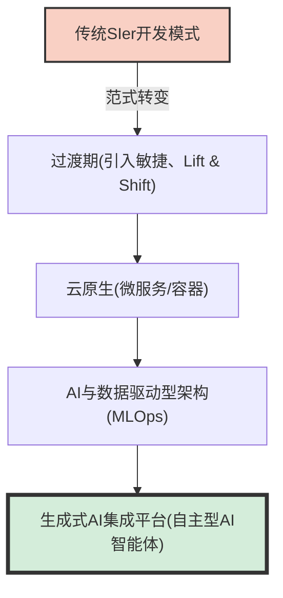
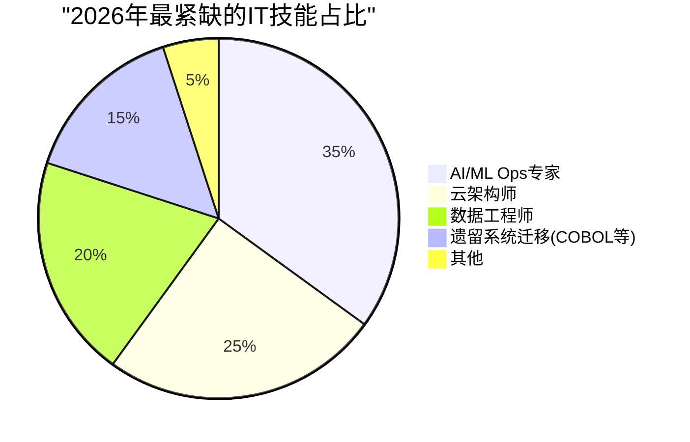
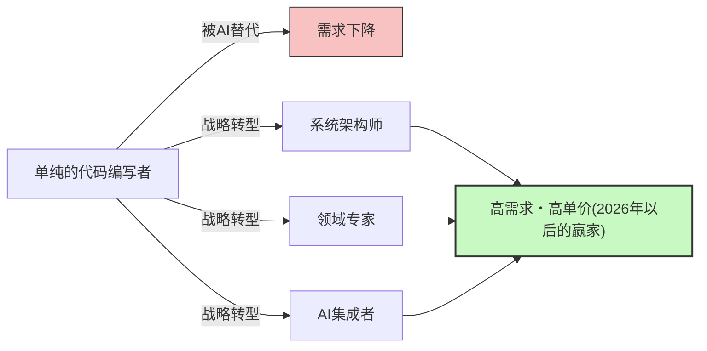

## 引言：“IT人才短缺”这个词的陷阱

在日本的IT行业中，“2025年的悬崖”和“2030年IT人才短缺最多达79万人”等耸人听闻的词汇早已在媒体上满天飞，但我们目前面临的，应该被称为**“2026年问题”**的全新阶段的危机。

经济产业省的报告和各类媒体的报道，都将其笼统地概括为“IT工程师极度短缺”。然而，聆听一线最真实的声音，情况要复杂得多。实际上并非“所有人都短缺”。**“企业求之不得的、拥有高级技能的高级工程师”正面临毁灭性的短缺，而另一方面，“零经验或经验尚浅的初级工程师”却陷入供过于求的境地，变得越来越难找工作**，正在发生着强烈的“两极分化”。

本文将深入解析目前IT行业究竟发生了什么，探讨从传统SIer（系统集成商）模式向云原生与AI驱动开发的范式转变、遗留系统的悬崖，以及以GitHub Copilot为代表的生成式AI所带来的颠覆性影响。

---

## 1. 结构性变化：从传统SIer向云原生与AI驱动开发的转型

长期支撑日本IT产业的，是伴随着多重外包结构的SIer（系统集成商）模式。这是一种完全按照说明书写代码、填补测试说明书的所谓“劳动密集型”商业模式。在这里，工程师的价值以“人月”为单位来衡量，前提是只要凑够了人头，项目就能运转起来。

然而，到了2026年的今天，这种模式已经走到了尽头。DX（数字化转型）的本质已从“单纯的IT化”向“商业模式的变革”转移，敏捷性较低的瀑布流开发已无法跟上市场的变化。

现代的开发流程，前提是**云原生**和**AI驱动**。容器化（Docker/Kubernetes）、微服务架构、CI/CD流水线的自动化，早已不再是“特殊技术”，而是“标准基础设施”。



企业寻找的，不再是只会照着说明书写代码的“码农”。而是能够从云基础设施设计到后端实现，甚至着眼于机器学习模型实际运用（MLOps），将业务需求转化为技术架构的人才。在这样需要广泛知识和经验的领域中，仅仅“知道编程语言语法”的人才已经很难创造价值了。

---

## 2. 遗留系统的“悬崖”与数据工程的枯竭

正如“2025年的悬崖”所警告的那样，许多日本企业依然保留着大型机和本地部署的遗留系统（如用COBOL构建的系统）。这些系统经历了长年的修补，已经变成了黑盒，随着负责维护的高级技术人员退休，系统的维持变得极其困难。

另一方面，业务侧却提出了强烈的需求：“希望利用数据构建AI模型，提供个性化的客户体验。”这里存在着致命的鸿沟。**极度短缺的是“数据工程师”，他们能够将本地部署的孤岛化数据，清洗、整合并流水线化为最新AI/ML流水线可以利用的形式**。

### 遗留系统维护成本与现代化的数学模型

在此，让我们考虑一个简单的数学模型，对比维持遗留系统的成本（$C_{legacy}$）与进行现代化（系统更新）的投资及其后续运营成本（$C_{modern}$）。

遗留系统的维护成本逐年增加。原因在于应对技术债导致的故障，以及遗留系统技术人员变得稀缺而引发的人力成本飙升。
设年数为 $t$，则可表示为以下公式：

$$
C_{legacy}(t) = M_0 \times (1 + r)^t + L_0 \times (1 + i)^t
$$

其中，
- $M_0$: 初始维护费用
- $r$: 由技术债引起的维护费用增长率
- $L_0$: 初始遗留系统人才成本
- $i$: 遗留系统人才稀缺引起的人力成本通胀率

另一方面，若进行现代化，虽然需要庞大的初期投资 $I$，但运营成本 $O_m$ 可以通过上云和自动化保持在较低水平，且更容易保持稳定。

$$
C_{modern}(t) = I + O_m \times t
$$

在许多情况下，不出几年（盈亏平衡点），显然就会出现 $C_{legacy}(t) > C_{modern}(t)$ 的情况，但由于市场上不存在足以执行初期投资 $I$ 的“架构师”和“数据工程师”，导致许多企业陷入了 $C_{legacy}$ 的泥沼，这就是2026年的现状。



---

## 3. 生成式AI的颠覆性影响：GitHub Copilot与初级工程师的消失

谈到IT人才短缺，绝对绕不开的是**生成式AI（Generative AI）的崛起**。GitHub Copilot、Cursor、ChatGPT（GPT-4o和O1系列）等工具，从根本上改变了软件开发的生产力。

一直以来，常见的团队构成是高级工程师将时间花在复杂的设计和代码审查上，而将简单的CRUD（增、删、改、查）处理、样板代码（常规代码）以及编写测试代码等任务交给（委托给）初级工程师。

然而现在，这些“原本由初级工程师负责的任务”的90%，生成式AI都能在几秒到几分钟内高精度地生成。结果导致了什么？**企业失去了雇佣初级工程师的理由。**

### 生成式AI带来的生产力乘数变化

让我们用数学公式来表示引入AI前后开发团队的总生产力。

假设基础生产力为 $P$。
引入生成式AI带来的高级工程师生产力提升率为 $\alpha_{senior}$，初级工程师的生产力提升率为 $\alpha_{junior}$。

$$
\text{Total Output}_{pre} = N_{senior} \times P_{senior} + N_{junior} \times P_{junior}
$$

$$
\text{Total Output}_{post} = N_{senior} \times P_{senior} \times (1 + \alpha_{senior}) + N_{junior} \times P_{junior} \times (1 + \alpha_{junior})
$$

乍一看，初级工程师的生产力似乎也提高了。但在实际开发一线，**“验证AI输出代码的合理性、将其集成到整个系统中、判断是否存在安全隐患”的能力**是不可或缺的。初级工程师恰恰缺乏这种能力（上下文理解能力和架构设计能力）。

结果是，高级工程师将AI作为“超级优秀的助手（可以无限工作的初级工程师）”熟练运用，生产力飙升了 $2 \sim 3$ 倍（$\alpha_{senior} \approx 2.0$）。相比之下，基础不扎实的初级工程师使用AI，虽然代码表面上能跑，却会量产出背负大量技术债的意大利面条式代码，反而导致代码审查成本增加（甚至出现实质上 $\alpha_{junior} < 0$ 的情况）。

因此，企业意识到，与其“雇佣3名月薪30万日元的初级工程师”，不如“雇佣1名月薪120万日元的高级工程师（熟练使用AI）”，风险极低且绩效极高。这就是“人才短缺”的真相。完全短缺的是“能够熟练运用AI的高级工程师”。

```mermaid
xychart-beta
    title "初级与高级人才招聘需求的两极分化(2021-2026)"
    x-axis ["2021", "2022", "2023", "2024", "2025", "2026"]
    y-axis "需求倍率" 0.0 --> 10.0
    line ["高级(架构师/MLOps等)"] [3.0, 3.5, 4.2, 5.8, 7.5, 9.2]
    line ["初级(无经验/1〜2年经验)"] [2.5, 2.2, 1.8, 1.2, 0.8, 0.3]
```

---

## 4. 超越提示词工程：真正需要的技能是什么？

那么，在接下来的时代里，所需的IT人才是怎样的存在呢？认为“只要精通提示词工程（Prompt Engineering）就可以了”未免为时过早。随着AI模型的进化，用自然语言发出指令的技术正在变得平易近人，日益商品化。

一线的真实情况是，现在真正需要的是能够覆盖以下三个领域的人才。

### A. 领域驱动设计（DDD）与业务建模
AI能够写代码，但它无法“理清复杂的业务逻辑，找出软件的限界上下文（Bounded Context），并设计合适的数据模型”。深入理解客户的领域（业务范围），并将其翻译成技术语言的“领域驱动设计（DDD）”技能，在AI时代是最具价值的技能之一。

### B. 架构与非功能性需求设计
系统的可用性、可扩展性、安全性、性能等“非功能性需求”，AI是不会自动为你优化的。“应该组合哪些云服务？”“微服务之间的通信协议如何设定？”“数据库的事务边界画在哪里？”——这类架构的决策，依然依赖于人类高度的经验和直觉。

### C. MLOps与数据流水线构建
为了在生产环境中持续运用生成式AI和机器学习模型，“MLOps”的概念变得越来越重要。模型漂移（精度下降）的监控、持续训练的流水线化、GPU资源的优化等，拥有处于软件工程与数据科学交叉点技能的人才，正处于供不应求的状态。

---

## 5. 工程师的生存战略：为了在2026年以后生存下去

在这样的形势下，我们工程师应该如何规划自己的职业生涯呢？特别是对于经验尚浅的工程师来说，情况可能显得令人绝望。但是，只要战略得当，突破口是完全存在的。

### 战略1：目标成为“AI编排者”
不要只做单一语言或框架的专家，而是要磨炼自己成为“编排者（Orchestrator）”的能力，能够组合多个AI工具和智能体，构建整个系统。你需要减少自己亲自动手写代码的时间，把AI生成的组件拼接起来，拥有俯瞰整个架构的“高维视角”。

### 战略2：获取领域知识
除了技术技能，还要掌握特定行业（如金融、医疗、物流等）深厚的领域知识。熟知业务流程痛点的工程师，在提出技术解决方案时，拥有AI无法模仿的强大说服力。把“HOW（怎么做）”交给AI，将焦点放在“WHAT（做什么）”和“WHY（为什么做）”上。

### 战略3：软技能与利益相关者管理
在大型系统开发中，说到底“人际关系的建立”和“期望值管理”往往决定了项目的成败。与客户进行需求定义、团队内部的引导、在复杂决策上达成共识等“软技能（Human Skills）”，是AI最难替代的领域。以技术为基础，同时又擅长沟通的人才，在未来将受到进一步的重视。



---

## 结论：与其恐惧，不如乘风破浪

“2026年问题”及其伴随的IT人才短缺的真实情况，并不是单纯的“人头不够”，而是“由于所需技能发生剧烈变化而导致的供需错配”。相信大家已经明白了这一点。

遗留系统的重压、数据工程师的枯竭，以及生成式AI带来的范式转变。这些浪潮对于传统型工程师来说是威胁，但对于那些能够拥抱变化、不断更新自身技能树的人来说，这也是前所未有的巨大机遇。

AI并不会抢走我们的工作，它只是我们用来专注于更高级、更具创造性工作的工具。从编写代码这种“重复劳动”中解放出来，专注于系统的“设计”和业务的“价值创造”。这就是在2026年及以后的IT行业中生存并走向繁荣的唯一途径。

现在正是重新审视自身职业规划，向着下一个范式转变掌舵的时候。
你准备好对自身进行“现代化”升级了吗？
