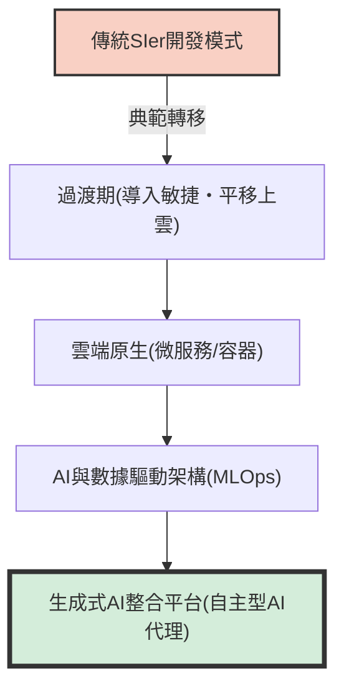
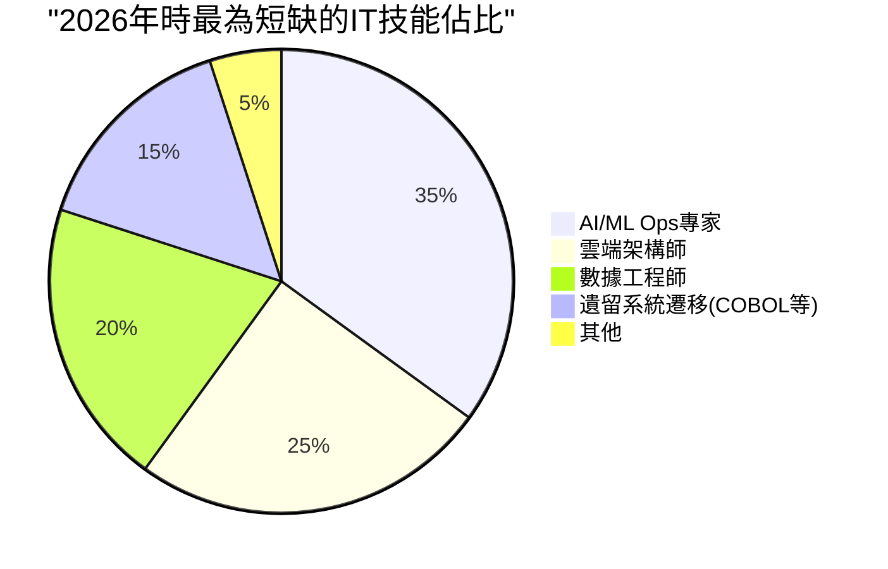
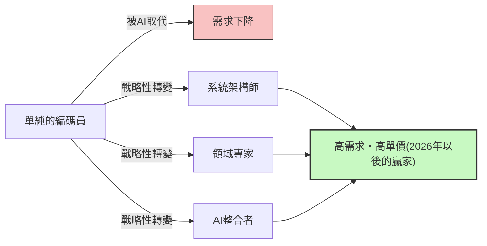

## 前言：「IT人才短缺」這個詞語的陷阱

在日本的IT業界中，像「2025年的懸崖」或「2030年IT人才短缺最高達79萬人」這類聳動的詞語在媒體上滿天飛已經很久了，但現在我們所面臨的是應該被稱為**「2026年問題」**的全新階段危機。

在經濟產業省的報告或各種媒體的報導中，總是把情況一概而論為「IT工程師極度短缺」。然而，如果去聽聽現場真實的聲音，事態其實稍微複雜一些。實際上並不是「每種人才都短缺」。**「企業極度渴望擁有高階技能的資深工程師」呈現毀滅性的短缺，但另一方面，「無經驗或經驗尚淺的初階工程師」卻陷入供過於求的狀態，變得越來越難找到工作**，這種強烈的「兩極化」現象正在發生。

這篇文章將深入探討目前IT業界實際正在發生的事情、從傳統的SIer（系統整合商）模式向雲端原生及AI驅動開發的典範轉移、遺留系統的懸崖，以及以GitHub Copilot為代表的生成式AI所帶來的破壞性影響。

---

## 1. 結構性變化：從傳統SIer轉向雲端原生與AI驅動開發

長年支撐日本IT產業的，是伴隨著多重外包結構的SIer模式。按照規格書寫程式碼、填寫測試規格書，這也就是所謂的「勞力密集型」商業模式。在這裡，工程師的價值是以「人月」為單位來衡量，存在著只要人數湊齊就能讓專案運轉的預設前提。

然而到了2026年的現在，這種模式已經面臨極限。DX（數位轉型）的本質已經從「單純的IT化」轉移到「商業模式的變革」，缺乏敏捷性的瀑布式開發已經無法跟上市場的變化。

現代的開發流程是以**雲端原生**以及**AI驅動**為前提。容器化（Docker/Kubernetes）、微服務架構、CI/CD流水線的自動化，已經不再是「特別的技術」，而是「標準的基礎設施」。



企業所追求的，不再是只會把給定的規格書寫成程式碼的「編碼員（Coder）」。他們需要的是能夠看見從雲端基礎設施設計、後端實作，甚至到機器學習模型實際上線運作（MLOps）的整個過程，並能將業務需求轉化為技術架構的人才。在這種需要廣泛知識與經驗的領域中，僅僅「知道程式語言語法」的人才已經很難創造出價值。

---

## 2. 遺留系統的「懸崖」與數據工程領域的枯竭

正如「2025年的懸崖」所警告的那樣，許多日本企業依然背負著大型主機或地端部署的遺留系統（例如用COBOL建構的系統）。這些系統經過長年的修改已經變成了黑盒子，隨著負責維護的資深人員屆齡退休，維持這些系統變得極為困難。

另一方面，業務端又提出了強烈的需求：「希望活用數據來建構AI模型，提供個人化的顧客體驗」。這裡存在著一個致命的落差。**能夠將地端孤島化的數據，進行清理、整合、管線化，變成最新AI/ML流水線可以使用形式的「數據工程師」正處於壓倒性的短缺狀態**。

### 遺留系統維持成本與現代化的數學模型

在這裡，讓我們思考一個簡單的數學模型，用來比較維持遺留系統的成本（$C_{legacy}$）與現代化（更新）所需的投資及之後的營運成本（$C_{modern}$）。

遺留系統的維持成本會逐年增加。原因是應對技術債的故障排除，以及遺留系統技術人員稀缺導致的人事成本高漲。
若將年數設為 $t$，可以表示如下：

$$
C_{legacy}(t) = M_0 \times (1 + r)^t + L_0 \times (1 + i)^t
$$

這裡，
- $M_0$: 初期的維護費用
- $r$: 因技術債造成的維護費用增加率
- $L_0$: 初期的遺留系統人才成本
- $i$: 因遺留系統人才稀缺造成的人事成本通貨膨脹率

另一方面，若進行現代化，雖然需要龐大的初期投資 $I$，但營運成本 $O_m$ 可以透過雲端化和自動化壓低，並且容易保持穩定。

$$
C_{modern}(t) = I + O_m \times t
$$

在多數情況下，很明顯在幾年內（損益兩平點）就會變成 $C_{legacy}(t) > C_{modern}(t)$，但是由於市場上不存在能夠執行初期投資 $I$ 的「架構師」和「數據工程師」，導致許多企業正沉淪在 $C_{legacy}$ 的泥淖中，這就是2026年的現狀。



---

## 3. 生成式AI的破壞性影響：GitHub Copilot與初階工程師的消失

在談論IT人才短缺時絕對無法忽略的，就是**生成式AI（Generative AI）的崛起**。GitHub Copilot、Cursor、ChatGPT（GPT-4o或O1系列）等工具，從根本上改變了軟體開發的生產力。

過去一般的團隊組成是，資深工程師將時間花在複雜的設計與程式碼審查上，並將單純的CRUD（新增、讀取、更新、刪除）處理、樣板程式碼（Boilerplate）、測試程式碼的撰寫等任務交給（委任給）初階工程師。

然而現在，這些「曾經由初階工程師負責的任務」有9成都能由生成式AI在幾秒到幾分鐘內，以極高的精確度生成。結果發生了什麼事？**企業失去了雇用初階工程師的理由。**

### 生成式AI帶來的生產力乘數變化

我們試着用數學公式來表示導入AI前後開發團隊的總生產力。

假設基礎生產力為 $P$。
導入生成式AI後資深工程師的生產力提升率為 $\alpha_{senior}$，初階工程師的生產力提升率為 $\alpha_{junior}$。

$$
\text{Total Output}_{pre} = N_{senior} \times P_{senior} + N_{junior} \times P_{junior}
$$

$$
\text{Total Output}_{post} = N_{senior} \times P_{senior} \times (1 + \alpha_{senior}) + N_{junior} \times P_{junior} \times (1 + \alpha_{junior})
$$

乍看之下初階工程師的生產力似乎也提升了。但在實際現場中，**「驗證AI輸出程式碼的妥當性、將其整合到整個系統中，並判斷是否存在安全隱患」的能力**是不可或缺的。初階工程師缺乏這種能力（理解上下文的能力和架構設計能力）。

結果，資深工程師將AI作為「超級優秀的助手（無限工作的初階工程師）」來熟練使用，使生產力飆升了 $2 \sim 3$ 倍（$\alpha_{senior} \approx 2.0$）。相對地，缺乏基礎能力的初階工程師使用AI時，反而會大量產出看似能動卻背負大量技術債的義大利麵條式程式碼（Spaghetti code），導致審查成本增加（甚至有實質上 $\alpha_{junior} < 0$ 的情況）。

其結果是，企業發現比起「花月薪30萬日圓雇用3名初階工程師」，「花月薪120萬日圓雇用1名（會用AI的）資深工程師」的風險要低得多且績效高出許多。這就是「人才短缺」的真面目。是「能夠熟練使用AI的資深工程師」完全不夠。

```mermaid
xychart-beta
    title "初階層與資深層的求職需求兩極化(2021-2026)"
    x-axis ["2021", "2022", "2023", "2024", "2025", "2026"]
    y-axis "求才倍率" 0.0 --> 10.0
    line ["資深(架構師/MLOps等)"] [3.0, 3.5, 4.2, 5.8, 7.5, 9.2]
    line ["初階(無經驗/經驗1〜2年)"] [2.5, 2.2, 1.8, 1.2, 0.8, 0.3]
```

---

## 4. 超越提示工程（Prompt Engineering）：真正需要的技能是什麼？

那麼，在未來的時代中所需要的IT人才究竟是怎樣的存在呢？如果認為「只要把提示工程學到極致就好」，那就言之過早了。使用自然語言下達指令的技術，會隨著AI模型的進化而變得簡單，且商品化（Commoditization）正在加速。

作為現場的真實情況，現在真正被需要的是能夠涵蓋以下3個領域的人才。

### A. 領域驅動設計（DDD）與業務建模
AI可以寫程式碼，但是它無法「解開業務複雜的規格，找出軟體的限界上下文（Bounded Context），並設計出適當的數據模型」。深入理解客戶的領域（業務領域），並將其翻譯成技術語言的「領域驅動設計（DDD）」技能，是AI時代中最具價值的技能之一。

### B. 架構與非功能需求的設計
系統的高可用性、可擴展性、安全性、效能等「非功能需求」，並不是AI會自動為你最佳化的東西。「應該組合哪些雲端服務？」、「微服務間的通訊協定該怎麼辦？」、「資料庫的交易邊界該劃在哪裡？」這類架構上的決策，依然仰賴高度的人類經驗與直覺。

### C. MLOps與數據管線建構
為了在正式環境中持續運作生成式AI或機器學習模型，「MLOps」的概念變得越來越重要。監控模型漂移（精確度下降）、持續訓練的管線化、GPU資源的最佳化等，處於軟體工程與數據科學交匯點的這些技能，擁有這些技能的人才正處於供不應求的狀態。

---

## 5. 工程師的生存戰略：為了在2026年之後生存下去

在這樣的狀況下，我們工程師應該如何建立自己的職涯呢？特別是對於經驗尚淺的工程師來說，情況看起來可能令人絕望。但是，只要有好的戰略，就絕對有突破口。

### 戰略1: 以成為「AI協調者（Orchestrator）」為目標
不要成為單一語言或框架的專家，而是要磨練組合多個AI工具或代理來建構整個系統的「協調者」能力。必須減少自己動手寫程式碼的時間，將AI寫出的元件連接起來，擁有俯瞰整體架構的「更高一層視角」。

### 戰略2: 獲得領域知識
不只是技術技能，還要擁有特定產業（如金融、醫療、物流等）深度的領域知識。熟知業務流程痛點的工程師，在提出技術解決方案時，會擁有AI無法模仿的強大說服力。將「HOW（如何製作）」交給AI，而將焦點放在「WHAT（製作什麼）」與「WHY（為什麼製作）」上。

### 戰略3: 軟實力與利害關係人管理
在大規模的系統開發中，說到底「人際關係的建立」和「期望值控制」才是決定專案成敗的關鍵。與客戶定義需求、團隊內的引導（Facilitation）、複雜決策的共識凝聚等「人際技能（Human Skills）」，是AI最難以取代的領域。在以技術為基礎的同時，具備優秀溝通能力的人才，今後將會更加受到重視。



---

## 結論：不要害怕，而是乘浪而行

我想大家已經明白，「2026年問題」以及隨之而來的IT人才短缺實態，並非單純的「人數不足」，而是「被要求的技能發生劇烈變化所導致的錯位（Mismatch）」。

遺留系統的重壓、數據工程師的枯竭，以及生成式AI帶來的典範轉移。這些浪潮對傳統型工程師來說是威脅，但對於能夠接受變化、更新自身技能組合的人來說，也是前所未有的巨大機會。

AI並不是來奪走我們工作的，它只不過是讓我們能夠專注於更高階、更具創造性工作的工具而已。從寫程式這個「作業」中解放出來，將焦點集中在系統的「設計」與業務的「價值創造」上。這就是2026年以後在IT業界生存並繁榮的唯一道路。

現在正是重新審視自己職涯路徑，並為下一個典範轉移掌舵的時候了。
你已經準備好將你自己「現代化」了嗎？
