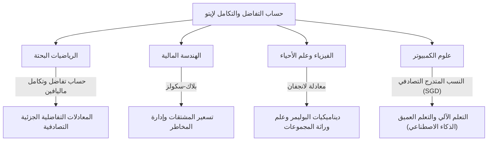

## 1. مقدمة: لغة لوصف عدم اليقين

عالمنا مليء بالأحداث غير المتوقعة وعدم اليقين. من تقلبات أسعار الأسهم وحركة الجسيمات في الهواء إلى تدفق الأنهار وعمليات التعلم في الشبكات العصبية، فإن الظواهر التي تحكمها العشوائية لا تعد ولا تحصى. أداة قوية لوصف وتوقع وتحليل مثل هذه "الحركات العشوائية" بشكل رياضي ودقيق هي **المعادلات التفاضلية التصادفية (SDE)** .

وكان عالم الرياضيات الياباني العظيم **[كيوشي إيتو](https://kenji.blog/p/ito-kiyosi/) ([Kiyosi Ito](https://kenji.blog/p/ito-kiyosi/))** هو من أسس نظرية هذه المعادلات التفاضلية التصادفية وأقام الصرح المعروف باسم **توطئة إيتو (Ito's Lemma)** أو **صيغة إيتو (Ito's Formula)** . في هذا المقال، نتعمق في حلقات حياته وجوهر إنجازاته الرياضية، التي لا تزال لها تأثير هائل ليس فقط على عالم الرياضيات، ولكن أيضًا على الاقتصاد والفيزياء والهندسة.

## 2. حياة [كيوشي إيتو](https://kenji.blog/p/ito-kiyosi/) وخلفيته التاريخية

### 2.1 حياته المبكرة واستيقاظه على الرياضيات

ولد [كيوشي إيتو](https://kenji.blog/p/ito-kiyosi/) في 7 سبتمبر 1915، في مقاطعة إينابي (الآن مدينة إينابي)، في محافظة ميه. تميز في دراسته منذ صغره، ومر عبر المدرسة الثانوية الثامنة (الآن جامعة ناغويا) للالتحاق بقسم الرياضيات في كلية العلوم بجامعة طوكيو الإمبراطورية (الآن جامعة طوكيو).

في ذلك الوقت، في مجتمع الرياضيات الياباني، كان علماء رياضيات عظماء مثل تيجي تاكاغي (مؤسس نظرية مجال الفصل) يجرون أبحاثًا على مستوى عالمي. ومع ذلك، لا تزال نظرية الاحتمالات تُعامل غالبًا على أنها "هرطقة الرياضيات" أو مجرد "مجال تطبيقي"، ولم يتم بعد ترسيخ مكانتها كرياضيات بحتة. ومع ذلك، تأثر إيتو بشدة بكتاب *أسس نظرية الاحتمالات* الذي نشره أندريه كولموغوروف في عام 1933. باستخدام تكامل ليبيج ونظرية القياس، وضع كولموغوروف نظرية الاحتمالات في شكل بديهيات، ووضعها على أساس رياضي صارم.

### 2.2 بحث منعزل في مكتب الإحصاء التابع لمجلس الوزراء ومصاعب زمن الحرب

بعد تخرجه من الجامعة في عام 1938، لم يبق إيتو في الأوساط الأكاديمية ولكنه تولى وظيفة في مكتب الإحصاء التابع لمجلس الوزراء. أثناء أداء واجباته الإحصائية كموظف حكومي، واصل أبحاثه المستقلة في نظرية الاحتمالات خلال وقت فراغه.

مع اشتداد الحرب العالمية الثانية، مما أجبر العديد من العلماء على وقف أبحاثهم، انغمس إيتو في عالم الفكر الخالص. في هذه الفترة تحديدًا حقق اكتشافاته العظيمة. في عام 1942، نشر بحثه الأول الذي أرسى أسس التكامل التصادفي والمعادلات التفاضلية التصادفية. عاش جنبًا إلى جنب مع الخوف من التجنيد العسكري والغارات الجوية، متسلحًا بالورق والقلم فقط، وكان يوسع حدود المعرفة البشرية. هذا البحث المنعزل خلال فترة عمله كموظف سيغير العالم بشكل أساسي في وقت لاحق.

## 3. الإنجازات الرياضية: إنشاء حساب التفاضل والتكامل التصادفي

### 3.1 الحركة البراونية وعدم قابلية الاشتقاق

لفهم جوهر نظرية إيتو، يجب على المرء أولاً أن يتعرف على **الحركة البراونية** . الحركة غير المنتظمة للجسيمات الدقيقة التي اكتشفها عالم النبات روبرت براون في عام 1827 تم تفسيرها لاحقًا فيزيائيًا بواسطة ألبرت أينشتاين (1905) وصياغتها رياضيًا بواسطة نوربرت وينر (1923)، والمعروفة باسم عملية وينر $W_t$.

ومع ذلك، تمتلك عملية وينر خاصية رياضية قاتلة: إنها **"متصلة في كل مكان ولكن غير قابلة للاشتقاق في أي مكان"** . مسارها متعرج لدرجة أنه لا يمكن تحديد "السرعة" (ميل المماس) في أي لحظة معينة. لذلك، لا يمكن تطبيق حساب التفاضل والتكامل العادي لنيوتن أو لايبنيز (نظرية تصف كيف تتغير الدالة استجابة لتغير متناهي الصغر $dt$) على الحركة البراونية.

### 3.2 ولادة تكامل إيتو

لحل هذه المشكلة، قام [كيوشي إيتو](https://kenji.blog/p/ito-kiyosi/) ببناء مفهوم جديد للتكامل. هذا هو **تكامل إيتو** .

$$
\int_0^T f(t, \omega) dW_t(\omega)
$$

هنا، يمثل $dW_t$ الزيادة متناهية الصغر لعملية وينر. أثبت إيتو أنه يمكن تعريف هذا التكامل بدقة للدوال التي لا تعتمد على معلومات مستقبلية (العمليات المتكيفة). هذا جعل من الممكن وصف الأنظمة الديناميكية التي تحتوي على ضوضاء في شكل معادلات تفاضلية.

### 3.3 توطئة إيتو: النظرية الأساسية لحساب التفاضل والتكامل التصادفي

أكبر إنجاز لإيتو هو اكتشاف **توطئة إيتو** ، وهي امتداد لـ "قاعدة السلسلة" في حساب التفاضل والتكامل العادي.

في حساب التفاضل والتكامل العادي، يتم تمثيل تغيير متناهي الصغر $df$ لدالة $f(x)$ حتى حد الدرجة الأولى لمتسلسلة تايلور على النحو التالي $df = f'(x)dx$. ومع ذلك، في عملية تنطوي على تقلبات تصادفية $dW_t$، تكون التقلبات شديدة لدرجة أن حد الدرجة الثانية $(dW_t)^2$ يصبح مهمًا في حدود الوقت $dt$ (خاصية $(dW_t)^2 = dt$).

لنفترض أن عملية تصادفية $X_t$ تتبع المعادلة التفاضلية التصادفية التالية:

$$
dX_t = \mu(X_t, t) dt + \sigma(X_t, t) dW_t
$$

هنا، $\mu$ هو الانجراف (متوسط الاتجاه) و $\sigma$ هو التقلب (شدة التذبذب).
ثم، يتم التعبير عن التغيير المتناهي الصغر لدالة سلسة بدرجة كافية $f(X_t, t)$ على النحو التالي:

$$
\text{صيغة إيتو: } df(X_t, t) = \left( \frac{\partial f}{\partial t} + \mu \frac{\partial f}{\partial x} + \frac{1}{2} \sigma^2 \frac{\partial^2 f}{\partial x^2} \right) dt + \sigma \frac{\partial f}{\partial x} dW_t
$$

$$
\text{حيث } \frac{1}{2} \sigma^2 \frac{\partial^2 f}{\partial x^2} \text{ هو حد إيتو.}
$$

المصطلح الموجود بين الأقواس على الجانب الأيمن من هذه المعادلة هو بالضبط **حد إيتو** . يوضح أن الجمع بين عدم اليقين (التباين $\sigma^2$) وانحناء الدالة (المشتقة الثانية) يؤدي إلى متوسط تأثير دفع (لأعلى أو لأسفل) على النظام بأكمله. إنها نتيجة عميقة وغير بديهية، وتستحق حقًا أن تسمى "صيغة نيوتن-لايبنيز" في نظرية الاحتمالات.

## 4. فلسفة وشخصية [كيوشي إيتو](https://kenji.blog/p/ito-kiyosi/)

### 4.1 "الجمال" في الرياضيات

أحب [كيوشي إيتو](https://kenji.blog/p/ito-kiyosi/) بشدة "الجمال" في أسس الرياضيات. وكثيرًا ما شبه البحث الرياضي بخلق الشعر أو الموسيقى. قال: "النظرية الرياضية الممتازة تكشف البنية البسيطة والجميلة الكامنة وراء الظواهر المعقدة". بالنسبة له، لم تكن المعادلات التفاضلية التصادفية مجرد أدوات حسابية، بل كانت أعمالاً فنية للتعبير عن التناغم العميق في عشوائية العالم الطبيعي.

### 4.2 جنون وول ستريت وحيرته الخاصة

في السبعينيات، نشر فيشر بلاك ومايرون سكولز (اللذان فازا لاحقًا بجائزة نوبل في الاقتصاد) **معادلة بلاك-سكولز** ، والتي استخدمت توطئة إيتو لاشتقاق السعر العادل للخيارات المالية. وأدى هذا إلى ولادة الصناعة الضخمة للهندسة المالية (التمويل الكمي)، وبدأ متداولو وول ستريت جميعهم في تعلم "حساب التفاضل والتكامل لإيتو".

ومع ذلك، كان إيتو نفسه عالم رياضيات بحت لديه اهتمام ضئيل بالاقتصاد أو التمويل. هناك حكاية شهيرة تفيد بأنه في حفل عشاء، عندما تم إبلاغه أن نظرياته تحرك تريليونات الدولارات في وول ستريت، تفاجأ وقال: **"لم يكن لدي أي فكرة على الإطلاق عن استخدام رياضياتي البحتة لكسب المال بهذه الطريقة."** على الرغم من أنه وجد الحقيقة مسلية، إلا أنه حافظ طوال حياته على الموقف القائل بأن اهتمامه يكمن بشكل صارم في "الحقيقة الرياضية".

## 5. التأثيرات المضاعفة على المجالات الأخرى والتطبيقات الحديثة

لا تتخلل نظريات إيتو الهندسة المالية فحسب، بل تتخلل كل مجال من مجالات المجتمع الحديث. يوضح الرسم البياني أدناه كيف انتشر حساب التفاضل والتكامل التصادفي لإيتو.

في السنوات الأخيرة بشكل خاص، عادت نظرية إيتو إلى دائرة الضوء في مجال التعلم الآلي. يعد تحسين عمليات التعلم في التعلم العميق (العملية التي يتم فيها إضافة الضوضاء في النسب المتدرج التصادفي) و **نماذج الانتشار (Diffusion Models)** المستخدمة في الذكاء الاصطناعي لتوليد الصور، تطبيقات مباشرة لنظرية إيتو، وتحل حرفيًا المعادلات التفاضلية التصادفية في الزمن العكسي. تدعم أبحاث [كيوشي إيتو](https://kenji.blog/p/ito-kiyosi/) الأسس الرياضية لثورة الذكاء الاصطناعي الحديثة.

## 6. الخلاصة: جائزة غاوس الأولى وإرث أبدي

في عام 2006، أنشأ المؤتمر الدولي لعلماء الرياضيات (ICM) **جائزة غاوس** لتكريم تطبيق الرياضيات ومساهمتها في المجتمع، واختار [كيوشي إيتو](https://kenji.blog/p/ito-kiyosi/) البالغ من العمر 90 عامًا كأول متلقٍ لها. كان سبب اختياره هو "وضع أسس نظرية المعادلات التفاضلية التصادفية وتطبيقاتها المتنوعة". من النادر تاريخيًا أن يؤدي السعي العميق وراء الرياضيات البحتة إلى مثل هذه التأثيرات الواسعة والعملية على المجتمع البشري.

توفي [كيوشي إيتو](https://kenji.blog/p/ito-kiyosi/) في عام 2008 عن عمر يناهز 93 عامًا، ولكن اسمه محفور إلى الأبد في الكتب المدرسية حول العالم مثل "توطئة إيتو" و"تكامل إيتو". بالنسبة لنا الذين نعيش في عالم غير مؤكد، ستظل الصيغ التي تركها [كيوشي إيتو](https://kenji.blog/p/ito-kiyosi/) هي المنارة الأجمل والأكثر قوة التي تسلط الضوء في الفوضى.
