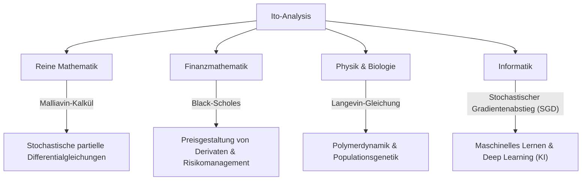

## 1. Einleitung: Eine Sprache zur Beschreibung von Ungewissheit

Unsere Welt ist voll von unvorhersehbaren Ereignissen und Ungewissheiten. Von Schwankungen der Aktienkurse und der Bewegung von Partikeln in der Luft bis hin zur Strömung von Flüssen und den Lernprozessen neuronaler Netze sind Phänomene, die vom Zufall bestimmt werden, unzählig. Ein mächtiges Werkzeug zur mathematisch strengen Beschreibung, Vorhersage und Analyse solcher „zufälligen Bewegungen“ sind **stochastische Differentialgleichungen (SDE)** .

Der japanische Mathematiker, der die Theorie dieser stochastischen Differentialgleichungen begründete und das als **Ito-Lemma** oder **Ito-Formel** bekannte Monument errichtete, ist der große **Kiyosi Ito** . In diesem Artikel werfen wir einen tiefen Blick auf die Episoden seines Lebens und den Kern seiner mathematischen Errungenschaften, die nicht nur auf die mathematische Welt, sondern auch auf die Wirtschaft, Physik und Ingenieurwissenschaften weiterhin einen immensen Einfluss haben.

## 2. Kiyosi Itos Leben und historischer Hintergrund

### 2.1 Frühes Leben und das Erwachen für die Mathematik

Kiyosi Ito wurde am 7. September 1915 im Bezirk Inabe (heute Stadt Inabe) in der Präfektur Mie geboren. Er zeichnete sich schon in jungen Jahren in der Schule aus und ging über die Achte Höhere Schule (heute Universität Nagoya) an das Institut für Mathematik der Naturwissenschaftlichen Fakultät der Kaiserlichen Universität Tokio (heute Universität Tokio).

Zu dieser Zeit führten große Mathematiker wie Teiji Takagi (Begründer der Klassenkörpertheorie) in der japanischen Mathematikergemeinschaft Forschungen auf Weltniveau durch. Die Wahrscheinlichkeitstheorie wurde jedoch oft noch als „Ketzer der Mathematik“ oder lediglich als „angewandtes Gebiet“ behandelt, und ihr Status als reine Mathematik war noch nicht etabliert. Dennoch war Ito tief beeindruckt von den *Grundbegriffen der Wahrscheinlichkeitsrechnung*, die Andrey Kolmogorov 1933 veröffentlichte. Unter Verwendung des Lebesgue-Integrals und der Maßtheorie axiomatisierte Kolmogorov die Wahrscheinlichkeitstheorie und stellte sie auf ein strenges mathematisches Fundament.

### 2.2 Einsame Forschung im statistischen Büro des Kabinetts und Entbehrungen der Kriegszeit

Nach seinem Universitätsabschluss im Jahr 1938 blieb Ito nicht in der Wissenschaft, sondern nahm eine Stelle im statistischen Büro des Kabinetts an. Während er als Beamter seine statistischen Pflichten erfüllte, setzte er seine unabhängige Forschung in der Wahrscheinlichkeitstheorie in seiner Freizeit fort.

Als sich der Zweite Weltkrieg zuspitzte und viele Gelehrte zwang, ihre Forschungen einzustellen, vertiefte sich Ito in die Welt des reinen Denkens. Genau in dieser Zeit machte er seine großen Entdeckungen. 1942 veröffentlichte er seine erste Arbeit, die den Grundstein für die stochastische Integration und stochastische Differentialgleichungen legte. Mit der ständigen Angst vor Einberufung und Luftangriffen konfrontiert und nur mit Papier und Bleistift bewaffnet, verschob er die Grenzen des menschlichen Wissens. Diese einsame Forschung während seiner Zeit als Beamter sollte später die Welt grundlegend verändern.

## 3. Mathematische Errungenschaften: Die Erschaffung der stochastischen Analysis

### 3.1 Brownsche Bewegung und Nicht-Differenzierbarkeit

Um den Kern von Itos Theorie zu verstehen, muss man zunächst die **Brownsche Bewegung** kennen. Die unregelmäßige Bewegung feiner Partikel, die der Botaniker Robert Brown 1827 entdeckte, wurde später physikalisch von Albert Einstein (1905) erklärt und mathematisch von Norbert Wiener (1923) als der Wiener-Prozess $W_t$ formuliert.

Der Wiener-Prozess hatte jedoch eine fatale mathematische Eigenschaft: Er ist **„überall stetig, aber nirgends differenzierbar“** . Seine Flugbahn ist so gezackt, dass die „Geschwindigkeit“ (die Steigung der Tangente) in keinem gegebenen Moment definiert werden kann. Daher konnte die gewöhnliche Newtonsche oder Leibnizsche Infinitesimalrechnung (eine Theorie, die beschreibt, wie sich eine Funktion als Reaktion auf eine infinitesimale Änderung $dt$ ändert) nicht auf die Brownsche Bewegung angewendet werden.

### 3.2 Die Geburt des Ito-Integrals

Um dieses Problem zu lösen, konstruierte Kiyosi Ito ein neues Integrationskonzept. Dies ist das **Ito-Integral** .

$$
\int_0^T f(t, \omega) dW_t(\omega)
$$

Hierbei stellt $dW_t$ das infinitesimale Inkrement des Wiener-Prozesses dar. Ito bewies, dass dieses Integral für Funktionen streng definiert werden kann, die nicht von zukünftigen Informationen abhängen (adaptierte Prozesse). Dies machte es möglich, dynamische Systeme, die Rauschen enthalten, in Form von Differentialgleichungen zu beschreiben.

### 3.3 Das Ito-Lemma: Der Hauptsatz der stochastischen Analysis

Itos größte Errungenschaft ist die Entdeckung des **Ito-Lemmas** , einer Erweiterung der „Kettenregel“ in der gewöhnlichen Infinitesimalrechnung.

In der gewöhnlichen Infinitesimalrechnung wird eine infinitesimale Änderung $df$ einer Funktion $f(x)$ bis zum Term erster Ordnung der Taylor-Entwicklung als $df = f'(x)dx$ dargestellt. In einem Prozess mit stochastischen Schwankungen $dW_t$ sind die Schwankungen jedoch so stark, dass der Term zweiter Ordnung $(dW_t)^2$ in der Größenordnung der Zeit $dt$ signifikant wird (die Eigenschaft $(dW_t)^2 = dt$).

Angenommen, ein stochastischer Prozess $X_t$ folgt der stochastischen Differentialgleichung:

$$
dX_t = \mu(X_t, t) dt + \sigma(X_t, t) dW_t
$$

Hierbei ist $\mu$ die Drift (durchschnittlicher Trend) und $\sigma$ die Volatilität (Intensität der Schwankung).
Dann wird die infinitesimale Änderung einer ausreichend glatten Funktion $f(X_t, t)$ wie folgt ausgedrückt:

$$
\text{Ito-Formel: } df(X_t, t) = \left( \frac{\partial f}{\partial t} + \mu \frac{\partial f}{\partial x} + \frac{1}{2} \sigma^2 \frac{\partial^2 f}{\partial x^2} \right) dt + \sigma \frac{\partial f}{\partial x} dW_t
$$

$$
\text{wobei } \frac{1}{2} \sigma^2 \frac{\partial^2 f}{\partial x^2} \text{ der Ito-Term ist.}
$$

Der Term in der Klammer auf der rechten Seite dieser Gleichung ist genau der **Ito-Term** . Er zeigt, dass die Kombination aus Unsicherheit (Varianz $\sigma^2$) und der Krümmung der Funktion (zweite Ableitung) einen durchschnittlichen Aufwärts- (oder Abwärts-) Druckeffekt auf das gesamte System bewirkt. Dies ist ein tiefgreifendes, kontraintuitives Ergebnis und verdient wahrlich die Bezeichnung „Newton-Leibniz-Formel“ der Wahrscheinlichkeitstheorie.

## 4. Kiyosi Itos Philosophie und Persönlichkeit

### 4.1 „Schönheit“ in der Mathematik

Kiyosi Ito liebte zutiefst die „Schönheit“ an der Basis der Mathematik. Er verglich die mathematische Forschung oft mit dem Erschaffen von Poesie oder Musik. „Ein exzellenter mathematischer Satz offenbart die einfache und schöne Struktur hinter komplexen Phänomenen“, sagte er. Für ihn waren stochastische Differentialgleichungen nicht nur Rechenwerkzeuge, sondern Kunstwerke, um die Harmonie tief im Zufall der natürlichen Welt auszudrücken.

### 4.2 Der Wall-Street-Wahn und seine eigene Verwirrung

In den 1970er Jahren veröffentlichten Fischer Black und Myron Scholes (die später den Nobelpreis für Wirtschaftswissenschaften gewannen) die **Black-Scholes-Gleichung** , die das Ito-Lemma nutzte, um den fairen Preis von Finanzoptionen abzuleiten. Dies brachte die riesige Industrie der Finanzmathematik (Quantitative Finance) hervor, und die Händler an der Wall Street begannen alle, die „Ito-Analysis“ zu lernen.

Ito selbst war jedoch ein reiner Mathematiker, der sich wenig für Wirtschaft oder Finanzen interessierte. Es gibt eine berühmte Anekdote, dass er bei einer Dinnerparty überrascht war, als man ihm mitteilte, dass seine Theorien Billionen von Dollar an der Wall Street bewegten, und sagte: **„Ich hatte absolut keine Ahnung, dass meine reine Mathematik benutzt wurde, um auf diese Weise Geld zu verdienen.“** Obwohl er diese Tatsache amüsant fand, behielt er sein ganzes Leben lang die Haltung bei, dass sein Interesse strikt der „mathematischen Wahrheit“ galt.

## 5. Welleneffekte auf andere Bereiche und moderne Anwendungen

Itos Theorien durchdringen nicht nur die Finanzmathematik, sondern jeden Bereich der modernen Gesellschaft. Das folgende Diagramm veranschaulicht, wie sich Itos stochastische Analysis ausgebreitet hat.

Besonders in den letzten Jahren rückt Itos Theorie im Bereich des maschinellen Lernens wieder ins Rampenlicht. Die Optimierung von Lernprozessen im Deep Learning (der Prozess, bei dem Rauschen im stochastischen Gradientenabstieg hinzugefügt wird) und die in der Bildgenerierungs-KI verwendeten **Diffusionsmodelle (Diffusion Models)** sind direkte Anwendungen von Itos Theorie, da sie im wahrsten Sinne des Wortes stochastische Differentialgleichungen in umgekehrter Zeit lösen. Kiyosi Itos Forschung stützt genau die mathematischen Grundlagen der modernen KI-Revolution.

## 6. Fazit: Der erste Gauss-Preis und ein ewiges Vermächtnis

Im Jahr 2006 stiftete der Internationale Mathematikerkongress (ICM) den **Gauss-Preis** , um die Anwendung und den Beitrag der Mathematik zur Gesellschaft zu ehren, und wählte den 90-jährigen Kiyosi Ito als ersten Empfänger. Der Grund für seine Wahl war die „Grundlegung der Theorie der stochastischen Differentialgleichungen und ihrer vielfältigen Anwendungen“. Es ist historisch selten, dass ein tiefgreifendes Streben nach reiner Mathematik zu derart weitreichenden und praktischen Auswirkungen auf die menschliche Gesellschaft führt.

Kiyosi Ito verstarb 2008 im Alter von 93 Jahren, aber sein Name ist für immer als „Ito-Lemma“ und „Ito-Integral“ in den Lehrbüchern auf der ganzen Welt verankert. Für uns, die wir in einer unsicheren Welt leben, werden die von Kiyosi Ito hinterlassenen Formeln der schönste und stärkste Leuchtturm bleiben, der sein Licht in das Chaos wirft.
