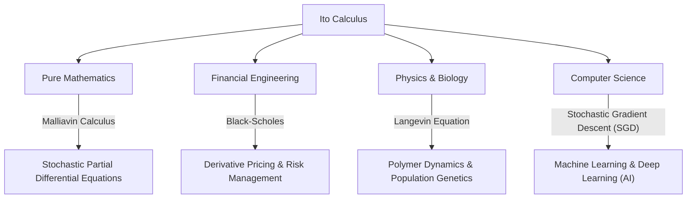

## 1. Introduction: A Language to Describe Uncertainty

Our world is filled with unpredictable events and uncertainty. From fluctuations in stock prices and the movement of particles in the air to the flow of rivers and the learning processes of neural networks, phenomena governed by randomness are innumerable. A powerful tool for mathematically and rigorously describing, predicting, and analyzing such "random movements" is **Stochastic Differential Equations (SDE)** .

The Japanese mathematician who established the theory of these stochastic differential equations and erected the monumental pillar known as **Ito's Lemma** or **Ito's Formula** is the great **[Kiyosi Ito](https://kenji.blog/p/ito-kiyosi/)** . In this article, we delve deep into the episodes of his life and the core of his mathematical achievements, which continue to have an immense impact not only on the mathematical world but also on economics, physics, and engineering.

## 2. [Kiyosi Ito](https://kenji.blog/p/ito-kiyosi/)'s Life and Historical Background

### 2.1 Early Life and Awakening to Mathematics

[Kiyosi Ito](https://kenji.blog/p/ito-kiyosi/) was born on September 7, 1915, in Inabe District (now Inabe City), Mie Prefecture. Excelling in academics from a young age, he advanced through the Eighth Higher School (now Nagoya University) to the Department of Mathematics in the Faculty of Science at Tokyo Imperial University (now the University of Tokyo).

At that time in the Japanese mathematical community, great mathematicians like Teiji Takagi (founder of Class Field Theory) were conducting world-class research. However, probability theory was still often treated as the "heretic of mathematics" or merely an "applied field," and its status as pure mathematics was not yet established. Nevertheless, Ito was profoundly struck by *Foundations of the Theory of Probability*, published by Andrey Kolmogorov in 1933. Using Lebesgue integration and measure theory, Kolmogorov axiomatized probability theory, placing it on a rigorous mathematical foundation.

### 2.2 Solitary Research at the Cabinet Statistics Bureau and Wartime Hardships

Upon graduating from the university in 1938, Ito did not remain in academia but took a job at the Cabinet Statistics Bureau. While performing statistical duties as a bureaucrat, he continued his independent research in probability theory during his off-hours.

As World War II intensified, forcing many scholars to halt their research, Ito immersed himself in the world of pure thought. It was precisely during this period that he made his great discoveries. In 1942, he published his first paper laying the foundations for stochastic integration and stochastic differential equations. Living alongside the fear of military draft and air raids, relying only on paper and pencil, he was pushing the boundaries of human knowledge. This solitary research during his time as a bureaucrat would later fundamentally change the world.

## 3. Mathematical Achievements: The Creation of Stochastic Calculus

### 3.1 Brownian Motion and Non-Differentiability

To understand the core of Ito's theory, one must first learn about **Brownian Motion** . The irregular movement of fine particles discovered by botanist Robert Brown in 1827 was later physically explained by Albert Einstein (1905) and mathematically formulated by Norbert Wiener (1923), known as the Wiener process $W_t$.

However, the Wiener process had a fatal mathematical property: it is **"continuous everywhere but differentiable nowhere."** Its trajectory is so jagged that the "velocity" (the slope of the tangent) at any given moment cannot be defined. Therefore, standard Newtonian or Leibnizian calculus (a theory describing how a function changes in response to an infinitesimal change $dt$) could not be applied to Brownian motion.

### 3.2 The Birth of the Ito Integral

To solve this problem, [Kiyosi Ito](https://kenji.blog/p/ito-kiyosi/) constructed a new concept of integration. This is the **Ito Integral** .

$$
\int_0^T f(t, \omega) dW_t(\omega)
$$

Here, $dW_t$ represents the infinitesimal increment of the Wiener process. Ito proved that this integral could be strictly defined for functions that do not depend on future information (adapted processes). This made it possible to describe dynamic systems containing noise in the form of differential equations.

### 3.3 Ito's Lemma: The Fundamental Theorem of Stochastic Calculus

Ito's greatest achievement is the discovery of **Ito's Lemma** , an extension of the "chain rule" in standard calculus.

In ordinary calculus, an infinitesimal change $df$ of a function $f(x)$ is represented up to the first-order term of the Taylor expansion as $df = f'(x)dx$. However, in a process involving stochastic fluctuations $dW_t$, the fluctuations are so severe that the second-order term $(dW_t)^2$ becomes significant on the order of time $dt$ (the property that $(dW_t)^2 = dt$).

Suppose a stochastic process $X_t$ follows the stochastic differential equation:

$$
dX_t = \mu(X_t, t) dt + \sigma(X_t, t) dW_t
$$

Here, $\mu$ is the drift (average trend) and $\sigma$ is the volatility (intensity of fluctuation).
Then, the infinitesimal change of a sufficiently smooth function $f(X_t, t)$ is expressed as:

$$
\text{Ito's Formula: } df(X_t, t) = \left( \frac{\partial f}{\partial t} + \mu \frac{\partial f}{\partial x} + \frac{1}{2} \sigma^2 \frac{\partial^2 f}{\partial x^2} \right) dt + \sigma \frac{\partial f}{\partial x} dW_t
$$

$$
\text{where } \frac{1}{2} \sigma^2 \frac{\partial^2 f}{\partial x^2} \text{ is the Ito term.}
$$

The term on the right side of this equation is precisely the **Ito term** . It shows that the combination of uncertainty (variance $\sigma^2$) and the curvature of the function (second derivative) brings about an average upward (or downward) pushing effect on the entire system. This is a profound, counter-intuitive result, and truly deserves to be called the "Newton-Leibniz formula" in probability theory.

## 4. [Kiyosi Ito](https://kenji.blog/p/ito-kiyosi/)'s Philosophy and Personality

### 4.1 "Beauty" in Mathematics

[Kiyosi Ito](https://kenji.blog/p/ito-kiyosi/) deeply loved the "beauty" at the foundation of mathematics. He often likened mathematical research to the creation of poetry or music. "An excellent mathematical theorem reveals the simple and beautiful structure behind complex phenomena," he said. For him, stochastic differential equations were not just calculation tools, but works of art to express the harmony deep within the randomness of the natural world.

### 4.2 Wall Street Frenzy and His Own Bewilderment

In the 1970s, Fischer Black and Myron Scholes (who later won the Nobel Prize in Economics) published the **Black-Scholes equation** , which used Ito's Lemma to derive the fair price of financial options. This birthed the colossal industry of financial engineering (quantitative finance), and Wall Street traders all began learning "Ito Calculus."

However, Ito himself was a pure mathematician with little interest in economics or finance. There is a famous anecdote that at a dinner party, when informed that his theories were moving trillions of dollars on Wall Street, he was surprised and said, **"I had absolutely no idea that my pure mathematics was being used to make money like that."** While he found the fact amusing, he maintained throughout his life the stance that his interest lay strictly in "mathematical truth."

## 5. Ripple Effects on Other Fields and Modern Applications

Ito's theories permeate not just financial engineering, but every field of modern society. The diagram below illustrates how Ito's stochastic calculus has rippled outward.

Particularly in recent years, Ito's theory is back in the spotlight in the field of machine learning. The optimization of learning processes in deep learning (the process where noise is added in stochastic gradient descent) and the **Diffusion Models** used in image generation AI are direct applications of Ito's theory, literally solving stochastic differential equations in reverse time. [Kiyosi Ito](https://kenji.blog/p/ito-kiyosi/)'s research supports the very mathematical foundations of the modern AI revolution.

## 6. Conclusion: The First Gauss Prize and an Eternal Legacy

In 2006, the International Congress of Mathematicians (ICM) established the **Gauss Prize** to honor the application and contribution of mathematics to society, and selected the 90-year-old [Kiyosi Ito](https://kenji.blog/p/ito-kiyosi/) as its inaugural recipient. The reason for his selection was "laying the foundations of the theory of stochastic differential equations and its diverse applications." It is historically rare for a deep pursuit of pure mathematics to result in such broad and practical impacts on human society.

[Kiyosi Ito](https://kenji.blog/p/ito-kiyosi/) passed away in 2008 at the age of 93, but his name is forever etched in textbooks around the world as "Ito's Lemma" and "Ito Integral." For us living in an uncertain world, the formulas left by [Kiyosi Ito](https://kenji.blog/p/ito-kiyosi/) will remain the most beautiful and powerful lighthouse shining a light into the chaos.
