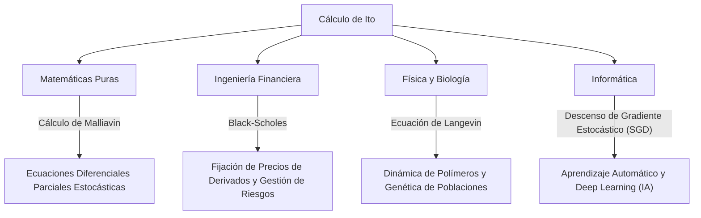

## 1. Introducción: Un lenguaje para describir la incertidumbre

Nuestro mundo está lleno de eventos impredecibles e incertidumbre. Desde las fluctuaciones en los precios de las acciones y el movimiento de las partículas en el aire hasta el flujo de los ríos y los procesos de aprendizaje de las redes neuronales, los fenómenos gobernados por la aleatoriedad son innumerables. Una herramienta poderosa para describir, predecir y analizar de forma matemática y rigurosa estos "movimientos aleatorios" son las **Ecuaciones Diferenciales Estocásticas (EDE)** .

Y fue el gran matemático japonés **[Kiyosi Ito](https://kenji.blog/es/p/ito-kiyosi/)** quien estableció la teoría de estas ecuaciones diferenciales estocásticas y erigió el monumento conocido como el **Lema de Ito** o la **Fórmula de Ito** . En este artículo, profundizamos en los episodios de su vida y en el núcleo de sus logros matemáticos, que siguen teniendo un impacto inmenso no solo en el mundo matemático, sino también en la economía, la física y la ingeniería.

## 2. La vida y el contexto histórico de [Kiyosi Ito](https://kenji.blog/es/p/ito-kiyosi/)

### 2.1 Primeros años y el despertar a las matemáticas

[Kiyosi Ito](https://kenji.blog/es/p/ito-kiyosi/) nació el 7 de septiembre de 1915 en el distrito de Inabe (ahora ciudad de Inabe), en la prefectura de Mie. Destacando en los estudios desde muy joven, pasó por la Octava Escuela Superior (ahora Universidad de Nagoya) para ingresar en el Departamento de Matemáticas de la Facultad de Ciencias de la Universidad Imperial de Tokio (ahora Universidad de Tokio).

En esa época, en la comunidad matemática japonesa, grandes matemáticos como Teiji [Takagi](https://kenji.blog/es/p/takagi-teiji/) (fundador de la teoría de campos de clases) llevaban a cabo investigaciones de nivel mundial. Sin embargo, la teoría de la probabilidad a menudo era tratada todavía como la "herejía de las matemáticas" o meramente como un "campo aplicado", y su estatus como matemática pura aún no estaba establecido. No obstante, Ito quedó profundamente marcado por los *Fundamentos de la Teoría de la Probabilidad*, publicados por Andréi Kolmogórov en 1933. Utilizando la integración de Lebesgue y la teoría de la medida, Kolmogórov axiomatizó la teoría de la probabilidad, colocándola sobre bases matemáticas rigurosas.

### 2.2 Investigaciones solitarias en la Oficina de Estadística del Gabinete y las dificultades de la guerra

Después de graduarse de la universidad en 1938, Ito no se quedó en el ámbito académico, sino que aceptó un trabajo en la Oficina de Estadística del Gabinete. Mientras cumplía con sus deberes estadísticos como burócrata, continuó su investigación independiente en teoría de la probabilidad durante su tiempo libre.

A medida que la Segunda Guerra Mundial se intensificaba, forzando a muchos académicos a detener sus investigaciones, Ito se sumergió en el mundo del pensamiento puro. Fue precisamente durante este período cuando hizo sus grandes descubrimientos. En 1942, publicó su primer artículo sentando las bases para la integración estocástica y las ecuaciones diferenciales estocásticas. Viviendo junto al miedo al reclutamiento militar y a los ataques aéreos, armado únicamente con papel y lápiz, estaba ampliando los límites del conocimiento humano. Esta investigación solitaria durante su tiempo como burócrata cambiaría más tarde el mundo de forma fundamental.

## 3. Logros matemáticos: La creación del cálculo estocástico

### 3.1 El movimiento browniano y la no derivabilidad

Para comprender el núcleo de la teoría de Ito, primero hay que conocer el **Movimiento Browniano** . El movimiento irregular de las partículas finas descubierto por el botánico Robert Brown en 1827 fue más tarde explicado físicamente por Albert Einstein (1905) y formulado matemáticamente por Norbert Wiener (1923), conocido como el proceso de Wiener $W_t$.

Sin embargo, el proceso de Wiener tenía una propiedad matemática fatal: es **"continuo en todas partes, pero no derivable en ninguna"** . Su trayectoria es tan dentada que la "velocidad" (la pendiente de la tangente) en cualquier momento dado no puede definirse. Por lo tanto, el cálculo ordinario de Newton o Leibniz (una teoría que describe cómo cambia una función en respuesta a un cambio infinitesimal $dt$) no podía aplicarse al movimiento browniano.

### 3.2 El nacimiento de la integral de Ito

Para resolver este problema, [Kiyosi Ito](https://kenji.blog/es/p/ito-kiyosi/) construyó un nuevo concepto de integración. Esta es la **Integral de Ito** .

$$
\int_0^T f(t, \omega) dW_t(\omega)
$$

Aquí, $dW_t$ representa el incremento infinitesimal del proceso de Wiener. Ito demostró que esta integral podía definirse estrictamente para funciones que no dependen de información futura (procesos adaptados). Esto hizo posible describir sistemas dinámicos que contienen ruido en forma de ecuaciones diferenciales.

### 3.3 El Lema de Ito: El teorema fundamental del cálculo estocástico

El mayor logro de Ito es el descubrimiento del **Lema de Ito** , una extensión de la "regla de la cadena" del cálculo ordinario.

En el cálculo ordinario, un cambio infinitesimal $df$ de una función $f(x)$ se representa hasta el término de primer orden de la expansión de Taylor como $df = f'(x)dx$. Sin embargo, en un proceso que involucra fluctuaciones estocásticas $dW_t$, las fluctuaciones son tan severas que el término de segundo orden $(dW_t)^2$ adquiere un orden de magnitud comparable al tiempo $dt$ (la propiedad $(dW_t)^2 = dt$).

Supongamos que un proceso estocástico $X_t$ sigue la ecuación diferencial estocástica:

$$
dX_t = \mu(X_t, t) dt + \sigma(X_t, t) dW_t
$$

Aquí, $\mu$ es la deriva (tendencia promedio) y $\sigma$ es la volatilidad (intensidad de la fluctuación).
Entonces, el cambio infinitesimal de una función suficientemente suave $f(X_t, t)$ se expresa como:

$$
\text{Fórmula de Ito: } df(X_t, t) = \left( \frac{\partial f}{\partial t} + \mu \frac{\partial f}{\partial x} + \frac{1}{2} \sigma^2 \frac{\partial^2 f}{\partial x^2} \right) dt + \sigma \frac{\partial f}{\partial x} dW_t
$$

$$
\text{donde } \frac{1}{2} \sigma^2 \frac{\partial^2 f}{\partial x^2} \text{ es el término de Ito.}
$$

El término entre paréntesis en el lado derecho de esta ecuación es precisamente el **término de Ito** . Muestra que la combinación de la incertidumbre (varianza $\sigma^2$) y la curvatura de la función (segunda derivada) produce un efecto promedio de empuje (hacia arriba o hacia abajo) sobre todo el sistema. Es un resultado profundo, contraintuitivo, que verdaderamente merece ser llamado la "fórmula de Newton-Leibniz" en la teoría de la probabilidad.

## 4. La filosofía y personalidad de [Kiyosi Ito](https://kenji.blog/es/p/ito-kiyosi/)

### 4.1 La "Belleza" en las matemáticas

[Kiyosi Ito](https://kenji.blog/es/p/ito-kiyosi/) amaba profundamente la "belleza" en los cimientos de las matemáticas. A menudo comparaba la investigación matemática con la creación de poesía o música. "Un excelente teorema matemático revela la estructura simple y hermosa detrás de los fenómenos complejos", dijo. Para él, las ecuaciones diferenciales estocásticas no eran solo herramientas de cálculo, sino obras de arte para expresar la armonía en lo más profundo de la aleatoriedad del mundo natural.

### 4.2 El frenesí de Wall Street y su propio desconcierto

En la década de 1970, Fischer Black y Myron Scholes (quienes más tarde ganarían el Premio Nobel de Economía) publicaron la **ecuación de Black-Scholes** , que utilizaba el Lema de Ito para derivar el precio justo de las opciones financieras. Esto dio a luz a la colosal industria de la ingeniería financiera (finanzas cuantitativas), y los operadores de Wall Street comenzaron a aprender el "Cálculo de Ito".

Sin embargo, el propio Ito era un matemático puro con poco interés en la economía o las finanzas. Hay una anécdota famosa de que, en una cena, cuando le informaron de que sus teorías movían billones de dólares en Wall Street, se sorprendió y dijo: **"No tenía ni idea de que mis matemáticas puras se estuvieran utilizando para ganar dinero de esa manera".** Aunque encontró el hecho divertido, mantuvo durante toda su vida la postura de que su interés residía estrictamente en la "verdad matemática".

## 5. Repercusiones en otros campos y aplicaciones modernas

Las teorías de Ito impregnan no solo la ingeniería financiera, sino todos los campos de la sociedad moderna. El diagrama a continuación ilustra cómo se ha propagado el cálculo estocástico de Ito.

Particularmente en los últimos años, la teoría de Ito vuelve a ser el centro de atención en el campo del aprendizaje automático. La optimización de los procesos de aprendizaje en el aprendizaje profundo (el proceso donde se añade ruido en el descenso de gradiente estocástico) y los **Modelos de Difusión (Diffusion Models)** utilizados en la IA de generación de imágenes son aplicaciones directas de la teoría de Ito, resolviendo literalmente ecuaciones diferenciales estocásticas en tiempo inverso. La investigación de [Kiyosi Ito](https://kenji.blog/es/p/ito-kiyosi/) respalda los mismísimos cimientos matemáticos de la revolución moderna de la IA.

## 6. Conclusión: El primer premio Gauss y un legado eterno

En 2006, el Congreso Internacional de Matemáticos (ICM) estableció el **Premio Gauss** para honrar la aplicación y contribución de las matemáticas a la sociedad, y seleccionó a [Kiyosi Ito](https://kenji.blog/es/p/ito-kiyosi/), de 90 años, como su primer galardonado. El motivo de su selección fue haber "sentado las bases de la teoría de ecuaciones diferenciales estocásticas y sus diversas aplicaciones". Es históricamente raro que una búsqueda profunda en matemáticas puras dé como resultado impactos tan amplios y prácticos en la sociedad humana.

[Kiyosi Ito](https://kenji.blog/es/p/ito-kiyosi/) falleció en 2008 a la edad de 93 años, pero su nombre está grabado para siempre en los libros de texto de todo el mundo como el "Lema de Ito" y la "Integral de Ito". Para nosotros, que vivimos en un mundo incierto, las fórmulas legadas por [Kiyosi Ito](https://kenji.blog/es/p/ito-kiyosi/) seguirán siendo el faro más hermoso y poderoso para iluminar el caos.
