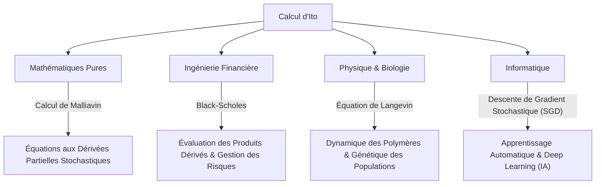

## 1. Introduction : Un langage pour décrire l'incertitude

Notre monde est rempli d'événements imprévisibles et d'incertitudes. Des fluctuations des cours boursiers et du mouvement des particules dans l'air jusqu'à l'écoulement des rivières et aux processus d'apprentissage des réseaux de neurones, les phénomènes régis par le hasard sont innombrables. Un outil puissant pour décrire, prédire et analyser de tels « mouvements aléatoires » de manière mathématiquement rigoureuse est les **Équations Différentielles Stochastiques (EDS)** .

Et c'est le grand mathématicien japonais **[Kiyosi Ito](https://kenji.blog/p/ito-kiyosi/)** qui a établi la théorie de ces équations différentielles stochastiques et érigé le monument connu sous le nom de **Lemme d'Ito** ou **Formule d'Ito** . Dans cet article, nous plongeons au cœur des épisodes de sa vie et de ses réalisations mathématiques, qui continuent d'avoir un impact immense non seulement sur le monde mathématique, mais aussi sur l'économie, la physique et l'ingénierie.

## 2. La vie et le contexte historique de [Kiyosi Ito](https://kenji.blog/p/ito-kiyosi/)

### 2.1 Jeunesse et éveil aux mathématiques

[Kiyosi Ito](https://kenji.blog/p/ito-kiyosi/) est né le 7 septembre 1915 dans le district d'Inabe (aujourd'hui ville d'Inabe), dans la préfecture de Mie. Excellent étudiant dès son plus jeune âge, il est passé par le Huitième Lycée Supérieur (aujourd'hui Université de Nagoya) pour rejoindre le département de mathématiques de la faculté des sciences de l'Université impériale de Tokyo (aujourd'hui Université de Tokyo).

À cette époque, dans la communauté mathématique japonaise, de grands mathématiciens comme Teiji Takagi (fondateur de la théorie des corps de classes) menaient des recherches de niveau mondial. Cependant, la théorie des probabilités était souvent traitée comme l'« hérétique des mathématiques » ou simplement comme un « domaine appliqué », et son statut de mathématique pure n'était pas encore établi. Néanmoins, Ito fut profondément marqué par les *Fondements de la théorie des probabilités*, publiés par Andreï Kolmogorov en 1933. En utilisant l'intégration de Lebesgue et la théorie de la mesure, Kolmogorov a axiomatisé la théorie des probabilités, la plaçant sur des bases mathématiques rigoureuses.

### 2.2 Recherches solitaires au Bureau des statistiques du cabinet et épreuves de la guerre

Après avoir obtenu son diplôme universitaire en 1938, Ito n'est pas resté dans le milieu universitaire mais a pris un emploi au Bureau des statistiques du cabinet. Tout en accomplissant ses tâches statistiques en tant que fonctionnaire, il a poursuivi ses recherches indépendantes en théorie des probabilités pendant son temps libre.

Alors que la Seconde Guerre mondiale s'intensifiait, forçant de nombreux chercheurs à interrompre leurs travaux, Ito s'est plongé dans le monde de la pensée pure. C'est précisément durant cette période qu'il a fait ses grandes découvertes. En 1942, il publie son premier article jetant les bases de l'intégration stochastique et des équations différentielles stochastiques. Vivant avec la peur de la conscription militaire et des raids aériens, armé uniquement de papier et d'un crayon, il repoussait les limites de la connaissance humaine. Ces recherches solitaires de l'époque où il était fonctionnaire allaient plus tard changer fondamentalement le monde.

## 3. Réalisations mathématiques : La création du calcul stochastique

### 3.1 Mouvement brownien et non-dérivabilité

Pour comprendre le cœur de la théorie d'Ito, il faut d'abord connaître le **Mouvement brownien** . Le mouvement irrégulier de fines particules découvert par le botaniste Robert Brown en 1827 a été plus tard expliqué physiquement par Albert Einstein (1905) et formulé mathématiquement par Norbert Wiener (1923), sous le nom de processus de Wiener $W_t$.

Cependant, le processus de Wiener possédait une propriété mathématique fatale : il est **« continu partout, mais dérivable nulle part »** . Sa trajectoire est si irrégulière que la « vitesse » (la pente de la tangente) à un instant donné ne peut être définie. Par conséquent, le calcul infinitésimal ordinaire de Newton ou Leibniz (une théorie décrivant comment une fonction change en réponse à un changement infinitésimal $dt$) ne pouvait pas être appliqué au mouvement brownien.

### 3.2 La naissance de l'intégrale d'Ito

Pour résoudre ce problème, [Kiyosi Ito](https://kenji.blog/p/ito-kiyosi/) a construit un nouveau concept d'intégration. C'est l' **Intégrale d'Ito** .

$$
\int_0^T f(t, \omega) dW_t(\omega)
$$

Ici, $dW_t$ représente l'incrément infinitésimal du processus de Wiener. Ito a prouvé que cette intégrale pouvait être strictement définie pour des fonctions qui ne dépendent pas des informations futures (processus adaptés). Cela a rendu possible la description de systèmes dynamiques contenant du bruit sous forme d'équations différentielles.

### 3.3 Le Lemme d'Ito : Le théorème fondamental du calcul stochastique

La plus grande réalisation d'Ito est la découverte du **Lemme d'Ito** , une extension de la « règle de dérivation en chaîne » (chain rule) du calcul ordinaire.

En calcul ordinaire, une variation infinitésimale $df$ d'une fonction $f(x)$ est représentée jusqu'au terme du premier ordre du développement de Taylor par $df = f'(x)dx$. Cependant, dans un processus impliquant des fluctuations stochastiques $dW_t$, les fluctuations sont si fortes que le terme du second ordre $(dW_t)^2$ devient significatif à l'échelle du temps $dt$ (la propriété $(dW_t)^2 = dt$).

Supposons qu'un processus stochastique $X_t$ suive l'équation différentielle stochastique suivante :

$$
dX_t = \mu(X_t, t) dt + \sigma(X_t, t) dW_t
$$

Ici, $\mu$ est la dérive (tendance moyenne) et $\sigma$ est la volatilité (intensité de la fluctuation).
Alors, la variation infinitésimale d'une fonction suffisamment lisse $f(X_t, t)$ s'exprime ainsi :

$$
\text{Formule d'Ito : } df(X_t, t) = \left( \frac{\partial f}{\partial t} + \mu \frac{\partial f}{\partial x} + \frac{1}{2} \sigma^2 \frac{\partial^2 f}{\partial x^2} \right) dt + \sigma \frac{\partial f}{\partial x} dW_t
$$

$$
\text{où } \frac{1}{2} \sigma^2 \frac{\partial^2 f}{\partial x^2} \text{ est le terme d'Ito.}
$$

Le terme entre parenthèses du côté droit de cette équation est précisément le **terme d'Ito** . Il montre que la combinaison de l'incertitude (variance $\sigma^2$) et de la courbure de la fonction (dérivée seconde) entraîne un effet de poussée moyen (vers le haut ou vers le bas) sur l'ensemble du système. C'est un résultat profond, contre-intuitif, qui mérite véritablement d'être appelé la « formule de Newton-Leibniz » de la théorie des probabilités.

## 4. La philosophie et la personnalité de [Kiyosi Ito](https://kenji.blog/p/ito-kiyosi/)

### 4.1 La « Beauté » en mathématiques

[Kiyosi Ito](https://kenji.blog/p/ito-kiyosi/) aimait profondément la « beauté » aux fondements des mathématiques. Il comparait souvent la recherche mathématique à la création de poésie ou de musique. « Un excellent théorème mathématique révèle la structure simple et belle derrière des phénomènes complexes », a-il dit. Pour lui, les équations différentielles stochastiques n'étaient pas de simples outils de calcul, mais des œuvres d'art exprimant l'harmonie enfouie dans le hasard du monde naturel.

### 4.2 La frénésie de Wall Street et sa propre perplexité

Dans les années 1970, Fischer Black et Myron Scholes (qui remporteront plus tard le prix Nobel d'économie) ont publié l' **équation de Black-Scholes** , qui utilisait le lemme d'Ito pour déduire le juste prix des options financières. Cela a donné naissance à l'industrie colossale de l'ingénierie financière (finance quantitative), et tous les traders de Wall Street ont commencé à apprendre le « Calcul d'Ito ».

Cependant, Ito lui-même était un mathématicien pur avec peu d'intérêt pour l'économie ou la finance. Une anecdote célèbre raconte que lors d'un dîner, lorsqu'on lui a appris que ses théories brassaient des milliers de milliards de dollars à Wall Street, il a été surpris et a déclaré : **« Je n'avais absolument aucune idée que mes mathématiques pures étaient utilisées pour faire de l'argent de cette manière. »** Bien qu'il ait trouvé ce fait amusant, il a maintenu toute sa vie que son intérêt résidait strictement dans la « vérité mathématique ».

## 5. Répercussions sur d'autres domaines et applications modernes

Les théories d'Ito ne se limitent pas à l'ingénierie financière, elles imprègnent tous les domaines de la société moderne. Le diagramme ci-dessous illustre comment le calcul stochastique d'Ito s'est propagé.

Ces dernières années en particulier, la théorie d'Ito est revenue sur le devant de la scène dans le domaine de l'apprentissage automatique (machine learning). L'optimisation des processus d'apprentissage dans le deep learning (le processus où du bruit est ajouté dans la descente de gradient stochastique) et les **Modèles de Diffusion (Diffusion Models)** utilisés dans l'IA génératrice d'images sont des applications directes de la théorie d'Ito, résolvant littéralement des équations différentielles stochastiques à temps inversé. Les recherches de [Kiyosi Ito](https://kenji.blog/p/ito-kiyosi/) soutiennent les fondements mathématiques mêmes de la révolution moderne de l'IA.

## 6. Conclusion : Le premier prix Gauss et un héritage éternel

En 2006, le Congrès international des mathématiciens (ICM) a créé le **Prix Gauss** pour honorer l'application et la contribution des mathématiques à la société, et a choisi [Kiyosi Ito](https://kenji.blog/p/ito-kiyosi/), âgé de 90 ans, comme tout premier récipiendaire. La raison de sa sélection était d'avoir « jeté les bases de la théorie des équations différentielles stochastiques et de ses diverses applications ». Il est historiquement rare qu'une poursuite approfondie des mathématiques pures entraîne des impacts aussi vastes et pratiques sur la société humaine.

[Kiyosi Ito](https://kenji.blog/p/ito-kiyosi/) est décédé en 2008 à l'âge de 93 ans, mais son nom restera à jamais gravé dans les manuels du monde entier en tant que « Lemme d'Ito » et « Intégrale d'Ito ». Pour nous qui vivons dans un monde incertain, les formules laissées par [Kiyosi Ito](https://kenji.blog/p/ito-kiyosi/) resteront le phare le plus beau et le plus puissant éclairant le chaos.
