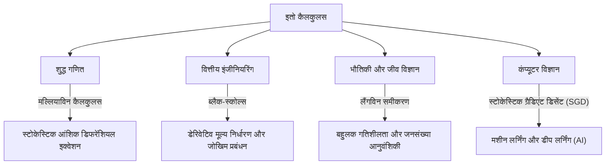

## 1. प्रस्तावना: अनिश्चितता का वर्णन करने वाली एक भाषा

हमारी दुनिया अप्रत्याशित घटनाओं और अनिश्चितता से भरी है। स्टॉक की कीमतों में उतार-चढ़ाव और हवा में कणों की गति से लेकर नदियों के प्रवाह और तंत्रिका नेटवर्क (neural networks) की सीखने की प्रक्रियाओं तक, यादृच्छिकता (randomness) द्वारा शासित घटनाओं की कोई गिनती नहीं है। ऐसे "यादृच्छिक आंदोलनों" का गणितीय और कठोरता से वर्णन करने, भविष्यवाणी करने और विश्लेषण करने के लिए एक शक्तिशाली उपकरण **स्टोकेस्टिक डिफरेंशियल इक्वेशन (SDE)** है।

और वह महान जापानी गणितज्ञ **[कियोशी इतो](https://kenji.blog/hi/p/ito-kiyosi/) ([Kiyosi Ito](https://kenji.blog/hi/p/ito-kiyosi/))** थे जिन्होंने इन स्टोकेस्टिक डिफरेंशियल इक्वेशनों के सिद्धांत को स्थापित किया और **इतो का लेम्मा (Ito's Lemma)** या **इतो का सूत्र (Ito's Formula)** के रूप में जाना जाने वाला स्मारक खड़ा किया। इस लेख में, हम उनके जीवन के प्रसंगों और उनकी गणितीय उपलब्धियों के मूल में गहराई से उतरते हैं, जिनका न केवल गणितीय दुनिया पर, बल्कि अर्थशास्त्र, भौतिकी और इंजीनियरिंग पर भी बहुत गहरा प्रभाव जारी है।

## 2. [कियोशी इतो](https://kenji.blog/hi/p/ito-kiyosi/) का जीवन और ऐतिहासिक पृष्ठभूमि

### 2.1 प्रारंभिक जीवन और गणित के प्रति जागरण

[कियोशी इतो](https://kenji.blog/hi/p/ito-kiyosi/) का जन्म 7 सितंबर 1915 को इनाबे जिले (अब इनाबे शहर), माई प्रीफेक्चर में हुआ था। कम उम्र से ही पढ़ाई में उत्कृष्ट प्रदर्शन करते हुए, वे टोक्यो इंपीरियल यूनिवर्सिटी (अब टोक्यो यूनिवर्सिटी) के विज्ञान संकाय में गणित विभाग में प्रवेश करने से पहले आठवीं उच्चतर विद्यालय (अब नागोया विश्वविद्यालय) से होकर गुजरे।

उस समय जापानी गणितीय समुदाय में, तीजी ताकागी (क्लास फील्ड थ्योरी के संस्थापक) जैसे महान गणितज्ञ विश्व स्तरीय शोध कर रहे थे। हालाँकि, संभाव्यता सिद्धांत (probability theory) को अभी भी अक्सर "गणित का विधर्मी" या केवल एक "लागू क्षेत्र" माना जाता था, और शुद्ध गणित के रूप में इसकी स्थिति अभी तक स्थापित नहीं हुई थी। फिर भी, 1933 में एंड्रे कोलमोगोरोव द्वारा प्रकाशित *संभाव्यता सिद्धांत की नींव* से इतो पर गहरा प्रभाव पड़ा। लेबेग एकीकरण और माप सिद्धांत का उपयोग करते हुए, कोलमोगोरोव ने संभाव्यता सिद्धांत को स्वयंसिद्ध किया, इसे कठोर गणितीय नींव पर रखा।

### 2.2 कैबिनेट सांख्यिकी ब्यूरो में एकान्त शोध और युद्धकालीन कठिनाइयाँ

1938 में विश्वविद्यालय से स्नातक होने के बाद, इतो शिक्षा जगत में नहीं रहे, बल्कि कैबिनेट सांख्यिकी ब्यूरो में नौकरी कर ली। एक नौकरशाह के रूप में अपने सांख्यिकीय कर्तव्यों का पालन करते हुए, उन्होंने अपने खाली समय के दौरान संभाव्यता सिद्धांत में अपना स्वतंत्र शोध जारी रखा।

जैसे ही द्वितीय विश्व युद्ध तीव्र हुआ, जिससे कई विद्वानों को अपना शोध रोकने के लिए मजबूर होना पड़ा, इतो शुद्ध विचार की दुनिया में डूब गए। यह ठीक इसी अवधि के दौरान था कि उन्होंने अपनी महान खोजें कीं। 1942 में, उन्होंने स्टोकेस्टिक एकीकरण और स्टोकेस्टिक डिफरेंशियल इक्वेशनों के लिए नींव रखने वाला अपना पहला पेपर प्रकाशित किया। सैन्य मसौदे और हवाई हमलों के डर के साथ रहते हुए, केवल कागज और पेंसिल के सहारे, वह मानव ज्ञान की सीमाओं को आगे बढ़ा रहे थे। एक नौकरशाह के रूप में उनके समय के दौरान यह एकान्त शोध बाद में दुनिया को मौलिक रूप से बदल देगा।

## 3. गणितीय उपलब्धियां: स्टोकेस्टिक कैलकुलस का निर्माण

### 3.1 ब्राउनियन मोशन और गैर-अवकलनीयता

इतो के सिद्धांत के मूल को समझने के लिए, किसी को पहले **ब्राउनियन मोशन (Brownian Motion)** के बारे में जानना होगा। 1827 में वनस्पतिशास्त्री रॉबर्ट ब्राउन द्वारा खोजे गए सूक्ष्म कणों के अनियमित आंदोलन को बाद में अल्बर्ट आइंस्टीन (1905) द्वारा भौतिक रूप से समझाया गया और नॉर्बर्ट वीनर (1923) द्वारा गणितीय रूप से तैयार किया गया, जिसे वीनर प्रक्रिया $W_t$ के रूप में जाना जाता है।

हालाँकि, वीनर प्रक्रिया में एक घातक गणितीय गुण था: यह **"हर जगह निरंतर है, लेकिन कहीं भी अवकलनीय (differentiable) नहीं है।"** इसका प्रक्षेपवक्र इतना दांतेदार है कि किसी भी क्षण "वेग" (स्पर्शरेखा का ढलान) को परिभाषित नहीं किया जा सकता है। इसलिए, मानक न्यूटोनियन या लीबनिज़ियन कैलकुलस (एक सिद्धांत जो वर्णन करता है कि फ़ंक्शन अनंत सूक्ष्म परिवर्तन $dt$ की प्रतिक्रिया में कैसे बदलता है) को ब्राउनियन गति पर लागू नहीं किया जा सकता है।

### 3.2 इतो इंटीग्रल का जन्म

इस समस्या को हल करने के लिए, [कियोशी इतो](https://kenji.blog/hi/p/ito-kiyosi/) ने एकीकरण की एक नई अवधारणा का निर्माण किया। यह **इतो इंटीग्रल** है।

$$
\int_0^T f(t, \omega) dW_t(\omega)
$$

यहाँ, $dW_t$ वीनर प्रक्रिया की अनंत सूक्ष्म वृद्धि (infinitesimal increment) को दर्शाता है। इतो ने साबित किया कि इस इंटीग्रल को उन फ़ंक्शंस के लिए कड़ाई से परिभाषित किया जा सकता है जो भविष्य की जानकारी (अनुकूलित प्रक्रियाओं) पर निर्भर नहीं करते हैं। इससे डिफरेंशियल इक्वेशनों के रूप में शोर (noise) वाले गतिशील प्रणालियों (dynamic systems) का वर्णन करना संभव हो गया।

### 3.3 इतो का लेम्मा: स्टोकेस्टिक कैलकुलस का मौलिक प्रमेय

इतो की सबसे बड़ी उपलब्धि **इतो के लेम्मा** की खोज है, जो सामान्य कैलकुलस में "चेन नियम" का विस्तार है।

सामान्य कैलकुलस में, फ़ंक्शन $f(x)$ का एक सूक्ष्म परिवर्तन $df$ टेलर विस्तार के पहले क्रम के पद तक $df = f'(x)dx$ के रूप में दर्शाया जाता है। हालाँकि, स्टोकेस्टिक उतार-चढ़ाव $dW_t$ वाली प्रक्रिया में, उतार-चढ़ाव इतने गंभीर होते हैं कि समय $dt$ (गुण $(dW_t)^2 = dt$) के क्रम में दूसरे क्रम का पद $(dW_t)^2$ महत्वपूर्ण हो जाता है।

मान लीजिए कि एक स्टोकेस्टिक प्रक्रिया $X_t$ स्टोकेस्टिक डिफरेंशियल इक्वेशन का अनुसरण करती है:

$$
dX_t = \mu(X_t, t) dt + \sigma(X_t, t) dW_t
$$

यहाँ, $\mu$ बहाव (औसत प्रवृत्ति) है और $\sigma$ अस्थिरता (उतार-चढ़ाव की तीव्रता) है।
फिर, पर्याप्त रूप से चिकनी फ़ंक्शन $f(X_t, t)$ के सूक्ष्म परिवर्तन को इस प्रकार व्यक्त किया जाता है:

$$
\text{इतो का सूत्र: } df(X_t, t) = \left( \frac{\partial f}{\partial t} + \mu \frac{\partial f}{\partial x} + \frac{1}{2} \sigma^2 \frac{\partial^2 f}{\partial x^2} \right) dt + \sigma \frac{\partial f}{\partial x} dW_t
$$

$$
\text{जहाँ } \frac{1}{2} \sigma^2 \frac{\partial^2 f}{\partial x^2} \text{ इतो का पद है।}
$$

इस समीकरण के दाहिने हिस्से में कोष्ठक में पद ठीक **इतो का पद** है। यह दर्शाता है कि अनिश्चितता (विचरण $\sigma^2$) और फ़ंक्शन की वक्रता (दूसरा व्युत्पन्न) का संयोजन संपूर्ण सिस्टम पर एक औसत ऊपर की ओर (या नीचे की ओर) धक्का देने वाला प्रभाव लाता है। यह एक गहरा, प्रति-सहज (counter-intuitive) परिणाम है, और संभाव्यता सिद्धांत में "न्यूटन-लीबनिज़ सूत्र" कहलाने का वास्तव में हकदार है।

## 4. [कियोशी इतो](https://kenji.blog/hi/p/ito-kiyosi/) का दर्शन और व्यक्तित्व

### 4.1 गणित में "सुंदरता"

[कियोशी इतो](https://kenji.blog/hi/p/ito-kiyosi/) को गणित की नींव में "सुंदरता" से गहरा प्यार था। वह अक्सर गणितीय शोध की तुलना कविता या संगीत के निर्माण से करते थे। उन्होंने कहा, "एक उत्कृष्ट गणितीय प्रमेय जटिल घटनाओं के पीछे सरल और सुंदर संरचना को प्रकट करता है।" उनके लिए, स्टोकेस्टिक डिफरेंशियल इक्वेशन केवल गणना के उपकरण नहीं थे, बल्कि प्राकृतिक दुनिया की यादृच्छिकता के भीतर गहरे सामंजस्य को व्यक्त करने के लिए कला के कार्य थे।

### 4.2 वॉल स्ट्रीट का उन्माद और उनकी अपनी घबराहट

1970 के दशक में, फिशर ब्लैक और मायरन स्कोल्स (जिन्होंने बाद में अर्थशास्त्र में नोबेल पुरस्कार जीता) ने **ब्लैक-स्कोल्स समीकरण** प्रकाशित किया, जिसने वित्तीय विकल्पों की उचित कीमत प्राप्त करने के लिए इतो के लेम्मा का उपयोग किया। इसने वित्तीय इंजीनियरिंग (मात्रात्मक वित्त) के विशाल उद्योग को जन्म दिया, और वॉल स्ट्रीट के व्यापारियों ने "इतो कैलकुलस" सीखना शुरू कर दिया।

हालाँकि, इतो स्वयं एक शुद्ध गणितज्ञ थे, जिनकी अर्थशास्त्र या वित्त में बहुत कम रुचि थी। एक प्रसिद्ध किस्सा है कि एक डिनर पार्टी में, जब उन्हें बताया गया कि उनके सिद्धांत वॉल स्ट्रीट पर खरबों डॉलर चला रहे हैं, तो वे हैरान रह गए और कहा, **"मुझे बिल्कुल भी अंदाज़ा नहीं था कि मेरे शुद्ध गणित का इस्तेमाल इस तरह पैसे कमाने के लिए किया जा रहा है।"** हालाँकि उन्हें यह तथ्य मनोरंजक लगा, लेकिन उन्होंने जीवन भर यह रुख बनाए रखा कि उनकी रुचि सख्ती से "गणितीय सत्य" में निहित है।

## 5. अन्य क्षेत्रों पर प्रभाव और आधुनिक अनुप्रयोग

इतो के सिद्धांत केवल वित्तीय इंजीनियरिंग में ही नहीं, बल्कि आधुनिक समाज के हर क्षेत्र में व्याप्त हैं। नीचे दिया गया आरेख स्पष्ट करता है कि इतो का स्टोकेस्टिक कैलकुलस कैसे बाहर की ओर फैला है।

विशेष रूप से हाल के वर्षों में, मशीन लर्निंग के क्षेत्र में इतो का सिद्धांत फिर से सुर्खियों में है। डीप लर्निंग में सीखने की प्रक्रियाओं का अनुकूलन (वह प्रक्रिया जहाँ स्टोकेस्टिक ग्रैडिएंट डिसेंट में शोर जोड़ा जाता है) और छवि निर्माण AI में उपयोग किए जाने वाले **डिफ्यूजन मॉडल (Diffusion Models)** इतो के सिद्धांत के प्रत्यक्ष अनुप्रयोग हैं, जो सचमुच रिवर्स टाइम में स्टोकेस्टिक डिफरेंशियल इक्वेशनों को हल करते हैं। [कियोशी इतो](https://kenji.blog/hi/p/ito-kiyosi/) का शोध आधुनिक AI क्रांति की गणितीय नींव का समर्थन करता है।

## 6. निष्कर्ष: पहला गॉस पुरस्कार और एक शाश्वत विरासत

2006 में, अंतर्राष्ट्रीय गणितज्ञ कांग्रेस (ICM) ने समाज में गणित के अनुप्रयोग और योगदान को सम्मानित करने के लिए **गॉस पुरस्कार** की स्थापना की, और इसके उद्घाटन प्राप्तकर्ता के रूप में 90 वर्षीय [कियोशी इतो](https://kenji.blog/hi/p/ito-kiyosi/) को चुना। उनके चयन का कारण "स्टोकेस्टिक डिफरेंशियल इक्वेशनों के सिद्धांत की नींव और इसके विविध अनुप्रयोगों को रखना" था। यह ऐतिहासिक रूप से दुर्लभ है कि शुद्ध गणित की गहरी खोज के परिणामस्वरूप मानव समाज पर इतने व्यापक और व्यावहारिक प्रभाव पड़े।

[कियोशी इतो](https://kenji.blog/hi/p/ito-kiyosi/) का 2008 में 93 वर्ष की आयु में निधन हो गया, लेकिन उनका नाम दुनिया भर की पाठ्यपुस्तकों में "इतो लेम्मा" और "इतो इंटीग्रल" के रूप में हमेशा के लिए उकेरा गया है। अनिश्चित दुनिया में रहने वाले हमारे लिए, [कियोशी इतो](https://kenji.blog/hi/p/ito-kiyosi/) द्वारा छोड़े गए सूत्र अराजकता में प्रकाश चमकाने वाले सबसे सुंदर और शक्तिशाली प्रकाशस्तंभ बने रहेंगे।
