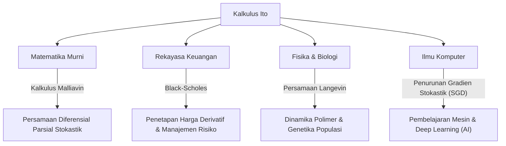

## 1. Pengantar: Bahasa untuk Menggambarkan Ketidakpastian

Dunia kita penuh dengan peristiwa yang tidak dapat diprediksi dan ketidakpastian. Dari fluktuasi harga saham dan pergerakan partikel di udara hingga aliran sungai dan proses pembelajaran jaringan saraf, fenomena yang diatur oleh keacakan tidak terhitung jumlahnya. Alat yang ampuh untuk mendeskripsikan, memprediksi, dan menganalisis "pergerakan acak" semacam itu secara matematis dan ketat adalah **Persamaan Diferensial Stokastik (SDE)** .

Dan matematikawan besar Jepang **[Kiyosi Ito](https://kenji.blog/id/p/ito-kiyosi/)**-lah yang membangun teori persamaan diferensial stokastik ini dan mendirikan monumen yang dikenal sebagai **Lemma Ito** atau **Rumus Ito** . Dalam artikel ini, kita menyelidiki lebih dalam episode kehidupannya dan inti dari pencapaian matematisnya, yang terus memberikan dampak luar biasa tidak hanya pada dunia matematika tetapi juga pada ekonomi, fisika, dan teknik.

## 2. Kehidupan [Kiyosi Ito](https://kenji.blog/id/p/ito-kiyosi/) dan Latar Belakang Sejarah

### 2.1 Kehidupan Awal dan Kebangkitan Terhadap Matematika

[Kiyosi Ito](https://kenji.blog/id/p/ito-kiyosi/) lahir pada 7 September 1915, di Distrik Inabe (sekarang Kota Inabe), Prefektur Mie. Unggul dalam bidang akademik sejak usia muda, ia melewati Sekolah Menengah Atas Kedelapan (sekarang Universitas Nagoya) menuju Departemen Matematika di Fakultas Sains di Universitas Kekaisaran Tokyo (sekarang Universitas Tokyo).

Pada saat itu di komunitas matematika Jepang, matematikawan besar seperti Teiji Takagi (pendiri Teori Medan Kelas) sedang melakukan penelitian kelas dunia. Namun, teori probabilitas masih sering diperlakukan sebagai "bidat matematika" atau sekadar "bidang terapan," dan statusnya sebagai matematika murni belum terbentuk. Namun demikian, Ito sangat terpukul oleh *Dasar-dasar Teori Probabilitas*, yang diterbitkan oleh Andrey Kolmogorov pada tahun 1933. Dengan menggunakan integrasi Lebesgue dan teori ukuran, Kolmogorov mengaksiomakan teori probabilitas, menempatkannya pada fondasi matematika yang ketat.

### 2.2 Penelitian Soliter di Biro Statistik Kabinet dan Kesulitan Masa Perang

Setelah lulus dari universitas pada tahun 1938, Ito tidak bertahan di dunia akademis tetapi mengambil pekerjaan di Biro Statistik Kabinet. Sembari menjalankan tugas statistiknya sebagai birokrat, ia melanjutkan penelitian independennya dalam teori probabilitas selama waktu luangnya.

Saat Perang Dunia II meningkat, yang memaksa banyak sarjana untuk menghentikan penelitian mereka, Ito membenamkan dirinya dalam dunia pemikiran murni. Tepat pada periode inilah ia membuat penemuan-penemuan besarnya. Pada tahun 1942, ia menerbitkan makalah pertamanya yang meletakkan dasar bagi integrasi stokastik dan persamaan diferensial stokastik. Hidup berdampingan dengan ketakutan akan wajib militer dan serangan udara, dengan hanya berbekal kertas dan pensil, ia mendorong batas-batas pengetahuan manusia. Penelitian soliter selama waktunya sebagai birokrat ini nantinya akan mengubah dunia secara fundamental.

## 3. Pencapaian Matematis: Penciptaan Kalkulus Stokastik

### 3.1 Gerak Brown dan Ketidakmampuan Diferensiasi

Untuk memahami inti dari teori Ito, pertama-tama seseorang harus mengetahui tentang **Gerak Brown** . Pergerakan tidak teratur partikel halus yang ditemukan oleh ahli botani Robert Brown pada tahun 1827 kemudian dijelaskan secara fisik oleh Albert Einstein (1905) dan dirumuskan secara matematis oleh Norbert Wiener (1923), yang dikenal sebagai proses Wiener $W_t$.

Namun, proses Wiener memiliki sifat matematis yang fatal: proses ini **"kontinu di mana-mana tetapi tidak dapat didiferensiasikan di mana pun."** Lintasannya sangat bergerigi sehingga "kecepatan" (kemiringan garis singgung) pada momen tertentu tidak dapat ditentukan. Oleh karena itu, kalkulus standar Newton atau Leibniz (teori yang menjelaskan bagaimana suatu fungsi berubah sebagai respons terhadap perubahan yang sangat kecil $dt$) tidak dapat diterapkan pada gerak Brown.

### 3.2 Kelahiran Integral Ito

Untuk memecahkan masalah ini, [Kiyosi Ito](https://kenji.blog/id/p/ito-kiyosi/) membangun konsep integrasi baru. Ini adalah **Integral Ito** .

$$
\int_0^T f(t, \omega) dW_t(\omega)
$$

Di sini, $dW_t$ mewakili kenaikan yang sangat kecil dari proses Wiener. Ito membuktikan bahwa integral ini dapat didefinisikan secara ketat untuk fungsi-fungsi yang tidak bergantung pada informasi masa depan (proses yang diadaptasi). Hal ini memungkinkan untuk mendeskripsikan sistem dinamis yang mengandung noise dalam bentuk persamaan diferensial.

### 3.3 Lemma Ito: Teorema Fundamental Kalkulus Stokastik

Pencapaian terbesar Ito adalah penemuan **Lemma Ito** , perpanjangan dari "aturan rantai" dalam kalkulus biasa.

Dalam kalkulus biasa, perubahan yang sangat kecil $df$ dari suatu fungsi $f(x)$ direpresentasikan hingga suku orde pertama dari ekspansi Taylor sebagai $df = f'(x)dx$. Namun, dalam proses yang melibatkan fluktuasi stokastik $dW_t$, fluktuasi tersebut sangat parah sehingga suku orde kedua $(dW_t)^2$ menjadi signifikan pada orde waktu $dt$ (sifat bahwa $(dW_t)^2 = dt$).

Misalkan proses stokastik $X_t$ mengikuti persamaan diferensial stokastik:

$$
dX_t = \mu(X_t, t) dt + \sigma(X_t, t) dW_t
$$

Di sini, $\mu$ adalah drift (tren rata-rata) dan $\sigma$ adalah volatilitas (intensitas fluktuasi).
Kemudian, perubahan yang sangat kecil dari fungsi yang cukup halus $f(X_t, t)$ dinyatakan sebagai:

$$
\text{Rumus Ito: } df(X_t, t) = \left( \frac{\partial f}{\partial t} + \mu \frac{\partial f}{\partial x} + \frac{1}{2} \sigma^2 \frac{\partial^2 f}{\partial x^2} \right) dt + \sigma \frac{\partial f}{\partial x} dW_t
$$

$$
\text{di mana } \frac{1}{2} \sigma^2 \frac{\partial^2 f}{\partial x^2} \text{ adalah suku Ito.}
$$

Suku di dalam kurung di sisi kanan persamaan ini adalah tepat **suku Ito** . Suku ini menunjukkan bahwa kombinasi ketidakpastian (varians $\sigma^2$) dan kelengkungan fungsi (turunan kedua) menghasilkan efek dorongan ke atas (atau ke bawah) rata-rata pada keseluruhan sistem. Ini adalah hasil yang mendalam, berlawanan dengan intuisi, dan benar-benar layak disebut "rumus Newton-Leibniz" dalam teori probabilitas.

## 4. Filosofi dan Kepribadian [Kiyosi Ito](https://kenji.blog/id/p/ito-kiyosi/)

### 4.1 "Keindahan" dalam Matematika

[Kiyosi Ito](https://kenji.blog/id/p/ito-kiyosi/) sangat mencintai "keindahan" pada fondasi matematika. Ia sering mengibaratkan penelitian matematika seperti penciptaan puisi atau musik. "Sebuah teorema matematika yang sangat baik mengungkapkan struktur sederhana dan indah di balik fenomena yang kompleks," katanya. Baginya, persamaan diferensial stokastik bukan sekadar alat hitung, tetapi karya seni untuk mengekspresikan harmoni yang mendalam dalam keacakan alam.

### 4.2 Kegilaan Wall Street dan Kebingungannya Sendiri

Pada 1970-an, Fischer Black dan Myron Scholes (yang kemudian memenangkan Hadiah Nobel di bidang Ekonomi) menerbitkan **persamaan Black-Scholes** , yang menggunakan Lemma Ito untuk memperoleh harga wajar opsi keuangan. Ini melahirkan industri raksasa rekayasa keuangan (keuangan kuantitatif), dan para pedagang Wall Street semuanya mulai mempelajari "Kalkulus Ito."

Namun, Ito sendiri adalah seorang matematikawan murni yang tidak terlalu tertarik pada ekonomi atau keuangan. Ada sebuah anekdot terkenal bahwa pada sebuah pesta makan malam, ketika diberi tahu bahwa teori-teorinya menggerakkan triliunan dolar di Wall Street, ia terkejut dan berkata, **"Saya sama sekali tidak tahu bahwa matematika murni saya digunakan untuk menghasilkan uang seperti itu."** Meskipun ia menganggap fakta itu lucu, ia mempertahankan pendiriannya sepanjang hidupnya bahwa ketertarikannya murni pada "kebenaran matematis."

## 5. Efek Riak pada Bidang Lain dan Aplikasi Modern

Teori-teori Ito tidak hanya menembus rekayasa keuangan, tetapi juga setiap bidang masyarakat modern. Diagram di bawah ini mengilustrasikan bagaimana kalkulus stokastik Ito menyebar.

Terutama dalam beberapa tahun terakhir, teori Ito kembali menjadi sorotan di bidang pembelajaran mesin. Optimalisasi proses pembelajaran dalam pembelajaran mendalam (proses di mana noise ditambahkan dalam penurunan gradien stokastik) dan **Model Difusi (Diffusion Models)** yang digunakan dalam AI pembuatan gambar adalah aplikasi langsung dari teori Ito, secara harfiah memecahkan persamaan diferensial stokastik dalam waktu mundur. Penelitian [Kiyosi Ito](https://kenji.blog/id/p/ito-kiyosi/) mendukung fondasi matematis dari revolusi AI modern.

## 6. Kesimpulan: Hadiah Gauss Pertama dan Warisan Abadi

Pada tahun 2006, Kongres Internasional Matematikawan (ICM) menetapkan **Hadiah Gauss** untuk menghormati penerapan dan kontribusi matematika pada masyarakat, dan memilih [Kiyosi Ito](https://kenji.blog/id/p/ito-kiyosi/) yang berusia 90 tahun sebagai penerima perdananya. Alasan pemilihannya adalah "meletakkan dasar-dasar teori persamaan diferensial stokastik dan beragam aplikasinya." Secara historis jarang terjadi bahwa pengejaran mendalam terhadap matematika murni menghasilkan dampak yang begitu luas dan praktis pada masyarakat manusia.

[Kiyosi Ito](https://kenji.blog/id/p/ito-kiyosi/) meninggal pada tahun 2008 pada usia 93 tahun, tetapi namanya selamanya terukir dalam buku-buku pelajaran di seluruh dunia sebagai "Lemma Ito" dan "Integral Ito." Bagi kita yang hidup di dunia yang penuh ketidakpastian, rumus-rumus yang ditinggalkan oleh [Kiyosi Ito](https://kenji.blog/id/p/ito-kiyosi/) akan tetap menjadi mercusuar yang paling indah dan kuat yang menyinari kekacauan.
