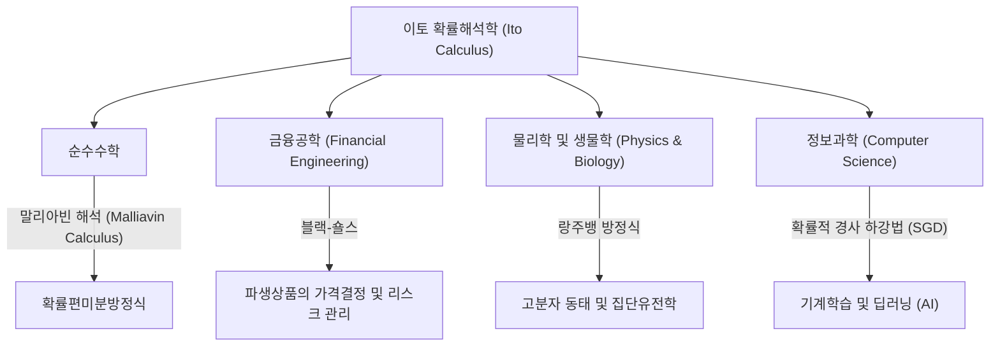

## 1. 서론: 불확실성을 기술하는 언어

우리가 사는 세상은 예측할 수 없는 사건과 불확실성으로 가득 차 있습니다. 주가의 변동, 공기 중 미립자의 움직임, 강물의 흐름, 나아가 신경망의 학습 과정에 이르기까지 우연이 지배하는 현상은 이루 헤아릴 수 없습니다. 이러한 '무작위적인 움직임'을 수학적으로 엄밀하게 기술하고, 예측 및 분석하기 위한 강력한 도구가 바로 **확률미분방정식 (Stochastic Differential Equations, SDE)** 입니다.

그리고 이 확률미분방정식의 이론을 정립하고, **'이토의 보조정리 (Ito's Lemma)'** 또는 **'이토의 공식 (Ito's Formula)'** 이라 불리는 금자탑을 세운 이가 바로 일본의 위대한 수학자 **[이토 기요시](https://kenji.blog/ko/p/ito-kiyosi/) ([Kiyosi Ito](https://kenji.blog/ko/p/ito-kiyosi/))** 입니다. 본 기사에서는 수학계뿐만 아니라 경제학, 물리학, 공학에까지 지대한 영향을 미치고 있는 그의 생애 에피소드와 그 수학적 업적의 핵심을 깊이 파헤쳐 봅니다.

## 2. [이토 기요시](https://kenji.blog/ko/p/ito-kiyosi/)의 생애와 시대적 배경

### 2.1 유년기와 수학에의 눈뜸

[이토 기요시](https://kenji.blog/ko/p/ito-kiyosi/)는 1915년 9월 7일, 미에현 이나베군(현재의 이나베시)에서 태어났습니다. 어릴 적부터 학문에 뛰어났던 그는 구제 제8고등학교(현재의 나고야 대학)를 거쳐, 도쿄 제국대학(현재의 도쿄 대학) 이학부 수학과에 진학합니다.

당시 일본의 수학계는 다카기 데이지(유체론의 창시자)를 비롯한 위대한 수학자들이 세계적인 수준의 연구를 하고 있었지만, 확률론은 아직 '수학의 이단아' 혹은 '응용의 한 분야'로 취급되는 경우가 많았고, 순수수학으로서의 지위는 확립되지 않았습니다. 하지만 이토는 안드레이 콜모고로프(Andrey Kolmogorov)가 1933년에 발표한 『확률론의 기초 개념』에 큰 충격을 받습니다. 콜모고로프는 르베그 적분과 측도론을 사용하여 확률론을 공리화하고, 엄밀한 수학의 토대 위에 올려놓았던 것입니다.

### 2.2 내각통계국에서의 고독한 연구와 전시의 고난

1938년에 대학을 졸업한 이토는 대학에 남지 않고 내각통계국에 취업합니다. 관료로서 통계 실무를 처리하면서, 그는 퇴근 후의 시간을 활용해 독학으로 확률론 연구를 계속했습니다.

제2차 세계대전이 격화되어 많은 학자들이 연구를 중단해야만 했던 가운데, 이토는 순수한 사고의 세계에 몰두했습니다. 그가 위대한 발견을 한 것은 바로 이 시기였습니다. 1942년, 그는 확률적분과 확률미분방정식의 기초를 다지는 첫 논문을 발표했습니다. 병역과 공습의 공포가 도사리는 상황 속에서 종이와 연필만을 의지한 채 인류 지식의 한계를 넓히고 있었던 것입니다. 이 관료 시절의 고독한 연구가 훗날 세상을 근본적으로 바꾸게 됩니다.

## 3. 수학적 업적: 확률해석학의 창시

### 3.1 브라운 운동과 미분 불가능성

이토 이론의 핵심을 이해하기 위해서는 먼저 **브라운 운동 (Brownian Motion)** 에 대해 알아야 합니다. 1827년 식물학자 로버트 브라운이 발견한 미립자의 불규칙한 운동은 훗날 알베르트 아인슈타인(1905년)에 의해 물리학적으로 해명되었고, 노버트 위너(1923년)에 의해 수학적으로 정식화되었습니다(위너 과정 $W_t$).

그러나 위너 과정에는 치명적인 수학적 성질이 있었습니다. 그것은 바로 **'모든 곳에서 연속이지만, 그 어디에서도 미분 불가능하다'** 는 점입니다. 궤적이 너무 삐쭉삐쭉해서 어떤 순간에서의 '속도(접선의 기울기)'를 정의할 수 없는 것입니다. 따라서 일반적인 뉴턴이나 라이프니츠의 미적분학(미소한 변화 $dt$ 에 대해 함수가 어떻게 변화하는지를 기술하는 이론)을 브라운 운동에 적용하는 것은 불가능했습니다.

### 3.2 이토 적분의 탄생

이 문제를 해결하기 위해 [이토 기요시](https://kenji.blog/ko/p/ito-kiyosi/)는 새로운 적분 개념을 구축했습니다. 이것이 바로 **이토 적분 (Ito Integral)** 입니다.

$$
\int_0^T f(t, \omega) dW_t(\omega)
$$

여기서 $dW_t$ 는 위너 과정의 미소한 증분을 나타냅니다. 이토는 미래의 정보에 의존하지 않는(적응적인) 함수에 대해 이 적분이 엄밀하게 정의될 수 있음을 증명했습니다. 이로써 노이즈를 포함하는 동적인 시스템을 미분방정식의 형태로 기술하는 것이 가능해졌습니다.

### 3.3 이토의 보조정리: 확률해석의 기본 정리

이토의 가장 큰 공적은 일반적인 미적분의 '연쇄 법칙(체인 룰)'을 확장한 **이토의 보조정리** 의 발견입니다.

일반적인 미적분에서 함수 $f(x)$ 의 미소 변화 $df$ 는 테일러 전개의 1차 항까지를 사용하여 $df = f'(x)dx$ 로 나타납니다. 하지만 확률적인 변동 $dW_t$ 를 수반하는 과정에서는 변동이 매우 격렬하기 때문에 2차 항 $(dW_t)^2$ 이 시간 $dt$ 의 오더(order)로 영향을 미치게 됩니다($(dW_t)^2 = dt$ 라는 성질).

확률 과정 $X_t$ 가 다음의 확률미분방정식을 따른다고 가정합시다.

$$
dX_t = \mu(X_t, t) dt + \sigma(X_t, t) dW_t
$$

여기서 $\mu$ 는 표류(drift, 평균적인 경향), $\sigma$ 는 변동성(volatility, 변동의 격렬함)입니다.
이때 충분히 매끄러운 함수 $f(X_t, t)$ 의 미소 변화는 다음과 같이 표현됩니다.

$$
\text{이토의 공식 (Ito's Formula): } df(X_t, t) = \left( \frac{\partial f}{\partial t} + \mu \frac{\partial f}{\partial x} + \frac{1}{2} \sigma^2 \frac{\partial^2 f}{\partial x^2} \right) dt + \sigma \frac{\partial f}{\partial x} dW_t
$$

$$
\text{여기서, } \frac{1}{2} \sigma^2 \frac{\partial^2 f}{\partial x^2} \text{ 는 이토 항 (Ito term) 이다.}
$$

이 식의 우변에 있는 괄호 안의 항이 바로 **'이토 항 (Ito term)'** 입니다. 불확실성(분산 $\sigma^2$)과 함수의 굽은 정도(2차 미분)가 결합함으로써 시스템 전체에 평균적인 밀어 올리기(또는 끌어내리기) 효과를 가져온다는 것을 보여줍니다. 이것은 직관에 반하는 심오한 결과이며, 확률론에서의 '뉴턴-라이프니츠의 공식'이라고 부르기에 손색이 없습니다.

## 4. [이토 기요시](https://kenji.blog/ko/p/ito-kiyosi/)의 철학과 인물상

### 4.1 수학에서의 '미(美)'

[이토 기요시](https://kenji.blog/ko/p/ito-kiyosi/)는 수학의 기저에 있는 '아름다움'을 깊이 사랑했습니다. 그는 종종 수학 연구를 시나 음악 창작에 비유했습니다. "뛰어난 수학 정리는 복잡한 현상 이면에 있는 단순하고 아름다운 구조를 밝혀낸다"고 그는 말했습니다. 그에게 확률미분방정식은 단순한 계산 도구가 아니라, 자연계의 무작위성 깊은 곳에 있는 조화를 표현하기 위한 예술 작품이었습니다.

### 4.2 월스트리트의 열광과 본인의 당혹감

1970년대, 피셔 블랙과 마이런 숄스(훗날 노벨 경제학상 수상)는 이토의 보조정리를 이용하여 금융 옵션의 적정 가격을 도출하는 **블랙-숄스 방정식** 을 발표했습니다. 이로 인해 금융공학(퀀트 파이낸스)이라는 거대한 산업이 탄생했고, 월스트리트의 트레이더들은 모두 'Ito Calculus(이토의 미적분)'를 배우기 시작했습니다.

그러나 이토 본인은 순수수학자였으며 경제나 금융에는 거의 관심이 없었습니다. 한 만찬회에서 자신의 이론이 월스트리트에서 수조 달러의 자금을 움직이고 있다는 사실을 알게 되었을 때, **"내 순수한 수학이 그런 돈벌이에 쓰이고 있는 줄은 전혀 몰랐다"** 며 놀라워했다는 유명한 일화가 있습니다. 그는 그 사실을 흥미로워하면서도, 자신의 관심은 어디까지나 '수학의 진리'에 있다는 태도를 평생 잃지 않았습니다.

## 5. 타 분야로의 파급과 현대의 응용

이토의 이론은 금융공학에 그치지 않고 현대 사회의 모든 분야에 침투해 있습니다. 아래 그림은 이토의 확률해석학이 어떻게 각 분야로 파급되었는지를 보여줍니다.

특히 최근에는 기계학습 분야에서 이토의 이론이 다시 각광받고 있습니다. 딥러닝에서의 학습 프로세스 최적화(확률적 경사 하강법에 노이즈가 더해지는 과정)나 이미지 생성 AI에 사용되는 **확산 모델 (Diffusion Models)** 은 바로 확률미분방정식의 역시간을 푸는 이토 이론의 직접적인 응용입니다. [이토 기요시](https://kenji.blog/ko/p/ito-kiyosi/)의 연구는 현대 AI 혁명의 수학적 기반까지 지탱하고 있는 것입니다.

## 6. 결론: 제1회 가우스상과 영원한 유산

2006년, 국제수학자회의(ICM)는 수학의 사회적 응용 및 공헌을 기리기 위해 **가우스상** 을 신설하고, 그 기념비적인 제1회 수상자로 90세의 [이토 기요시](https://kenji.blog/ko/p/ito-kiyosi/)를 선정했습니다. 선정 이유는 "확률미분방정식의 기초 이론 구축과 그 다양한 응용"이었습니다. 순수수학에 대한 깊은 탐구가 결과적으로 이토록 광범위하고 실용적인 영향을 인류 사회에 가져온 예는 역사상 드뭅니다.

[이토 기요시](https://kenji.blog/ko/p/ito-kiyosi/)는 2008년 93세의 나이로 세상을 떠났지만, 그의 이름은 "Ito's Lemma", "Ito Integral"로서 세계의 교과서에 영원히 새겨져 있습니다. 불확실한 세상을 살아가는 우리에게 [이토 기요시](https://kenji.blog/ko/p/ito-kiyosi/)가 남긴 수식은 혼돈 속에 빛을 비추는 가장 아름답고 강력한 등대로 영원히 남을 것입니다.
