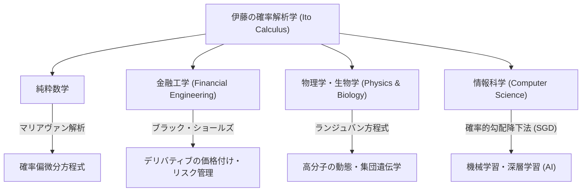

## 1. はじめに：不確実性を記述する言語

私たちの住む世界は、予測不可能な出来事と不確実性に満ちています。株価の変動、空気中の微粒子の動き、川の流れ、さらにはニューラルネットワークの学習過程に至るまで、偶然性が支配する現象は枚挙にいとまがありません。このような「ランダムな動き」を数学的に厳密に記述し、予測・解析するための強力なツールが **確率微分方程式 (Stochastic Differential Equations, SDE)** です。

そして、この確率微分方程式の理論を打ち立て、 **「伊藤の補題 (Ito's Lemma)」** または **「伊藤の公式 (Ito's Formula)」** と呼ばれる金字塔を打ち立てたのが、日本の偉大な数学者、 **[伊藤清](https://kenji.blog/p/ito-kiyosi/) ([Kiyosi Ito](https://kenji.blog/p/ito-kiyosi/))** です。本記事では、数学界のみならず、経済学、物理学、工学にまで絶大な影響を与え続ける彼の生涯のエピソードと、その数学的業績の核心を深く掘り下げていきます。

## 2. [伊藤清](https://kenji.blog/p/ito-kiyosi/)の生涯と時代背景

### 2.1 幼少期と数学への目覚め

[伊藤清](https://kenji.blog/p/ito-kiyosi/)は、1915年（大正4年）9月7日、三重県員弁郡（現在のいなべ市）で生まれました。幼い頃から学問に秀でていた彼は、旧制第八高等学校（現在の名古屋大学）を経て、東京帝国大学（現在の東京大学）理学部数学科に進学します。

当時の日本の数学界は、[高木貞治](https://kenji.blog/p/takagi-teiji/)（類体論の創始者）をはじめとする偉大な数学者たちが世界レベルの研究を行っていましたが、確率論はまだ「数学の異端児」あるいは「応用の一分野」として扱われることが多く、純粋数学としての地位は確立されていませんでした。しかし、伊藤はアンドレイ・コルモゴロフ（Andrey Kolmogorov）が1933年に発表した『確率論の基礎概念』に強い衝撃を受けます。コルモゴロフはルベーグ積分と測度論を用いて、確率論を公理化し、厳密な数学の土台に乗せたのです。

### 2.2 内閣統計局での孤独な研究と戦時下の苦難

1938年に大学を卒業した伊藤は、大学に残るのではなく、内閣統計局に就職します。官僚として統計実務をこなしながら、彼は終業後の時間を使って独学で確率論の研究を続けました。

第二次世界大戦が激化し、多くの学者が研究を中断せざるを得ない中、伊藤は純粋な思考の世界に没頭しました。彼が偉大な発見をしたのは、まさにこの時期です。1942年、彼は確率積分と確率微分方程式の基礎を築く最初の論文を発表しました。兵役や空襲の恐怖と隣り合わせの状況で、紙と鉛筆だけを頼りに、人類の知の限界を押し広げていたのです。この官僚時代の孤独な研究が、後に世界を根本から変えることになります。

## 3. 数学的業績：確率解析学の創始

### 3.1 ブラウン運動と微分不可能性

伊藤の理論の核心を理解するためには、まず **ブラウン運動 (Brownian Motion)** について知る必要があります。1827年に植物学者ロバート・ブラウンが発見した微粒子の不規則な運動は、後にアルベルト・アインシュタイン（1905年）によって物理学的に解明され、ノーバート・ウィーナー（1923年）によって数学的に定式化されました（ウィーナー過程 $W_t$ ）。

しかし、ウィーナー過程には致命的な数学的性質がありました。それは **「至る所連続であるが、どこでも微分不可能」** という点です。軌跡がギザギザすぎて、ある瞬間における「速度（接線の傾き）」を定義できないのです。したがって、通常の[ニュートン](https://kenji.blog/p/newton/)や[ライプニッツ](https://kenji.blog/p/leibniz/)の微積分学（微小な変化 $dt$ に対して関数がどう変化するかを記述する理論）をブラウン運動に適用することは不可能でした。

### 3.2 伊藤積分の誕生

この問題を解決するために、[伊藤清](https://kenji.blog/p/ito-kiyosi/)は新たな積分の概念を構築しました。これが **伊藤積分 (Ito Integral)** です。

$$
\int_0^T f(t, \omega) dW_t(\omega)
$$

ここで $dW_t$ はウィーナー過程の微小な増分を表します。伊藤は、未来の情報に依存しない（適合的な）関数に対して、この積分が厳密に定義できることを証明しました。これにより、ノイズを含む動的なシステムを微分方程式の形で記述することが可能になりました。

### 3.3 伊藤の補題：確率解析の基本定理

伊藤の最大の功績は、通常の微積分の「連鎖律（チェインルール）」を拡張した **伊藤の補題** の発見です。

通常の微積分では、関数 $f(x)$ の微小変化 $df$ は、テイラー展開の1次の項までを用いて $df = f'(x)dx$ と表されます。しかし、確率的な変動 $dW_t$ を伴う過程では、変動が非常に激しいため、2次の項 $(dW_t)^2$ が時間 $dt$ のオーダーで効いてきます（ $(dW_t)^2 = dt$ という性質）。

確率過程 $X_t$ が以下の確率微分方程式に従うとします。

$$
dX_t = \mu(X_t, t) dt + \sigma(X_t, t) dW_t
$$

ここで、 $\mu$ はドリフト（平均的な傾向）、 $\sigma$ はボラティリティ（変動の激しさ）です。
このとき、十分に滑らかな関数 $f(X_t, t)$ の微小変化は次のように表されます。

$$
\text{Ito's Formula: } df(X_t, t) = \left( \frac{\partial f}{\partial t} + \mu \frac{\partial f}{\partial x} + \frac{1}{2} \sigma^2 \frac{\partial^2 f}{\partial x^2} \right) dt + \sigma \frac{\partial f}{\partial x} dW_t
$$

$$
\text{ここで、} \frac{1}{2} \sigma^2 \frac{\partial^2 f}{\partial x^2} \text{ は伊藤の項 (Ito term) である。}
$$

この式の右辺にある項こそが **「伊藤の項 (Ito term)」** です。不確実性（分散 $\sigma^2$ ）と関数の曲がり具合（二次微分）が組み合わさることで、システム全体に平均的な押し上げ（または押し下げ）効果をもたらすことを示しています。これは直感に反する深遠な結果であり、確率論における「[ニュートン](https://kenji.blog/p/newton/)・[ライプニッツ](https://kenji.blog/p/leibniz/)の公式」と呼ぶにふさわしいものです。

## 4. [伊藤清](https://kenji.blog/p/ito-kiyosi/)の哲学と人物像

### 4.1 数学における「美」

[伊藤清](https://kenji.blog/p/ito-kiyosi/)は、数学の根底にある「美しさ」を深く愛していました。彼はしばしば、数学の研究を詩や音楽の創作に例えました。「優れた数学の定理は、複雑な現象の背後にある単純で美しい構造を明らかにする」と彼は語っています。彼にとって確率微分方程式は、単なる計算の道具ではなく、自然界のランダムネスの奥底にある調和を表現するための芸術作品でした。

### 4.2 ウォール街での熱狂と本人の戸惑い

1970年代、フィッシャー・ブラックとマイロン・ショールズ（後にノーベル経済学賞を受賞）は、伊藤の補題を用いて金融オプションの適正価格を導き出す **ブラック・ショールズ方程式** を発表しました。これにより金融工学（クオンツ・ファイナンス）という巨大な産業が誕生し、ウォール街のトレーダーたちは皆、「Ito Calculus（伊藤の微積分）」を学び始めました。

しかし、伊藤本人は純粋数学者であり、経済や金融にはほとんど関心がありませんでした。ある晩餐会で、彼が自分の理論がウォール街で何兆ドルもの資金を動かしていることを知らされた際、 **「自分の純粋な数学が、そんなお金儲けに使われているとは全く知らなかった」** と驚いたという有名なエピソードがあります。彼はその事実を面白がりつつも、自身の関心はあくまで「数学の真理」にあるという姿勢を生涯崩しませんでした。

## 5. 他分野への波及と現代の応用

伊藤の理論は金融工学にとどまらず、現代社会のあらゆる分野に浸透しています。以下の図は、伊藤の確率解析学がどのように各分野に波及していったかを示しています。

特に近年では、機械学習の分野で伊藤の理論が再び脚光を浴びています。深層学習（ディープラーニング）における学習プロセスの最適化（確率的勾配降下法にノイズが加わる過程）や、画像生成AIで用いられる **拡散モデル (Diffusion Models)** は、まさに確率微分方程式の逆時間を解くという伊藤の理論の直接的な応用です。[伊藤清](https://kenji.blog/p/ito-kiyosi/)の研究は、現代のAI革命の数学的基盤をも支えているのです。

## 6. おわりに：第1回[ガウス](https://kenji.blog/p/gauss/)賞と永遠の遺産

2006年、国際数学者会議（ICM）は、数学の社会への応用・貢献を称えるために **[ガウス](https://kenji.blog/p/gauss/)賞** を新設し、その記念すべき第1回受賞者に90歳の[伊藤清](https://kenji.blog/p/ito-kiyosi/)を選びました。選考理由は「確率微分方程式の基礎理論の構築と、その多様な応用」でした。純粋数学への深い探求が、結果としてこれほどまでに広範で実用的な影響を人類社会にもたらした例は歴史上稀です。

[伊藤清](https://kenji.blog/p/ito-kiyosi/)は2008年に93歳でこの世を去りましたが、彼の名前は「Ito's Lemma」「Ito Integral」として、世界の教科書に永遠に刻まれています。不確実な世界を生きる我々にとって、[伊藤清](https://kenji.blog/p/ito-kiyosi/)が遺した数式は、混沌の中に光を当てる最も美しく、最も強力な灯台であり続けるでしょう。
