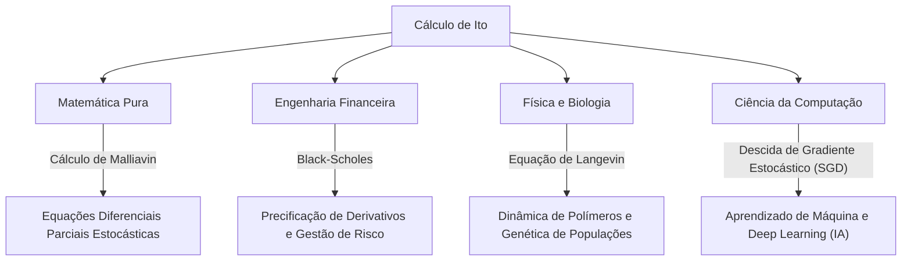

## 1. Introdução: Uma Linguagem para Descrever a Incerteza

Nosso mundo é repleto de eventos imprevisíveis e incertezas. Das flutuações nos preços das ações e do movimento de partículas no ar até o fluxo dos rios e os processos de aprendizado das redes neurais, fenômenos governados pela aleatoriedade são inumeráveis. Uma ferramenta poderosa para descrever, prever e analisar tais "movimentos aleatórios" de forma matemática e rigorosa são as **Equações Diferenciais Estocásticas (EDE)** .

E foi o grande matemático japonês **[Kiyosi Ito](https://kenji.blog/pt/p/ito-kiyosi/)** que estabeleceu a teoria dessas equações diferenciais estocásticas e ergueu o monumento conhecido como o **Lema de Ito** ou **Fórmula de Ito** . Neste artigo, mergulhamos fundo nos episódios de sua vida e no cerne de suas conquistas matemáticas, que continuam a ter um impacto imenso não apenas no mundo da matemática, mas também na economia, física e engenharia.

## 2. A Vida e o Contexto Histórico de [Kiyosi Ito](https://kenji.blog/pt/p/ito-kiyosi/)

### 2.1 Primeiros Anos e o Despertar para a Matemática

[Kiyosi Ito](https://kenji.blog/pt/p/ito-kiyosi/) nasceu em 7 de setembro de 1915, no distrito de Inabe (hoje cidade de Inabe), na província de Mie. Destacando-se academicamente desde jovem, passou pela Oitava Escola Superior (hoje Universidade de Nagoya) antes de ingressar no Departamento de Matemática da Faculdade de Ciências da Universidade Imperial de Tóquio (hoje Universidade de Tóquio).

Naquela época, na comunidade matemática japonesa, grandes matemáticos como Teiji [Takagi](https://kenji.blog/pt/p/takagi-teiji/) (fundador da Teoria dos Corpos de Classes) conduziam pesquisas de nível mundial. No entanto, a teoria das probabilidades ainda era frequentemente tratada como a "herege da matemática" ou meramente um "campo aplicado", e seu status como matemática pura ainda não estava estabelecido. No entanto, Ito ficou profundamente marcado pelos *Fundamentos da Teoria das Probabilidades*, publicados por Andrey Kolmogorov em 1933. Usando a integração de Lebesgue e a teoria da medida, Kolmogorov axiomatizou a teoria das probabilidades, colocando-a sobre rigorosos alicerces matemáticos.

### 2.2 Pesquisas Solitárias no Escritório de Estatística do Gabinete e Dificuldades da Guerra

Após se formar na universidade em 1938, Ito não permaneceu no meio acadêmico, mas assumiu um cargo no Escritório de Estatística do Gabinete. Enquanto cumpria seus deveres estatísticos como burocrata, continuou sua pesquisa independente em teoria das probabilidades durante seu tempo livre.

À medida que a Segunda Guerra Mundial se intensificava, forçando muitos acadêmicos a interromperem suas pesquisas, Ito mergulhou no mundo do pensamento puro. Foi precisamente durante este período que ele fez suas grandes descobertas. Em 1942, publicou seu primeiro artigo estabelecendo as bases para a integração estocástica e as equações diferenciais estocásticas. Vivendo com o medo do recrutamento militar e de ataques aéreos, armado apenas com papel e lápis, ele estava expandindo os limites do conhecimento humano. Esta pesquisa solitária durante sua época como burocrata mais tarde mudaria o mundo de forma fundamental.

## 3. Conquistas Matemáticas: A Criação do Cálculo Estocástico

### 3.1 Movimento Browniano e Não Diferenciabilidade

Para entender o núcleo da teoria de Ito, primeiro deve-se conhecer o **Movimento Browniano** . O movimento irregular de partículas finas descoberto pelo botânico Robert Brown em 1827 foi mais tarde explicado fisicamente por Albert Einstein (1905) e formulado matematicamente por Norbert Wiener (1923), conhecido como o processo de Wiener $W_t$.

No entanto, o processo de Wiener possuía uma propriedade matemática fatal: é **"contínuo em toda parte, mas não diferenciável em lugar nenhum"** . Sua trajetória é tão irregular que a "velocidade" (a inclinação da tangente) em qualquer momento dado não pode ser definida. Portanto, o cálculo ordinário de Newton ou Leibniz (uma teoria que descreve como uma função muda em resposta a uma mudança infinitesimal $dt$) não podia ser aplicado ao movimento browniano.

### 3.2 O Nascimento da Integral de Ito

Para resolver este problema, [Kiyosi Ito](https://kenji.blog/pt/p/ito-kiyosi/) construiu um novo conceito de integração. Esta é a **Integral de Ito** .

$$
\int_0^T f(t, \omega) dW_t(\omega)
$$

Aqui, $dW_t$ representa o incremento infinitesimal do processo de Wiener. Ito provou que esta integral podia ser estritamente definida para funções que não dependem de informações futuras (processos adaptados). Isso tornou possível descrever sistemas dinâmicos contendo ruído na forma de equações diferenciais.

### 3.3 O Lema de Ito: O Teorema Fundamental do Cálculo Estocástico

A maior conquista de Ito é a descoberta do **Lema de Ito** , uma extensão da "regra da cadeia" no cálculo ordinário.

No cálculo ordinário, uma mudança infinitesimal $df$ de uma função $f(x)$ é representada até o termo de primeira ordem da expansão de Taylor como $df = f'(x)dx$. No entanto, em um processo envolvendo flutuações estocásticas $dW_t$, as flutuações são tão severas que o termo de segunda ordem $(dW_t)^2$ se torna significativo na ordem de grandeza do tempo $dt$ (a propriedade $(dW_t)^2 = dt$).

Suponha que um processo estocástico $X_t$ siga a equação diferencial estocástica:

$$
dX_t = \mu(X_t, t) dt + \sigma(X_t, t) dW_t
$$

Aqui, $\mu$ é a deriva (tendência média) e $\sigma$ é a volatilidade (intensidade da flutuação).
Então, a mudança infinitesimal de uma função suficientemente suave $f(X_t, t)$ é expressa como:

$$
\text{Fórmula de Ito: } df(X_t, t) = \left( \frac{\partial f}{\partial t} + \mu \frac{\partial f}{\partial x} + \frac{1}{2} \sigma^2 \frac{\partial^2 f}{\partial x^2} \right) dt + \sigma \frac{\partial f}{\partial x} dW_t
$$

$$
\text{onde } \frac{1}{2} \sigma^2 \frac{\partial^2 f}{\partial x^2} \text{ é o termo de Ito.}
$$

O termo entre parênteses no lado direito desta equação é precisamente o **termo de Ito** . Ele mostra que a combinação da incerteza (variância $\sigma^2$) e a curvatura da função (segunda derivada) provoca um efeito médio de empuxo (para cima ou para baixo) em todo o sistema. É um resultado profundo, contraintuitivo, que realmente merece ser chamado de a "fórmula de Newton-Leibniz" na teoria das probabilidades.

## 4. Filosofia e Personalidade de [Kiyosi Ito](https://kenji.blog/pt/p/ito-kiyosi/)

### 4.1 "Beleza" na Matemática

[Kiyosi Ito](https://kenji.blog/pt/p/ito-kiyosi/) amava profundamente a "beleza" nos alicerces da matemática. Ele frequentemente comparava a pesquisa matemática à criação de poesia ou música. "Um excelente teorema matemático revela a estrutura simples e bela por trás de fenômenos complexos", disse ele. Para ele, as equações diferenciais estocásticas não eram apenas ferramentas de cálculo, mas obras de arte para expressar a harmonia profunda na aleatoriedade do mundo natural.

### 4.2 O Frenesi de Wall Street e sua Própria Perplexidade

Na década de 1970, Fischer Black e Myron Scholes (que mais tarde ganhariam o Prêmio Nobel de Economia) publicaram a **equação de Black-Scholes** , que usava o Lema de Ito para derivar o preço justo das opções financeiras. Isso deu origem à colossal indústria da engenharia financeira (finanças quantitativas), e todos os traders de Wall Street começaram a aprender o "Cálculo de Ito".

No entanto, o próprio Ito era um matemático puro com pouco interesse em economia ou finanças. Há uma anedota famosa de que, num jantar, ao ser informado de que suas teorias movimentavam trilhões de dólares em Wall Street, ele ficou surpreso e disse: **"Eu não tinha a menor ideia de que minha matemática pura estava sendo usada para ganhar dinheiro dessa forma."** Embora ele achasse o fato divertido, manteve durante toda a vida a postura de que seu interesse residia estritamente na "verdade matemática".

## 5. Repercussões em Outras Áreas e Aplicações Modernas

As teorias de Ito permeiam não apenas a engenharia financeira, mas todos os campos da sociedade moderna. O diagrama abaixo ilustra como o cálculo estocástico de Ito se propagou.

Particularmente nos últimos anos, a teoria de Ito voltou a ser destaque na área de aprendizado de máquina. A otimização dos processos de aprendizado no aprendizado profundo (o processo em que o ruído é adicionado na descida de gradiente estocástico) e os **Modelos de Difusão (Diffusion Models)** usados em IA de geração de imagens são aplicações diretas da teoria de Ito, resolvendo literalmente equações diferenciais estocásticas em tempo inverso. A pesquisa de [Kiyosi Ito](https://kenji.blog/pt/p/ito-kiyosi/) sustenta os próprios alicerces matemáticos da moderna revolução da IA.

## 6. Conclusão: O Primeiro Prêmio Gauss e um Legado Eterno

Em 2006, o Congresso Internacional de Matemáticos (ICM) estabeleceu o **Prêmio Gauss** para homenagear a aplicação e contribuição da matemática à sociedade, e selecionou [Kiyosi Ito](https://kenji.blog/pt/p/ito-kiyosi/), aos 90 anos, como seu primeiro ganhador. O motivo de sua seleção foi ter "lançado as bases da teoria das equações diferenciais estocásticas e suas diversas aplicações". É historicamente raro que uma busca profunda na matemática pura resulte em impactos tão amplos e práticos na sociedade humana.

[Kiyosi Ito](https://kenji.blog/pt/p/ito-kiyosi/) faleceu em 2008 aos 93 anos, mas seu nome está gravado para sempre nos livros didáticos do mundo todo como o "Lema de Ito" e a "Integral de Ito". Para nós, que vivemos em um mundo incerto, as fórmulas deixadas por [Kiyosi Ito](https://kenji.blog/pt/p/ito-kiyosi/) continuarão sendo o farol mais belo e poderoso a lançar luz sobre o caos.
