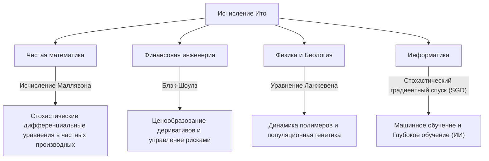

## 1. Введение: Язык для описания неопределенности

Наш мир полон непредсказуемых событий и неопределенности. От колебаний цен на акции и движения частиц в воздухе до течения рек и процессов обучения нейронных сетей — явлений, управляемых случайностью, бесчисленное множество. Мощным инструментом для математически строгого описания, прогнозирования и анализа таких «случайных движений» являются **стохастические дифференциальные уравнения (СДУ)** .

И именно великий японский математик **[Киёси Ито](https://kenji.blog/ru/p/ito-kiyosi/) ([Kiyosi Ito](https://kenji.blog/ru/p/ito-kiyosi/))** создал теорию этих стохастических дифференциальных уравнений и воздвиг монумент, известный как **Лемма Ито** или **Формула Ито** . В этой статье мы подробно рассмотрим эпизоды его жизни и суть его математических достижений, которые продолжают оказывать огромное влияние не только на математический мир, но и на экономику, физику и инженерию.

## 2. Жизнь [Киёси Ито](https://kenji.blog/ru/p/ito-kiyosi/) и исторический контекст

### 2.1 Ранние годы и пробуждение интереса к математике

[Киёси Ито](https://kenji.blog/ru/p/ito-kiyosi/) родился 7 сентября 1915 года в уезде Инабэ (ныне город Инабэ) префектуры Миэ. Выделяясь в учебе с юных лет, он окончил Восьмую высшую школу (ныне Нагойский университет), а затем поступил на математическое отделение факультета естественных наук Токийского императорского университета (ныне Токийский университет).

В то время в японском математическом сообществе великие математики, такие как Тэйдзи Такаги (основатель теории полей классов), проводили исследования мирового уровня. Однако теория вероятностей все еще часто рассматривалась как «ересь математики» или просто «прикладная область», и её статус как чистой математики еще не был утвержден. Тем не менее, Ито был глубоко поражен «Основными понятиями теории вероятностей», опубликованными Андреем Колмогоровым в 1933 году. Используя интеграл Лебега и теорию меры, Колмогоров аксиоматизировал теорию вероятностей, поставив ее на строгий математический фундамент.

### 2.2 Одинокие исследования в Статистическом бюро кабинета министров и тяготы войны

После окончания университета в 1938 году Ито не остался в научных кругах, а устроился на работу в Статистическое бюро кабинета министров. Выполняя свои статистические обязанности государственного служащего, он продолжал независимые исследования в области теории вероятностей в свободное время.

По мере того, как разгоралась Вторая мировая война, заставляя многих ученых приостановить свои исследования, Ито погрузился в мир чистой мысли. Именно в этот период он сделал свои великие открытия. В 1942 году он опубликовал свою первую статью, заложившую основы стохастического интегрирования и стохастических дифференциальных уравнений. Живя в страхе перед призывом в армию и воздушными налетами, вооружившись лишь бумагой и карандашом, он раздвигал границы человеческих знаний. Эти одинокие исследования во время его работы чиновником впоследствии фундаментально изменили мир.

## 3. Математические достижения: Создание стохастического анализа

### 3.1 Броуновское движение и недифференцируемость

Чтобы понять суть теории Ито, нужно сначала узнать о **броуновском движении** . Нерегулярное движение мелких частиц, открытое ботаником Робертом Броуном в 1827 году, было позже физически объяснено Альбертом Эйнштейном (1905) и математически сформулировано Норбертом Винером (1923), известным как винеровский процесс $W_t$.

Однако винеровский процесс имел фатальное математическое свойство: он **«всюду непрерывен, но нигде не дифференцируем»** . Его траектория настолько изломана, что «скорость» (наклон касательной) в любой заданный момент определить невозможно. Следовательно, обычное ньютоновское или лейбницевское исчисление (теория, описывающая, как функция изменяется в ответ на бесконечно малое изменение $dt$) не могло быть применено к броуновскому движению.

### 3.2 Рождение интеграла Ито

Чтобы решить эту проблему, [Киёси Ито](https://kenji.blog/ru/p/ito-kiyosi/) построил новую концепцию интегрирования. Это **интеграл Ито** .

$$
\int_0^T f(t, \omega) dW_t(\omega)
$$

Здесь $dW_t$ представляет собой бесконечно малое приращение винеровского процесса. Ито доказал, что этот интеграл можно строго определить для функций, которые не зависят от будущей информации (согласованные процессы). Это сделало возможным описание динамических систем, содержащих шум, в форме дифференциальных уравнений.

### 3.3 Лемма Ито: Основная теорема стохастического анализа

Величайшим достижением Ито является открытие **леммы Ито** , расширения «цепного правила» (правила дифференцирования сложной функции) в обычном исчислении.

В обычном исчислении бесконечно малое изменение $df$ функции $f(x)$ представляется с точностью до члена первого порядка разложения Тейлора как $df = f'(x)dx$. Однако в процессе, включающем стохастические флуктуации $dW_t$, флуктуации настолько сильны, что член второго порядка $(dW_t)^2$ становится значимым в масштабе времени $dt$ (свойство $(dW_t)^2 = dt$).

Предположим, что стохастический процесс $X_t$ следует стохастическому дифференциальному уравнению:

$$
dX_t = \mu(X_t, t) dt + \sigma(X_t, t) dW_t
$$

Здесь $\mu$ — снос (средняя тенденция), а $\sigma$ — волатильность (интенсивность флуктуаций).
Тогда бесконечно малое изменение достаточно гладкой функции $f(X_t, t)$ выражается как:

$$
\text{Формула Ито: } df(X_t, t) = \left( \frac{\partial f}{\partial t} + \mu \frac{\partial f}{\partial x} + \frac{1}{2} \sigma^2 \frac{\partial^2 f}{\partial x^2} \right) dt + \sigma \frac{\partial f}{\partial x} dW_t
$$

$$
\text{где } \frac{1}{2} \sigma^2 \frac{\partial^2 f}{\partial x^2} \text{ - слагаемое Ито.}
$$

Член в скобках в правой части этого уравнения и есть **слагаемое Ито** . Он показывает, что сочетание неопределенности (дисперсии $\sigma^2$) и кривизны функции (второй производной) приводит к среднему эффекту выталкивания (вверх или вниз) для всей системы. Это глубокий, противоречащий интуиции результат, который поистине заслуживает называться «формулой Ньютона-Лейбница» в теории вероятностей.

## 4. Философия и личность [Киёси Ито](https://kenji.blog/ru/p/ito-kiyosi/)

### 4.1 «Красота» в математике

[Киёси Ито](https://kenji.blog/ru/p/ito-kiyosi/) глубоко любил «красоту» в основах математики. Он часто сравнивал математические исследования с созданием поэзии или музыки. «Превосходная математическая теорема раскрывает простую и красивую структуру, скрывающуюся за сложными явлениями», — говорил он. Для него стохастические дифференциальные уравнения были не просто инструментами расчета, а произведениями искусства для выражения гармонии, скрытой глубоко в случайности природного мира.

### 4.2 Безумие Уолл-стрит и его собственное недоумение

В 1970-х годах Фишер Блэк и Майрон Шоулз (которые позже получили Нобелевскую премию по экономике) опубликовели **уравнение Блэка-Шоулза** , которое использовало лемму Ито для вывода справедливой цены финансовых опционов. Это породило колоссальную индустрию финансовой инженерии (количественных финансов), и трейдеры Уолл-стрит все как один начали изучать «исчисление Ито».

Однако сам Ито был чистым математиком, мало интересовавшимся экономикой или финансами. Существует известный анекдот о том, что на званом обеде, когда ему сообщили, что его теории управляют триллионами долларов на Уолл-стрит, он удивился и сказал: **«Я совершенно не подозревал, что моя чистая математика используется для зарабатывания денег таким образом».** Хотя он находил этот факт забавным, он на протяжении всей своей жизни сохранял позицию, что его интересы лежат строго в области «математической истины».

## 5. Влияние на другие области и современные приложения

Теории Ито пронизывают не только финансовую инженерию, но и все сферы современного общества. Приведенная ниже диаграмма иллюстрирует, как распространилось стохастическое исчисление Ито.

В частности, в последние годы теория Ито снова оказалась в центре внимания в области машинного обучения. Оптимизация процессов обучения в глубоком обучении (процесс, при котором шум добавляется в стохастический градиентный спуск) и **диффузионные модели (Diffusion Models)** , используемые в ИИ для генерации изображений, являются прямым применением теории Ито, буквально решая стохастические дифференциальные уравнения в обратном времени. Исследования [Киёси Ито](https://kenji.blog/ru/p/ito-kiyosi/) поддерживают сами математические основы современной революции ИИ.

## 6. Заключение: Первая премия Гаусса и вечное наследие

В 2006 году Международный конгресс математиков (ICM) учредил **Премию Гаусса** , чтобы отметить применение и вклад математики в жизнь общества, и выбрал 90-летнего [Киёси Ито](https://kenji.blog/ru/p/ito-kiyosi/) ее первым лауреатом. Причиной его выбора стало «заложение основ теории стохастических дифференциальных уравнений и ее разнообразных приложений». В истории редко бывает так, чтобы глубокое изучение чистой математики привело к столь широким и практическим последствиям для человеческого общества.

[Киёси Ито](https://kenji.blog/ru/p/ito-kiyosi/) скончался в 2008 году в возрасте 93 лет, но его имя навсегда вписано в учебники по всему миру как «Лемма Ито» и «Интеграл Ито». Для нас, живущих в нестабильном мире, формулы, оставленные [Киёси Ито](https://kenji.blog/ru/p/ito-kiyosi/), навсегда останутся самым красивым и мощным маяком, проливающим свет во тьме хаоса.
