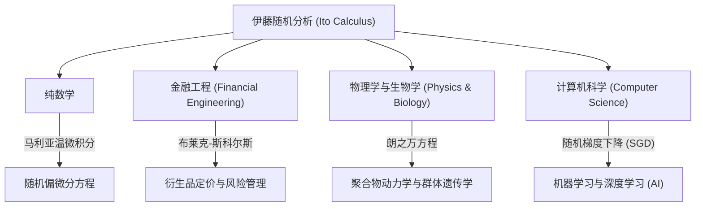

## 1. 引言：描述不确定性的语言

我们生活的世界充满了不可预测的事件和不确定性。从股价的波动、空气中微粒的运动、河流的流向，甚至到神经网络的学习过程，由随机性主导的现象不胜枚举。为了在数学上严谨地描述、预测和分析这种“随机运动”，一个强大的工具就是 **随机微分方程 (Stochastic Differential Equations, SDE)** 。

而建立这种随机微分方程理论，并树立了被称为 **“伊藤引理 (Ito's Lemma)”** 或 **“伊藤公式 (Ito's Formula)”** 这一丰碑的，正是日本伟大的数学家 **[伊藤清](https://kenji.blog/zh-cn/p/ito-kiyosi/) ([Kiyosi Ito](https://kenji.blog/zh-cn/p/ito-kiyosi/))** 。在本文中，我们将深入探讨他一生的轶事以及他数学成就的核心，这些成就不仅对数学界，而且对经济学、物理学和工程学持续产生着深远的影响。

## 2. [伊藤清](https://kenji.blog/zh-cn/p/ito-kiyosi/)的一生与时代背景

### 2.1 早年生活与数学启蒙

[伊藤清](https://kenji.blog/zh-cn/p/ito-kiyosi/)于1915年（大正4年）9月7日出生于三重县员弁郡（现为员弁市）。他从小就学业出众，经过旧制第八高等学校（现为名古屋大学）后，进入东京帝国大学（现为东京大学）理学部数学系就读。

当时的日本数学界，以[高木贞治](/zh-cn/p/takagi-teiji/)（类域论的创始人）为首的伟大数学家们正在进行世界级的研究。然而，概率论在当时仍然往往被视为“数学的异端”或仅仅是“应用的一个分支”，其作为纯粹数学的地位尚未确立。但是，安德烈·柯尔莫哥洛夫 (Andrey Kolmogorov) 在1933年发表的《概率论基础》给了伊藤强烈的震撼。柯尔莫哥洛夫利用勒贝格积分和测度论将概率论公理化，将其建立在了严谨的数学基础之上。

### 2.2 在内阁统计局的孤独研究与战时的苦难

1938年大学毕业后，伊藤并没有留在大学，而是就职于内阁统计局。在作为官僚处理统计实务的同时，他利用下班后的时间自学并继续概率论的研究。

随着第二次世界大战的加剧，许多学者被迫中断了研究，而伊藤却沉浸在纯粹思考的世界中。正是在这段时期，他做出了伟大的发现。1942年，他发表了第一篇奠定随机积分和随机微分方程基础的论文。在与兵役和空袭的恐惧为伴的环境中，仅凭纸和笔，他正在拓展人类知识的边界。这段官僚时期的孤独研究，后来从根本上改变了世界。

## 3. 数学成就：随机分析学的创立

### 3.1 布朗运动与不可导性

要理解伊藤理论的核心，首先必须了解 **布朗运动 (Brownian Motion)** 。1827年植物学家罗伯特·布朗发现的微粒的不规则运动，后来在物理学上由阿尔伯特·爱因斯坦（1905年）解释，并在数学上由诺伯特·维纳（1923年）公式化（称为维纳过程 $W_t$）。

然而，维纳过程有一个致命的数学性质，那就是 **“处处连续，但处处不可导”** 。它的轨迹极其曲折，以至于在任何给定时刻的“速度”（切线的斜率）都无法定义。因此，普通的牛顿和莱布尼茨微积分学（描述函数如何响应微小变化 $dt$ 的理论）无法应用于布朗运动。

### 3.2 伊藤积分的诞生

为了解决这个问题，[伊藤清](https://kenji.blog/zh-cn/p/ito-kiyosi/)构建了一种新的积分概念。这就是 **伊藤积分 (Ito Integral)** 。

$$
\int_0^T f(t, \omega) dW_t(\omega)
$$

这里，$dW_t$ 表示维纳过程的微小增量。伊藤证明了，对于不依赖于未来信息的（适应性）函数，这种积分是可以被严格定义的。这使得用微分方程的形式来描述包含噪声的动态系统成为可能。

### 3.3 伊藤引理：随机分析的基本定理

伊藤最大的功绩是发现了 **伊藤引理** ，它是对普通微积分中“链式法则”的扩展。

在普通微积分中，函数 $f(x)$ 的微小变化 $df$ 通过泰勒展开的一阶项表示为 $df = f'(x)dx$。然而，在伴随随机波动 $dW_t$ 的过程中，波动非常剧烈，以至于二阶项 $(dW_t)^2$ 在时间 $dt$ 的量级上产生了显著影响（即 $(dW_t)^2 = dt$ 的性质）。

假设一个随机过程 $X_t$ 遵循以下随机微分方程：

$$
dX_t = \mu(X_t, t) dt + \sigma(X_t, t) dW_t
$$

这里，$\mu$ 是漂移（平均趋势），$\sigma$ 是波动率（波动的剧烈程度）。
此时，足够平滑的函数 $f(X_t, t)$ 的微小变化表示如下：

$$
\text{伊藤公式 (Ito's Formula)：} df(X_t, t) = \left( \frac{\partial f}{\partial t} + \mu \frac{\partial f}{\partial x} + \frac{1}{2} \sigma^2 \frac{\partial^2 f}{\partial x^2} \right) dt + \sigma \frac{\partial f}{\partial x} dW_t
$$

$$
\text{其中，} \frac{1}{2} \sigma^2 \frac{\partial^2 f}{\partial x^2} \text{ 是伊藤项 (Ito term)。}
$$

这个公式右侧括号内的项正是 **“伊藤项 (Ito term)”** 。它表明，不确定性（方差 $\sigma^2$）与函数的弯曲程度（二阶导数）相结合，会给整个系统带来平均的向上（或向下）推动效应。这是一个反直觉而深奥的结果，完全无愧于概率论中“牛顿-莱布尼茨公式”的称号。

## 4. [伊藤清](https://kenji.blog/zh-cn/p/ito-kiyosi/)的哲学与人物形象

### 4.1 数学中的“美”

[伊藤清](https://kenji.blog/zh-cn/p/ito-kiyosi/)深深热爱着数学底层的“美”。他经常将数学研究比作诗歌或音乐的创作。他说：“优秀的数学定理揭示了复杂现象背后简单而美丽的结构。”对他来说，随机微分方程不仅是计算工具，更是表达自然界随机性深处和谐的艺术品。

### 4.2 华尔街的狂热与他本人的困惑

在20世纪70年代，费希尔·布莱克和迈伦·斯科尔斯（后来获得诺贝尔经济学奖）发表了 **布莱克-斯科尔斯方程** ，该方程利用伊藤引理推导出金融期权的合理价格。这催生了金融工程（量化金融）这一庞大的产业，华尔街的交易员们开始集体学习“伊藤微积分 (Ito Calculus)”。

然而，伊藤本人是一位纯粹数学家，对经济和金融几乎没有兴趣。有一个著名的轶事是，在一次晚宴上，当他得知自己的理论在华尔街牵动着数万亿美元的资金时，他惊讶地说： **“我完全不知道我纯粹的数学被用在那种赚钱的事情上。”** 尽管他觉得这个事实很有趣，但他一生都保持着一种态度，即他的兴趣完全在于“数学的真理”。

## 5. 对其他领域的波及与现代应用

伊藤的理论不仅停留在金融工程领域，还渗透到了现代社会的各个领域。下图展示了伊藤的随机分析学是如何波及各个领域的。

特别是在近年来，伊藤的理论在机器学习领域重新备受瞩目。深度学习中的学习过程优化（在随机梯度下降中加入噪声的过程），以及用于图像生成的AI中的 **扩散模型 (Diffusion Models)** ，正是解逆时间随机微分方程这一伊藤理论的直接应用。可以说，[伊藤清](https://kenji.blog/zh-cn/p/ito-kiyosi/)的研究支撑着现代人工智能革命的数学基础。

## 6. 结语：首届高斯奖与永恒的遗产

2006年，国际数学家大会 (ICM) 设立了 **高斯奖** ，以表彰数学对社会的广泛应用和贡献，并评选出90岁的[伊藤清](https://kenji.blog/zh-cn/p/ito-kiyosi/)为首届获奖者。入选理由是“建立了随机微分方程的基础理论及其广泛的应用”。对纯粹数学的深入探索，最终对人类社会产生了如此广泛和实用的影响，这在历史上是罕见的。

[伊藤清](https://kenji.blog/zh-cn/p/ito-kiyosi/)于2008年去世，享年93岁，但他的名字作为“伊藤引理 (Ito's Lemma)”和“伊藤积分 (Ito Integral)”永远镌刻在世界的教科书中。对于生活在充满不确定性的世界中的我们来说，[伊藤清](https://kenji.blog/zh-cn/p/ito-kiyosi/)留下的公式，将永远是照亮混沌的最美丽、最强大的灯塔。
