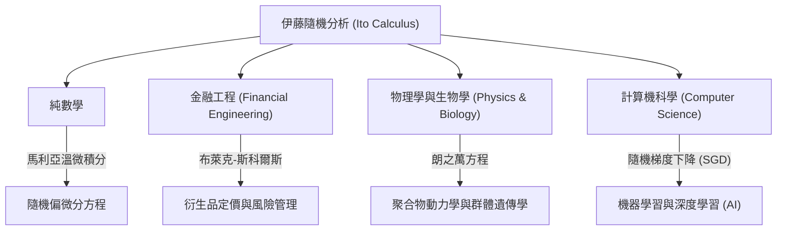

## 1. 引言：描述不確定性的語言

我們生活的世界充滿了不可預測的事件和不確定性。從股價的波動、空氣中微粒的運動、河流的流向，甚至到神經網絡的學習過程，由隨機性主導的現象不勝枚舉。為了在數學上嚴謹地描述、預測和分析這種「隨機運動」，一個強大的工具就是 **隨機微分方程 (Stochastic Differential Equations, SDE)** 。

而建立這種隨機微分方程理論，並樹立了被稱為 **「伊藤引理 (Ito's Lemma)」** 或 **「伊藤公式 (Ito's Formula)」** 這一豐碑的，正是日本偉大的數學家 **[伊藤清](https://kenji.blog/zh-tw/p/ito-kiyosi/) ([Kiyosi Ito](https://kenji.blog/zh-tw/p/ito-kiyosi/))** 。在本文中，我們將深入探討他一生的軼事以及他數學成就的核心，這些成就不僅對數學界，而且對經濟學、物理學和工程學持續產生著深遠的影響。

## 2. [伊藤清](https://kenji.blog/zh-tw/p/ito-kiyosi/)的一生與時代背景

### 2.1 早年生活與數學啟蒙

[伊藤清](https://kenji.blog/zh-tw/p/ito-kiyosi/)於1915年（大正4年）9月7日出生於三重縣員弁郡（現為員弁市）。他從小就學業出眾，經過舊制第八高等學校（現為名古屋大學）後，進入東京帝國大學（現為東京大學）理學部數學系就讀。

當時的日本數學界，以[高木貞治](https://kenji.blog/zh-tw/p/takagi-teiji/)（類域論的創始人）為首的偉大數學家們正在進行世界級的研究。然而，機率論在當時仍然往往被視為「數學的異端」或僅僅是「應用的一個分支」，其作為純粹數學的地位尚未確立。但是，安德烈·柯爾莫哥洛夫 (Andrey Kolmogorov) 在1933年發表的《機率論基礎》給了伊藤強烈的震撼。柯爾莫哥洛夫利用勒貝格積分和測度論將機率論公理化，將其建立在了嚴謹的數學基礎之上。

### 2.2 在內閣統計局的孤獨研究與戰時的苦難

1938年大學畢業後，伊藤並沒有留在大學，而是就職於內閣統計局。在作為官僚處理統計實務的同時，他利用下班後的時間自學並繼續機率論的研究。

隨著第二次世界大戰的加劇，許多學者被迫中斷了研究，而伊藤卻沉浸在純粹思考的世界中。正是在這段時期，他做出了偉大的發現。1942年，他發表了第一篇奠定隨機積分和隨機微分方程基礎的論文。在與兵役和空襲的恐懼為伴的環境中，僅憑紙和筆，他正在拓展人類知識的邊界。這段官僚時期的孤獨研究，後來從根本上改變了世界。

## 3. 數學成就：隨機分析學的創立

### 3.1 布朗運動與不可導性

要理解伊藤理論的核心，首先必須了解 **布朗運動 (Brownian Motion)** 。1827年植物學家羅伯特·布朗發現的微粒的不規則運動，後來在物理學上由阿爾伯特·愛因斯坦（1905年）解釋，並在數學上由諾伯特·維納（1923年）公式化（稱為維納過程 $W_t$）。

然而，維納過程有一個致命的數學性質，那就是 **「處處連續，但處處不可導」** 。它的軌跡極其曲折，以至於在任何給定時刻的「速度」（切線的斜率）都無法定義。因此，普通的牛頓和萊布尼茨微積分學（描述函數如何響應微小變化 $dt$ 的理論）無法應用於布朗運動。

### 3.2 伊藤積分的誕生

為了解決這個問題，[伊藤清](https://kenji.blog/zh-tw/p/ito-kiyosi/)構建了一種新的積分概念。這就是 **伊藤積分 (Ito Integral)** 。

$$
\int_0^T f(t, \omega) dW_t(\omega)
$$

這裡，$dW_t$ 表示維納過程的微小增量。伊藤證明了，對於不依賴於未來信息的（適應性）函數，這種積分是可以被嚴格定義的。這使得用微分方程的形式來描述包含噪聲的動態系統成為可能。

### 3.3 伊藤引理：隨機分析的基本定理

伊藤最大的功績是發現了 **伊藤引理** ，它是對普通微積分中「連鎖律」的擴展。

在普通微積分中，函數 $f(x)$ 的微小變化 $df$ 透過泰勒展開的一階項表示為 $df = f'(x)dx$。然而，在伴隨隨機波動 $dW_t$ 的過程中，波動非常劇烈，以至於二階項 $(dW_t)^2$ 在時間 $dt$ 的量級上產生了顯著影響（即 $(dW_t)^2 = dt$ 的性質）。

假設一個隨機過程 $X_t$ 遵循以下隨機微分方程：

$$
dX_t = \mu(X_t, t) dt + \sigma(X_t, t) dW_t
$$

這裡，$\mu$ 是漂移（平均趨勢），$\sigma$ 是波動率（波動的劇烈程度）。
此時，足夠平滑的函數 $f(X_t, t)$ 的微小變化表示如下：

$$
\text{伊藤公式 (Ito's Formula)：} df(X_t, t) = \left( \frac{\partial f}{\partial t} + \mu \frac{\partial f}{\partial x} + \frac{1}{2} \sigma^2 \frac{\partial^2 f}{\partial x^2} \right) dt + \sigma \frac{\partial f}{\partial x} dW_t
$$

$$
\text{其中，} \frac{1}{2} \sigma^2 \frac{\partial^2 f}{\partial x^2} \text{ 是伊藤項 (Ito term)。}
$$

這個公式右側括號內的項正是 **「伊藤項 (Ito term)」** 。它表明，不確定性（變異數 $\sigma^2$）與函數的彎曲程度（二階導數）相結合，會給整個系統帶來平均的向上（或向下）推動效應。這是一個反直覺而深奧的結果，完全無愧於機率論中「牛頓-萊布尼茨公式」的稱號。

## 4. [伊藤清](https://kenji.blog/zh-tw/p/ito-kiyosi/)的哲學與人物形象

### 4.1 數學中的「美」

[伊藤清](https://kenji.blog/zh-tw/p/ito-kiyosi/)深深熱愛著數學底層的「美」。他經常將數學研究比作詩歌或音樂的創作。他說：「優秀的數學定理揭示了複雜現象背後簡單而美麗的結構。」對他來說，隨機微分方程不僅是計算工具，更是表達自然界隨機性深處和諧的藝術品。

### 4.2 華爾街的狂熱與他本人的困惑

在20世紀70年代，費雪·布萊克和邁倫·斯科爾斯（後來獲得諾貝爾經濟學獎）發表了 **布萊克-斯科爾斯方程** ，該方程利用伊藤引理推導出金融期權的合理價格。這催生了金融工程（量化金融）這一龐大的產業，華爾街的交易員們開始集體學習「伊藤微積分 (Ito Calculus)」。

然而，伊藤本人是一位純粹數學家，對經濟和金融幾乎沒有興趣。有一個著名的軼事是，在一次晚宴上，當他得知自己的理論在華爾街牽動著數兆美元的資金時，他驚訝地說： **「我完全不知道我純粹的數學被用在那種賺錢的事情上。」** 儘管他覺得這個事實很有趣，但他一生都保持著一種態度，即他的興趣完全在於「數學的真理」。

## 5. 對其他領域的波及與現代應用

伊藤的理論不僅停留在金融工程領域，還滲透到了現代社會的各個領域。下圖展示了伊藤的隨機分析學是如何波及各個領域的。

特別是在近年來，伊藤的理論在機器學習領域重新備受矚目。深度學習中的學習過程優化（在隨機梯度下降中加入噪聲的過程），以及用於圖像生成的AI中的 **擴散模型 (Diffusion Models)** ，正是解逆時間隨機微分方程這一伊藤理論的直接應用。可以說，[伊藤清](https://kenji.blog/zh-tw/p/ito-kiyosi/)的研究支撐著現代人工智慧革命的數學基礎。

## 6. 結語：首屆高斯獎與永恆的遺產

2006年，國際數學家大會 (ICM) 設立了 **高斯獎** ，以表彰數學對社會的廣泛應用和貢獻，並評選出90歲的[伊藤清](https://kenji.blog/zh-tw/p/ito-kiyosi/)為首屆獲獎者。入選理由是「建立了隨機微分方程的基礎理論及其廣泛的應用」。對純粹數學的深入探索，最終對人類社會產生了如此廣泛和實用的影響，這在歷史上是罕見的。

[伊藤清](https://kenji.blog/zh-tw/p/ito-kiyosi/)於2008年去世，享年93歲，但他的名字作為「伊藤引理 (Ito's Lemma)」和「伊藤積分 (Ito Integral)」永遠鐫刻在世界的教科書中。對於生活在充滿不確定性的世界中的我們來說，[伊藤清](https://kenji.blog/zh-tw/p/ito-kiyosi/)留下的公式，將永遠是照亮混沌的最美麗、最強大的燈塔。
