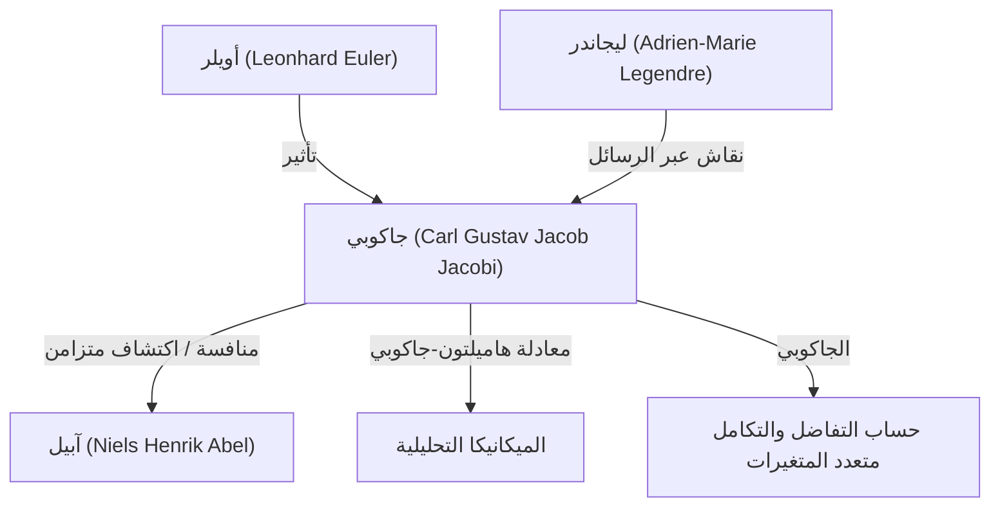

# 1. مقدمة: باحث عن الفكر الخالص

كان [كارل غوستاف جاكوب جاكوبي](https://kenji.blog/ar/p/jacobi/) (1804–1851) **عالم رياضيات ألماني** في القرن التاسع عشر قدم مساهمات حاسمة في مجالات متنوعة مثل الجبر، التحليل، نظرية الأعداد، والميكانيكا. وإلى جانب نيلس هنريك آبيل، يُحتفى به كـ "مكتشف الدوال الإهليلجية"، وهو يحمل اسم "الجاكوبي" (محدد جاكوبي) الذي نواجهه كثيرًا في حساب التفاضل والتكامل متعدد المتغيرات اليوم.

لقد كان يقدّر جمال الرياضيات بحد ذاتها وشرف العقل البشري فوق المنفعة العملية. في هذا المقال، سنتعمق في حياة جاكوبي، إنجازاته الرياضية الكبرى، والقصص الشهيرة التي تركها وراءه.

# 2. حياته المبكرة وتعليمه

ولد جاكوبي في 10 ديسمبر 1804 في بوتسدام، مملكة بروسيا (ألمانيا الحالية)، لعائلة مصرفية يهودية ثرية. أصبح شقيقه الأكبر، موريتز فون جاكوبي، لاحقًا فيزيائيًا ومهندسًا بارزًا، تاركًا بصمته في تطوير المحركات الكهربائية.

أظهر جاكوبي علامات النبوغ المبكر منذ صغره، حيث التحق بالجمنازيوم (المدرسة الثانوية) في بوتسدام وتفوق بسرعة على الطلاب الأكبر سنًا. في سن الثانية عشرة، كان يمتلك بالفعل القدرة الأكاديمية لدخول الجامعة، ولكن بسبب قيود العمر، لم يتمكن من الالتحاق بجامعة برلين حتى بلغ السادسة عشرة. في غضون ذلك، علم نفسه الرياضيات المتقدمة من خلال قراءة أعمال الأساتذة السابقين مثل أويلر ولاغرانج.

عند التحاقه بجامعة برلين عام 1821، درس أيضًا الفلسفة وفقه اللغة، لكنه تخصص في النهاية في الرياضيات. حصل على الدكتوراه في عام 1825 واعتنق المسيحية في نفس العام، مما مهد الطريق لمهنة التدريس في الجامعة (في بروسيا في ذلك الوقت، كان من الصعب للغاية على اليهود أن يصبحوا أساتذة متفرغين).

# 3. العصر الذهبي في جامعة كونيغسبرغ وأسلوب التدريس

في عام 1826، أصبح جاكوبي محاضرًا في جامعة كونيغسبرغ، وتمت ترقيته إلى أستاذ مشارك في عام 1827، وإلى أستاذ متفرغ في عام 1829 في سن مبكرة بشكل ملحوظ (25 عامًا). أصبحت هذه الفترة في كونيغسبرغ الوقت الأكثر إنتاجية وتألقًا في مسيرته البحثية.

كان جاكوبي أيضًا معلمًا استثنائيًا. لقد قدم تعليمًا مبتكرًا بأسلوب **الندوة**، حيث دمج أبحاثه المتطورة مباشرة في محاضراته. لم يتعلم طلابه فقط من الكتب المدرسية، بل تلقوا تدريبًا كباحثين من خلال معالجة المشكلات غير المحلولة معه. كان هذا النهج التعليمي ناجحًا للغاية وأنتج العديد من علماء الرياضيات البارزين في الجيل التالي، بما في ذلك رودولف كليبش ولودفيغ أوتو هيس.

# 4. تطوير الدوال الإهليلجية والمنافسة مع آبيل

يعد بناء نظرية الدوال الإهليلجية من أعظم إنجازات جاكوبي. تظهر التكاملات الإهليلجية عند حساب حركة البندول أو طول قوس القطع الناقص، وقد درسها ليجاندر وغيره لعقود.

قدم جاكوبي المنظور الرائد المتمثل في النظر إلى الدالة العكسية للتكامل. بشكل ملحوظ، اكتشف العبقري النرويجي الشاب **آبيل** نفس النهج بشكل مستقل تمامًا في نفس الوقت تقريبًا. اكتشف كل من جاكوبي وآبيل الدورية المزدوجة للدوال الإهليلجية، مما أحدث ثورة في هذا المجال.

$$ \text{sn}(u, k), \quad \text{cn}(u, k), \quad \text{dn}(u, k) $$

عرّف جاكوبي هذه الدوال الإهليلجية الجاكوبية وقدم أيضًا أداة تحليلية جديدة وقوية تسمى "دوال ثيتا". يتم تعريف دالة ثيتا لجاكوبي $\vartheta(z, \tau)$ على النحو التالي:

$$ \vartheta(z, \tau) = \sum_{n=-\infty}^{\infty} e^{\pi i n^2 \tau + 2 \pi i n z} $$

في عام 1829، نشر رائعته، *Fundamenta nova theoriae functionum ellipticarum* (أسس جديدة لنظرية الدوال الإهليلجية)، مكملًا إضفاء الطابع النظامي على هذا المجال. ذُهل عالم الرياضيات الفرنسي ليجاندر عندما علم بإنجازات جاكوبي وآبيل، اللذين كانا أصغر منه بكثير، وأشاد بهما بشدة.

# 5. الجاكوبي (محدد جاكوبي) والتحليل متعدد المتغيرات

في دورات التفاضل والتكامل الجامعية، عند التعرف على تغيير المتغيرات في التكاملات المتعددة (على سبيل المثال، تحويلات الإحداثيات القطبية)، يواجه الجميع مصطلح "الجاكوبي". وهذا ينبع أيضًا من جاكوبي.

عند النظر في تحويل من $n$ متغيرات $x_1, x_2, \dots, x_n$ إلى $n$ متغيرات $y_1, y_2, \dots, y_n$ ، فإن محدد المصفوفة المكونة من مشتقاتها الجزئية يسمى محدد جاكوبي.

$$ J = \det \begin{pmatrix} \frac{\partial y_1}{\partial x_1} & \cdots & \frac{\partial y_1}{\partial x_n} \\ \vdots & \ddots & \vdots \\ \frac{\partial y_m}{\partial x_1} & \cdots & \frac{\partial y_m}{\partial x_n} \end{pmatrix} $$

أظهر جاكوبي بوضوح أن هذا المحدد يمثل عامل قياس عناصر الحجم تحت تغيير المتغيرات، وأثبت دوره المركزي في تعميم نظرية الدالة العكسية ونظرية الدالة الضمنية.

# 6. الميكانيكا التحليلية: معادلة هاميلتون-جاكوبي

امتدت اهتمامات جاكوبي إلى ما هو أبعد من الرياضيات البحتة لتشمل الفيزياء، وخاصة الميكانيكا التحليلية. عمل جاكوبي على تنقيح نظام الميكانيكا الذي صاغه عالم الرياضيات الأيرلندي ويليام روان هاميلتون.

لقد اشتق **معادلة هاميلتون-جاكوبي**، وهي معادلة تفاضلية جزئية لتحديد حركة النظام الميكانيكي.

$$ H\left(q_i, \frac{\partial S}{\partial q_i}, t\right) + \frac{\partial S}{\partial t} = 0 $$

هنا، $H$ هو الهاميلتوني (الطاقة الكلية للنظام)، و $S$ هو الفعل (أو وظيفة هاميلتون الرئيسية). جعلت هذه المعادلة من الممكن تفسير المشاكل في الميكانيكا بشكل مشابه لانتشار جبهات الموجة في البصريات، مما شكل أساسًا نظريًا مهمًا لولادة ميكانيكا الكم (خاصة معادلة شرودنغر) في القرن العشرين.

# 7. مساهمات في نظرية الأعداد

كان جاكوبي عبقريًا أيضًا في تطبيق إتقانه للدوال الإهليلجية ودوال ثيتا على مسائل تبدو غير مرتبطة بنظرية الأعداد.

هناك نظرية شهيرة تسمى نظرية المربعات الأربعة للاغرانج (يمكن تمثيل كل عدد طبيعي كمجموع أربعة مربعات صحيحة). باستخدام متطابقات دوال ثيتا، اشتق جاكوبي صيغة تعطي "عدد الطرق" الدقيقة التي يمكن بها تمثيل عدد طبيعي $n$ كمجموع أربعة مربعات.

$$ r_4(n) = 8 \sum_{d|n, 4\nmid d} d $$

كان لهذا النهج المتمثل في الكشف عن خصائص عميقة في نظرية الأعداد باستخدام الطرق التحليلية تأثير هائل على التطور اللاحق لنظرية الأعداد التحليلية.

# 8. شخصيته والقصة الشهيرة "شرف العقل البشري"

توجد أشهر قصة توضح موقف جاكوبي تجاه الرياضيات في رسالته إلى عالم الرياضيات الفرنسي جوزيف فورييه. كان فورييه قد جادل بأن "الهدف الرئيسي للرياضيات هو المنفعة العامة وتفسير الظواهر الطبيعية". ردا على ذلك، اعترض جاكوبي:

> "صحيح أن السيد فورييه كان يرى أن الهدف الرئيسي للرياضيات هو المنفعة العامة وتفسير الظواهر الطبيعية؛ ولكن كان ينبغي لفيلسوف مثله أن يعرف أن الهدف الوحيد للعلم هو **شرف العقل البشري**، وأنه تحت هذا العنوان، فإن سؤالًا حول الأرقام يساوي سؤالًا حول نظام العالم."

يظل هذا الاقتباس أحد أقوى وأجمل التصريحات التي تدافع عن وجود الرياضيات البحتة، ولا يزال علماء الرياضيات يروونه على نطاق واسع اليوم.

في عام 1843، عانى جاكوبي من مرض السكري بسبب الإرهاق وذهب إلى إيطاليا للتعافي، حيث تلقى مساعدة مالية من العائلة المالكة البروسية لهذه الرحلة. عاد لاحقًا إلى برلين لمواصلة أبحاثه لكنه تورط في الاضطرابات السياسية لثورة 1848، وواجه صعوبات مثل التعليق المؤقت لراتبه.

# 9. سنواته الأخيرة وإرثه

عانت السنوات الأخيرة من حياة جاكوبي من مشاكل صحية وصعوبات مالية. توفي متأثرا بمرض الجدري في برلين يوم 18 فبراير 1851 في سن مبكرة (46 عاما).

ومع ذلك، فإن الإرث الذي تركه وراءه لا يقاس. أصبحت نظرية الدوال الإهليلجية موضوعًا مركزيًا في رياضيات القرن التاسع عشر، وتستمر معادلة هاميلتون-جاكوبي في دعم أسس الفيزياء. وفوق كل ذلك، لا يزال تفانيه في السعي وراء الحقيقة من أجل "شرف العقل البشري" يلهم العلماء عبر العصور.

يقع قبره في مقبرة الثالوث المقدس في برلين، حيث لا يزال العديد من عشاق الرياضيات يزورونه لتقديم احترامهم. إن حدس جاكوبي الرياضي، وبراعته الحسابية الهائلة، ومنظوره الواسع الذي يمتد عبر مجالات متعددة، تجعله بلا شك أحد أعظم النجوم في تاريخ الرياضيات.
