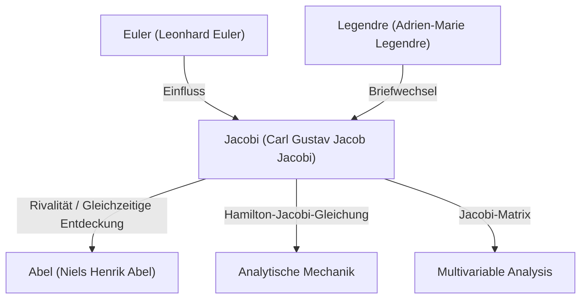

# 1. Einführung: Ein Sucher des reinen Denkens

[Carl Gustav Jacob Jacobi](https://kenji.blog/de/p/jacobi/) (1804–1851) war ein **deutscher Mathematiker** des 19. Jahrhunderts, der entscheidende Beiträge zu verschiedenen Gebieten wie Algebra, Analysis, Zahlentheorie und Mechanik leistete. Neben [Niels Henrik Abel](/de/p/abel/) wird er als "Entdecker der elliptischen Funktionen" gefeiert, und er ist der Namensgeber der "[Jacobi](https://kenji.blog/de/p/jacobi/)-Matrix" (Funktionaldeterminante), der wir heute in der multivariablen Analysis häufig begegnen.

Er schätzte die Schönheit der Mathematik selbst und die Ehre des menschlichen Geistes mehr als den praktischen Nutzen. In diesem Artikel werden wir tief in [Jacobi](https://kenji.blog/de/p/jacobi/)s Leben, seine wichtigsten mathematischen Errungenschaften und die berühmten Episoden, die er hinterließ, eintauchen.

# 2. Frühes Leben und Ausbildung

[Jacobi](https://kenji.blog/de/p/jacobi/) wurde am 10. Dezember 1804 in Potsdam, Königreich Preußen (heutiges Deutschland), in eine wohlhabende jüdische Bankiersfamilie geboren. Sein älterer Bruder, Moritz von [Jacobi](https://kenji.blog/de/p/jacobi/), wurde später ebenfalls ein prominenter Physiker und Ingenieur und hinterließ seine Spuren bei der Entwicklung von Elektromotoren.

[Jacobi](https://kenji.blog/de/p/jacobi/) zeigte schon in jungen Jahren Anzeichen von frühreifem Genie, trat in das Gymnasium in Potsdam ein und übertraf schnell die älteren Schüler. Im Alter von 12 Jahren hatte er bereits die akademischen Fähigkeiten, um eine Universität zu besuchen, konnte sich jedoch aufgrund von Altersbeschränkungen erst mit 16 Jahren an der Universität Berlin einschreiben. In der Zwischenzeit brachte er sich selbst höhere Mathematik bei, indem er die Werke vergangener Meister wie Euler und [Lagrange](https://kenji.blog/de/p/lagrange/) las.

Als er 1821 in die Universität Berlin eintrat, studierte er auch Philosophie und Philologie, spezialisierte sich aber schließlich auf Mathematik. Er promovierte 1825 und konvertierte im selben Jahr zum Christentum, was ihm den Weg für eine Lehrkarriere an der Universität ebnete (in Preußen war es damals für Juden äußerst schwierig, ordentlicher Professor zu werden).

# 3. Das Goldene Zeitalter an der Universität Königsberg und sein Unterrichtsstil

1826 wurde [Jacobi](https://kenji.blog/de/p/jacobi/) Dozent an der Universität Königsberg, 1827 zum außerordentlichen Professor und 1829 im bemerkenswert jungen Alter von 25 Jahren zum ordentlichen Professor befördert. Diese Zeit in Königsberg wurde zur produktivsten und brillantesten Phase seiner Forschungskarriere.

[Jacobi](https://kenji.blog/de/p/jacobi/) war auch ein außergewöhnlicher Pädagoge. Er führte eine innovative **seminarartige** Ausbildung ein und integrierte seine eigene Spitzenforschung direkt in seine Vorlesungen. Seine Studenten lernten nicht nur aus Lehrbüchern, sondern wurden als Forscher ausgebildet, indem sie ungelöste Probleme gemeinsam mit ihm angingen. Dieser pädagogische Ansatz war sehr erfolgreich und brachte viele herausragende Mathematiker der nächsten Generation hervor, darunter Rudolf Clebsch und Ludwig Otto Hesse.

# 4. Entwicklung der elliptischen Funktionen und die Rivalität mit [Abel](https://kenji.blog/de/p/abel/)

Eine von [Jacobi](https://kenji.blog/de/p/jacobi/)s größten Errungenschaften ist der Aufbau der Theorie der elliptischen Funktionen. Elliptische Integrale treten bei der Berechnung der Bewegung eines Pendels oder der Bogenlänge einer Ellipse auf, und [Legendre](https://kenji.blog/de/p/legendre/) und andere hatten sie jahrzehntelang untersucht.

[Jacobi](https://kenji.blog/de/p/jacobi/) führte die bahnbrechende Perspektive ein, die Umkehrfunktion des Integrals zu betrachten. Bemerkenswerterweise hatte das junge norwegische Genie **Abel** fast zur gleichen Zeit völlig unabhängig denselben Ansatz entdeckt. Sowohl Jacobi als auch [Abel](https://kenji.blog/de/p/abel/) entdeckten die doppelte Periodizität elliptischer Funktionen und revolutionierten das Feld.

$$ \text{sn}(u, k), \quad \text{cn}(u, k), \quad \text{dn}(u, k) $$

[Jacobi](https://kenji.blog/de/p/jacobi/) definierte diese Jacobischen elliptischen Funktionen und führte ferner ein neues leistungsfähiges analytisches Werkzeug ein, das "Theta-Funktionen" genannt wird. [Jacobi](https://kenji.blog/de/p/jacobi/)s Theta-Funktion $\vartheta(z, \tau)$ ist wie folgt definiert:

$$ \vartheta(z, \tau) = \sum_{n=-\infty}^{\infty} e^{\pi i n^2 \tau + 2 \pi i n z} $$

1829 veröffentlichte er sein Meisterwerk, *Fundamenta nova theoriae functionum ellipticarum* (Neue Grundlagen der Theorie der elliptischen Funktionen), das die Systematisierung dieses Gebiets abschloss. Der französische Mathematiker [Legendre](https://kenji.blog/de/p/legendre/) war erstaunt über die Leistungen von Jacobi und [Abel](https://kenji.blog/de/p/abel/), die viel jünger waren als er, und lobte sie sehr.

# 5. Die [Jacobi](https://kenji.blog/de/p/jacobi/)-Matrix (Funktionaldeterminante) und die multivariable Analysis

In universitären Analysiskursen begegnet jeder dem Begriff "[Jacobi](https://kenji.blog/de/p/jacobi/)-Matrix", wenn er den Variablenwechsel bei mehrfachen Integralen (z. B. Polarkoordinatentransformationen) lernt. Auch das stammt von [Jacobi](https://kenji.blog/de/p/jacobi/).

Betrachtet man eine Transformation von $n$ Variablen $x_1, x_2, \dots, x_n$ zu $n$ Variablen $y_1, y_2, \dots, y_n$, wird die Determinante der Matrix, die aus ihren partiellen Ableitungen besteht, die Funktionaldeterminante genannt.

$$ J = \det \begin{pmatrix} \frac{\partial y_1}{\partial x_1} & \cdots & \frac{\partial y_1}{\partial x_n} \\ \vdots & \ddots & \vdots \\ \frac{\partial y_m}{\partial x_1} & \cdots & \frac{\partial y_m}{\partial x_n} \end{pmatrix} $$

[Jacobi](https://kenji.blog/de/p/jacobi/) zeigte deutlich, dass diese Determinante den Skalierungsfaktor von Volumenelementen unter einem Variablenwechsel darstellt, und er bewies ihre zentrale Rolle bei der Verallgemeinerung des Umkehrsatzes und des Satzes über implizite Funktionen.

# 6. Analytische Mechanik: Die Hamilton-[Jacobi](https://kenji.blog/de/p/jacobi/)-Gleichung

[Jacobi](https://kenji.blog/de/p/jacobi/)s Interessen gingen über die reine Mathematik hinaus in die Physik, insbesondere die analytische Mechanik. [Jacobi](https://kenji.blog/de/p/jacobi/) verfeinerte das System der Mechanik, das von dem irischen Mathematiker William Rowan Hamilton formuliert worden war, weiter.

Er leitete die **Hamilton-[Jacobi](https://kenji.blog/de/p/jacobi/)-Gleichung** ab, eine partielle Differentialgleichung zur Bestimmung der Bewegung eines mechanischen Systems.

$$ H\left(q_i, \frac{\partial S}{\partial q_i}, t\right) + \frac{\partial S}{\partial t} = 0 $$

Hier ist $H$ die Hamilton-Funktion (Gesamtenergie des Systems) und $S$ die Wirkung (oder Hamiltons prinzipale Funktion). Diese Gleichung machte es möglich, Probleme der Mechanik ähnlich wie die Ausbreitung von Wellenfronten in der Optik zu interpretieren und bildete eine wichtige theoretische Grundlage für die Entstehung der Quantenmechanik (insbesondere der Schrödinger-Gleichung) im 20. Jahrhundert.

# 7. Beiträge zur Zahlentheorie

[Jacobi](https://kenji.blog/de/p/jacobi/) war auch ein Genie darin, seine Beherrschung von elliptischen Funktionen und Theta-Funktionen auf scheinbar unzusammenhängende Probleme der Zahlentheorie anzuwenden.

Es gibt einen berühmten Satz, der als der Vier-Quadrate-Satz von [Lagrange](https://kenji.blog/de/p/lagrange/) bezeichnet wird (jede natürliche Zahl kann als Summe von vier Quadratzahlen dargestellt werden). Unter Verwendung von Identitäten von Theta-Funktionen leitete [Jacobi](https://kenji.blog/de/p/jacobi/) eine Formel ab, die die genaue "Anzahl von Möglichkeiten" angibt, wie eine natürliche Zahl $n$ als Summe von vier Quadraten dargestellt werden kann.

$$ r_4(n) = 8 \sum_{d|n, 4\nmid d} d $$

Dieser Ansatz, tiefe Eigenschaften der Zahlentheorie mit analytischen Methoden aufzudecken, hatte einen massiven Einfluss auf die nachfolgende Entwicklung der analytischen Zahlentheorie.

# 8. Persönlichkeit und die berühmte Episode "Die Ehre des menschlichen Geistes"

Die berühmteste Episode, die [Jacobi](https://kenji.blog/de/p/jacobi/)s Haltung zur Mathematik demonstriert, findet sich in seinem Brief an den französischen Mathematiker Joseph Fourier. Fourier hatte argumentiert, dass "der Hauptzweck der Mathematik der öffentliche Nutzen und die Erklärung von Naturphänomenen ist". Als Antwort entgegnete [Jacobi](https://kenji.blog/de/p/jacobi/):

> "Es ist wahr, dass Herr Fourier die Meinung vertrat, der Hauptzweck der Mathematik sei der öffentliche Nutzen und die Erklärung der Naturphänomene; aber ein Philosoph wie er hätte wissen müssen, dass der einzige Zweck der Wissenschaft **die Ehre des menschlichen Geistes** ist, und dass unter diesem Titel eine Frage über Zahlen so viel wert ist wie eine Frage über das Weltsystem."

Dieses Zitat bleibt eine der kraftvollsten und schönsten Erklärungen zur Verteidigung der Existenz der reinen Mathematik und wird auch heute noch von Mathematikern viel zitiert.

1843 litt [Jacobi](https://kenji.blog/de/p/jacobi/) aufgrund von Überarbeitung an Diabetes und ging zur Erholung nach Italien, wobei er für diese Reise finanzielle Unterstützung von der preußischen Königsfamilie erhielt. Er kehrte später nach Berlin zurück, um seine Forschungen fortzusetzen, wurde jedoch in die politischen Unruhen der Revolution von 1848 verwickelt und sah sich mit Härten wie der vorübergehenden Aussetzung seines Gehalts konfrontiert.

# 9. Spätere Jahre und Vermächtnis

[Jacobi](https://kenji.blog/de/p/jacobi/)s spätere Jahre waren von gesundheitlichen Problemen und finanziellen Schwierigkeiten geplagt. Er verstarb am 18. Februar 1851 in Berlin im jungen Alter von 46 Jahren an den Pocken.

Das Erbe, das er hinterließ, ist jedoch unermesslich. Die Theorie der elliptischen Funktionen wurde zu einem zentralen Thema der Mathematik des 19. Jahrhunderts, und die Hamilton-[Jacobi](https://kenji.blog/de/p/jacobi/)-Gleichung untermauert weiterhin die Grundlagen der Physik. Vor allem seine Hingabe an die Suche nach der Wahrheit für "die Ehre des menschlichen Geistes" inspiriert Wissenschaftler über Epochen hinweg weiter.

Sein Grab befindet sich auf dem Dreifaltigkeitsfriedhof in Berlin, wo viele Mathematikbegeisterte noch immer zu Besuch kommen, um ihm die letzte Ehre zu erweisen. [Jacobi](https://kenji.blog/de/p/jacobi/)s mathematische Intuition, sein überwältigendes rechnerisches Können und seine breite Perspektive, die sich über mehrere Bereiche erstreckt, machen ihn zweifellos zu einem der größten Stars in der Geschichte der Mathematik.
