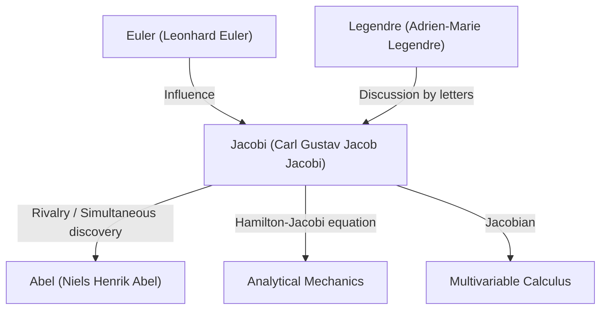

# 1. Introduction: A Seeker of Pure Thought

[Carl Gustav Jacob Jacobi](https://kenji.blog/en/p/jacobi/) (1804–1851) was a 19th-century **German mathematician** who made decisive contributions to diverse fields such as algebra, analysis, number theory, and mechanics. Along with Niels Henrik Abel, he is celebrated as the "discoverer of elliptic functions", and he is the namesake of the "Jacobian" ([Jacobi](https://kenji.blog/en/p/jacobi/)an determinant) that we frequently encounter in multivariable calculus today.

He valued the beauty of mathematics itself and the honor of the human spirit over practical utility. In this article, we will delve deeply into [Jacobi](https://kenji.blog/en/p/jacobi/)'s life, his major mathematical achievements, and the famous episodes he left behind.

# 2. Early Life and Education

[Jacobi](https://kenji.blog/en/p/jacobi/) was born on December 10, 1804, in Potsdam, Kingdom of Prussia (present-day Germany), into a wealthy Jewish banker family. His older brother, Moritz von [Jacobi](https://kenji.blog/en/p/jacobi/), also later became a prominent physicist and engineer, leaving his mark on the development of electric motors.

Showing signs of precocious genius from an early age, [Jacobi](https://kenji.blog/en/p/jacobi/) entered the Gymnasium (high school) in Potsdam and quickly surpassed the older students. At the age of 12, he already had the academic ability to enter university, but due to age restrictions, he could not enroll at the University of Berlin until he turned 16. In the meantime, he taught himself advanced mathematics by reading the works of past masters like Euler and [Lagrange](https://kenji.blog/en/p/lagrange/).

Upon entering the University of Berlin in 1821, he also studied philosophy and philology, but ultimately majored in mathematics. He obtained his doctorate in 1825 and converted to Christianity in the same year, opening the path to a teaching career at the university (in Prussia at the time, it was extremely difficult for Jews to become full professors).

# 3. Golden Age at Königsberg University and Teaching Style

In 1826, [Jacobi](https://kenji.blog/en/p/jacobi/) became a lecturer at Königsberg University, promoted to associate professor in 1827, and to full professor in 1829 at the remarkably young age of 25. This period at Königsberg became the most productive and brilliant time of his research career.

[Jacobi](https://kenji.blog/en/p/jacobi/) was also an exceptional educator. He introduced an innovative **seminar-style** education, integrating his own cutting-edge research directly into his lectures. His students did not just learn from textbooks but received training as researchers by tackling unsolved problems together with him. This educational approach was highly successful and produced many outstanding mathematicians of the next generation, including Rudolf Clebsch and Ludwig Otto Hesse.

# 4. Development of Elliptic Functions and Rivalry with [Abel](https://kenji.blog/en/p/abel/)

One of [Jacobi](https://kenji.blog/en/p/jacobi/)'s greatest achievements is the construction of the theory of elliptic functions. Elliptic integrals appear when calculating the motion of a pendulum or the arc length of an ellipse, and [Legendre](https://kenji.blog/en/p/legendre/) and others had studied them for decades.

[Jacobi](https://kenji.blog/en/p/jacobi/) introduced the groundbreaking perspective of considering the inverse function of the integral. Remarkably, the young Norwegian genius **Abel** had discovered the same approach entirely independently around the exact same time. Both Jacobi and [Abel](https://kenji.blog/en/p/abel/) discovered the double periodicity of elliptic functions, revolutionizing the field.

$$ \text{sn}(u, k), \quad \text{cn}(u, k), \quad \text{dn}(u, k) $$

[Jacobi](https://kenji.blog/en/p/jacobi/) defined these Jacobian elliptic functions and further introduced a powerful new analytical tool called "Theta functions." [Jacobi](https://kenji.blog/en/p/jacobi/)'s theta function $\vartheta(z, \tau)$ is defined as follows:

$$ \vartheta(z, \tau) = \sum_{n=-\infty}^{\infty} e^{\pi i n^2 \tau + 2 \pi i n z} $$

In 1829, he published his masterpiece, *Fundamenta nova theoriae functionum ellipticarum* (New Foundations of the Theory of Elliptic Functions), completing the systematization of this field. The French mathematician [Legendre](https://kenji.blog/en/p/legendre/) was amazed to learn of the achievements of Jacobi and [Abel](https://kenji.blog/en/p/abel/), who were much younger than him, and praised them highly.

# 5. The [Jacobi](https://kenji.blog/en/p/jacobi/)an ([Jacobi](https://kenji.blog/en/p/jacobi/)an Determinant) and Multivariable Analysis

In university calculus courses, when learning about change of variables in multiple integrals (e.g., polar coordinate transformations), everyone encounters the term "[Jacobi](https://kenji.blog/en/p/jacobi/)an". This also originates from [Jacobi](https://kenji.blog/en/p/jacobi/).

When considering a transformation from $n$ variables $x_1, x_2, \dots, x_n$ to $n$ variables $y_1, y_2, \dots, y_n$, the determinant of the matrix consisting of their partial derivatives is called the [Jacobi](https://kenji.blog/en/p/jacobi/)an determinant.

$$ J = \det \begin{pmatrix} \frac{\partial y_1}{\partial x_1} & \cdots & \frac{\partial y_1}{\partial x_n} \\ \vdots & \ddots & \vdots \\ \frac{\partial y_m}{\partial x_1} & \cdots & \frac{\partial y_m}{\partial x_n} \end{pmatrix} $$

[Jacobi](https://kenji.blog/en/p/jacobi/) clearly showed that this determinant represents the scale factor of volume elements under a change of variables, and he proved its central role in generalizing the inverse function theorem and the implicit function theorem.

# 6. Analytical Mechanics: The Hamilton-[Jacobi](https://kenji.blog/en/p/jacobi/) Equation

[Jacobi](https://kenji.blog/en/p/jacobi/)'s interests extended beyond pure mathematics to physics, particularly analytical mechanics. [Jacobi](https://kenji.blog/en/p/jacobi/) further refined the system of mechanics formulated by the Irish mathematician William Rowan Hamilton.

He derived the **Hamilton-[Jacobi](https://kenji.blog/en/p/jacobi/) equation**, a partial differential equation for determining the motion of a mechanical system.

$$ H\left(q_i, \frac{\partial S}{\partial q_i}, t\right) + \frac{\partial S}{\partial t} = 0 $$

Here, $H$ is the Hamiltonian (total energy of the system), and $S$ is the action (or Hamilton's principal function). This equation made it possible to interpret problems in mechanics similarly to the propagation of wavefronts in optics, forming an important theoretical foundation for the birth of quantum mechanics (especially the Schrödinger equation) in the 20th century.

# 7. Contributions to Number Theory

[Jacobi](https://kenji.blog/en/p/jacobi/) was also a genius at applying his mastery of elliptic functions and theta functions to seemingly unrelated problems in number theory.

There is a famous theorem called [Lagrange](https://kenji.blog/en/p/lagrange/)'s four-square theorem (every natural number can be represented as the sum of four integer squares). Using identities of theta functions, [Jacobi](https://kenji.blog/en/p/jacobi/) derived a formula that gives the exact "number of ways" a natural number $n$ can be represented as the sum of four squares.

$$ r_4(n) = 8 \sum_{d|n, 4\nmid d} d $$

This approach of revealing profound properties of number theory using analytical methods had a massive impact on the subsequent development of analytic number theory.

# 8. Personality and the Famous Episode "The Honor of the Human Spirit"

The most famous episode demonstrating [Jacobi](https://kenji.blog/en/p/jacobi/)'s attitude toward mathematics is found in his letter to the French mathematician Joseph Fourier. Fourier had argued that "the main object of mathematics is the public utility and the explanation of natural phenomena." In response, [Jacobi](https://kenji.blog/en/p/jacobi/) countered:

> "It is true that Monsieur Fourier had the opinion that the principal aim of mathematics was public utility and explanation of natural phenomena; but a philosopher like him should have known that the sole end of science is **the honor of the human spirit**, and that under this title a question about numbers is worth as much as a question about the system of the world."

This quote remains one of the most powerful and beautiful declarations defending the existence of pure mathematics, and it is still widely recounted by mathematicians today.

In 1843, [Jacobi](https://kenji.blog/en/p/jacobi/) suffered from diabetes due to overwork and went to Italy to recuperate, receiving financial assistance from the Prussian royal family for this journey. He later returned to Berlin to continue his research but became embroiled in the political turmoil of the 1848 revolution, facing hardship such as a temporary suspension of his salary.

# 9. Later Years and Legacy

[Jacobi](https://kenji.blog/en/p/jacobi/)'s later years were plagued by health issues and financial difficulties. He passed away from smallpox in Berlin on February 18, 1851, at the young age of 46.

However, the legacy he left behind is immeasurable. The theory of elliptic functions became a central theme in 19th-century mathematics, and the Hamilton-[Jacobi](https://kenji.blog/en/p/jacobi/) equation continues to underpin the foundations of physics. Above all, his dedication to the pursuit of truth for "the honor of the human spirit" continues to inspire scientists across eras.

His grave is located in the Holy Trinity Cemetery in Berlin, where many math enthusiasts still visit to pay their respects. [Jacobi](https://kenji.blog/en/p/jacobi/)'s mathematical intuition, overwhelming computational prowess, and broad perspective spanning multiple fields undoubtedly make him one of the greatest stars in the history of mathematics.
