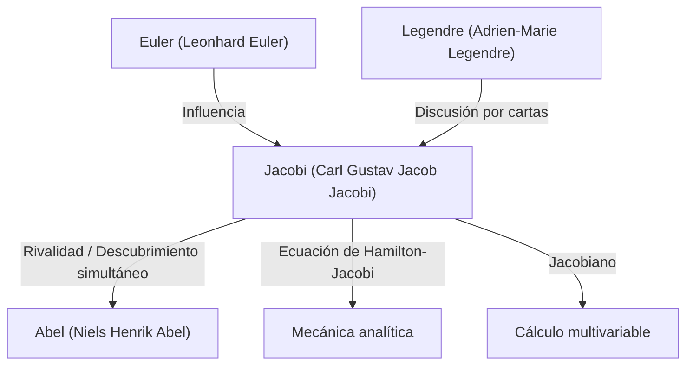

# 1. Introducción: Un buscador del pensamiento puro

[Carl Gustav Jacob Jacobi](https://kenji.blog/p/jacobi/) (1804–1851) fue un **matemático alemán** del siglo XIX que realizó contribuciones decisivas a diversos campos como el álgebra, el análisis, la teoría de números y la mecánica. Junto con [Niels Henrik Abel](https://kenji.blog/p/abel/), es célebre como el "descubridor de las funciones elípticas", y es el epónimo del "Jacobiano" (determinante jacobiano) que encontramos frecuentemente en el cálculo multivariable actual.

Él valoraba la belleza de las matemáticas en sí mismas y el honor del espíritu humano por encima de la utilidad práctica. En este artículo, profundizaremos en la vida de Jacobi, sus principales logros matemáticos y los famosos episodios que dejó atrás.

# 2. Primeros años y educación

Jacobi nació el 10 de diciembre de 1804 en Potsdam, Reino de Prusia (actual Alemania), en una adinerada familia de banqueros judíos. Su hermano mayor, Moritz von Jacobi, también se convirtió más tarde en un destacado físico e ingeniero, dejando su huella en el desarrollo de los motores eléctricos.

Mostrando signos de genio precoz desde temprana edad, Jacobi ingresó al Gymnasium (escuela secundaria) en Potsdam y rápidamente superó a los estudiantes mayores. A los 12 años, ya tenía la capacidad académica para ingresar a la universidad, pero debido a restricciones de edad, no pudo matricularse en la Universidad de Berlín hasta cumplir los 16. Mientras tanto, aprendió matemáticas avanzadas de forma autodidacta leyendo las obras de maestros del pasado como Euler y Lagrange.

Al ingresar a la Universidad de Berlín en 1821, también estudió filosofía y filología, pero finalmente se especializó en matemáticas. Obtuvo su doctorado en 1825 y se convirtió al cristianismo ese mismo año, abriéndose camino hacia una carrera docente en la universidad (en Prusia en ese momento, era extremadamente difícil para los judíos convertirse en profesores titulares).

# 3. La edad de oro en la Universidad de Königsberg y su estilo de enseñanza

En 1826, Jacobi se convirtió en profesor en la Universidad de Königsberg, fue ascendido a profesor asociado en 1827 y a profesor titular en 1829 a la edad notablemente joven de 25 años. Este período en Königsberg se convirtió en la época más productiva y brillante de su carrera investigadora.

Jacobi también fue un educador excepcional. Introdujo una educación innovadora estilo **seminario**, integrando su propia investigación de vanguardia directamente en sus conferencias. Sus estudiantes no solo aprendían de libros de texto, sino que recibían formación como investigadores abordando problemas no resueltos junto a él. Este enfoque educativo fue muy exitoso y produjo muchos matemáticos destacados de la siguiente generación, incluidos Rudolf Clebsch y Ludwig Otto Hesse.

# 4. Desarrollo de las funciones elípticas y la rivalidad con Abel

Uno de los mayores logros de Jacobi es la construcción de la teoría de las funciones elípticas. Las integrales elípticas aparecen al calcular el movimiento de un péndulo o la longitud de arco de una elipse, y Legendre y otros las habían estudiado durante décadas.

Jacobi introdujo la perspectiva revolucionaria de considerar la función inversa de la integral. Sorprendentemente, el joven genio noruego **Abel** había descubierto el mismo enfoque de manera totalmente independiente casi al mismo tiempo. Tanto Jacobi como Abel descubrieron la doble periodicidad de las funciones elípticas, revolucionando el campo.

$$ \text{sn}(u, k), \quad \text{cn}(u, k), \quad \text{dn}(u, k) $$

Jacobi definió estas funciones elípticas jacobianas y además introdujo una nueva y poderosa herramienta analítica llamada "funciones Theta". La función theta de Jacobi $\vartheta(z, \tau)$ se define de la siguiente manera:

$$ \vartheta(z, \tau) = \sum_{n=-\infty}^{\infty} e^{\pi i n^2 \tau + 2 \pi i n z} $$

En 1829, publicó su obra maestra, *Fundamenta nova theoriae functionum ellipticarum* (Nuevos fundamentos de la teoría de funciones elípticas), completando la sistematización de este campo. El matemático francés Legendre quedó asombrado al conocer los logros de Jacobi y Abel, quienes eran mucho más jóvenes que él, y los elogió enormemente.

# 5. El Jacobiano (Determinante jacobiano) y el análisis multivariable

En los cursos universitarios de cálculo, al aprender sobre el cambio de variables en integrales múltiples (por ejemplo, transformaciones de coordenadas polares), todos se encuentran con el término "Jacobiano". Esto también proviene de Jacobi.

Al considerar una transformación de $n$ variables $x_1, x_2, \dots, x_n$ a $n$ variables $y_1, y_2, \dots, y_n$, el determinante de la matriz que consiste en sus derivadas parciales se llama determinante jacobiano.

$$ J = \det \begin{pmatrix} \frac{\partial y_1}{\partial x_1} & \cdots & \frac{\partial y_1}{\partial x_n} \\ \vdots & \ddots & \vdots \\ \frac{\partial y_m}{\partial x_1} & \cdots & \frac{\partial y_m}{\partial x_n} \end{pmatrix} $$

Jacobi demostró claramente que este determinante representa el factor de escala de los elementos de volumen bajo un cambio de variables, y demostró su papel central en la generalización del teorema de la función inversa y el teorema de la función implícita.

# 6. Mecánica analítica: La ecuación de Hamilton-Jacobi

Los intereses de Jacobi se extendieron más allá de las matemáticas puras hasta la física, particularmente la mecánica analítica. Jacobi refinó aún más el sistema de mecánica formulado por el matemático irlandés William Rowan Hamilton.

Él derivó la **ecuación de Hamilton-Jacobi**, una ecuación diferencial parcial para determinar el movimiento de un sistema mecánico.

$$ H\left(q_i, \frac{\partial S}{\partial q_i}, t\right) + \frac{\partial S}{\partial t} = 0 $$

Aquí, $H$ es el hamiltoniano (energía total del sistema) y $S$ es la acción (o función principal de Hamilton). Esta ecuación hizo posible interpretar los problemas de mecánica de manera similar a la propagación de frentes de onda en óptica, formando una importante base teórica para el nacimiento de la mecánica cuántica (especialmente la ecuación de Schrödinger) en el siglo XX.

# 7. Contribuciones a la teoría de números

Jacobi también fue un genio al aplicar su dominio de las funciones elípticas y las funciones theta a problemas aparentemente no relacionados en la teoría de números.

Hay un teorema famoso llamado teorema de los cuatro cuadrados de Lagrange (todo número natural se puede representar como la suma de cuatro cuadrados de enteros). Utilizando identidades de funciones theta, Jacobi derivó una fórmula que da la "cantidad exacta de maneras" en que un número natural $n$ se puede representar como la suma de cuatro cuadrados.

$$ r_4(n) = 8 \sum_{d|n, 4\nmid d} d $$

Este enfoque de revelar profundas propiedades de la teoría de números utilizando métodos analíticos tuvo un impacto masivo en el desarrollo posterior de la teoría analítica de números.

# 8. Personalidad y el famoso episodio "El honor del espíritu humano"

El episodio más famoso que demuestra la actitud de Jacobi hacia las matemáticas se encuentra en su carta al matemático francés Joseph Fourier. Fourier había argumentado que "el objeto principal de las matemáticas es la utilidad pública y la explicación de los fenómenos naturales". En respuesta, Jacobi contrarrestó:

> "Es cierto que Monsieur Fourier tenía la opinión de que el fin principal de las matemáticas era la utilidad pública y la explicación de los fenómenos naturales; pero un filósofo como él debería haber sabido que el único fin de la ciencia es **el honor del espíritu humano**, y que bajo este título, una cuestión sobre números vale tanto como una cuestión sobre el sistema del mundo."

Esta cita sigue siendo una de las declaraciones más poderosas y hermosas que defienden la existencia de las matemáticas puras, y los matemáticos de hoy en día todavía la relatan ampliamente.

En 1843, Jacobi sufrió de diabetes debido al exceso de trabajo y fue a Italia para recuperarse, recibiendo asistencia financiera de la familia real prusiana para este viaje. Más tarde regresó a Berlín para continuar su investigación, pero se vio envuelto en la agitación política de la revolución de 1848, enfrentando dificultades como la suspensión temporal de su salario.

# 9. Últimos años y legado

Los últimos años de Jacobi estuvieron plagados de problemas de salud y dificultades financieras. Falleció de viruela en Berlín el 18 de febrero de 1851, a la temprana edad de 46 años.

Sin embargo, el legado que dejó es inconmensurable. La teoría de las funciones elípticas se convirtió en un tema central en las matemáticas del siglo XIX, y la ecuación de Hamilton-Jacobi continúa sustentando los fundamentos de la física. Sobre todo, su dedicación a la búsqueda de la verdad por "el honor del espíritu humano" continúa inspirando a los científicos a través de las eras.

Su tumba se encuentra en el Cementerio de la Trinidad en Berlín, donde muchos entusiastas de las matemáticas aún lo visitan para presentar sus respetos. La intuición matemática de Jacobi, su abrumadora destreza computacional y su amplia perspectiva que abarca múltiples campos sin duda lo convierten en una de las estrellas más grandes en la historia de las matemáticas.
