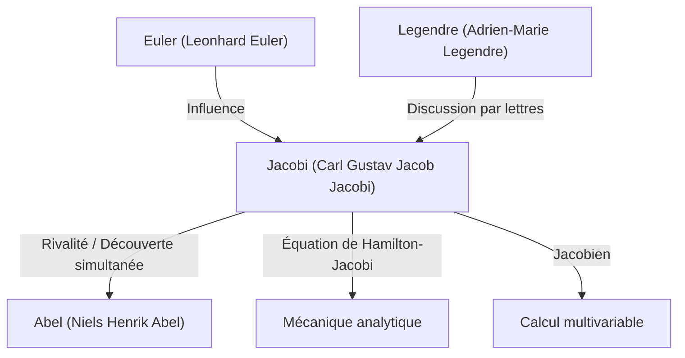

# 1. Introduction : Un chercheur de la pensée pure

[Carl Gustav Jacob Jacobi](https://kenji.blog/fr/p/jacobi/) (1804–1851) était un **mathématicien allemand** du 19e siècle qui a apporté des contributions décisives à divers domaines tels que l'algèbre, l'analyse, la théorie des nombres et la mécanique. Avec [Niels Henrik Abel](https://kenji.blog/fr/p/abel/), il est célèbre en tant que "découvreur des fonctions elliptiques" et a donné son nom au "[Jacobi](https://kenji.blog/fr/p/jacobi/)en" (déterminant jacobien) que nous rencontrons fréquemment dans le calcul multivariable aujourd'hui.

Il valorisait la beauté des mathématiques elles-mêmes et l'honneur de l'esprit humain au-dessus de l'utilité pratique. Dans cet article, nous plongerons profondément dans la vie de [Jacobi](https://kenji.blog/fr/p/jacobi/), ses principales réalisations mathématiques et les célèbres épisodes qu'il a laissés derrière lui.

# 2. Jeunesse et éducation

[Jacobi](https://kenji.blog/fr/p/jacobi/) est né le 10 décembre 1804 à Potsdam, dans le Royaume de Prusse (actuelle Allemagne), au sein d'une riche famille de banquiers juifs. Son frère aîné, Moritz von [Jacobi](https://kenji.blog/fr/p/jacobi/), est également devenu plus tard un physicien et ingénieur de premier plan, laissant sa marque dans le développement des moteurs électriques.

Montrant des signes de génie précoce dès son plus jeune âge, [Jacobi](https://kenji.blog/fr/p/jacobi/) entra au Gymnasium (lycée) de Potsdam et dépassa rapidement les élèves plus âgés. À l'âge de 12 ans, il avait déjà les capacités académiques pour entrer à l'université, mais en raison des restrictions d'âge, il ne put s'inscrire à l'Université de Berlin qu'à l'âge de 16 ans. Entre-temps, il apprit seul les mathématiques avancées en lisant les œuvres d'anciens maîtres comme Euler et [Lagrange](https://kenji.blog/fr/p/lagrange/).

En entrant à l'Université de Berlin en 1821, il étudia également la philosophie et la philologie, mais se spécialisa finalement en mathématiques. Il obtint son doctorat en 1825 et se convertit au christianisme la même année, ouvrant la voie à une carrière d'enseignant à l'université (en Prusse à l'époque, il était extrêmement difficile pour les Juifs de devenir professeurs titulaires).

# 3. L'âge d'or à l'Université de Königsberg et son style d'enseignement

En 1826, [Jacobi](https://kenji.blog/fr/p/jacobi/) devint maître de conférences à l'Université de Königsberg, fut promu professeur associé en 1827, puis professeur titulaire en 1829 à l'âge remarquablement jeune de 25 ans. Cette période à Königsberg devint la plus productive et brillante de sa carrière de chercheur.

[Jacobi](https://kenji.blog/fr/p/jacobi/) était également un éducateur exceptionnel. Il introduisit une éducation novatrice de type **séminaire**, intégrant ses propres recherches de pointe directement dans ses cours. Ses étudiants n'apprenaient pas seulement à partir de manuels, mais recevaient une formation de chercheurs en s'attaquant avec lui à des problèmes non résolus. Cette approche pédagogique a connu un grand succès et a produit de nombreux mathématiciens exceptionnels de la génération suivante, dont Rudolf Clebsch et Ludwig Otto Hesse.

# 4. Développement des fonctions elliptiques et rivalité avec [Abel](https://kenji.blog/fr/p/abel/)

L'une des plus grandes réalisations de [Jacobi](https://kenji.blog/fr/p/jacobi/) est la construction de la théorie des fonctions elliptiques. Les intégrales elliptiques apparaissent lors du calcul du mouvement d'un pendule ou de la longueur de l'arc d'une ellipse, et [Legendre](https://kenji.blog/fr/p/legendre/) et d'autres les avaient étudiées pendant des décennies.

[Jacobi](https://kenji.blog/fr/p/jacobi/) introduisit la perspective révolutionnaire de considérer la fonction inverse de l'intégrale. Fait remarquable, le jeune génie norvégien **[Abel](https://kenji.blog/fr/p/abel/)** avait découvert la même approche de manière totalement indépendante à peu près au même moment. [Jacobi](https://kenji.blog/fr/p/jacobi/) et [Abel](https://kenji.blog/fr/p/abel/) ont tous deux découvert la double périodicité des fonctions elliptiques, révolutionnant le domaine.

$$ \text{sn}(u, k), \quad \text{cn}(u, k), \quad \text{dn}(u, k) $$

[Jacobi](https://kenji.blog/fr/p/jacobi/) a défini ces fonctions elliptiques jacobiennes et a ensuite introduit un nouvel outil analytique puissant appelé "fonctions Thêta". La fonction thêta de [Jacobi](https://kenji.blog/fr/p/jacobi/) $\vartheta(z, \tau)$ est définie comme suit :

$$ \vartheta(z, \tau) = \sum_{n=-\infty}^{\infty} e^{\pi i n^2 \tau + 2 \pi i n z} $$

En 1829, il publia son chef-d'œuvre, *Fundamenta nova theoriae functionum ellipticarum* (Nouveaux fondements de la théorie des fonctions elliptiques), achevant la systématisation de ce domaine. Le mathématicien français [Legendre](https://kenji.blog/fr/p/legendre/) fut stupéfait d'apprendre les réalisations de [Jacobi](https://kenji.blog/fr/p/jacobi/) et d'[Abel](https://kenji.blog/fr/p/abel/), bien plus jeunes que lui, et les loua chaleureusement.

# 5. Le [Jacobi](https://kenji.blog/fr/p/jacobi/)en (Déterminant jacobien) et l'analyse multivariable

Dans les cours de calcul universitaire, lors de l'apprentissage du changement de variables dans les intégrales multiples (par exemple, les transformations en coordonnées polaires), tout le monde rencontre le terme "[Jacobi](https://kenji.blog/fr/p/jacobi/)en". Cela provient également de [Jacobi](https://kenji.blog/fr/p/jacobi/).

Lorsqu'on considère une transformation de $n$ variables $x_1, x_2, \dots, x_n$ vers $n$ variables $y_1, y_2, \dots, y_n$, le déterminant de la matrice composée de leurs dérivées partielles est appelé le déterminant jacobien.

$$ J = \det \begin{pmatrix} \frac{\partial y_1}{\partial x_1} & \cdots & \frac{\partial y_1}{\partial x_n} \\ \vdots & \ddots & \vdots \\ \frac{\partial y_m}{\partial x_1} & \cdots & \frac{\partial y_m}{\partial x_n} \end{pmatrix} $$

[Jacobi](https://kenji.blog/fr/p/jacobi/) a clairement montré que ce déterminant représente le facteur d'échelle des éléments de volume lors d'un changement de variables, et il a prouvé son rôle central dans la généralisation du théorème de la fonction inverse et du théorème de la fonction implicite.

# 6. Mécanique analytique : L'équation de Hamilton-[Jacobi](https://kenji.blog/fr/p/jacobi/)

Les intérêts de [Jacobi](https://kenji.blog/fr/p/jacobi/) s'étendaient au-delà des mathématiques pures jusqu'à la physique, particulièrement la mécanique analytique. [Jacobi](https://kenji.blog/fr/p/jacobi/) affina encore le système de mécanique formulé par le mathématicien irlandais William Rowan Hamilton.

Il a dérivé l'**équation de Hamilton-[Jacobi](https://kenji.blog/fr/p/jacobi/)**, une équation aux dérivées partielles permettant de déterminer le mouvement d'un système mécanique.

$$ H\left(q_i, \frac{\partial S}{\partial q_i}, t\right) + \frac{\partial S}{\partial t} = 0 $$

Ici, $H$ est le hamiltonien (énergie totale du système), et $S$ est l'action (ou fonction principale de Hamilton). Cette équation a permis d'interpréter les problèmes de mécanique de manière similaire à la propagation des fronts d'onde en optique, formant une base théorique importante pour la naissance de la mécanique quantique (en particulier l'équation de Schrödinger) au 20e siècle.

# 7. Contributions à la théorie des nombres

[Jacobi](https://kenji.blog/fr/p/jacobi/) était également un génie pour appliquer sa maîtrise des fonctions elliptiques et des fonctions thêta à des problèmes de théorie des nombres apparemment sans rapport.

Il existe un théorème célèbre appelé le théorème des quatre carrés de [Lagrange](https://kenji.blog/fr/p/lagrange/) (tout nombre entier naturel peut être représenté comme la somme de quatre carrés d'entiers). En utilisant des identités de fonctions thêta, [Jacobi](https://kenji.blog/fr/p/jacobi/) a dérivé une formule qui donne le nombre exact de "façons" dont un nombre entier naturel $n$ peut être représenté comme la somme de quatre carrés.

$$ r_4(n) = 8 \sum_{d|n, 4\nmid d} d $$

Cette approche consistant à révéler des propriétés profondes de la théorie des nombres à l'aide de méthodes analytiques a eu un impact massif sur le développement ultérieur de la théorie analytique des nombres.

# 8. Personnalité et le célèbre épisode "L'honneur de l'esprit humain"

Le célèbre épisode démontrant l'attitude de [Jacobi](https://kenji.blog/fr/p/jacobi/) envers les mathématiques se trouve dans sa lettre au mathématicien français Joseph Fourier. Fourier avait soutenu que "le but principal des mathématiques est l'utilité publique et l'explication des phénomènes naturels". En réponse, [Jacobi](https://kenji.blog/fr/p/jacobi/) a répliqué :

> "Il est vrai que Monsieur Fourier avait l'opinion que le but principal des mathématiques était l'utilité publique et l'explication des phénomènes naturels ; mais un philosophe comme lui aurait dû savoir que le but unique de la science est **l'honneur de l'esprit humain**, et que sous ce titre, une question sur les nombres vaut autant qu'une question sur le système du monde."

Cette citation reste l'une des déclarations les plus puissantes et les plus belles défendant l'existence des mathématiques pures, et elle est encore largement racontée par les mathématiciens d'aujourd'hui.

En 1843, [Jacobi](https://kenji.blog/fr/p/jacobi/) souffrit de diabète dû au surmenage et se rendit en Italie pour se rétablir, recevant une aide financière de la famille royale prussienne pour ce voyage. Il retourna plus tard à Berlin pour poursuivre ses recherches mais fut mêlé aux troubles politiques de la révolution de 1848, confronté à des difficultés telles que la suspension temporaire de son salaire.

# 9. Dernières années et héritage

Les dernières années de [Jacobi](https://kenji.blog/fr/p/jacobi/) ont été marquées par des problèmes de santé et des difficultés financières. Il est décédé de la variole à Berlin le 18 février 1851, au jeune âge de 46 ans.

Cependant, l'héritage qu'il a laissé derrière lui est incommensurable. La théorie des fonctions elliptiques est devenue un thème central des mathématiques du 19e siècle, et l'équation de Hamilton-[Jacobi](https://kenji.blog/fr/p/jacobi/) continue de soutenir les fondements de la physique. Par-dessus tout, son dévouement à la recherche de la vérité pour "l'honneur de l'esprit humain" continue d'inspirer les scientifiques à travers les époques.

Sa tombe se trouve au cimetière de la Trinité à Berlin, où de nombreux passionnés de mathématiques se rendent encore pour lui rendre hommage. L'intuition mathématique de [Jacobi](https://kenji.blog/fr/p/jacobi/), ses prouesses de calcul écrasantes et sa large perspective couvrant de multiples domaines font sans aucun doute de lui l'une des plus grandes étoiles de l'histoire des mathématiques.
