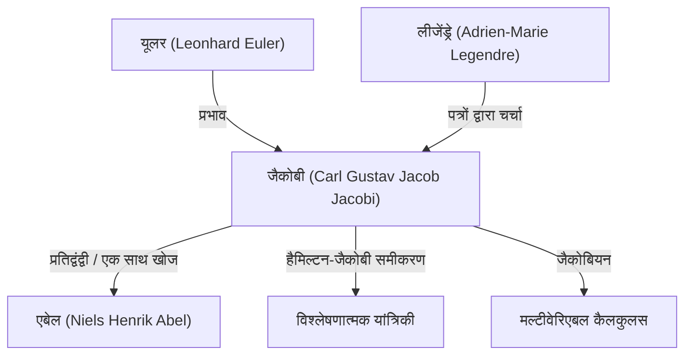

# 1. परिचय: शुद्ध विचार के अन्वेषक

[कार्ल गुस्ताव जैकब जैकोबी](https://kenji.blog/hi/p/jacobi/) (1804–1851) 19वीं सदी के एक **जर्मन गणितज्ञ** थे, जिन्होंने बीजगणित, विश्लेषण, संख्या सिद्धांत और यांत्रिकी जैसे विविध क्षेत्रों में निर्णायक योगदान दिया। [नील्स हेनरिक एबेल](https://kenji.blog/hi/p/abel/) के साथ, उन्हें "अण्डाकार कार्यों (elliptic functions) के खोजकर्ता" के रूप में मनाया जाता है, और उनके नाम पर "जैकोबियन" (जैकोबियन निर्धारक) है जिसका हम आज मल्टीवेरिएबल कैलकुलस में अक्सर सामना करते हैं।

उन्होंने व्यावहारिक उपयोगिता की तुलना में गणित की सुंदरता और मानव आत्मा के सम्मान को अधिक महत्व दिया। इस लेख में, हम जैकोबी के जीवन, उनकी प्रमुख गणितीय उपलब्धियों और उनके द्वारा छोड़े गए प्रसिद्ध प्रसंगों की गहराई से चर्चा करेंगे।

# 2. प्रारंभिक जीवन और शिक्षा

जैकोबी का जन्म 10 दिसंबर 1804 को पॉट्सडैम, प्रशिया साम्राज्य (वर्तमान जर्मनी) में एक धनी यहूदी बैंकर परिवार में हुआ था। उनके बड़े भाई, मोरित्ज़ वॉन जैकोबी, बाद में एक प्रमुख भौतिक विज्ञानी और इंजीनियर बने, जिन्होंने इलेक्ट्रिक मोटर्स के विकास में अपनी छाप छोड़ी।

कम उम्र से ही अपनी विलक्षण प्रतिभा के संकेत दिखाते हुए, जैकोबी ने पॉट्सडैम में व्यायामशाला (हाई स्कूल) में प्रवेश किया और जल्दी ही बड़े छात्रों को पीछे छोड़ दिया। 12 वर्ष की आयु में, उनमें विश्वविद्यालय में प्रवेश करने की शैक्षणिक क्षमता थी, लेकिन आयु प्रतिबंधों के कारण, वे 16 वर्ष के होने तक बर्लिन विश्वविद्यालय में दाखिला नहीं ले सके। इस बीच, उन्होंने यूलर और लैग्रेंज जैसे पिछले उस्तादों के कार्यों को पढ़कर उच्च गणित स्वयं सीखा।

1821 में बर्लिन विश्वविद्यालय में प्रवेश करने पर, उन्होंने दर्शनशास्त्र और भाषाशास्त्र का भी अध्ययन किया, लेकिन अंततः गणित में प्रमुखता प्राप्त की। उन्होंने 1825 में अपनी डॉक्टरेट की उपाधि प्राप्त की और उसी वर्ष ईसाई धर्म अपना लिया, जिससे विश्वविद्यालय में शिक्षण करियर का मार्ग प्रशस्त हुआ (उस समय प्रशिया में, यहूदियों के लिए पूर्ण प्रोफेसर बनना बेहद मुश्किल था)।

# 3. कोनिग्सबर्ग विश्वविद्यालय में स्वर्ण युग और शिक्षण शैली

1826 में, जैकोबी कोनिग्सबर्ग विश्वविद्यालय में एक व्याख्याता बने, 1827 में एसोसिएट प्रोफेसर के रूप में पदोन्नत हुए, और 1829 में 25 वर्ष की उल्लेखनीय कम उम्र में पूर्ण प्रोफेसर बने। कोनिग्सबर्ग में यह अवधि उनके शोध करियर का सबसे उत्पादक और शानदार समय बन गया।

जैकोबी एक असाधारण शिक्षक भी थे। उन्होंने एक नवीन **संगोष्ठी-शैली** की शिक्षा की शुरुआत की, और अपने स्वयं के अत्याधुनिक शोध को सीधे अपने व्याख्यानों में एकीकृत किया। उनके छात्रों ने केवल पाठ्यपुस्तकों से नहीं सीखा, बल्कि उनके साथ अनसुलझी समस्याओं से निपटते हुए शोधकर्ताओं के रूप में प्रशिक्षण प्राप्त किया। यह शैक्षिक दृष्टिकोण अत्यधिक सफल रहा और रुडोल्फ क्लेब्स और लुडविग ओटो हेस्से सहित अगली पीढ़ी के कई उत्कृष्ट गणितज्ञों का निर्माण किया।

# 4. अण्डाकार कार्यों का विकास और एबेल के साथ प्रतिद्वंद्विता

जैकोबी की सबसे बड़ी उपलब्धियों में से एक अण्डाकार कार्यों (elliptic functions) के सिद्धांत का निर्माण है। पेंडुलम की गति या दीर्घवृत्त की चाप की लंबाई की गणना करते समय अण्डाकार इंटीग्रल दिखाई देते हैं, और लीजेंड्रे और अन्य ने दशकों तक उनका अध्ययन किया था।

जैकोबी ने अभिन्न (integral) के व्युत्क्रम कार्य (inverse function) पर विचार करने का अभूतपूर्व दृष्टिकोण पेश किया। उल्लेखनीय रूप से, युवा नार्वेजियन प्रतिभा **एबेल** ने लगभग एक ही समय में पूरी तरह से स्वतंत्र रूप से एक ही दृष्टिकोण की खोज की थी। जैकोबी और एबेल दोनों ने अण्डाकार कार्यों की दोहरी आवधिकता की खोज की, जिससे इस क्षेत्र में क्रांति आ गई।

$$ \text{sn}(u, k), \quad \text{cn}(u, k), \quad \text{dn}(u, k) $$

जैकोबी ने इन जैकोबियन अण्डाकार कार्यों को परिभाषित किया और आगे "थीटा फ़ंक्शंस" नामक एक नया शक्तिशाली विश्लेषणात्मक उपकरण पेश किया। जैकोबी के थीटा फलन $\vartheta(z, \tau)$ को इस प्रकार परिभाषित किया गया है:

$$ \vartheta(z, \tau) = \sum_{n=-\infty}^{\infty} e^{\pi i n^2 \tau + 2 \pi i n z} $$

1829 में, उन्होंने अपनी उत्कृष्ट कृति, *Fundamenta nova theoriae functionum ellipticarum* (अण्डाकार कार्यों के सिद्धांत की नई नींव) प्रकाशित की, जिसने इस क्षेत्र के व्यवस्थितकरण को पूरा किया। फ्रांसीसी गणितज्ञ लीजेंड्रे जैकोबी और एबेल, जो उनसे बहुत छोटे थे, की उपलब्धियों को जानकर चकित थे, और उनकी अत्यधिक प्रशंसा की।

# 5. जैकोबियन (जैकोबियन निर्धारक) और मल्टीवेरिएबल विश्लेषण

विश्वविद्यालय के कैलकुलस पाठ्यक्रमों में, जब एकाधिक इंटीग्रल्स (multiple integrals) में चर के परिवर्तन (जैसे, ध्रुवीय समन्वय परिवर्तन) के बारे में सीखते हैं, तो हर कोई "जैकोबियन" शब्द का सामना करता है। इसकी उत्पत्ति भी जैकोबी से हुई है।

$n$ चर $x_1, x_2, \dots, x_n$ से $n$ चर $y_1, y_2, \dots, y_n$ में परिवर्तन पर विचार करते समय, उनके आंशिक डेरिवेटिव से मिलकर बने मैट्रिक्स के निर्धारक को जैकोबियन निर्धारक कहा जाता है।

$$ J = \det \begin{pmatrix} \frac{\partial y_1}{\partial x_1} & \cdots & \frac{\partial y_1}{\partial x_n} \\ \vdots & \ddots & \vdots \\ \frac{\partial y_m}{\partial x_1} & \cdots & \frac{\partial y_m}{\partial x_n} \end{pmatrix} $$

जैकोबी ने स्पष्ट रूप से दिखाया कि यह निर्धारक चरों के परिवर्तन के तहत आयतन तत्वों के पैमाने कारक का प्रतिनिधित्व करता है, और उन्होंने व्युत्क्रम फलन प्रमेय (inverse function theorem) और अंतर्निहित फलन प्रमेय (implicit function theorem) को सामान्य बनाने में इसकी केंद्रीय भूमिका साबित की।

# 6. विश्लेषणात्मक यांत्रिकी: हैमिल्टन-जैकोबी समीकरण

जैकोबी की रुचियां शुद्ध गणित से आगे बढ़कर भौतिकी, विशेष रूप से विश्लेषणात्मक यांत्रिकी तक फैली हुई थीं। जैकोबी ने आयरिश गणितज्ञ विलियम रोवन हैमिल्टन द्वारा तैयार यांत्रिकी की प्रणाली को और परिष्कृत किया।

उन्होंने **हैमिल्टन-जैकोबी समीकरण** प्राप्त किया, जो एक यांत्रिक प्रणाली की गति का निर्धारण करने के लिए एक आंशिक अवकल समीकरण है।

$$ H\left(q_i, \frac{\partial S}{\partial q_i}, t\right) + \frac{\partial S}{\partial t} = 0 $$

यहाँ, $H$ हैमिल्टनियन (प्रणाली की कुल ऊर्जा) है, और $S$ कार्रवाई (या हैमिल्टन का मुख्य कार्य) है। इस समीकरण ने प्रकाशिकी में वेवफ्रंट्स के प्रसार के समान यांत्रिकी में समस्याओं की व्याख्या करना संभव बना दिया, जिससे 20वीं सदी में क्वांटम यांत्रिकी (विशेष रूप से श्रोडिंगर समीकरण) के जन्म के लिए एक महत्वपूर्ण सैद्धांतिक आधार तैयार हुआ।

# 7. संख्या सिद्धांत में योगदान

जैकोबी अण्डाकार कार्यों और थीटा कार्यों की अपनी महारत को संख्या सिद्धांत में प्रतीत होने वाली असंबद्ध समस्याओं पर लागू करने में भी एक प्रतिभाशाली व्यक्ति थे।

लैग्रेंज का चार-वर्ग प्रमेय (Lagrange's four-square theorem) नामक एक प्रसिद्ध प्रमेय है (हर प्राकृतिक संख्या को चार पूर्णांकों के वर्गों के योग के रूप में दर्शाया जा सकता है)। थीटा फ़ंक्शंस की पहचान का उपयोग करते हुए, जैकोबी ने एक सूत्र निकाला जो सटीक "तरीकों की संख्या" देता है जिसके द्वारा प्राकृतिक संख्या $n$ को चार वर्गों के योग के रूप में दर्शाया जा सकता है।

$$ r_4(n) = 8 \sum_{d|n, 4\nmid d} d $$

विश्लेषणात्मक विधियों का उपयोग करके संख्या सिद्धांत के गहरे गुणों को उजागर करने के इस दृष्टिकोण ने विश्लेषणात्मक संख्या सिद्धांत के बाद के विकास पर व्यापक प्रभाव डाला।

# 8. व्यक्तित्व और प्रसिद्ध प्रसंग "मानव आत्मा का सम्मान"

गणित के प्रति जैकोबी के दृष्टिकोण को प्रदर्शित करने वाला सबसे प्रसिद्ध प्रसंग फ्रांसीसी गणितज्ञ जोसेफ फूरियर को लिखे उनके पत्र में पाया जाता है। फूरियर ने तर्क दिया था कि "गणित का मुख्य उद्देश्य सार्वजनिक उपयोगिता और प्राकृतिक घटनाओं की व्याख्या है।" इसके जवाब में, जैकोबी ने पलटवार किया:

> "यह सच है कि महाशय फूरियर की राय थी कि गणित का प्रमुख उद्देश्य सार्वजनिक उपयोगिता और प्राकृतिक घटनाओं की व्याख्या थी; लेकिन उनके जैसे एक दार्शनिक को यह जानना चाहिए था कि विज्ञान का एकमात्र उद्देश्य **मानव आत्मा का सम्मान** है, और इस शीर्षक के तहत संख्याओं के बारे में एक प्रश्न दुनिया की व्यवस्था के बारे में एक प्रश्न के समान ही मूल्यवान है।"

यह उद्धरण शुद्ध गणित के अस्तित्व का बचाव करने वाले सबसे शक्तिशाली और सुंदर घोषणाओं में से एक बना हुआ है, और इसे आज भी गणितज्ञों द्वारा व्यापक रूप से सुनाया जाता है।

1843 में, जैकोबी अधिक काम के कारण मधुमेह से पीड़ित हुए और स्वास्थ्य लाभ के लिए इटली गए, इस यात्रा के लिए उन्हें प्रशिया शाही परिवार से वित्तीय सहायता मिली। बाद में वे अपना शोध जारी रखने के लिए बर्लिन लौट आए, लेकिन 1848 की क्रांति की राजनीतिक उथल-पुथल में उलझ गए, और उन्हें अपने वेतन के अस्थायी निलंबन जैसी कठिनाइयों का सामना करना पड़ा।

# 9. बाद के वर्ष और विरासत

जैकोबी के बाद के वर्षों में स्वास्थ्य संबंधी समस्याओं और वित्तीय कठिनाइयों का सामना करना पड़ा। 18 फरवरी 1851 को बर्लिन में 46 वर्ष की कम उम्र में चेचक से उनका निधन हो गया।

हालाँकि, उनके द्वारा छोड़ी गई विरासत अपार है। अण्डाकार कार्यों का सिद्धांत 19वीं सदी के गणित में एक केंद्रीय विषय बन गया, और हैमिल्टन-जैकोबी समीकरण भौतिकी की नींव को मजबूत करना जारी रखता है। इन सबसे ऊपर, "मानव आत्मा के सम्मान" के लिए सत्य की खोज के प्रति उनका समर्पण युगों-युगों तक वैज्ञानिकों को प्रेरित करता रहता है।

उनकी कब्र बर्लिन में पवित्र ट्रिनिटी कब्रिस्तान (Holy Trinity Cemetery) में स्थित है, जहाँ आज भी कई गणित प्रेमी उन्हें श्रद्धांजलि देने जाते हैं। जैकोबी की गणितीय अंतर्ज्ञान, असाधारण कम्प्यूटेशनल क्षमता, और कई क्षेत्रों में फैले व्यापक दृष्टिकोण निस्संदेह उन्हें गणित के इतिहास में सबसे महान सितारों में से एक बनाते हैं।
