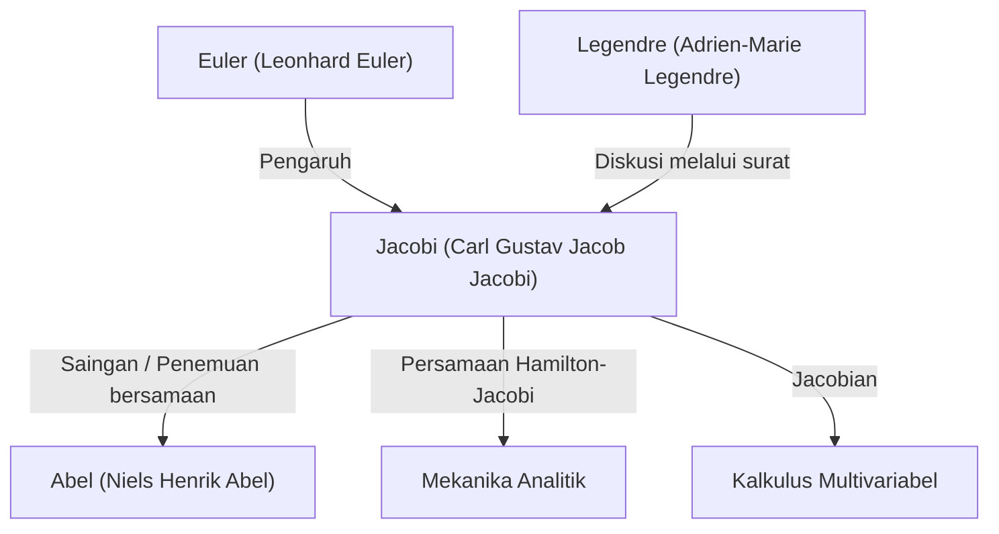

# 1. Pendahuluan: Seorang Pencari Pemikiran Murni

[Carl Gustav Jacob Jacobi](https://kenji.blog/id/p/jacobi/) (1804–1851) adalah seorang **matematikawan Jerman** abad ke-19 yang memberikan kontribusi menentukan pada berbagai bidang seperti aljabar, analisis, teori bilangan, dan mekanika. Bersama dengan Niels Henrik Abel, ia dirayakan sebagai "penemu fungsi eliptik", dan namanya diabadikan dalam "Jacobian" (determinan [Jacobi](https://kenji.blog/id/p/jacobi/)an) yang sering kita temui dalam kalkulus multivariabel saat ini.

Ia menghargai keindahan matematika itu sendiri dan kehormatan jiwa manusia di atas utilitas praktis. Dalam artikel ini, kita akan mendalami kehidupan [Jacobi](https://kenji.blog/id/p/jacobi/), pencapaian matematika utamanya, dan episode-episode terkenal yang ia tinggalkan.

# 2. Kehidupan Awal dan Pendidikan

[Jacobi](https://kenji.blog/id/p/jacobi/) lahir pada 10 Desember 1804 di Potsdam, Kerajaan Prusia (Jerman sekarang), dari keluarga bankir Yahudi yang kaya. Kakaknya, Moritz von [Jacobi](https://kenji.blog/id/p/jacobi/), di kemudian hari juga menjadi fisikawan dan insinyur terkemuka, meninggalkan jejak pada pengembangan motor listrik.

Menunjukkan tanda-tanda kejeniusan sebelum waktunya sejak usia dini, [Jacobi](https://kenji.blog/id/p/jacobi/) masuk Gymnasium (sekolah menengah) di Potsdam dan dengan cepat melampaui siswa yang lebih tua. Pada usia 12 tahun, ia sudah memiliki kemampuan akademis untuk masuk universitas, tetapi karena batasan usia, ia baru bisa mendaftar di Universitas Berlin pada usia 16 tahun. Sementara itu, ia belajar sendiri matematika tingkat lanjut dengan membaca karya-karya master masa lalu seperti Euler dan [Lagrange](https://kenji.blog/id/p/lagrange/).

Setelah masuk Universitas Berlin pada tahun 1821, ia juga belajar filsafat dan filologi, namun akhirnya mengambil jurusan matematika. Ia memperoleh gelar doktornya pada tahun 1825 dan masuk agama Kristen pada tahun yang sama, membuka jalan menuju karir mengajar di universitas (di Prusia pada saat itu, sangat sulit bagi orang Yahudi untuk menjadi profesor penuh).

# 3. Zaman Keemasan di Universitas Königsberg dan Gaya Mengajar

Pada tahun 1826, [Jacobi](https://kenji.blog/id/p/jacobi/) menjadi dosen di Universitas Königsberg, dipromosikan menjadi profesor madya pada tahun 1827, dan menjadi profesor penuh pada tahun 1829 di usia yang sangat muda, 25 tahun. Periode di Königsberg ini menjadi waktu yang paling produktif dan cemerlang dalam karir penelitiannya.

[Jacobi](https://kenji.blog/id/p/jacobi/) juga merupakan pendidik yang luar biasa. Ia memperkenalkan pendidikan gaya **seminar** yang inovatif, mengintegrasikan penelitian mutakhirnya sendiri langsung ke dalam kuliahnya. Mahasiswanya tidak hanya belajar dari buku teks tetapi juga menerima pelatihan sebagai peneliti dengan memecahkan masalah yang belum terpecahkan bersamanya. Pendekatan pendidikan ini sangat sukses dan menghasilkan banyak matematikawan luar biasa di generasi berikutnya, termasuk Rudolf Clebsch dan Ludwig Otto Hesse.

# 4. Pengembangan Fungsi Eliptik dan Persaingan dengan [Abel](https://kenji.blog/id/p/abel/)

Salah satu pencapaian terbesar [Jacobi](https://kenji.blog/id/p/jacobi/) adalah konstruksi teori fungsi eliptik. Integral eliptik muncul ketika menghitung gerakan pendulum atau panjang busur elips, dan [Legendre](https://kenji.blog/id/p/legendre/) serta yang lainnya telah mempelajarinya selama beberapa dekade.

[Jacobi](https://kenji.blog/id/p/jacobi/) memperkenalkan perspektif terobosan dengan mempertimbangkan fungsi invers dari integral tersebut. Hebatnya, jenius muda Norwegia **Abel** telah menemukan pendekatan yang sama secara independen pada waktu yang hampir bersamaan. Baik Jacobi maupun [Abel](https://kenji.blog/id/p/abel/) menemukan periodisitas ganda dari fungsi eliptik, merevolusi bidang ini.

$$ \text{sn}(u, k), \quad \text{cn}(u, k), \quad \text{dn}(u, k) $$

[Jacobi](https://kenji.blog/id/p/jacobi/) mendefinisikan fungsi-fungsi eliptik Jacobian ini dan lebih lanjut memperkenalkan alat analitik baru yang kuat yang disebut "fungsi Theta". Fungsi theta [Jacobi](https://kenji.blog/id/p/jacobi/) $\vartheta(z, \tau)$ didefinisikan sebagai berikut:

$$ \vartheta(z, \tau) = \sum_{n=-\infty}^{\infty} e^{\pi i n^2 \tau + 2 \pi i n z} $$

Pada tahun 1829, ia menerbitkan mahakaryanya, *Fundamenta nova theoriae functionum ellipticarum* (Fondasi Baru Teori Fungsi Eliptik), menyelesaikan sistematisasi bidang ini. Matematikawan Prancis [Legendre](https://kenji.blog/id/p/legendre/) kagum saat mengetahui pencapaian Jacobi dan [Abel](https://kenji.blog/id/p/abel/), yang jauh lebih muda darinya, dan sangat memuji mereka.

# 5. [Jacobi](https://kenji.blog/id/p/jacobi/)an (Determinan [Jacobi](https://kenji.blog/id/p/jacobi/)an) dan Analisis Multivariabel

Dalam kursus kalkulus universitas, saat mempelajari tentang perubahan variabel dalam integral lipat (misalnya, transformasi koordinat polar), semua orang menemukan istilah "[Jacobi](https://kenji.blog/id/p/jacobi/)an". Ini juga berasal dari [Jacobi](https://kenji.blog/id/p/jacobi/).

Saat mempertimbangkan transformasi dari $n$ variabel $x_1, x_2, \dots, x_n$ ke $n$ variabel $y_1, y_2, \dots, y_n$, determinan dari matriks yang terdiri dari turunan parsialnya disebut determinan [Jacobi](https://kenji.blog/id/p/jacobi/)an.

$$ J = \det \begin{pmatrix} \frac{\partial y_1}{\partial x_1} & \cdots & \frac{\partial y_1}{\partial x_n} \\ \vdots & \ddots & \vdots \\ \frac{\partial y_m}{\partial x_1} & \cdots & \frac{\partial y_m}{\partial x_n} \end{pmatrix} $$

[Jacobi](https://kenji.blog/id/p/jacobi/) dengan jelas menunjukkan bahwa determinan ini mewakili faktor skala dari elemen volume di bawah perubahan variabel, dan ia membuktikan peran sentralnya dalam menggeneralisasi teorema fungsi invers dan teorema fungsi implisit.

# 6. Mekanika Analitik: Persamaan Hamilton-[Jacobi](https://kenji.blog/id/p/jacobi/)

Minat [Jacobi](https://kenji.blog/id/p/jacobi/) melampaui matematika murni ke fisika, khususnya mekanika analitik. [Jacobi](https://kenji.blog/id/p/jacobi/) lebih lanjut menyempurnakan sistem mekanika yang dirumuskan oleh matematikawan Irlandia William Rowan Hamilton.

Ia menurunkan **persamaan Hamilton-[Jacobi](https://kenji.blog/id/p/jacobi/)**, sebuah persamaan diferensial parsial untuk menentukan pergerakan sistem mekanis.

$$ H\left(q_i, \frac{\partial S}{\partial q_i}, t\right) + \frac{\partial S}{\partial t} = 0 $$

Di sini, $H$ adalah Hamiltonian (energi total sistem), dan $S$ adalah aksi (atau fungsi utama Hamilton). Persamaan ini memungkinkan untuk menginterpretasikan masalah-masalah dalam mekanika secara mirip dengan propagasi muka gelombang dalam optik, membentuk fondasi teoretis yang penting bagi kelahiran mekanika kuantum (terutama persamaan Schrödinger) di abad ke-20.

# 7. Kontribusi pada Teori Bilangan

[Jacobi](https://kenji.blog/id/p/jacobi/) juga seorang jenius dalam menerapkan penguasaannya atas fungsi eliptik dan fungsi theta pada masalah-masalah yang tampaknya tidak berhubungan dalam teori bilangan.

Ada teorema terkenal yang disebut teorema empat kuadrat [Lagrange](https://kenji.blog/id/p/lagrange/) (setiap bilangan asli dapat direpresentasikan sebagai jumlah dari empat kuadrat bilangan bulat). Menggunakan identitas fungsi theta, [Jacobi](https://kenji.blog/id/p/jacobi/) menurunkan rumus yang memberikan "jumlah cara" yang tepat di mana sebuah bilangan asli $n$ dapat direpresentasikan sebagai jumlah dari empat kuadrat.

$$ r_4(n) = 8 \sum_{d|n, 4\nmid d} d $$

Pendekatan untuk mengungkapkan sifat mendalam teori bilangan menggunakan metode analitis ini berdampak besar pada perkembangan teori bilangan analitik selanjutnya.

# 8. Kepribadian dan Episode Terkenal "Kehormatan Jiwa Manusia"

Episode paling terkenal yang menunjukkan sikap [Jacobi](https://kenji.blog/id/p/jacobi/) terhadap matematika ditemukan dalam suratnya kepada matematikawan Prancis Joseph Fourier. Fourier telah berpendapat bahwa "tujuan utama matematika adalah utilitas publik dan penjelasan fenomena alam". Sebagai tanggapan, [Jacobi](https://kenji.blog/id/p/jacobi/) membantah:

> "Memang benar bahwa Monsieur Fourier berpendapat bahwa tujuan utama matematika adalah utilitas publik dan penjelasan fenomena alam; tetapi seorang filsuf seperti dia seharusnya tahu bahwa satu-satunya tujuan sains adalah **kehormatan jiwa manusia**, dan bahwa di bawah gelar ini sebuah pertanyaan tentang angka sama berharganya dengan pertanyaan tentang sistem dunia."

Kutipan ini tetap menjadi salah satu pernyataan paling kuat dan indah yang membela keberadaan matematika murni, dan masih banyak diceritakan oleh para matematikawan saat ini.

Pada tahun 1843, [Jacobi](https://kenji.blog/id/p/jacobi/) menderita diabetes karena terlalu banyak bekerja dan pergi ke Italia untuk memulihkan diri, menerima bantuan keuangan dari keluarga kerajaan Prusia untuk perjalanan ini. Ia kemudian kembali ke Berlin untuk melanjutkan penelitiannya tetapi terlibat dalam gejolak politik revolusi 1848, menghadapi kesulitan seperti penangguhan gajinya untuk sementara.

# 9. Tahun-Tahun Terakhir dan Warisan

Tahun-tahun terakhir [Jacobi](https://kenji.blog/id/p/jacobi/) diganggu oleh masalah kesehatan dan kesulitan keuangan. Ia meninggal dunia akibat cacar air di Berlin pada 18 Februari 1851, di usia muda 46 tahun.

Namun, warisan yang ia tinggalkan tak ternilai besarnya. Teori fungsi eliptik menjadi tema sentral dalam matematika abad ke-19, dan persamaan Hamilton-[Jacobi](https://kenji.blog/id/p/jacobi/) terus menopang fondasi fisika. Yang terpenting, dedikasinya untuk mencari kebenaran demi "kehormatan jiwa manusia" terus menginspirasi ilmuwan melintasi zaman.

Makamnya terletak di Pemakaman Holy Trinity di Berlin, di mana banyak penggemar matematika masih berkunjung untuk memberikan penghormatan. Intuisi matematika [Jacobi](https://kenji.blog/id/p/jacobi/), kemampuan komputasinya yang luar biasa, dan perspektif luasnya yang mencakup berbagai bidang tidak diragukan lagi menjadikannya salah satu bintang terbesar dalam sejarah matematika.
