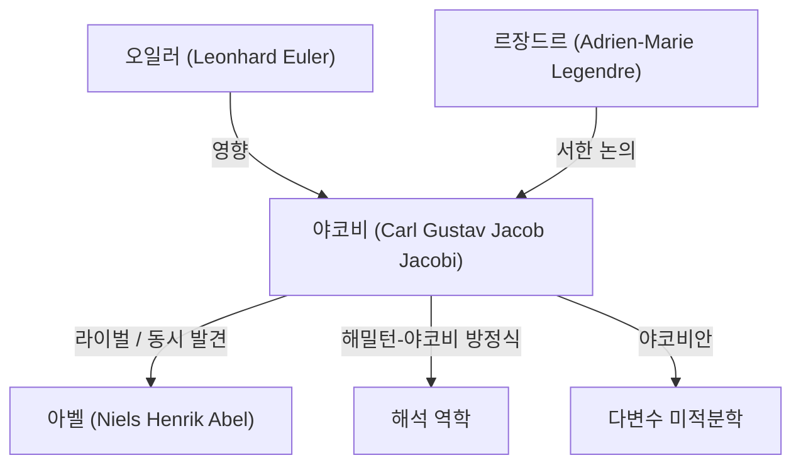

# 1. 서론: 순수한 사고의 탐구자

[카를 구스타프 야코프 야코비](https://kenji.blog/ko/p/jacobi/)(Carl Gustav Jacob Jacobi, 1804–1851)는 19세기의 **독일 수학자** 로서, 대수학, 해석학, 정수론, 역학 등 다방면에 걸쳐 결정적인 공헌을 했습니다. [닐스 헨리크 아벨](https://kenji.blog/ko/p/abel/)과 함께 '타원 함수의 발견자'로 나란히 불리며, 또한 오늘날 우리가 다변수 미적분학에서 자주 접하는 '야코비안(야코비 행렬식)'의 어원이 된 인물이기도 합니다.

그는 실용성보다 수학 자체의 아름다움과 인간 정신의 영광을 중요시했습니다. 본 기사에서는 야코비의 생애, 주요 수학적 업적, 그리고 그가 남긴 유명한 일화에 대해 깊이 파헤쳐 보겠습니다.

# 2. 성장 과정과 교육

야코비는 1804년 12월 10일 프로이센 왕국(현재의 독일) 포츠담에서 부유한 유대인 은행가 집안에서 태어났습니다. 그의 형 모리츠 폰 야코비 역시 훗날 저명한 물리학자 겸 기술자가 되어 전기 모터 개발 등에 이름을 남겼습니다.

어릴 적부터 조숙한 천재성을 발휘한 야코비는 포츠담의 김나지움(고등중학교)에 입학하자마자 순식간에 상급생들을 앞질렀습니다. 12세에 이미 대학에 입학할 수 있는 학력을 갖추었으나, 연령 제한 때문에 16세가 될 때까지 베를린 대학교에 입학할 수 없었습니다. 그동안 그는 오일러나 라그랑주 같은 과거 거장들의 저작을 독학으로 탐독하며 고도화된 수학적 소양을 쌓았습니다.

1821년 베를린 대학교에 입학하여 철학과 문헌학도 공부했지만, 결국 수학을 전공했습니다. 1825년에 박사 학위를 취득하고 같은 해 기독교로 개종하여 대학에서 교편을 잡을 길을 열었습니다(당시 프로이센에서는 유대교도가 대학의 정교수가 되는 것이 극히 어려웠습니다).

# 3. 쾨니히스베르크 대학교에서의 황금기와 교육 스타일

1826년 야코비는 쾨니히스베르크 대학교의 강사가 되었고, 1827년에는 부교수, 1829년에는 불과 25세의 젊은 나이에 정교수로 취임했습니다. 이 쾨니히스베르크에서의 시대가 그의 연구 경력에 있어 가장 생산적이고 눈부신 시기가 됩니다.

야코비는 교육자로서도 매우 뛰어났습니다. 그는 자신의 최첨단 연구를 그대로 강의에서 다루는, 당시로서는 획기적인 **세미나 형식** 의 교육을 도입했습니다. 학생들은 단순히 교과서를 배우는 것에 그치지 않고, 미해결 문제에 함께 몰두함으로써 연구자로서의 훈련을 받았습니다. 이 교육 방식은 큰 성공을 거두었고, 루돌프 클렙슈, 루트비히 오토 헤세 등 차세대 우수한 수학자들을 다수 배출했습니다.

# 4. 타원 함수론의 전개와 아벨과의 라이벌 관계

야코비의 최대 업적 중 하나는 타원 함수론의 구축입니다. 타원 적분은 진자의 운동이나 타원의 호 길이를 계산할 때 나타나는 적분으로, 르장드르 등이 수십 년에 걸쳐 연구하고 있었습니다.

야코비는 적분의 역함수를 생각한다는 획기적인 시점을 도입했습니다. 놀랍게도 노르웨이의 젊은 천재 **아벨** 도 완전히 같은 시기에 완전히 독립적으로 같은 접근법을 발견하고 있었습니다. 야코비와 아벨은 타원 함수의 이중 주기성을 발견하여 이 분야에 혁명을 일으켰습니다.

$$ \text{sn}(u, k), \quad \text{cn}(u, k), \quad \text{dn}(u, k) $$

야코비는 이들 야코비 타원 함수를 정의하고, 나아가 '테타 함수(Theta functions)'라는 새롭고 강력한 해석적 도구를 도입했습니다. 야코비의 테타 함수 $\vartheta(z, \tau)$ 는 다음과 같이 정의됩니다.

$$ \vartheta(z, \tau) = \sum_{n=-\infty}^{\infty} e^{\pi i n^2 \tau + 2 \pi i n z} $$

그는 1829년 명저 『타원 함수론의 새로운 기초(Fundamenta nova theoriae functionum ellipticarum)』를 출판하여 이 분야의 체계화를 완성했습니다. 프랑스의 르장드르는 자신보다 훨씬 젊은 야코비와 아벨의 업적을 알고 경탄하여 그들을 크게 칭송했습니다.

# 5. 야코비안(야코비 행렬식)과 다변수 해석

대학의 미적분학 수업에서 다중 적분의 변수 변환(예를 들어 극좌표 변환 등)을 배울 때 누구나 '야코비안'이라는 단어와 만나게 됩니다. 이것도 야코비에서 유래했습니다.

$n$ 개의 변수 $x_1, x_2, \dots, x_n$ 에서 $n$ 개의 변수 $y_1, y_2, \dots, y_n$ 으로의 변환을 생각할 때, 그 편미분으로 이루어진 행렬의 행렬식을 야코비 행렬식(야코비안)이라고 부릅니다.

$$ J = \det \begin{pmatrix} \frac{\partial y_1}{\partial x_1} & \cdots & \frac{\partial y_1}{\partial x_n} \\ \vdots & \ddots & \vdots \\ \frac{\partial y_m}{\partial x_1} & \cdots & \frac{\partial y_m}{\partial x_n} \end{pmatrix} $$

야코비는 이 행렬식이 변수 변환에 있어서 부피 요소의 확대·축소율을 나타냄을 명확히 제시하였고, 역함수 정리 및 음함수 정리의 일반화에 있어 중심적인 역할을 한다는 것을 증명했습니다.

# 6. 해석 역학: 해밀턴-야코비 방정식

야코비의 관심은 순수 수학에 머물지 않고 물리학, 특히 해석 역학에도 깊이 미쳤습니다. 아일랜드의 수학자 윌리엄 로언 해밀턴이 정식화한 역학 체계를 야코비는 더욱 세련되게 다듬었습니다.

그는 역학계의 운동을 결정하기 위한 편미분 방정식인 **해밀턴-야코비 방정식** 을 도출했습니다.

$$ H\left(q_i, \frac{\partial S}{\partial q_i}, t\right) + \frac{\partial S}{\partial t} = 0 $$

여기서 $H$ 는 해밀토니안(계의 총 에너지), $S$ 는 작용 함수(또는 해밀턴의 주함수)입니다. 이 방정식은 역학 문제를 광학에서의 파면 전파처럼 해석하는 것을 가능하게 했으며, 훗날 20세기에 양자 역학(특히 슈뢰딩거 방정식)이 탄생할 때의 중요한 이론적 토대가 되었습니다.

# 7. 정수론에 대한 공헌

야코비는 자신이 특기로 하는 타원 함수론이나 테타 함수를 언뜻 보기에 관계없는 정수론 문제에 응용하는 천재이기도 했습니다.

라그랑주의 네 제곱수 정리(모든 자연수는 네 개의 제곱수의 합으로 나타낼 수 있다)라는 유명한 정리가 있는데, 야코비는 테타 함수의 항등식을 이용함으로써 어떤 자연수 $n$ 을 네 개의 제곱수의 합으로 나타내는 '방법의 수'를 정확하게 제시하는 공식을 이끌어 냈습니다.

$$ r_4(n) = 8 \sum_{d|n, 4\nmid d} d $$

이처럼 해석적 기법을 이용하여 정수론의 깊은 성질을 밝혀내는 접근법은 훗날 해석적 정수론의 발전에 지대한 영향을 미쳤습니다.

# 8. 인간상과 유명한 일화 '인간 정신의 영광'

야코비의 수학에 대한 자세를 보여주는 가장 유명한 일화는 프랑스의 수학자 조제프 푸리에에게 보낸 그의 편지 속에 있습니다. 푸리에는 "수학의 주요 목적은 공공의 이익과 자연 현상의 해명에 있다"고 주장했습니다. 이에 대해 야코비는 다음과 같이 반박했습니다.

> "푸리에 씨 정도 되는 철학자가 모든 과학의 유일한 목적은 **인간 정신의 영광** 이라는 것, 그리고 이 관점에서 보면 수에 관한 문제는 우주 체계에 관한 문제와 완전히 같은 가치를 지닌다는 것을 모른다는 것은 놀라운 일이다."

이 말은 순수 수학의 존재 의의를 옹호하는 가장 강력하고 아름다운 선언으로서 현재까지도 많은 수학자들 사이에서 회자되고 있습니다.

1843년, 야코비는 과로로 인해 당뇨병을 앓게 되어 요양을 위해 이탈리아로 떠났습니다. 이때 프로이센 왕실로부터 자금 원조를 받았습니다. 이후 베를린으로 돌아와 연구를 계속했지만, 1848년 혁명에 휘말려 정치적인 어려움에 직면하였고, 일시적으로 급여 지급이 정지되는 등의 곤경에 처하기도 했습니다.

# 9. 만년과 유산

야코비의 만년은 건강 문제와 경제적 어려움으로 고통받았습니다. 그는 1851년 2월 18일, 베를린에서 천연두로 인해 46세의 젊은 나이에 세상을 떠났습니다.

하지만 그가 남긴 유산은 헤아릴 수 없습니다. 타원 함수론은 19세기 수학의 중심적인 주제가 되었고, 해밀턴-야코비 방정식은 물리학의 근간을 계속해서 지탱하고 있습니다. 무엇보다 그의 '인간 정신의 영광'을 위해 진리를 추구하는 자세는 시대를 초월하여 과학자들에게 영감을 주고 있습니다.

그의 무덤은 베를린의 삼위일체 교회 묘지에 있으며, 지금도 많은 수학 팬들이 경의를 표하기 위해 찾고 있습니다. 야코비의 수학적 직관과 압도적인 계산력, 그리고 분야를 넘나드는 넓은 시야는 그를 틀림없이 수학사에서 가장 위대한 거성 중 한 명으로 만들고 있습니다.
