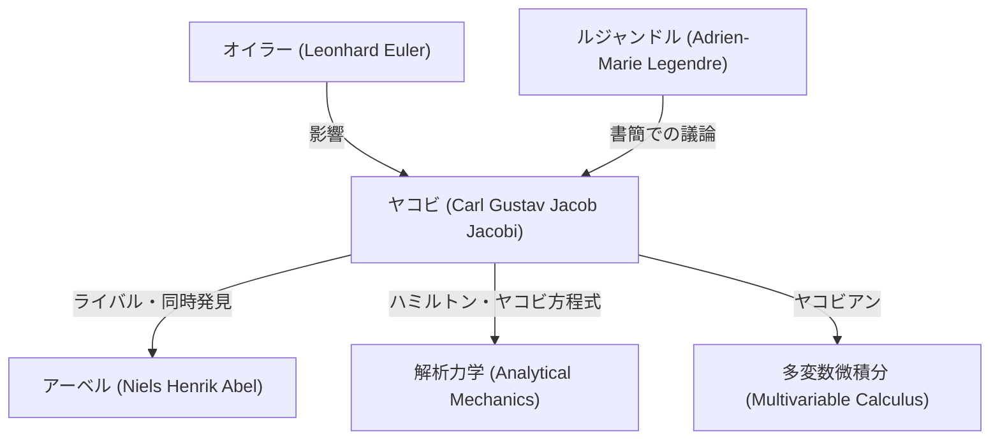

# 1. はじめに：純粋な思考の探求者

[カール・グスタフ・ヤコブ・ヤコビ](https://kenji.blog/p/jacobi/)（Carl Gustav Jacob Jacobi, 1804–1851）は、19世紀の **ドイツの数学者** であり、代数学、解析学、数論、力学といった多岐にわたる分野で決定的な貢献を果たしました。[ニールス・ヘンリック・アーベル](/p/abel/)とともに「楕円関数の発見者」として並び称され、また今日私たちが多変数微積分で頻繁に目にする「ヤコビアン（[ヤコビ](https://kenji.blog/p/jacobi/)[行列式](/p/geometric-meaning-of-determinant/)）」の語源となった人物でもあります。

彼は実用性よりも数学そのものの美しさと人間の精神の栄光を重んじました。本記事では、[ヤコビ](https://kenji.blog/p/jacobi/)の生涯、主要な数学的業績、そして彼が残した有名なエピソードについて深く掘り下げていきます。

# 2. 生い立ちと教育

[ヤコビ](https://kenji.blog/p/jacobi/)は1804年12月10日、プロイセン王国（現在のドイツ）のポツダムで、裕福なユダヤ人の銀行家の家庭に生まれました。彼の兄、モーリッツ・フォン・[ヤコビ](https://kenji.blog/p/jacobi/)も後に著名な物理学者・技術者となり、電気モーターの開発などで名を残しています。

幼い頃から早熟な天才ぶりを発揮した[ヤコビ](https://kenji.blog/p/jacobi/)は、ポツダムのギムナジウム（高等中学校）に入学すると、瞬く間に上級生を追い越してしまいました。12歳にしてすでに大学に入学できるほどの学力を備えていましたが、年齢制限のため16歳になるまでベルリン大学に入学することはできませんでした。その間、彼はオイラーや[ラグランジュ](https://kenji.blog/p/lagrange/)といった過去の巨匠たちの著作を独学で読み漁り、高度な数学の素養を身につけました。

1821年にベルリン大学に入学すると、哲学や文献学も学びましたが、最終的には数学を専攻しました。1825年に博士号を取得し、同じ年にキリスト教に改宗して、大学での教職に就く道を開きました（当時のプロイセンでは、ユダヤ教徒が大学の正教授になることは極めて困難でした）。

# 3. ケーニヒスベルク大学での黄金期と教育スタイル

1826年、[ヤコビ](https://kenji.blog/p/jacobi/)はケーニヒスベルク大学の講師となり、1827年には助教授、1829年にはわずか25歳で正教授に就任しました。このケーニヒスベルクでの時代が、彼の研究キャリアにおいて最も生産的で輝かしい時期となります。

[ヤコビ](https://kenji.blog/p/jacobi/)は教育者としても非常に優れていました。彼は、自らの最先端の研究をそのまま講義で扱うという、当時としては斬新な **セミナー形式** の教育を導入しました。学生たちは単に教科書を学ぶだけでなく、未解決の問題に共に取り組むことで、研究者としての訓練を受けました。この教育手法は大きな成功を収め、ルドルフ・クレプシュやルートヴィヒ・オットー・ヘッセなど、次世代の優れた数学者たちを多数輩出しました。

# 4. 楕円関数論の展開と[アーベル](https://kenji.blog/p/abel/)とのライバル関係

[ヤコビ](https://kenji.blog/p/jacobi/)の最大の業績の一つは、楕円関数論の構築です。楕円積分は、振り子の運動や楕円の弧長を計算する際に現れる積分であり、[ルジャンドル](https://kenji.blog/p/legendre/)らが数十年にわたって研究していました。

[ヤコビ](https://kenji.blog/p/jacobi/)は、積分の逆関数を考えるという画期的な視点を取り入れました。驚くべきことに、ノルウェーの若き天才 **アーベル** も全く同時期に同じアプローチを発見していました。ヤコビと[アーベル](https://kenji.blog/p/abel/)は、互いに独立して楕円関数の二重周期性を発見し、この分野に革命をもたらしました。

$$ \text{sn}(u, k), \quad \text{cn}(u, k), \quad \text{dn}(u, k) $$

[ヤコビ](https://kenji.blog/p/jacobi/)はこれらのヤコビの楕円関数を定義し、さらに「テータ関数（Theta functions）」という新しい強力な解析的道具を導入しました。[ヤコビ](https://kenji.blog/p/jacobi/)のテータ関数 $\vartheta(z, \tau)$ は以下のように定義されます。

$$ \vartheta(z, \tau) = \sum_{n=-\infty}^{\infty} e^{\pi i n^2 \tau + 2 \pi i n z} $$

彼は1829年に名著『楕円関数論の新しい基礎（Fundamenta nova theoriae functionum ellipticarum）』を出版し、この分野の体系化を完成させました。フランスの[ルジャンドル](https://kenji.blog/p/legendre/)は、自分よりずっと若いヤコビと[アーベル](https://kenji.blog/p/abel/)の業績を知って驚嘆し、彼らを大いに称賛しました。

# 5. [ヤコビ](https://kenji.blog/p/jacobi/)アン（[ヤコビ](https://kenji.blog/p/jacobi/)行列式）と多変数解析

大学の微分積分の授業で、多重積分における変数変換（例えば極座標変換など）を学ぶ際、誰もが「[ヤコビ](https://kenji.blog/p/jacobi/)アン」という言葉に出会うはずです。これも[ヤコビ](https://kenji.blog/p/jacobi/)に由来しています。

$n$ 個の変数 $x_1, x_2, \dots, x_n$ から $n$ 個の変数 $y_1, y_2, \dots, y_n$ への変換を考えるとき、その偏微分からなる行列の[行列式](/p/geometric-meaning-of-determinant/)を[ヤコビ](https://kenji.blog/p/jacobi/)[行列式](/p/geometric-meaning-of-determinant/)（[ヤコビ](https://kenji.blog/p/jacobi/)アン）と呼びます。

$$ J = \det \begin{pmatrix} \frac{\partial y_1}{\partial x_1} & \cdots & \frac{\partial y_1}{\partial x_n} \\ \vdots & \ddots & \vdots \\ \frac{\partial y_m}{\partial x_1} & \cdots & \frac{\partial y_m}{\partial x_n} \end{pmatrix} $$

[ヤコビ](https://kenji.blog/p/jacobi/)は、この[行列式](/p/geometric-meaning-of-determinant/)が変数変換において体積要素の拡大・縮小率を表すことを明確に示し、逆関数定理や陰関数定理の一般化において中心的な役割を果たすことを証明しました。

# 6. 解析力学：ハミルトン・[ヤコビ](https://kenji.blog/p/jacobi/)方程式

[ヤコビ](https://kenji.blog/p/jacobi/)の関心は純粋数学にとどまらず、物理学、特に解析力学にも深く及びました。アイルランドの数学者ウィリアム・ローワン・ハミルトンが定式化した力学の体系を、[ヤコビ](https://kenji.blog/p/jacobi/)はさらに洗練させました。

彼は、力学系の運動を決定するための偏微分方程式である **ハミルトン・[ヤコビ](https://kenji.blog/p/jacobi/)方程式** を導出しました。

$$ H\left(q_i, \frac{\partial S}{\partial q_i}, t\right) + \frac{\partial S}{\partial t} = 0 $$

ここで、$H$ はハミルトニアン（系の全エネルギー）、$S$ は作用関数（またはハミルトンの主関数）です。この方程式は、力学の問題を光学における波面の伝播のように解釈することを可能にし、後の20世紀に量子力学（特にシュレーディンガー方程式）が誕生する際の重要な理論的土台となりました。

# 7. 整数論への貢献

[ヤコビ](https://kenji.blog/p/jacobi/)は、自身の得意とする楕円関数論やテータ関数を、一見関係のない整数論の問題に応用する天才でもありました。

[ラグランジュ](https://kenji.blog/p/lagrange/)の四平方定理（すべての自然数は4つの平方数の和で表される）という有名な定理がありますが、[ヤコビ](https://kenji.blog/p/jacobi/)はテータ関数の恒等式を用いることで、ある自然数 $n$ を4つの平方数の和で表す「方法の数」を正確に与える公式を導き出しました。

$$ r_4(n) = 8 \sum_{d|n, 4\nmid d} d $$

このように、解析的手法を用いて整数論の深い性質を明らかにするアプローチは、後の解析的整数論の発展に多大な影響を与えました。

# 8. 人間像と有名なエピソード「人間の精神の栄光」

[ヤコビ](https://kenji.blog/p/jacobi/)の数学に対する姿勢を示す最も有名なエピソードは、フランスの数学者ジョゼフ・フーリエに対する彼の手紙の中にあります。フーリエは「数学の主要な目的は公共の利益と自然現象の解明にある」と主張していました。それに対して[ヤコビ](https://kenji.blog/p/jacobi/)は次のように反論しました。

> 「フーリエ氏ほどの哲学者が、すべての科学の唯一の目的は **人間の精神の栄光（the honor of the human spirit）** であること、そしてこの観点から見れば、数論の問題は世界体系の物理的応用と全く同じ価値を持つということを知らないのは驚きである。」

この言葉は、純粋数学の存在意義を擁護する最も力強く美しい宣言として、現在でも多くの数学者に語り継がれています。

1843年、[ヤコビ](https://kenji.blog/p/jacobi/)は過労により糖尿病を患い、静養のためにイタリアへ赴くことになりました。この際、プロイセン王室からの資金援助を受けています。その後ベルリンに戻り研究を続けましたが、1848年の革命に巻き込まれて政治的な困難に直面し、一時的に給与を停止されるなどの苦境にも立たされました。

# 9. 晩年と遺産

[ヤコビ](https://kenji.blog/p/jacobi/)の晩年は健康問題と経済的困難に悩まされました。彼は1851年2月18日、ベルリンにおいて天然痘により46歳の若さでこの世を去りました。

しかし、彼の残した遺産は計り知れません。楕円関数論は19世紀数学の中心的なテーマとなり、ハミルトン・[ヤコビ](https://kenji.blog/p/jacobi/)方程式は物理学の根幹を支え続けています。何より、彼の「人間の精神の栄光」のために真理を追求する姿勢は、時代を超えて科学者たちにインスピレーションを与え続けています。

彼の墓はベルリンの聖三位一体教会墓地にあり、現在でも多くの数学ファンが敬意を表すために訪れています。[ヤコビ](https://kenji.blog/p/jacobi/)の数学的直観と圧倒的な計算力、そして分野を横断する広い視野は、彼を間違いなく数学史上の偉大な巨星の一人にしています。
