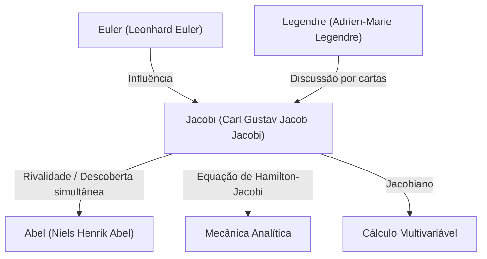

# 1. Introdução: Um Buscador do Pensamento Puro

[Carl Gustav Jacob Jacobi](https://kenji.blog/pt/p/jacobi/) (1804–1851) foi um **matemático alemão** do século XIX que fez contribuições decisivas para diversos campos como álgebra, análise, teoria dos números e mecânica. Junto com [Niels Henrik Abel](/pt/p/abel/), ele é celebrado como o "descobridor das funções elípticas", e é o homônimo do "[Jacobi](https://kenji.blog/pt/p/jacobi/)ano" (determinante jacobiano) que frequentemente encontramos no cálculo multivariável hoje.

Ele valorizava a beleza da matemática em si e a honra do espírito humano acima da utilidade prática. Neste artigo, nos aprofundaremos na vida de [Jacobi](https://kenji.blog/pt/p/jacobi/), suas principais conquistas matemáticas e os famosos episódios que ele deixou para trás.

# 2. Início de Vida e Educação

[Jacobi](https://kenji.blog/pt/p/jacobi/) nasceu em 10 de dezembro de 1804, em Potsdam, Reino da Prússia (atual Alemanha), em uma rica família de banqueiros judeus. Seu irmão mais velho, Moritz von [Jacobi](https://kenji.blog/pt/p/jacobi/), também mais tarde se tornou um proeminente físico e engenheiro, deixando sua marca no desenvolvimento de motores elétricos.

Mostrando sinais de gênio precoce desde cedo, [Jacobi](https://kenji.blog/pt/p/jacobi/) entrou no Gymnasium (escola secundária) em Potsdam e rapidamente superou os alunos mais velhos. Aos 12 anos, ele já tinha a capacidade acadêmica para entrar na universidade, mas devido a restrições de idade, não pôde se matricular na Universidade de Berlim até completar 16 anos. Nesse meio tempo, ele aprendeu sozinho matemática avançada lendo as obras de mestres do passado como Euler e [Lagrange](https://kenji.blog/pt/p/lagrange/).

Ao entrar na Universidade de Berlim em 1821, ele também estudou filosofia e filologia, mas acabou se formando em matemática. Obteve seu doutorado em 1825 e converteu-se ao cristianismo no mesmo ano, abrindo o caminho para uma carreira de professor na universidade (na Prússia da época, era extremamente difícil para judeus se tornarem professores titulares).

# 3. Era de Ouro na Universidade de Königsberg e Estilo de Ensino

Em 1826, [Jacobi](https://kenji.blog/pt/p/jacobi/) tornou-se professor na Universidade de Königsberg, foi promovido a professor associado em 1827 e a professor titular em 1829 na idade notavelmente jovem de 25 anos. Este período em Königsberg tornou-se a época mais produtiva e brilhante de sua carreira de pesquisador.

[Jacobi](https://kenji.blog/pt/p/jacobi/) também foi um educador excepcional. Ele introduziu uma educação inovadora no estilo de **seminário**, integrando sua própria pesquisa de ponta diretamente em suas palestras. Seus alunos não aprendiam apenas com livros didáticos, mas recebiam treinamento como pesquisadores abordando problemas não resolvidos junto com ele. Essa abordagem educacional foi muito bem-sucedida e produziu muitos matemáticos excepcionais da geração seguinte, incluindo Rudolf Clebsch e Ludwig Otto Hesse.

# 4. Desenvolvimento das Funções Elípticas e Rivalidade com [Abel](https://kenji.blog/pt/p/abel/)

Uma das maiores conquistas de [Jacobi](https://kenji.blog/pt/p/jacobi/) é a construção da teoria das funções elípticas. As integrais elípticas aparecem ao calcular o movimento de um pêndulo ou o comprimento do arco de uma elipse, e [Legendre](https://kenji.blog/pt/p/legendre/) e outros as estudavam há décadas.

[Jacobi](https://kenji.blog/pt/p/jacobi/) introduziu a perspectiva inovadora de considerar a função inversa da integral. Notavelmente, o jovem gênio norueguês **Abel** descobriu a mesma abordagem de forma totalmente independente quase ao mesmo tempo. Tanto Jacobi quanto [Abel](https://kenji.blog/pt/p/abel/) descobriram a dupla periodicidade das funções elípticas, revolucionando o campo.

$$ \text{sn}(u, k), \quad \text{cn}(u, k), \quad \text{dn}(u, k) $$

[Jacobi](https://kenji.blog/pt/p/jacobi/) definiu essas funções elípticas jacobianas e também introduziu uma nova e poderosa ferramenta analítica chamada "funções Teta". A função teta de [Jacobi](https://kenji.blog/pt/p/jacobi/) $\vartheta(z, \tau)$ é definida da seguinte forma:

$$ \vartheta(z, \tau) = \sum_{n=-\infty}^{\infty} e^{\pi i n^2 \tau + 2 \pi i n z} $$

Em 1829, publicou sua obra-prima, *Fundamenta nova theoriae functionum ellipticarum* (Novos Fundamentos da Teoria das Funções Elípticas), completando a sistematização desta área. O matemático francês [Legendre](https://kenji.blog/pt/p/legendre/) ficou maravilhado ao saber das conquistas de Jacobi e [Abel](https://kenji.blog/pt/p/abel/), que eram muito mais jovens do que ele, e os elogiou muito.

# 5. O [Jacobi](https://kenji.blog/pt/p/jacobi/)ano (Determinante [Jacobi](https://kenji.blog/pt/p/jacobi/)ano) e a Análise Multivariável

Nos cursos universitários de cálculo, ao aprender sobre a mudança de variáveis em integrais múltiplas (por exemplo, transformações de coordenadas polares), todos encontram o termo "[Jacobi](https://kenji.blog/pt/p/jacobi/)ano". Isso também se origina de [Jacobi](https://kenji.blog/pt/p/jacobi/).

Ao considerar uma transformação de $n$ variáveis $x_1, x_2, \dots, x_n$ para $n$ variáveis $y_1, y_2, \dots, y_n$, o determinante da matriz que consiste em suas derivadas parciais é chamado de determinante jacobiano.

$$ J = \det \begin{pmatrix} \frac{\partial y_1}{\partial x_1} & \cdots & \frac{\partial y_1}{\partial x_n} \\ \vdots & \ddots & \vdots \\ \frac{\partial y_m}{\partial x_1} & \cdots & \frac{\partial y_m}{\partial x_n} \end{pmatrix} $$

[Jacobi](https://kenji.blog/pt/p/jacobi/) mostrou claramente que este determinante representa o fator de escala de elementos de volume sob uma mudança de variáveis, e provou seu papel central na generalização do teorema da função inversa e do teorema da função implícita.

# 6. Mecânica Analítica: A Equação de Hamilton-[Jacobi](https://kenji.blog/pt/p/jacobi/)

Os interesses de [Jacobi](https://kenji.blog/pt/p/jacobi/) estendiam-se além da matemática pura para a física, particularmente a mecânica analítica. [Jacobi](https://kenji.blog/pt/p/jacobi/) refinou ainda mais o sistema de mecânica formulado pelo matemático irlandês William Rowan Hamilton.

Ele derivou a **equação de Hamilton-[Jacobi](https://kenji.blog/pt/p/jacobi/)**, uma equação diferencial parcial para determinar o movimento de um sistema mecânico.

$$ H\left(q_i, \frac{\partial S}{\partial q_i}, t\right) + \frac{\partial S}{\partial t} = 0 $$

Aqui, $H$ é o hamiltoniano (energia total do sistema) e $S$ é a ação (ou função principal de Hamilton). Esta equação tornou possível interpretar problemas na mecânica de forma semelhante à propagação de frentes de onda na óptica, formando um importante alicerce teórico para o nascimento da mecânica quântica (especialmente a equação de Schrödinger) no século XX.

# 7. Contribuições à Teoria dos Números

[Jacobi](https://kenji.blog/pt/p/jacobi/) também era um gênio na aplicação de seu domínio sobre funções elípticas e funções teta a problemas aparentemente não relacionados na teoria dos números.

Existe um teorema famoso chamado teorema dos quatro quadrados de [Lagrange](https://kenji.blog/pt/p/lagrange/) (todo número natural pode ser representado como a soma de quatro quadrados de números inteiros). Usando identidades de funções teta, [Jacobi](https://kenji.blog/pt/p/jacobi/) derivou uma fórmula que dá o exato "número de maneiras" pelas quais um número natural $n$ pode ser representado como a soma de quatro quadrados.

$$ r_4(n) = 8 \sum_{d|n, 4\nmid d} d $$

Esta abordagem de revelar verdades profundas da teoria dos números usando métodos analíticos teve um impacto enorme no desenvolvimento subsequente da teoria analítica dos números.

# 8. Personalidade e o Famoso Episódio "A Honra do Espírito Humano"

O episódio mais famoso que demonstra a atitude de [Jacobi](https://kenji.blog/pt/p/jacobi/) em relação à matemática é encontrado em sua carta ao matemático francês Joseph Fourier. Fourier havia argumentado que "o principal objetivo da matemática é a utilidade pública e a explicação de fenômenos naturais". Em resposta, [Jacobi](https://kenji.blog/pt/p/jacobi/) rebateu:

> "É verdade que Monsieur Fourier tinha a opinião de que o principal objetivo da matemática era a utilidade pública e a explicação dos fenômenos naturais; mas um filósofo como ele deveria saber que o único objetivo da ciência é **a honra do espírito humano**, e que, sob este título, uma questão sobre números vale tanto quanto uma questão sobre o sistema do mundo."

Esta citação continua a ser uma das declarações mais poderosas e bonitas defendendo a existência da matemática pura, e ainda é amplamente contada por matemáticos de hoje.

Em 1843, [Jacobi](https://kenji.blog/pt/p/jacobi/) sofreu de diabetes devido ao excesso de trabalho e foi à Itália para se recuperar, recebendo assistência financeira da família real prussiana para esta jornada. Mais tarde, ele retornou a Berlim para continuar sua pesquisa, mas envolveu-se na turbulência política da revolução de 1848, enfrentando dificuldades como a suspensão temporária de seu salário.

# 9. Últimos Anos e Legado

Os últimos anos de [Jacobi](https://kenji.blog/pt/p/jacobi/) foram atormentados por problemas de saúde e dificuldades financeiras. Ele faleceu de varíola em Berlim em 18 de fevereiro de 1851, na jovem idade de 46 anos.

No entanto, o legado que ele deixou para trás é imensurável. A teoria das funções elípticas tornou-se um tema central na matemática do século XIX, e a equação de Hamilton-[Jacobi](https://kenji.blog/pt/p/jacobi/) continua a sustentar os fundamentos da física. Acima de tudo, sua dedicação à busca da verdade pela "honra do espírito humano" continua a inspirar cientistas ao longo das eras.

Seu túmulo está localizado no Cemitério da Trindade em Berlim, onde muitos entusiastas da matemática ainda o visitam para prestar suas homenagens. A intuição matemática de [Jacobi](https://kenji.blog/pt/p/jacobi/), sua formidável capacidade computacional e sua ampla perspectiva abrangendo múltiplos campos indubitavelmente fazem dele uma das maiores estrelas na história da matemática.
