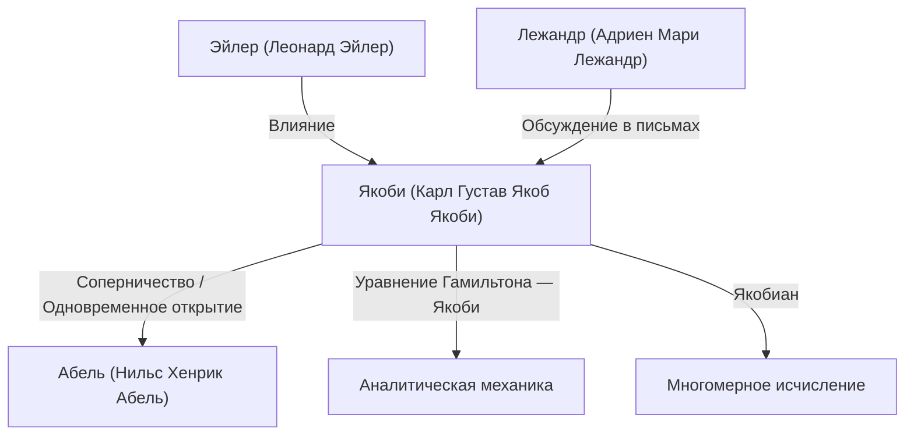

# 1. Введение: Искатель чистой мысли

[Карл Густав Якоб Якоби](https://kenji.blog/p/jacobi/) (1804–1851) был **немецким математиком** XIX века, внесшим решающий вклад в различные области, такие как алгебра, анализ, теория чисел и механика. Наряду с Нильсом Хенриком Абелем, он известен как "открыватель эллиптических функций", а его именем назван "якобиан" (определитель Якоби), с которым мы часто сталкиваемся сегодня в многомерном исчислении.

Он ценил красоту самой математики и честь человеческого духа выше практической пользы. В этой статье мы подробно рассмотрим жизнь Якоби, его основные математические достижения и известные эпизоды из его жизни.

# 2. Ранние годы и образование

Якоби родился 10 декабря 1804 года в Потсдаме, Королевство Пруссия (современная Германия), в богатой семье еврейского банкира. Его старший брат, Мориц фон Якоби, позже также стал выдающимся физиком и инженером, оставившим свой след в разработке электродвигателей.

Демонстрируя признаки ранней гениальности с юных лет, Якоби поступил в гимназию в Потсдаме и быстро превзошел старшеклассников. В 12 лет у него уже были достаточные академические способности для поступления в университет, но из-за возрастных ограничений он смог поступить в Берлинский университет только в 16 лет. В это время он самостоятельно изучал высшую математику, читая труды мастеров прошлого, таких как Эйлер и Лагранж.

Поступив в Берлинский университет в 1821 году, он также изучал философию и филологию, но в итоге стал специализироваться на математике. Он получил докторскую степень в 1825 году и в том же году принял христианство, что открыло ему путь к преподавательской карьере в университете (в Пруссии того времени евреям было крайне сложно стать полными профессорами).

# 3. Золотой век в Кенигсбергском университете и стиль преподавания

В 1826 году Якоби стал лектором Кенигсбергского университета, в 1827 году получил звание доцента, а в 1829 году, в возрасте всего 25 лет, стал полным профессором. Этот период в Кенигсберге стал самым продуктивным и блестящим временем в его исследовательской карьере.

Якоби также был выдающимся педагогом. Он ввел новаторскую систему образования в форме **семинаров**, интегрируя свои собственные передовые исследования непосредственно в лекции. Его студенты не просто учились по учебникам, а получали исследовательскую подготовку, вместе с ним решая нерешенные проблемы. Этот образовательный подход имел огромный успех и позволил воспитать многих выдающихся математиков следующего поколения, включая Рудольфа Клебша и Людвига Отто Гессе.

# 4. Развитие эллиптических функций и соперничество с Абелем

Одним из величайших достижений Якоби является создание теории эллиптических функций. Эллиптические интегралы возникают при расчете движения маятника или длины дуги эллипса, и Лежандр и другие изучали их на протяжении десятилетий.

Якоби применил новаторский подход, рассмотрев обратную функцию от интеграла. Примечательно, что молодой норвежский гений **Абель** открыл тот же самый подход совершенно независимо примерно в то же время. И Якоби, и Абель открыли двоякопериодичность эллиптических функций, произведя революцию в этой области.

$$ \text{sn}(u, k), \quad \text{cn}(u, k), \quad \text{dn}(u, k) $$

Якоби определил эти эллиптические функции Якоби и далее ввел новый мощный аналитический инструмент под названием "Тета-функции". Тета-функция Якоби $\vartheta(z, \tau)$ определяется следующим образом:

$$ \vartheta(z, \tau) = \sum_{n=-\infty}^{\infty} e^{\pi i n^2 \tau + 2 \pi i n z} $$

В 1829 году он опубликовал свой шедевр *Fundamenta nova theoriae functionum ellipticarum* (Новые основы теории эллиптических функций), завершив систематизацию этой области. Французский математик Лежандр был поражен, узнав о достижениях Якоби и Абеля, которые были намного моложе его, и высоко оценил их.

# 5. Якобиан (Определитель Якоби) и многомерный анализ

На университетских курсах математического анализа, изучая замену переменных в кратных интегралах (например, преобразование в полярные координаты), все сталкиваются с термином "якобиан". Это также берет свое начало от Якоби.

При рассмотрении преобразования $n$ переменных $x_1, x_2, \dots, x_n$ в $n$ переменных $y_1, y_2, \dots, y_n$ определитель матрицы, состоящей из их частных производных, называется определителем Якоби или якобианом.

$$ J = \det \begin{pmatrix} \frac{\partial y_1}{\partial x_1} & \cdots & \frac{\partial y_1}{\partial x_n} \\ \vdots & \ddots & \vdots \\ \frac{\partial y_m}{\partial x_1} & \cdots & \frac{\partial y_m}{\partial x_n} \end{pmatrix} $$

Якоби ясно показал, что этот определитель представляет собой коэффициент масштабирования элементов объема при замене переменных, и он доказал его центральную роль в обобщении теоремы об обратной функции и теоремы о неявной функции.

# 6. Аналитическая механика: Уравнение Гамильтона — Якоби

Интересы Якоби выходили за рамки чистой математики и распространялись на физику, в частности, на аналитическую механику. Якоби усовершенствовал систему механики, сформулированную ирландским математиком Уильямом Роуэном Гамильтоном.

Он вывел **уравнение Гамильтона — Якоби** — дифференциальное уравнение в частных производных для определения движения механической системы.

$$ H\left(q_i, \frac{\partial S}{\partial q_i}, t\right) + \frac{\partial S}{\partial t} = 0 $$

Здесь $H$ — гамильтониан (полная энергия системы), а $S$ — действие (или главная функция Гамильтона). Это уравнение позволило интерпретировать проблемы в механике аналогично распространению волновых фронтов в оптике, став важной теоретической основой для зарождения квантовой механики (особенно уравнения Шредингера) в XX веке.

# 7. Вклад в теорию чисел

Якоби был также гением в применении своего владения эллиптическими функциями и тета-функциями к на первый взгляд не связанным с ними проблемам теории чисел.

Существует известная теорема Лагранжа о сумме четырех квадратов (любое натуральное число можно представить в виде суммы четырех квадратов целых чисел). Используя тождества тета-функций, Якоби вывел формулу, которая дает точное "число способов", которыми натуральное число $n$ может быть представлено в виде суммы четырех квадратов.

$$ r_4(n) = 8 \sum_{d|n, 4\nmid d} d $$

Этот подход, раскрывающий глубокие свойства теории чисел с помощью аналитических методов, оказал огромное влияние на последующее развитие аналитической теории чисел.

# 8. Личность и известный эпизод "Честь человеческого духа"

Самый известный эпизод, демонстрирующий отношение Якоби к математике, можно найти в его письме французскому математику Жозефу Фурье. Фурье утверждал, что "главная цель математики — общественная польза и объяснение природных явлений". В ответ Якоби возразил:

> "Это правда, что господин Фурье придерживался мнения, что главной целью математики является общественная польза и объяснение природных явлений; но такой философ, как он, должен был знать, что единственная цель науки — это **честь человеческого духа**, и что в этом смысле вопрос о числах стоит столько же, сколько вопрос о системе мира".

Эта цитата остается одним из самых сильных и красивых заявлений в защиту существования чистой математики, и современные математики до сих пор широко цитируют ее.

В 1843 году из-за переутомления Якоби заболел диабетом и отправился в Италию на лечение, получив для этого путешествия финансовую помощь от прусской королевской семьи. Позже он вернулся в Берлин, чтобы продолжить свои исследования, но оказался втянутым в политические потрясения революции 1848 года, столкнувшись с трудностями, такими как временная приостановка выплаты жалования.

# 9. Последние годы и наследие

Последние годы жизни Якоби были омрачены проблемами со здоровьем и финансовыми трудностями. Он скончался от оспы в Берлине 18 февраля 1851 года в возрасте 46 лет.

Однако наследие, которое он оставил после себя, неизмеримо. Теория эллиптических функций стала центральной темой математики XIX века, а уравнение Гамильтона — Якоби продолжает служить фундаментом физики. Прежде всего, его преданность поиску истины ради "чести человеческого духа" продолжает вдохновлять ученых на протяжении столетий.

Его могила находится на кладбище Святой Троицы в Берлине, куда до сих пор приходят многие энтузиасты математики, чтобы отдать дань уважения. Математическая интуиция Якоби, его потрясающие вычислительные способности и широта взглядов, охватывающих множество областей, несомненно, делают его одной из величайших звезд в истории математики.
