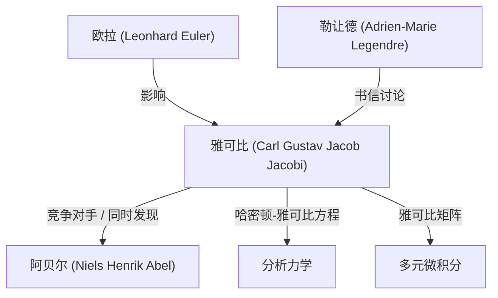

# 1. 引言：纯粹思想的探索者

[卡尔·古斯塔夫·雅各布·雅可比](https://kenji.blog/p/jacobi/)（[Carl Gustav Jacob Jacobi](https://kenji.blog/p/jacobi/), 1804–1851）是19世纪的一位 **德国数学家** ，在代数、分析、数论和力学等广泛领域做出了决定性的贡献。他与尼尔斯·亨利克·阿贝尔一起被誉为“椭圆函数的发现者”，也是今天我们在多元微积分中经常遇到的“雅可比矩阵（雅可比行列式）”的命名由来。

他认为数学本身的优美和人类精神的荣耀远高于其实用性。在本文中，我们将深入探讨雅可比的一生、他的主要数学成就以及他留下的著名轶事。

# 2. 早年生活与教育

雅可比于1804年12月10日出生在普鲁士王国（今德国）波茨坦的一个富裕的犹太银行家家庭。他的哥哥莫里茨·冯·雅可比后来也成为一位著名的物理学家和工程师，在电动机的发展史上留下了印记。

雅可比从小就展现出早熟的天才特质，进入波茨坦的文理中学（Gymnasium）后，迅速超越了高年级的学生。12岁时，他已经具备了进入大学的学术能力，但由于年龄限制，直到16岁才得以进入柏林大学。在此期间，他通过阅读欧拉和拉格朗日等过去大师的著作，自学了高等数学。

1821年进入柏林大学后，他还学习了哲学和语言学，但最终主修数学。他在1825年获得博士学位，并于同年皈依基督教，这为他在大学任教铺平了道路（在当时的普鲁士，犹太人极难成为正教授）。

# 3. 哥尼斯堡大学的黄金时代与教学风格

1826年，雅可比成为哥尼斯堡大学的讲师，1827年晋升为副教授，并于1829年以25岁的惊人低龄成为正教授。在哥尼斯堡的这段时期成为了他研究生涯中最多产、最辉煌的阶段。

雅可比也是一位杰出的教育家。他引入了创新的 **研讨会形式** 的教学，将自己最前沿的研究直接融入课堂。他的学生不仅从教科书中学习，还通过与他一起攻克未解决的问题来接受作为研究人员的训练。这种教育方法非常成功，培养了包括鲁道夫·克莱布什和路德维希·奥托·黑塞在内的许多下一代杰出数学家。

# 4. 椭圆函数理论的发展与阿贝尔的竞争

雅可比最伟大的成就之一是建立了椭圆函数理论。椭圆积分在计算钟摆运动或椭圆弧长时出现，勒让德等人已经研究了数十年。

雅可比引入了考虑积分反函数的突破性视角。令人惊讶的是，年轻的挪威天才 **阿贝尔** 几乎在完全同一时间独立发现了相同的方法。雅可比和阿贝尔都发现了椭圆函数的双周期性，彻底改变了这一领域。

$$ \text{sn}(u, k), \quad \text{cn}(u, k), \quad \text{dn}(u, k) $$

雅可比定义了这些雅可比椭圆函数，并进一步引入了一种被称为“Theta 函数”的强大的新分析工具。雅可比的 Theta 函数 $\vartheta(z, \tau)$ 定义如下：

$$ \vartheta(z, \tau) = \sum_{n=-\infty}^{\infty} e^{\pi i n^2 \tau + 2 \pi i n z} $$

1829年，他出版了杰作《椭圆函数理论新基础》（Fundamenta nova theoriae functionum ellipticarum），完成了该领域的系统化。法国数学家勒让德在得知比他年轻得多的雅可比和阿贝尔的成就后惊叹不已，并对他们给予了高度赞扬。

# 5. 雅可比矩阵（雅可比行列式）与多元微积分

在大学的微积分课程中，当学习多重积分中的变量代换（例如极坐标变换）时，每个人都会遇到“雅可比”这个词。这也来源于雅可比。

当考虑从 $n$ 个变量 $x_1, x_2, \dots, x_n$ 到 $n$ 个变量 $y_1, y_2, \dots, y_n$ 的变换时，由它们的偏导数组成的矩阵的行列式被称为雅可比行列式。

$$ J = \det \begin{pmatrix} \frac{\partial y_1}{\partial x_1} & \cdots & \frac{\partial y_1}{\partial x_n} \\ \vdots & \ddots & \vdots \\ \frac{\partial y_m}{\partial x_1} & \cdots & \frac{\partial y_m}{\partial x_n} \end{pmatrix} $$

雅可比清楚地表明，这个行列式代表了变量代换下体积元素的缩放因子，并且他证明了它在推广反函数定理和隐函数定理中的核心作用。

# 6. 分析力学：哈密顿-雅可比方程

雅可比的兴趣不仅限于纯数学，还延伸到物理学，特别是分析力学。雅可比进一步完善了爱尔兰数学家威廉·罗恩·哈密顿创立的力学体系。

他推导出了 **哈密顿-雅可比方程** ，这是一个用于确定力学系统运动的偏微分方程。

$$ H\left(q_i, \frac{\partial S}{\partial q_i}, t\right) + \frac{\partial S}{\partial t} = 0 $$

这里，$H$ 是哈密顿量（系统的总能量），$S$ 是作用量（或哈密顿主函数）。这个方程使得人们可以像光学中波前的传播一样来解释力学问题，为20世纪量子力学（尤其是薛定谔方程）的诞生奠定了重要的理论基础。

# 7. 对数论的贡献

雅可比还是将他对椭圆函数和 Theta 函数的精通应用于看似无关的数论问题的天才。

有一个著名的定理叫做拉格朗日四平方和定理（每个自然数都可以表示为四个整数的平方和）。利用 Theta 函数的恒等式，雅可比推导出一个公式，准确给出了一个自然数 $n$ 可以表示为四个平方和的“方法的数量”。

$$ r_4(n) = 8 \sum_{d|n, 4\nmid d} d $$

这种利用分析方法揭示数论深层性质的方法，对后来解析数论的发展产生了巨大的影响。

# 8. 人物性格与著名轶事“人类精神的荣耀”

最能体现雅可比对数学态度的轶事出现在他给法国数学家约瑟夫·傅里叶的信中。傅里叶曾争辩说“数学的主要目的是公共利益和对自然现象的解释”。对此，雅可比反驳道：

> “傅里叶先生认为数学的主要目的是公共利益和对自然现象的解释；但像他这样的哲学家本应知道，科学的唯一目的是 **人类精神的荣耀** ，以此观之，一个关于数的问题与一个关于宇宙体系的问题具有同等价值。”

这段话至今仍是捍卫纯数学存在的最有力和最美丽的宣言之一，至今仍被数学家们广泛传颂。

1843年，雅可比因过度劳累患上糖尿病，前往意大利休养，这次旅行获得了普鲁士王室的资金援助。后来他回到柏林继续研究，但卷入了1848年革命的政治动荡，面临着诸如工资被暂时停发的困境。

# 9. 晚年与遗产

雅可比的晚年饱受健康问题和经济困难的折磨。1851年2月18日，他在柏林死于天花，年仅46岁。

然而，他留下的遗产是不可估量的。椭圆函数理论成为19世纪数学的核心主题，而哈密顿-雅可比方程则继续支撑着物理学的基础。最重要的是，他为了“人类精神的荣耀”而追求真理的奉献精神，继续激励着各个时代的科学家。

他的墓位于柏林的三位一体公墓，许多数学爱好者至今仍前往那里向他致敬。雅可比的数学直觉、惊人的计算能力以及跨越多个领域的广阔视野，无疑使他成为数学史上最伟大的巨星之一。
