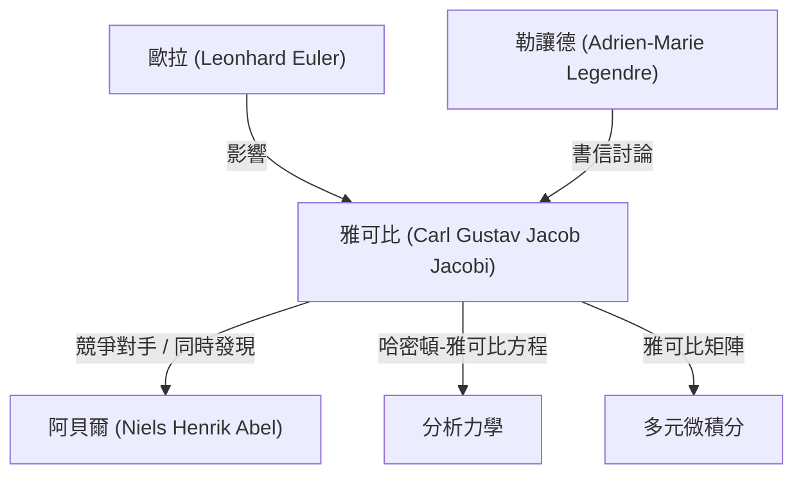

# 1. 引言：純粹思想的探索者

[卡爾·古斯塔夫·雅各布·雅可比](https://kenji.blog/zh-tw/p/jacobi/)（[Carl Gustav Jacob Jacobi](https://kenji.blog/zh-tw/p/jacobi/), 1804–1851）是19世紀的一位 **德國數學家** ，在代數、分析、數論和力學等廣泛領域做出了決定性的貢獻。他與尼爾斯·亨利克·阿貝爾一起被譽為「橢圓函數的發現者」，也是今天我們在多元微積分中經常遇到的「雅可比矩陣（雅可比行列式）」的命名由來。

他認為數學本身的優美和人類精神的榮耀遠高於其實用性。在本文中，我們將深入探討雅可比的一生、他的主要數學成就以及他留下的著名軼事。

# 2. 早年生活與教育

雅可比於1804年12月10日出生在普魯士王國（今德國）波茨坦的一個富裕的猶太銀行家家庭。他的哥哥莫里茨·馮·雅可比後來也成為一位著名的物理學家和工程師，在電動機的發展史上留下了印記。

雅可比從小就展現出早熟的天才特質，進入波茨坦的文理中學（Gymnasium）後，迅速超越了高年級的學生。12歲時，他已經具備了進入大學的學術能力，但由於年齡限制，直到16歲才得以進入柏林大學。在此期間，他通過閱讀歐拉和拉格朗日等過去大師的著作，自學了高等數學。

1821年進入柏林大學後，他還學習了哲學和語言學，但最終主修數學。他在1825年獲得博士學位，並於同年皈依基督教，這為他在大學任教鋪平了道路（在當時的普魯士，猶太人極難成為正教授）。

# 3. 哥尼斯堡大學的黃金時代與教學風格

1826年，雅可比成為哥尼斯堡大學的講師，1827年晉升為副教授，並於1829年以25歲的驚人低齡成為正教授。在哥尼斯堡的這段時期成為了他研究生涯中最多產、最輝煌的階段。

雅可比也是一位傑出的教育家。他引入了創新的 **研討會形式** 的教學，將自己最前沿的研究直接融入課堂。他的學生不僅從教科書中學習，還通過與他一起攻克未解決的問題來接受作為研究人員的訓練。這種教育方法非常成功，培養了包括魯道夫·克萊布什和路德維希·奧托·黑塞在內的許多下一代傑出數學家。

# 4. 橢圓函數理論的發展與阿貝爾的競爭

雅可比最偉大的成就之一是建立了橢圓函數理論。橢圓積分在計算鐘擺運動或橢圓弧長時出現，勒讓德等人已經研究了數十年。

雅可比引入了考慮積分反函數的突破性視角。令人驚訝的是，年輕的挪威天才 **阿貝爾** 幾乎在完全同一時間獨立發現了相同的方法。雅可比和阿貝爾都發現了橢圓函數的雙週期性，徹底改變了這一領域。

$$ \text{sn}(u, k), \quad \text{cn}(u, k), \quad \text{dn}(u, k) $$

雅可比定義了這些雅可比橢圓函數，並進一步引入了一種被稱為「Theta 函數」的強大的新分析工具。雅可比的 Theta 函數 $\vartheta(z, \tau)$ 定義如下：

$$ \vartheta(z, \tau) = \sum_{n=-\infty}^{\infty} e^{\pi i n^2 \tau + 2 \pi i n z} $$

1829年，他出版了傑作《橢圓函數理論新基礎》（Fundamenta nova theoriae functionum ellipticarum），完成了該領域的系統化。法國數學家勒讓德在得知比他年輕得多的雅可比和阿貝爾的成就後驚嘆不已，並對他們給予了高度讚揚。

# 5. 雅可比矩陣（雅可比行列式）與多元微積分

在大學的微積分課程中，當學習多重積分中的變量代換（例如極坐標變換）時，每個人都會遇到「雅可比」這個詞。這也來源於雅可比。

當考慮從 $n$ 個變量 $x_1, x_2, \dots, x_n$ 到 $n$ 個變量 $y_1, y_2, \dots, y_n$ 的變換時，由它們的偏導數組成的矩陣的行列式被稱為雅可比行列式。

$$ J = \det \begin{pmatrix} \frac{\partial y_1}{\partial x_1} & \cdots & \frac{\partial y_1}{\partial x_n} \\ \vdots & \ddots & \vdots \\ \frac{\partial y_m}{\partial x_1} & \cdots & \frac{\partial y_m}{\partial x_n} \end{pmatrix} $$

雅可比清楚地表明，這個行列式代表了變量代換下體積元素的縮放因子，並且他證明了它在推廣反函數定理和隱函數定理中的核心作用。

# 6. 分析力學：哈密頓-雅可比方程

雅可比的興趣不僅限於純數學，還延伸到物理學，特別是分析力學。雅可比進一步完善了愛爾蘭數學家威廉·羅恩·哈密頓創立的力學體系。

他推導出了 **哈密頓-雅可比方程** ，這是一個用於確定力學系統運動的偏微分方程。

$$ H\left(q_i, \frac{\partial S}{\partial q_i}, t\right) + \frac{\partial S}{\partial t} = 0 $$

這裡，$H$ 是哈密頓量（系統的總能量），$S$ 是作用量（或哈密頓主函數）。這個方程使得人們可以像光學中波前的傳播一樣來解釋力學問題，為20世紀量子力學（尤其是薛定諤方程）的誕生奠定了重要的理論基礎。

# 7. 對數論的貢獻

雅可比還是將他對橢圓函數和 Theta 函數的精通應用於看似無關的數論問題的天才。

有一個著名的定理叫做拉格朗日四平方和定理（每個自然數都可以表示為四個整數的平方和）。利用 Theta 函數的恆等式，雅可比推導出一個公式，準確給出了一個自然數 $n$ 可以表示為四個平方和的「方法的數量」。

$$ r_4(n) = 8 \sum_{d|n, 4\nmid d} d $$

這種利用分析方法揭示數論深層性質的方法，對後來解析數論的發展產生了巨大的影響。

# 8. 人物性格與著名軼事「人類精神的榮耀」

最能體現雅可比對數學態度的軼事出現在他給法國數學家約瑟夫·傅里葉的信中。傅里葉曾爭辯說「數學的主要目的是公共利益和對自然現象的解釋」。對此，雅可比反駁道：

> 「傅里葉先生認為數學的主要目的是公共利益和對自然現象的解釋；但像他這樣的哲學家本應知道，科學的唯一目的是 **人類精神的榮耀** ，以此觀之，一個關於數的問題與一個關於宇宙體系的問題具有同等價值。」

這段話至今仍是捍衛純數學存在的最有力和最美麗的宣言之一，至今仍被數學家們廣泛傳頌。

1843年，雅可比因過度勞累患上糖尿病，前往意大利休養，這次旅行獲得了普魯士王室的資金援助。後來他回到柏林繼續研究，但捲入了1848年革命的政治動盪，面臨著諸如工資被暫時停發的困境。

# 9. 晚年與遺產

雅可比的晚年飽受健康問題和經濟困難的折磨。1851年2月18日，他在柏林死於天花，年僅46歲。

然而，他留下的遺產是不可估量的。橢圓函數理論成為19世紀數學的核心主題，而哈密頓-雅可比方程則繼續支撐著物理學的基礎。最重要的是，他為了「人類精神的榮耀」而追求真理的奉獻精神，繼續激勵著各個時代的科學家。

他的墓位於柏林的三位一體公墓，許多數學愛好者至今仍前往那裡向他致敬。雅可比的數學直覺、驚人的計算能力以及跨越多個領域的廣闊視野，無疑使他成為數學史上最偉大的巨星之一。
