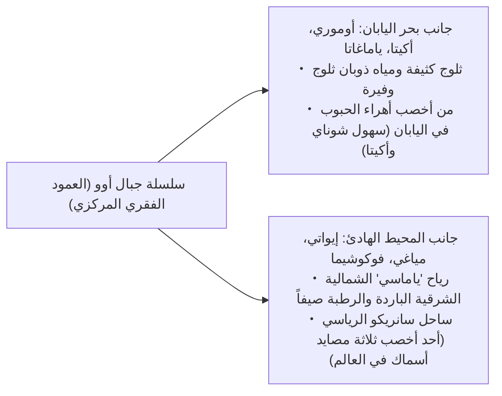
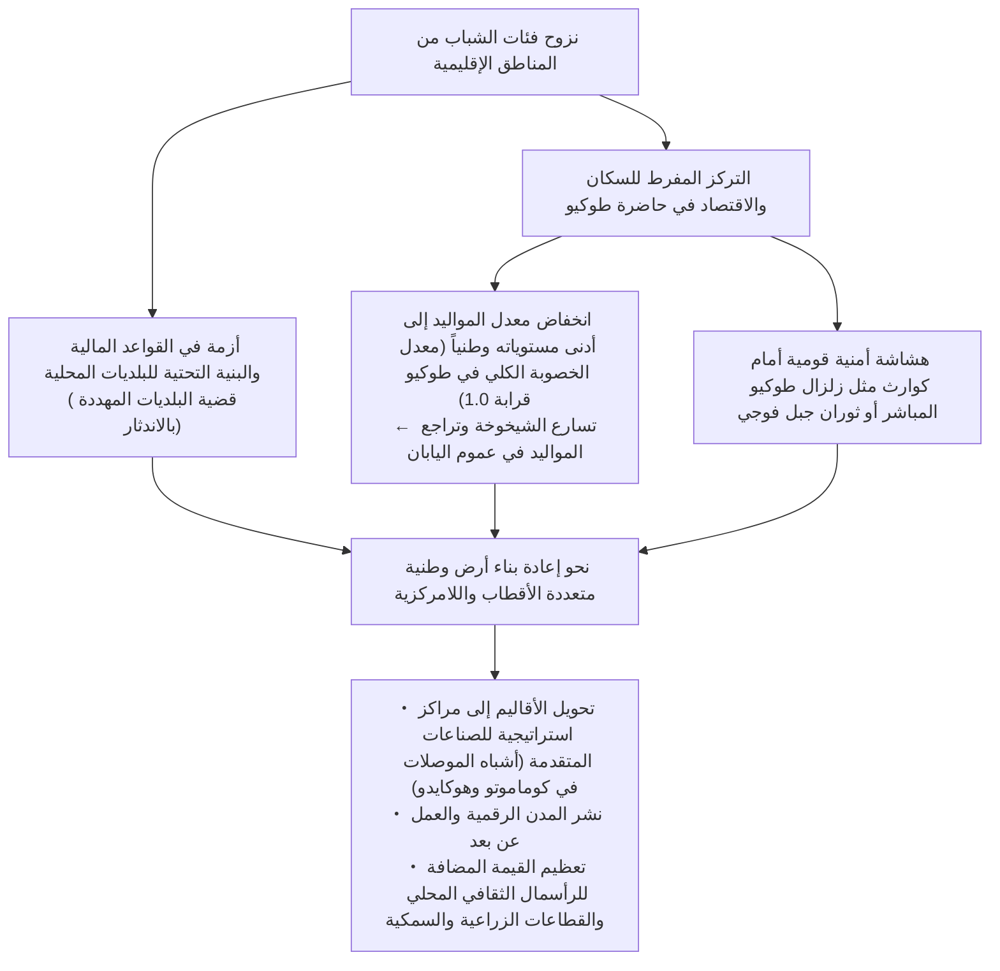
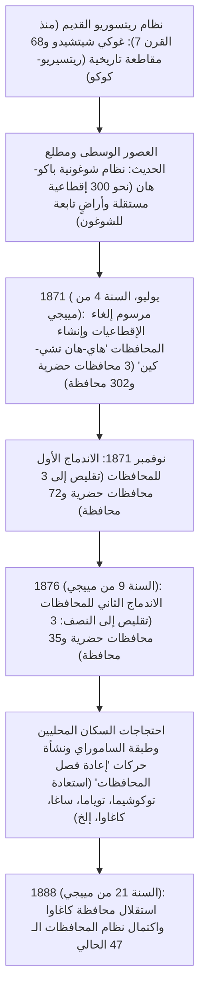

## مقدمة: تنوع الأرخبيل الياباني وتاريخ نشأة المحافظات الـ 47

يمتد الأرخبيل الياباني على هيئة قوس متصل بطول يقارب 3,000 كيلومتر من الشمال إلى الجنوب، مشكلاً دولة جزرية جبلية وعرة تعد من بين الأكثر انحداراً وتضارساً في العالم؛ إذ تكوّنت نتيجة نشاط تكتوني وحركي بالغ العنف في حزام النار المحيط بالهادئ، بفعل تصادم أربع صفائح تكتونية رئيسية: الصفيحة الأوراسية، وصفيحة أمريكا الشمالية، وصفيحة المحيط الهادئ، وصفيحة بحر الفلبين.

وتغطي الغابات والجبال ما يقرب من 70% من المساحة الإجمالية للبلاد. وتفصل سلسلة الجبال المركزية الشاهقة (العمود الفقري للأرخبيل) بين بيئات مناخية شديدة التباين: "مناخ ساحل بحر اليابان" الذي يتميز بتساقط كثيف للثلوج في فصل الشتاء، و"مناخ ساحل المحيط الهادئ" الذي يتسم بصيف حار ورطب وشتاء مشمس وصاحٍ، و"مناخ بحر سيتو الداخلي" الدافئ والمعتدل قليل الأمطار، و"مناخ المرتفعات الوسطى" ذي الفوارق الحرارية الحادة، و"مناخ جزر الجنوب الغربي" شبه الاستوائي. تتجمع هذه التباينات المناخية والبيئية المتباينة بشكل مذهل ضمن رقعة جغرافية محدودة نسبياً.

```
【الأقاليم المناخية للأرخبيل الياباني وآلياتها الجغرافية】

┌─────────────────┬───────────────────────────────┬───────────────────────────────┐
│ الإقليم المناخي │ النطاق الجغرافي               │ الخصائص والآليات المناخية الرئيسية│
├─────────────────┼───────────────────────────────┼───────────────────────────────┤
│ مناخ بحر اليابان│ من ساحل هوكايدو إلى هوكوريكو  │ الرياح الموسمية الشمالية الغربية│
│                 │ وسان-إن                       │ تمتص الرطوبة من تيار تسوشيما  │
│                 │                               │ وتصطدم بالسلسلة الجبلية لتحدث ثلوجاً│
├─────────────────┼───────────────────────────────┼───────────────────────────────┤
│ مناخ المحيط     │ من ساحل المحيط الهادئ إلى     │ أمطار وأعاصير صيفية بفعل الرياح│
│ الهادئ          │ جنوب كيوشو                    │ الجنوبية الشرقية؛ وشتاء جاف ومشمس│
├─────────────────┼───────────────────────────────┼───────────────────────────────┤
│ مناخ بحر سيتو   │ النطاق المحصور بين جبال       │ تحجب الجبال سحب الأمطار، فيسود│
│ الداخلي         │ تشوغوكو وجبال شيكوكو          │ طقس دافئ قليل المطر ومشمس دائماً│
├─────────────────┼───────────────────────────────┼───────────────────────────────┤
│ مناخ المرتفعات  │ ناغانو، ياماناشي، وإقليم      │ ارتفاع التضاريس وإحاطتها بالجبال│
│ الوسطى          │ هيدا في غيفو                  │ ينتج عنه فارق حراري حاد ليلاً ونهاراً│
├─────────────────┼───────────────────────────────┼───────────────────────────────┤
│ مناخ جزر الجنوب │ محافظة أوكيناوا، جزر أمامي    │ مناخ بحري شبه استوائي تحت تأثير│
│ الغربي          │ وغيرها                        │ تيار كوروشيو، دافئ ورطب وعرضة للأعاصير│
└─────────────────┴───────────────────────────────┴───────────────────────────────┘
```

تستند التقسيمات الإقليمية في اليابان تاريخياً إلى 68 مقاطعة إدارية قديمة عُرفت باسم "دول الريتسيريو" (令制国 - Ryōseikoku)، والتي نشأت في إطار النظام القانوني القديم المعروف بـ "غوكي شيتشيدو" (五畿七道: المقاطعات الخمس المحيطة بالعاصمة الإمبراطورية القديمة وسبعة مسالك جغرافية كبرى: كيناي، توكايدو، توساندو، هوكوريكودو، سان-إندو، سانيودو، نانكايدو، وسايكايدو). وعقب استعادة مييجي مباشرة، ومع صدور مرسوم "إلغاء الإقطاعيات وتأسيس المحافظات" (廃藩置県 - Haihan-chiken) عام 1871 (السنة الرابعة من عصر مييجي)، تم في البداية تأسيس ما يربو على 300 مقاطعة ومحافظة حضرية وريفية. ومن خلال موجات متلاحقة من الدمج وإعادة التنظيم، استقرت الهيكلية الإدارية الحديثة على صيغتها الحالية المكونة من "محافظة طوكيو الحضرية (تو)، ومحافظة هوكايدو الإقليمية (دو)، ومحافظتين حضريتين (فو: كيوتو وأوساكا)، و43 محافظة إقليمية (كين)" — أي ما مجموعه 47 محافظة (تودوفوكين) — وذلك بعد استقلال محافظة كاغاوا عام 1888 (السنة 21 من عصر مييجي).

وفي هذه الدراسة الموسوعية الشاملة، سنستعرض كافة المحافظات الـ 47 موزعة على ثمانية أقاليم جغرافية رئيسية (هوكايدو، توهوكو، كانتو، تشوبو، كينكي، تشوغوكو، شيكوكو، وكيوشو-أوكيناوا)، لنفكك بدقة وتفصيل أسماء مقاطعاتها التاريخية القديمة، وتضاريسها الجغرافية، وبنيتها الصناعية والاقتصادية، وعمقها التاريخي والثقافي، وصولاً إلى قضايا الإنعاش الإقليمي والتحولات الديموغرافية في القرن الحادي والعشرين.

---

## 1. منطقة هوكايدو: التخوم الشمالية والقطاع الأولي الشاسع

### 1.1 هوكايدو (الاسم القديم: إيزوتشي / 11 مقاطعة قديمة تشمل إيشيكاري وأوشيما وغيرها)
- **مقر الإدارة الإقليمية (العاصمة)**: مدينة سابورو (Sapporo)
- **المساحة والتضاريس**: 83,424 كيلومتراً مربعاً (المرتبة الأولى وطنياً، وتمثل نحو 22% من مساحة اليابان الإجمالية). تشكل سلسلتا جبال دايسيتسوزان وهيداكا العمود الفقري للجزيرة، وتنبسط فيها أوسع السهول والهضاب في اليابان، مثل سهل إيشيكاري، وسهل توكاتشي، وهضبة كونسين. تنتمي مناخياً إلى النطاق شبه القطبي؛ إذ يتميز فصل الصيف باعتداله وبرودته النسبية، بينما يسود الشتاء صقيع شديد وتساقط ثلجي كثيف يغطي مساحات شاسعة.
- **الهيكل الصناعي والاقتصاد**:
  - **الزراعة**: تعد سلة الغذاء الاستراتيجية لليابان. تتصدر في الزراعة الحقلية الكبرى (القمح، الشمندر السكري، البطاطس، حبوب أزوكي)، وتربية الماشية وصناعة الألبان الضخمة (تنتج أكثر من 50% من إجمالي الحليب الخام في البلاد). تسود في سهل توكاتشي زراعة أوروبية-أمريكية النمط ذات مكننة فائقة، حيث تبلغ حيازة الأسرة الزراعية الواحدة عشرات الهكتارات.
  - **الثروة السمكية**: تحتل المركز الأول وطنياً في كل من كميات الصيد البحري ومنتجات الاستزراع المائي، وتشتهر بالإسقلوب (المحار المروحي)، سمك السلمون، سمك بولوك ألاسكا، وعشب البحر (كومبو).
  - **السياحة والخدمات**: منتجعات التزلج ذات الثلوج البودرية في نيسيكو (نقطة جذب استثمارية وسياحية دولية بالغة الأهمية)، شبه جزيرة شيريتوكو (موقع تراث طبيعي عالمي)، حقول الخزامى (اللافندر) في فورانو، ومهرجان سابورو للثلوج.
- **التاريخ والثقافة**: الثقافة التقليدية لشعب الآينو الأصلي (تأسيس مجمع "أوبوبوي" كفضاء رمزي للتعايش القومي). تاريخ الاستصلاح الحديث منذ عصر مييجي على يد "مفوضية الاستعمار والتطوير" (كايتاكوشي) وجنود الاستيطان الزراعي (توندنباي). إدخال العلوم الزراعية الحديثة والقيم الأخلاقية عبر كلية سابورو الزراعية (بقيادة الدكتور ويليام كلارك).
- **التحديات الإقليمية**: التراجع السكاني الحاد وتمركز السكان المفرط في مدينة سابورو، معضلة العجز المالي والخطوط غير المربحة لشركة سكك حديد هوكايدو (JR Hokkaido)، والتكاليف الباهظة لصيانة البنية التحتية الممتدة عبر هذه الرقعة الجغرافية الهائلة.

---

## 2. منطقة توهوكو: بركات جبال أوو والتراث التاريخي لبلاد ميتشينوكو

تتميز منطقة توهوكو بتمايز بيئي وجغرافي حاد يفصل بين شطرين بفضل سلسلة جبال أوو التي تمتد من الشمال إلى الجنوب في وسطها: جانب بحر اليابان (حزام الثلوج الكثيفة وأهراء الحبوب) وجانب المحيط الهادئ (المعرض لموجات البرد الصيفي ورياح "ياماسي").



### 2.1 محافظة أوموري (المقاطعة القديمة: تسوغارو، موتسو)
- **عاصمة المحافظة**: مدينة أوموري (Aomori)
- **التضاريس**: تقع في أقصى شمال جزيرة هونشو الرئيسية. تحتضن شبه جزيرة تسوغارو وشبه جزيرة شيموكيتا خليج موتسو من الشرق والغرب، وتشمخ في وسطها جبال هاكودا، بينما ترتفع في غربها جبال شيراكامي المدرجة على قائمة التراث الطبيعي العالمي.
- **الصناعة**: تستحوذ على نحو 60% من إجمالي إنتاج التفاح في اليابان (مركزها مدينة هيروساكي وسهل تسوغارو). رائدة في استزراع الإسقلوب في خليج موتسو، وصيد سمك التونة في أوما، وتفريغ الأسماك في ميناء هاتشينوهي. وفي المجالات التقنية المتقدمة، تضم قرية روكاشو مرافق استراتيجية لدورة الوقود النووي.
- **الثقافة والبيئة**: مهرجانات "أوموري نيبوتا" و"هيروساكي نيبوتا"، موسيقى تسوغارو-شاميسين، وثقافة تسوغارو الأدبية والفنية التي أنجبت الكاتب أوسامو دازاي والفنان شيكو موناكاتا. مواقع جومون الأثرية القديمة (موقع ساناي-ماروياما).

### 2.2 محافظة إيواتي (المقاطعة القديمة: ريكوتشو، ريكوزين، موتسو)
- **عاصمة المحافظة**: مدينة موريؤوكا (Morioka)
- **التضاريس**: ثاني أكبر محافظات اليابان مساحةً بعد هوكايدو (15,275 كم²). ينبسط حوض كيتكامي على امتداد نهر كيتكامي، وتقع في شرقها مرتفعات كيتكامي وساحل سانريكو الرياسي المتعرج.
- **الصناعة**: تركز واعد لصناعات أشباه الموصلات والسيارات في حوض كيتكامي (مثل شركة كيوكسيا Kioxia). مصايد الأعشاب البحرية (واكامي)، أذن البحر (أبالوني)، وأسماك السلمون والساوري في سانريكو. الصناعات الحرفية التقليدية مثل أواني الحديد المصهور (نانبو تيكي).
- **الثقافة والبيئة**: معبد تشوسون-جي والقاعة الذهبية (كونجيكيدو) في هييرايزومي (تجسيد لفكر "أرض النقاء" البوذية لدى عشيرة أوشو فوجيوارا، وموقع تراث ثقافي عالمي). فكر "إيهاتوف" للشاعر والأديب كينجي ميازاوا، وأساطير تونو (كتاب تونو مونوغاتاري للباحث كونيو ياناغيتا، مهد الفولكلور الياباني).

### 2.3 محافظة مياغي (المقاطعة القديمة: ريكوزين، موتسو)
- **عاصمة المحافظة**: مدينة سينداي (Sendai - المدينة الوحيدة المصنفة بمرسوم حكومي في توهوكو)
- **التضاريس**: تشمل سهول سينداي الخصبة الغنية بحقول الأرز، وخليج ماتسوشيما (أحد المناظر الطبيعية الثلاثة الأجمل في اليابان)، وشبه جزيرة أوشيكا وخليج سينداي.
- **الصناعة**: المركز الاقتصادي والإداري لمنطقة توهوكو برمتها. سلة أرز شهيرة بأصناف فاخرة مثل "ساسانيشيكي" و"هيتوميهوري". تصنيع المنتجات البحرية في ميناءي إيشينوماكي وكيسينوما. صرح أكاديمي وعلمي متقدم تقوده جامعة توهوكو، ويضم مركز "نانوتيراس" (NanoTerasu) للجيل الجديد من إشعاع السنكروترون.
- **الثقافة والبيئة**: ثقافة مدينة القلعة العريقة التي بناها القائد داتي ماساموني بإقطاعية بلغت قيمتها 620 ألف كوكو. مهرجان سينداي تاناباتا الشهير عالمياً.

### 2.4 محافظة أكيتا (المقاطعة القديمة: أوغو، ديوا)
- **عاصمة المحافظة**: مدينة أكيتا (Akita)
- **التضاريس**: يمتد فيها سهل أكيتا، وحوض يوكوتي، وجبل تشوكاي المهيب، وبحيرة تازاوا (أعمق بحيرة في اليابان).
- **الصناعة**: من كبريات مناطق زراعة الأرز في البلاد والمعروفة بصنف "أكيتا كوماتشي". الغابات وصناعة أخشاب أرز أكيتا (سوجي). دجاج هيناتيدوري الفاخر، وأسماك هاتاهاتا. برزت مؤخراً كمركز استراتيجي واعد لتوليد طاقة الرياح البحرية على امتداد ساحل بحر اليابان.
- **الثقافة والبيئة**: مهرجان أكيتا كانتو، طقوس "ناماهاغي" في شبه جزيرة أوغا (تراث ثقافي غير مادي معترف به من اليونسكو)، وغابات شيراكامي-سانتشي الطبيعية.

### 2.5 محافظة ياماغاتا (المقاطعة القديمة: أوزين، ديوا)
- **عاصمة المحافظة**: مدينة ياماغاتا (Yamagata)
- **التضاريس**: يشمل تضاريسها سهل شوناي الخصيب، وأحواض يونيزاوا، وياماغاتا، وشينجو المتصلة بمجرى نهر موغامي. وتضم جبال ديوا الثلاثة (غاسان، هاغوروسان، ويودونوسان)، وسلسلة جبال زاو البركانية.
- **الصناعة**: مملكة الفواكه في اليابان؛ إذ تستحوذ على أكثر من 70% من محصول الكرز وطنياً، إلى جانب كمثرى "لا فرانس". زراعة الأرز الفاخر في سهل شوناي (صنف تسوياهيمي). لحوم أبقار يونيزاوا الفاخرة. وتضم صناعات إلكترونية دقيقة ومصانع للمكونات المتقدمة.
- **الثقافة والبيئة**: ثقافة التنسك والرهبنة الجبلية (شوغندو) في جبال ديوا، مهرجان هاناغاسا، وسحر العمارة التاريخية لعصر تايشو في منتجع ينابيع غينزان أونسين.

### 2.6 محافظة فوكوشيما (المقاطعة القديمة: إيواشيرو، إواكي)
- **عاصمة المحافظة**: مدينة فوكوشيما (Fukushima)
- **التضاريس**: تنقسم جغرافياً وتاريخياً بوضوح إلى ثلاث مناطق متمايزة: أيزو (طبيعة جبلية، ثلوج كثيفة، وتاريخ عريق)، ناكادوري (المركز السياسي والاقتصادي والأحواض الداخلية)، وهامادوري (الشريط الساحلي على المحيط الهادئ والمناخ المعتدل).
- **الصناعة**: بساتين الفواكه وإنتاج الخوخ والكمثرى في ناكادوري. صناعة الخزف التقليدي والورنيش (أيزو-نوري) ومصانع الساكي الفاخر. وتتألق منطقة هامادوري بمبادرة "ساحل فوكوشيما للابتكار" (ميدان اختبارات الروبوتات وتطوير تقنيات طاقة الهيدروجين النظيفة).
- **الثقافة والبيئة**: روح الساموراي وعقيدة البوشيدو في أيزو-واكاماتسو (فرقة بياكوتي التراجيدية)، معكرونة كيتكاتا رامين، ومهرجان سوما نوماوي للفروسية التراثية. تقود المحافظة مسيرة التعافي والتحول الرائد في مجال الطاقة بعد زلزال شرق اليابان الكبير وحادثة المحطة النووية عام 2011.

---

## 3. منطقة كانتو: تمركز وظائف العاصمة وتراكم الصناعات الفائقة

تتمحور منطقة كانتو حول سهل كانتو، وهو الأكبر في اليابان، حيث تتداخل وتتكامل بصورة عضوية الوظائف الإدارية والسياسية والاقتصادية والأكاديمية واللوجستية الفائقة للعاصمة مع الزراعة المحيطية المتطورة والصناعات الساحلية الثقيلة.

```
【هيكل توزيع الوظائف في حاضرة طوكيو الكبرى (الميغالوبوليس)】

・محافظة طوكيو: الوظائف المركزية للسيادة، التمويل والخدمات القانونية العالمية، تقنية المعلومات المتقدمة، وتوليد الثقافة
・محافظة كاناغاوا: حزام كيهين الصناعي، ميناء يوكوهاما التجاري الدولي، مجمعات البحث والتطوير، وسياحة شونان وهاكوني
・محافظة سايتاما: عقدة المواصلات الداخلية (الشينكانسن وشبكات الطرق السريعة)، زراعة الضواحي، ومجمعات الآلات واللوجستيات
・محافظة تشيبا: مطار ناريتا الدولي، مجمع كييو الصناعي الساحلي، الثروة السمكية والزراعة المحيطية (الفول السوداني والخضراوات)
・محافظة إيباراكي: مدينة تسوكوبا للأبحاث والعلوم، مجمع كاشيما الصناعي، الصناعات الميكانيكية والكهربائية (هيتاشي)، البطيخ واللوتس
・محافظة توتشيغي: حزام شمال كانتو الصناعي (صناعات السيارات والآلات الدقيقة الداخلية)، مزارات نيكو توشوغو، وفراولة توتشيوتومي
・محافظة غونما: صناعة السيارات المرتكزة حول شركة سوبارو، سياحة الينابيع الساخنة (كوساتسو وإيكاهو)، وتراث الحرير وتربية القز
```

### 3.1 محافظة إيباراكي (المقاطعة القديمة: هيتاتشي)
- **عاصمة المحافظة**: مدينة ميتو (Mito)
- **الصناعة**: تحتل المرتبة الثالثة وطنياً في القيمة الإجمالية للإنتاج الزراعي (البطيخ الأصفر، جذور اللوتس، والبطاطا الحلوة المجففة). تعد مدينة تسوكوبا أكبر قاعدة للأدمغة العلمية والابتكارية في اليابان، حيث تستضيف وحدها ثلث المؤسسات البحثية القومية للدولة. تضم مجمعات هيتاشي للصناعات الهندسية والمعدات الثقيلة، ومجمع كاشيما الساحلي للصناعات البتروكيماوية والصلب.
- **الثقافة**: مدرسة ميتو الفكرية لفرع عائلة توكوغاوا الحاكمة (الينبوع الفلسفي لحركة موالاة الإمبراطور وطرد الأجانب "سونو جوي")، حديقة كايراكو-إن الشهيرة، وشلالات فوكورودا (أحد أعظم ثلاثة شلالات في اليابان).

### 3.2 محافظة توتشيغي (المقاطعة القديمة: شيموتسوكي)
- **عاصمة المحافظة**: مدينة أوتسونوميا (Utsunomiya)
- **الصناعة**: تتصدر اليابان في إنتاج الفراولة لأكثر من نصف قرن دون انقطاع (أصناف مثل توتشيوتومي وتوتشيايكا). مجمعات صناعية داخلية متقدمة في أوتسونوميا وأوياما (المعدات الطبية، والآلات ومركبات النقل). افتتاح شبكة ترام أوتسونوميا الخفيف (LRT) كأول نظام نقل حضري متطور ورائد للجيل القادم في اليابان.
- **الثقافة**: معابد ومزارات نيكو التاريخية المدرجة على قائمة التراث العالمي (ضريح نيكو توشوغو)، مدرسة أشيكاغا (أقدم جامعة ومؤسسة تعليمية شاملة في اليابان)، وفخار ماشيكو التقليدي.

### 3.3 محافظة غونما (المقاطعة القديمة: كوزوكي)
- **عاصمة المحافظة**: مدينة مايباشي (Maebashi)
- **الصناعة**: معقل شركة سوبارو (SUBARU - شركة ناكاجيما للطائرات سابقاً) ومقرها في أوتا، وهي قطب لصناعات تجميع السيارات وكبس وتشكيل المعادن. تنتج 90% من نبات الكونياكو وطنياً. تضم كبريات مدن ومنتجعات الينابيع الحارة مثل كوساتسو أونسين، إيكاهو أونسين، وميناكامي.
- **الثقافة**: مصنع توميوكا للحرير ومواقع التراث الصناعي للحرير (موقع تراث عالمي). وتلاحم الهوية الإقليمية والوعي الجمعي من خلال بطاقات "جومو كارتا" الشعبية.

### 3.4 محافظة سايتاما (المقاطعة القديمة: الجزء الأعظم من موساشي)
- **عاصمة المحافظة**: مدينة سايتاما (Saitama - مدينة مصنفة بمرسوم حكومي)
- **الصناعة**: خامس كبرى محافظات اليابان من حيث عدد السكان (قرابة 7.3 ملايين نسمة). تشكل محطة أوميا فيها أضخم عقدة مواصلات حديدية في شرق اليابان. تحتل مراتب الصدارة في الصناعات الغذائية التحويلية، وتشتهر ببصل فوكايا الأخضر، شاي ساياما، ومقرمشات سينبي سوكا.
- **الثقافة**: مدينة كواغويه التاريخية الملقبة بـ "إيدو الصغرى" بمبانيها ومخازنها التقليدية (كورا-زوكوري)، ومهرجان تشيتشيبو الليلي (المدرج في التراث غير المادي لليونسكو).

### 3.5 محافظة تشيبا (المقاطعة القديمة: شيموسا، كازوسا، أوا)
- **عاصمة المحافظة**: مدينة تشيبا (Chiba - مدينة مصنفة بمرسوم حكومي)
- **الصناعة**: تحتضن مطار ناريتا الدولي (البوابة الجوية اللوجستية الدولية الأولى لليابان). مجمع كييو الساحلي لتكرير البتروكيماويات وصناعات الصلب. إنتاج زراعي ضخم يغذي العاصمة (البصل الأخضر، الفول السوداني، والسبانخ). وتفريغ كميات هائلة من الأسماك في ميناء تشوشي. وتضم منتجع طوكيو ديزني لاند الشهير.
- **الثقافة**: بلدة معبد ناريتا-سان شينشوجي، والمنتجعات الساحلية ومواقع ركوب الأمواج في شبه جزيرة بوسو.

### 3.6 محافظة طوكيو (المقاطعة القديمة: موساشي، جزر إيزو وأوغاساوارا)
- **مقر حكومة العاصمة**: حي شينجوكو (Shinjuku)
- **التضاريس والسكان**: يبلغ عدد سكانها نحو 14 مليون نسمة (وتشكل حاضرتها الكبرى أضخم ميغالوبوليس تجمعاً بشرياً في العالم). تضم الأحياء الخاصة الـ 23، ومنطقة تاما الغربية، وجزر إيزو، وجزر أوغاساوارا المدرجة كإرث طبيعي عالمي.
- **الصناعة**: القطب الاقتصادي الأضخم الذي يولّد بمفرده حوالي خُمس الناتج المحلي الإجمالي لليابان. المراكز المالية والشركات التجارية العملاقة في مارونوتشي وأوتيماتشي، وادي التكنولوجيا والشركات الناشئة في شيبويا وروبونغي، ثقافة التكنولوجيا والأنمي والبوب في أكيهابارا، ومطار هانيدا الدولي (العقدة الجوية الوطنية والدولية).
- **الثقافة**: حاضرة ثقافية وعالمية فائقة الحداثة يتعايش فيها برج سكاي تري وناطحات السحاب الشاهقة مع الآثار التاريخية لقلعة إيدو ومعبد سينسوجي في أساكوسا وضريح مييجي جينغو.

### 3.7 محافظة كاناغاوا (المقاطعة القديمة: ساغامي، وجنوب موساشي)
- **عاصمة المحافظة**: مدينة يوكوهاما (Yokohama - يبلغ سكانها قرابة 3.77 ملايين نسمة، وهي أكبر بلدية في اليابان)
- **الصناعة**: تحتل المرتبة الثانية وطنياً من حيث عدد السكان (حوالي 9.2 ملايين نسمة). قلب منطقة كيهين الصناعية (مقر شركة نيسان موتورز، مصانع جي إف إي ستيل، إلخ). تراكم هائل لمراكز البحث والتطوير والابتكار في "ميناتو ميراي 21". وتفوق تقني وبيئي في مدينة كاواساكي الصناعية.
- **الثقافة**: مدينة كاماكورا التاريخية (عاصمة شوغونية كاماكورا ومهد ثقافة الساموراي)، التاريخ التجاري والانفتاح على الغرب في ميناء يوكوهاما، الثقافة الساحلية والبحرية في شونان، ومنتجعات المياه الحارة الشهيرة في هاكوني.

---

## 4. منطقة تشوبو: العمود الفقري للصناعة التحويلية والتضاريس الجبلية

تقع منطقة تشوبو في قلب جزيرة هونشو، وتتألف من أقاليم فرعية متباينة للغاية: هوكوريكو (على بحر اليابان)، المرتفعات الوسطى (الداخلية الجبلية)، وتوكاي (على المحيط الهادئ)، وتضم أعتى حزام للصناعات التحويلية في اليابان ("مونو-زوكوري").

### 4.1 محافظة نيغاتا (المقاطعة القديمة: إيتشيغو، سادو)
- **عاصمة المحافظة**: مدينة نيغاتا (Niigata - مدينة مصنفة بمرسوم حكومي)
- **الصناعة**: زراعة الأرز ذات الشهرة الأسطورية في سهل إيتشيغو بفضل نهري شينانو وأغانو (الأولى وطنياً في إنتاج أرز كوشيهيكاري). صناعة أدوات المائدة المعدنية والسكاكين المطروقة في تسوبامي-سانجو (حصة سوقية عالمية). استزراع وتربية أسماك الكوي الملونة (نيشيكيغوي). استخراج الغاز الطبيعي والنفط الخام المحلي.
- **الثقافة**: مناجم ذهب جزيرة سادو (تراث عالمي)، مهرجان ألعاب ناريّة ناغاوكا الضخم، ومهرجان إيتشيغو-تسوماري الدولي للفنون المعاصرة (ترينالي الأرض).

### 4.2 محافظة توياما (المقاطعة القديمة: إيتشوتشو)
- **عاصمة المحافظة**: مدينة توياما (Toyama)
- **الصناعة**: استغلال الطاقة الكهرومائية الرخيصة والوفيرة لشركة هوكوريكو للطاقة لإنشاء مجمعات درفلة وصهر الألمنيوم والصناعات الكيماوية والدوائية الحيوية. مركز صناعي دوائي عريق يتوارث تقاليد "صيادلة توياما المتجولين". خليج توياما كـ "حوض أسماك طبيعي" ينتج الحبار المضيء (هوتارويكا)، والجمبري الأبيض (شيرويبي)، وأسماك البوري الأصفر (بوري).
- **الثقافة**: سلسلة جبال تاتياما وسد كوروبي الشاهق (مسار تاتياما كوروبي الألبي). وقرى غوكاياما التاريخية ذات الأسقف القشية المائلة (تراث عالمي).

### 4.3 محافظة إيشيكاوا (المقاطعة القديمة: كاغا، نوتو)
- **عاصمة المحافظة**: مدينة كانازاوا (Kanazawa)
- **الصناعة**: سياحة راقية تستند إلى الرأسمال الثقافي الموروث من إقطاعية كاغا المليون كوكو. صناعة آلات النسيج وآلات البناء والتعدين (مهد شركة كوماتسو)، وصناعة ألياف الكربون والمواد المركبة المتطورة.
- **الثقافة**: حديقة كينروكو-إن (إحدى أجمل ثلاث حدائق يابانية)، رقائق الذهب (تستأثر بـ 99% من الإنتاج الوطني)، خزف كوتاني، وأواني ورنيش واجيما. جهود حثيثة لإعادة الإعمار والنهوض الإبداعي بعد زلزال شبه جزيرة نوتو.

### 4.4 محافظة فوكوي (المقاطعة القديمة: إيتشيزين، واكاسا)
- **عاصمة المحافظة**: مدينة فوكوي (Fukui)
- **الصناعة**: تصنع 95% من إطارات النظارات في اليابان (مدينة ساباي). الصناعات النسيجية والمكونات الإلكترونية الدقيقة (شركة موراتا وغيرها). مهد أرز كوشيهيكاري الشهير. وسرطان بحر إيتشيزين الفاخر. وتضم منطقة رينان مجموعة من محطات الطاقة النووية.
- **الثقافة**: معبد دايزنزان إيهي-جي (المقر الرئيسي لمذهب سوتو زن البوذي الذي أسسه دوغين)، متحف ديناصورات محافظة فوكوي العالمي، ومنحدرات توجينبو الصخرية البحرية. تتصدر باستمرار مؤشرات السعادة وجودة المعيشة في اليابان.

### 4.5 محافظة ياماناشي (المقاطعة القديمة: كاي)
- **عاصمة المحافظة**: مدينة كوفو (Kofu)
- **الصناعة**: تحتل المرتبة الأولى وطنياً في حصاد العنب والخوخ والبرقوق. مهد صناعة النبيذ الياباني (كاتسونوما). عاصمة صقل وتجارة الأحجار الكريمة وصياغة المجوهرات في اليابان. وتضم المقر العالمي لشركة فاناك (FANUC - عملاق أنظمة التحكم العددي CNC وروبوتات المصانع عالمياً). خط التجارب لقطار الرفع المغناطيسي الفائق السرعة (ماجليف).
- **الثقافة**: المعالم التاريخية للقائد العسكري تاكيدا شينغن، بحيرات فوجي الخمس، ووادي شوسينكيو الساحر.

### 4.6 محافظة ناغانو (المقاطعة القديمة: شينانو)
- **عاصمة المحافظة**: مدينة ناغانو (Nagano)
- **الصناعة**: محافظة جبلية شاهقة تحتضن جبال الألب اليابانية الثلاثة (هيدا، كيسو، وأكايشي). تشتهر بالصناعات الدقيقة (سيكو إبسون وغيرها، وتلقب بـ "سويسرا الشرق"). الخضراوات الصيفية المرتفعة (الخس، الكرنب الصيني)، والتفاح. تحتل المركز الأول وطنياً في متوسط العمر المتوقع ومؤشرات الصحة وطول العمر.
- **الثقافة**: معبد زينكوجي العريق، قلعة ماتسوموتو (قلعة ذات برج خشبي أصلي مصنف كنزاً وطنياً)، ومنتجعات الهضاب الطبيعية الراقية في كاميكوتشي وكارويزاوا.

### 4.7 محافظة غيفو (المقاطعة القديمة: مينو، هيدا)
- **عاصمة المحافظة**: مدينة غيفو (Gifu)
- **الصناعة**: صناعة السيوف والسكاكين في مدينة سيكي (إحدى كبريات عواصم صناعة النصال في العالم). خزف مينو (يستحوذ على أكثر من نصف إنتاج السيراميك في اليابان). صناعات الطيران والفضاء في كاكاميجاهارا (شركة كاواساكي للصناعات الثقيلة). والأثاث الخشبي المتقن في هيدا-تاكاياما.
- **الثقافة**: قرية شيراكاوا-غو (موقع تراث عالمي)، الأحياء التاريخية المحفوظة في هيدا-تاكاياما، وصيد الأسماك بالطيور المائية (أوكاي) على ضفاف نهر ناغارا.

### 4.8 محافظة شيزوكا (المقاطعة القديمة: توتومي، سوروغا، إيزو)
- **عاصمة المحافظة**: مدينة شيزوكا (Shizuoka - مدينة مصنفة بمرسوم حكومي)
- **الصناعة**: رائدة في قيمة شحنات الإنتاج الصناعي. مهد عمالقة وسائل النقل والدراجات: سوزوكي، ياماها، وهوندا. الأولى في زراعة وإنتاج الشاي الأخضر وطنياً. الأولى عالمياً في تصنيع وشحن نماذج ومجسمات التركيب البلاستيكية (تاميا، بانداي). وميناء يايزو الشهير بصيد وتفريغ أسماك التونة والبونيتو.
- **الثقافة**: جبل فوجي المقدس (موقع تراث عالمي)، منتجعات الينابيع في شبه جزيرة إيزو، ومقر تقاعد الشوغون توكوغاوا إياسو (قلعة سونبو وضريح كونوزان توشوغو).

### 4.9 محافظة آيتشي (المقاطعة القديمة: أواري، ميكاوا)
- **عاصمة المحافظة**: مدينة ناغويا (Nagoya - مدينة مصنفة بمرسوم حكومي)
- **الصناعة**: **تتربع على عرش الإنتاج الصناعي في اليابان لأكثر من 40 عاماً متواصلة** بوصفها أقوى قلعة للتصنيع التكنولوجي في البلاد. المقر العالمي لشركة تويوتا موتور وسلسلة إمدادها العملاقة. صناعات الفضاء والطيران (ميتسوبيشي للصناعات الثقيلة)، السيراميك الصناعي والصلب التخصصي والآلات الميكانيكية.
- **الثقافة**: مسقط رأس القادة التاريخيين الثلاثة الكبار لتوحيد اليابان: أودا نوبوناغا، تويوتومي هيديوشي، وتوكوغاوا إياسو. ضريح أتسوتا، وقلعة ناغويا. ثقافة طعام فريدة تشتهر بأطباق "ناغويا-ميشي" (ميسو-كاتسو، هيتسومابوشي، وأجنحة الدجاج المتبلة تيباساكي).

---

## 5. منطقة كينكي: العاصمة الألفية وتعدد طبقات الاقتصاد في كانساي

ظلت منطقة كينكي (كانساي) القلب السياسي والثقافي النابض لليابان منذ العصور القديمة وحتى مشارف العصر الحديث، وتتعايش فيها بتناغم فريد: العاصمة التجارية أوساكا، والمدينة المرفئية الدولية كوبه، والعاصمتان الإمبراطوريتان العريقتان كيوتو ونارا.

```
【توزيع الوظائف والتنوع التاريخي في إقليم كينكي (كانساي)】

・محافظة أوساكا: جينات العاصمة التجارية، التمويل الدولي، معارض إكسبو (1970/2025)، علوم الحياة، وثقافة الطعام العريقة
・محافظة كيوتو: الرأسمال الثقافي الممتد لألف عام في العاصمة الإمبراطورية هييان، شركات التقنية الفائقة (نينتندو وكيوسيرا)، والحرف
・محافظة هيوغو: التجارة البحرية والموانئ (كوبه)، مجمع هاريما الصناعي الساحلي، نبيذ الساكي في نادا، والزراعة في تامبا وتاجيمة
・محافظة نارا: مهد سلطة ياماتو القديمة، عاصمة هييجو، ومعابد هوريو-جي وتوداي-جي (كنز الفنون البوذية الخالدة)
・محافظة شيغا: بحيرة بيوا (شريان المياه لـ 14 مليون نسمة في كينكي)، فلسفة تجار أومي، والصناعات الداخلية المتقدمة
・محافظة ميئه: ضريح إيسي الكبير (قمة الديانة الشنتوية)، حلبة سوزوكا للسباقات، استزراع اللؤلؤ، وبتروكيماويات يوكايتشي
・محافظة واكاياما: جبل كويا وأضرحة كومانو سانزان (المواقع المقدسة ومسارات الحج)، والأولى في إنتاج اليوسفي ومخلل الأوميبوشي
```

### 5.1 محافظة ميئه (المقاطعة القديمة: إيسي، إيغا، شيما، وشرق كيء)
- **عاصمة المحافظة**: مدينة تسو (Tsu)
- **الصناعة**: مجمع يوكايتشي الصناعي (البتروكيماويات وصناعات أشباه الموصلات المتقدمة). لحوم أبقار ماتسوساكا الأسطورية، استزراع لآلئ أكويا في خليج أغو، والروبيان الشوكي الفاخر (إيسي إيبي).
- **الثقافة**: ضريح إيسي الكبير (كوتودايجينغو وتويوكي-دايجينغو)، تقاليد نينجا إيغا العريقة، وطريق الحج التاريخي إلى كومانو (إيسيجي).

### 5.2 محافظة شيغا (المقاطعة القديمة: أومي)
- **عاصمة المحافظة**: مدينة أوتسو (Otsu)
- **الصناعة**: موقع استراتيجي ومفترق طرق يطوق بحيرة بيوا الشاسعة. مجمعات مصانع كبرى لشركات عملاقة مثل توراي (Toray) وباناسونيك. فخار شيغاراكي المميز. وأرز أومي ولحوم أبقار أومي الفاخرة.
- **الثقافة**: معبد إنرياكوجي على جبل هييه (أم المعابد والمدارس البوذية في اليابان)، قلعة هيكوني (برج قلعة أصلي مصنف كنزاً وطنياً)، وفلسفة تجار أومي الأخلاقية "سانبو-يوشي" (الخير للأطراف الثلاثة: البائع، المشتري، والمجتمع).

### 5.3 محافظة كيوتو (المقاطعة القديمة: ياماشيرو، تامبا، تانغو)
- **مقر حكومة المحافظة**: مدينة كيوتو (Kyoto - مدينة مصنفة بمرسوم حكومي)
- **الصناعة**: إحدى أبرز العواصم الثقافية والسياحية في العالم. المقر العالمي لكبرى شركات التقنية العالية والابتكار مثل نينتندو، أومرون، كيوسيرا، شيمادزو، ونيديك (Nidec). المنسوجات الحريرية الفاخرة (نيشيجين-أوري)، وخزف كيو-ياكي، وشاي أوجي الأخضر.
- **الثقافة**: المعالم التاريخية لكيوتو القديمة (17 معبداً ومزاراً وقلعة مصنفة تراثاً عالمياً)، مهرجان غيون الصيفي العريق، وطقوس نيران غوزان أوكوريبّي.

### 5.4 محافظة أوساكا (المقاطعة القديمة: شرق سيتسو، كاواتشي، إيزومي)
- **مقر حكومة المحافظة**: مدينة أوساكا (Osaka - مدينة مصنفة بمرسوم حكومي)
- **الصناعة**: أضخم مركز وثقل اقتصادي في غرب اليابان. مهد كبرى البيوت التجارية اليابانية (سوجو شوشا مثل إيتوتشو وسوميتومو)، صناعات الأدوية وعلوم الحياة (تاكيدا للأدوية)، والتصنيع الهندسي الفائق الدقة للشركات المتوسطة والصغيرة في هيغاشي-أوساكا. مطار كانساي الدولي المشيد في عرض البحر.
- **الثقافة**: قلعة أوساكا، حي دوتونبوري الترفيهي الصاخب، مسرح الكوميديا التراثي راكوغو كاميغاتا ومسرح الدمى بونراكو، ثقافة المأكولات الشعبية القائمة على الدقيق (كونامون: تاكوياكي، وأوكونومياكي). ومجموعة مقابر موزورو-فورويتشي التلية القديمة (مقبرة الإمبراطور نينتوكو - تراث عالمي).

### 5.5 محافظة هيوغو (المقاطعة القديمة: غرب سيتسو، تامبا، تاجيما، هاريما، أواجي)
- **عاصمة المحافظة**: مدينة كوبه (Kobe - مدينة مصنفة بمرسوم حكومي)
- **الصناعة**: ميناء كوبه كمركز دولي للنقل البحري والحاويات. الصناعات الثقيلة والهندسية (كاواساكي للصناعات الثقيلة، وكوبه ستيل). مجمع هاريما الصناعي الساحلي. التجمعات التاريخية لصناعة الساكي في "نادا غوغو" (الأولى في إنتاج الساكي وطنياً). بصل جزيرة أواجي الشهير، ولحم بقر كوبه العالمي.
- **الثقافة**: قلعة هيميجي (أول موقع يُدرج في التراث العالمي الثقافي في اليابان، والمعروفة بقلعة طائر البلشون الأبيض)، منتجع مياه أريما الساخنة، والحي الأجنبي التاريخي ومنازل كيتانو إيجينكان في كوبه.

### 5.6 محافظة نارا (المقاطعة القديمة: ياماتو)
- **عاصمة المحافظة**: مدينة نارا (Nara)
- **الصناعة**: النشاط السياحي الدولي، صناعة واستغلال أخشاب أرز وهينوكي يوشينو، الأولى وطنياً في تصنيع الجوارب (بلدة كوريو وجوارها)، والحرف التقليدية التاريخية لصناعة أقراص الحبر وخفاقات الشاي الخيزرانية (تشاسين).
- **الثقافة**: المعالم التاريخية لنارا القديمة (معبد توداي-جي، كوفوكو-جي، وضريح كاسوغا تايشا)، الأبنية البوذية في منطقة معبد هوريو-جي (أقدم مبانٍ خشبية باقية في العالم)، وكرز جبل يوشينو ومسالك التنسك الجبلي (شوغندو).

### 5.7 محافظة واكاياما (المقاطعة القديمة: غرب كيء)
- **عاصمة المحافظة**: مدينة واكاياما (Wakayama)
- **الصناعة**: تحتل الصدارة الأولى على مستوى اليابان في حصاد اليوسفي (أونشو ميكان)، والخوخ البري الفاخر (نانكو-أومي لصناعة الأوميبوشي)، وفاكهة هاساكو، وفلفل السانشو الحار. ومصانع الصلب التابعة لشركة نيبون ستيل في واكاياما.
- **الثقافة**: المواقع المقدسة ومسارات الحج في سلسلة جبال كيي (معبد كونغوبوجي على جبل كويا، وأضرحة كومانو سانزان الثلاثة - موقع تراث عالمي)، ومنتجع شيراهاما الشاطئي للمياه الحارة.

---

## 6. منطقة تشوغوكو: مجمعات بحر سيتو وعوالم الأساطير في سان-إن

تنقسم منطقة تشوغوكو بجبال تشوغوكو الفاصلة في وسطها إلى شطرين متباينين: شطر "سانيو" (المطل على بحر سيتو الداخلي) المتمتع بمناخ دافئ وصناعات كيميائية وثقيلة متقدمة، وشطر "سان-إن" (المطل على بحر اليابان) الذي يمثل مسرحاً للأساطير القديمة ومحمية للطبيعة البكر.

### 6.1 محافظة توتوري (المقاطعة القديمة: إينابا، هوكي)
- **عاصمة المحافظة**: مدينة توتوري (Tottori)
- **التضاريس والصناعة**: أصغر محافظات اليابان من حيث عدد السكان (قرابة 540 ألف نسمة). زراعة الأراضي الرملية في كثبان توتوري الرملية الشهيرة (إنتاج الكراث الصغير راكيو). كمثرى القرن العشرين (نيجوسيكي ناسي - الأولى وطنياً). البصل الأبيض، وتفريغ كميات ضخمة من سلطعون البحر في ميناء ساكيميناتو.
- **الثقافة**: أسطورة أرنب إينابا الأبيض، ينابيع ميساسا للمياه الحارة (أعلى تركيز لغاز الرادون العلاجي)، ومعبد سانبوتسو-جي على جبل ميتوكو ومعلقته الشهيرة "ناجيري-دو" (كنز وطني فريد).

### 6.2 محافظة شيماني (المقاطعة القديمة: إيزومو، إيوامي، أوكي)
- **عاصمة المحافظة**: مدينة ماتسوي (Matsue)
- **التضاريس والصناعة**: يشمل تضاريسها سهل إيزومو، وبحيرة شينجي (الأولى وطنياً في صيد محار المياه العذبة شيجيمي). صناعة الفولاذ والسبائك التخصصية الموروثة من طرق الصهر التقليدية (صلب ياسوكي - هيتاشي ميتالز). زراعة أزهار السيكلامين وعنب ديلاوير.
- **الثقافة**: ضريح إيزومو تايشا العظيم (المقر التاريخي لاجتماع آلهة الشنتو وأسطورة التنازل عن الأرض)، موقع منجم إيوامي للفضة (تراث عالمي)، والحديقة الجيولوجية العالمية في جزر أوكي.

### 6.3 محافظة أوكاياما (المقاطعة القديمة: ميماساكا، بيزين، بيتّشو)
- **عاصمة المحافظة**: مدينة أوكاياما (Okayama - مدينة مصنفة بمرسوم حكومي)
- **الصناعة**: مجمع ميزوشيما الصناعي الساحلي (تكرير البتروكيماويات، صناعات الصلب، وتجميع السيارات). مملكة الفواكه الفاخرة (الخوخ الأبيض وعنب مسقط الإسكندرية). منطقة كوجيما التاريخية بوصفها مهد صناعة الجينز الياباني الفاخر والزي المدرسي الموحد.
- **الثقافة**: حي كوراشيكي التاريخي ذو الجدران البيضاء المحفوظة (بيكان تشيكو)، حديقة كوراكو-إن (إحدى أجمل ثلاث حدائق تاريخية في اليابان)، وفخار بيزين الحجري غير المطلي باللعاب.

### 6.4 محافظة هيروشيما (المقاطعة القديمة: أكي، بينغو)
- **عاصمة المحافظة**: مدينة هيروشيما (Hiroshima - مدينة مصنفة بمرسوم حكومي)
- **الصناعة**: أكبر قاعدة اقتصادية وصناعية في منطقتي تشوغوكو وشيكوكو. قلعة صناعة السيارات المرتكزة حول شركة مازدا (Mazda)، ومصانع جي إف إي ستيل في فوكوياما، وبناء السفن في كوري وأونوميتشي. استزراع المحار البحري (تستأثر بأكثر من نصف الإنتاج الوطني)، وتتصدر اليابان في إنتاج الليمون.
- **الثقافة**: تحتضن موقعين للتراث العالمي (ضريح إيتسوكوشيما العائم في مياجيما، ونصب السلام التذكاري - قبة القنبلة الذرية). رسالة دولية راسخة كعاصمة للسلام العالمي. ودروب أونوميتشي الجبلية الساحلية وثقافتها الأدبية والسينمائية.

### 6.5 محافظة ياماغوتشي (المقاطعة القديمة: سوؤو، ناغاتو)
- **عاصمة المحافظة**: مدينة ياماغوتشي (Yamaguchi)
- **الصناعة**: مجمع شونان الصناعي الساحلي على بحر سيتو الداخلي (البتروكيماويات والمواد الكيميائية غير العضوية). مجمعات يوبي كوسان للصناعات الكيماوية والأسمنتية. وتجارة أسماك الفوغو السامة والأنكوه في ميناء شيمونوسيكي.
- **الثقافة**: معهد شوكا سونجوكو التاريخي في هاغي الذي خرّج كبار قادة ثورة مييجي وتحديث اليابان (تراث عالمي). جسر كينتايكيو الخشبي المقوس، هضبة أكيوشيداي ومغارة أكيوشيدو (أضخم هضبة كارستية كلسية في اليابان)، وجسر تسونوشيما الساحلي البديع.

---

## 7. منطقة شيكوكو: التراث التاريخي لطريق نانكايدو، صناعات بحر سيتو ومصايد المحيط الهادئ

تمتد سلسلة جبال شيكوكو من الشرق إلى الغرب قاطعة الجزيرة، لتخلق تمايزاً بيئياً بين الجانب الشمالي المطل على بحر سيتو (كاغاوا وإهيمي) والجانب الجنوبي المطل على المحيط الهادئ (كوتشي وتوكوشيما). وترتبط الجزيرة اليوم بالبر الرئيسي لهونشو عبر شبكة جسور عملاقة (جسر أوناروتو، جسر سيتو أوهاشي، وطريق شيمانامي كايدو).

### 7.1 محافظة توكوشيما (المقاطعة القديمة: أوا)
- **عاصمة المحافظة**: مدينة توكوشيما (Tokushima)
- **الصناعة**: إنتاج حمضيات سوداتشي (أكثر من 90% وطنياً)، والبطاطا الحلوة الفاخرة "ناروتو كينتوكي"، ودواجن أواودوري. تضم مجمعاً عالمياً لصناعات الصمامات الثنائية الباعثة للضوء (LED) ومواد الفوسفور المضيئة بفضل شركة نيشيا للكيماويات (Nichia Corporation).
- **الثقافة**: رقصة "أوا أودوري" التراثية ذات التاريخ الممتد لأكثر من 400 عام، دوامات ناروتو البحرية الهائلة، وأعماق وادي إيا الساحر وجسوره الخيزرانية المعلقة (كازوراباشي).

### 7.2 محافظة كاغاوا (المقاطعة القديمة: سانوكي)
- **عاصمة المحافظة**: مدينة تاكاماتسو (Takamatsu)
- **الصناعة**: أصغر محافظات اليابان مساحة لكنها تتميز بكثافة سكانية عالية ونشاط اقتصادي كثيف. ثقافة طعام جارفة تقوم على معكرونة "سانوكي أودون" التي تحولت إلى رافد سياحي واقتصادي وطني. الأولى في زراعة الزيتون في جزيرة شودوشيما. ومجمع بانو-سو الصناعي الساحلي.
- **الثقافة**: ضريح كوتوهيرا-غو (المعروف بـ "كونبيرا-سان")، حديقة ريتسورين الإمبراطورية المصنفة كمعلم طبيعي استثنائي، ومهرجان سيتوتشي الدولي للفنون المعاصرة (في جزر ناوشيما وتيشيما، قبلة الفن المعاصر العالمية).

### 7.3 محافظة إهيمي (المقاطعة القديمة: إيو)
- **عاصمة المحافظة**: مدينة ماتسوياما (Matsuyama)
- **الصناعة**: الاسم المرادف لزراعة وحصاد حمضيات الميكان في اليابان. مناشف إيماباري (العلامة التجارية العالمية للجودة الفائقة للمناشف). أضخم تجمع للنقل البحري وصناعة بناء السفن في اليابان في مدينة إيماباري. والصناعات الورقية والسيلولوز والمعادن غير الحديدية في نيهاما وشيكوكوتشوو.
- **الثقافة**: حمام دوغو أونسين التاريخي (أقدم منتجع مياه حارة في تاريخ اليابان)، قلعة ماتسوياما، ومسار شيمانامي كايدو الشهير عالمياً لهواة ركوب الدراجات الهوائية بين الجزر.

### 7.4 محافظة كوتشي (المقاطعة القديمة: توسا)
- **عاصمة المحافظة**: مدينة كوتشي (Kochi)
- **الصناعة**: استغلال السطوع الشمسي والمناخ الدافئ للزراعة المبكرة للباذنجان، والأولى وطنياً في إنتاج الزنجبيل والميوغا. صيد أسماك البونيتو (الكاتسو) بالصنارة الفردية في المياه القريبة. والصناعات المبتكرة لاستغلال مياه البحر العميقة.
- **الثقافة**: المناخ الفكري التحرري الذي أنجب المصلح التاريخي ساكاموتو ريوما، مهرجان يوساكوي للرقص الاستعراضي، شاطئ كاتسوراهاما، ونهر شيمانتو الذي يُلقب بـ "آخر نهر نقي ورائق في اليابان".

---

## 8. منطقة كيوشو وأوكيناوا: بوابة اليابان نحو آسيا وثقافة الجزر الجنوبية

تعد أقرب مناطق الأرخبيل الياباني إلى القارة الآسيوية، وظلت منذ فجر التاريخ وطليعة بعثات كينتوشي خط الدفاع والتواصل الخارجي الأول للبلاد. وتشهد اليوم انتعاشاً استثنائياً لصناعة أشباه الموصلات ("جزيرة السيليكون") وتنوعاً فريداً يجمع الطبيعة البركانية والمنتجعات البحرية الاستوائية.

```
【القوة الإقليمية والخصائص الصناعية لمنطقة كيوشو وأوكيناوا】

・محافظة فوكوكا: قلب كيوشو النابض، بوابة آسيا، حاضرة كبرى متصلة مباشرة بمطارها، ومنطقة خاصة للشركات الناشئة
・محافظة ساغا: خزف أريتا وإيماري، مهرجان كاراتسو كونتشي، أرز سهل ساغا وإنتاج الأعشاب البحرية (نوري) في بحر أرياكي
・محافظة ناغازاكي: التجارة مع البرتغاليين وجزيرة ديجيما، تراث المسيحيين المتخفين، بناء السفن، والبحار الغنية بالأسماك
・محافظة كوماموتو: المجمع الأضخم لأشباه الموصلات إثر استثمار TSMC (عبر JASM)، كالديرا جبل آسو، ومدينة المياه العذبة
・محافظة أويتا: "عاصمة الينابيع الحارة" الأولى عالمياً وتدفقاً (بيبو ويوفوين)، الطاقة الحرارية الأرضية، ومجمع أويتا الساحلي
・محافظة ميازاكي: سطوع شمسي ومناخ دافئ (المانغو، الفلفل الأخضر، ولحوم بقر ميازاكي)، وركوب الأمواج في هيوغا-نادا
・محافظة كاغوشيما: مملكة الخنزير الأسود ولحوم الأبقار والبطاطا والشوتشو، بركان ساكوراجيما، وتراث ياكوشيما وأمامي الطبيعي
・محافظة أوكيناوا: تراث مملكة ريوكيو الفريد، قلعة شوري، أكواريوم تشورومي، المنتجعات، والتحول لاقتصاد مستقل
```

### 8.1 محافظة فوكوكا (المقاطعة القديمة: تشيكوزين، تشيكوغو، بوزين)
- **عاصمة المحافظة**: مدينة فوكوكا (Fukuoka - مدينة مصنفة بمرسوم حكومي، يناهز سكانها 1.6 مليون نسمة)
- **الصناعة**: القطب الاقتصادي الأكبر في كيوشو. منطقة كيتكايوشو الصناعية (مهد مصانع ياهاتا الحكومية للصلب وشركة ياسكاوا إلكتريك). ميناء هاكاتا ومطار فوكوكا (الذي يبعد 5 دقائق فقط بمترو الأنفاق عن مركز المدينة). بيئة استثنائية لاحتضان الشركات الناشئة ورواد الأعمال. وفراولة "أماو" الفاخرة.
- **الثقافة**: مهرجان هاكاتا غيون ياماكاسا، ضريح دازايفو تينمانغو (المكرس للعلامة سوغاوارا نو ميتشيزاني)، ثقافة أكشاك الطعام الليلية (ياتاي)، وضريح موناكاتا تايشا (تراث عالمي).

### 8.2 محافظة ساغا (المقاطعة القديمة: شرق هيزين)
- **عاصمة المحافظة**: مدينة ساغا (Saga)
- **الصناعة**: مهد صناعة الخزف والبورسلين في اليابان (خزف أريتا وإيماري). استزراع أعشاب البحر نوري في بحر أرياكي (المركز الأول وطنياً في قيمة المبيعات دون انقطاع). لحوم أبقار ساغا الفاخرة. ومحطة غينكاي لتوليد الطاقة النووية.
- **الثقافة**: موقع يوشينوغاري الأثري (أضخم مستوطنة محاطة بخنادق مائية تعود لعصر يايوي)، ينابيع تاكيو الحارة، ومهرجان كاراتسو كونتشي الاستعراضي.

### 8.3 محافظة ناغازاكي (المقاطعة القديمة: غرب هيزين، جزر إيكي، وتسوشيما)
- **عاصمة المحافظة**: مدينة ناغازاكي (Nagasaki)
- **الصناعة**: صناعة بناء السفن التاريخية المتجسدة في حوض بناء السفن التابع لشركة ميتسوبيشي للصناعات الثقيلة. تحتل المرتبة الثانية وطنياً في طول الخطوط الساحلية وتتصدر في صيد وتفريغ أسماك الماكريل والأسماك القاعية. الأولى وطنياً في إنتاج فاكهة الإسكدنيا (بيوا).
- **الثقافة**: مواقع التراث المسيحي المتخفي في ناغازاكي وأماكوسا (تراث عالمي)، مواقع الثورة الصناعية في عهد مييجي (جزيرة هاشيما المعروفة بجزيرة السفينة الحربية غونكانجيما)، ومتنزه هويس تين بوش ذو الطابع الهولندي.

### 8.4 محافظة كوماموتو (المقاطعة القديمة: هيغو)
- **عاصمة المحافظة**: مدينة كوماموتو (Kumamoto - مدينة مصنفة بمرسوم حكومي)
- **الصناعة**: **تشهد طفرة استثمارية تاريخية غير مسبوقة كأكبر تجمع لأشباه الموصلات في اليابان إثر إنشاء مصانع شركة TSMC العالمية (من خلال شركتها التابعة JASM) في بلدة كيكويو**. المركز الأول في حصاد الطماطم والبطيخ الأحمر. وتعتمد شبكة مياه الشرب بالمدينة بنسبة 100% على المياه الجوفية النقية تماماً.
- **الثقافة**: قلعة كوماموتو (الحصن العسكري المنيع الذي شيده القائد كاتو كيوماسا)، كالديرا بركان آسو الضخمة المصنفة من بين الأكبر في العالم، وجسور أماكوسا الخمسة الرابطة بين الجزر.

### 8.5 محافظة أويتا (المقاطعة القديمة: بونغو، جنوب بوزين)
- **عاصمة المحافظة**: مدينة أويتا (Oita)
- **الصناعة**: تُعرف بـ "محافظة الينابيع الحارة" لتصدرها المطلق وطنياً في عدد العيون ومعدل تدفق المياه الحارة الجوفية (ينابيع بيبو ويوفوين). مجمع أويتا الصناعي الساحلي (الصلب، البترول، والكيماويات). تستحوذ على 90% من إنتاج حمضيات الكابوسو في اليابان. والفطر المجفف (شيتاكي).
- **الثقافة**: ضريح أوسا جينغو (المقر الرئيسي والروحي لكافة أضرحة هاتشيمان في اليابان)، وثقافة التوفيق بين الشنتو والبوذية في جبال روكو مانزان بشبه جزيرة كونيساكي.

### 8.6 محافظة ميازاكي (المقاطعة القديمة: هيوغا)
- **عاصمة المحافظة**: مدينة ميازاكي (Miyazaki)
- **الصناعة**: بيئة دافئة وأمطار وفيرة تدعم إنتاج لحوم بقر ميازاكي الحائزة مراراً على جائزة رئيس الوزراء المرموقة، فاكهة المانغو المكتملة النضج ("بيضة الشمس")، وتحتل المراتب العليا في إنتاج لحوم الدجاج والخنازير. المركز الأول في قطع وإنتاج أخشاب أرز السوجي الخام.
- **الثقافة**: أساطير هبوط الآلهة في مضيق تاكاتشيهو (رقصات يوكاغورا الليلية)، ضريح أوشيما البحري، وضريح أودو جينغو القائم داخل كهف ساحلي.

### 8.7 محافظة كاغوشيما (المقاطعة القديمة: ساتسوما، أوسومي)
- **عاصمة المحافظة**: مدينة كاغوشيما (Kagoshima)
- **الصناعة**: تحتل المرتبة الثانية وطنياً في القيمة الإجمالية للإنتاج الزراعي. تتصدر في إنتاج الأبقار السوداء، الخنازير السوداء، البطاطا الحلوة (ساتسوما-إيمو)، استزراع أسماك الأنقليس، والدواجن. ومملكة مشروب الشوتشو الأصيل. وتحتضن مركز تانيغاشيما الفضائي (قاعدة إطلاق الصواريخ والأقمار الاصطناعية التابعة لوكالة جاكسا JAXA).
- **الثقافة**: خليج كينكو المشرف على بركان ساكوراجيما النشط. مهد إقطاعية ساتسوما الثورية وقادتها التاريخيين في تحديث اليابان (سايغو تاكاموري، أوكوبو توشيميتشي). ومواقع التراث الطبيعي العالمي (أشجار الأرز العتيقة جومون-سوجي في ياكوشيما، وجزيرة أمامي أوشيما).

### 8.8 محافظة أوكيناوا (المقاطعة القديمة: مملكة ريوكيو)
- **عاصمة المحافظة**: مدينة ناها (Naha)
- **التضاريس**: المحافظة شبه الاستوائية الواقعة في أقصى جنوب وغرب اليابان، وتتألف من عشرات الجزر المأهولة مثل جزيرة مياكو، وجزر يايياما (إيشيغاكي وإيريوموتي).
- **الصناعة**: قمة السياحة الشاطئية والبحرية الفاخرة في اليابان. استقطاب شركات الاتصالات وتقنية المعلومات. زراعة قصب السكر، لحوم خنازير أغو، القرع المر (غويا)، ومشروب الأواموري التقليدي. وتتواصل الجهود لتطوير وتنويع مصادر الاقتصاد الذاتي المستقل بما يتجاوز عوائد الأراضي العسكرية الأمريكية.
- **الثقافة**: مواقع قلاع الغوسوكو وتراث مملكة ريوكيو (أطلال قلعة شوري وغيرها - تراث عالمي). رقصات إيسار الإيقاعية، آلة السانشين الموسيقية، الخزف، وصباغة بينغاتا. وفلسفة العيش الصحي وطول العمر في الغذاء الأوكيناوي.

---

## 9. التحديات الإقليمية في القرن الحادي والعشرين: التمركز الأحادي في طوكيو وأطروحة اللامركزية وتعدد الأقطاب

حين نتأمل الخريطة الجغرافية والبنية الصناعية لكافة المحافظات الـ 47، يبرز التحدي الهيكلي الأكبر الذي يواجه اليابان المعاصرة، والمتمثل في: **"التركز الأحادي المفرط للسكان والاقتصاد في العاصمة طوكيو، مقابل الانحدار السكاني المتسارع وتفريغ الأقاليم من قاطنيها"**.



### 9.1 البلديات المهددة بالاندثار وحدود استدامة البنية التحتية
بحسب تقديرات "تقرير ماسودا" لعام 2014 والدراسات الصادرة حديثاً عن "مجلس الاستراتيجية السكانية"، فإن ما يزيد على 40% من البلديات في كافة أرجاء اليابان تواجه خطر "الاندثار والتلاشي الفعلي". وتستمر الهجرة المستمرة للشابات والشباب نحو طوكيو، مما يجعل المناطق الريفية عاجزة مالياً عن تحمل أعباء تجديد البنية التحتية المتداعية (شبكات المياه، والجسور، والطرق المتهالكة)، بالتزامن مع إغلاق المدارس ودمجها وإلغاء خطوط النقل العام.

### 9.2 بشائر النهضة الإقليمية عبر أشباه الموصلات والطاقة المتجددة
مع حلول عقد العشرينيات من القرن الحالي، بدأت تلوح في الأفق ملامح تحول تاريخي جذري يعيد الاعتبار للأقاليم:
أولاً، ومن منظور الأمن الاقتصادي القومي، بدأت كبريات مصانع إنتاج أشباه الموصلات للجيل القادم تتوطن في الأقاليم البعيدة؛ حيث تؤدي الاستثمارات التريليونية في محافظة كوماموتو (مصانع TSMC / JASM) وفي مدينة تشيتوسي بمحافظة هوكايدو (مصانع Rapidus) إلى تدفق عكسي هائل للشركات الداعمة، والمراكز البحثية، والوظائف ذات الأجور المرتفعة نحو الأقاليم.
ثانياً، وفي سياق التحول نحو الطاقة الخضراء والحياد الكربوني (GX)، باتت الأقاليم التي تمتلك أراضي واسعة وبيئات طبيعية غنية (مزارع الرياح البحرية في توهوكو وبحر اليابان، ومشاريع الطاقة الشمسية والحرارية الأرضية والكتلة الحيوية في هوكايدو وكيوشو) يُعاد تعريفها بوصفها محطات الإمداد الطاقي الأكثر حيوية وسيادة للدولة اليابانية.

---

## 0. تاريخ تطور التقسيمات الإدارية: من المقاطعات الإدارية القديمة إلى إلغاء الإقطاعيات والاندماج الكبير للمحافظات

إن التقسيم الإداري الحالي القائم على "47 محافظة" لم يكن حقيقة جغرافية أزلية موجودة منذ القدم، بل هو نتاج تاريخي معقد وُلد عبر مسار طويل من التجربة والخطأ وعمليات الدمج والفصل العنيفة خلال بناء الدولة القومية الحديثة في عهد مييجي.



### 0.1 الديناميكيات السياسية لمرسوم إلغاء الإقطاعيات وتأسيس المحافظات (1871)
تمثلت المهمة الوجودية الكبرى للحكومة الجديدة المنبثقة عن ثورة مييجي عام 1868 في "تثبيت السيادة القومية" و"توحيد القوى العسكرية والمنظومة الضريبية". ومع أنه تم تعيين حكام الإقطاعيات القدامى كولاة محليين عبر مرسوم إعادة الأراضي والشعب للإمبراطور (هانسي هوكان عام 1869)، فإن الإقطاعيات واصلت الاحتفاظ بجيوشها الخاصة وجباية ضرائبها المستقلة، مما جعل وحدة الدولة المركزية مهددة وهشة للغاية.

وفي 14 يوليو 1871 (السنة الرابعة من عصر مييجي)، أقدم قادة التحديث سايغو تاكاموري، أوكوبو توشيميتشي، وكيدو تاكايوشي، مدعومين بقوات النخبة الإمبراطورية من مقاطعات ساتسوما وتشوشو وتوسا، على تنفيذ مرسوم "إلغاء الإقطاعيات وتأسيس المحافظات" (Haihan-chiken) في خطوة صاعقة؛ حيث أُلغيت كافة الإقطاعيات دفعة واحدة، وأُجبر أمراؤها على الانتقال والإقامة في طوكيو، وأوفدت الحكومة محافظين ورؤساء أقاليم موالين لها من المركز. وهكذا أُعلن في بادئ الأمر قيام "3 محافظات حضرية (فو) و302 محافظة ريفية (كين)".

### 0.2 الاندماجان الأول والثاني للمحافظات وهزات "حركات إعادة فصل المحافظات"
نظراً لأن وجود أكثر من 300 كيان إداري كان أمراً بالغ التفتت وعاجزاً عن تشكيل قواعد مالية قابلة للحياة، باشرت الدولة فوراً مسار إعادة الهيكلة.
ففي نوفمبر 1871، أُجري "الاندماج الأول للمحافظات" ليقلص العدد إلى 3 محافظات حضرية و72 محافظة ريفية. وفي عام 1876 (السنة التاسعة من مييجي)، قادت وزارة الداخلية مسار "الاندماج الثاني للمحافظات"، لتخفض العدد بصورة راديكالية إلى النصف: "3 محافظات حضرية و35 محافظة ريفية".

أشعل هذا الاندماج القسري اضطرابات واحتجاجات مناطقية عنيفة؛ فعلى سبيل المثال، دُمجت محافظة كاغاوا الحالية قسراً ضمن محافظة ميتو (توكوشيما) ثم ضمن إهيمي، ودُمجت توياما داخل إيشيكاوا، وساغا داخل ناغازاكي، وميازاكي داخل كاغوشيما، وقُسمت فوكوي بين إيشيكاوا وشيغا.
أثار هذا الإجراء غضب ملاك الأراضي والنخب الحضرية والساموراي السابقين، معتبرين إياه "استبداداً حكومياً يسحق التقاليد التاريخية للمناطق، ويجبي الضرائب المحلية لصالح المدن المركزية بينما يترك البنى التحتية للمناطق الملحقة مهملة". تضافرت هذه الاحتجاجات مع حركة الحرية والحقوق الشعبية المطالبة ببرلمان وطني، لتنطلق في أرجاء اليابان حملات شعبية وسياسية كبرى عُرفت بـ "حركات إعادة الفصل الإداري" (حركات استعادة المحافظات).

وأمام هذا الضغط الشعبي المتعاظم، تراجعت الحكومة تدريجياً ووافقت على إعادة فصل المحافظات: فأعيد تأسيس محافظة فوكوي عام 1881، ومحافظات توياما وساغا وميازاكي عام 1883، وتوج هذا المسار في ديسمبر 1888 (السنة 21 من عصر مييجي) بانفصال محافظة كاغاوا نهائياً واستقلالها عن محافظة إهيمي، لتستقر الحدود الإقليمية لليابان بصورة نهائية عند صيغتها المستقرة الراسخة حتى اليوم: "1 تو، 1 دو، 2 فو، و43 كين".

---

## 8.9 المشهد اللغوي لـ 47 محافظة: نظرية الدوائر اللهجية والخط الفاصل اللغوي بين الشرق والغرب

يتجلى التنوع الهائل للأرخبيل الياباني في أبهى صوره عبر الطيف اللهجي المتدرج والغني الذي ينبض في كافة ربوع الأقاليم والمحافظات.

ففي عام 1930، نشر الباحث الفولكلوري واللغوي الرائد ياناغيتا كونيو كتابه الشهير «دراسة الحلزون» (蝸牛考 - كاغيو-كو)، حيث تتبع المسح الميداني للكلمات الدالة على "الحلزون" في لهجات اليابان قاطبة، ليصوغ نظريته الكبرى المعروفة بـ **"نظرية الدوائر اللهجية" (方言周圏論 - Hōen Shūken-ron)**؛ ومفادها أن موجات الابتكار والتحول اللغوي كانت تنطلق من العاصمة القديمة كيوتو (المركز الثقافي والحضاري لليابان التاريخية)، ثم تنتشر وتنتقل تدريجياً عبر الزمن على شكل موجات ودوائر متحدة المركز نحو الأطراف الجغرافية النائية.

```
【هيكل الدوائر اللهجية في كتاب «دراسة الحلزون» (كاغيو-كو) لـ ياناغيتا كونيو】

［كيوتو (المركز الثقافي)］: ديندين-موشي (Dendenmushi) (مفردة مستحدثة في العصر الحديث المبكر)
  ↓ (تنتشر نحو الدائرة الخارجية)
［محيط كينكي، هوكوريكو، وتوكاي］: ماي-ماي (Maimai) (مفردة سائدة في عصر موروماتشي)
  ↓
［تشوبو، كانتو، تشوغوكو، وشيكوكو］: كاتاتسوموري (Katatsumuri) (مفردة موثقة في عصر هييان)
  ↓
［توهوكو، كيوشو］: تسوبوري، تسوبو (Tsuburi / Tsubu) (مفردات تنتمي لليابانية القديمة الكلاسيكية)
  ↓
［طرفا جزيرة هونشو الأقصيان (تسوغارو في أوموري / وساتسوما في كاغوشيما)］: ناميكوجي، نامي (Namekuji / Name) (بقايا لغوية عتيقة من أقدم طبقات اللغة المنقرضة في المركز)
```

وعلاوة على ذلك، تتميز اللغة اليابانية بوجود **"خط فاصل لغوي يقسم البلاد إلى شرق وغرب"**، يمتد جغرافياً من مدينة إيتويغاوا بمحافظة نيغاتا وصولاً إلى بحيرة هامانا ونهر فوجي في محافظة شيزوكا:
- **لهجات شرق اليابان**: تستخدم أداة الإثبات والتقرير "دا" (da)، وأداة النفي "ناي" (nai)، وصيغة الأمر المنتهية بـ "رو" (ro - مثل: أُوكيرو Okiro)، ونظام النبر الصوتي النمطي لطوكيو (Tokyo-type pitch accent).
- **لهجات غرب اليابان**: تستخدم أداة الإثبات والتقرير "جا / يا" (ja / ya)، وأداة النفي "ن / هين" (n / hen)، وصيغة الأمر المنتهية بـ "يو" (yo - مثل: أُوكيو Okiyo)، ونظام النبر الصوتي النمطي لمنطقة كيهان (Keihan-type pitch accent).

أضف إلى ذلك الظواهر الصوتية الاستثنائية، كالإطباق وحيود المصوتات المركزية في لهجات توهوكو المعروفة بـ "زو-زو بن" (Zū-zū-ben)، أو النبر الحاد والإدغام الصامت المفرط في لهجة ساتسوما في كاغوشيما (التي استُخدمت تاريخياً كشفرة أمنية يستحيل على الجواسيس اختراقها)؛ وهي شواهد حية على كيف تحولت السلاسل الجبلية والمضايق البحرية إلى حواضن طبيعية أنتجت إرثاً لغوياً وثقافياً لا يقدر بثمن.

---

## 9.3 الجغرافيا الاقتصادية لمحافظات اليابان: التكتلات الصناعية وحاصل التوطين الإقليمي (Location Quotient)

لقياس وتقييم الميزة التنافسية الصناعية والتخصص الإنتاجي لكل محافظة بطريقة علمية وكمية رصينة، تستخدم الجغرافيا الاقتصادية مؤشر **"حاصل التوطين الإقليمي" (Location Quotient: LQ)**. يقيس هذا المؤشر درجة تركز قطاع صناعي معين في إقليم محدد مقارنة بالمتوسط العام للدولة بأسرها.

$$LQ = \frac{e_i / e}{E_i / E}$$

حيث يمثل $e_i$ عدد العاملين (أو قيمة الإنتاج الصناعي) في الصناعة $i$ داخل المحافظة المستهدفة، و$e$ إجمالي العاملين في كافة صناعات تلك المحافظة، بينما يمثل $E_i$ عدد العاملين في الصناعة $i$ على المستوى الوطني الإجمالي، و$E$ إجمالي القوة العاملة في الدولة ككل. وإذا تجاوزت القيمة $LQ > 1.0$، دلّ ذلك على أن المحافظة تتمتع بدرجة تخصص وتركيز في تلك الصناعة تفوق المعدل الوطني العام.

```
【أنماط التخصص الإقليمي البارزة في المحافظات الـ 47】

1. صناعة معدات وآلات النقل (السيارات، وصناعات الفضاء والطيران):
   ・محافظات ذات تخصص فائق: محافظة آيتشي (LQ ≈ 3.2)، محافظة غونما (LQ ≈ 2.8)، محافظة شيزوكا (LQ ≈ 2.5)، ومحافظة هيروشيما (LQ ≈ 2.1)
   ・الخصائص: هرم صناعي متراكب وضخم من مقاولي الباطن والشركات المغذية، تتصدره مصانع التجميع والتصنيع النهائية الكبرى (تويوتا، سوبارو، سوزوكي، ومازدا).

2. صناعة الأجهزة والمكونات الإلكترونية وأشباه الموصلات:
   ・محافظات ذات تخصص فائق: محافظة ياماغاتا (LQ ≈ 2.9)، محافظة فوكوي (LQ ≈ 2.7)، محافظة كوماموتو (LQ ≈ 2.6)، ومحافظة إيواتي (LQ ≈ 2.4)
   ・الخصائص: استغلال وفرة المياه فائقة النقاء والهواء العليل وشبكات النقل السريع لبناء ما يُعرف بـ "طريق السيليكون الداخلي" و"جزيرة السيليكون".

3. القطاع الأولي (الزراعة، الغابات، ومصايد الأسماك):
   ・محافظات ذات تخصص فائق: محافظة أوموري، هوكايدو، محافظة كاغوشيما، محافظة ميازاكي، ومحافظة كوتشي (LQ > 3.0)
   ・الخصائص: الركيزة الحيوية للأمن الغذائي القومي لليابان؛ وتشهد اليوم تسارعاً كبيراً في التحول نحو الزراعة الذكية وتكامل القطاعات (القطاع السادس).

4. قطاعات التمويل الدولي، تقنية المعلومات والاتصالات، وخدمات الأعمال المتقدمة:
   ・محافظات ذات تخصص فائق: محافظة طوكيو (LQ ≈ 2.5)، ومحافظة أوساكا (LQ ≈ 1.4)
   ・الخصائص: التمركز الاحتكاري للمقرات الرئيسية للشركات المتعددة الجنسيات، وإدارة حقوق الملكية الفكرية، وصناديق الاستثمار الجريء.
```

إن الاقتصاد الياباني ليس محركاً منفرداً، بل هو منظومة متداخلة تتعاشق فيها التروس الثلاثة بدقة متناهية: "محرك الصناعات التحويلية والمونو-زوكوري" في آيتشي وتوكاي، و"محرك التمويل والمعلومات والمقرات المركزية" في طوكيو الكبرى، و"محرك الأغذية والبيئة وقواعد التقنية الحيوية وأشباه الموصلات" الذي تحمله المحافظات الإقليمية.

---

## 0.3 التاريخ السياسي لظاهرة "عدم تطابق" اسم المحافظة مع اسم عاصمتها: تفنيد فرضية العقاب السياسي ضد معسكر الشوغون

حين يتأمل المرء خارطة المحافظات الـ 47، يتبادر إلى ذهنه سؤال لافت: لماذا تتطابق أسماء المحافظات مع أسماء مدنها وعواصمها الإدارية في بعض المناطق (مثل محافظة أكيتا ومدينة أكيتا، محافظة نيغاتا ومدينة نيغاتا، محافظة هيروشيما ومدينة هيروشيما)، بينما تختلف تماماً في مناطق أخرى (مثل محافظة إيواتي وعاصمتها موريؤوكا، محافظة مياغي وعاصمتها سينداي، محافظة إيباراكي وعاصمتها ميتو، محافظة توتشيغي وعاصمتها أوتسونوميا، محافظة غونما وعاصمتها مايباشي، محافظة إيشيكاوا وعاصمتها كانازاوا، محافظة ميئه وعاصمتها تسو، محافظة شيغا وعاصمتها أوتسو، محافظة هيوغو وعاصمتها كوبه، محافظة شيماني وعاصمتها ماتسوي، محافظة إهيمي وعاصمتها ماتسوياما، ومحافظة أوكيناوا وعاصمتها ناها)؟

شاعت لعقود طويلة رواية شعبية تزعم أن حكومة مييجي الجديدة أرادت الانتقام من الإقطاعيات التي وقفت في صف الشوغونية القديمة وحاربت القوات الإمبراطورية (المعسكر الخاسر أو من وُصفوا تاريخياً بـ "المتمردين")، فحرمتها كنوع من العقاب السياسي من إطلاق اسم مدينة القلعة الشهيرة على المحافظة، وفرضت عليها بدلاً من ذلك اسم مقاطعة ريفية مغمورة (فرضية العقاب السياسي). وغالباً ما يُستشهد بحالات مثل إقطاعيات سينداي، موريؤوكا، أيزو-واكاماتسو، مايباشي، وميتو كأمثلة على ذلك.

غير أن الدراسات التاريخية والوثائقية الحديثة في تاريخ الإدارة اليابانية دحضت هذه الفرضية الشعبية؛ إذ أثبتت الوقائع التاريخية أن معايير تسمية المحافظات لم تكن تصفية حسابات سياسية، بل انبثقت عن قواعد إدارية ومؤسسية وتنظيمية محددة اعتمدتها الحكومة الجديدة:

```
【المنطق الإداري والعملي لتسمية المحافظات في مطلع عصر مييجي】

1. الانفصال عن مركزية مدن القلاع الإقطاعية واعتماد مبدأ "أسماء المقاطعات/الأقضية (غون - 郡)":
   سعت الحكومة المركزية الجديدة إلى تفكيك سلطة الأمراء الإقطاعيين (الدايميو) ومحو رواسب السيطرة الإقطاعية؛ ولذا وضعت مبدأً عاماً يقضي بتسمية المحافظة باسم "القضاء التاريخي (غون Gun)" الذي تقع فيه المدينة، بدلاً من اسم مدينة القلعة التي تمركز فيها مقر الإدارة:
   ・مدينة قلعة موريؤوكا (الواقعة في قضاء إيواتي) ← محافظة إيواتي
   ・مدينة قلعة سينداي (الواقعة في قضاء مياغي) ← محافظة مياغي
   ・مدينة قلعة ميتو (الواقعة في قضاء إيباراكي) ← محافظة إيباراكي
   ・مدينة قلعة كانازاوا (الواقعة في قضاء إيشيكاوا) ← محافظة إيشيكاوا
   ・مدينة قلعة ماتسوي (الواقعة في قضاء شيماني) ← محافظة شيماني
   ・مدينة قلعة ماتسوياما (الواقعة في قضاء أونسين / والاسم الأسطوري القديم إهيمي) ← محافظة إهيمي

2. مراعاة الموانئ المفتوحة للتجارة والقواعد الاستراتيجية المستحدثة:
   تسمية المحافظة بناءً على الموانئ التجارية والمدن الناشئة التي تأسست فيها مقار الإدارة المباشرة للدولة بدلاً من مدن القلاع القديمة:
   ・ميناء كوبه التجاري (الذي أُدير تحت مظلة إقليم هيوغو التاريخي) ← محافظة هيوغو (والعاصمة كوبه)
   ・ميناء يوكوهاما المفتوح (التابع لمحطة كاناغاوا القديمة) ← محافظة كاناغاوا (والعاصمة يوكوهاما)

3. آثار الانتقال المتكرر لمقرات المحافظات ومسارات الاندماج الإداري:
   ・محافظة توتشيغي: تأسس مقر المحافظة في البداية في بلدة توتشيغي (بقضاء تسوغا)، وعندما نُقل المقر لاحقاً إلى مدينة أوتسونوميا، تم الإبقاء على اسم المحافظة كما هو توفيراً للنفقات واستقراراً للوثائق.
   ・محافظة غونما: تنقل المقر الإداري مراراً بين تاكاساكي ومايباشي، فاستقر اسم المحافظة تاريخياً على اسم قضاء غونما.
```

وعليه، فإن التباين بين اسم المحافظة واسم عاصمتها لا يعكس ثأراً سياسياً، بل يسجل المعركة الشاقة التي خاضتها دولة مييجي الحديثة لتفكيك الفضاءات السيادية الخاصة للإقطاعيات العسكرية القديمة وإرساء سلطة عمومية حديثة وموحدة في أرجاء الأرخبيل كافة.

---

## 8.10 نظرية التيروار للأرخبيل الياباني: ثقافة الطعام الإقليمية في 47 محافظة وعلم التخمير

لا شيء يجسد التنوع الإقليمي الفريد للمحافظات الـ 47 مثل منظومات أطباقها الشعبية وأطعمتها التقليدية، وخاصة صناعات الأغذية المخمرة (الساكي، الميسو، صلصة الصويا، والمخللات). والمفهوم الفرنسي الشهير في عالم صناعة النبيذ والمعروف بـ **"التيروار" (Terroir)** — والذي يرمز للتفاعل الكلي بين التربة، والتضاريس، والمناخ، والتاريخ البشري — يتجلى في المطبخ الياباني بأعلى درجات النقاء والأصالة العلمية.

```
【مصفوفة مقارنة التيروار والمناخ وثقافة التخمير في المحافظات الـ 47】

┌─────────────────┬───────────────────────────────┬───────────────────────────────┐
│ الإقليم / النمط البيئي│ المحافظات النموذجية وثقافة الطعام│ الآليات المناخية والبيئية الميكروبية│
├─────────────────┼───────────────────────────────┼───────────────────────────────┤
│ النطاق البارد   │ أكيتا (صلصة شوتسورو، مخلل     │ تقنيات التمليح المرتفع والتخمير│
│ كثيف الثلوج     │ إيبوريغاكّو)، ياماغاتا (إيموني│ الممتد لمواجهة الشتاء القارس. حكمة│
│ (الحفظ والتخمير)│ وحساء الناتو)، ونيغاتا        │ التعتيق البطيء داخل غرف الثلج│
│                 │ (معكرونة هيغي سوبا والتوابل)  │ الطبيعية الباردة (يوكيمورو)   │
├─────────────────┼───────────────────────────────┼───────────────────────────────┤
│ نطاق بحر سيتو   │ كاغاوا (سانوكي أودون)، هيروشيما│ زراعة القمح وفول الصويا على المصاطب│
│ الداخلي الجاف   │ (المحار والليمون)، إهيمي      │ الجبلية بسبب قلة الأمطار؛ وملح أكو│
│ (المجففات)      │ (تايميشي)، وأوكاياما (الفواكه)│ وصلصة صويا جزيرة شودوشيما     │
├─────────────────┼───────────────────────────────┼───────────────────────────────┤
│ الأحواض الجبلية │ ناغانو (شينشو سوبا، أوياكي،   │ تأمين مصادر البروتين في بيئة جبلية│
│ والداخلية       │ والحشرات)، ياماناشي (هوتو)،   │ معزولة عن البحر؛ والفارق الحراري│
│ (البروتين البديل)│ وغيفو (ميسو هوبا)             │ لإنتاج التوفو والجيلاتين المجفف│
├─────────────────┼───────────────────────────────┼───────────────────────────────┤
│ الجزر شبه       │ أوكيناوا (لحم الخنزير، نبيذ   │ استخدام فطر كوجي الأسود لإنتاج│
│ الاستوائية وتيار│ أواموري، وتوفو-يو)، كاغوشيما  │ حمض الستريك لمنع التلف والتعفن│
│ كوروشيو         │ (الخنزير الأسود والشوتشو)     │ في البيئة الحارة والرطبة       │
└─────────────────┴───────────────────────────────┴───────────────────────────────┘
```

خذ مثلاً معكرونة "سانوكي أودون" في محافظة كاغاوا؛ فلم تكن وليدة صدفة أو مجرد شغف محلي بالمعكرونة، بل فرضتها الطبيعة الجغرافية الصارمة: فسهل سانوكي يقع في ظل المطر بين الصدع التكتوني الأوسط وجبال شيكوكو التي تعترض السحب الممطرة القادمة من الجنوب، مما يجعله أكثر بقاع اليابان جفافاً وندرة في المياه. وبسبب قلة المياه التي تعيق زراعة الأرز المغمور، لجأ المزارعون إلى زراعة القمح المقاوم للجفاف كمحصول بديل. ثم تلاقت هذه الزراعة مع سطوع شمس بحر سيتو التي أتاحت إقامة الملاحات الساحلية وإنتاج أجود أنواع الملح، وطقس جزيرة شودوشيما الملائم لتخمير صلصة الصويا، والمياه الهادئة حول جزيرة إيبوكي التي أمدتهم بأسماك السردين الصغيرة المجففة (إيريكو) لصنع حساء النودلز المركز؛ فكانت سانوكي أودون بمثابة النتيجة الحتمية للتكامل الجغرافي والبيئي لبحر سيتو الداخلي.

وعلى النقيض التام، تقف ثقافة الطعام في أوكيناوا على طرف النقيض من نمط الغذاء السائد في هونشو والمعتمد على المرق الخفيف والمذاق الخام للأسماك. فقد طورت مملكة ريوكيو، من خلال موقعها التاريخي كنقطة عبور للتجارة البحرية مع الصين وجنوب شرق آسيا، ثقافة استهلاك شاملة للحم الخنزير (حيث يُقال محلياً: "نأكل كل جزء في الخنزير عدا صوته!")، وابتكرت تقنية فريدة لتقطير مشروب "الأواموري" بالاعتماد على فطر كوجي الأسود عالي الحموضة الذي يقاوم التلف والفساد البكتيري في الأجواء الحارة وشديدة الرطوبة. ولم تكن فلسفة "الغذاء والدواء صنوان" (كوسويمون / نوتشيغوسوي) ترفاً فكرياً، بل كانت تطبيقاً حياتياً متقدماً لعلم البقاء والتكيف داخل بيئة جزرية قاسية.

---

## 10. خاتمة: التنوع هو سر القوة الحقيقية لليابان

حين نختتم هذه الرحلة الموسوعية الشاملة عبر محافظات اليابان الـ 47، تتجلى حقيقة جوهرية ساطعة: إن المناعة والصلابة الحقيقية لدولة اليابان لا تكمن في وجود مركز أحادي عملاق في طوكيو، بل تتجسد في **"ذلك الموزاييك المذهل من التنوع الفائق الذي تنسجه 47 بيئة مناخية، وتضاريسية، وصناعية، وتاريخية مختلفة تماماً"**.

إن الصبر الأسطوري الذي تفرضه ثلوج تسوغارو العاتية، والتفاني الحرفي الدقيق في مصانع أواري وميكاوا، والثقافة البحرية المشرقة التي تضيئها شمس بحر سيتو، والفنون الحركية التعبيرية الصاخبة التي أبدعتها شعوب أوا وتوسا، والعوالم الروحية والتاريخية الفريدة التي تحتضنها بحار ريوكيو الجنوبية — كل هذه الخصائص ليست سوى ثمار لتراكم آلاف السنين من كفاح الأجداد وتكيفهم العبقري مع تحديات بيئاتهم المحلية.

وفي خضم أمواج العولمة التي تسعى لتنميط العالم وصهره في قالب أحادي باهت، تبرز ضرورة أن تعتز كل محافظة يابانية بهويتها التاريخية وتضاريسها الفريدة (التيروار الخاص بها)، وأن تقدم قيمتها الحضارية المضافة للعالم بأسره. وعندما يشع كل نجم من النجوم الـ 47 بضوئه الخاص المتفرد، لتتكامل معاً ككوكبة سمائية متلألئة، حينها فقط يمتلك هذا الأرخبيل القدرة على استشراف مستقبل حافل بالازدهار الحقيقي والاستدامة الإنسانية الخالدة.
