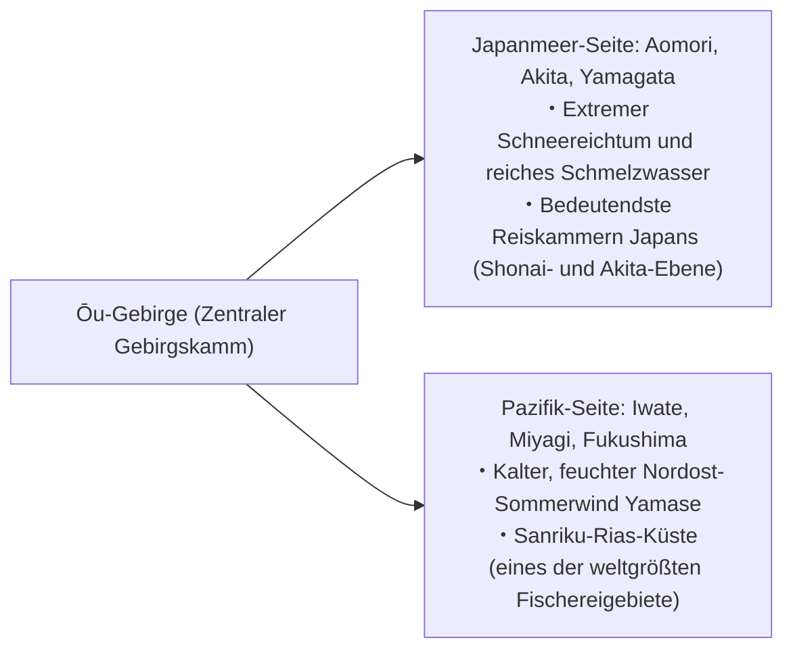
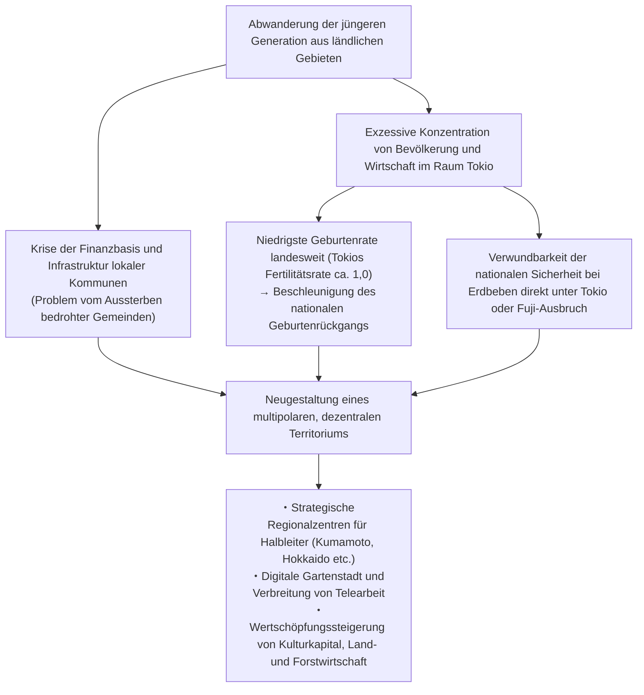
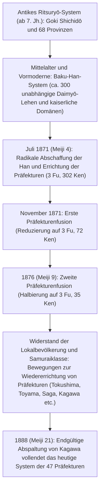

## Einleitung: Die Vielfalt des japanischen Archipels und die Entstehungsgeschichte der 47 Präfekturen

Über rund 3.000 Kilometer erstreckt sich der bogenförmige japanische Archipel von Nord nach Süd. Entstanden durch intensive tektonische Verschiebungen im pazifischen Feuerring – der Kollision von vier Kontinentalplatten (Eurasische Platte, Nordamerikanische Platte, Pazifische Platte und Philippinische Platte) –, stellt Japan eine der gebirgigsten Inselnationen der Erde dar.

Rund 70 Prozent der Landesfläche bestehen aus bewaldetem Gebirge. Entlang der zentralen Gebirgskämme spaltet sich der Archipel in völlig gegensätzliche Klimazonen: das **Japanmeer-Klima** mit extremen Schneemassen im Winter; das **Pazifikklima** mit heißen, feuchten Sommern und sonnigen, trockenen Wintern; das milde, niederschlagsarme **Seto-Inlandsee-Klima**; das **Zentrale Hochlandklima** mit extremen Temperaturunterschieden zwischen Tag und Nacht sowie Sommer und Winter; und das subtropische **Nansei-Inselklima**. Diese außergewöhnliche Bandbreite an Umweltbedingungen ist auf engstem Raum verdichtet.

```
【Klimazonen und topographische Mechanismen des japanischen Archipels】

┌───────────────────────┬─────────────────────────────────┬──────────────────────────────────────────────┐
│ Klimazone             │ Geographischer Bereich          │ Wesentliche Klimamerkmale und Mechanismen    │
├───────────────────────┼─────────────────────────────────┼──────────────────────────────────────────────┤
│ Japanmeer-Klima       │ Hokkaido-Westküste bis Hokuriku │ Der winterliche Nordwest-Monsun nimmt        │
│                       │ und San'in                      │ Feuchtigkeit über dem warmen Tsushima-Strom  │
│                       │                                 │ auf und führt am Hauptgebirge zu Starkschnee.│
│ Pazifikklima          │ Pazifikküste bis Süd-Kyushu     │ Niederschläge und Taifune durch den          │
│                       │                                 │ Sommermonsun; trockene, sonnige Winterwinde. │
│ Seto-Inlandsee-Klima  │ Becken zwischen Chugoku- und    │ Regenwolken werden durch Gebirge abgefangen; │
│                       │ Shikoku-Gebirge                 │ ganzjährig mild, trocken und sonnenreich.    │
│ Zentrales             │ Präfekturen Nagano, Yamanashi,  │ Hohe Gebirgslage; extrem ausgeprägte         │
│ Hochlandklima         │ Hida-Region (Gifu) etc.         │ Temperaturamplituden (Tag/Nacht, Sommer/Winter).│
│ Nansei-Inselklima     │ Präfektur Okinawa,              │ Subtropisch-ozeanisch unter Kuroshio-Einfluss;│
│                       │ Amami-Inseln etc.               │ ganzjährig warm und feucht, häufige Taifune. │
└───────────────────────┴─────────────────────────────────┴──────────────────────────────────────────────┘
```

Die regionale Gliederung Japans basiert historisch auf den 68 sogenannten Ritsuryō-Provinzen (*Ryōseikoku*), die im antiken Verwaltungssystem der *Goki Shichidō* (fünf Hauptprovinzen der Kinki-Region und sieben Reichskreise: Tōkaidō, Tōsandō, Hokurikudō, San'indō, San'yōdō, Nankaidō, Saikaidō) festgeschrieben wurden. Nach der Meiji-Restauration wurden im Zuge der „Abschaffung der Han und Errichtung der Präfekturen“ (*Haihan Chiken*) im Juli 1871 zunächst über 300 Präfekturen und urbane Präfekturen (*Fu* und *Ken*) geschaffen. Nach mehreren großen Konsolidierungswellen verfestigte sich die heutige Struktur mit der Abspaltung der Präfektur Kagawa im Jahr 1888 zur administrativen Ordnung der „47 Präfekturen“ (1 *To* [Metropole Tokio], 1 *Dō* [Distrikt/Präfektur Hokkaido], 2 *Fu* [urbane Präfekturen Osaka und Kyoto], 43 *Ken* [Präfekturen]).

In diesem Beitrag untersuchen wir alle 47 Präfekturen gegliedert nach den acht traditionellen Großregionen (Hokkaido, Tohoku, Kanto, Chubu, Kinki/Kansai, Chugoku, Shikoku, Kyushu/Okinawa) hinsichtlich ihrer historischen Provinzen, Topographie, Wirtschaftsstruktur, Kultur und regionalen Herausforderungen im 21. Jahrhundert.

---

## 1. Region Hokkaido: Die nördliche Pioniergrenze und weitläufige Primärwirtschaft

### 1.1 Hokkaido (Historisch: Ezochi / 11 Provinzen wie Ishikari, Oshima etc.)
- **Präfekturhauptstadt (Verwaltungssitz)**: Sapporo
- **Fläche & Topographie**: 83.424 km² (Rang 1 in Japan, ca. 22 % der gesamten Landesfläche). Das Daisetsuzan- und das Hidaka-Gebirge bilden das Rückgrat der Insel; weite Ebenen wie die Ishikari-Ebene, die Tokachi-Ebene und das Konsen-Plateau prägen das Landschaftsbild. Das Klima ist subpolar bzw. kaltgemäßigt mit kühlen Sommern, extrem kalten Wintern und flächendeckenden Schneedecken.
- **Wirtschafts- und Industriestruktur**:
  - **Landwirtschaft**: Die „Kornkammer Japans“. Ackerbau (Weizen, Zuckerrüben, Kartoffeln, Azukibohnen) und großflächige Milchwirtschaft (über 50 % der nationalen Rohmilchproduktion). Hochgradig mechanisierte Ackerbaubetriebe westlichen Zuschnitts mit teils mehreren Dutzend Hektar pro Hof, insbesondere in der Tokachi-Ebene.
  - **Fischerei**: Sowohl im Fang als auch in der Aquakultur national führend (Jakobsmuscheln, Lachs, Alaska-Seelachs, Kombu-Braunalgen).
  - **Tourismus & Dienstleistungen**: Weltbekannte Pulverschnee-Resorts in Niseko (internationaler Tourismus-Hotspot), Shiretoko (UNESCO-Weltnaturerbe), die Lavendelfelder von Furano sowie das Sapporo-Schneefestival.
- **Geschichte & Kultur**: Traditionelle Kultur des indigenen Volkes der Ainu (Symbolraum für ethnische Koexistenz *Upopoy* in Shiraoi). Pioniergeschichte der Meiji-Ära durch die Erschließungskommission (*Kaitakushi*) und Milizkolonisten (*Tondenhei*). Gründung der Landwirtschaftsschule Sapporo durch Dr. William S. Clark, die moderne Agrarwissenschaften und christlich-humanistische Werte einführte („Boys, be ambitious“).
- **Regionale Herausforderungen**: Rapider Bevölkerungsrückgang und extreme Konzentration auf Sapporo, das Defizit und der Erhalt unrentabler Strecken der Eisenbahngesellschaft JR Hokkaido sowie hohe Unterhaltskosten für die weitläufige Infrastruktur.

---

## 2. Region Tohoku: Der Segen des Ōu-Gebirges und die historische Kultur von Michinoku

Das Tohoku-Gebiet wird durch das von Nord nach Süd verlaufende Ōu-Gebirge in zwei landschaftlich und klimatisch gegensätzliche Räume geteilt: die Japanmeer-Seite (starke Schneefälle, erstklassige Reisanbaugebiete) und die Pazifik-Seite (geprägt von kühlen, feuchten Sommerwinden namens *Yamase* und Spätfrösten).



### 2.1 Präfektur Aomori (Historisch: Tsugaru, Mutsu)
- **Hauptstadt**: Aomori
- **Topographie**: Nördlichste Spitze von Honshu. Die Halbinseln Tsugaru und Shimokita umschließen die Mutsu-Bucht; im Zentrum ragt das Hakkoda-Gebirge auf, im Westen das UNESCO-Weltnaturerbe Shirakami-Sanchi (unberührte Buchenurwälder).
- **Wirtschaft**: Rund 60 % der nationalen Apfelproduktion entfallen auf Aomori (Zentrum: Hirosaki und Tsugaru-Ebene). Jakobsmuschel-Aquakultur in der Mutsu-Bucht, weltberühmter Thunfisch aus Ōma, Hochseefischerei im Hafen Hachinohe. Im Hochtechnologiesektor Nuklearbrennstoffkreislauf-Anlagen in Rokkasho.
- **Kultur & Brauchtum**: Spektakuläre Laternenfeste Aomori Nebuta Matsuri und Hirosaki Neputa Matsuri, Tsugaru-Shamisen-Musik, Geburtsort renommierter Künstler wie Dazai Osamu und Munakata Shikō. Reiche archäologische Jōmon-Stätten (Sannai-Maruyama-Fundstätte).

### 2.2 Präfektur Iwate (Historisch: Rikuchū, Rikuzen, Mutsu)
- **Hauptstadt**: Morioka
- **Topographie**: Mit 15.275 km² die zweitgrößte Präfektur nach Hokkaido. Das Kitakami-Becken entlang des Flusses Kitakami, das östliche Kitakami-Hochland und die schroffe Sanriku-Rias-Küste.
- **Wirtschaft**: Halbleiter- und Automobilindustrie-Cluster im Kitakami-Becken (u. a. Kioxia). Wakame-Algen, Seeohren (Abalone), Lachs- und Pazifische Makrelenhecht-Fischerei an der Sanriku-Küste. Kunsthandwerk: Nanbu-Gusseisenwaren (*Nanbu Tekki*).
- **Kultur & Brauchtum**: Der Goldene Pavillon des Chūson-ji in Hiraizumi (Reines-Land-Buddhismus der Oshu-Fujiwara-Dynastie, UNESCO-Weltkulturerbe). Die literarische Welt von Miyazawa Kenji (sein utopisches Konzept *Ihatov*), die „Geschichten aus Tōno“ (*Tōno Monogatari* von Yanagita Kunio, Wiege der japanischen Volkskunde).

### 2.3 Präfektur Miyagi (Historisch: Rikuzen, Mutsu)
- **Hauptstadt**: Sendai (einzige Großstadt mit Sonderstatus / *Seirei Shitei Toshi* in Tohoku)
- **Topographie**: Fruchtbare Reisanbauflächen der Sendai-Ebene, die malerische Bucht von Matsushima (eine der „Drei schönsten Landschaften Japans“ / *Nihon Sankei*), die Oshika-Halbinsel und die Sendai-Bucht.
- **Wirtschaft**: Politisches und wirtschaftliches Herz von Tohoku. Berühmter Reisanbau (Premiummarken *Sasanishiki*, *Hitomebore*). Fischverarbeitung in Ishinomaki und Kesennuma. Bedeutendes Wissenschaftszentrum rund um die Tohoku-Universität mit modernen Forschungseinrichtungen wie der Synchrotronstrahlungsanlage *NanoTerasu*.
- **Kultur & Brauchtum**: Burgstadtkultur des Sendai-Lehens mit 620.000 Koku, begründet von Date Masamune. Das berühmte Sendai Tanabata Matsuri.

### 2.4 Präfektur Akita (Historisch: Ugo, Dewa)
- **Hauptstadt**: Akita
- **Topographie**: Akita-Ebene, Yokote-Becken, Mount Chōkai, Tazawa-See (tiefster See Japans).
- **Wirtschaft**: Führende Reiskammer Japans mit der renommierten Sorte *Akitakomachi*. Forstwirtschaft mit edlem Akita-Zedernholz (*Akita-Sugi*). Spezialitäten wie Hinai-Jidori-Huhn und Hatahata-Fisch (Pazifischer Segelflosser). In jüngster Zeit wichtiger Vorreiter für Offshore-Windkraftanlagen entlang der Japanmeer-Küste.
- **Kultur & Brauchtum**: Akita Kantō Matsuri (Laternenbalancieren), die Namahage-Tradition auf der Oga-Halbinsel (UNESCO-Immaterielles Kulturerbe), unberührte Natur im Shirakami-Sanchi.

### 2.5 Präfektur Yamagata (Historisch: Uzen, Dewa)
- **Hauptstadt**: Yamagata
- **Topographie**: Shōnai-Ebene an der Küste sowie die durch den Mogami-Fluss verbundenen Beckenlandschaften Yonezawa, Yamagata und Shinjō. Die heiligen drei Berge von Dewa (*Dewa Sanzan*: Gassan, Hagurosan, Yudonosan) und das Zao-Gebirge.
- **Wirtschaft**: „Obstkönigreich Japans“ – Kirschen (über 70 % nationaler Marktanteil) und La-France-Birnen. Spitzenreis aus der Shōnai-Ebene (*Tsuyahime*), edles Yonezawa-Rindfleisch. Präzisionsmaschinen- und Elektronikkomponentenindustrie.
- **Kultur & Brauchtum**: Shugendō-Bergasketen-Kultur auf den Dewa Sanzan, Yamagata Hanagasa Matsuri, Taishō-Romantik-Atmosphäre im Thermalbad Ginzan Onsen.

### 2.6 Präfektur Fukushima (Historisch: Iwashiro, Iwaki)
- **Hauptstadt**: Fukushima
- **Topographie**: Klare Dreiteilung in Aizu (Gebirge, schneereich, reich an Samurai-Geschichte), Nakadōri (politisches und wirtschaftliches Beckenland) und Hamadōri (milde Pazifikküste).
- **Wirtschaft**: Obstbau in Nakadōri (Pfirsiche, Birnen). Aizu-Lackwaren und traditionelle Sake-Brauereien. An der Küste das zukunftsweisende „Fukushima Innovation Coast Framework“ mit dem Robot Test Field und Spitzenforschung zu grünem Wasserstoff.
- **Kultur & Brauchtum**: Samurai-Tradition von Aizuwakamatsu (Byakkotai-Krieger), Kitakata-Ramen, Sōma Nomaoi (traditionelle Reiterspiele). Vorreiter beim Wiederaufbau nach dem Großen Erdbeben und der Nuklearkatastrophe von 2011 sowie bei der globalen Energiewende.

---

## 3. Region Kanto: Konzentration der Hauptstadtfunktionen und vielschichtige Industriecluster

Rund um die Kanto-Ebene – die größte Ebene Japans – verbindet die Kanto-Region eine beispiellose Konzentration von Politik, Wirtschaft, Wissenschaft und Logistik mit hochproduktiver Landwirtschaft im Umland und gigantischen Küstenindustriezonen.

```
【Funktionale Arbeitsteilung der Metropolregion Tokio (Kanto)】

・Präfektur Tokio: Nationale Steuerungszentrale, globales Finanz- und Rechtswesen, IT-Spitzencluster, Kultur- und Trendmetropole
・Präfektur Kanagawa: Keihin-Industriegürtel, internationaler Überseehafen (Yokohama), FuE-Cluster, Tourismus in Shonan und Hakone
・Präfektur Saitama: Zentraler Binnenverkehrsknotenpunkt (Shinkansen- und Autobahnnetz), Umland-Landwirtschaft, Maschinenbau- und Logistikparks
・Präfektur Chiba: Internationaler Flughafen Narita, Keiyo-Küstenindustriekomplex, Fischerei und Intensivlandwirtschaft (Erdnüsse, Gemüse)
・Präfektur Ibaraki: Tsukuba Science City, Industriezone Kashima, Schwerindustrie von Hitachi, Melonen- und Lotoswurzelanbau
・Präfektur Tochigi: Nord-Kanto-Industrieregion (Automobil- und Präzisionsbau), Nikko-Toshogu-Schrein, Erdbeeren (Marke Tochiotome)
・Präfektur Gunma: Automobilindustrie rund um SUBARU, Onsen-Tourismus (Kusatsu, Ikaho), historische Seidenindustrie (UNESCO-Erbe)
```

### 3.1 Präfektur Ibaraki (Historisch: Hitachi)
- **Hauptstadt**: Mito
- **Wirtschaft**: Rang 3 in Japan bei landwirtschaftlicher Bruttoproduktion (Melonen, Lotoswurzeln, getrocknete Süßkartoffeln). Die Wissenschaftsstadt Tsukuba beherbergt rund ein Drittel aller staatlichen Forschungsinstitute Japans. Maschinen- und Elektrogroßindustrie in Hitachi-shi, petrochemische und Stahl-Verbundanlagen am Hafen von Kashima.
- **Kultur**: Mito-Schule des Hauses Mito-Tokugawa (philosophische Wurzel der Sonnō-Jōi-Bewegung), Kairaku-en-Garten, Fukuroda-Wasserfall (einer der drei berühmtesten Wasserfälle Japans).

### 3.2 Präfektur Tochigi (Historisch: Shimotsuke)
- **Hauptstadt**: Utsunomiya
- **Wirtschaft**: Seit einem halben Jahrhundert unangefochten Japans Erdbeerkönig (Sorten *Tochiotome*, *Tochiaika*). Moderne Binnenindustrieparks um Utsunomiya und Oyama (Medizintechnik, Transportmaschinen). Vorreiter im städtischen Nahverkehr durch das neu eröffnete Utsunomiya Light Rail (LRT).
- **Kultur**: UNESCO-Weltkulturerbe der Schreine und Tempel von Nikkō (Nikkō Tōshō-gū), Ashikaga Gakkō (Japans älteste akademische Hochschule), Mashiko-Keramik.

### 3.3 Präfektur Gunma (Historisch: Kōzuke)
- **Hauptstadt**: Maebashi
- **Wirtschaft**: Bedeutendes Zentrum des Automobil- und Metallbaus als Stammsitz von SUBARU (ehemals Nakajima Aircraft) in Ōta. Über 90 % der nationalen Produktion von Konjakwurzeln (*Konnyaku*). Weltberühmte Thermalbäder wie Kusatsu Onsen, Ikaho Onsen und Minakami Onsen.
- **Kultur**: Seidenspinnerei Tomioka und zugehörige Seidenindustrie-Stätten (UNESCO-Weltkulturerbe). Starkes regionales Identitätsgefühl, gepflegt durch das Kartenspiel *Jōmō Karuta*.

### 3.4 Präfektur Saitama (Historisch: Größter Teil von Musashi)
- **Hauptstadt**: Saitama (Großstadt mit Sonderstatus / *Seirei Shitei Toshi*)
- **Wirtschaft**: Fünftgrößte Einwohnerzahl Japans (ca. 7,3 Millionen). Bahnhof Ōmiya als wichtigster Schienenknotenpunkt Ostjapans. Spitzenposition bei der Lebensmittelproduktion. Spezialitäten: Fukaya-Frühlingszwiebeln, Sayama-Tee, Sōka-Reiscracker (*Senbei*).
- **Kultur**: Das historische Stadtbild von Kawagoe („Kleines Edo“) mit seinen feuerfesten Kura-Speicherhäusern, Chichibu-Nachtfest (*Chichibu Yomatsuri*, UNESCO-Immaterielles Kulturerbe).

### 3.5 Präfektur Chiba (Historisch: Shimōsa, Kazusa, Awa)
- **Hauptstadt**: Chiba (Großstadt mit Sonderstatus)
- **Wirtschaft**: Narita International Airport (Haupttor für Japans internationale Luftfracht). Erdölchemie und Stahlwerke im Keiyō-Küstenindustriegürtel. Führende Agrarerzeugung im Umland (Lauch, Erdnüsse, Spinat). Große Fischereierträge im Hafen von Chōshi. Tokyo Disney Resort.
- **Kultur**: Tempelstadt Naritasan Shinshō-ji, Surfen und Meeresresorts auf der Bōsō-Halbinsel.

### 3.6 Präfektur Tokio (Historisch: Musashi, Izu-Inseln, Ogasawara-Inseln)
- **Verwaltungssitz**: Shinjuku (Bezirk Shinjuku)
- **Topographie**: Rund 14 Millionen Einwohner (als Metropolregion der größte Ballungsraum der Welt). Umfasst die 23 Sonderbezirke, die Tama-Region, die Izu-Inseln sowie die subtropischen Ogasawara-Inseln (UNESCO-Weltnaturerbe).
- **Wirtschaft**: Gigantisches Wirtschaftszentrum, das rund 20 % des japanischen Bruttoinlandsprodukts erwirtschaftet. Finanzdistrikte und Handelshäuser in Marunouchi und Ōtemachi, Technologie- und Start-up-Zentren in Shibuya und Roppongi, Subkultur in Akihabara, Haneda Airport als internationaler und nationaler Drehkreuzflughafen.
- **Kultur**: Eine globale Vorreitermetropole, in der historische Stätten wie das Fundament des Edo-Burgturms, der Sensō-ji-Tempel und der Meiji-Schrein Seite an Seite mit futuristischen Wolkenkratzern koexistieren.

### 3.7 Präfektur Kanagawa (Historisch: Sagami, südliches Musashi)
- **Hauptstadt**: Yokohama (ca. 3,77 Millionen Einwohner, bevölkerungsreichste Einzelgemeinde Japans)
- **Wirtschaft**: Zweitgrößte Präfektur Japans nach Einwohnerzahl (ca. 9,2 Millionen). Kern des Keihin-Industriegürtels (Nissan Motor, JFE Steel etc.). FuE-Cluster in Minato Mirai 21. High-Tech- und Umwelttechnologie in Kawasaki.
- **Kultur**: Historische Hauptstadt des Kamakura-Shogunats (Samurai-Kultur), weltoffenes Hafenflair in Yokohama, Surfkultur an der Shonan-Küste, Thermalquellen in Hakone.

---

## 4. Region Chubu: Das industrielle Rückgrat Japans und alpine Topographie

Im Herzen der Hauptinsel Honshu gelegen, umfasst Chubu die extrem diversen Teilregionen Hokuriku (Japanmeer-Seite), Zentrales Hochland (Binnenland) und Tōkai (Pazifikseite) und beherbergt den stärksten Fertigungsgürtel Japans.

### 4.1 Präfektur Niigata (Historisch: Echigo, Sado)
- **Hauptstadt**: Niigata (Großstadt mit Sonderstatus)
- **Wirtschaft**: Reisanbau in der Echigo-Ebene, genährt von den Flusssystemen Shinano und Agano (Nummer 1 beim Spitzenreis *Koshihikari*). Metallbestecke und geschmiedete Messer aus Tsubame-Sanjō mit Weltmarktbedeutung. Zucht edler Nishikigoi-Karpfen. Förderung von Erdgas und Erdöl.
- **Kultur**: Goldmine von Sado (*Sado Kinzan*, UNESCO-Weltkulturerbe), Großfeuerwerk von Nagaoka (*Nagaoka Hanabi*), Echigo-Tsumari Art Triennale.

### 4.2 Präfektur Toyama (Historisch: Etchū)
- **Hauptstadt**: Toyama
- **Wirtschaft**: Aluminiumwalz-, Chemie- und Biopharmaindustrie, angetrieben durch reichhaltige Wasserkraft von Hokuriku Electric Power. Cluster pharmazeutischer Unternehmen, die an die jahrhundertealte Tradition der „Hausierer von Toyama“ (*Toyama no Baiyaku*) anknüpfen. Die Bucht von Toyama als „natürliches Fischbecken“ (Leuchtkalmare, weiße Glasgarnelen, Gelbschwanzmakrele).
- **Kultur**: Tateyama-Gebirgskette und Kurobe-Talsperre (Tateyama Kurobe Alpine Route). UNESCO-Weltkulturerbe der traditionellen Gasshō-Zukuri-Dörfer in Gokayama.

### 4.3 Präfektur Ishikawa (Historisch: Kaga, Noto)
- **Hauptstadt**: Kanazawa
- **Wirtschaft**: Hochwertiger Kulturtourismus auf der Basis des historischen Reichtums des „Kaga-Millionen-Koku“-Lehens. Textil- und Baumaschinenbau (Geburtsort von Komatsu), Kohlenstofffaser-Verbundwerkstoffe.
- **Kultur**: Kenroku-en-Garten, Blattgold-Herstellung (99 % des japanischen Marktes), Kutani-Porzellan, Wajima-Lackwaren. Kreativer Wiederaufbau nach dem Noto-Halbinsel-Erdbeben.

### 4.4 Präfektur Fukui (Historisch: Echizen, Wakasa)
- **Hauptstadt**: Fukui
- **Wirtschaft**: Brillenrahmen-Produktion in Sabae (95 % nationaler Marktanteil). Textilien und elektronische Bauelemente (u. a. Murata Manufacturing). Ursprungsort der Reissorte *Koshihikari*. Echizen-Krabben. Konzentration von Kernkraftwerken in der Region Reinan.
- **Kultur**: Haupttempel Eihei-ji (bedeutendes Zen-Kloster der Sōtō-Schule von Dōgen), Fukui Prefectural Dinosaur Museum, die Klippen von Tōjinbō. Regelmäßige Spitzenplätze im nationalen Wohlstands- und Zufriedenheitsindex.

### 4.5 Präfektur Yamanashi (Historisch: Kai)
- **Hauptstadt**: Kōfu
- **Wirtschaft**: Führender Erzeuger von Weintrauben, Pfirsichen und Pflaumen. Wiege des japanischen Weinbaus (Katsunuma). Edelsteinverarbeitung und Schmuckindustrie (Rang 1 in Japan). Weltmarktführer bei CNC-Steuerungen und Industrierobotern: FANUC. Teststrecke des Magnetschwebezugs Linear Chūō Shinkansen.
- **Kultur**: Historische Stätten rund um Takeda Shingen, die Fünf Fuji-Seen (*Fuji Goko*), Shōsenkyō-Schlucht.

### 4.6 Präfektur Nagano (Historisch: Shinano)
- **Hauptstadt**: Nagano
- **Wirtschaft**: Alpine Gebirgspräfektur, die die Japanischen Alpen (Hida-, Kiso- und Akaishi-Gebirge) umfasst. Präzisionsmaschinen- und Optikindustrie („Schweiz des Orients“, z. B. Seiko Epson). Hochlandgemüse (Kopfsalat, Chinakohl), Äpfel. Höchste Lebenserwartung Japans.
- **Kultur**: Zenkō-ji-Tempel, Burg Matsumoto (nationaler Kulturschatz), Hochplateau-Resorts Kamikōchi und Karuizawa.

### 4.7 Präfektur Gifu (Historisch: Mino, Hida)
- **Hauptstadt**: Gifu
- **Wirtschaft**: Klingen- und Schneidwarenindustrie in Seki (eines der drei Weltzentren für Klingenherstellung). Mino-Keramik (*Mino-yaki*, über die Hälfte der japanischen Keramikproduktion). Luft- und Raumfahrtindustrie in Kakamigahara (Kawasaki Heavy Industries). Hida-Holzmöbelhandwerk.
- **Kultur**: UNESCO-Weltkulturerbe Shirakawa-gō, historische Altstadt von Hida-Takayama, traditionelle Kormoranfischerei auf dem Nagara-Fluss (*Ukai*).

### 4.8 Präfektur Shizuoka (Historisch: Tōtōmi, Suruga, Izu)
- **Hauptstadt**: Shizuoka (Großstadt mit Sonderstatus)
- **Wirtschaft**: Spitzenreiter im verarbeitenden Gewerbe. Reich der Mobilitätsindustrie (Ursprung von Suzuki, Yamaha und Honda). Führender Teeproduzent Japans. Weltweit führend bei Plastikmodellbausätzen (Tamiya, Bandai). Große Fangerträge von Bonito und Thunfisch im Hafen von Yaizu.
- **Kultur**: Berg Fuji (UNESCO-Weltkulturerbe), Onsen-Orte auf der Izu-Halbinsel, Alterssitz von Tokugawa Ieyasu (Burg Sunpu, Kunōzan Tōshō-gū).

### 4.9 Präfektur Aichi (Historisch: Owari, Mikawa)
- **Hauptstadt**: Nagoya (Großstadt mit Sonderstatus)
- **Wirtschaft**: **Seit über 40 Jahren in Folge unangefochten Rang 1 beim industriellen Lieferwert in Japan** – das stärkste Fertigungsimperium des Landes. Stammsitz der Toyota Motor Corporation und eines riesigen Zuliefernetzwerks. Luft- und Raumfahrt (Mitsubishi Heavy Industries), Spezialstahl, Werkzeugmaschinen und Industriekeramik.
- **Kultur**: Wiege der drei Reichseiniger (Oda Nobunaga, Toyotomi Hideyoshi, Tokugawa Ieyasu). Atsuta-Schrein, Burg Nagoya. Einzigartige Esskultur *Nagoya-Meshi* (Miso-Katsu, Hitsumabushi, Tebasaki-Hühnerflügel).

---

## 5. Region Kinki: Das Jahrtausendreich der kaiserlichen Residenzen und die Vielschichtigkeit der Kansai-Wirtschaft

Von der Antike bis zum Beginn der Moderne bildete die Region Kinai das unbestrittene politische und kulturelle Zentrum Japans. Heute koexistieren hier in harmonischer Balance die Handelsmetropole Osaka, die internationale Hafenstadt Kobe sowie die alten Kaiserstädte Kyoto und Nara.

```
【Funktionale Arbeitsteilung und historische Vielfalt der Kinki-Region】

・Präfektur Osaka: Gene der Handelsstadt, internationale Finanzmetropole, Weltausstellungen (1970/2025), Life Sciences, kulinarische Hochburg
・Präfektur Kyoto: Kulturelles Kapital aus tausend Jahren Heian-kyō, Hightech-Pioniere (Nintendo, Kyocera), Kunsthandwerk, Weltkulturreisen
・Präfektur Hyogo: Seehafenhandel (Kobe), Küstenindustriezone Harima, Sake-Brauzentrum Nada, Agrar- und Meeresgüter aus Tamba und Tajima
・Präfektur Nara: Wiege des Yamato-Reiches, antike Hauptstadt Heijō-kyō, Tempel Hōryū-ji und Tōdai-ji (Schatzkammer buddhistischer Kunst)
・Präfektur Shiga: Der Biwa-See (Wasserspeicher für 14 Millionen Menschen in Kinki), Philosophie der Ōmi-Kaufleute, moderne Binnenindustrie
・Präfektur Mie: Ise-Schrein (Höchstes Heiligtum des Shintoismus), Rennstrecke Suzuka, Perlenzucht, Petrochemie in Yokkaichi
・Präfektur Wakayama: Kōya-san und Kumano Sanzan (Heilige Stätten und Pilgerwege), Spitzenreiter bei Mandarinen und Umeboshi-Pflaumen
```

### 5.1 Präfektur Mie (Historisch: Ise, Iga, Shima, östliches Kii)
- **Hauptstadt**: Tsu
- **Wirtschaft**: Petrochemie- und Halbleiterkomplex in Yokkaichi. Matsusaka-Rindfleisch, Akoya-Perlenzucht in der Ago-Bucht, Ise-Ebi-Langusten.
- **Kultur**: Ise-Schrein (Kōtaijinjū und Toyo'ukedaijinjū), Ninja-Tradition von Iga, Pilgerwege des Kumano Kodō (Iseji-Route).

### 5.2 Präfektur Shiga (Historisch: Ōmi)
- **Hauptstadt**: Ōtsu
- **Wirtschaft**: Strategischer Verkehrsknotenpunkt rund um den Biwa-See. Binnenmutterwerke internationaler Konzerne wie Toray und Panasonic. Shigaraki-Keramik. Ōmi-Reis und edles Ōmi-Rindfleisch.
- **Kultur**: Enryaku-ji auf dem Berg Hiei (Mutterkloster des japanischen Buddhismus), Burg Hikone (originaler Bergfried / Nationalschatz), Kaufmannsethik *Sanpō-yoshi* („Gut für den Käufer, gut für den Verkäufer, gut für die Gesellschaft“).

### 5.3 Präfektur Kyoto (Historisch: Yamashiro, Tamba, Tango)
- **Hauptstadt**: Kyoto (Großstadt mit Sonderstatus)
- **Wirtschaft**: Eine der weltweit bedeutendsten Kultur- und Tourismusmetropolen. Hauptsitz globaler Hightech-Giganten wie Nintendo, OMRON, Kyocera, Shimadzu und Nidec. Traditionelles Kunsthandwerk: Nishijin-Seidenweberei, Kiyomizu-Keramik, Uji-Grüntee.
- **Kultur**: Historische Denkmäler des alten Kyoto (UNESCO-Weltkulturerbe mit 17 Tempeln, Schreinen und Burgen), Gion Matsuri, Gozan no Okuribi (traditionelle Bergfeuer).

### 5.4 Präfektur Osaka (Historisch: östliches Settsu, Kawachi, Izumi)
- **Hauptstadt**: Osaka (Großstadt mit Sonderstatus)
- **Wirtschaft**: Größter Wirtschaftsraum Westjapans. Wiege der großen Handelshäuser (*Sōgō Shōsha* wie Itochu und Sumitomo), Pharmazie und Life Sciences (Takeda etc.), hochpräzise Fertigung im Mittelstand (Higashi-Osaka). Internationaler Flughafen Kansai.
- **Kultur**: Burg Osaka, Vergnügungsviertel Dōtonbori, Kamigata-Rakugo, Bunraku-Puppentheater, Yoshimoto Shinkigeki; Esskultur des *Konamon* (Takoyaki, Okonomiyaki). Kofun-Gruppe von Mozu-Furuichi (Mausoleum von Kaiser Nintoku, UNESCO-Weltkulturerbe).

### 5.5 Präfektur Hyogo (Historisch: westliches Settsu, Tamba, Tajima, Harima, Awaji)
- **Hauptstadt**: Kobe (Großstadt mit Sonderstatus)
- **Wirtschaft**: Internationaler Seehafen Kobe. Schwerindustrieunternehmen wie Kawasaki Heavy Industries und Kobe Steel. Küstenindustriezone Harima. Nada Gogō (führende Sake-Brauregion Japans). Zwiebeln von der Insel Awaji, weltberühmtes Kobe-Rind.
- **Kultur**: Burg Himeji (erstes UNESCO-Weltkulturerbe Japans, „Burg des weißen Reihers“), Arima Onsen, ehemalige Ausländersiedlung und Kitano Ijinkan in Kobe.

### 5.6 Präfektur Nara (Historisch: Yamato)
- **Hauptstadt**: Nara
- **Wirtschaft**: Tourismus, Forstwirtschaft mit Yoshino-Zedern und Zypressen, Japans größte Sockenproduktion (um Kōryō-chō), traditionelle Herstellung von Tuschestangen (*Sumi*) und Teebesen (*Chasen*).
- **Kultur**: Historische Stätten des antiken Nara (Tōdai-ji, Kōfuku-ji, Kasuga-Taisha), buddhistische Bauten im Bezirk Hōryū-ji (älteste erhaltene Holzgebäude der Welt), Kirschblüte und Shugendō am Berg Yoshino.

### 5.7 Präfektur Wakayama (Historisch: westliches Kii)
- **Hauptstadt**: Wakayama
- **Wirtschaft**: Nummer 1 in Japan bei Unshū-Mandarinen (*Mikan*), Nankō-Pflaumen (*Umeboshi*), Hassaku-Zitrusfrüchten und Sanshō-Pfeffer. Stahlwerk Wakayama von Nippon Steel.
- **Kultur**: Heilige Stätten und Pilgerwege in den Kii-Bergen (UNESCO-Welterbe mit Kōyasan Kongōbu-ji und den Kumano Sanzan), Shirahama Onsen.

---

## 6. Region Chugoku: Die Industriegürtel der Seto-Inlandsee und die Mythenwelt von San'in

Durch das Chugoku-Gebirge klar gegliedert, bietet die Region einen markanten Kontrast zwischen **San'yō** an der sonnigen Seto-Inlandsee mit hochentwickelter Schwerindustrie und **San'in** an der Japanmeer-Küste mit antiken Mythen und unberührter Natur.

### 6.1 Präfektur Tottori (Historisch: Inaba, Hōki)
- **Hauptstadt**: Tottori
- **Topographie & Wirtschaft**: Einwohnerärmste Präfektur Japans (ca. 540.000 Einwohner). Sanddünen-Landwirtschaft an den Dünen von Tottori (Rakkyō-Schalotten). Nijisseiki-Birnen (Rang 1 in Japan). Weißlauch, Rekordfänge von Krabben im Hafen Sakaiminato.
- **Kultur**: Mythos vom Weißen Hasen von Inaba, Misasa Onsen (hochkonzentriertes Radonbad), Tempel Sanbutsu-ji Nageire-dō am Berg Mitoku (Nationalschatz).

### 6.2 Präfektur Shimane (Historisch: Izumo, Iwami, Oki)
- **Hauptstadt**: Matsue
- **Topographie & Wirtschaft**: Izumo-Ebene, Shinji-See (größter Fang von Shijimi-Körbchenmuscheln in Japan). Spezialstahl (*Yasuki Hagane* / Hitachi Metals). Alpenveilchen, Delaware-Trauben.
- **Kultur**: Izumo-Taisha (Heiligtum der Versammlung aller Shinto-Götter und Mythos der Landübergabe), Silbermine Iwami Ginzan (UNESCO-Weltkulturerbe), UNESCO-Geopark der Oki-Inseln.

### 6.3 Präfektur Okayama (Historisch: Mimasaka, Bizen, Bitchū)
- **Hauptstadt**: Okayama (Großstadt mit Sonderstatus)
- **Wirtschaft**: Küstenindustriegebiet Mizushima (Petrochemie, Stahlwerke, Automobilfertigung). „Königreich der Früchte“ für weiße Pfirsiche und Muscat-Trauben. Wiege der japanischen Jeans- und Schuluniformproduktion im Bezirk Kojima.
- **Kultur**: Historisches Viertel Kurashiki Bikan (weiße Giebelhäuser), Kōraku-en (einer der drei berühmtesten Gärten Japans), Bizen-Keramik.

### 6.4 Präfektur Hiroshima (Historisch: Aki, Bingo)
- **Hauptstadt**: Hiroshima (Großstadt mit Sonderstatus)
- **Wirtschaft**: Größte Wirtschaftsmetropole in Chugoku und Shikoku. Automobilindustrie rund um Mazda, Stahlwerk JFE Steel Fukuyama, Schiffbau in Kure und Onomichi. Austernzucht (über die Hälfte der nationalen Produktion). Größter Zitronenanbauer Japans.
- **Kultur**: Zwei UNESCO-Weltkulturstätten (Itsukushima-Schrein mit dem schwimmenden Torii und Friedensdenkmal Atombomben-Dom). Weltweites Symbol für den Frieden. Literarische Kulisse und Hangstraßen von Onomichi.

### 6.5 Präfektur Yamaguchi (Historisch: Suō, Nagato)
- **Hauptstadt**: Yamaguchi
- **Wirtschaft**: Shūnan-Industriekomplex an der Inlandsee (Petrochemie, anorganische Chemie). Chemie- und Zementindustrie von Ube Industries (UBE). Hafen Shimonoseki als Umschlagplatz für Kugelfisch (*Fugu*) und Seeteufel.
- **Kultur**: Shōka Sonjuku in Hagi (Schule der Vordenker der Meiji-Restauration, UNESCO-Weltkulturerbe). Kintai-Brücke, Akiyoshidai und Akiyoshidō (größtes Karstplateau und Tropfsteinhöhle Japans), Tsunoshima-Brücke.

---

## 7. Region Shikoku: Das historische Erbe von Nankaidō, Seto-Industrie und Pazifik-Fischerei

Das Shikoku-Gebirge verläuft quer durch die Insel und trennt die sonnige Seto-Inlandsee-Seite im Norden (Kagawa, Ehime) von der regenreichen Pazifikseite im Süden (Kochi, Tokushima). Drei gigantische Brückensysteme (Kobe-Awaji-Naruto, Seto-Ohashi, Nishiseto/Shimanami-Kaido) binden Shikoku fest an Honshu an.

### 7.1 Präfektur Tokushima (Historisch: Awa)
- **Hauptstadt**: Tokushima
- **Wirtschaft**: Sudachi-Zitrusfrüchte (über 90 % nationaler Marktanteil), Naruto-Kintoki-Süßkartoffeln, Awa-Odori-Freilandgeflügel. Weltführendes LED- und Leuchtstoff-Cluster rund um Nichia Corporation (Erfinder der blauen LED).
- **Kultur**: 400 Jahre alte Tradition des Awa-Odori-Tanzfestivals, Gezeitenstrudel von Naruto, abgelegene Schlucht von Iya mit ihren Lianenbrücken (*Kazurabashi*).

### 7.2 Präfektur Kagawa (Historisch: Sanuki)
- **Hauptstadt**: Takamatsu
- **Wirtschaft**: Flächenmäßig kleinste Präfektur Japans, aber hohe Bevölkerungsdichte. Gewaltige Nudelkultur der „Sanuki Udon“ als touristischer Wirtschaftsmotor. Führender Olivenproduzent Japans (Insel Shōdoshima). Küstenindustriezone Bannosu.
- **Kultur**: Kotohira-gū (liebevoll „Konpira-san“ genannt), Ritsurin-Garten (herausragendes Landschaftsdenkmal), Setouchi Triennale (internationales Zentrum für Gegenwartskunst auf Naoshima, Teshima etc.).

### 7.3 Präfektur Ehime (Historisch: Iyo)
- **Hauptstadt**: Matsuyama
- **Wirtschaft**: Inbegriff des japanischen Mandarinen- und Zitrusanbaus. Imabari-Handtücher (globale Luxusmarke für Textilqualität). Größtes maritimes Cluster Japans mit Werften und Reedereien in Imabari. Zellstoff-, Papierverarbeitungs- und Buntmetallindustrie in Niihama und Shikokuchūō.
- **Kultur**: Hauptgebäude des Dōgo Onsen (*Dōgo Onsen Honkan*, ältestes Heilbad Japans), Burg Matsuyama, Shimanami Kaidō-Radweg über das Meer.

### 7.4 Präfektur Kochi (Historisch: Tosa)
- **Hauptstadt**: Kochi
- **Wirtschaft**: Intensiver Frühgemüseanbau im warmen Klima (Auberginen), Nummer 1 bei Ingwer und Myōga. Traditioneller Bonito-Fang mit der Angelrute (*Ipponzuri*). Industrieanwendungen von Tiefenmeerwasser.
- **Kultur**: Geist der Freiheits- und Bürgerrechtsbewegung, der historische Pioniere wie Sakamoto Ryōma hervorbrachte; Yosakoi Matsuri, Katsurahama-Strand, Shimanto-Fluss (letzter unverbauter Fluss Japans).

---

## 8. Region Kyushu und Okinawa: Das Tor zu Asien und die Kultur der Nansei-Inseln

Als das dem asiatischen Festland am nächsten gelegene Gebiet diente Kyushu seit dem Altertum (*Sakimori*-Grenzsoldaten, *Kentōshi*-Gesandtschaften nach China) als Japans wichtigste Drehscheibe für den Außenhandel. Heute erlebt die Region eine spektakuläre Wiedergeburt als „Silicon Island“ neben pulsierendem Vulkan- und Meerestourismus.

```
【Regionale Stärken und Industrieprofile von Kyushu und Okinawa】

・Präfektur Fukuoka: Herz von Kyushu, Tor zu Asien, zentrumsnaher Großstadtflughafen, Sonderwirtschaftszone für IT und Start-ups
・Präfektur Saga: Keramik aus Arita und Imari, Karatsu Kunchi, Reisanbau und Nori-Algen der Saga-Ebene (Ariake-See)
・Präfektur Nagasaki: Nanban- und Dejima-Handel, christliche Untergrundkultur, Großschiffbau, Fischreichtum an Rias-Küsten
・Präfektur Kumamoto: Halbleiter-Megacluster durch TSMC (JASM), gewaltige Aso-Caldera, Stadt mit 100 % Grundwasserversorgung
・Präfektur Oita: Thermalbad-Mekka mit nationalen Spitzen-Quellschüttungen (Beppu, Yufuin), Geothermie, Industriekomplex Oita
・Präfektur Miyazaki: Hohe Sonnenscheindauer und mildes Klima (Mangos, Paprika, Miyazaki-Rind), Surferparadies am Hyūga-Meer
・Präfektur Kagoshima: Reich von Kurobuta-Schweinen, Wagyu-Rind, Süßkartoffeln und Shōchū; Vulkan Sakurajima, Weltnaturerbe Yakushima
・Präfektur Okinawa: Einzigartige Geschichte des Ryukyu-Königreichs, Burg Shuri, Churaumi-Aquarium, subtropische Resorts, Basenwirtschaft und Autonomie
```

### 8.1 Präfektur Fukuoka (Historisch: Chikuzen, Chikugo, Buzen)
- **Hauptstadt**: Fukuoka (Großstadt mit Sonderstatus, ca. 1,6 Millionen Einwohner)
- **Wirtschaft**: Wirtschaftliches Kraftzentrum von Kyushu. Industriezone Kitakyūshū (Geburtsort der staatlichen Yawata-Stahlwerke, Yaskawa Electric). Hafen Hakata und Flughafen Fukuoka (nur 5 Minuten per U-Bahn ins Stadtzentrum). IT- und Startup-Hauptstadt. Führend bei Luxus-Erdbeeren (*Amaō*).
- **Kultur**: Hakata Gion Yamakasa, Dazaifu Tenmangū (Sugawara no Michizane), lebendige Yatai-Garküchen-Kultur, Munakata-Taisha (UNESCO-Weltkulturerbe).

### 8.2 Präfektur Saga (Historisch: östliches Hizen)
- **Hauptstadt**: Saga
- **Wirtschaft**: Arita- und Imari-Porzellan (Geburtsstätte des japanischen Porzellans). Nori-Algenzucht im Ariake-Meer (seit zwei Jahrzehnten ununterbrochen Rang 1 beim Verkaufswert). Saga-Rind. Kernkraftwerk Genkai.
- **Kultur**: Yoshinogari-Stätte (bedeutendste befestigte Grabensiedlung der Yayoi-Zeit), Takeo Onsen, Herbstfestival Karatsu Kunchi.

### 8.3 Präfektur Nagasaki (Historisch: westliches Hizen, Iki, Tsushima)
- **Hauptstadt**: Nagasaki
- **Wirtschaft**: Traditioneller Schiffbau, verkörpert durch die Mitsubishi-Werft in Nagasaki. Zweitlängste Küstenlinie aller Präfekturen, führend bei Makrelen- und Stöckerfängen. Nummer 1 beim Anbau von Wollmispeln (*Biwa*).
- **Kultur**: Stätten der verborgenen Christen in der Region Nagasaki und Amakusa (UNESCO-Welterbe), Stätten der industriellen Meiji-Revolution (Insel Hashima / Gunkanjima), Huis Ten Bosch.

### 8.4 Präfektur Kumamoto (Historisch: Higo)
- **Hauptstadt**: Kumamoto (Großstadt mit Sonderstatus)
- **Wirtschaft**: **Durch die Ansiedlung von TSMC (JASM) in Kikuyō-machi erlebt Kumamoto den größten Halbleiter-Investitionsboom in der Geschichte Japans.** Höchste Tomatenernte Japans, Wassermelonen. Trinkwasserversorgung zu 100 % aus reinem Grundwasser.
- **Kultur**: Burg Kumamoto (uneinnehmbare Festung von Katō Kiyomasa), Aso-Caldera (eine der größten Vulkancalderen der Welt), Fünf Amakusa-Brücken.

### 8.5 Präfektur Oita (Historisch: Bungo, südliches Buzen)
- **Hauptstadt**: Oita
- **Wirtschaft**: „Onsen-Präfektur Nummer 1“ bei Quellanzahl und Schüttungsvolumen (Beppu und Yufuin). Küstenindustrie Oita (Stahl, Chemie, Raffinerien). Kabosu-Zitrusfrüchte (90 % nationaler Marktanteil). Hochwertige getrocknete Shiitake-Pilze.
- **Kultur**: Usa-Schrein (Hauptschrein aller Hachiman-Schreine Japans), Rokugō Manzan auf der Kunisaki-Halbinsel (Synthese von Shintoismus und Buddhismus / *Shinbutsu-Shūgō*).

### 8.6 Präfektur Miyazaki (Historisch: Hyūga)
- **Hauptstadt**: Miyazaki
- **Wirtschaft**: Mildes, regenreiches Klima begünstigt Miyazaki-Rind (vielfacher Gewinner des Premierminister-Preises), Premium-Mangos (*Taiyō no Tamago*), Geflügel- und Schweinezucht. Rang 1 bei der Rohholzproduktion von Zedern (*Sugi*).
- **Kultur**: Takachiho-Schlucht (Mythen um das Herabsteigen der Götter / *Tenson Kōrin* und nächtliche Kagura-Tänze), Aoshima-Schrein, Udo-Schrein.

### 8.7 Präfektur Kagoshima (Historisch: Satsuma, Ōsumi)
- **Hauptstadt**: Kagoshima
- **Wirtschaft**: Rang 2 in Japan bei landwirtschaftlicher Bruttoproduktion. Schwarzes Wagyu-Rind (*Kagoshima Kuroushi*), Kurobuta-Schweinefleisch, Süßkartoffeln, Zuchtaal, Geflügel. Authentischer Destillat-Sake (*Honkaku Shōchū*). Raumfahrtzentrum Tanegashima (Raketenstartplatz der JAXA).
- **Kultur**: Kinko-Bucht mit Blick auf den aktiven Vulkan Sakurajima. Führendes Samurai-Lehen der Meiji-Restauration (Satsuma-Clan: Saigō Takamori, Ōkubo Toshimichi). UNESCO-Weltnaturerbe (Jōmon-Sugi-Urbäume auf Yakushima, Insel Amami-Ōshima).

### 8.8 Präfektur Okinawa (Historisch: Ryukyu-Königreich)
- **Hauptstadt**: Naha
- **Topographie**: Südlichste und westlichste Inselpräfektur Japans im subtropischen Klimagürtel. Zahlreiche bewohnte Inseln, darunter Miyako-jima und die Yaeyama-Gruppe (Ishigaki, Iriomote).
- **Wirtschaft**: Führende internationale Urlaubs- und Meerestourismus-Destination. Ansiedlung von IT- und Kommunikationsunternehmen. Zuckerrohr, Agū-Schweine, Gōyā-Bittermelonen, Awamori-Reisschnaps. Wandel der Abhängigkeit von US-Militärstützpunkten hin zu einer selbsttragenden Wirtschaft.
- **Kultur**: Gusuku-Stätten und zugehörige Denkmäler des Königreichs Ryukyu (Burg Shuri etc., UNESCO-Welterbe). Eisa-Tänze, Sanshin-Lautenmusik, Ryukyu-Lackwaren, Bingata-Färbekunst. Weltbekannte Kultur der Langlebigkeit und gesunden Ernährung.

---

## 9. 21. Jahrhundert: Regionale Herausforderungen zwischen Tokio-Zentrierung und dezentraler Raumordnung

Beim vergleichenden Blick auf alle 47 Präfekturen tritt die größte strukturelle Schieflage des modernen Japan hervor: **die extreme Überkonzentration im Großraum Tokio bei gleichzeitig rasantem Bevölkerungsrückgang und Verödung der ländlichen Regionen**.



### 9.1 Vom Aussterben bedrohte Kommunen und Grenzen des Infrastrukturerhalts
Gemäß dem wegweisenden „Masuda-Bericht“ von 2014 sowie aktuellen Erhebungen des Bevölkerungsstrategierats (*Population Strategy Council*) stehen mehr als 40 Prozent aller Kommunen Japans vor der realen Gefahr des demografischen „Aussterbens“ (*Shōmetsu Kanōsei Jichitai*). Insbesondere der ununterbrochene Braindrain junger Frauen in die Metropolregion Tokio führt in abgelegenen Gebieten zu Schulschließungen, dem Zusammenbruch des öffentlichen Nahverkehrs und einer fiskalischen Überlastung bei der Sanierung veralteter Infrastrukturen wie Wasserversorgung, Straßen und Brücken.

### 9.2 Aufkeimende regionale Wiederbelebung durch Halbleiter und erneuerbare Energien
Doch seit Beginn der 2020er-Jahre zeichnet sich ein historischer Paradigmenwechsel ab.
Erstens werden aus Gründen der wirtschaftlichen Sicherheit Megafabriken für Halbleiter der nächsten Generation gezielt in den Regionen angesiedelt. Multimilliarden-Investitionen wie TSMC/JASM in Kumamoto oder Rapidus in Chitose (Hokkaido) lösen einen massiven Rückstrom von Zulieferern, Forschungszentren und hochqualifizierten, gut bezahlten Arbeitsplätzen in die Provinzen aus.
Zweitens werden im Zuge der grünen Transformation (GX) die weitläufigen ländlichen Gebiete (Offshore-Windkraft an der Japanmeer-Küste und in Tohoku, Photovoltaik, Geothermie und Biomasse in Hokkaido und Kyushu) als lebenswichtige Energieerzeugungs- und Versorgungszentren der Nation neu definiert.

---

## 0. Geschichte der Verwaltungsgliederung: Vom Ritsuryō-System über Haihan Chiken zur großen Präfekturfusion

Die heutige administrative Einteilung in 47 Präfekturen existierte keineswegs seit Urzeiten als Naturtatsache. Sie ist vielmehr das Resultat dramatischer staatspolitischer Experimente, radikaler Restrukturierungen und erbitterten Widerstands während der Modernisierung in der Meiji-Ära.



### 0.1 Die politische Mechanik von Haihan Chiken (1871)
Für die 1868 durch die Meiji-Restauration gegründete Zentralregierung standen die Festigung der nationalen Souveränität sowie die militärische und finanzielle Einheit an oberster Stelle. Zwar wurden die früheren Feudalherren (*Daimyō*) im Zuge der Rückgabe der Land- und Bevölkerungsregister (*Hanseki Hōkan*, 1869) zu Gouverneuren (*Chihanseji*) ernannt, doch behielten die einzelnen Lehen weiterhin ihre eigenen Truppen und Steuerhoheiten. Die Einheit des Staates stand auf tönernen Füßen.

Am 14. Juli 1871 (Meiji 4) führten Saigō Takamori, Ōkubo Toshimichi und Kido Takayoshi gestützt auf kaiserliche Gardetruppen aus Satsuma, Chōshū und Tosa einen politischen Blitzschlag durch: die Ausrufung von *Haihan Chiken*. Die Han wurden per Dekret über Nacht aufgelöst, die bisherigen Gouverneure zum Umzug nach Tokio gezwungen und von der Zentralregierung ernannte Gouverneure (*Chiji* bzw. *Kenrei*) entsandt. So entstanden zunächst **3 Fu und 302 Ken**.

### 0.2 Erste und zweite Präfekturenfusion sowie das Beben der „Präfektur-Wiederherstellungsbewegungen“
Da die über 300 ursprünglichen Einheiten viel zu zersplittert und finanzschwach waren, leitete die Regierung unverzüglich Fusionen ein.
Bereits im November 1871 wurden die Einheiten in der „Ersten Präfekturenfusion“ auf 3 Fu und 72 Ken reduziert. 1876 (Meiji 9) veranlasste das Innenministerium (*Naimushō*) in einer radikalen „Zweiten Präfekturenfusion“ die drastische Verkleinerung auf nur noch **3 Fu und 35 Ken**.

Diese rücksichtslose Zusammenlegung führte zu enormen regionalen Verwerfungen:
So wurde die heutige Präfektur Kagawa erst Myōdō (Tokushima) und später Ehime zugeschlagen; Toyama wurde in Ishikawa eingegliedert, Saga in Nagasaki, Miyazaki in Kagoshima und Fukui zwischen Ishikawa und Shiga aufgeteilt.
Dagegen regte sich unter Honoratioren, reichen Großbauern und ehemaligen Samurai erbitterter Widerstand: Man beklagte, dass lokale Steuern in ferne Zentren abgezogen und die Infrastruktur der Peripherie vernachlässigt würden. Verbunden mit der Bewegung für Freiheit und Bürgerrechte (*Jiyū Minken Undō*) formierten sich militante Bewegungen zur Wiederherstellung aufgelöster Präfekturen (*Fukken Undō*).

Angesichts dieses massiven Drucks lenkte die Regierung schrittweise ein: 1881 wurde Fukui wiedererrichtet, 1883 folgten Toyama, Saga und Miyazaki. Als schließlich im Dezember 1888 (Meiji 21) die Präfektur Kagawa endgültig von Ehime abgespalten wurde, war das bis heute bestehende, stabile Gefüge aus **1 To, 1 Dō, 2 Fu und 43 Ken (47 Präfekturen)** vollendet.

---

## 8.9 Sprachlandschaft der 47 Präfekturen: Dialektwellentheorie und die Ost-West-Sprachgrenze

Die Vielfalt des japanischen Archipels spiegelt sich nirgendwo lebendiger wider als im reichen Nuancenreichtum seiner regionalen Dialekte (*Hōgen*).

Der renommierte Volkskundler und Linguist Yanagita Kunio untersuchte 1930 in seinem bahnbrechenden Werk *Kagyū-kō* („Schneckenbetrachtungen“) die landesweite Verbreitung der Bezeichnungen für die Schnecke. Dabei formulierte er die berühmte **Dialektwellentheorie (Schneckentheorie / *Hōen Shūken-ron*)**: Neue sprachliche Innovationen breiteten sich demnach von Kyoto (dem jahrhundertelangen kulturellen Zentrum des Landes) wie konzentrische Wellen kreisförmig in die Randregionen aus.

```
【Struktur der Dialektwellen nach Yanagita Kunios „Kagyū-kō“】

[Kyoto (Zentrum)]: Dendenmushi (Neologismus der frühen Neuzeit)
  ↓ (Ausbreitung nach außen)
[Kinki-Umland, Hokuriku, Tōkai]: Maimai (Begriff der Muromachi-Zeit)
  ↓
[Chūbu, Kantō, Chūgoku, Shikoku]: Katatsumuri (Begriff der Heian-Zeit)
  ↓
[Tōhoku, Kyūshū]: Tsuburi, Tsubu (Archaisches Vokabular der Antike)
  ↓
[Äußerste Ränder von Honshū (Tsugaru in Aomori, Satsuma in Kagoshima)]: Namekuji, Name (Älteste Relikte altjapanischer Schichten)
```

Zudem existiert im Japanischen eine fundamentale **Ost-West-Sprachgrenze**, die ungefähr von Itoigawa (Niigata) über den Hamana-See bis zum Fuji-Fluss (Shizuoka) verläuft:
- **Ostjapanische Dialekte**: Kopula *da*, Negationspartikel *nai*, Imperativ auf *-ro* (*okiro*), Tonhöhenakzent des Tokio-Typs (*Tōkyō-shiki Akusento*).
- **Westjapanische Dialekte**: Kopula *ja* oder *ya*, Negationspartikel *n* oder *hen*, Imperativ auf *-yo* (*okiyo*), Keihan-Tonhöhenakzent (*Keihan-shiki Akusento*).

Besondere Phänomene wie die Vokalzentralisierung des *Zūzū-ben* im Tohoku-Gebiet oder die ausgeprägten geschlossenen Silben (Geminaten und Nasalierungsformen) im Satsuma-Dialekt (Kagoshima), der in der Samurai-Ära historisch gar als abhörsichere Geheimsprache gegen feindliche Spione diente, verdeutlichen, wie die geografische Isolation durch Gebirge und Meerengen ein unschätzbares immaterielles Kulturgut geformt hat.

---

## 9.3 Wirtschaftsgeographie der 47 Präfekturen: Industriecluster und der Lokalisierungsquotient (LQ)

Um die industrielle Wettbewerbsfähigkeit und Spezialisierung der einzelnen Präfekturen methodisch zu erfassen, nutzt die Wirtschaftsgeographie den **Lokalisierungsquotienten (Location Quotient: LQ)**. Er misst die relative Konzentration einer bestimmten Industrie in einer Region im Vergleich zum Gesamtdurchschnitt der Nation.

$$LQ = \frac{e_i / e}{E_i / E}$$

Hierbei bezeichnet $e_i$ die Zahl der Beschäftigten (oder den industriellen Lieferwert) im Wirtschaftszweig $i$ der betrachteten Region, $e$ die Gesamtbeschäftigtenzahl dieser Region, $E_i$ die nationale Beschäftigtenzahl in der Industrie $i$ und $E$ die nationale Gesamtbeschäftigung aller Wirtschaftszweige. Ein Wert von $LQ > 1{,}0$ signalisiert, dass die betreffende Region eine überdurchschnittliche Spezialisierung in diesem Wirtschaftszweig aufweist.

```
【Markante Spezialisierungsmuster unter den 47 Präfekturen】

1. Transportmaschinenbau (Automobil- und Luftfahrtindustrie):
   ・Präfekturen mit extrem hohem LQ: Aichi (LQ ≈ 3,2), Gunma (LQ ≈ 2,8), Shizuoka (LQ ≈ 2,5), Hiroshima (LQ ≈ 2,1)
   ・Charakteristik: Tief gestaffelte Zulieferpyramiden an der Spitze globaler Endmontage-Giganten (Toyota, SUBARU, Suzuki, Mazda).

2. Elektronische Bauelemente, Halbleiter- und Gerätefertigung:
   ・Präfekturen mit extrem hohem LQ: Yamagata (LQ ≈ 2,9), Fukui (LQ ≈ 2,7), Kumamoto (LQ ≈ 2,6), Iwate (LQ ≈ 2,4)
   ・Charakteristik: Binnenländische „Silicon Roads“ und „Silicon Islands“, begünstigt durch reines Wasser, saubere Luft und ein dichtes Autobahnnetz.

3. Primärsektor (Landwirtschaft und Fischerei):
   ・Präfekturen mit extrem hohem LQ: Aomori, Hokkaido, Kagoshima, Miyazaki, Kochi (LQ > 3,0)
   ・Charakteristik: Strategisches Fundament nationaler Ernährungssicherheit. Zunehmender Wandel zu Smart Agriculture und 6.-Sektor-Wertschöpfung.

4. Internationales Finanzwesen, IT, Kommunikation und unternehmensnahe Dienstleistungen:
   ・Präfekturen mit extrem hohem LQ: Tokio (LQ ≈ 2,5), Osaka (LQ ≈ 1,4)
   ・Charakteristik: Oligopolistische Konzentration von Unternehmenszentralen, IP-Management und Risikokapital.
```

Japans Volkswirtschaft wird folglich nicht von einem einzigen Aggregat angetrieben, sondern durch das feine Zusammenspiel dreier Säulen: dem **Produktions- und Fertigungsmotor** (Aichi, Tōkai, Nord-Kanto), dem **Finanz-, Informations- und Steuerungszentrum** (Tokio, Osaka) sowie dem **Ernährungs-, Rohstoff-, Energie- und Halbleiterfundament** der ländlichen Regionen.

---

## 0.3 Politische Geschichte der Diskrepanz zwischen Präfekturnamen und Hauptstadtnamen: Überprüfung der Strafhypothese der frühen Meiji-Ära

Bei der Analyse der 47 Präfekturen fällt ein auffälliges Phänomen ins Auge: Es gibt Präfekturen, deren Name mit dem ihrer Hauptstadt identisch ist (z. B. Akita, Niigata, Hiroshima), und solche, bei denen sich der Präfekturname fundamental vom Namen des Verwaltungssitzes unterscheidet (z. B. Iwate/Morioka, Miyagi/Sendai, Ibaraki/Mito, Tochigi/Utsunomiya, Gunma/Maebashi, Ishikawa/Kanazawa, Mie/Tsu, Shiga/Ōtsu, Hyogo/Kobe, Shimane/Matsue, Ehime/Matsuyama, Okinawa/Naha).

Lange Zeit hielt sich in der Populärliteratur die Legende, dies sei eine gezielte Bestrafung gewesen: Lehen, die im Boshin-Krieg aufseiten des Shogunats gegen die kaiserlichen Truppen gekämpft hatten (*Zokugun*), hätten demnach zur Strafe nicht den Namen ihrer Burgstadt als Präfekturnamen tragen dürfen, sondern seien nach Landkreisen benannt worden (die sogenannte „Straftheorie“ / *Chōbatsu-setsu*). Als angebliche Belege wurden prominente Mitglieder der Ouetsu Reppan Dōmei wie Aizu (Wakamatsu), Sendai, Morioka, Maebashi oder Mito angeführt.

Die moderne historische und verwaltungswissenschaftliche Forschung hat diese Strafhypothese jedoch eindeutig widerlegt. Die Namensgebung der Meiji-Regierung folgte nicht politischem Rachedurst, sondern sachlichen und pragmatischen Verwaltungsprinzipien:

```
【Pragmatische Verwaltungslogik bei der Benennung der Präfekturen in der Meiji-Zeit】

1. Bruch mit feudalen Burgstädten und Vorrang für historische Kreisnamen (Gun):
   Um die Macht der alten Feudalclans zu brechen und die Überreste partikularer Lehnsherrschaft zu tilgen, wählte die Meiji-Regierung bevorzugt nicht den Namen der feudalen Residenzstadt, sondern den des übergeordneten Landkreises (Gun, traditionelle Verwaltungseinheit seit dem Ritsuryō-System):
   ・Burgstadt Morioka (Landkreis Iwate) → Präfektur Iwate
   ・Burgstadt Sendai (Landkreis Miyagi) → Präfektur Miyagi
   ・Burgstadt Mito (Landkreis Ibaraki) → Präfektur Ibaraki
   ・Burgstadt Kanazawa (Landkreis Ishikawa) → Präfektur Ishikawa
   ・Burgstadt Matsue (Landkreis Shimane) → Präfektur Shimane
   ・Burgstadt Matsuyama (Landkreis Onsen / mythologischer Name Ehime) → Präfektur Ehime

2. Berücksichtigung von Vertragshäfen und neu gegründeten Schlüsselstandorten:
   Wo nicht die alte Burgstadt, sondern ein für den internationalen Handel neu geöffneter Hafen zum administrativen Mittelpunkt wurde, griff man auf diese Bezeichnungen zurück:
   ・Hyogo (Verwaltung des Überseehafens Kobe als kaiserliches Territorium) → Präfektur Hyogo (Sitz in Kobe)
   ・Yokohama (Poststation Kanagawa und Vertragshafen) → Präfektur Kanagawa (Sitz in Yokohama)

3. Spuren administrativer Verlegungen und Fusionen:
   ・Präfektur Tochigi: Ursprünglich war die Stadt Tochigi (Landkreis Tsuga) Verwaltungssitz; nach der Verlegung nach Utsunomiya blieb der etablierte Präfekturname erhalten.
   ・Präfektur Gunma: Nach mehrmaligem Wechsel des Verwaltungssitzes zwischen Takasaki und Maebashi blieb die Reminiszenz an den Landkreis Gunma (Takasaki) als Name bestehen.
```

Die scheinbare Inkonsistenz zwischen Präfektur- und Städtenamen bezeugt somit nicht kleinlichen Revanchismus, sondern den radikalen Willen des jungen Meiji-Staates, die feudalen Privatreviere (*Han*) aufzulösen und eine moderne, einheitliche öffentliche Ordnung über den gesamten Archipel zu spannen.

---

## 8.10 Terroir-Theorie des japanischen Archipels: Wie das Zusammenspiel von Natur und Mikroklima Esskultur und Fermentationswissenschaft prägte

Die regionale Identität der 47 Präfekturen offenbart sich am intensivsten in ihren Lokalküchen (*Kyōdo Ryōri*) und traditionellen Fermentationsprodukten (Sake, Miso, Sojasauce, Eingelegtes). Das aus der französischen Weinkultur stammende Konzept des **Terroirs** – das ganzheitliche Zusammenspiel aus Boden, Mikroklima, Topographie und menschlicher Kulturtradition – findet in der japanischen Gastronomie eine vollendete Ausprägung.

```
【Vergleichende Terroir-Matrix von Klima, Mikroorganismen und Esskultur】

┌───────────────────────┬─────────────────────────────────┬──────────────────────────────────────────────┐
│ Region / Naturraum    │ Repräsentative Präfekturen      │ Mikrobiologische und klimatische Mechanismen │
│                       │ und Esskultur                   │                                              │
├───────────────────────┼─────────────────────────────────┼──────────────────────────────────────────────┤
│ Kalte Schneeregionen  │ Akita (Shottsuru, Iburigakko),  │ Hohe Salzgehalte und lange Fermentation zum  │
│ (Konservierung und    │ Yamagata (Imoni, Nattō-Suppe),  │ Überleben der strengen Wintermonate.         │
│ Fermentation)         │ Niigata (Hegi-Soba, Tsukemono)  │ Schnee-Kühlhäuser (Yukimuro) zur Kaltreifung.│
├───────────────────────┼─────────────────────────────────┼──────────────────────────────────────────────┤
│ Trockene              │ Kagawa (Sanuki-Udon),           │ Weizen- und Sojaanbau auf Terrassenfeldern   │
│ Seto-Inlandsee        │ Hiroshima (Austern, Zitronen),  │ mangels Wasser für Nassreis. Kreuzungspunkt  │
│ (Trocknung und Brau)  │ Ehime (Taimeshi-Meerbrasse),    │ von Salzgärten (Akō) und Sojasaucenbrau      │
│                       │ Okayama (Früchte, Barazushi)    │ (Shōdoshima) entlang maritimer Handelsrouten.│
├───────────────────────┼─────────────────────────────────┼──────────────────────────────────────────────┤
│ Binnenländische       │ Nagano (Shinshu-Soba, Oyaki,    │ Sicherung wertvoller Proteine in meerfernen  │
│ Gebirge und Becken    │ essbare Insekten),              │ Bergregionen. Nutzung von Frost und Tauwetter│
│ (Proteinquellen)      │ Yamanashi (Hōtō-Nudeln),        │ zur Gefriertrocknung (Kōridōfu, Kanten).     │
│                       │ Gifu (Hōba-Miso)                │                                              │
├───────────────────────┼─────────────────────────────────┼──────────────────────────────────────────────┤
│ Subtropische Inseln   │ Okinawa (Schweinefleisch,       │ Einsatz säureresistenter schwarzer Kōji-Pilze│
│ und Kuroshio-Gürtel   │ Awamori, Tōfuyō),               │ (Zitronensäureproduktion) gegen Fäulnis;     │
│ (Schweinefleisch,     │ Kagoshima (Kurobuta, Kurozu,    │ reichliche Verwendung von Fetten und Essig   │
│ Fette und Essig)      │ Shōchū), Kochi (Katsuo Tataki)  │ im feuchtheißen subtropischen Klima.         │
└───────────────────────┴─────────────────────────────────┴──────────────────────────────────────────────┘
```

Die Entstehung der berühmten **Sanuki-Udon** in Kagawa veranschaulicht diesen Mechanismus par excellence: Sie ist kein bloßer Zufall kulinarischer Vorlieben. Das Sanuki-Becken liegt im Regenschatten des Shikoku-Gebirges und ist die niederschlagsärmste Region Japans. Um Hungersnöten vorzubeugen, pflanzten die Bauern auf den trockenen Feldern Weizen an. Die intensive Sonneneinstrahlung an den flachen Stränden der Inlandsee ermöglichte hochproduktive Salzgärten (*Enden*), das milde Seeklima auf Shōdoshima begünstigte die Sojasaucenbrauerei, und das planktonreiche Wasser um Ibukijima lieferte ideale getrocknete Sardellen (*Iriko*) für eine kräftige Brühe. Die Sanuki-Udon-Kultur ist die logische kulinarische Synthese der geographischen Rahmenbedingungen der Seto-Inlandsee.

Gänzlich anders verhält es sich mit der Küche von **Okinawa**, die sich radikal von der subtilen Brühenkultur Honshus abhebt. Als Seefahrernation im Tributhandel mit China und Südostasien (*Bankoku Shinryō*) etablierte das Ryukyu-Königreich eine ganzheitliche Schweinefleischkultur („vom Schwein wird alles außer dem Quieken gegessen“: *Rafute*, *Mimiga*, *Nakaminjiru*). Um dem schnellen Verderb im subtropischen Klima zuvorzukommen, nutzte man extrem säurebildende schwarze Kōji-Schimmelpilze zur Destillation von Awamori. Das dahinterstehende Prinzip *Kusuimun* bzw. *Nuchigusui* („Nahrung ist Medizin des Lebens“) war gelebte Überlebenswissenschaft unter extremen Umweltbedingungen.

## 10. Fazit: Vielfalt ist Japans wahre nationale Stärke

Die Reise durch alle 47 Präfekturen macht deutlich: Die wahre Stärke und Widerstandskraft Japans liegt nicht in der gigantischen Megacity Tokio, sondern im **faszinierenden Mosaik der 47 eigenständigen Lebenswelten mit ihren charakteristischen Klimazonen, Naturräumen, Industrien und Kulturen**.

Die eiserne Zähigkeit im Schnee von Tsugaru, die handwerkliche Perfektion in Owari und Mikawa, das maritime Flair der sonnigen Seto-Inlandsee, die mitreißende Festkultur von Awa und Tosa und die spirituelle Tiefe der subtropischen Ryukyu-Inseln – sie alle sind das Destillat jahrhundertelanger Anpassung des Menschen an die Natur.

In einer Ära globaler Nivellierung liegt Japans Zukunft darin, den einzigartigen Reichtum jedes einzelnen Terroirs zu würdigen, lokale Identitäten zu stärken und diese Werte selbstbewusst in die Welt zu tragen. Wenn alle 47 Sterne ihr eigenes, unverwechselbares Licht entfalten und wie ein Sternbild zusammenwirken, gewinnt der Archipel nachhaltige Vitalität und Zukunftsfähigkeit.
