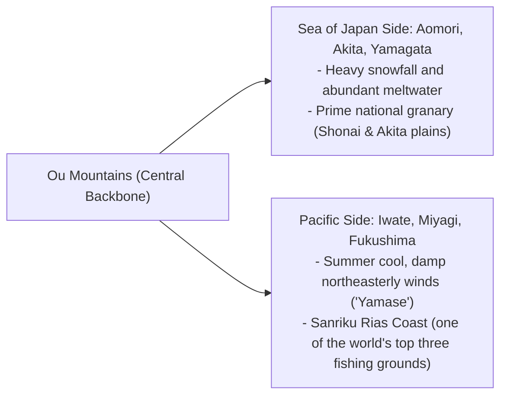
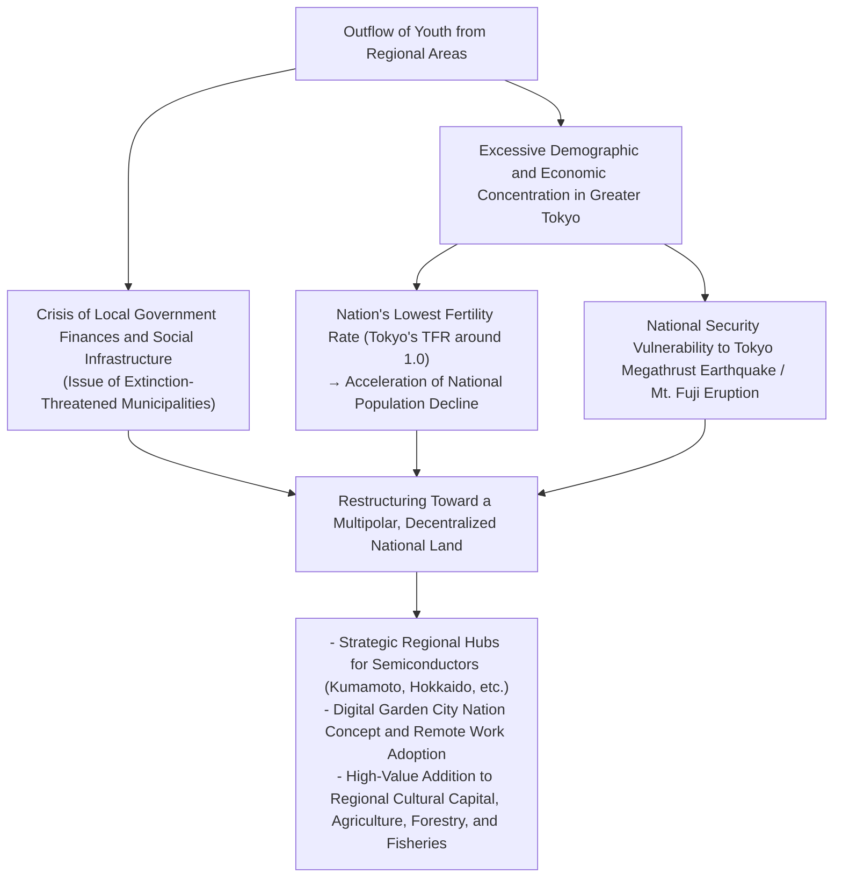
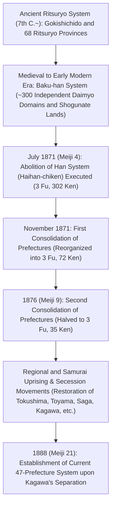

## Introduction: Diversity of the Japanese Archipelago and the Formation of the 47 Prefectures

Stretching in an arc over approximately 3,000 kilometers from north to south, the Japanese archipelago is one of the world's most rugged and mountainous island nations, sculpted by the intense tectonic activity of the Circum-Pacific Belt—the collision zone of four major tectonic plates: the Eurasian, North American, Pacific, and Philippine Sea plates.

With forested mountains covering roughly 70% of its land area, the archipelago is bifurcated by central spinal mountain ranges. This topography compresses an extraordinarily diverse spectrum of climatic zones into a compact territory: the "Sea of Japan Climate" characterized by heavy winter snowfall; the "Pacific Ocean Climate" featuring hot, humid summers and dry, sunny winters; the mild, low-precipitation "Seto Inland Sea Climate"; the "Central Highland Climate" marked by sharp diurnal and seasonal temperature variations; and the subtropical "Nansei Islands Climate."

```
[Climatic Classifications and Geophysical Mechanisms of the Japanese Archipelago]

┌────────────────────────┬────────────────────────────────┬────────────────────────────────────────┐
│ Climatic Region        │ Geographical Extent            │ Primary Climatic Features & Mechanisms │
├────────────────────────┼────────────────────────────────┼────────────────────────────────────────┤
│ Sea of Japan Climate   │ Sea of Japan side of Hokkaido  │ Winter northwesterly monsoons absorb   │
│                        │ to Hokuriku and San'in         │ moisture from the Tsushima Warm        │
│                        │                                │ Current, colliding with the central    │
│                        │                                │ spine mountain ranges to cause heavy   │
│                        │                                │ snowfall.                              │
├────────────────────────┼────────────────────────────────┼────────────────────────────────────────┤
│ Pacific Ocean Climate  │ Pacific coast to southern      │ Heavy rainfall and typhoons brought by │
│                        │ Kyushu                         │ southeasterly summer monsoons; dry,    │
│                        │                                │ sunny winter days with strong downdraft│
│                        │                                │ winds ("karakkaze").                   │
├────────────────────────┼────────────────────────────────┼────────────────────────────────────────┤
│ Seto Inland Sea        │ Basin enclosed between Chugoku │ Rain clouds blocked by mountains;      │
│ Climate (Setouchi)     │ and Shikoku mountains          │ warm, low precipitation, and abundant  │
│                        │                                │ sunshine throughout the year.          │
├────────────────────────┼────────────────────────────────┼────────────────────────────────────────┤
│ Central Highland       │ Nagano, Yamanashi, Hida        │ High elevation surrounded by           │
│ Climate                │ region of Gifu, etc.           │ mountains; extreme temperature swings  │
│                        │                                │ between day/night and summer/winter.   │
├────────────────────────┼────────────────────────────────┼────────────────────────────────────────┤
│ Nansei Islands Climate │ Okinawa Prefecture, Amami      │ Subtropical maritime climate influenced│
│ (Southwestern Islands) │ Islands, etc.                  │ by the Kuroshio Current; high heat and │
│                        │                                │ humidity year-round, frequent typhoon  │
│                        │                                │ strikes.                               │
└────────────────────────┴────────────────────────────────┴────────────────────────────────────────┘
```

Japan's regional division is historically rooted in the ancient Ritsuryo system's "Gokishichido" (the Five Capital Provinces and Seven Circuits: Kinai, Tokaido, Tosando, Hokurikudo, San'indo, Sanyodo, Nankaido, and Saikaido), which defined 68 "Ritsuryo provinces" (Ryoseikoku, commonly referred to as old provinces). Following the Meiji Restoration, the 1871 (Meiji 4) "Abolition of the Han System" (Haihan-chiken) initially created over 300 prefectures (fu and ken). Through waves of consolidation and division—culminating in the independence of Kagawa Prefecture in 1888 (Meiji 21)—the modern administrative framework of "1 To, 1 Do, 2 Fu, and 43 Ken" (47 prefectures) was permanently established.

This gazetteer comprehensively dissects all 47 prefectures across eight regional blocks (Hokkaido, Tohoku, Kanto, Chubu, Kinki, Chugoku, Shikoku, and Kyushu-Okinawa), exploring their historical provinces, topography, industrial architecture, history and cultural heritage, and contemporary 21st-century challenges surrounding regional revitalization and demographic shifts.

---

## 1. Hokkaido Region: Northern Frontier and Vast Primary Industries

### 1.1 Hokkaido (Former: Ezochi / 11 Provinces including Ishikari, Oshima, etc.)
- **Prefectural Capital (Dōcho Seat)**: Sapporo City
- **Area & Topography**: 83,424 km² (Ranked 1st nationally, accounting for roughly 22% of Japan's total land area). Anchored by the central spine of the Daisetsuzan volcanic group and Hidaka Mountains, vast plains and plateaus unfold across the island, including the Ishikari Plain, Tokachi Plain, and Konsen Plateau—among the largest in Japan. Falling within the subarctic zone, it experiences cool summers, severely cold winters, and extensive snow cover.
- **Industrial Structure & Economy**:
  - **Agriculture**: Japan's primary food basket. Dominated by upland dry-field farming (wheat, sugar beets, potatoes, adzuki beans) and large-scale dairy farming (producing over 50% of the nation's raw milk). The Tokachi Plain serves as the epicenter of mega-scale Western-style mechanized farming, averaging dozens of hectares per household.
  - **Fisheries**: Ranks 1st nationally in both wild catch volume and aquaculture output, harvesting sea scallops, salmon, Alaska pollock, and kelp (kombu).
  - **Tourism & Services**: The powder snow resorts of Niseko (a premier global hub for international inbound travelers), Shiretoko (UNESCO World Natural Heritage), Furano's lavender fields, and the Sapporo Snow Festival.
- **History & Culture**: Indigenous Ainu cultural heritage (commemorated at Upopoy - National Ainu Museum and Park). Modern developmental history led by the Kaitakushi (Development Commission) and Tondenhei (pioneer farmer-militia) during the Meiji era. Introduction of modern agrarian science and Christian philosophy through the Sapporo Agricultural College (notably Dr. William S. Clark).
- **Regional Challenges**: Rapid demographic decline paired with unipolar concentration in Sapporo, deficit operations and route maintenance dilemmas of JR Hokkaido, and high maintenance costs for extensive public infrastructure across vast distances.

---

## 2. Tohoku Region: Blessings of the Ou Mountains and Historical Heritage of Michinoku

Tohoku is longitudinally bisected by the Ou Mountains, creating stark contrasts in climate and lifestyle between the Sea of Japan side (heavy snowfall belt, premier rice granary) and the Pacific side (vulnerable to cold weather damage and the summer "Yamase" wind).



### 2.1 Aomori Prefecture (Former: Tsugaru, Mutsu)
- **Prefectural Capital**: Aomori City
- **Topography**: Northernmost point of Honshu. The Tsugaru and Shimokita peninsulas enclose Mutsu Bay, with the Hakkoda Mountains rising in the center and the Shirakami-Sanchi (UNESCO World Natural Heritage) towering in the west.
- **Industry**: Accounts for roughly 60% of national apple production (centered around Hirosaki City and the Tsugaru Plain). Scallop aquaculture in Mutsu Bay, premium Oma Pacific bluefin tuna, and major marine landings at Hachinohe Port. Advanced technological installations include the nuclear fuel cycle facilities in Rokkasho Village.
- **Culture & Heritage**: Aomori Nebuta Festival and Hirosaki Neputa Festival; Tsugaru-shamisen music; Tsugaru literature and arts fostered by figures like Osamu Dazai and Shiko Munakata. Jomon prehistoric sites (Sannai-Maruyama Site).

### 2.2 Iwate Prefecture (Former: Rikuchu, Rikuzen, Mutsu)
- **Prefectural Capital**: Morioka City
- **Topography**: Second largest prefecture in Japan after Hokkaido (15,275 km²). Comprises the Kitakami Basin along the Kitakami River, flanked by the Kitakami Highlands to the east and the rugged Sanriku Rias Coastline.
- **Industry**: Industrial clusters of semiconductor and automotive manufacturing in the Kitakami Basin (e.g., Kioxia). Abundant Sanriku marine harvests of wakame seaweed, abalone, salmon, and Pacific saury. Traditional craft heritage such as Nambu ironware (Nambu tekki).
- **Culture & Heritage**: Chuson-ji Konjikido in Hiraizumi (Pure Land Buddhist philosophy of the Northern Fujiwara clan, UNESCO World Cultural Heritage). Kenji Miyazawa's utopian philosophy of "Ihatov"; The Legends of Tono (Kunio Yanagita's folkloric masterpiece).

### 2.3 Miyagi Prefecture (Former: Rikuzen, Mutsu)
- **Prefectural Capital**: Sendai City (Tohoku's sole designated ordinance city)
- **Topography**: Fertile paddy fields of the Sendai Plain, Matsushima Bay (one of the Three Views of Japan), Oshika Peninsula, and Sendai Bay.
- **Industry**: Economic, political, and administrative hub of the Tohoku region. Major rice basket producing Sasanishiki and Hitomebore. Marine processing complexes at Ishinomaki and Kesennuma ports. Academic and advanced synchrotron radiation facility NanoTerasu anchored around Tohoku University.
- **Culture & Heritage**: Castle town culture of the 620,000-koku Sendai Domain founded by Date Masamune. Sendai Tanabata Festival.

### 2.4 Akita Prefecture (Former: Ugo, Dewa)
- **Prefectural Capital**: Akita City
- **Topography**: Akita Plain, Yokote Basin, Mount Chokai, and Lake Tazawa (Japan's deepest lake).
- **Industry**: Top-tier national granary famed for "Akitakomachi" rice. Akita cedar forestry. Hinai-jidori chicken and sandfish (hatahata). Recently emerging as a major national offshore wind power generation hub along the Sea of Japan coast.
- **Culture & Heritage**: Akita Kanto Festival; Namahage of Oga (UNESCO Intangible Cultural Heritage); Shirakami-Sanchi mountain range.

### 2.5 Yamagata Prefecture (Former: Uzen, Dewa)
- **Prefectural Capital**: Yamagata City
- **Topography**: Shonai Plain and the inland basins of Yonezawa, Yamagata, and Shinjo linked by the Mogami River. Dewa Sanzan (three sacred mountains: Gassan, Haguro, and Yudono) and the Zao mountain range.
- **Industry**: National fruit capital boasting over 70% share of cherries, alongside La France pears. Rice cultivation on the Shonai Plain (Tsuyahime). Premium Yonezawa beef. Precision electronic components and machinery manufacturing.
- **Culture & Heritage**: Shugendo ascetic mountain culture of Dewa Sanzan; Yamagata Hanagasa Festival; Taisho-era romantic nostalgic aesthetic of Ginzan Onsen.

### 2.6 Fukushima Prefecture (Former: Iwashiro, Iwaki)
- **Prefectural Capital**: Fukushima City
- **Topography**: Distinctly partitioned into three geographical zones: Aizu (mountainous, heavy snow, deep history), Nakadori (political and economic basin corridor), and Hamadori (temperate Pacific coastal strip).
- **Industry**: Peach and pear fruit orchards (Nakadori). Traditional Aizu lacquerware and sake brewing. Hamadori's "Fukushima Innovation Coast Framework" (Robot Test Field, next-generation hydrogen energy technology).
- **Culture & Heritage**: Samurai ethic of Aizuwakamatsu (Byakkotai warrior corps), Kitakata ramen, Soma Nomaoi (wild horse chase festival). Frontier of creative recovery and energy transition following the 2011 Great East Japan Earthquake and nuclear disaster.

---

## 3. Kanto Region: Concentration of Capital Functions and Multi-Tiered Industrial Clusters

Staged across the Kanto Plain—Japan's largest plain—the Kanto region organically integrates hyper-concentrated political, financial, academic, and logistics functions with sophisticated hinterland agriculture and coastal heavy industries.

```
[Functional Division of the Greater Tokyo Megalopolis]

- Tokyo Metropolis: Core national functions, global finance & legal services, advanced IT, cultural epicenter
- Kanagawa Prefecture: Keihin Industrial Zone, international trade port (Yokohama), cutting-edge R&D hubs, Shonan & Hakone tourism
- Saitama Prefecture: Inland transportation hub (Shinkansen & expressway networks), suburban agriculture, machinery & distribution centers
- Chiba Prefecture: Narita International Airport, Keiyo Seaside Industrial Complex, marine fisheries & suburban agriculture (peanuts, vegetables)
- Ibaraki Prefecture: Tsukuba Science City, Kashima Coastal Industrial Zone, Hitachi heavy electrical machinery, melons & lotus roots
- Tochigi Prefecture: North Kanto Industrial Region (inland automotive & precision machinery), Nikko Toshogu Shrine, strawberries (Tochiotome)
- Gunma Prefecture: Automotive industry anchored by SUBARU, hot spring resorts (Kusatsu, Ikaho), sericulture and silk heritage
```

### 3.1 Ibaraki Prefecture (Former: Hitachi)
- **Prefectural Capital**: Mito City
- **Industry**: Ranks 3rd nationally in agricultural output (melons, lotus roots, dried sweet potatoes / hoshi-imo). Tsukuba Science City hosts roughly one-third of Japan's national research institutions, serving as the country's paramount intellectual think tank. Heavy electrical and industrial machinery in Hitachi City; steel and chemical petrochemical complexes at Kashima Port.
- **Culture**: Mito School of the Mito-Tokugawa clan (ideological wellspring of the Sonnō Jōi movement); Kairaku-en Garden; Fukuroda Falls (one of Japan's Three Famous Waterfalls).

### 3.2 Tochigi Prefecture (Former: Shimotsuke)
- **Prefectural Capital**: Utsunomiya City
- **Industry**: Celebrated for over half a century as Japan's top strawberry producer (Tochiotome, Tochiaika). Inland industrial complexes around Utsunomiya and Oyama cities specializing in medical devices and transportation machinery. Pioneered next-generation urban transit with the launch of the Utsunomiya Light Rail Transit (LRT).
- **Culture**: UNESCO World Heritage Shrines and Temples of Nikko (Nikko Toshogu); Ashikaga Gakko (Japan's oldest comprehensive academic institute); Mashiko pottery (Mashiko-yaki).

### 3.3 Gunma Prefecture (Former: Kozuke)
- **Prefectural Capital**: Maebashi City
- **Industry**: Automotive and metal stamping manufacturing centered in Ota City, home base of SUBARU (formerly Nakajima Aircraft). Produces 90% of Japan's konjac yam (konnyaku). Renowned hot spring resorts including Kusatsu Onsen, Ikaho Onsen, and Minakami Onsen.
- **Culture**: Tomioka Silk Mill and Related Sites (UNESCO World Heritage). Cohesive prefectural identity fostered by the traditional card game Jomo Karuta.

### 3.4 Saitama Prefecture (Former: Greater part of Musashi)
- **Prefectural Capital**: Saitama City (Designated ordinance city)
- **Industry**: Ranks 5th in population nationally (~7.3 million). Omiya Station serves as East Japan's largest railway interchange. Top-tier national shipments of processed food products. Agricultural specialties include Fukaya green onions, Sayama tea, and Soka senbei (rice crackers).
- **Culture**: "Koedo" (Little Edo) historical warehouse district of Kawagoe; Chichibu Night Festival (UNESCO Intangible Cultural Heritage).

### 3.5 Chiba Prefecture (Former: Shimosa, Kazusa, Awa)
- **Prefectural Capital**: Chiba City (Designated ordinance city)
- **Industry**: Narita International Airport (gateway for Japan's international air cargo logistics). Petrochemical and steel mills across the Keiyo Seaside Industrial Zone. High-ranking agricultural output (spring onions, peanuts, spinach). Top marine catch at Choshi Port. Tokyo Disney Resort.
- **Culture**: Naritasan Shinsho-ji temple town; coastal surfing and marine resorts across the Boso Peninsula.

### 3.6 Tokyo Metropolis (Former: Musashi, Izu, Ogasawara)
- **Metropolitan Government Seat**: Shinjuku Ward
- **Topography**: Population of approximately 14 million (anchoring the world's most populous metropolitan area). Encompasses the 23 Special Wards, Tama region, Izu Islands, and the UNESCO World Natural Heritage Ogasawara Islands.
- **Industry**: Mammoth economic engine generating roughly 20% of Japan's total GDP. Global finance and trading houses in Marunouchi and Otemachi; IT and venture startups in Shibuya and Roppongi; pop and subculture in Akihabara; Haneda Airport (major domestic and international air hub).
- **Culture**: A leading global cultural metropolis where towering skyscrapers harmonize with timeless historical legacies such as the Edo Castle Tenshudai, Senso-ji Temple, and Meiji Jingu Shrine.

### 3.7 Kanagawa Prefecture (Former: Sagami, Southern Musashi)
- **Prefectural Capital**: Yokohama City (population ~3.77 million, Japan's largest municipality)
- **Industry**: Second most populous prefecture (~9.2 million). Core of the Keihin Industrial Zone (Nissan Motor, JFE Steel, etc.). Concentration of high-tech R&D facilities in Minato Mirai 21. High-tech, environmental, and advanced manufacturing in Kawasaki City.
- **Culture**: Ancient capital of the Kamakura Shogunate (samurai culture); cosmopolitan maritime port heritage of Yokohama; coastal beach culture of Shonan; hot spring and mountain resort of Hakone.

---

## 4. Chubu Region: Backbone of Japanese Monozukuri Manufacturing and Alpine Topography

Situated in central Honshu, the Chubu region comprises three distinct subregions: Hokuriku (Sea of Japan side), Central Highlands (inland), and Tokai (Pacific side), harboring Japan's mightiest industrial manufacturing corridor.

### 4.1 Niigata Prefecture (Former: Echigo, Sado)
- **Prefectural Capital**: Niigata City (Designated ordinance city)
- **Industry**: Thriving rice cultivation across the Echigo Plain fed by the Shinano and Agano rivers (No. 1 national harvest of Koshihikari rice). World-renowned Western metal tableware and forged cutlery manufacturing in Tsubame-Sanjo. Nishikigoi (ornamental koi carp) breeding. Production of domestic natural gas and crude oil.
- **Culture**: Sado Gold Mine (UNESCO World Heritage); Nagaoka Grand Fireworks Festival; Echigo-Tsumari Art Triennale.

### 4.2 Toyama Prefecture (Former: Etchu)
- **Prefectural Capital**: Toyama City
- **Industry**: Aluminum rolling, chemical, and biopharmaceutical manufacturing powered by abundant hydroelectricity from Hokuriku Electric Power. Pharmaceutical cluster inheriting the historical legacy of "Toyama's itinerant medicine peddlers." Toyama Bay's "natural fish reservoir" yielding firefly squid (hotaru-ika), white shrimp (shiro-ebi), and yellowtail (buri).
- **Culture**: Tateyama Mountain Range and Kurobe Dam (Tateyama Kurobe Alpine Route); UNESCO World Heritage Gassho-style historic villages of Gokayama.

### 4.3 Ishikawa Prefecture (Former: Kaga, Noto)
- **Prefectural Capital**: Kanazawa City
- **Industry**: High-value cultural tourism backed by the artistic capital of the Kaga Million Koku (Maeda Clan). Textile machinery and construction machinery (birthplace of Komatsu); advanced carbon fiber composite materials.
- **Culture**: Kenroku-en Garden; Kanazawa gold leaf (supplying 99% of the domestic market); Kutani porcelain (Kutani-yaki); Wajima lacquerware (Wajima-nuri). Creative post-disaster reconstruction following the Noto Peninsula Earthquake.

### 4.4 Fukui Prefecture (Former: Echizen, Wakasa)
- **Prefectural Capital**: Fukui City
- **Industry**: Produces 95% of Japan's domestic eyeglass frames (Sabae City). High-tech textiles and electronic components (e.g., Murata Manufacturing). Original birthplace of Koshihikari rice. Echizen crab fisheries. Nuclear power generating plants clustered in the Reinan district.
- **Culture**: Daihonzan Eihei-ji Temple (Dogen's historic Soto Zen monastery); Fukui Prefectural Dinosaur Museum; Tojinbo cliffs. Regularly tops national happiness rankings.

### 4.5 Yamanashi Prefecture (Former: Kai)
- **Prefectural Capital**: Kofu City
- **Industry**: Ranks 1st nationally in the production of grapes, peaches, and plums. Birthplace of Japanese wine (Katsunuma). Premier jewelry and gemstone polishing industry in Japan. Headquarters of FANUC (global giant in CNC systems and industrial robotics). Test track for the Linear Chuo Shinkansen (Maglev).
- **Culture**: Historical sites associated with Takeda Shingen; Fuji Five Lakes; Shosenkyo Gorge.

### 4.6 Nagano Prefecture (Former: Shinano)
- **Prefectural Capital**: Nagano City
- **Industry**: Alpine prefecture embracing the Japan Alps (Hida, Kiso, and Akaishi ranges). Precision machinery industry (Seiko Epson, etc., earning the moniker "Switzerland of the East"). Highland agriculture (iceberg lettuce, Chinese cabbage), apples. Consistently leads Japan in life expectancy and healthy longevity.
- **Culture**: Zenko-ji Temple; Matsumoto Castle (National Treasure keep); premier highland resorts of Kamikochi and Karuizawa.

### 4.7 Gifu Prefecture (Former: Mino, Hida)
- **Prefectural Capital**: Gifu City
- **Industry**: Cutlery in Seki City (one of the world's top three cutlery centers). Mino ceramic ware (producing over half of Japan's domestic pottery). Aerospace manufacturing in Kakamigahara City (Kawasaki Heavy Industries). Woodworking and furniture craftsmanship in Hida-Takayama.
- **Culture**: UNESCO World Heritage historic village of Shirakawa-go; preserved traditional merchant quarter of Hida-Takayama; cormorant fishing (ukai) on the Nagara River.

### 4.8 Shizuoka Prefecture (Former: Totomi, Suruga, Izu)
- **Prefectural Capital**: Shizuoka City (Designated ordinance city)
- **Industry**: Ranks among the top nationally in manufactured goods shipment value. Transportation machinery kingdom serving as the birthplace of Suzuki, Yamaha, and Honda. Leading producer of green tea in Japan. Global capital of plastic model kits (Tamiya, Bandai, etc.). Yaizu Port's bonitos and tunas.
- **Culture**: Mount Fuji (UNESCO World Heritage); hot spring resorts across the Izu Peninsula; retirement residence of Tokugawa Ieyasu (Sunpu Castle, Kunozan Toshogu Shrine).

### 4.9 Aichi Prefecture (Former: Owari, Mikawa)
- **Prefectural Capital**: Nagoya City (Designated ordinance city)
- **Industry**: Japan's unrivaled manufacturing empire, holding **first place nationally in manufactured goods shipments for over 40 consecutive years**. Headquarters of Toyota Motor Corporation and extensive tier-1/tier-2 supply chain networks. Aerospace industrial cluster (Mitsubishi Heavy Industries, etc.). Ceramics, specialty steel, and machine tools.
- **Culture**: Birthplace of Japan's "Three Great Unifiers" (Oda Nobunaga, Toyotomi Hideyoshi, and Tokugawa Ieyasu). Atsuta Jingu Shrine, Nagoya Castle. Unique Nagoya culinary cuisine ("Nagoya-meshi": miso katsu, hitsumabushi, spicy chicken tebasaki).

---

## 5. Kinki Region: The Thousand-Year Capital and the Multi-Tiered Kansai Economy

Centered on the historic Kinai district, which remained the political and cultural core of Japan from antiquity to the early modern era, the Kinki region maintains an exquisite balance among the merchant powerhouse of Osaka, the international port of Kobe, and the ancient imperial capitals of Kyoto and Nara.

```
[Functional Division and Historical Diversity of the Kinki (Kansai) Region]

- Osaka Prefecture: Commercial DNA, international finance, World Expos (1970/2025), life sciences, culinary culture ("Kuidaore")
- Kyoto Prefecture: Cultural capital of the thousand-year Heian capital, high-tech powerhouses (Nintendo, Kyocera, etc.), traditional crafts, world-class tourism
- Hyogo Prefecture: Maritime trade port (Kobe), Harima Coastal Industrial Zone, Nada sake brewing, agricultural and marine bounty of Tamba and Tajima
- Nara Prefecture: Cradle of the ancient Yamato state, Heijo-kyo, Horyu-ji & Todai-ji (treasury of Buddhist art)
- Shiga Prefecture: Lake Biwa (Japan's largest lake, water source for 14 million Kansai residents), Omi merchants, advanced inland manufacturing
- Mie Prefecture: Ise Jingu (pinnacle of Shinto), Suzuka Circuit, pearl aquaculture, Yokkaichi petrochemical complex
- Wakayama Prefecture: Koyasan & Kumano Sanzan (sacred sites and pilgrimage routes), Japan's top producer of mikan mandarins and umeboshi
```

### 5.1 Mie Prefecture (Former: Ise, Iga, Shima, Eastern Kii)
- **Prefectural Capital**: Tsu City
- **Industry**: Yokkaichi petrochemical industrial complex and advanced semiconductor fabrication. World-famous Matsusaka beef, Akoya pearl cultivation (Ago Bay), and Ise spiny lobster.
- **Culture**: Ise Jingu (Kotai Jingu / Geku and Naiku, the supreme sanctuary of Shinto); birthplace of Iga-ryu ninja; Kumano Kodo pilgrimage routes (Iseji route).

### 5.2 Shiga Prefecture (Former: Omi)
- **Prefectural Capital**: Otsu City
- **Industry**: Strategic transport junction encircling Lake Biwa. Advanced inland mother plants of corporations such as Toray and Panasonic. Shigaraki ware pottery (Shigaraki-yaki). Omi rice and Omi beef.
- **Culture**: Enryaku-ji Temple on Mount Hiei (mother mountain of Japanese Buddhism); Hikone Castle (National Treasure keep); Omi merchant philosophy of "Sanpo-yoshi" (good for the seller, good for the buyer, good for society).

### 5.3 Kyoto Prefecture (Former: Yamashiro, Tamba, Tango)
- **Prefectural Capital**: Kyoto City (Designated ordinance city)
- **Industry**: World-renowned cultural and tourism capital. Global headquarters of leading high-tech enterprises including Nintendo, OMRON, Kyocera, Shimadzu Corporation, and Nidec. Traditional Nishijin silk textiles, Kiyomizu pottery, and Uji green tea.
- **Culture**: Historic Monuments of Ancient Kyoto (17 UNESCO World Heritage shrines and temples); Gion Festival; Gozan no Okuribi (bonfire ritual).

### 5.4 Osaka Prefecture (Former: Eastern Settsu, Kawachi, Izumi)
- **Prefectural Capital**: Osaka City (Designated ordinance city)
- **Industry**: Largest economic hub in western Japan. Birthplace of general trading conglomerates (Itochu, Sumitomo), pharmaceutical and life sciences powerhouses (Takeda Pharmaceutical, etc.), and dense precision manufacturing clusters in Higashi-Osaka. Kansai International Airport (KIX).
- **Culture**: Osaka Castle, Dotonbori entertainment district, Kamigata rakugo, Bunraku puppet theater, Yoshimoto comedy culture, and street food cuisine based on wheat flour ("konamon": takoyaki, okonomiyaki). Mozu-Furuichi Kofun Group (Mausoleum of Emperor Nintoku, UNESCO World Heritage).

### 5.5 Hyogo Prefecture (Former: Western Settsu, Tamba, Tajima, Harima, Awaji)
- **Prefectural Capital**: Kobe City (Designated ordinance city)
- **Industry**: Global maritime logistics hub at the Port of Kobe. Heavy industries anchored by Kawasaki Heavy Industries and Kobe Steel. Harima Coastal Industrial Zone. Nada-Gogo sake brewing region (No. 1 sake producer nationally). Awaji Island sweet onions, world-famous Kobe beef.
- **Culture**: Himeji Castle (Japan's first UNESCO World Cultural Heritage site, the "White Heron Castle"); Arima Onsen; Kobe Foreign Settlement and Kitano Ijinkan (Western-style historical residences).

### 5.6 Nara Prefecture (Former: Yamato)
- **Prefectural Capital**: Nara City
- **Industry**: Cultural tourism, forestry of Yoshino cedar and cypress, top national producer of socks (Koryo Town area), traditional ink (sumi) and bamboo tea whisks (chasen).
- **Culture**: Historic Monuments of Ancient Nara (Todai-ji, Kofuku-ji, Kasuga Taisha); Buddhist Monuments in the Horyu-ji Area (world's oldest surviving wooden structures); cherry blossoms and Shugendo pilgrimage of Mount Yoshino.

### 5.7 Wakayama Prefecture (Former: Western Kii)
- **Prefectural Capital**: Wakayama City
- **Industry**: Top national producer of Unshu mikan mandarins, Nanko ume (pickled umeboshi), hassaku citrus, and Japanese sansho pepper. Nippon Steel's Wakayama Works.
- **Culture**: Sacred Sites and Pilgrimage Routes in the Kii Mountain Range (UNESCO World Heritage: Mount Koya Kongobu-ji, Kumano Sanzan); Shirahama Onsen.

---

## 6. Chugoku Region: Seto Inland Sea Industrial Complex and Mythological Heritage of San'in

Divided by the Chugoku Mountains, the Chugoku region forms a sharp contrast between "San'yo" (facing the Seto Inland Sea, characterized by heavy chemical industries and a mild, sunny climate) and "San'in" (facing the Sea of Japan, rich in ancient Shinto myths and pristine nature).

### 6.1 Tottori Prefecture (Former: Inaba, Hoki)
- **Prefectural Capital**: Tottori City
- **Topography & Industry**: Least populous prefecture in Japan (~540,000 residents). Dune agriculture on the Tottori Sand Dunes (scallions / rakkyo). Nijisseiki (20th Century) pears (No. 1 nationally). White spring onions; crab landings at Sakaiminato Port.
- **Culture**: Myth of the White Hare of Inaba; Misasa Onsen (high-concentration radioactive radon hot springs); Sanbutsu-ji Temple Nageiredo on Mount Mitoku (National Treasure).

### 6.2 Shimane Prefecture (Former: Izumo, Iwami, Oki)
- **Prefectural Capital**: Matsue City
- **Topography & Industry**: Izumo Plain, Lake Shinji (top national catch of freshwater basket clams / shijimi). Specialty steel (Yasuki Hagane / Hitachi Metals). Cyclamen and Delaware grape horticulture.
- **Culture**: Izumo Oyashiro (Izumo Taisha Grand Shrine, sacred epicenter of Japan's mythological "Kuniyuzuri" myth where gods gather); Iwami Ginzan Silver Mine (UNESCO World Heritage); Oki Islands UNESCO Global Geopark.

### 6.3 Okayama Prefecture (Former: Mimasaka, Bizen, Bitchu)
- **Prefectural Capital**: Okayama City (Designated ordinance city)
- **Industry**: Mizushima Coastal Industrial Zone (petrochemicals, steel manufacturing, automotive assembly). Luxury fruit empire renowned for white peaches and Muscat grapes. Kojima district is the celebrated birthplace of domestic Japanese denim jeans and school uniforms.
- **Culture**: Kurashiki Bikan Historical Quarter (preserved white-walled merchant storehouses); Koraku-en Garden (one of the Three Great Gardens of Japan); Bizen pottery (Bizen-yaki).

### 6.4 Hiroshima Prefecture (Former: Aki, Bingo)
- **Prefectural Capital**: Hiroshima City (Designated ordinance city)
- **Industry**: Largest commercial and industrial center in the Chugoku-Shikoku region. Automotive manufacturing centered on Mazda Motor Corporation, JFE Steel Fukuyama Works, shipbuilding in Kure and Onomichi. Oyster aquaculture (yielding over half of the national market). Top national producer of domestic lemons.
- **Culture**: Two UNESCO World Heritage sites: Itsukushima Shinto Shrine (Miyajima) and the Hiroshima Peace Memorial (Genbaku Dome). Global leadership in peace advocacy. Picturesque hillside slopes and literary legacy of Onomichi.

### 6.5 Yamaguchi Prefecture (Former: Suo, Nagato)
- **Prefectural Capital**: Yamaguchi City
- **Industry**: Shunan Petrochemical Complex along the Seto Inland Sea coast (petrochemical and inorganic chemical manufacturing). Chemicals, cement, and machinery by Ube Industries (Resonac/UBE). Port of Shimonoseki's tiger pufferfish (fugu) and monkfish (anko) markets.
- **Culture**: Hagi castle town and Shoka Sonjuku academy (UNESCO World Heritage, cradle of Meiji Restoration leaders). Kintaikyo Bridge, Akiyoshidai karst plateau and Akiyoshido cave, Tsunoshima Bridge.

---

## 7. Shikoku Region: Nankaido Heritage, Setouchi Manufacturing, and Pacific Fisheries

Bisected east-to-west by the Shikoku Mountains, Shikoku exhibits contrasting landscapes between the northern Seto Inland Sea side (Kagawa, Ehime) and the southern Pacific side (Kochi, Tokushima). The island is seamlessly integrated with Honshu via the Honshu-Shikoku Bridge Project (Onaruto Bridge, Seto-Ohashi Bridge, and Nishiseto Expressway / Shimanami Kaido).

### 7.1 Tokushima Prefecture (Former: Awa)
- **Prefectural Capital**: Tokushima City
- **Industry**: Sudachi citrus (over 90% national share), Naruto Kintoki sweet potatoes, and Awaodori free-range chicken. High-tech optoelectronic industrial cluster anchored by Nichia Corporation (global pioneer of blue LEDs and phosphors).
- **Culture**: 400-year-old tradition of the Awa Odori dance festival; Naruto whirlpools; secluded mountain wilderness of the Iya Valley (featuring historic vine bridges / Iya Kazurabashi).

### 7.2 Kagawa Prefecture (Former: Sanuki)
- **Prefectural Capital**: Takamatsu City
- **Industry**: Smallest prefecture by land area in Japan, yet possessing high population density. Celebrated worldwide for "Sanuki Udon," driving culinary tourism and cultural branding. Japan's top producer of olives (Shodoshima Island). Bannosu Coastal Industrial Zone.
- **Culture**: Kotohira-gu Shrine ("Konpira-san"); Ritsurin Garden (Special Place of Scenic Beauty); Setouchi Triennale (contemporary art festival staged across islands like Naoshima and Teshima).

### 7.3 Ehime Prefecture (Former: Iyo)
- **Prefectural Capital**: Matsuyama City
- **Industry**: Synonymous with Unshu mikan and specialty citrus cultivation. Imabari towels (a globally recognized brand of luxury textiles). Maritime shipping and shipbuilding powerhouse in Imabari (Japan's premier maritime cluster). Pulp, paper, and non-ferrous metal industries in Shikokuchuo and Niihama.
- **Culture**: Dogo Onsen Honkan (one of Japan's oldest hot springs); Matsuyama Castle; Shimanami Kaido international cycling route.

### 7.4 Kochi Prefecture (Former: Tosa)
- **Prefectural Capital**: Kochi City
- **Industry**: Forcing culture of eggplants utilizing the subtropical sunny climate; Japan's top producer of fresh ginger and Japanese ginger (myoga). Coastal pole-and-line bonito (skipjack tuna) fishing. Deep-sea water utilization industries.
- **Culture**: Spirit of the Freedom and People's Rights Movement fostered by figures like Sakamoto Ryoma; vibrant Yosakoi Festival; Katsurahama Beach; Shimanto River, revered as "Japan's last remaining pristine river."

---

## 8. Kyushu & Okinawa Region: Gateway to Asia and Southwestern Island Culture

Positioned closest to the East Asian continent, Kyushu has stood on the frontlines of foreign diplomacy and cultural exchange since the days of ancient Sakimori border guards and Kentoshi envoys to Tang China. Today, it experiences a dramatic revival of its semiconductor sector ("Silicon Island") alongside rich volcanic and marine tourism.

```
[Regional Dynamism and Industrial Characteristics of Kyushu and Okinawa]

- Fukuoka Prefecture: Economic hub of Kyushu, gateway to Asia, megacity adjacent to international airport, National Strategic Special Zone for IT & startups
- Saga Prefecture: Arita and Imari porcelain, Karatsu Kunchi, rice and cultivated nori seaweed (Ariake Sea) on the Saga Plains
- Nagasaki Prefecture: Nanban and Dejima trade history, Hidden Christian sites, shipbuilding, rich fisheries along rias coasts
- Kumamoto Prefecture: Semiconductor mega-cluster driven by TSMC (JASM) expansion, Mount Aso caldera, 100% groundwater-supplied metropolitan water
- Oita Prefecture: Top hot spring output in Japan ("Onsen Prefecture" - Beppu & Yufuin), geothermal power generation, Oita coastal industrial complex
- Miyazaki Prefecture: Abundant sunshine and warm climate (Miyazaki beef, ripe mangoes, green peppers), Hyuga-nada surfing
- Kagoshima Prefecture: Realm of Kurobuta pork, black cattle, sweet potatoes, and honkaku shochu; active volcano Sakurajima; World Natural Heritage Yakushima & Amami
- Okinawa Prefecture: Unique heritage of the Ryukyu Kingdom, Shuri Castle, Okinawa Churaumi Aquarium, subtropical marine resorts, military base economy and transition to self-sustaining growth
```

### 8.1 Fukuoka Prefecture (Former: Chikuzen, Chikugo, Buzen)
- **Prefectural Capital**: Fukuoka City (Designated ordinance city, population ~1.6 million)
- **Industry**: Primary economic nerve center of Kyushu. Kitakyushu Industrial Zone (historic birthplace of the state-run Yawata Steel Works, headquarters of Yaskawa Electric). Port of Hakata and Fukuoka Airport (exceptional urban transit located just 5 minutes by subway from downtown). Flourishing startup and IT hub. Amaou strawberries.
- **Culture**: Hakata Gion Yamakasa festival; Dazaifu Tenmangu Shrine (dedicated to Sugawara no Michizane); vibrant street food stall culture (yatai); Munakata Taisha (UNESCO World Heritage).

### 8.2 Saga Prefecture (Former: Eastern Hizen)
- **Prefectural Capital**: Saga City
- **Industry**: Arita and Imari porcelain (birthplace of Japanese porcelain). Cultivated nori seaweed in the Ariake Sea (leading national sales value for consecutive decades). Premium Saga beef. Genkai Nuclear Power Station.
- **Culture**: Yoshinogari Historical Park (sprawling Yayoi period moated settlement); Takeo Onsen; Karatsu Kunchi festival.

### 8.3 Nagasaki Prefecture (Former: Western Hizen, Iki, Tsushima)
- **Prefectural Capital**: Nagasaki City
- **Industry**: Historic shipbuilding legacy led by Mitsubishi Heavy Industries Nagasaki Shipyard. Extensive fisheries capitalizing on Japan's second-longest coastline (horse mackerel / aji, mackerel / saba). Top national producer of loquats (biwa).
- **Culture**: Hidden Christian Sites in the Nagasaki Region (UNESCO World Heritage); Sites of Japan's Meiji Industrial Revolution (Gunkanjima / Hashima Island); Huis Ten Bosch European theme resort.

### 8.4 Kumamoto Prefecture (Former: Higo)
- **Prefectural Capital**: Kumamoto City (Designated ordinance city)
- **Industry**: **Massive semiconductor investment wave sparked by the entry of TSMC (JASM) into Kikuyo Town**, positioning the prefecture as Japan's premier advanced semiconductor hub. Leading national producer of tomatoes and watermelons. Metropolitan drinking water supplied 100% by pure natural groundwater.
- **Culture**: Kumamoto Castle (impregnable stronghold designed by Kato Kiyomasa); one of the world's largest calderas at Mount Aso; Amakusa Five Bridges.

### 8.5 Oita Prefecture (Former: Bungo, Southern Buzen)
- **Prefectural Capital**: Oita City
- **Industry**: Known as the "Onsen Prefecture," boasting the highest number of hot spring sources and greatest water discharge volume in Japan (Beppu Onsen and Yufuin Onsen). Oita Coastal Industrial Zone (steelmaking, petrochemicals). Kabosu citrus (holding roughly 90% national market share). Premium dried shiitake mushrooms.
- **Culture**: Usa Jingu (head shrine of over 40,000 Hachiman shrines nationwide); Rokugo Manzan Buddhist-Shinto syncretic culture on the Kunisaki Peninsula.

### 8.6 Miyazaki Prefecture (Former: Hyuga)
- **Prefectural Capital**: Miyazaki City
- **Industry**: Favorable warm climate and abundant sunshine supporting Miyazaki beef (multiple Prime Minister's Award winner), tree-ripened mangoes ("Taiyo no Tamago"), broiler poultry, and pork production. Top national producer of raw cedar logs (sugi).
- **Culture**: Mythological cradle of the "Tenson Korin" (Descent of the Heavenly Grandson) at Takachiho Gorge (Takachiho Night Kagura); Aoshima Shrine; Udo Jingu.

### 8.7 Kagoshima Prefecture (Former: Satsuma, Osumi)
- **Prefectural Capital**: Kagoshima City
- **Industry**: Ranks 2nd nationally in total agricultural output. Premier producer of Kuroge Wagyu beef, Berkshire black pork (Kurobuta), sweet potatoes, farmed eel (unagi), and poultry. Honkaku authentic shochu distilling. Tanegashima Space Center (JAXA rocket launch complex).
- **Culture**: Kinko Bay overlooking active stratovolcano Sakurajima. Illustrious history as the Satsuma Domain during the Meiji Restoration (Saigo Takamori, Okubo Toshimichi). UNESCO World Natural Heritage sites (ancient Jomon Sugi of Yakushima, Amami Oshima).

### 8.8 Okinawa Prefecture (Former: Ryukyu Kingdom)
- **Prefectural Capital**: Naha City
- **Topography**: Southernmost and westernmost prefecture of Japan, comprising a subtropical archipelago including Miyako Island and the Yaeyama Islands (Ishigaki, Iriomote).
- **Industry**: Premier international marine resort tourism sector. Strategic attraction of ICT and call center industries. Sugarcane, indigenous Agu pork, bitter melon (goya), and distilled Awamori spirits. Navigating military base economies toward sustainable economic independence.
- **Culture**: Gusuku Sites and Related Properties of the Kingdom of Ryukyu (including Shurijo Castle Ruins, UNESCO World Heritage). Eisa folk dancing, sanshin music, Ryukyuan lacquerware, and Bingata stencil dyeing. Indigenous longevity and health philosophy based on food-medicine synergy.

---

## 9. 21st-Century Regional Challenges: Unipolar Concentration in Tokyo vs. Multipolar Decentralization

When synthesizing the geography and industrial structure of all 47 prefectures, the most profound structural dilemma facing contemporary Japan is the **extreme unipolar overconcentration in the Greater Tokyo Area versus rapid depopulation and rural decay across regional prefectures**.



### 9.1 Extinction-Threatened Municipalities and Limits of Infrastructure Sustainability
According to the landmark 2014 "Masuda Report" and subsequent assessments by the Population Strategy Council, more than 40% of Japanese municipalities are designated as "at risk of disappearance." The unrelenting exodus of young females toward the Tokyo metropolitan area leaves rural regions unable to sustain demographic replacement. In depopulated areas, school closures and consolidations, the termination of regional public bus and rail routes, and the escalating fiscal impossibility of rehabilitating aging social infrastructure (water supply, roads, bridges) pose existential crises.

### 9.2 Seeds of Regional Revival: Semiconductors and Renewable Green Transformation (GX)
Nevertheless, the 2020s have brought signs of a historic paradigm shift.
First, economic security mandates have prompted next-generation semiconductor mega-fabs to locate in regional hubs. Multi-trillion-yen investments in Kumamoto (TSMC / JASM) and Chitose, Hokkaido (Rapidus) are triggering massive backward-linkage inflows of supply chains, research institutions, and high-paying engineering employment into regional economies.
Second, within the global Green Transformation (GX) and decarbonization movement, regional territories blessed with vast physical space and natural resources—such as offshore wind farms along the Tohoku and Sea of Japan coasts, and solar, geothermal, and biomass capacities in Hokkaido and Kyushu—are being redefined as the nation's indispensable strategic energy production bases.

---

## 0. Historical Evolution of Administrative Divisions: From Ancient Provinces to Haihan-Chiken and the Great Prefectural Consolidations

The current administrative demarcation of the "47 Prefectures" was by no means self-evident from antiquity; rather, it is the hard-won historical product of relentless trial, error, and radical mergers during modern nation-state formation following the Meiji Restoration.



### 0.1 Political Dynamics of the Abolition of the Han System (1871)
For the fledgling Meiji government founded in 1868, the overriding priorities were establishing sovereign central authority and unifying military and fiscal powers. Although the Return of Land and People (Hanseki Hokan, 1869) designated former feudal daimyo as hereditary governors (chihanji), domains maintained private military forces (hanpei) and autonomous tax collection rights, leaving national cohesion perilously frail.

On July 14, 1871 (Meiji 4), key oligarchs Saigo Takamori, Okubo Toshimichi, and Kido Takayoshi—backed by imperial guard troops (Goshinpei) supplied by Satsuma, Choshu, and Tosa—executed a lightning administrative coup: the Abolition of the Han System (Haihan-chiken). Feudal domains were liquidated in an instant, domain lords were ordered to reside in Tokyo, and central government-appointed governors (chiji / kenrei) were dispatched to the provinces. This initial decree gave birth to "3 Fu and 302 Ken."

### 0.2 First and Second Mergers and the Earthquake of the "Prefecture Re-establishment Movements"
Because the initial 300+ prefectures were overly fragmented and fiscally precarious, the central government initiated swift consolidations.
In November 1871, the "First Prefectural Consolidation" streamlined territories into 3 Fu and 72 Ken. In 1876 (Meiji 9), the Home Ministry under Okubo Toshimichi drastically slashed administrative units to "3 Fu and 35 Ken."

This heavy-handed amalgamation triggered bitter regional resistance. For example, modern Kagawa was absorbed into Myoto Prefecture (Tokushima) and later Ehime; Toyama was merged into Ishikawa; Saga into Nagasaki; Miyazaki into Kagoshima; and Fukui divided between Ishikawa and Shiga.
Local castle town elites, wealthy landowners, and former samurai vehemently protested what they viewed as administrative tyranny that trampled historical identities, lamenting that tax revenues were funneled to central urban seats while provincial infrastructure languished. Merging with the surging Freedom and People's Rights Movement demanding an imperial parliament, fierce "prefecture restoration movements" (fukken undo) erupted across the nation.

Yielding to immense regional pressure, the central government granted re-separation: Fukui was restored in 1881; Toyama, Saga, and Miyazaki in 1883; and finally, Kagawa seceded from Ehime in December 1888 (Meiji 21), codifying the stable boundaries of "1 To, 1 Do, 2 Fu, and 43 Ken" that persist today.

---

## 8.9 Linguistic Landscape of the 47 Prefectures: Dialect Concentric Theory and the East-West Linguistic Divide

The kaleidoscopic diversity of the Japanese archipelago is nowhere more vividly illustrated than in the nuanced gradations of its regional dialects (hogen).

In his seminal 1930 philological treatise *Kagyuko* (Studies on Snail Dialects), folklorist and linguist Kunio Yanagita investigated the geographical distribution of dialectal words for "snail" across Japan. He demonstrated that historical waves of linguistic innovation radiated outward in concentric ripples from Kyoto—the ancient and medieval cultural epicenter—into distant peripheral regions, a model formalized as the **"Dialect Concentric Theory" (Hogen Shukken-ron)**.

```
[Structure of Dialect Concentric Circles in Yanagita Kunio's "Kagyuko"]

[Kyoto (Center)]: Denden-mushi (Early modern coinage)
  ↓ (Diffusing outward)
[Kinki Periphery, Hokuriku, Tokai]: Maimai (Muromachi period term)
  ↓
[Chubu, Kanto, Chugoku, Shikoku]: Katatsumuri (Heian period term)
  ↓
[Tohoku, Kyushu]: Tsuburi, Tsubu (Ancient archaic terms)
  ↓
[Both Ends of Honshu (Aomori Tsugaru, Kagoshima Satsuma)]: Namekuji, Name (Oldest stratum of archaic linguistic relics)
```

Furthermore, the Japanese language features a profound "East-West Linguistic Boundary" running roughly from Itoigawa in Niigata Prefecture to Lake Hamana and the Fuji River in Shizuoka Prefecture:
- **Eastern Japanese Dialects**: Assertive copula *da*, negative auxiliary *nai*, imperative form *-ro* (*okiro* / wake up), and Tokyo-type pitch accent.
- **Western Japanese Dialects**: Assertive copula *ja* or *ya*, negative auxiliary *-n* or *-hen*, imperative form *-yo* (*okiyo*), and Keihan-type (Kyoto-Osaka) pitch accent.

Moreover, phonetic characteristics such as the centralized vowel articulation of the "Zu-zu-ben" (Ura-Nippon dialects of Tohoku) or the distinct closed syllables and glottal stops of Satsuma-ben (traditionally utilized as an impenetrable cipher against shogunate spies and enemy scouts) constitute invaluable intangible cultural assets forged by geographic barriers of mountains, straits, and historical insularity.

---

## 9.3 Economic Geography of the 47 Prefectures: Industrial Clustering and Location Quotient (LQ)

To scientifically evaluate the comparative industrial advantages of each prefecture, economic geographers utilize the **Location Quotient (LQ)**. This metric quantifies the concentration of a specific industry within a target region relative to the national baseline:

$$LQ = \frac{e_i / e}{E_i / E}$$

Where $e_i$ is local employment (or shipment value) in industry $i$, $e$ is total local employment across all industries, $E_i$ is national employment in industry $i$, and $E$ is total national employment. An $LQ > 1.0$ indicates that the prefecture possesses a higher degree of industrial specialization than the national average.

```
[Prominent Regional Specialization Patterns across the 47 Prefectures]

1. Transportation Equipment Manufacturing (Automotive & Aerospace):
   - Ultra-high specialization: Aichi Prefecture (LQ ≈ 3.2), Gunma Prefecture (LQ ≈ 2.8), Shizuoka Prefecture (LQ ≈ 2.5), Hiroshima Prefecture (LQ ≈ 2.1)
   - Characteristics: Multi-tiered subcontracting pyramid crowned by mega-assembly manufacturers (Toyota, SUBARU, Suzuki, Mazda).

2. Electronic Components, Devices, & Semiconductor Manufacturing:
   - Ultra-high specialization: Yamagata Prefecture (LQ ≈ 2.9), Fukui Prefecture (LQ ≈ 2.7), Kumamoto Prefecture (LQ ≈ 2.6), Iwate Prefecture (LQ ≈ 2.4)
   - Characteristics: Inland "Silicon Road" and "Silicon Island" capitalizing on pure water, pristine air, and high-speed expressway logistics.

3. Primary Industries (Agriculture & Fisheries):
   - Ultra-high specialization: Aomori Prefecture, Hokkaido, Kagoshima Prefecture, Miyazaki Prefecture, Kochi Prefecture (LQ > 3.0)
   - Characteristics: National anchors of food security. Accelerating structural transformation through smart agriculture and sixth-sector industrialization (value-added integration).

4. International Finance, Information & Communications, and Professional Business Services:
   - Ultra-high specialization: Tokyo Metropolis (LQ ≈ 2.5), Osaka Prefecture (LQ ≈ 1.4)
   - Characteristics: Oligopolistic concentration of corporate headquarters, intellectual property management, and venture capital / startup investment.
```

Japan's macroeconomic engine is not propelled by a single monolith; rather, it functions through the precise synchronization of three interlocking dynamos: the "Monozukuri Engine" anchored in Aichi and the Tokai manufacturing belt, the "Financial, Information, and Headquarters Engine" centered in Tokyo, and the indispensable "Food Security, Environmental, and Semiconductor Foundation Engine" sustained across the regional prefectures.

---

## 0.3 Political History of Discrepancies Between Prefectural and Capital Names: Debunking the Meiji "Rebel Domain Punishment Theory"

A perennial curiosity when examining Japan's 47 prefectures is why certain prefectures share identical names with their capital cities (e.g., Akita City in Akita Prefecture, Niigata City in Niigata Prefecture, Hiroshima City in Hiroshima Prefecture), whereas others display complete discrepancies (e.g., Morioka City in Iwate Prefecture, Sendai City in Miyagi Prefecture, Mito City in Ibaraki Prefecture, Utsunomiya City in Tochigi Prefecture, Maebashi City in Gunma Prefecture, Kanazawa City in Ishikawa Prefecture, Tsu City in Mie Prefecture, Otsu City in Shiga Prefecture, Kobe City in Hyogo Prefecture, Matsue City in Shimane Prefecture, Matsuyama City in Ehime Prefecture, Naha City in Okinawa Prefecture).

For decades, a pervasive popular myth suggested that domains that sided with the Tokugawa Shogunate or rebelled against imperial forces during the Boshin War (the "rebel domains" or *zokugun*) were punitive targets denied the prestige of naming their prefecture after their historic castle towns, forced instead to adopt obscure county names ("Punishment Theory"). Aizu (Wakamatsu), Sendai, Morioka, Maebashi, and Mito are frequently cited in popular folklore as alleged victims of imperial retribution.

However, modern archival historiography and administrative history have thoroughly debunked this "rebel punishment hypothesis." When determining prefectural designations, the Meiji government acted not out of petty political vengeance, but in strict accordance with pragmatic administrative logic.

```
[Practical Administrative Logic for Naming Prefectures in the Early Meiji Era]

1. Departure from Feudal Castle Town Centralism and the "County Name" (Gun) Adoption Principle:
   To dismantle the daimyo hegemony of the former feudal clans and erase the lingering authority of early modern feudal lords, the new Meiji government adopted the fundamental principle of naming prefectures not after the castle town where the government office was situated, but after the ancient county (gun, an administrative division dating back to the Ritsuryo system) to which the city belonged:
   - Morioka Castle Town (Iwate District/County) → Iwate Prefecture
   - Sendai Castle Town (Miyagi District/County) → Miyagi Prefecture
   - Mito Castle Town (Ibaraki District/County) → Ibaraki Prefecture
   - Kanazawa Castle Town (Ishikawa District/County) → Ishikawa Prefecture
   - Matsue Castle Town (Shimane District/County) → Shimane Prefecture
   - Matsuyama Castle Town (Onsen District / Mythological name of Ehime) → Ehime Prefecture

2. Accommodation for Treaty Ports and Newly Established Strategic Hubs:
   Cases where prefectural capitals were established not in old castle towns, but in newly emerged port cities and commercial hubs rapidly expanding due to foreign trade:
   - Hyogo (administering the treaty port of Kobe as direct territory) → Hyogo Prefecture (capital in Kobe)
   - Yokohama (Kanagawa-juku post town and foreign treaty port) → Kanagawa Prefecture (capital in Yokohama)

3. Legacies of Repeated Capital Relocations and Mergers:
   - Tochigi Prefecture: The prefectural capital was originally located in Tochigi Town (Tsuga County) before moving to Utsunomiya, yet the original prefectural name was retained.
   - Gunma Prefecture: After administrative offices shifted back and forth between Takasaki and Maebashi, the name Gunma was retained from Gunma County (Takasaki).
```

Thus, the divergence between prefectural and capital names represents the living administrative scars of Meiji state-building—a conscious campaign to dismantle the private feudal realms (*han*) of the samurai aristocracy and replace them with universal, centralized civic authority across the archipelago.

---

## 8.10 Japanese Archipelago Terroir Theory: Regional Food Culture and Fermentation Science Shaped by Natural Endowments

The regional distinctiveness of the 47 prefectures is expressed with unparalleled richness through their traditional cuisines and sophisticated fermentation systems (sake, miso, soy sauce, tsukemono pickles), each rooted in local microclimates and landforms. The concept of *terroir*—the holistic confluence of soil, climate, topography, and human heritage celebrated in French viticulture—is embodied with absolute purity in Japanese foodways.

```
[Matrix of Climate, Terroir, Fermentation, and Food Culture Across Japan]

┌──────────────────────┬──────────────────────────────────────────┬──────────────────────────────────────────────┐
│ Region / Terroir     │ Representative Prefectures & Culinary    │ Climatic & Microbial Ecological Mechanisms   │
│ Typology             │ Traditions                               │                                              │
├──────────────────────┼──────────────────────────────────────────┼──────────────────────────────────────────────┤
│ Cold & Heavy         │ Akita (Shottsuru, Iburigakko)            │ High-salt and long-term fermentation         │
│ Snowfall Zone        │ Yamagata (Imoni, Natto soup)             │ techniques to survive harsh winters.         │
│ (Preserved foods     │ Niigata (Hegi soba, fermented            │ Low-temperature aging utilizing "yukimuro"   │
│ & fermentation)      │ seasonings)                              │ (snow storehouses).                          │
├──────────────────────┼──────────────────────────────────────────┼──────────────────────────────────────────────┤
│ Setouchi Arid Zone   │ Kagawa (Sanuki udon), Hiroshima (Oysters,│ Terraced farming of wheat and soybeans       │
│ (Dried goods         │ lemons), Ehime (Tai meshi / sea bream    │ unsuited for wet rice paddies. Logistics     │
│ & brewing)           │ rice), Okayama (Orchard fruits,          │ hub for Ako salt and Shodoshima soy sauce    │
│                      │ Bara-zushi)                              │ brewing.                                     │
├──────────────────────┼──────────────────────────────────────────┼──────────────────────────────────────────────┤
│ Inland Mountainous & │ Nagano (Shinshu soba, Oyaki,             │ Securing vital protein sources in mountain   │
│ Basin Zone           │ Entomophagy / insect cuisine), Yamanashi │ environments isolated from the sea. Freeze-  │
│ (Dried foods &       │ (Hoto, Koshu chicken torimotsu-ni), Gifu │ dried tofu and agar-agar production utilizing│
│ protein storage)     │ (Hoba miso)                             │ extreme diurnal temperature swings.          │
├──────────────────────┼──────────────────────────────────────────┼──────────────────────────────────────────────┤
│ Southwestern Islands │ Okinawa (Pork cuisine, Awamori, Tofuyo)  │ Utilization of black koji mold (citric acid  │
│ & Kuroshio Zone      │ Kagoshima (Kurobuta pork, black vinegar, │ generation) to avoid spoilage risks in high  │
│ (Pork, fats, oils,   │ Honkaku shochu)                          │ heat and humidity, alongside heavy reliance  │
│ & vinegar)           │ Kochi (Bonito tataki, Sawachi cuisine)   │ on fats, oils, and brewed vinegars.          │
└──────────────────────┴──────────────────────────────────────────┴──────────────────────────────────────────────┘
```

For instance, the fame of Kagawa Prefecture's "Sanuki Udon" did not arise from an arbitrary cultural fondness for noodles. Shielded from southern moisture by the Median Tectonic Line and Shikoku Mountains, the Sanuki Plain is one of Japan's most arid regions. Plagued by perennial droughts, local agrarian communities cultivated drought-tolerant wheat as an off-season secondary crop to paddy rice. Furthermore, intense Setouchi sunshine and shallow tidal flats yielded high-grade sea salt via solar evaporation salt pans; the mild Mediterranean-like climate of Shodoshima Island nurtured barrel soy sauce brewing; and the calm surrounding waters of Ibuki Island supplied abundant catches of Japanese anchovies for dried *iriko* (niboshi) dashi broth. Sanuki udon was thus the inevitable, geoclimatic masterpiece of the Seto Inland Sea.

Similarly, the culinary culture of Okinawa Prefecture diverges radically from Honshu's ethos of delicate dashi broths and minimalist raw ingredients. Flourishing as an entrepôt trading hub connecting China, Japan, and Southeast Asia (the "Bankoku Shinryo" / Bridge of Ten Thousand Nations era), the Ryukyu Kingdom established a nose-to-tail porcine gastronomy—often described as "eating every part of the pig except its squeal" (rafute braised belly, mimigar pig ears, nakami-jiru offal soup). To combat subtropical decomposition without refrigeration, Ryukyuan distillers utilized black koji mold (*Aspergillus luchuensis*), whose robust production of citric acid protected mash fermentations from bacterial spoiling, yielding distilled Awamori spirits. The indigenous philosophy of *kusuimun* ("food as medicine" or *nuchigusui*, the medicine of life) was a sophisticated biological science of survival engineered for an unforgiving island ecosystem.

## 10. Conclusion: Diversity as Japan's Ultimate National Strength

A journey through Japan's 47 prefectures reveals that the nation's true resilience does not reside in the single hyper-concentrated megalopolis of Tokyo. Rather, it is anchored in the **astounding mosaic of diversity woven across 47 entirely distinct climates, landscapes, industrial ecosystems, and historical cultures**.

The quiet perseverance forged in Tsugaru's brutal blizzards; the relentless perfectionism of Owari and Mikawa craftsmanship; the luminous maritime culture nurtured beneath Setouchi skies; the vibrant folk performance arts birthed by the common people of Awa and Tosa; and the deep spiritual worldview resonating across the coral seas of the Ryukyus—all represent the distilled wisdom of ancestors who adapted to, struggled with, and celebrated their natural environments over centuries and millennia.

Amidst the homogenizing pressures of globalism, the imperative for Japan's regional communities is to take pride in their unique terroir and history, projecting distinctive values onto the world stage. When all 47 stars radiate their intrinsic brilliance, illuminating one another like a vast constellation, the Japanese archipelago will secure genuine prosperity and enduring sustainability for generations to come.
