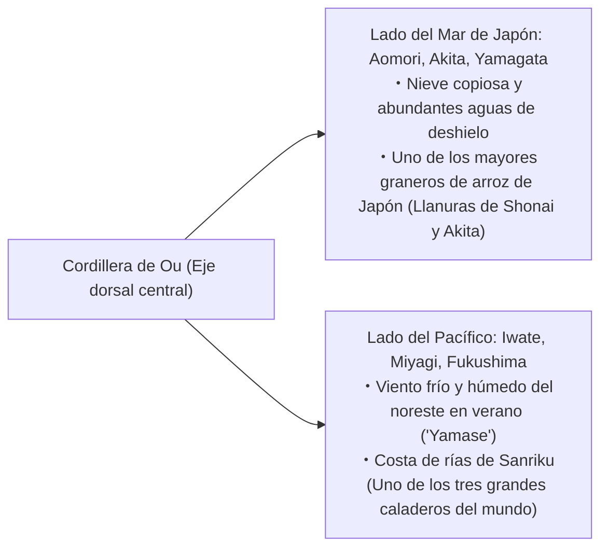
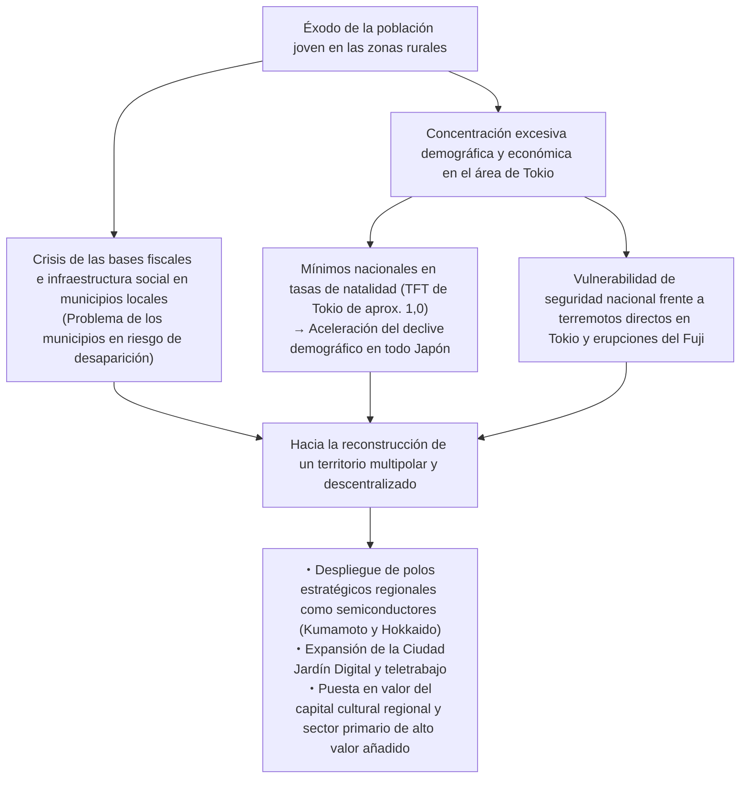
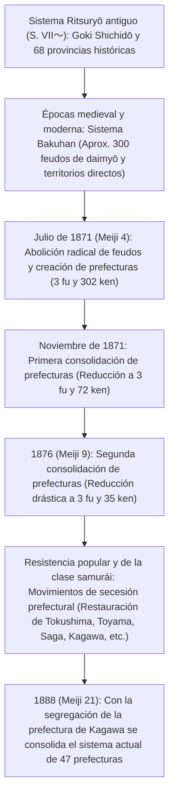

## Introducción: La diversidad del archipiélago japonés y la historia formativa de las 47 prefecturas

El archipiélago japonés, que se extiende a lo largo de un arco de aproximadamente 3.000 kilómetros de norte a sur, es un país insular sumamente escarpado y montañoso, formado por una intensa actividad tectónica dentro del Cinturón de Fuego del Pacífico (como resultado de la colisión de cuatro placas tectónicas: la placa euroasiática, la placa norteamericana, la placa del Pacífico y la placa del mar de Filipinas).

Cerca del 70% del territorio nacional está cubierto por bosques montañosos. Con la cordillera dorsal que atraviesa el centro como divisoria natural, en un territorio estrecho se concentran entornos climáticos extraordinariamente diversos: el "clima del lado del Mar de Japón", caracterizado por copiosas nevadas en invierno; el "clima del lado del Pacífico", caluroso y húmedo en verano con inviernos soleados y secos; el templado y seco "clima del Mar Interior de Seto"; el "clima de las Tierras Altas Centrales", con marcadas oscilaciones térmicas; y el "clima de las Islas del Suroeste", de naturaleza subtropical.

```
【Clasificación climática y mecanismos orográficos del archipiélago japonés】

┌──────────────────┬───────────────────────────────┬──────────────────────────────────────────┐
│ Clasificación    │ Extensión geográfica          │ Características climáticas y mecanismos  │
├──────────────────┼───────────────────────────────┼──────────────────────────────────────────┤
│ Clima del Mar    │ Lado del Mar de Japón desde   │ Los vientos monzónicos del noroeste en   │
│ de Japón         │ Hokkaido hasta Hokuriku y     │ invierno absorben humedad de la corriente│
│                  │ San'in                        │ cálida de Tsushima y chocan contra la    │
│                  │                               │ cordillera dorsal, provocando gran nieve.│
├──────────────────┼───────────────────────────────┼──────────────────────────────────────────┤
│ Clima del        │ Litoral del Pacífico hasta el │ Precipitaciones estivales por el monzón  │
│ Pacífico         │ sur de Kyushu                 │ del sureste y tifones. En invierno pre-  │
│                  │                               │ valecen días despejados y secos          │
│                  │                               │ (viento seco "karakkaze").               │
├──────────────────┼───────────────────────────────┼──────────────────────────────────────────┤
│ Clima del Mar    │ Zona flanqueada por las       │ Las montañas bloquean las nubes de       │
│ Interior de Seto │ cordilleras de Chugoku y      │ lluvia; clima templado y escasa pluviosi-│
│                  │ Shikoku                       │ dad con prolongadas horas de insolación. │
├──────────────────┼───────────────────────────────┼──────────────────────────────────────────┤
│ Clima de las     │ Prefecturas de Nagano,        │ Elevada altitud rodeada de montañas;     │
│ Tierras Altas    │ Yamanashi, comarca de Hida en │ extremas diferencias térmicas entre el   │
│ Centrales        │ Gifu, etc.                    │ día y la noche, y entre verano e invierno│
├──────────────────┼───────────────────────────────┼──────────────────────────────────────────┤
│ Clima de las     │ Prefectura de Okinawa,        │ Clima subtropical oceánico bajo la       │
│ Islas del        │ archipiélago de Amami, etc.   │ influencia de la corriente de Kuroshio.  │
│ Suroeste         │                               │ Elevada temperatura y humedad todo el    │
│                  │                               │ año; zona de paso habitual de tifones.   │
└──────────────────┴───────────────────────────────┴──────────────────────────────────────────┘
```

La división regional de Japón tiene su fundamento histórico en las 68 "provincias del sistema Ritsuryō" (令制国, *ryōseikoku*), articuladas bajo el sistema clásico de "cinco provincias metropolitanas y siete circuitos" (五畿七道, *Goki Shichidō*: Kinai, Tōkaidō, Tōsandō, Hokurikudō, San'indō, San'yōdō, Nankaidō y Saikaidō). Inmediatamente después de la Restauración Meiji, la "abolición de los feudos y establecimiento de prefecturas" (廃藩置県, *Haihan Chiken*) de 1871 creó inicialmente más de 300 prefecturas urbanas y rurales (*fu* y *ken*). Tras sucesivos procesos de consolidación y reestructuración, la arquitectura actual de "1 metrópolis (*to*), 1 circuito (*dō*), 2 prefecturas urbanas (*fu*) y 43 prefecturas regulares (*ken*)" (1都1道2府43県, totalizando 47 prefecturas) se fijó definitivamente en 1888 con la independencia de la prefectura de Kagawa.

En este estudio se dividen las 47 prefecturas en ocho grandes bloques regionales (Hokkaido, Tohoku, Kanto, Chubu, Kinki, Chugoku, Shikoku, y Kyushu y Okinawa), analizando exhaustivamente para cada una sus antiguas provincias históricas, topografía, estructura productiva, historia, cultura y los desafíos contemporáneos de revitalización regional y dinámicas demográficas en el siglo XXI.

---

## 1. Región de Hokkaido: La frontera septentrional y el vasto sector primario

### 1.1 Hokkaido (Antigua: Tierra de Ezo [Ezochi] / 11 provincias históricas, incluidas Ishikari y Oshima)
- **Capital prefectural**: Ciudad de Sapporo
- **Superficie y topografía**: 83.424 km² (1.ª a nivel nacional, abarca aproximadamente el 22% de la superficie total de Japón). Vertebrada por las cordilleras de Daisetsuzan e Hidaka, alberga las mayores llanuras y mesetas del país, tales como la llanura de Ishikari, la llanura de Tokachi y la meseta de Konsen. Pertenece a la zona climática subártica, caracterizada por veranos frescos e inviernos de frío polar con densas capas de nieve en amplias regiones.
- **Estructura productiva y económica**:
  - **Agricultura**: La despensa y base alimentaria primordial de Japón. Cultivos extensivos de secano (trigo, remolacha azucarera, patatas/papas, judías azuki) y ganadería lechera a gran escala (produce más del 50% de la leche cruda de Japón). En la llanura de Tokachi predomina una agricultura mecanizada ultramoderna al estilo occidental, con explotaciones de decenas de hectáreas por unidad familiar.
  - **Pesca y acuicultura**: Ocupa el primer lugar nacional tanto en volumen de capturas pesqueras como en producción acuícola, destacando vieiras (*hotate*), salmón, abadejo de Alaska y alga *kombu*.
  - **Turismo y servicios**: Centros turísticos de nieve en polvo de reputación mundial en Niseko (con una intensa atracción de turismo receptivo internacional), la península de Shiretoko (Patrimonio Natural de la Humanidad por la UNESCO), los campos de lavanda de Furano y el célebre Festival de la Nieve de Sapporo (*Sapporo Snow Festival*).
- **Historia y cultura**: Cultura tradicional del pueblo originario Ainu (inauguración del espacio simbólico para la convivencia étnica Upopoy). Epopeya colonizadora de la era Meiji a través de la Comisión de Colonización (*Kaitakushi*) y los soldados-colonos agrícolas (*Tondenhei*). Difusión de la agronomía moderna y la ética humanista de raíz cristiana a través del Colegio Agrícola de Sapporo (encabezado por el célebre Dr. William S. Clark).
- **Desafíos regionales**: Acelerado declive demográfico y excesiva centralización unipolar en Sapporo, problemas de sostenibilidad de las deficitarias líneas ferroviarias de JR Hokkaido y elevados costes de mantenimiento de infraestructuras en un territorio tan extenso.

---

## 2. Región de Tohoku: Los dones de la cordillera de Ou y la idiosincrasia histórica de Michinoku

La región de Tohoku presenta dos realidades climáticas y culturales fuertemente contrastadas debido a la cordillera de Ou, que la atraviesa longitudinalmente de norte a sur: la vertiente del Mar de Japón (zona de copiosas nevadas y granero arrocero) y la vertiente del Pacífico (expuesta a olas de frío estival por el viento *yamase*).



### 2.1 Prefectura de Aomori (Antigua: Tsugaru y Mutsu)
- **Capital prefectural**: Ciudad de Aomori
- **Topografía**: El extremo norte de la isla de Honshu. Las penínsulas de Tsugaru y Shimokita flanquean la bahía de Mutsu; en el centro se eleva el macizo de Hakkoda y al oeste los bosques primarios de Shirakami Sanchi (Patrimonio Natural de la Humanidad).
- **Industria**: Aporta cerca del 60% de la producción nacional de manzanas (Hirosaki y la llanura de Tsugaru). Acuicultura de vieiras en la bahía de Mutsu, atún de Oma de cotización astronómica y las capturas del puerto de Hachinohe. En áreas tecnológicas de vanguardia, alberga las instalaciones del ciclo del combustible nuclear en la aldea de Rokkasho.
- **Cultura e idiosincrasia**: Los festivales monumentales de Aomori Nebuta y Hirosaki Neputa, el sonido tradicional del Tsugaru shamisen, la prolífica corriente cultural que vio nacer a literatos y artistas como Osamu Dazai y Shiko Munakata. Complejos arqueológicos del período Jomon (asentamiento de Sannai-Maruyama).

### 2.2 Prefectura de Iwate (Antigua: Rikuchu, Rikuzen y Mutsu)
- **Capital prefectural**: Ciudad de Morioka
- **Topografía**: La segunda mayor prefectura de Japón en superficie después de Hokkaido (15.275 km²). La cuenca de Kitakami a lo largo del río homónimo, las tierras altas orientales de Kitakami y la imponente costa de rías de Sanriku.
- **Industria**: Fuerte concentración de manufactura de semiconductores y componentes de automoción en la cuenca de Kitakami (Kioxia y empresas afines). Explotación marina de alga *wakame*, abulón (*awabi*), salmón y paparda del Pacífico (*sanma*) en Sanriku. Artesanía tradicional de renombre como el hierro fundido de Nambu (*Nambu Tekki*).
- **Cultura e idiosincrasia**: El Pabellón Dorado Konjikido del templo Chuson-ji en Hiraizumi (expresión del budismo de la Tierra Pura erigido por el clan Oshu Fujiwara, Patrimonio Cultural de la Humanidad). La cosmovisión literaria de "Ihatov" de Kenji Miyazawa y *Los cuentos de Tono* (*Tono Monogatari* de Kunio Yanagita, cuna de los estudios folclóricos en Japón).

### 2.3 Prefectura de Miyagi (Antigua: Rikuzen y Mutsu)
- **Capital prefectural**: Ciudad de Sendai (la única ciudad designada por decreto gubernamental en Tohoku)
- **Topografía**: La fértil llanura arrocera de Sendai, la bahía de Matsushima (una de las Tres Vistas Célebres de Japón, *Nihon Sankei*), la península de Oshika y el litoral abierto de la bahía de Sendai.
- **Industria**: Centro administrativo, financiero y comercial de Tohoku. Arroces de reputación nacional como Sasanishiki e Hitomebore. Procesamiento de conservas y productos del mar en los puertos de Ishinomaki y Kesennuma. Destacada concentración académica y científica articulada por la Universidad de Tohoku e infraestructuras de última generación como NanoTerasu (fuente de luz sincrotrón de radiación de nueva generación).
- **Cultura e idiosincrasia**: El legado señorial y la cultura samurái del feudo de Sendai de 620.000 *koku*, fundado por Date Masamune. El fastuoso Festival de Tanabata de Sendai.

### 2.4 Prefectura de Akita (Antigua: Ugo y Dewa)
- **Capital prefectural**: Ciudad de Akita
- **Topografía**: La llanura de Akita, la cuenca interior de Yokote, el volcán Chokai y el lago Tazawa (el más profundo de Japón).
- **Industria**: Una de las mayores potencias arroceras del país, cuna de la prestigiosa variedad "Akitakomachi". Silvicultura del cedro de Akita (*Akita sugi*). Aves de corral selectas Hinai-jidori y pez *hatahata* (pez de arena japonés). En tiempos recientes atrae inversiones estratégicas como polo neurálgico de energía eólica marina en el litoral del Mar de Japón.
- **Cultura e idiosincrasia**: El Festival Akita Kanto (con equilibrismo de enormes varas con linternas), el ritual sagrado de los Namahage de Oga (Patrimonio Cultural Inmaterial de la UNESCO) y las estribaciones vírgenes de Shirakami Sanchi.

### 2.5 Prefectura de Yamagata (Antigua: Uzen y Dewa)
- **Capital prefectural**: Ciudad de Yamagata
- **Topografía**: La extensa llanura de Shonai y las cuencas interiores de Yonezawa, Yamagata y Shinjo, enlazadas por el cauce del río Mogami. Las Tres Montañas Sagradas de Dewa (Dewa Sanzan: Gassan, Hagurosan y Yudonosan) y la cordillera volcánica de Zao.
- **Industria**: Conocida como el "reino de las frutas", concentra más del 70% de la cuota nacional de cerezas selectas y destaca en peras La France. Arroz de primera calidad en la llanura de Shonai (variedad Tsuyahime). Carne de vacuno Wagyu de Yonezawa. Manufactura de componentes electrónicos y maquinaria de precisión.
- **Cultura e idiosincrasia**: Espiritualidad ascética del Shugendo en Dewa Sanzan, el animado Festival Yamagata Hanagasa y las termas de Ginzan Onsen con su evocadora arquitectura de madera de la era Taisho.

### 2.6 Prefectura de Fukushima (Antigua: Iwashiro e Iwaki)
- **Capital prefectural**: Ciudad de Fukushima
- **Topografía**: Claramente dividida en tres subregiones con identidad propia: Aizu (entorno montañoso, copiosas nevadas y rica herencia samurái), Nakadori (eje político, económico y cuencas fluviales) y Hamadori (franja litoral del Pacífico, de clima templado).
- **Industria**: Fruticultura intensiva de melocotones/duraznos y peras en Nakadori. Lacas tradicionales de Aizu (*Aizu-nuri*) y reputadas bodegas de sake. En Hamadori se despliega la "Iniciativa de la Costa de Innovación de Fukushima" (*Fukushima Innovation Coast Framework*: instalaciones de ensayo de robótica, tecnologías avanzadas de hidrógeno y energías renovables).
- **Cultura e idiosincrasia**: El espíritu marcial y trágico del Byakkotai (Cuerpo del Tigre Blanco) en Aizuwakamatsu, el célebre ramen de Kitakata y las carreras ecuestres samuráis del Soma Nomaoi. Territorio pionero en la recuperación tras el Gran Terremoto del Este de Japón y el desastre nuclear, hoy a la vanguardia de la transición energética.

---

## 3. Región de Kanto: Concentración de funciones metropolitanas y densos conglomerados industriales

Asentada sobre la llanura de Kanto —la más extensa de Japón—, la región combina una hiperconcentración de las funciones políticas, financieras, académicas y logísticas con una agricultura periurbana altamente tecnificada y una imponente franja industrial costera.

```
【Estructura de distribución funcional de la megalópolis de la Región Capital】

・Tokio: Funciones neurálgicas del Estado, finanzas globales y servicios corporativos, TI de vanguardia, epicentro cultural global.
・Prefectura de Kanagawa: Franja industrial de Keihin, puerto comercial internacional de Yokohama, centros de I+D, turismo en Shonan y Hakone.
・Prefectura de Saitama: Nodo de transporte terrestre interior (red de Shinkansen y autopistas), agricultura periurbana, polígonos de maquinaria y logística.
・Prefectura de Chiba: Aeropuerto Internacional de Narita, complejo petroquímico e industrial de Keiyo, producción pesquera y horticultura periurbana (cacahuetes/maní, hortalizas), Tokyo Disney Resort.
・Prefectura de Ibaraki: Ciudad Científica de Tsukuba, zona industrial costera de Kashima, industria de maquinaria pesada y eléctrica de Hitachi, melones y raíces de loto (renkon).
・Prefectura de Tochigi: Zona industrial del norte de Kanto (automoción interior y precisión), Santuario Nikko Tosho-gu, fresas (Tochiotome, Tochiaika).
・Prefectura de Gunma: Industria automotriz articulada en torno a SUBARU, turismo termal de clase mundial (Kusatsu, Ikaho), patrimonio de la sericultura y la seda.
```

### 3.1 Prefectura de Ibaraki (Antigua: Hitachi)
- **Capital prefectural**: Ciudad de Mito
- **Industria**: 3.ª posición nacional en valor de producción agraria (líder en melones, raíz de loto *renkon* y batata deshidratada *hoshi-imo*). La Ciudad Científica de Tsukuba alberga un tercio de los centros nacionales de investigación pública de Japón, constituyendo el mayor núcleo de I+D del país. Industria pesada y maquinaria eléctrica en la ciudad de Hitachi; complejo siderúrgico y petroquímico en el puerto de Kashima.
- **Cultura**: La doctrina política e histórica de la Escuela Mitogaku de la rama Tokugawa de Mito (origen ideológico del movimiento *Sonnō Jōi*), el célebre jardín paisajístico Kairaku-en y las cascadas de Fukuroda (una de las tres mayores caídas de agua de Japón).

### 3.2 Prefectura de Tochigi (Antigua: Shimotsuke)
- **Capital prefectural**: Ciudad de Utsunomiya
- **Industria**: Primer productor de fresas de Japón durante más de medio siglo consecutivo (variedades emblemáticas Tochiotome y Tochiaika). Densos polígonos industriales interiores en torno a Utsunomiya y Oyama (dispositivos médicos, maquinaria de transporte y automoción). La inauguración del tren ligero Utsunomiya Light Rail (LRT) la posiciona a la vanguardia nacional del transporte urbano electrificado de nueva generación.
- **Cultura**: Santuarios y templos de Nikko (Patrimonio de la Humanidad, destacando el complejo del Nikko Tosho-gu), Ashikaga Gakko (considerada la universidad integral más antigua de Japón) y la afamada alfarería rústica Mashiko-yaki.

### 3.3 Prefectura de Gunma (Antigua: Kozuke)
- **Capital prefectural**: Ciudad de Maebashi
- **Industria**: Cuna histórica de SUBARU (antigua Compañía Aeronáutica Nakajima), con epicentro en la ciudad de Ota, articulando un inmenso entramado de industria de automoción y estampación de componentes metálicos. Produce cerca del 90% del konjac (*konnyaku-imo*) de Japón. Grandes centros termales de renombre nacional como Kusatsu Onsen, Ikaho Onsen y Minakami Onsen.
- **Cultura**: La Fábrica de Seda de Tomioka y sitios conexos (Patrimonio de la Humanidad). Fuerte cohesión de la identidad regional a través del tradicional juego de cartas *Jōmō Karuta*.

### 3.4 Prefectura de Saitama (Antigua: Mayor parte de Musashi)
- **Capital prefectural**: Ciudad de Saitama (ciudad designada por decreto gubernamental)
- **Industria**: 5.ª prefectura más poblada del país (aproximadamente 7,3 millones de habitantes). La estación de Omiya constituye el mayor nudo ferroviario y de alta velocidad (Shinkansen) del este de Japón. Ocupa los primeros puestos nacionales en valor de envíos de la industria de procesamiento alimentario. Hortalizas selectas como la cebolleta de Fukaya (*Fukaya negi*), té de Sayama y las tradicionales galletas de arroz *Soka senbei*.
- **Cultura**: El casco histórico de almacenes tradicionales de estilo *kura* en Kawagoe (conocida como "Koedo" o Pequeño Edo) y el impresionante Festival Nocturno de Chichibu (Patrimonio Cultural Inmaterial de la UNESCO).

### 3.5 Prefectura de Chiba (Antigua: Shimosa, Kazusa y Awa)
- **Capital prefectural**: Ciudad de Chiba (ciudad designada por decreto gubernamental)
- **Industria**: Alberga el Aeropuerto Internacional de Narita (principal puerta de entrada de la logística aérea internacional de Japón). Industria siderúrgica y complejos petroquímicos de refinado en la zona industrial costera de Keiyo. Líder en agricultura periurbana (cebolletas, cacahuetes/maní, espinacas). Destacado volumen de capturas en el puerto pesquero de Choshi. Tokyo Disney Resort.
- **Cultura**: La ciudadela del milenario templo Naritasan Shinsho-ji, balnearios costeros y meca del surf en el litoral de la península de Boso.

### 3.6 Tokio (Metrópolis de Tokio, antigua: Musashi, Izu y Ogasawara)
- **Sede gubernamental**: Distrito de Shinjuku (Tokio)
- **Topografía**: Con cerca de 14 millones de habitantes dentro de sus límites administrativos, forma el corazón del área metropolitana más grande y densamente poblada del mundo. Comprende los 23 distritos especiales, la región occidental de Tama, las islas Izu y el archipiélago subtropical de Ogasawara (Patrimonio Natural de la Humanidad).
- **Industria**: Gigantesco centro neurálgico que genera cerca del 20% del PIB total de Japón. Servicios financieros globales y sedes corporativas en Marunouchi y Otemachi, empresas emergentes y tecnología punta en Shibuya y Roppongi, epicentro de la subcultura mundial en Akihabara, y el Aeropuerto de Haneda como nodo de interconexión aérea nacional e internacional.
- **Cultura**: Fascinante metrópolis cultural donde conviven vestigios del pasado como la base del donjón del Castillo de Edo, el templo Senso-ji y el Santuario Meiji con deslumbrantes conglomerados de rascacielos vanguardistas.

### 3.7 Prefectura de Kanagawa (Antigua: Sagami y sector meridional de Musashi)
- **Capital prefectural**: Ciudad de Yokohama (aproximadamente 3,77 millones de habitantes; el municipio básico más poblado de Japón)
- **Industria**: Segunda prefectura más poblada del país (unos 9,2 millones de habitantes). Núcleo de la franja industrial de Keihin (plantas de Nissan Motor, JFE Steel y afines). Concentración de centros de investigación y desarrollo empresarial en el distrito costero de Minato Mirai 21. Desarrollo de tecnologías avanzadas e ingeniería ambiental en la ciudad de Kawasaki.
- **Cultura**: La antigua capital del shogunato de Kamakura (cuna del poder militar samurái y del budismo zen), la impronta cosmopolita de la apertura marítima de Yokohama, la cultura costera y playera de Shonan y las afamadas fuentes termales de Hakone.

---

## 4. Región de Chubu: El puntal manufacturero de Japón y la majestuosidad alpina

Ubicada en el sector central de la isla de Honshu, la región de Chubu comprende tres subregiones orográficamente muy diferenciadas: Hokuriku (litoral del Mar de Japón), las Tierras Altas Centrales (franja montañosa interior) y Tokai (litoral del Pacífico), acogiendo el cinturón manufacturero más poderoso y competitivo del país.

### 4.1 Prefectura de Niigata (Antigua: Echigo y Sado)
- **Capital prefectural**: Ciudad de Niigata (ciudad designada por decreto gubernamental)
- **Industria**: Fértil producción arrocera en la llanura de Echigo alimentada por las cuencas de los ríos Shinano y Agano (líder absoluto de Japón en arroz de calidad superior Koshihikari). Centro mundial de cubertería de acero inoxidable y herramientas de corte forjadas en Tsubame-Sanjo. Cría de carpas ornamentales *Nishikigoi*. Importante extracción de gas natural y petróleo crudo nacional.
- **Cultura**: Minas de oro históricas de la isla de Sado (Patrimonio de la Humanidad), el espectáculo de fuegos artificiales gigantes de Nagaoka y la prestigiosa Trienal de Arte de Echigo-Tsumari.

### 4.2 Prefectura de Toyama (Antigua: Etchu)
- **Capital prefectural**: Ciudad de Toyama
- **Industria**: Industria pesada de laminación de aluminio, química básica y fabricación biofarmacéutica impulsadas por el abundante y económico suministro hidroeléctrico de Hokuriku Electric Power. Gran clúster farmacéutico heredero de la tradición mercantil de los boticarios itinerantes de Toyama (*Toyama no baiyaku*). Riqueza ictiológica de la bahía de Toyama, considerada un "vivero natural" (calamar luciérnaga *hotaru-ika*, camarón blanco *shiro-ebi* y pez limón *buri*).
- **Cultura**: La imponente cordillera de Tateyama y la presa de Kurobe (vertebradas por la Ruta Alpina Tateyama Kurobe). Aldeas históricas de arquitectura tradicional *gasshō-zukuri* en Gokayama (Patrimonio de la Humanidad).

### 4.3 Prefectura de Ishikawa (Antigua: Kaga y Noto)
- **Capital prefectural**: Ciudad de Kanazawa
- **Industria**: Turismo cultural de alto valor añadido respaldado por el legado secular del feudo de Kaga (el afamado feudo de un millón de *koku*). Maquinaria textil, maquinaria pesada para la construcción (tierra fundacional de Komatsu) y materiales compuestos avanzados de fibra de carbono.
- **Cultura**: El jardín señorial Kenroku-en, monopolio casi total en la manufactura de pan de oro (aporta el 99% de la producción de Japón), cerámica fina Kutani-yaki y laca artesanal de Wajima (*Wajima-nuri*). Vigoroso proceso de reconstrucción comunitaria tras el sismo de la península de Noto.

### 4.4 Prefectura de Fukui (Antigua: Echizen y Wakasa)
- **Capital prefectural**: Ciudad de Fukui
- **Industria**: Produce el 95% de las monturas de gafas de Japón (ciudad de Sabae). Industria textil técnica y componentes electrónicos de precisión (fábricas de Murata Manufacturing y otras). Cuna original de la prestigiosa variedad de arroz Koshihikari. Capturas selectas de cangrejo de Echizen (*Echizen-gani*). Complejo de plantas de energía nuclear en el litoral de Reinan.
- **Cultura**: Templo central Eihei-ji (fundado por el maestro Dogen, monasterio primordial del budismo Zen Soto), el Museo de Dinosaurios de la Prefectura de Fukui y los acantilados basálticos de Tojinbo. Encabeza sistemáticamente los índices nacionales de bienestar subjetivo y calidad de vida.

### 4.5 Prefectura de Yamanashi (Antigua: Kai)
- **Capital prefectural**: Ciudad de Kofu
- **Industria**: Primer productor de uvas de mesa, melocotones/duraznos y ciruelas en Japón. Cuna de la viticultura y el vino moderno japonés en la comarca de Katsunuma. Capital de la talla y engarce de joyería y piedras preciosas (número uno nacional). Sede corporativa global de FANUC (líder mundial en robótica industrial y sistemas CNC para máquinas-herramienta). Tramo de pruebas del tren de levitación magnética Linear Chuo Shinkansen.
- **Cultura**: Lugares históricos vinculados a la figura militar de Takeda Shingen, los lagos que circundan el monte Fuji (los Cinco Lagos del Fuji) y la garganta rocosa de Shosenkyo.

### 4.6 Prefectura de Nagano (Antigua: Shinano)
- **Capital prefectural**: Ciudad de Nagano
- **Industria**: Territorio montañoso que acoge las cumbres de los Alpes Japoneses (cordilleras de Hida, Kiso y Akaishi). Manufactura de precisión y óptica (Seiko Epson y otras corporaciones, otorgándole el apelativo de la "Suiza de Oriente"). Hortalizas de altura (lechugas, col china) y cultivo de manzanas. Ostenta los índices de esperanza de vida y longevidad saludable más altos de Japón.
- **Cultura**: El histórico templo Zenko-ji, el Castillo de Matsumoto (cuyo donjón negro es Tesoro Nacional) y los refugios de alta montaña de Kamikochi y Karuizawa.

### 4.7 Prefectura de Gifu (Antigua: Mino y Hida)
- **Capital prefectural**: Ciudad de Gifu
- **Industria**: Cuchillería y hojas de corte en la ciudad de Seki (uno de los tres mayores centros forjadores de hojas del mundo). Cerámica tradicional Mino-yaki (produce más de la mitad de las vajillas de cerámica del país). Industria aeroespacial avanzada en Kakamigahara (fábricas de Kawasaki Heavy Industries). Ebanistería y diseño de mobiliario de madera en Hida-Takayama.
- **Cultura**: Aldea histórica de Shirakawa-go (Patrimonio de la Humanidad), el pintoresco casco antiguo de madera de Hida-Takayama y la milenaria pesca nocturna con cormoranes en el río Nagara (*Ukai*).

### 4.8 Prefectura de Shizuoka (Antigua: Totomi, Suruga e Izu)
- **Capital prefectural**: Ciudad de Shizuoka (ciudad designada por decreto gubernamental)
- **Industria**: Ocupa de manera constante los primeros lugares del país en envíos de productos manufacturados. Imperio de la industria automotriz y de motocicletas, tierra de origen de Suzuki, Yamaha y Honda. Primer productor nacional de té verde (*Shizuoka-cha*). Primer productor y exportador mundial de maquetas de plástico y modelismo de precisión (sedes de Tamiya, Bandai, Hasegawa, etc.). Importantes capturas de atún y bonito en el puerto de Yaizu.
- **Cultura**: El emblemático monte Fuji (Patrimonio de la Humanidad), los enclaves termales de la península de Izu y los lugares de retiro final de Tokugawa Ieyasu (el Castillo de Sumpu y el Santuario Kunozan Tosho-gu).

### 4.9 Prefectura de Aichi (Antigua: Owari y Mikawa)
- **Capital prefectural**: Ciudad de Nagoya (ciudad designada por decreto gubernamental)
- **Industria**: **Primer lugar nacional en valor de envíos de productos manufacturados durante más de 40 años consecutivos**, conformando el imperio fabril más formidable de Japón. Centro neurálgico de Toyota Motor y su denso ecosistema de cadenas de suministro. Industria aeroespacial (instalaciones de montaje de fuselajes de Mitsubishi Heavy Industries). Cerámica industrial, aceros especiales de aleación y máquinas-herramienta.
- **Cultura**: Cuna de los tres grandes unificadores del Japón feudal (Oda Nobunaga, Toyotomi Hideyoshi y Tokugawa Ieyasu). El milenario Santuario Atsuta Jingu y el imponente Castillo de Nagoya. Ricas tradiciones culinarias conocidas como *Nagoya meshi* (chuletas con salsa de miso *miso katsu*, anguila *hitsumabushi*, alitas glaseadas *tebasaki*).

---

## 5. Región de Kinki: Mil años de capital imperial y la densidad económica de Kansai

Eje político, cortesano y cultural de Japón desde la antigüedad hasta el umbral de la era moderna, la región de Kinki (Kansai) articula un sofisticado equilibrio entre la metrópolis comercial de Osaka, el puerto internacional de Kobe y las venerables capitales milenarias de Kioto y Nara.

```
【Estructura de distribución funcional y diversidad histórica del área de Kinki】

・Prefectura de Osaka: ADN mercantil, centro financiero internacional, exposiciones universales (1970/2025), ciencias de la vida, gastronomía popular ("Kuidaore").
・Prefectura de Kioto: Capital cultural milenaria de Heian-kyo, alta tecnología global (Nintendo, Kyocera, Nidec), artesanía tradicional milenaria, meca turística mundial.
・Prefectura de Hyogo: Comercio marítimo internacional (Kobe), cinturón industrial costero de Harima, destilerías de sake de Nada, agricultura y pesca en Tamba y Tajima.
・Prefectura de Nara: Cuna del antiguo Estado Yamato, antigua capital Heijo-kyo, templos Horyu-ji y Todai-ji (inmenso tesoro de arte budista).
・Prefectura de Shiga: Lago Biwa (el mayor de Japón, abastece a 14 millones de personas en Kinki), ética de los comerciantes de Omi ("Sanpō Yoshi"), industria avanzada de interior.
・Prefectura de Mie: Gran Santuario de Ise (cúspide del sintoísmo), Circuito de Suzuka, acuicultura de perlas, petroquímica de Yokkaichi.
・Prefectura de Wakayama: Monte Koya y Kumano Sanzan (sitios sagrados y rutas de peregrinación), primer productor nacional de mandarinas mikan y ciruelas umeboshi.
```

### 5.1 Prefectura de Mie (Antigua: Ise, Iga, Shima y sector oriental de Kii)
- **Capital prefectural**: Ciudad de Tsu
- **Industria**: Complejo petroquímico e instalaciones avanzadas de memoria flash y semiconductores en Yokkaichi. Ganadería selecta de vacuno Matsusaka (carne de Matsusaka), cultivo artesanal de perlas Akoya en la bahía de Ago y capturas de langosta espinosa de Ise (*Ise-ebi*).
- **Cultura**: El Gran Santuario de Ise (máximo santuario del sintoísmo, integrado por el Kōtai Jingū y el Toyo'uke Daijingū), las escuelas históricas de ninjas de Iga y las rutas de peregrinación del Camino de Kumano (Iseji).

### 5.2 Prefectura de Shiga (Antigua: Omi)
- **Capital prefectural**: Ciudad de Otsu
- **Industria**: Encrucijada estratégica de transporte que abraza las riberas del lago Biwa. Fábricas nodriza y plantas clave de grandes multinacionales como Toray y Panasonic. Cerámica rústica Shigaraki-yaki. Calidad arrocera de Omi y ganado vacuno Wagyu de Omi.
- **Cultura**: El templo Enryaku-ji en el monte Hiei (madre espiritual de las grandes ramas del budismo japonés), el Castillo de Hikone (con donjón declarado Tesoro Nacional) y la filosofía mercantil de los comerciantes de Omi: "Sanpō Yoshi" (tres beneficios: bien para el vendedor, bien para el comprador y bien para la sociedad).

### 5.3 Prefectura de Kioto (Antigua: Yamashiro, Tamba y Tango)
- **Capital prefectural**: Ciudad de Kioto (ciudad designada por decreto gubernamental)
- **Industria**: Una de las capitales culturales y turísticas más deseadas del planeta. Sede central de titanes tecnológicos globales como Nintendo, Kyocera, OMRON, Shimadzu Corporation y Nidec. Tintes y tejidos de seda Nishijin-ori, cerámica fina Kiyomizu-yaki y cultivo selecto de té verde de Uji (*Uji-cha*).
- **Cultura**: Monumentos históricos de la antigua Kioto (17 templos, santuarios y castillos protegidos como Patrimonio de la Humanidad por la UNESCO), el milenario Festival de Gion y la ceremonia de fuego de Gozan no Okuribi.

### 5.4 Prefectura de Osaka (Antigua: Sector oriental de Settsu, Kawachi e Izumi)
- **Capital prefectural**: Ciudad de Osaka (ciudad designada por decreto gubernamental)
- **Industria**: El mayor polo comercial y económico del oeste de Japón. Cuna de los grandes conglomerados mercantiles *sōgō shōsha* (Itochu, Sumitomo), epicentro histórico farmacéutico y biotecnológico en Doshomachi (Takeda y laboratorios afines), y una incomparable densidad de pymes industriales de ingeniería y matricería de precisión en Higashiosaka. Aeropuerto Internacional de Kansai.
- **Cultura**: El imponente Castillo de Osaka, las luces de neón del canal de Dotonbori, las artes escénicas tradicionales de Kamigata Rakugo, el teatro de marionetas Bunraku y el humor popular de Yoshimoto Shinkigeki; una vibrante cultura gastronómica popular fundada en el "konamon" (platos elaborados con harina: *takoyaki*, *okonomiyaki*). Grupo de túmulos megalíticos de Mozu-Furuichi (túmulo del emperador Nintoku, Patrimonio de la Humanidad).

### 5.5 Prefectura de Hyogo (Antigua: Sector occidental de Settsu, Tamba, Tajima, Harima y Awaji)
- **Capital prefectural**: Ciudad de Kobe (ciudad designada por decreto gubernamental)
- **Industria**: Centro neurálgico del comercio marítimo internacional a través del puerto de Kobe. Industria pesada y maquinaria naval (Kawasaki Heavy Industries, Kobe Steel). Franja industrial costera de Harima. Las bodegas históricas de Nada Gogo (primer productor de sake de Japón). Famosas cebollas dulces de la isla de Awaji y la universal carne de ternera de Kobe (*Kobe beef*).
- **Cultura**: El Castillo de Himeji (el legendario "Castillo de la Garza Blanca", primer Patrimonio de la Humanidad declarado en Japón), los balnearios de Arima Onsen y el antiguo barrio diplomático de mansiones occidentales Kitano Ijinkan en Kobe.

### 5.6 Prefectura de Nara (Antigua: Yamato)
- **Capital prefectural**: Ciudad de Nara
- **Industria**: Fuerte atracción turística patrimonial, silvicultura de cedros y cipreses de Yoshino (*Yoshino sugi* e *hinoki*), primer fabricante de calcetines de Japón (comarca de Koryo) y artesanías milenarias de barritas de tinta china para caligrafía (*sumi*) y batidores de bambú para té (*chasen*).
- **Cultura**: Monumentos históricos de la antigua Nara (Todai-ji, Kofuku-ji, Kasuga Taisha), los monumentos budistas de la región de Horyu-ji (que albergan las estructuras de madera más antiguas del mundo), los cerezos en flor del monte Yoshino y la cuna mística del ascetismo Shugendo.

### 5.7 Prefectura de Wakayama (Antigua: Sector occidental de Kii)
- **Capital prefectural**: Ciudad de Wakayama
- **Industria**: Primer productor nacional de mandarinas Unshu (*mikan*), ciruelas Nanko-ume para la elaboración de *umeboshi*, cítricos aromáticos *hassaku* y pimienta japonesa *sansho*. Siderurgia de gran tonelaje en las instalaciones de Nippon Steel en Wakayama.
- **Cultura**: Sitios sagrados y rutas de peregrinación de los montes Kii (complejo del monte Koya fundado por Kukai, los tres santuarios mayores de Kumano Sanzan, Patrimonio de la Humanidad) y los manantiales termales marítimos de Shirahama Onsen.

---

## 6. Región de Chugoku: Complejos petroquímicos del Mar Interior y el universo mitológico de San'in

Dividida transversalmente por las montañas de Chugoku, la región ofrece una marcada dualidad entre la vertiente de "San'yo" (costa de Seto, con sol benigno, alta densidad urbana y complejos pesados) y "San'in" (costa del Mar de Japón, cuna de los mitos fundacionales, rica naturaleza y atmósfera tradicional).

### 6.1 Prefectura de Tottori (Antigua: Inaba y Hoki)
- **Capital prefectural**: Ciudad de Tottori
- **Topografía e industria**: La prefectura con menor número de habitantes del país (aproximadamente 540.000). Agricultura especializada en suelos arenosos en las famosas Dunas de Tottori (chalotas *rakkyo*). Primer productor de peras asiáticas Nijisseiki. Cebolleta blanca (*shiro-negi*) y abundante desembarque de cangrejo en el puerto de Sakaiminato.
- **Cultura**: La leyenda sintoísta de la Liebre Blanca de Inaba, las aguas termales con alto contenido de radón de Misasa Onsen y el pabellón suspendido en el abismo Nageiredo del templo Sanbutsu-ji en el monte Mitoku (Tesoro Nacional).

### 6.2 Prefectura de Shimane (Antigua: Izumo, Iwami y Oki)
- **Capital prefectural**: Ciudad de Matsue
- **Topografía e industria**: Llanura aluvial de Izumo, lago Shinji (primer puesto nacional en capturas de almejas de estuario *shijimi*). Fabricación de aceros especiales de corte (herederos de la tradición forjadora del acero tradicional *Yasuki Hagane* / Proterial). Floricultura de ciclámenes y uvas de mesa Delaware.
- **Cultura**: El Gran Santuario Izumo Taisha (lugar sagrado donde, según el mito, los millones de dioses del panteón sintoísta se reúnen en el mes de Kamiarizuki; escenario del mito de la cesión del país, *Kuniyuzuri*), las históricas minas de plata de Iwami Ginzan (Patrimonio de la Humanidad) y el Geoparque Mundial de la UNESCO de las islas Oki.

### 6.3 Prefectura de Okayama (Antigua: Mimasaka, Bizen y Bitchu)
- **Capital prefectural**: Ciudad de Okayama (ciudad designada por decreto gubernamental)
- **Industria**: Zona industrial costera de Mizushima (refinado petroquímico, siderurgia básica y ensamblaje de automóviles). Reino de la fruta selecta de mesa (melocotón blanco *hakutō* y uvas Moscatel de Alejandría). Cuna del denim japonés de alta gama y de la manufactura de uniformes escolares en el distrito de Kojima.
- **Cultura**: El distrito de conservación histórica Kurashiki Bikan (con sus pintorescos almacenes de paredes blancas *namako-kabe*), el célebre jardín señorial Koraku-en (uno de los Tres Grandes Jardines de Japón) y la cerámica gres no esmaltada Bizen-yaki.

### 6.4 Prefectura de Hiroshima (Antigua: Aki y Bingo)
- **Capital prefectural**: Ciudad de Hiroshima (ciudad designada por decreto gubernamental)
- **Industria**: Principal polo industrial y comercial de las regiones de Chugoku y Shikoku. Industria de automoción encabezada por la sede y plantas de Mazda, plantas siderúrgicas de JFE Steel en Fukuyama y grandes astilleros navales en Kure y Onomichi. Primer productor de ostras de Japón (aporta más de la mitad del consumo nacional). Primer productor nacional de limones.
- **Cultura**: Dos monumentos declarados Patrimonio de la Humanidad: el Santuario de Itsukushima en la isla de Miyajima (con su icónico torii flotante) y la Cúpula de la Bomba Atómica (*Genbaku Dome*). Gran proyección internacional como Ciudad de la Paz y la No Proliferación. Calles empinadas y paisajes marinos que inspiraron obras maestras de la literatura y el cine en Onomichi.

### 6.5 Prefectura de Yamaguchi (Antigua: Suo y Nagato)
- **Capital prefectural**: Ciudad de Yamaguchi
- **Industria**: Complejo petroquímico y químico inorgánico de Shunan en la ribera de Seto. Fabricación de productos químicos avanzados, cemento y materiales en Ube. Tradicional puerto de Shimonoseki, principal mercado de desembarque de pez globo (*fugu*) y rape (*ankō*).
- **Cultura**: La modesta escuela privada Shoka Sonjuku en Hagi, donde Yoshida Shoin forjó a los próceres de la Restauración Meiji (Patrimonio de la Humanidad). El histórico puente de madera de arcos Kintaikyo en Iwakuni, la vasta meseta kárstica de Akiyoshidai y la cueva de Akiyoshido (el mayor karst de Japón), y el panorámico puente sobre el mar de Tsunoshima.

---

## 7. Región de Shikoku: El patrimonio histórico del Nankaido, la industria de Seto y la riqueza marina del Pacífico

La cordillera de Shikoku cruza la isla de este a oeste, delineando dos fisonomías geográficas y climáticas muy dispares: la vertiente norte del Mar Interior de Seto (Kagawa y Ehime) y la vertiente sur abierta a las marejadas del Pacífico (Kochi y Tokushima). La región se encuentra firmemente articulada a la isla principal de Honshu mediante las tres rutas de puentes del Estrecho de Seto (el Gran Puente de Naruto, el Gran Puente de Seto y la ruta marítima de puentes Shimanami Kaido).

### 7.1 Prefectura de Tokushima (Antigua: Awa)
- **Capital prefectural**: Ciudad de Tokushima
- **Industria**: Cítrico aromático *sudachi* (más del 90% de la producción de Japón), batata dulce selecta Naruto Kintoki y ave de corral autóctona Awa Odori. Clúster de industrias ópticas y materiales semiconductores impulsado por Nichia Corporation (pionera mundial en el desarrollo del diodo LED azul y fósforos fluorescentes).
- **Cultura**: El vibrante festival Awa Odori, con cuatro siglos ininterrumpidos de tradición dancística callejera; los formidables remolinos marinos del estrecho de Naruto y los paisajes recónditos del desfiladero de Iya con sus arcaicos puentes colgantes de lianas (*Kazurabashi*).

### 7.2 Prefectura de Kagawa (Antigua: Sanuki)
- **Capital prefectural**: Ciudad de Takamatsu
- **Industria**: Aunque es la prefectura de menor extensión superficial de Japón, goza de una elevada densidad de población. Extraordinaria cultura culinaria en torno al fideo *Sanuki udon*, que tracciona masivamente el turismo gastronómico. Primer productor nacional de aceitunas y aceite de oliva (isla de Shodoshima). Zona industrial costera de Bannosu.
- **Cultura**: El Santuario Kotohira-gu (familiarmente denominado "Konpira-san"), el jardín paisajístico de Belleza Especial Ritsurin Koen y la Trienal de Arte de Setouchi (que ha convertido a islas como Naoshima y Teshima en mecas mundiales del arte contemporáneo).

### 7.3 Prefectura de Ehime (Antigua: Iyo)
- **Capital prefectural**: Ciudad de Matsuyama
- **Industria**: Máximo emblema nacional en la producción de mandarinas Unshu y cítricos de mesa. Fabricación de las célebres toallas de Imabari (*Imabari Towel*, marca de referencia mundial por su insuperable capacidad de absorción). Gran clúster de navieras y astilleros de construcción naval en Imabari (la mayor capital marítima de Japón). Fabricación de papel y celulosa en Shikokuchuo y metalurgia de metales no ferrosos en Niihama.
- **Cultura**: El histórico edificio balneario Dogo Onsen Honkan (uno de los manantiales termales más antiguos descritos en las crónicas de Japón), el Castillo de Matsuyama y la ruta cicloturística costera del Shimanami Kaido.

### 7.4 Prefectura de Kochi (Antigua: Tosa)
- **Capital prefectural**: Ciudad de Kochi
- **Industria**: Agricultura tecnificada en invernaderos que aprovecha las elevadas horas de insolación para el cultivo precoz de berenjenas; primer productor de Japón de jengibre y brotes aromáticos de *myoga*. Pesca tradicional de atún y bonito mediante la técnica de sedal y caña (*ippon-tsuri*). Industrias innovadoras de aprovechamiento de aguas marinas de gran profundidad.
- **Cultura**: Cuna de Sakamoto Ryoma y del pionero Movimiento por la Libertad y los Derechos del Pueblo (*Jiyū Minken Undō*), el contagioso ritmo popular del festival Yosakoi Matsuri, la ensenada de Katsurahama y el cauce virgen del río Shimanto (elogiado como "el último río de aguas puras de Japón").

---

## 8. Región de Kyushu y Okinawa: La puerta de entrada a Asia y el horizonte cultural de las Islas del Suroeste

Situada en la mayor cercanía geográfica con el continente asiático, la región ha sido desde la antigüedad más remota —desde los soldados guardacostas *Sakimori* y las misiones a la dinastía Tang (*Kentōshi*)— la avanzadilla de Japón en sus intercambios internacionales. En el presente, asiste a un renacimiento colosal como "Silicon Island" gracias al sector de los semiconductores, mientras deslumbra por sus paisajes volcánicos y marítimos.

```
【Potencial regional y perfiles productivos de Kyushu y Okinawa】

・Prefectura de Fukuoka: Centro neurálgico de Kyushu, puerta de enlace con Asia, metrópolis con aeropuerto ultracercano, zona especial estratégica para startups y tecnología.
・Prefectura de Saga: Cerámica milenaria de Arita e Imari, festival Karatsu Kunchi, arroz y algas nori en la llanura de Saga y el mar de Ariake.
・Prefectura de Nagasaki: Comercio Nanban y enclave de Dejima, patrimonio de los cristianos ocultos, construcción naval, pesca en costas de rías.
・Prefectura de Kumamoto: Megaclúster de semiconductores tras la implantación de TSMC (JASM), caldera volcánica de Aso, ciudad abastecida 100% por aguas subterráneas puras.
・Prefectura de Oita: La "prefectura de los onsen", con el mayor caudal de aguas termales de Japón en Beppu y Yufuin, energía geotérmica, complejo industrial costero.
・Prefectura de Miyazaki: Abundante insolación y clima subtropical (mangos selectos, pimientos, ternera Miyazaki beef), meca del surf en Hyuga-nada.
・Prefectura de Kagoshima: Reino de la ternera Kuroge Wagyu, cerdo negro Kurobuta, boniato y destilados de shōchū, volcán Sakurajima, Patrimonio Natural en Yakushima y Amami.
・Prefectura de Okinawa: Historia singular del Reino de Ryukyu, Castillo de Shurijo, Acuario Churaumi, resorts subtropicales, transición de la economía dependiente de bases militares hacia la autosuficiencia.
```

### 8.1 Prefectura de Fukuoka (Antigua: Chikuzen, Chikugo y Buzen)
- **Capital prefectural**: Ciudad de Fukuoka (ciudad designada por decreto gubernamental; aproximadamente 1,6 millones de habitantes)
- **Industria**: Principal locomotora económica de Kyushu. Cinturón industrial de Kitakyushu (cuna de las históricas acerías públicas Yawata Steel Works y sede central de Yaskawa Electric). El puerto internacional de Hakata y el Aeropuerto de Fukuoka (con una conectividad insuperable: a solo 5 minutos en metro del distrito financiero). Gran polo de captación de empresas emergentes de software y TI. Fresas de alta gama Amaou.
- **Cultura**: El enérgico festival Hakata Gion Yamakasa, el Santuario Dazaifu Tenmangu (dedicado a Sugawara no Michizane, dios del saber), la arraigada cultura de puestos callejeros de comida *yatai* y el Gran Santuario Munakata Taisha (Patrimonio de la Humanidad).

### 8.2 Prefectura de Saga (Antigua: Sector oriental de Hizen)
- **Capital prefectural**: Ciudad de Saga
- **Industria**: Cuna de las afamadas porcelanas de Arita e Imari (primer lugar de Japón donde se logró cocer porcelana). Cultivo de alga *nori* en el mar de Ariake (líder nacional indiscutible en valor de ventas durante más de dos décadas continuas). Carne de vacuno Wagyu Saga beef. Central nuclear de Genkai.
- **Cultura**: El gran poblado fortificado con foso del período Yayoi en el yacimiento de Yoshinogari, los baños termales milenarios de Takeo Onsen y las gigantescas carrozas alegóricas del festival Karatsu Kunchi.

### 8.3 Prefectura de Nagasaki (Antigua: Sector occidental de Hizen, Iki y Tsushima)
- **Capital prefectural**: Ciudad de Nagasaki
- **Industria**: Construcción naval de gran calado simbolizada por los astilleros Mitsubishi Heavy Industries Nagasaki Shipyard. Aprovechamiento de la segunda línea de costa más recortada y extensa de Japón para el masivo desembarque pesquero de jurel y caballa. Primer productor nacional de nísperos (*biwa*).
- **Cultura**: Sitios de los cristianos ocultos en la región de Nagasaki y Amakusa (Patrimonio de la Humanidad), Sitios de la revolución industrial de la era Meiji (la icónica isla minera abandonada de Hashima / Gunkanjima) y el parque temático de ambientación holandesa Huis Ten Bosch.

### 8.4 Prefectura de Kumamoto (Antigua: Higo)
- **Capital prefectural**: Ciudad de Kumamoto (ciudad designada por decreto gubernamental)
- **Industria**: **Tras la masiva implantación de la planta de fundición del gigante mundial de semiconductores TSMC (JASM) en la localidad de Kikuyo**, la región experimenta la mayor fiebre de inversión industrial de Japón en décadas, resucitando la condición de Kyushu como "Silicon Island". Primer productor de tomates de Japón y líder en sandías. Su red municipal de agua potable se abastece en un 100% de manantiales y aguas subterráneas de pureza excepcional.
- **Cultura**: El imponente Castillo de Kumamoto (fortaleza militar inexpugnable diseñada por Kato Kiyomasa), la colosal caldera volcánica de Aso (una de las mayores del planeta) y los panorámicos Cinco Puentes de Amakusa.

### 8.5 Prefectura de Oita (Antigua: Bungo y sector meridional de Buzen)
- **Capital prefectural**: Ciudad de Oita
- **Industria**: Reconocida como la "Prefectura de las Aguas Termales" (*Onsen-ken*), ostenta el primer puesto nacional tanto en número de fuentes termales como en volumen de agua mineral emanada (destacando Beppu Onsen y Yufuin Onsen). Cinturón industrial costero de Oita (acerías pesadas, petroquímica y refinerías). Aporta el 90% de la producción japonesa del cítrico *kabosu*. Setas *shiitake* deshidratadas de bosque natural.
- **Cultura**: El Santuario Usa Jingu (sede matriz de los más de 40.000 santuarios sintoístas dedicados a Hachiman en Japón) y los enclaves religiosos de Rokugo Manzan en la península de Kunisaki (cuna del sincretismo budista-sintoísta *Shinbutsu-shūgō*).

### 8.6 Prefectura de Miyazaki (Antigua: Hyuga)
- **Capital prefectural**: Ciudad de Miyazaki
- **Industria**: Su clima subtropical lluvioso y soleado sostiene la prestigiosa ganadería de vacuno Wagyu Miyazaki beef (galardonada consecutivamente con el Gran Premio del Primer Ministro de Japón), los cotizados mangos selectos de maduración natural en árbol "Taiyō no Tamago" (Huevos del Sol) y elevados volúmenes de producción porcina y avícola. Primer productor nacional de madera en rollo de cedro (*sugi*).
- **Cultura**: Las leyendas mitológicas del descenso de los dioses (*Tenson Kōrin*) y las danzas rituales nocturnas *Yokagura* en el espectacular desfiladero de Takachiho, el Santuario de Aoshima y el templo costero de Udo Jingu emplazado dentro de una gruta frente a las olas del Pacífico.

### 8.7 Prefectura de Kagoshima (Antigua: Satsuma y Osumi)
- **Capital prefectural**: Ciudad de Kagoshima
- **Industria**: Segunda prefectura de Japón en valor total de producción agropecuaria. Liderazgo en ganado vacuno Kuroge Wagyu, cerdo negro Kagoshima Kurobuta, batatas/boniatos, piscicultura de anguilas (*unagi*) y pollos de carne. Destilación tradicional de auténtico aguardiente *honkaku shōchū*. El Centro Espacial de Tanegashima (base de lanzamiento de cohetes espaciales de la JAXA).
- **Cultura**: La panorámica bahía de Kinko con el majestuoso cono humeante del volcán activo Sakurajima. El poderoso feudo samurái de Satsuma que impulsó la caída del shogunato y la modernización Meiji (Saigo Takamori y Okubo Toshimichi). Territorios reconocidos como Patrimonio Natural de la Humanidad: los milenarios cedros gigantes Jomon Sugi en la isla de Yakushima y las selvas subtropicales de Amami Oshima.

### 8.8 Prefectura de Okinawa (Antigua: Reino de Ryukyu)
- **Capital prefectural**: Ciudad de Naha
- **Topografía**: La prefectura insular más meridional y occidental de Japón, caracterizada por su benigno clima subtropical. Agrupa numerosas islas habitadas, entre las que destacan la propia isla principal de Okinawa, las islas Miyako y el archipiélago de Yaeyama (islas de Ishigaki e Iriomote).
- **Industria**: Destino de turismo marítimo y vacacional de proyección global de primer orden. Atracción activa de centros de computación y empresas de tecnologías de la información. Caña de azúcar, cerdo negro autóctono Agu, melón amargo *goya* y destilación de aguardiente tradicional *awamori*. Tránsito progresivo desde una economía condicionada por las bases militares estadounidenses hacia un modelo productivo de autonomía y diversificación del sector terciario.
- **Cultura**: Los sitios Gusuku y los bienes culturales del Reino de Ryukyu (las ruinas del Castillo de Shuri y santuarios sagrados, Patrimonio de la Humanidad). Las danzas populares Eisa, la música de cuerda del instrumento tradicional Sanshin, las refinadas lacas Ryukyu y los teñidos textiles Bingata. Tradiciones culinarias orientadas a la longevidad y la salud preventiva.

---

## 9. Desafíos regionales del siglo XXI: Centralización unipolar en Tokio y teoría de la dispersión multipolar del territorio nacional

Al examinar de manera integral la topografía y las estructuras productivas de las 47 prefecturas, surge con meridiana claridad el principal reto estructural al que se enfrenta el Japón contemporáneo: **la extrema centralización unipolar en la megalópolis de Tokio, contrapuesta al acelerado declive demográfico y la despoblación de las regiones del interior**.



### 9.1 Municipios en riesgo de desaparición y los límites del mantenimiento de infraestructuras
De acuerdo con las proyecciones del influyente "Informe Masuda" de 2014 y las estimaciones actualizadas del Consejo de Estrategia Demográfica, más del 40% de los municipios de Japón se encuentran clasificados como "municipios con riesgo de desaparición". En particular, la incesante sangría migratoria de mujeres jóvenes hacia la zona metropolitana de Tokio no se ha detenido, lo que en las áreas rurales despobladas acarrea el cierre y fusión forzosa de centros escolares, la desaparición de rutas de transporte público local y una severa asfixia fiscal que impide reparar o sustituir infraestructuras básicas envejecidas como redes de agua potable, puentes y carreteras.

### 9.2 Indicios de revitalización regional impulsados por semiconductores y energías renovables
Sin embargo, en la década de 2020 comienzan a manifestarse síntomas claros de un cambio histórico de paradigma.
En primer lugar, bajo el prisma de la seguridad económica estratégica, las grandes plantas de fabricación de semiconductores de última generación (*megafabs*) han comenzado a instalarse prioritariamente en el interior del país. Inversiones multimillonarias del orden de billones de yenes en la prefectura de Kumamoto (con TSMC / JASM) y en Chitose, Hokkaido (con la planta de Rapidus) están generando un retorno masivo de empresas proveedoras, centros de investigación y puestos de trabajo altamente cualificados y remunerados hacia las provincias.
En segundo lugar, en plena transición hacia la descarbonización (Green Transformation o GX), las regiones con amplias extensiones de suelo y abundantes recursos naturales —la energía eólica marina en Tohoku y la costa del Mar de Japón, o la solar, geotérmica y de biomasa en Hokkaido y Kyushu— se están consolidando y redefiniendo como los suministradores energéticos más vitales para el sostenimiento futuro de la nación.

---

## 0. Historia de la evolución de las divisiones administrativas: Del sistema Ritsuryo a la abolición de los dominios feudales y la gran consolidación de prefecturas

El actual esquema de gobierno articulado en torno a "47 prefecturas" no ha existido de manera inmutable desde tiempos inmemoriales, sino que constituye el fruto histórico de intensos procesos de ensayo y error, tensiones territoriales y fusiones radicales experimentadas durante la construcción del Estado moderno tras la Restauración Meiji.



### 0.1 La dinámica política de la abolición de los dominios feudales y establecimiento de prefecturas (1871)
Para el nuevo gobierno instaurado tras la Restauración Meiji de 1868, los objetivos cardinales e inaplazables eran "consolidar la soberanía estatal" y "unificar el mando militar y el sistema fiscal". Pese a que con la devolución de tierras y súbditos al emperador (*Hanseki Hōkan*, 1869) los antiguos señores feudales (*daimyō*) fueron investidos como gobernadores de dominio (*Chihanji*), cada feudo (*han*) continuaba manteniendo sus propias tropas armadas y potestades tributarias independientes, por lo que la cohesión del Estado era sumamente precaria.

El 14 de julio de 1871 (Meiji 4), líderes de la talla de Saigo Takamori, Okubo Toshimichi y Kido Takayoshi, con el respaldo militar de la guardia imperial enviada por Satsuma, Choshu y Tosa, ejecutaron de manera fulgurante la "abolición de los dominios feudales y establecimiento de prefecturas" (*Haihan Chiken*). Los feudos fueron suprimidos de un plumazo, se ordenó a los antiguos señores feudales trasladarse a residir obligatoriamente a Tokio y se nombraron gobernadores prefecturales designados directamente por el poder central. El mapa administrativo resultante dio a luz en ese instante a "3 prefecturas urbanas y 302 prefecturas rurales" (3 fu y 302 ken).

### 0.2 La primera y segunda consolidación de prefecturas y las convulsiones del "movimiento de secesión prefectural"
La atomización inicial en más de 300 demarcaciones era inviable administrativamente y carecía de capacidad fiscal, lo que empujó al gobierno a emprender de inmediato fusiones de gran calado.
En noviembre de 1871 se llevó a cabo la "primera consolidación de prefecturas", sintetizando el mapa en 3 prefecturas urbanas y 72 prefecturas. Posteriormente, en 1876 (Meiji 9), bajo el enérgico impulso del Ministerio del Interior, la "segunda consolidación de prefecturas" redujo drásticamente el número de demarcaciones casi a la mitad, fijándolo en 3 prefecturas urbanas y 35 prefecturas.

Esta política de fusiones coercitivas desató una feroz resistencia en numerosas comarcas.
Así, el territorio de la actual Kagawa fue absorbido por la prefectura de Myoto (Tokushima) y posteriormente por la de Ehime; Toyama fue fagocitada por Ishikawa; Saga quedó subordinada a Nagasaki; Miyazaki fue incorporada a Kagoshima; y Fukui quedó desmembrada entre Ishikawa y Shiga.
Frente a ello, antiguos castillos señoriales, terratenientes acaudalados y miembros de la clase samurái alzaron la voz denunciando que se pisoteaba su identidad histórica milenaria y que los tributos se drenaban hacia las capitales metropolitanas, dejando abandonadas las infraestructuras de las provincias periféricas. Esta indignación popular convergió con el auge del Movimiento por la Libertad y los Derechos del Pueblo en pos de la apertura de un Parlamento Imperial, canalizándose en encendidos "movimientos de secesión y restauración prefectural" (*Fukken Undō* / *Bunken Undō*).

Ante la magnitud de las protestas, el gobierno central fue autorizando gradualmente las escisiones: en 1881 se restableció la prefectura de Fukui; en 1883 resurgieron Toyama, Saga y Miyazaki; y, por último, en diciembre de 1888 (Meiji 21), la prefectura de Kagawa logró segregarse de manera definitiva de Ehime, consolidándose así las demarcaciones estables del actual sistema de "1 metrópolis, 1 circuito, 2 prefecturas urbanas y 43 prefecturas".

---

## 8.9 Paisaje lingüístico de las 47 prefecturas: La teoría concéntrica de los dialectos y la línea divisoria lingüística este-oeste

Una de las expresiones más elocuentes y fascinantes de la diversidad del archipiélago japonés radica en el riquísimo mosaico de sus "dialectos regionales" (*hōgen*), cuyas modulaciones reflejan siglos de aislamiento orográfico y relaciones de intercambio.

En su célebre obra de 1930, *Kagyūkō* (蝸牛考, "Estudio sobre el caracol"), el destacado etnólogo y lingüista Kunio Yanagita cartografió la distribución geográfica de los diversos términos populares utilizados para nombrar al caracol en todo Japón. A partir de esos hallazgos, formuló la **"teoría concéntrica de los dialectos" (方言周圏論, *Hōen Shūkenron*)**, postulando que las innovaciones lingüísticas originadas históricamente en Kioto (la gran capital cultural clásica y medieval) se propagaban hacia las provincias exteriores como ondas concéntricas en un estanque a través de los siglos.

```
【Estructura de la teoría concéntrica de los dialectos en 'Kagyūkō' de Kunio Yanagita】

［Kioto (Centro de innovación)］: Dendenmushi (Neologismo de principios de la era moderna)
  ↓ (Difusión hacia el exterior)
［Periferia de Kinki, Hokuriku y Tokai］: Maimai (Vocablo del período Muromachi)
  ↓
［Chubu, Kanto, Chugoku y Shikoku］: Katatsumuri (Vocablo del período Heian)
  ↓
［Tohoku y Kyushu］: Tsuburi, Tsubu (Vocablos de la era clásica antigua)
  ↓
［Extremos de Honshu (Tsugaru en Aomori y Satsuma en Kagoshima)］: Namekuji, Name (Vestigios del estrato arcaico más antiguo)
```

Por otra parte, la lengua japonesa presenta una divisoria fundamental conocida como la "frontera lingüística entre el este y el oeste de Japón", que discurre aproximadamente desde Itoigawa en la prefectura de Niigata hasta las inmediaciones del lago Hamana y el río Fuji en Shizuoka:
- **Dialectos del Este de Japón**: Empleo de la cópula afirmativa *da*, el sufijo de negación *nai*, la terminación de imperativo *-ro* (por ejemplo, *okiro* por "despierta") y sistemas de acentuación tonal de tipo Tokio.
- **Dialectos del Oeste de Japón**: Empleo de la cópula afirmativa *ja* o *ya*, el sufijo de negación *n* o *hen*, la terminación de imperativo *-yo* (por ejemplo, *okiyo*) y sistemas de acentuación tonal de tipo Keihan (Kioto-Osaka).

A ello se suman fenómenos tan singulares como el "Zūzū-ben" de Tohoku, con su pronunciación centralizada de vocales, o la fonética oclusiva y condensada del dialecto de Satsuma en Kagoshima (con abundancia de paradas glotales y consonantes asimiladas), que en tiempos pretéritos sirvieron conscientemente como códigos de defensa criptográfica para evitar la infiltración de espías del shogunato (*onmitsu*). Se trata de un patrimonio cultural inmaterial invaluable forjado por la orografía de valles y estrechos marinos.

---

## 9.3 Geografía económica de las 47 prefecturas: Conglomerados industriales y Cociente de Localización (Location Quotient)

Para evaluar con rigor científico el grado de competitividad e intensidad industrial de cada prefectura respecto al conjunto de la economía nacional, la geografía económica recurre al **"Cociente de Localización" (Location Quotient: LQ)**. Se trata de un índice analítico que mide la densidad o especialización relativa de una industria determinada en una región frente a la media nacional.

$$LQ = \frac{e_i / e}{E_i / E}$$

En esta formulación, $e_i$ representa el número de trabajadores ocupados (o el valor de los envíos de manufacturas) en el sector industrial $i$ dentro de la región en cuestión; $e$ es el total de empleo en todos los sectores de dicha región; $E_i$ equivale a los trabajadores en el sector $i$ a escala nacional; y $E$ es el empleo total nacional en el conjunto de todas las industrias. Un valor de $LQ > 1.0$ indica que la región exhibe una especialización relativa y una intensidad en esa rama productiva por encima de la media de todo el país.

```
【Patrones sobresalientes de especialización regional en las 47 prefecturas】

1. Fabricación de equipos de transporte (automoción y aeroespacial):
   ・Prefecturas con ultraalta especialización: Aichi (LQ ≈ 3,2), Gunma (LQ ≈ 2,8), Shizuoka (LQ ≈ 2,5), Hiroshima (LQ ≈ 2,1).
   ・Características: Imponentes pirámides de proveedores auxiliares estructuradas en torno a gigantes del ensamblaje final (Toyota, SUBARU, Suzuki, Mazda).

2. Componentes electrónicos, dispositivos y fabricación de semiconductores:
   ・Prefecturas con ultraalta especialización: Yamagata (LQ ≈ 2,9), Fukui (LQ ≈ 2,7), Kumamoto (LQ ≈ 2,6), Iwate (LQ ≈ 2,4).
   ・Características: Corredores industriales del silicio ("Silicon Road" y "Silicon Island") emplazados en zonas interiores que aprovechan la pureza del agua y el aire límpido, enlazadas por autopistas de alta velocidad.

3. Sector primario (agricultura y pesca):
   ・Prefecturas con ultraalta especialización: Aomori, Hokkaido, Kagoshima, Miyazaki, Kochi (LQ > 3,0).
   ・Características: Pilares insustituibles de la seguridad alimentaria nacional. Transformación acelerada hacia la agricultura inteligente y la sextarización productiva (integración vertical de producción, transformación agroindustrial y comercialización).

4. Finanzas internacionales, tecnologías de la información y servicios corporativos:
   ・Prefecturas y metrópolis con ultraalta especialización: Tokio (LQ ≈ 2,5), Osaka (LQ ≈ 1,4).
   ・Características: Concentración hegemónica de sedes centrales de corporaciones, gestión de patentes y propiedad intelectual, y fondos de inversión para el ecosistema de startups.
```

La economía de Japón no funciona gracias a un motor único y solitario, sino mediante el acoplamiento armónico de tres motores complementarios: el "motor manufacturero e industrial" liderado por Aichi y la región de Tokai; el "motor financiero, digital y de sedes corporativas" centrado en Tokio; y el "motor de sustentación biológica, alimentaria, ambiental y de semiconductores" que sostienen con orgullo las regiones de provincia.

---

## 0.3 Historia política de la discrepancia entre el nombre de la prefectura y su capital: Verificación de la teoría punitiva entre el bando imperial y el sogunal a principios de la era Meiji

Al analizar la nomenclatura de las 47 prefecturas de Japón, llama de inmediato la atención una paradoja evidente: la existencia de prefecturas cuyo nombre coincide con el de su capital (como Akita-Akita, Niigata-Niigata, Hiroshima-Hiroshima) frente a numerosas entidades donde el nombre de la prefectura difiere por completo del de la ciudad donde radica el gobierno (por ejemplo, Iwate-Morioka, Miyagi-Sendai, Ibaraki-Mito, Tochigi-Utsunomiya, Gunma-Maebashi, Ishikawa-Kanazawa, Mie-Tsu, Shiga-Otsu, Hyogo-Kobe, Shimane-Matsue, Ehime-Matsuyama u Okinawa-Naha).

Durante décadas ha gozado de popularidad una hipótesis folclórica conocida como la "teoría punitiva de los bandos de la Restauración Meiji", según la cual el bando imperial triunfante habría denegado deliberadamente a los feudos que apoyaron al antiguo shogunato Tokugawa durante la Guerra Boshin ("los rebeldes" o *zokugun*) el honor de bautizar la prefectura con el nombre de su histórica ciudadela feudal, imponiéndoles en su lugar nombres de distritos rurales secundarios. Se suele citar habitualmente como supuestos ejemplos a enclaves como Aizu (Wakamatsu), Sendai, Morioka, Maebashi o Mito.

Sin embargo, las investigaciones documentales rigurosas de la historiografía contemporánea y la historia de la administración pública han desmentido categóricamente esta teoría del castigo político. Al asignar las denominaciones de las nuevas prefecturas, las autoridades del gobierno de Meiji no actuaron guiadas por revanchismos ideológicos, sino con arreglo a directrices administrativas estrictamente pragmáticas.

```
【Lógica pragmática de la denominación de prefecturas a principios de la era Meiji】

1. Superación del personalismo feudal y principio de adopción del "nombre del distrito" (Gun):
   Con el fin de disolver la hegemonía patrimonial de las dinastías de daimyō y borrar la impronta psicológica del vasallaje feudal, el nuevo Estado adoptó como directriz prioritaria no bautizar a la prefectura con el nombre de la ciudadela donde radicaba la sede de gobierno, sino con el nombre del distrito tradicional (la unidad "gun", legada por el sistema Ritsuryō) en el que se emplazaba la ciudad.
   ・Ciudadela de Morioka (Distrito de Iwate) → Prefectura de Iwate
   ・Ciudadela de Sendai (Distrito de Miyagi) → Prefectura de Miyagi
   ・Ciudadela de Mito (Distrito de Ibaraki) → Prefectura de Ibaraki
   ・Ciudadela de Kanazawa (Distrito de Ishikawa) → Prefectura de Ishikawa
   ・Ciudadela de Matsue (Distrito de Shimane) → Prefectura de Shimane
   ・Ciudadela de Matsuyama (Distrito de Onsen / mitónimo ancestral de Ehime) → Prefectura de Ehime

2. Consideración hacia puertos de apertura internacional y nuevos nodos estratégicos:
   En lugar de castillos feudales tradicionales, se dio preeminencia a puertos y ciudades comerciales abiertas que cobraban relevancia capital con el advenimiento del comercio exterior.
   ・Hyogo (administración directa del puerto de Kobe como aduana abierta) → Prefectura de Hyogo (con capital en Kobe)
   ・Yokohama (puesto de posta y puerto internacional de Kanagawa) → Prefectura de Kanagawa (con capital en Yokohama)

3. Consecuencias de sucesivos traslados de capital y fusiones territoriales:
   ・Prefectura de Tochigi: La sede gubernamental se situó inicialmente en la villa de Tochigi (distrito de Tsuga) y, aunque con posterioridad se trasladó a Utsunomiya, se optó por conservar intacto el nombre original de la prefectura.
   ・Prefectura de Gunma: Tras oscilar la sede del gobierno prefectural en repetidas ocasiones entre Takasaki y Maebashi, se mantuvo el nombre del histórico distrito de Gunma, donde se hallaba Takasaki.
```

De esta manera, la aparente discordancia entre los nombres de las prefecturas y sus capitales no es fruto de venganzas sectarias, sino la huella indeleble de la titánica empresa acometida por el Japón de Meiji para desmantelar las fronteras feudales privatizadas (*han*) y forjar un poder público moderno, unificado y universal en todo el territorio nacional.

---

## 8.10 Teoría del terroir del archipiélago japonés: Cultura gastronómica y ciencia de la fermentación moldeadas por el medio natural en las 47 prefecturas

La singularidad de las 47 prefecturas alcanza su cúspide más exquisita y sensorial en el mosaico de sus cocinas tradicionales locales y en sus complejos sistemas de "alimentos fermentados" (sake, pastas de miso, salsas de soja y encurtidos *tsukemono*). El célebre concepto vitivinícola francés de *terroir* —que designa la conjunción indisociable entre suelo, microclima, relieve topográfico e ingenio cultural acumulado— se materializa en la cultura gastronómica de Japón con una pureza y sofisticación incomparables.

```
【Matriz comparativa de las 47 prefecturas: Clima, medio natural y cultura gastronómica / fermentativa】

┌──────────────────┬───────────────────────────────┬──────────────────────────────────────────┐
│ Región / Tipología│ Prefecturas representativas y │ Mecanismos climáticos y ecológico-       │
│ medioambiental   │ gastronomía emblemática       │ microbianos                              │
├──────────────────┼───────────────────────────────┼──────────────────────────────────────────┤
│ Región fría y de │ Akita (shottsuru, iburigakko),│ Técnicas de fermentación prolongada y    │
│ copiosas nevadas │ Yamagata (imoni, sopa de      │ alto contenido salino para superar el    │
│ (Conservas y     │ natto), Niigata (hegi soba,   │ gélido invierno. Sabiduría de la madura- │
│ fermentación)    │ condimentos fermentados).     │ ción a baja temperatura en almacenes de  │
│                  │                               │ nieve (yukimuro).                        │
├──────────────────┼───────────────────────────────┼──────────────────────────────────────────┤
│ Región de Seto y │ Kagawa (Sanuki udon),         │ Cultivo de trigo y soja en bancales      │
│ clima seco       │ Hiroshima (ostras y limones), │ aterrazados no aptos para el arroz por   │
│ (Desecación y    │ Ehime (taimeshi), Okayama     │ escasez de agua. Nodo comercial de la sal│
│ elaboración)     │ (fruticultura, bara-zushi).   │ de Ako y la salsa de soja de Shodoshima. │
├──────────────────┼───────────────────────────────┼──────────────────────────────────────────┤
│ Montañas y       │ Nagano (soba de Shinshu,      │ Obtención de proteínas esenciales en un  │
│ cuencas de       │ oyaki, entomofagia), Yamanashi│ entorno montañoso aislado del mar. Fabri-│
│ interior         │ (hōtō, menudillos de pollo    │ cación de tofu liofilizado (shimidōfu) y │
│ (Secado y        │ glaseados), Gifu (Hōba miso). │ agar-agar (kanten) gracias a la oscila-  │
│ proteínas)       │                               │ ción térmica extrema.                    │
├──────────────────┼───────────────────────────────┼──────────────────────────────────────────┤
│ Islas del        │ Okinawa (cerdo, awamori,      │ Uso del moho negro kōji (Aspergillus    │
│ suroeste y franja│ tōfu-yō), Kagoshima (cerdo    │ luchuensis, productor de ácido cítrico)  │
│ de Kuroshio      │ negro kurobuta, vinagre negro,│ para evitar la putrefacción bajo calor y │
│ (Cerdo, grasas y │ shōchū), Kochi (tataki de     │ humedad; dominio técnico del uso de gra- │
│ vinagre)         │ bonito, Sawachi ryori).       │ sas y vinagres.                          │
└──────────────────┴───────────────────────────────┴──────────────────────────────────────────┘
```

El caso del afamado *Sanuki udon* de la prefectura de Kagawa ilustra a la perfección este principio: no nació de un mero capricho gastronómico local, sino como una respuesta inevitable dictada por la geología y el clima. La llanura de Sanuki ve interceptadas las nubes de lluvia procedentes del sur por la Línea Tectónica Media y la cordillera de Shikoku, convirtiéndola en la comarca con menor pluviosidad de todo Japón. Azotados periódicamente por severas sequías que arruinaban el arroz, los campesinos sembraron trigo —un cultivo resistente a la aridez— en alternancia sobre los mismos campos. Al mismo tiempo, la intensa radiación solar y las marismas someras de la costa del Mar Interior de Seto favorecieron la extracción de sal en salinas artesanales (*shioda*); la benignidad climática de la isla de Shodoshima impulsó la fermentación de salsa de soja; y las aguas apacibles que bañan la isla de Ibukijima proveyeron capturas excepcionales de boquerones para elaborar el caldo de sardinas secas *iriko*. En definitiva, el *Sanuki udon* no es sino la síntesis alquímica y la cristalización inevitable de las condiciones orográficas y marítimas de Setouchi.

Por su parte, la gastronomía tradicional de la prefectura de Okinawa exhibe una ruptura radical con respecto a la cocina sutil de caldos ligeros de la isla de Honshu. Nacido de su posición estratégica como emporio comercial marítimo entre China y el sudeste asiático (el puente comercial de *Bankoku Shinryō*), el Reino de Ryukyu consolidó una profunda cultura porcina de la que se afirmaba que "del cerdo se aprovecha todo excepto el chillido" (dando lugar a platos como el *rafute*, las orejas crujientes *mimiga* o la sopa de vísceras *nakamijiru*). Paralelamente, desarrollaron la destilación de aguardiente *awamori* utilizando cepas de moho negro *kōji*, cuya alta producción de ácido cítrico inhibe la proliferación bacteriana en un entorno subtropical cálido y húmedo. Su filosofía culinaria ancestral de concebir los alimentos como medicina preventiva vital (*Kusuimun* o *Nuchigusui*) constituyó una sofisticada ciencia de supervivencia y adaptación biológica frente a las severas exigencias del medio insular.

---

## 10. Conclusión: La diversidad como auténtica fortaleza nacional de Japón

El recorrido minucioso y apasionante por las 47 prefecturas revela una verdad incontestable: la auténtica solidez y vitalidad de Japón como nación no descansan en la colosal y solitaria hiperconcentración de su capital, Tokio, sino en el **asombroso y polifacético mosaico de diversidad forjado por 47 climas, paisajes, vocaciones productivas, tradiciones históricas y matrices culturales únicas**.

Desde la inquebrantable perseverancia de las gentes de Tsugaru habituadas a desafiar las ventiscas polares, hasta la devoción meticulosa y el perfeccionismo de los artesanos de Owari y Mikawa en la vanguardia manufacturera; desde la civilización marinera forjada bajo la suave luz del Mar Interior de Seto, hasta la desbordante energía festiva de los cantos de Awa y Tosa; culminando en la profunda espiritualidad comunitaria que atesoran las aguas turquesas de Ryukyu... Todo ello representa la cristalización viva de milenios de adaptación, sabiduría y diálogo ininterrumpido de nuestros ancestros con una naturaleza tan generosa como implacable.

En un mundo contemporáneo amenazado por las corrientes uniformadoras de la globalización, el desafío primordial de Japón reside en que cada una de sus regiones reivindique con orgullo su identidad histórica y su *terroir*, proyectando valores singulares y genuinos hacia la comunidad internacional. Cuando cada una de estas 47 estrellas brille con luz propia, iluminándose unas a otras en una constelación indivisible, el archipiélago japonés alcanzará una prosperidad verdadera, humana y perdurable frente a los horizontes del porvenir.
